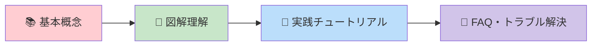
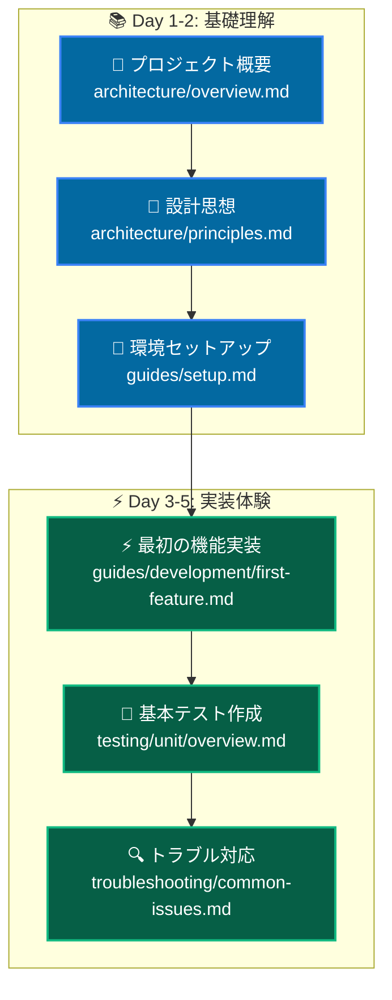
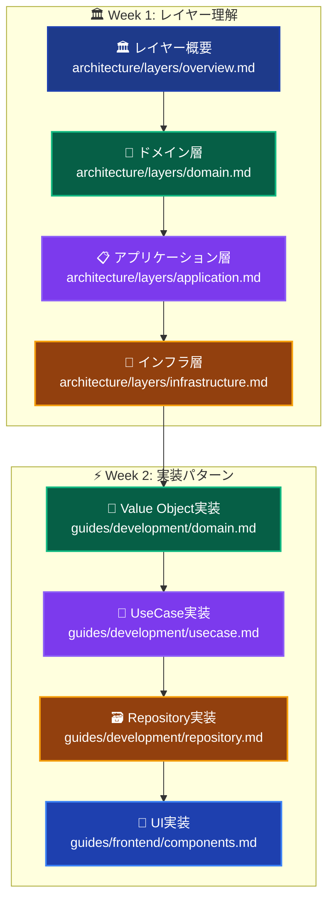
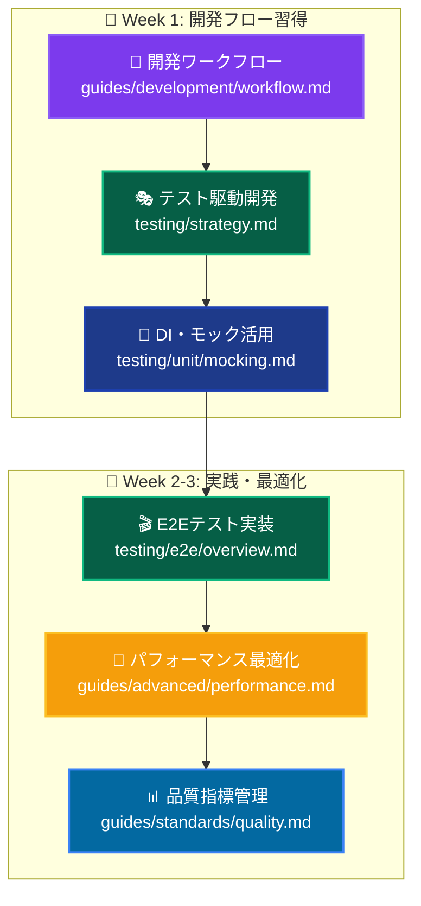
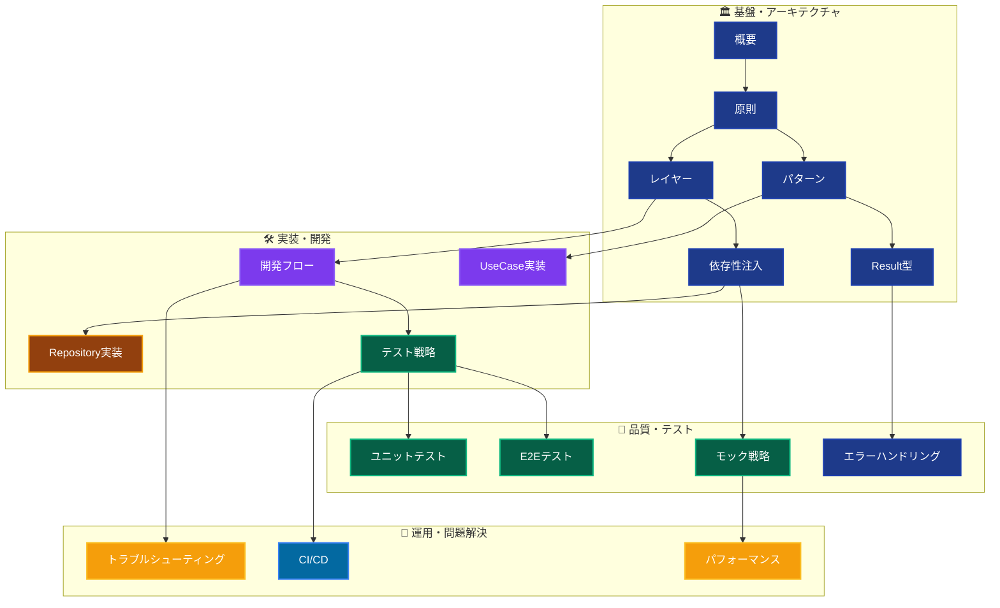

# プロジェクトドキュメンテーション 📚

Next.js 15 + TypeScript + Clean Architecture + DDD の包括的ドキュメンテーション

---

## 🎯 ご自身の状況に合った学習パスをご選択ください

### 🔰 これからClean ArchitectureやDDDを学んでみたい方

**これまで従来のReact開発（useState、useEffect中心）をされていた方向け：**



**👆 まずはここから始めましょう！**

1. **[📚 従来のReactからモダンアーキテクチャへの入門](./guides/beginners/legacy-react-to-modern-architecture.md)**

   - よくある疑問や不安の解消
   - 従来のReact vs モダンアーキテクチャの比較

2. **[🎨 アーキテクチャ図解：ビジュアルで理解](./guides/beginners/architecture-diagrams.md)**

   - 図解でスッキリ理解！全体像を把握
   - データフロー・レイヤー構造を視覚的に理解

3. **[🚀 実践チュートリアル：商品一覧機能を作ってみよう](./guides/beginners/simple-tutorial.md)**

   - 手を動かして体感！実際に機能を実装
   - Clean Architecture の各層を段階的に体験

4. **[🤔 よくある質問とトラブルシューティング](./guides/beginners/legacy-react-faq.md)**
   - よくある疑問・つまづきポイントの解決
   - 緊急時のチートシート

**🎉 これらを読み終えたら、下記の中級者向けセクションへ進んでください！**

---

### 💪 モダンアーキテクチャの経験をお持ちの方

Clean ArchitectureやDDDの経験をお持ちの方は下記からスタート：

---

## 🚀 クイックスタート

### 初めてこのプロジェクトをご覧になる方へ

```
1. 📖 [アーキテクチャ概要](architecture/overview.md) - プロジェクト全体像
2. 🏗️ [開発環境セットアップ](guides/setup.md) - 環境構築手順
3. ⚡ [最初の機能実装](guides/first-feature.md) - 実装チュートリアル
```

### 役割別ガイド

- **👨‍💼 プロジェクトマネージャー** → [プロジェクト概要](architecture/overview.md)
- **🏗️ アーキテクト** → [設計思想と原則](architecture/principles.md)
- **👨‍💻 開発者** → [実装ガイド](guides/development/)
- **🧪 テスター** → [テスト戦略](testing/strategy.md)

---

## 📋 ドキュメント構成

### 🏛️ アーキテクチャ (Architecture)

システム設計と構造の理解

```
architecture/
├── overview.md          # プロジェクト全体像
├── principles.md        # 設計原則とパターン
├── layers/             # レイヤー構成
│   ├── overview.md     # レイヤード アーキテクチャ概要
│   ├── presentation.md # プレゼンテーション層
│   ├── application.md  # アプリケーション層
│   ├── domain.md       # ドメイン層
│   └── infrastructure.md # インフラストラクチャ層
└── patterns/           # 設計パターン
    ├── dependency-injection.md # 依存性注入
    ├── result-pattern.md      # Result型パターン
    └── error-handling.md      # エラーハンドリング
```

### 🛠️ 実装ガイド (Guides)

実際の開発プロセスと手順

```
guides/
├── setup.md            # 開発環境セットアップ
├── development/        # 開発手順
│   ├── workflow.md     # 開発フロー
│   ├── first-feature.md # 最初の機能実装
│   ├── usecase.md      # UseCase実装
│   ├── domain.md       # ドメインオブジェクト実装
│   └── repository.md   # Repository実装
├── frontend/           # フロントエンド実装
│   ├── components.md   # コンポーネント開発
│   ├── server-actions.md # Server Actions
│   └── ui-system.md    # UIシステム
└── standards/          # 開発規約
    ├── coding.md       # コーディング規約
    ├── naming.md       # 命名規則
    └── project-structure.md # プロジェクト構造
```

### 🧪 テスト (Testing)

品質保証とテスト戦略

```
testing/
├── strategy.md         # テスト戦略概要
├── unit/              # ユニットテスト
│   ├── overview.md    # ユニットテスト概要
│   ├── mocking.md     # モック戦略
│   └── patterns.md    # テストパターン
├── integration/       # 統合テスト
│   └── overview.md
└── e2e/              # E2Eテスト
    ├── overview.md
    ├── playwright.md  # Playwright活用
    └── scenarios.md   # テストシナリオ
```

### 🔧 トラブルシューティング (Troubleshooting)

問題解決とFAQ

```
troubleshooting/
├── common-issues.md    # よくある問題
├── development/       # 開発時の問題
│   ├── dependency-injection.md
│   ├── typescript.md
│   └── build.md
├── testing/          # テスト関連問題
│   ├── vitest.md
│   ├── mocking.md
│   └── e2e.md
└── deployment/       # デプロイメント問題
    └── common.md
```

### 📚 リファレンス (Reference)

詳細仕様と技術情報

```
reference/
├── technologies.md    # 使用技術一覧
├── dependencies.md    # 依存関係詳細
├── commands.md        # コマンドリファレンス
├── api/              # API仕様
│   └── internal.md   # 内部API
└── configuration/    # 設定詳細
    ├── environment.md
    ├── database.md
    └── build.md
```

---

## 🎯 段階別学習パス

### 🌱 これから始める方：プロジェクト理解 (3-5日)



**詳細ステップ:**

1. **📖 全体像把握** - [プロジェクト概要](architecture/overview.md) + [技術スタック](reference/technologies.md)
2. **🎯 設計理解** - [設計原則](architecture/principles.md) → [Clean Architecture](architecture/patterns/clean-architecture.md)
3. **🔧 環境構築** - [セットアップ](guides/setup.md) → [コマンド確認](reference/commands.md)
4. **⚡ 実装体験** - [最初の機能](guides/development/first-feature.md) → [コーディング規約](guides/standards/coding.md)
5. **🧪 品質確認** - [テスト基礎](testing/unit/overview.md) → [モック使用法](testing/unit/mocking.md)

### 🚀 実装を始めたい方：レイヤー理解と実装 (1-2週間)



**必須関連読み物:**

- **依存性注入** - [DI基礎](architecture/patterns/dependency-injection.md) → [DI問題解決](troubleshooting/development/dependency-injection.md)
- **エラーハンドリング** - [Result型パターン](architecture/patterns/result-pattern.md) → [エラー処理実装](architecture/patterns/error-handling.md)
- **テスト実装** - [テスト戦略](testing/strategy.md) → [自動モック](testing/unit/mocking.md)

### 🏆 全体的な開発フローを学びたい方 (2-3週間)



### 🎓 アーキテクチャ設計やチーム開発をお考えの方 (1-2週間)

```mermaid
graph LR
    subgraph "🏗️ 設計・アーキテクチャ"
        G1[🏗️ アーキテクチャ設計<br/>architecture/advanced/]
        G2[🔍 設計判断記録<br/>architecture/decisions/]
        G3[📐 パターン応用<br/>architecture/patterns/advanced/]
    end

    subgraph "👥 チーム開発・運用"
        H1[👥 チーム開発フロー<br/>guides/team/collaboration.md]
        H2[🚀 CI/CD最適化<br/>guides/deployment/cicd.md]
        H3[📈 監視・運用<br/>guides/operations/monitoring.md]
    end

    G1 --> G2 --> G3 --> H1 --> H2 --> H3

    style G1 fill:#1e3a8a,stroke:#1e40af,stroke-width:2px,color:#ffffff
    style G2 fill:#0369a1,stroke:#3b82f6,stroke-width:2px,color:#ffffff
    style G3 fill:#065f46,stroke:#10b981,stroke-width:2px,color:#ffffff
    style H1 fill:#7c3aed,stroke:#8b5cf6,stroke-width:2px,color:#ffffff
    style H2 fill:#f59e0b,stroke:#fbbf24,stroke-width:2px,color:#ffffff
    style H3 fill:#0369a1,stroke:#3b82f6,stroke-width:2px,color:#ffffff
```



---

## 🔍 クロスリファレンス・マトリックス

### 📊 ドキュメント関連性マップ



### 🎯 利用目的別ガイド

#### 🚀 **新規機能開発時**

```
前提知識: [アーキテクチャ概要](architecture/overview.md) + [設計原則](architecture/principles.md)
         ↓
実装手順: [開発フロー](guides/development/workflow.md) → [UseCase実装](guides/development/usecase.md)
         ↓
品質確保: [テスト戦略](testing/strategy.md) → [ユニットテスト](testing/unit/overview.md)
         ↓
問題解決: [よくある問題](troubleshooting/common-issues.md)
```

#### 🐛 **バグ修正・トラブル対応時**

```
問題特定: [よくある問題](troubleshooting/common-issues.md) → [分野別トラブル](troubleshooting/)
         ↓
技術調査: [アーキテクチャ原則](architecture/principles.md) → [該当レイヤー](architecture/layers/)
         ↓
修正実装: [開発フロー](guides/development/workflow.md) → [コーディング規約](guides/standards/coding.md)
         ↓
検証: [テスト実装](testing/unit/overview.md) → [CI/CD確認](guides/deployment/)
```

#### 📚 **新メンバー研修時**

```
1日目: [プロジェクト概要](architecture/overview.md) → [環境セットアップ](guides/setup.md)
2日目: [設計原則](architecture/principles.md) → [レイヤー構成](architecture/layers/overview.md)
3日目: [最初の機能実装](guides/development/first-feature.md) → [コーディング規約](guides/standards/coding.md)
1週目: [テスト基礎](testing/unit/overview.md) → [実践演習](guides/development/)
2週目: [開発フロー習得](guides/development/workflow.md) → [チーム開発](guides/team/)
```

#### 🔧 **パフォーマンス改善時**

```
現状分析: [アーキテクチャ原則](architecture/principles.md) → [品質指標](guides/standards/quality.md)
         ↓
ボトルネック特定: [テスト戦略](testing/strategy.md) → [E2Eテスト](testing/e2e/overview.md)
         ↓
最適化実装: [パフォーマンス最適化](guides/advanced/performance.md) → [依存性注入最適化](architecture/patterns/dependency-injection.md)
         ↓
効果測定: [監視・運用](guides/operations/monitoring.md)
```

### 📋 **頻出組み合わせ**

| 主要タスク         | 必読ドキュメント                                    | 関連ドキュメント                                                                                                      | トラブル対応                                                  |
| ------------------ | --------------------------------------------------- | --------------------------------------------------------------------------------------------------------------------- | ------------------------------------------------------------- |
| **新UseCase作成**  | [UseCase実装](guides/development/usecase.md)        | [Result型パターン](architecture/patterns/result-pattern.md) + [DI設定](architecture/patterns/dependency-injection.md) | [DI問題](troubleshooting/development/dependency-injection.md) |
| **Repository追加** | [Repository実装](guides/development/repository.md)  | [インフラ層](architecture/layers/infrastructure.md) + [テスト戦略](testing/strategy.md)                               | [DB問題](troubleshooting/development/database.md)             |
| **UI実装**         | [コンポーネント開発](guides/frontend/components.md) | [Server Actions](guides/frontend/server-actions.md) + [UIシステム](guides/frontend/ui-system.md)                      | [フロントエンド問題](troubleshooting/frontend/)               |
| **テスト追加**     | [ユニットテスト](testing/unit/overview.md)          | [モック戦略](testing/unit/mocking.md) + [テストパターン](testing/unit/patterns.md)                                    | [テスト問題](troubleshooting/testing/)                        |
| **E2E実装**        | [E2E概要](testing/e2e/overview.md)                  | [Playwright活用](testing/e2e/playwright.md) + [シナリオ設計](testing/e2e/scenarios.md)                                | [E2E問題](troubleshooting/testing/e2e.md)                     |

### 🔍 **よく使用されるドキュメント**

#### 📋 **日常開発 (毎日)**

- [開発フロー](guides/development/workflow.md) - 機能開発の標準手順
- [コーディング規約](guides/standards/coding.md) - 実装ルールとベストプラクティス
- [コマンドリファレンス](reference/commands.md) - 開発・テスト・ビルドコマンド
- [テスト作成](testing/unit/overview.md) - 品質保証の基本

#### 🐛 **問題解決 (週2-3回)**

- [よくある問題](troubleshooting/common-issues.md) - FAQ と解決策
- [DI関連問題](troubleshooting/development/dependency-injection.md) - 依存性注入トラブル
- [テスト問題](troubleshooting/testing/) - テスト関連問題解決
- [ビルド問題](troubleshooting/development/build.md) - ビルド・デプロイエラー

#### 🔧 **設定・環境 (プロジェクト開始時)**

- [環境セットアップ](guides/setup.md) - 初期環境構築
- [設定詳細](reference/configuration/) - 各種設定ファイル説明
- [技術スタック詳細](reference/technologies.md) - 使用技術の理解

#### 📚 **学習・理解 (月1-2回)**

- [アーキテクチャ概要](architecture/overview.md) - システム全体理解
- [設計原則](architecture/principles.md) - 設計思想の深化
- [テスト戦略](testing/strategy.md) - 品質保証戦略の理解

---

## 📊 プロジェクト概要

### 🚀 主要技術

- **Framework**: Next.js 15 + React 19
- **Language**: TypeScript 5.x
- **Architecture**: Clean Architecture + DDD
- **Database**: SQLite + Prisma 5.x
- **Testing**: Vitest + Playwright
- **UI**: TailwindCSS + shadcn/ui + **統一スタイルシステム**
- **Component Structure**: 機能別モジュール構成 (feature-based organization)

### 🎯 特徴的な実装

- **🎨 統一スタイルシステム**: Aurora Gradient System統合・57%コード削減達成
- **🏗️ 機能別コンポーネント構成**: `features/`、`common/`、`layout/`による明確な責務分離
- **Result型パターン**: 型安全なエラーハンドリング
- **分離DIコンテナ**: レイヤー別サービス管理
- **shadcn/ui統合**: Enhanced Components Bridge System
- **自動モックテスト**: vitest-mock-extended活用
- **包括的E2Eテスト**: セキュリティ監視含む

### 📈 品質指標

- **テストカバレッジ**: Application 94%+ / Domain 90%+ / Infrastructure 85%+
- **E2Eテスト**: 8シナリオ (セキュリティ監視含む)
- **アーキテクチャ準拠率**: 100% (全UseCase)
- **自動化率**: 100% (ビルド・テスト・デプロイ)

---

## 💡 貢献とフィードバック

### ドキュメント改善

- 👥 不明な点や改善提案は Issues で報告
- 📝 ドキュメント更新は Pull Request で提出
- 🤝 レビューと議論を通じて品質向上

### 開発参加

- 🏗️ 新機能開発は [開発フロー](guides/development/workflow.md) に従う
- 🧪 テスト作成は [テスト戦略](testing/strategy.md) を確認
- 📋 コーディング規約は [標準](guides/standards/) を参照

---

**📚 このドキュメンテーションで、効率的で品質の高い開発体験を実現しましょう！**
