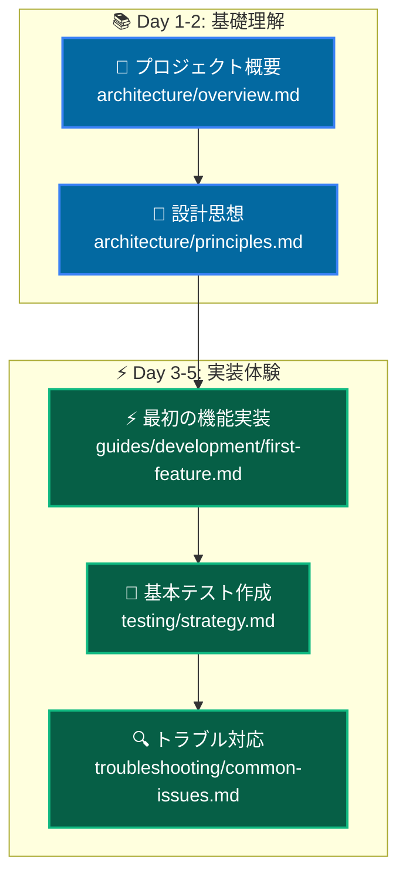
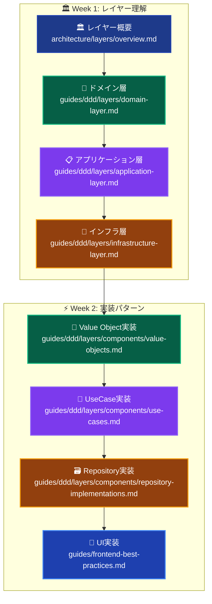
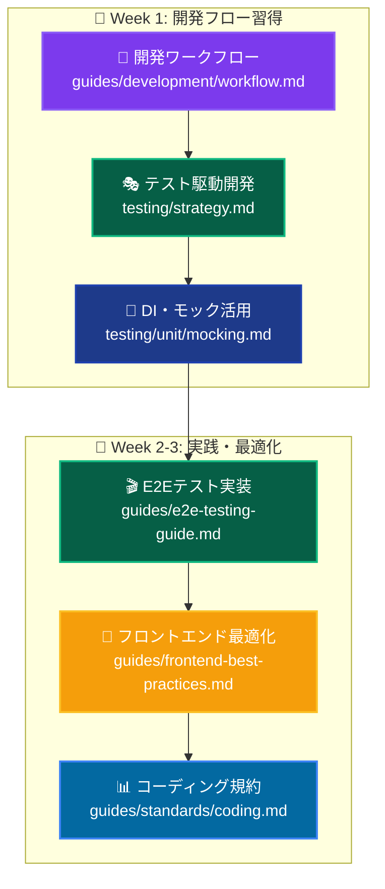
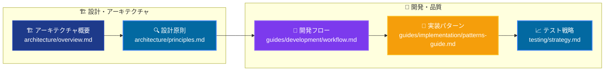
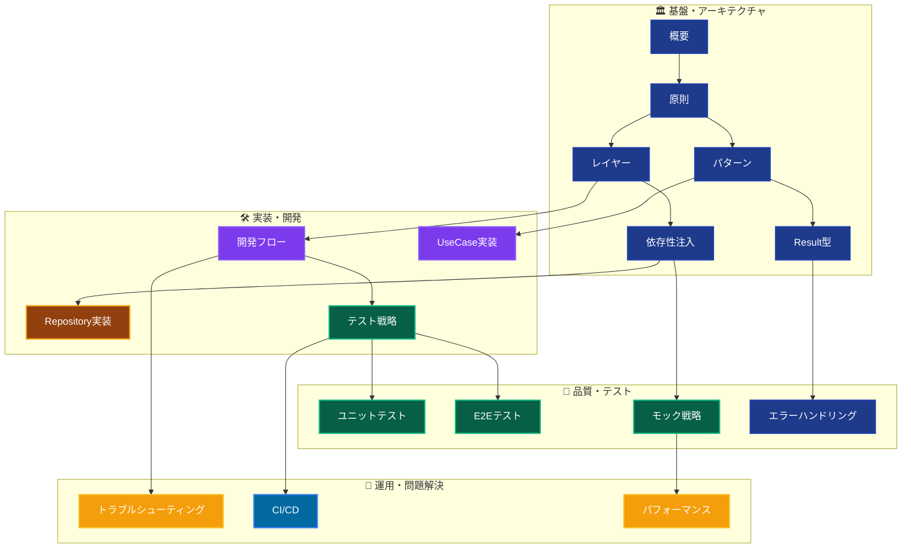

# プロジェクトドキュメンテーション 📚

Next.js 16 + TypeScript + Clean Architecture + DDD の包括的ドキュメンテーション

> **⚠️ `_DOCS/` は不可侵領域（読み取り専用）**
>
> このディレクトリはテンプレート配布物です。テンプレートを適用したプロジェクトでは編集・追加・削除を一切禁止します。
> ローカルで編集しても次回の `sup-next` 実行時に rsync で無告知に上書き消失します。
> 修正はテンプレ配布リポジトリ（ルートディレクトリ名 `d-next-template-debug`）側の `_DOCS/` に入れ、
> 各プロジェクトで `sup-next` を再実行して配布してください。
> プロジェクト固有のドキュメントは `_DOCS/` の外に置きます。

---

## 🎯 ご自身の状況に合った学習パスをご選択ください

---

## 🚀 クイックスタート

### 初めてこのプロジェクトをご覧になる方へ

```
1. 📖 [アーキテクチャ概要](architecture/overview.md) - プロジェクト全体像
2. ⚡ [最初の機能実装](guides/development/first-feature.md) - 実装チュートリアル
```

### 役割別ガイド

- **👨‍💼 プロジェクトマネージャー** → [プロジェクト概要](architecture/overview.md)
- **🏗️ アーキテクト** → [設計思想と原則](architecture/principles.md)
- **👨‍💻 開発者** → [開発フロー](guides/development/workflow.md) + [実装パターン](guides/implementation/patterns-guide.md)
- **🧪 テスター** → [テスト戦略](testing/strategy.md)

---

## 📋 ドキュメント構成

### 🏛️ アーキテクチャ (Architecture)

システム設計と構造の理解

```
architecture/
├── overview.md          # プロジェクト全体像
├── principles.md        # 設計原則とパターン
├── layers/             # レイヤー構成
│   └── overview.md     # レイヤード アーキテクチャ概要
└── patterns/           # 設計パターン
    └── dependency-injection.md # 依存性注入
```

### 🛠️ 実装ガイド (Guides)

実際の開発プロセスと手順

```
guides/
├── code-generator.md    # コード生成ツール (Hygen)
├── development/         # 開発手順
│   ├── workflow.md      # 開発フロー
│   └── first-feature.md # 最初の機能実装
├── ddd/                 # Clean Architecture + DDD 詳細ガイド
│   ├── concepts/        # 設計概念
│   │   ├── clean-architecture.md
│   │   ├── domain-driven-design.md
│   │   └── whats-di.md
│   ├── layers/          # レイヤー別実装ガイド
│   │   ├── components/  # コンポーネント別実装詳細
│   │   │   ├── use-cases.md
│   │   │   ├── entities.md
│   │   │   ├── value-objects.md
│   │   │   ├── repository-interfaces.md
│   │   │   ├── repository-implementations.md
│   │   │   ├── server-actions.md
│   │   │   ├── di-container.md
│   │   │   └── security-services.md
│   │   ├── domain-layer.md
│   │   ├── application-layer.md
│   │   ├── infrastructure-layer.md
│   │   └── presentation-layer.md
│   └── cross-cutting/   # 横断的関心事
│       ├── error-handling.md
│       ├── logging-strategy.md
│       └── security.md
├── implementation/      # 実装パターンガイド
│   ├── decision-guide.md
│   └── patterns-guide.md
├── standards/           # 開発規約
│   ├── coding.md        # コーディング規約
│   ├── naming.md        # 命名規則
│   └── project-structure.md # プロジェクト構造
└── その他
    ├── frontend-best-practices.md  # フロントエンド実装
    ├── e2e-testing-guide.md        # E2Eテスト
    └── nextjs-integration-patterns.md  # Next.js統合
```

### 🧪 テスト (Testing)

品質保証とテスト戦略

```
testing/
├── strategy.md         # テスト戦略概要
└── unit/              # ユニットテスト
    ├── overview.md    # ユニットテスト概要
    └── mocking.md     # モック戦略
```

> **Note**: E2Eテストの詳細は [guides/e2e-testing-guide.md](guides/e2e-testing-guide.md) を参照

### 🔧 トラブルシューティング (Troubleshooting)

問題解決とFAQ

```
troubleshooting/
├── common-issues.md    # よくある問題
└── development/       # 開発時の問題
    ├── email-validation-issues.md
    ├── entity-timestamp-comparison.md
    ├── mermaid-special-characters.md
    ├── prisma-mock-setup.md
    ├── usecase-validation-logic.md
    └── vitest-mock-extended-setup.md
```

### 📚 リファレンス (Reference)

詳細仕様と技術情報

```
reference/
├── technologies.md           # 使用技術一覧
├── commands.md               # コマンドリファレンス
└── environment-variables.md  # 環境変数リファレンス
```

---

## 🎯 段階別学習パス

### 🌱 これから始める方：プロジェクト理解 (3-5日)


```mermaid
graph TB
    subgraph "📚 Day 1-2: 基礎理解"
        A1[📖 プロジェクト概要<br/>architecture/overview.md]
        A2[🎯 設計思想<br/>architecture/principles.md]
    end

    subgraph "⚡ Day 3-5: 実装体験"
        B1[⚡ 最初の機能実装<br/>guides/development/first-feature.md]
        B2[🧪 基本テスト作成<br/>testing/strategy.md]
        B3[🔍 トラブル対応<br/>troubleshooting/common-issues.md]
    end

    A1 --> A2 --> B1 --> B2 --> B3

    style A1 fill:#0369a1,stroke:#3b82f6,stroke-width:2px,color:#ffffff
    style A2 fill:#0369a1,stroke:#3b82f6,stroke-width:2px,color:#ffffff
    style B1 fill:#065f46,stroke:#10b981,stroke-width:2px,color:#ffffff
    style B2 fill:#065f46,stroke:#10b981,stroke-width:2px,color:#ffffff
    style B3 fill:#065f46,stroke:#10b981,stroke-width:2px,color:#ffffff
```

**詳細ステップ:**

1. **📖 全体像把握** - [プロジェクト概要](architecture/overview.md) + [技術スタック](reference/technologies.md)
2. **🎯 設計理解** - [設計原則](architecture/principles.md) → [Clean Architecture](guides/ddd/concepts/clean-architecture.md)
3. **🔧 環境確認** - [コマンドリファレンス](reference/commands.md)
4. **⚡ 実装体験** - [最初の機能](guides/development/first-feature.md) → [コーディング規約](guides/standards/coding.md)
5. **🧪 品質確認** - [テスト戦略](testing/strategy.md) → [モック使用法](testing/unit/mocking.md)

### 🚀 実装を始めたい方：レイヤー理解と実装 (1-2週間)


```mermaid
graph TB
    subgraph "🏛️ Week 1: レイヤー理解"
        C1[🏛️ レイヤー概要<br/>architecture/layers/overview.md]
        C2[👑 ドメイン層<br/>guides/ddd/layers/domain-layer.md]
        C3[📋 アプリケーション層<br/>guides/ddd/layers/application-layer.md]
        C4[🔧 インフラ層<br/>guides/ddd/layers/infrastructure-layer.md]
    end

    subgraph "⚡ Week 2: 実装パターン"
        D1[💎 Value Object実装<br/>guides/ddd/layers/components/value-objects.md]
        D2[🎯 UseCase実装<br/>guides/ddd/layers/components/use-cases.md]
        D3[🗃️ Repository実装<br/>guides/ddd/layers/components/repository-implementations.md]
        D4[🎨 UI実装<br/>guides/frontend-best-practices.md]
    end

    C1 --> C2 --> C3 --> C4 --> D1 --> D2 --> D3 --> D4

    style C1 fill:#1e3a8a,stroke:#1e40af,stroke-width:2px,color:#ffffff
    style C2 fill:#065f46,stroke:#10b981,stroke-width:2px,color:#ffffff
    style C3 fill:#7c3aed,stroke:#8b5cf6,stroke-width:2px,color:#ffffff
    style C4 fill:#92400e,stroke:#f59e0b,stroke-width:2px,color:#ffffff
    style D1 fill:#065f46,stroke:#10b981,stroke-width:2px,color:#ffffff
    style D2 fill:#7c3aed,stroke:#8b5cf6,stroke-width:2px,color:#ffffff
    style D3 fill:#92400e,stroke:#f59e0b,stroke-width:2px,color:#ffffff
    style D4 fill:#1e40af,stroke:#3b82f6,stroke-width:2px,color:#ffffff
```

**必須関連読み物:**

- **依存性注入** - [DI基礎](architecture/patterns/dependency-injection.md) → [DIコンテナ](guides/ddd/layers/components/di-container.md)
- **エラーハンドリング** - [エラー処理](guides/ddd/cross-cutting/error-handling.md) (Result型パターン含む)
- **テスト実装** - [テスト戦略](testing/strategy.md) → [自動モック](testing/unit/mocking.md)

### 🏆 全体的な開発フローを学びたい方 (2-3週間)


```mermaid
graph TB
    subgraph "🔄 Week 1: 開発フロー習得"
        E1[🔄 開発ワークフロー<br/>guides/development/workflow.md]
        E2[🎭 テスト駆動開発<br/>testing/strategy.md]
        E3[🧩 DI・モック活用<br/>testing/unit/mocking.md]
    end

    subgraph "🚀 Week 2-3: 実践・最適化"
        F1[🎬 E2Eテスト実装<br/>guides/e2e-testing-guide.md]
        F2[🔧 フロントエンド最適化<br/>guides/frontend-best-practices.md]
        F3[📊 コーディング規約<br/>guides/standards/coding.md]
    end

    E1 --> E2 --> E3 --> F1 --> F2 --> F3

    style E1 fill:#7c3aed,stroke:#8b5cf6,stroke-width:2px,color:#ffffff
    style E2 fill:#065f46,stroke:#10b981,stroke-width:2px,color:#ffffff
    style E3 fill:#1e3a8a,stroke:#1e40af,stroke-width:2px,color:#ffffff
    style F1 fill:#065f46,stroke:#10b981,stroke-width:2px,color:#ffffff
    style F2 fill:#f59e0b,stroke:#fbbf24,stroke-width:2px,color:#ffffff
    style F3 fill:#0369a1,stroke:#3b82f6,stroke-width:2px,color:#ffffff
```

### 🎓 アーキテクチャ設計やチーム開発をお考えの方 (1-2週間)


```mermaid
graph LR
    subgraph "🏗️ 設計・アーキテクチャ"
        G1[🏗️ アーキテクチャ概要<br/>architecture/overview.md]
        G2[🔍 設計原則<br/>architecture/principles.md]
    end

    subgraph "👥 開発・品質"
        H1[👥 開発フロー<br/>guides/development/workflow.md]
        H2[🚀 実装パターン<br/>guides/implementation/patterns-guide.md]
        H3[📈 テスト戦略<br/>testing/strategy.md]
    end

    G1 --> G2 --> H1 --> H2 --> H3

    style G1 fill:#1e3a8a,stroke:#1e40af,stroke-width:2px,color:#ffffff
    style G2 fill:#0369a1,stroke:#3b82f6,stroke-width:2px,color:#ffffff
    style H1 fill:#7c3aed,stroke:#8b5cf6,stroke-width:2px,color:#ffffff
    style H2 fill:#f59e0b,stroke:#fbbf24,stroke-width:2px,color:#ffffff
    style H3 fill:#0369a1,stroke:#3b82f6,stroke-width:2px,color:#ffffff
```

---

## 🔍 クロスリファレンス・マトリックス

### 📊 ドキュメント関連性マップ


```mermaid
graph TB
    subgraph "🏛️ 基盤・アーキテクチャ"
        ARCH[概要] --> PRIN[原則] --> LAYER[レイヤー]
        PRIN --> PATTERNS[パターン]
        LAYER --> DI[依存性注入]
        PATTERNS --> RESULT[Result型]
    end

    subgraph "🛠️ 実装・開発"
        LAYER --> DEV[開発フロー]
        PATTERNS --> UC[UseCase実装]
        DI --> REPO[Repository実装]
        DEV --> TEST[テスト戦略]
    end

    subgraph "🧪 品質・テスト"
        TEST --> UNIT[ユニットテスト]
        TEST --> E2E[E2Eテスト]
        DI --> MOCK[モック戦略]
        RESULT --> ERROR[エラーハンドリング]
    end

    subgraph "🔧 運用・問題解決"
        DEV --> TROUBLE[トラブルシューティング]
        TEST --> CI[CI/CD]
        MOCK --> PERF[パフォーマンス]
    end

    style ARCH fill:#1e3a8a,stroke:#1e40af,stroke-width:2px,color:#ffffff
    style PRIN fill:#1e3a8a,stroke:#1e40af,stroke-width:2px,color:#ffffff
    style LAYER fill:#1e3a8a,stroke:#1e40af,stroke-width:2px,color:#ffffff
    style PATTERNS fill:#1e3a8a,stroke:#1e40af,stroke-width:2px,color:#ffffff
    style DI fill:#1e3a8a,stroke:#1e40af,stroke-width:2px,color:#ffffff
    style RESULT fill:#1e3a8a,stroke:#1e40af,stroke-width:2px,color:#ffffff
    style DEV fill:#7c3aed,stroke:#8b5cf6,stroke-width:2px,color:#ffffff
    style UC fill:#7c3aed,stroke:#8b5cf6,stroke-width:2px,color:#ffffff
    style REPO fill:#92400e,stroke:#f59e0b,stroke-width:2px,color:#ffffff
    style TEST fill:#065f46,stroke:#10b981,stroke-width:2px,color:#ffffff
    style UNIT fill:#065f46,stroke:#10b981,stroke-width:2px,color:#ffffff
    style E2E fill:#065f46,stroke:#10b981,stroke-width:2px,color:#ffffff
    style MOCK fill:#065f46,stroke:#10b981,stroke-width:2px,color:#ffffff
    style ERROR fill:#1e3a8a,stroke:#1e40af,stroke-width:2px,color:#ffffff
    style TROUBLE fill:#f59e0b,stroke:#fbbf24,stroke-width:2px,color:#ffffff
    style CI fill:#0369a1,stroke:#3b82f6,stroke-width:2px,color:#ffffff
    style PERF fill:#f59e0b,stroke:#fbbf24,stroke-width:2px,color:#ffffff
```

### 🎯 利用目的別ガイド

#### 🚀 **新規機能開発時**

```
前提知識: [アーキテクチャ概要](architecture/overview.md) + [設計原則](architecture/principles.md)
         ↓
実装手順: [開発フロー](guides/development/workflow.md) → [UseCase実装](guides/ddd/layers/components/use-cases.md)
         ↓
品質確保: [テスト戦略](testing/strategy.md) → [モック戦略](testing/unit/mocking.md)
         ↓
問題解決: [よくある問題](troubleshooting/common-issues.md)
```

#### 🐛 **バグ修正・トラブル対応時**

```
問題特定: [よくある問題](troubleshooting/common-issues.md) → [開発時の問題](troubleshooting/development/)
         ↓
技術調査: [アーキテクチャ原則](architecture/principles.md) → [レイヤー概要](architecture/layers/overview.md)
         ↓
修正実装: [開発フロー](guides/development/workflow.md) → [コーディング規約](guides/standards/coding.md)
         ↓
検証: [テスト戦略](testing/strategy.md)
```

#### 📚 **新メンバー研修時**

```
1日目: [プロジェクト概要](architecture/overview.md) → [コマンドリファレンス](reference/commands.md)
2日目: [設計原則](architecture/principles.md) → [レイヤー構成](architecture/layers/overview.md)
3日目: [最初の機能実装](guides/development/first-feature.md) → [コーディング規約](guides/standards/coding.md)
1週目: [テスト戦略](testing/strategy.md) → [開発フロー](guides/development/workflow.md)
2週目: [DDD概念](guides/ddd/concepts/clean-architecture.md) → [実装パターン](guides/implementation/patterns-guide.md)
```

#### 🔧 **パフォーマンス改善時**

```
現状分析: [アーキテクチャ原則](architecture/principles.md) → [コーディング規約](guides/standards/coding.md)
         ↓
ボトルネック特定: [テスト戦略](testing/strategy.md) → [E2Eテスト](guides/e2e-testing-guide.md)
         ↓
最適化実装: [フロントエンド最適化](guides/frontend-best-practices.md) → [DI最適化](architecture/patterns/dependency-injection.md)
         ↓
効果測定: [テスト戦略](testing/strategy.md)
```

### 📋 **頻出組み合わせ**

| 主要タスク         | 必読ドキュメント                                                             | 関連ドキュメント                                                                                                                         | トラブル対応                                                           |
| ------------------ | ---------------------------------------------------------------------------- | ---------------------------------------------------------------------------------------------------------------------------------------- | ---------------------------------------------------------------------- |
| **新UseCase作成**  | [UseCase実装](guides/ddd/layers/components/use-cases.md)                     | [エラーハンドリング](guides/ddd/cross-cutting/error-handling.md) + [DI設定](architecture/patterns/dependency-injection.md)               | [よくある問題](troubleshooting/common-issues.md)                       |
| **Repository追加** | [Repository実装](guides/ddd/layers/components/repository-implementations.md) | [インフラ層](guides/ddd/layers/infrastructure-layer.md) + [テスト戦略](testing/strategy.md)                                              | [Prisma問題](troubleshooting/development/prisma-mock-setup.md)         |
| **UI実装**         | [フロントエンド](guides/frontend-best-practices.md)                          | [Server Actions](guides/ddd/layers/components/server-actions.md) + [フロントエンド](guides/frontend-best-practices.md)                   | [よくある問題](troubleshooting/common-issues.md)                       |
| **テスト追加**     | [テスト戦略](testing/strategy.md)                                            | [モック戦略](testing/unit/mocking.md) + [Clean Architecture Testing](guides/testing-with-clean-architecture.md)                          | [vitest-mock設定](troubleshooting/development/vitest-mock-extended-setup.md) |
| **E2E実装**        | [E2Eテストガイド](guides/e2e-testing-guide.md)                               | [テスト戦略](testing/strategy.md)                                                                                                        | [よくある問題](troubleshooting/common-issues.md)                       |

### 🔍 **よく使用されるドキュメント**

#### 📋 **日常開発 (毎日)**

- [開発フロー](guides/development/workflow.md) - 機能開発の標準手順
- [コーディング規約](guides/standards/coding.md) - 実装ルールとベストプラクティス
- [コマンドリファレンス](reference/commands.md) - 開発・テスト・ビルドコマンド
- [テスト戦略](testing/strategy.md) - 品質保証の基本

#### 🐛 **問題解決 (週2-3回)**

- [よくある問題](troubleshooting/common-issues.md) - FAQ と解決策
- [DIコンテナ](guides/ddd/layers/components/di-container.md) - 依存性注入の仕組み
- [Prismaモック設定](troubleshooting/development/prisma-mock-setup.md) - DBテスト問題
- [vitest-mock設定](troubleshooting/development/vitest-mock-extended-setup.md) - モック関連問題

#### 🔧 **設定・環境 (プロジェクト開始時)**

- [技術スタック詳細](reference/technologies.md) - 使用技術の理解
- [プロジェクト構造](guides/standards/project-structure.md) - ディレクトリ構成
- [コマンドリファレンス](reference/commands.md) - 開発コマンド一覧

#### 📚 **学習・理解 (月1-2回)**

- [アーキテクチャ概要](architecture/overview.md) - システム全体理解
- [設計原則](architecture/principles.md) - 設計思想の深化
- [テスト戦略](testing/strategy.md) - 品質保証戦略の理解

---

## 📊 プロジェクト概要

### 🚀 主要技術

- **Framework**: Next.js 16 + React 19
- **Language**: TypeScript 6
- **Architecture**: Clean Architecture + DDD
- **Database**: PostgreSQL + Prisma 7.x
- **Testing**: Vitest + Playwright
- **Linting**: Biome
- **UI**: TailwindCSS v4.2+ + shadcn/ui + **統一スタイルシステム**
- **Component Structure**: 機能別モジュール構成 (feature-based organization)

### 🎯 特徴的な実装

- **🎨 統一スタイルシステム**: Aurora Gradient System統合・57%コード削減達成
- **🏗️ 機能別コンポーネント構成**: `features/`、`common/`、`layout/`による明確な責務分離
- **Result型パターン**: 型安全なエラーハンドリング
- **分離DIコンテナ**: レイヤー別サービス管理
- **shadcn/ui統合**: Enhanced Components Bridge System
- **自動モックテスト**: vitest-mock-extended活用
- **包括的E2Eテスト**: セキュリティ監視含む

### 📈 品質指標

- **テストカバレッジ**: Application 94%+ / Domain 90%+ / Infrastructure 85%+
- **E2Eテスト**: 8シナリオ (セキュリティ監視含む)
- **アーキテクチャ準拠率**: 100% (全UseCase)
- **自動化率**: 100% (ビルド・テスト・デプロイ)

---

## 💡 貢献とフィードバック

### ドキュメント改善

- 👥 不明な点や改善提案はテンプレ配布リポジトリ `d-next-template-debug` の Issues で報告
- 📝 修正はテンプレ配布リポジトリ `d-next-template-debug` 側の `_DOCS/` に Pull Request を出す
- 🔁 反映は各プロジェクトで `sup-next` を再実行
- 📌 プロジェクト固有の記述は `_DOCS/` の外に置く（ここには書かない）

### 開発参加

- 🏗️ 新機能開発は [開発フロー](guides/development/workflow.md) に従う
- 🧪 テスト作成は [テスト戦略](testing/strategy.md) を確認
- 📋 コーディング規約は [標準](guides/standards/) を参照

---

**📚 このドキュメンテーションで、効率的で品質の高い開発体験を実現しましょう！**
