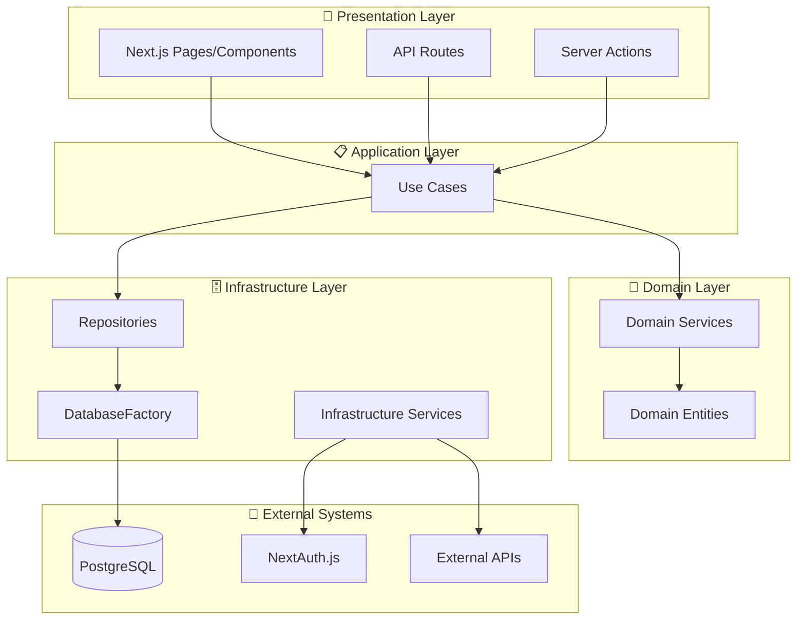

# アーキテクチャ概要 🏛️

このドキュメントでは、プロジェクトで採用しているClean Architecture + DDD (Domain-Driven Design) の設計思想と全体像について説明します。

---

## 設計思想

### 📐 基本原則

- **依存関係の逆転** - 上位レイヤーが下位レイヤーに依存しない
- **関心の分離** - 各レイヤーが明確な責務を持つ
- **ビジネスロジックの独立性** - 外部システムに依存しないドメイン層
- **テスタビリティ** - DIによる高いテスト容易性

### 🎯 アーキテクチャの特徴

- TSyringeによる**型安全なDI**
- インターフェース駆動開発
- DatabaseFactoryによる責任の分離
- UseCaseパターンによるフロー制御

---

## レイヤー構成



---

## 各レイヤーの責務

### 🎨 Presentation Layer

**責務**: ユーザーインターフェース・API公開

- Next.jsページコンポーネント
- API Routes (RESTエンドポイント)
- Server Actions (フォーム処理等)

**実装例参照**:

- [ページコンポーネント](../../src/app/page.tsx)
- [Server Actions](../../src/data-accesses/mutations/)

### 📋 Application Layer (Use Cases)

**責務**: アプリケーションフローの制御・ユースケースの実装

- ビジネスフローのオーケストレーション
- トランザクション管理
- ログ出力・エラーハンドリング

**パターン**:

1. ドメインサービスでビジネスルール検証
2. リポジトリでデータ操作
3. 結果の返却

**実装例参照**:

- [CreateUserUseCase](../../src/usecases/user/CreateUserUseCase.ts)
- [SignInUseCase](../../src/usecases/auth/SignInUseCase.ts)

### 🧠 Domain Layer

**責務**: ビジネスロジック・ドメインルールの実装

- **Domain Services**: ビジネスルール・検証ロジック
- **Domain Entities**: データ構造・エンティティ定義
- **外部システムに依存しない**純粋なビジネスロジック

**実装例参照**:

- [UserDomainService](../../src/services/domain/UserDomainService.ts)

### 🗄️ Infrastructure Layer  

**責務**: 外部システム連携・技術的関心事

- **Repositories**: データアクセスの抽象化
- **Infrastructure Services**: 外部API・技術サービス
- **DatabaseFactory**: データベース接続管理

**実装例参照**:

- [PrismaUserRepository](../../src/repositories/implementations/PrismaUserRepository.ts)
- [DatabaseFactory](../../src/data-accesses/infra/DatabaseFactory.ts)

---

## データフロー

### 1. ユーザー操作 → UseCase実行

```
Client Component → Server Action → UseCase
```

### 2. ビジネスロジック検証

```
UseCase → Domain Service → Validation
```

### 3. データ操作

```
UseCase → Repository → DatabaseFactory → Database
```

### 4. 結果返却

```
Database → Repository → UseCase → Presentation
```

---

## 重要な設計パターン

### DatabaseFactory パターン

- PrismaClientの責任を持った生成・管理
- Dependency Inversion Principleに準拠
- シングルトンパターンによる効率的接続管理

参考実装: [DatabaseFactory](../../src/data-accesses/infra/DatabaseFactory.ts)

### Repository パターン  

- データアクセスの抽象化
- インターフェース駆動による疎結合
- テスト時のモック化が容易

参考実装: [リポジトリ実装](../../src/repositories/implementations/)

### UseCase パターン

- アプリケーションフローの明確化
- 単一責任原則に基づく設計
- トランザクション境界の明確化

参考実装: [UseCases](../../src/usecases/)

---

## DI (Dependency Injection) 統合

このアーキテクチャは**TSyringe**による型安全なDIと統合されています。

### 分離DIコンテナアーキテクチャ

本プロジェクトはClean Architectureの層に基づいてDIコンテナを分離しています：

```
Core Container (基盤層)
└── Infrastructure Container (インフラ層) 
    └── Domain Container (ドメイン層)
        └── Application Container (アプリケーション層)
```

**特徴**:

- **循環依存の防止**: 各層が下位層のみに依存
- **責任の分離**: 層ごとに適切なサービスを管理
- **スケーラビリティ**: 新しいサービスの追加が容易

**注入パターン**:

- **サービス層**: コンストラクター注入（`@inject`）を使用
- **Server Action/Component**: `resolve()` 関数を使用

詳細は [dependency-injection.md](./dependency-injection.md) を参照してください。
