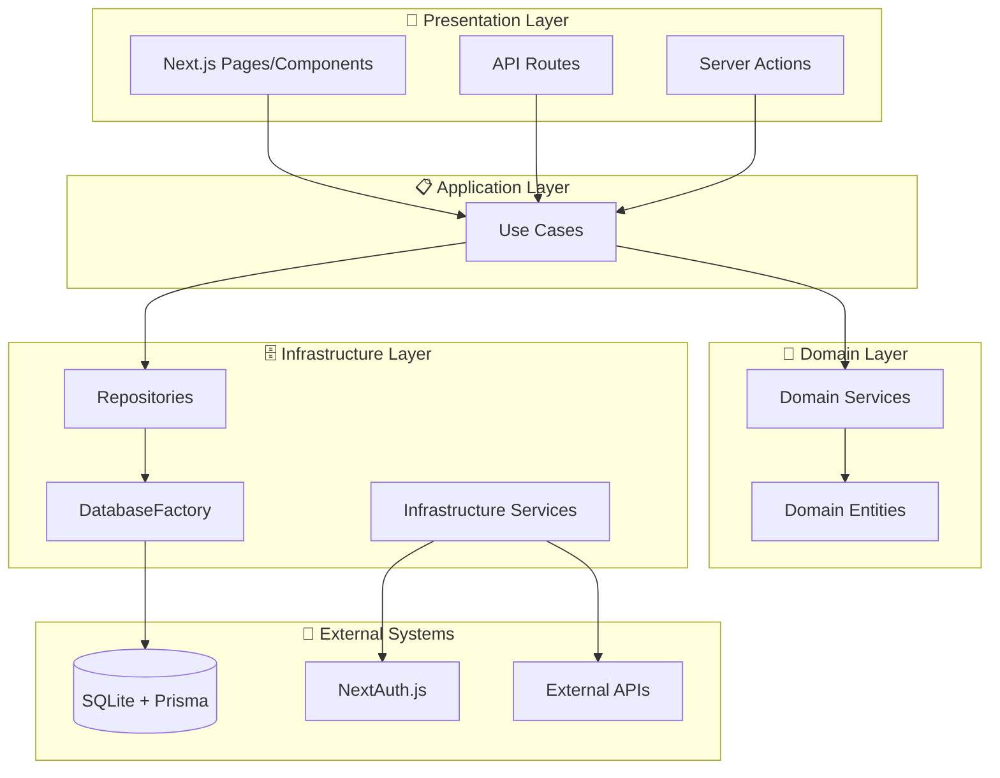

# アーキテクチャ概要 🏛️

Next.js 15 + TypeScript + Clean Architecture + DDDベースのモダンWebアプリケーション。

## 🚀 プロジェクト特徴

- **Next.js 15 + Turbopack**: 最新の高速開発環境
- **Result型パターン**: 例外処理を排除した型安全なエラーハンドリング
- **Aurora Gradient System**: 2024年デザイントレンドを取り入れたUI
- **shadcn/ui統合**: Enhanced Components + Bridge System による統合開発体験
- **vitest-mock-extended**: 自動モック生成による高品質テスト
- **TailwindCSS v4**: 最新CSS-in-JSアプローチ
- **Server Actions優先**: クライアントコンポーネント最小化設計

---

## 設計思想

### 📐 基本原則

- **依存関係の逆転** - 上位レイヤーが下位レイヤーに依存しない
- **関心の分離** - 各レイヤーが明確な責務を持つ
- **ビジネスロジックの独立性** - 外部システムに依存しないドメイン層
- **テスタビリティ** - DIによる高いテスト容易性

### 🎯 アーキテクチャの特徴

- **Result型統一エラーハンドリング**: 例外処理を排除し型安全性を実現
- **TSyringeによる型安全なDI**: 分離コンテナによる層別サービス管理
- **Aurora Gradient System**: 統一されたブランドデザインシステム
- **Enhanced Components**: shadcn/ui + 既存システムの融合
- **vitest-mock-extended**: 完全自動化されたタイプセーフテスト
- **Server Actions中心**: RSC優先でパフォーマンス最適化

---

## レイヤー構成



---

## 各レイヤーの責務

### 🎨 Presentation Layer

**責務**: ユーザーインターフェース・API公開

- Next.jsページコンポーネント
- API Routes (RESTエンドポイント)
- Server Actions (フォーム処理等)

**実装例参照**:

- [ページコンポーネント](../../src/app/page.tsx)
- [Server Actions](../../src/app/server-actions/)
- [Aurora Gradient System](../../src/app/globals.css)
- [Enhanced Components](../../src/components/ui-shadcn/)
- [Bridge System](../../src/components/ui-bridge/)

### 📋 Application Layer (Use Cases)

**責務**: アプリケーションフローの制御・ユースケースの実装

- **Result型による統一エラーハンドリング**: `Promise<Result<T>>`戻り値
- **ビジネスフローオーケストレーション**: 複数サービスの協調
- **トランザクション管理**: データ整合性保証
- **構造化ログ出力**: デバッグ・監査対応

**Result型パターン**:

```typescript
// 🎯 統一的なエラーハンドリングパターン
class CreateUserUseCase {
  async execute(request: CreateUserRequest): Promise<Result<CreateUserResponse>> {
    try {
      // 1. バリデーション
      const validation = await domainService.validate(request);
      if (!validation.isValid) {
        return failure(validation.message, 'VALIDATION_ERROR');
      }
      
      // 2. ビジネスロジック実行
      const user = await repository.create(request);
      
      // 3. 成功レスポンス
      return success({ user });
    } catch (error) {
      // 4. Domain/Infrastructure エラーをResult型に変換
      if (error instanceof DomainError) {
        return failure(error.message, error.code);
      }
      return failure('予期しないエラー', 'UNEXPECTED_ERROR');
    }
  }
}
```

**実装例参照**:

- [CreateUserUseCase](../../src/layers/application/usecases/user/CreateUserUseCase.ts)
- [SignInUseCase](../../src/layers/application/usecases/auth/SignInUseCase.ts)
- [Result型定義](../../src/layers/application/types/Result.ts)
- [Result型テストパターン](../../tests/unit/usecases/)

### 🧠 Domain Layer

**責務**: ビジネスロジック・ドメインルールの実装

- **Domain Services**: ビジネスルール・検証ロジック
- **Domain Entities**: データ構造・エンティティ定義
- **外部システムに依存しない**純粋なビジネスロジック

**実装例参照**:

- [UserDomainService](../../src/layers/domain/services/UserDomainService.ts)

### 🗄️ Infrastructure Layer  

**責務**: 外部システム連携・技術的関心事

- **Repositories**: PrismaとSQLiteを使用したデータアクセス実装
- **Infrastructure Services**: 外部API・メール・ファイルストレージ等
- **構造化ログサービス**: デバッグ・監査用ログ出力
- **セキュリティサービス**: ハッシュ化・暗号化処理

**実装例参照**:

- [PrismaUserRepository](../../src/layers/infrastructure/repositories/implementations/PrismaUserRepository.ts)
- [HashService](../../src/layers/infrastructure/services/HashService.ts)
- [LoggerService](../../src/layers/infrastructure/services/LoggerService.ts)
- [DI Tokens](../../src/layers/infrastructure/di/tokens.ts)

---

## 🌊 データフローとResult型パターン

### 1. ユーザー操作 → Server Action → UseCase

```typescript
// Server ActionでのResult型処理
const result = await createUserUseCase.execute(formData);

if (isSuccess(result)) {
  // 🎉 成功時の処理
  redirect('/dashboard');
} else {
  // ⚠️ 失敗時の処理
  return { error: result.error.message };
}
```

### 2. ビジネスロジック検証

```typescript
// UseCase内でのドメイン検証
const validation = domainService.validateUser(request);
if (!validation.isValid) {
  return failure(validation.message, 'DOMAIN_VALIDATION_ERROR');
}
```

### 3. データ操作とエラーハンドリング

```typescript
try {
  const user = await repository.create(userData);
  return success({ user });
} catch (error) {
  if (error instanceof DomainError) {
    return failure(error.message, error.code);
  }
  return failure('予期しないエラー', 'INFRASTRUCTURE_ERROR');
}
```

### 4. フロントエンドでのエラー表示

```typescript
// Server Action結果のUI表示
{actionResult?.error && (
  <Alert variant="destructive">
    <AlertDescription>{actionResult.error}</AlertDescription>
  </Alert>
)}
```

---

## 🎨 重要な設計パターンと実装技術

### Result型パターン

**特徴**:

- 例外処理を排除した型安全なエラーハンドリング
- `success<T>()` と `failure()` による明示的な状態管理
- `isSuccess()` / `isFailure()` での型セーフなパターンマッチング

参考実装: [Result型定義](../../src/layers/application/types/Result.ts)

### Aurora Gradient System

**2024デザイントレンドを取り入れたUIシステム**:

```css
/* Aurora Primary - Purple to Pink to Blue */
--aurora-primary: linear-gradient(135deg, #8b5cf6 0%, #ec4899 50%, #06b6d4 100%);
--aurora-sunset: linear-gradient(135deg, #f97316 0%, #ec4899 50%, #8b5cf6 100%);
--aurora-ocean: linear-gradient(135deg, #0891b2 0%, #06b6d4 50%, #3b82f6 100%);
```

参考実装: [globals.css](../../src/app/globals.css)

### shadcn/ui Enhanced Components

**Bridge Systemによる既存システムとshadcn/uiの統合**:

```typescript
// 🆕 Enhanced Button: 既存機能 + shadcn/ui
<Button 
  variant="aurora"         // Aurora gradient
  gradient={true}          // 既存機能
  loading={isLoading}      // 既存機能
  size="lg"               // shadcn/ui 標準
>
  グラデーションボタン
</Button>
```

参考実装: [Enhanced Components](../../src/components/ui-shadcn/)

### vitest-mock-extended テスト戦略

**自動モック生成による高品質テスト**:

```typescript
// 🤖 完全自動タイプセーフモック
import { createAutoMockUserRepository } from '@tests/utils/mocks/autoMocks';

const mockRepo = createAutoMockUserRepository();
mockRepo.findById.mockResolvedValue(testUser);

// Result型対応テスト
const result = await useCase.execute(input);
expect(isSuccess(result)).toBe(true);
```

参考実装: [自動モック](../../tests/utils/mocks/autoMocks.ts)

### Repository + Prisma パターン

**SQLite + Prismaによる高速データアクセス**:

- インターフェース駆動による疎結合
- TypeScript型安全性を保ったデータ操作
- vitest-mock-extendedでの完全自動モック対応

参考実装: [リポジトリ実装](../../src/layers/infrastructure/repositories/implementations/)

### Next.js 15 + Server Actions パターン

**RSC優先設計でパフォーマンス最適化**:

- Server Actions中心のフォーム処理
- Client Componentsの最小化
- Turbopackによる高速ビルド
- TailwindCSS v4での最新CSSアプローチ

参考実装: [Server Actions](../../src/app/server-actions/)

### UseCase + Result型 パターン

**統一的なアプリケーションフロー設計**:

- `Promise<Result<T>>`による統一インターフェース
- 構造化ログ出力でデバッグ・監査対応
- トランザクション境界の明確化
- DomainError→Result型変換によるエラー管理

参考実装: [UseCases](../../src/layers/application/usecases/)

---

## DI (Dependency Injection) 統合

このアーキテクチャは**TSyringe**による型安全なDIと統合されています。

### 分離DIコンテナアーキテクチャ

本プロジェクトはClean Architectureの層に基づいてDIコンテナを分離しています：

```text
Core Container (基盤層)
└── Infrastructure Container (インフラ層) 
    └── Domain Container (ドメイン層)
        └── Application Container (アプリケーション層)
```

**特徴**:

- **循環依存の防止**: 各層が下位層のみに依存
- **責任の分離**: 層ごとに適切なサービスを管理
- **スケーラビリティ**: 新しいサービスの追加が容易

**注入パターン**:

- **サービス層**: コンストラクター注入（`@inject`）を使用
- **Server Action/Component**: `resolve()` 関数を使用
- **テスト環境**: vitest-mock-extendedでの自動モック連携

詳細は [dependency-injection.md](./dependency-injection.md) を参照してください。

---

## 🚀 実装成果と技術スタック

### 最新技術スタック

| 分類 | 技術 | バージョン |
|------|------|----------|
| **フレームワーク** | Next.js + Turbopack | 15.1.5 |
| **ランタイム** | React | 19.0.0 |
| **型システム** | TypeScript | 5.x |
| **CSSフレームワーク** | TailwindCSS | v4 |
| **UIコンポーネント** | shadcn/ui + Enhanced | v2.0 |
| **データベース** | SQLite + Prisma | 5.22.0 |
| **DIコンテナ** | TSyringe | 4.8.0 |
| **テスト** | Vitest + vitest-mock-extended | 2.x |
| **E2Eテスト** | Playwright | 1.48.2 |
| **認証** | NextAuth.js | 5.x |

### 実装成果

#### 🎆 アーキテクチャ品質

- **100% Result型パターン**: 全UseCaseで統一エラーハンドリング実現
- **23個のテストファイル**: vitest-mock-extendedでの高品質テスト
- **完全なDI対応**: 20+サービスの型安全な注入管理
- **構造化ログ**: デバッグ・監査用の包括的ログシステム

#### 🎨 UI/UX品質

- **Aurora Gradient System**: 7種類のグラデーションバリアント
- **Enhanced Components**: shadcn/ui + 既存機能の融合
- **Bridge System**: 既存システムとの完全互換性
- **ダークモード完全対応**: HSL/HEXデュアルシステム

#### 🤖 テスト品質

- **E2Eテスト**: サインインフロー全体の網羅的テスト
- **セキュリティ監視**: エラー・コンソールログの自動監視
- **自動モック**: 115の依存ライブラリとの連携テスト
- **カバレッジ目標**: Application 94%+ / Domain 90%+ / Infrastructure 85%+

#### 🚀 パフォーマンス

- **Server Actions優先**: クライアントコンポーネント最小化
- **Turbopack**: 最新ビルドシステムで高速開発
- **SQLite**: 軽量データベースで高速プロトタイピング
- **TailwindCSS v4**: 最新CSS-in-JSアプローチ
