# レイヤード アーキテクチャ概要 🏗️

Clean Architectureに基づく論理的レイヤー分離設計

---

## 🎯 レイヤードアーキテクチャとは

### 基本概念

**レイヤードアーキテクチャ**は、アプリケーションを論理的に独立した複数の層に分割し、**関心の分離**と**依存関係の制御**を実現する設計パターンです。

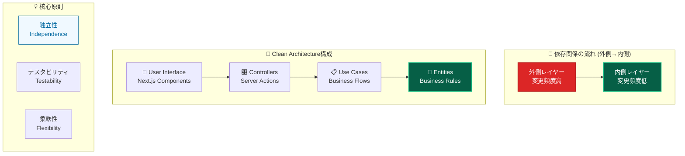

---

## 🏛️ レイヤー構成と責務

### 4層アーキテクチャ

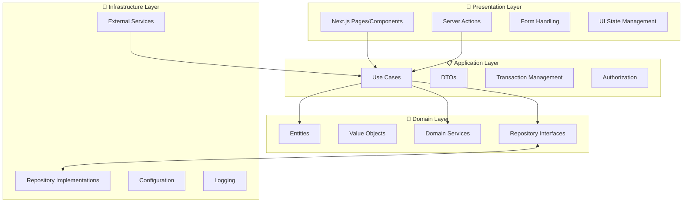

### レイヤー責務マトリックス

| レイヤー              | 主要責務             | 含むもの                                 | 除外するもの                 |
| --------------------- | -------------------- | ---------------------------------------- | ---------------------------- |
| **🎨 Presentation**   | UI・ユーザー入力処理 | コンポーネント、Server Actions、フォーム | ビジネスロジック、DB操作     |
| **📋 Application**    | ビジネスフロー制御   | UseCase、DTO、トランザクション           | UI詳細、技術実装詳細         |
| **👑 Domain**         | ビジネスルール実装   | Entity、Value Object、ドメインサービス   | フレームワーク、外部システム |
| **🔧 Infrastructure** | 技術実装詳細         | Repository実装、外部API、設定            | ビジネスロジック、UI処理     |

---

## 🔄 依存関係の原則

### 依存性逆転の原則 (DIP)

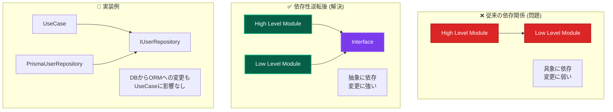

### 依存関係ルール

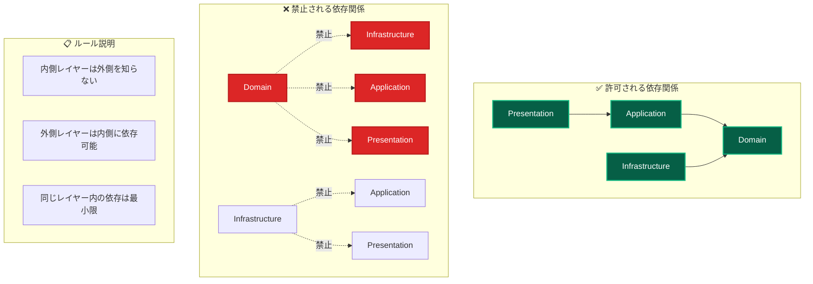

---

## 📊 データフローパターン

### 典型的なリクエストフロー

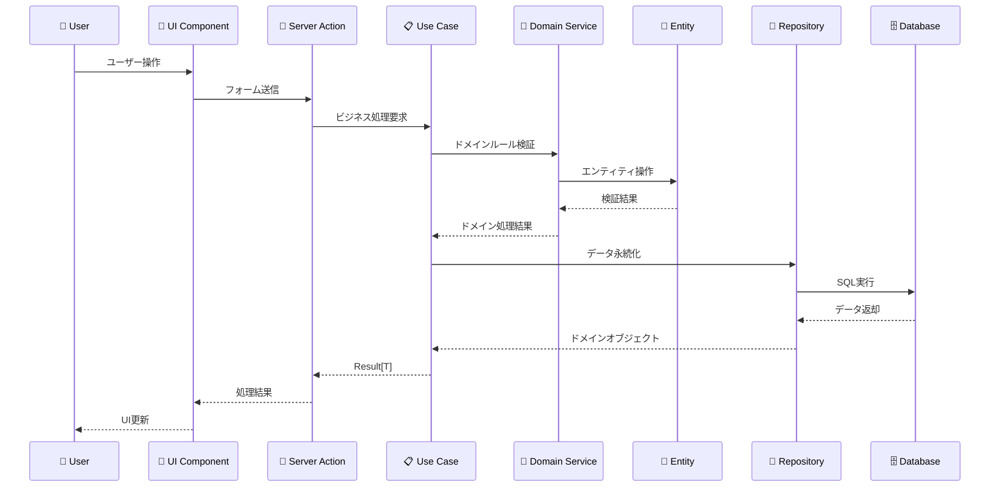

### エラーハンドリングフロー

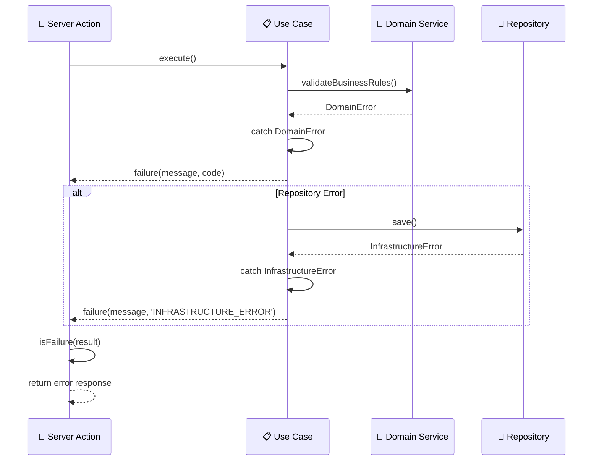

---

## 🎭 レイヤー詳細設計

### Presentation Layer (プレゼンテーション層)

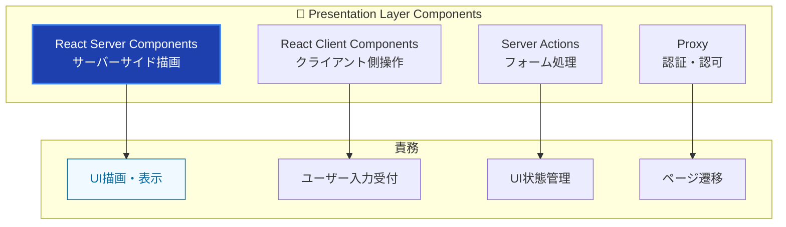

### Application Layer (アプリケーション層)

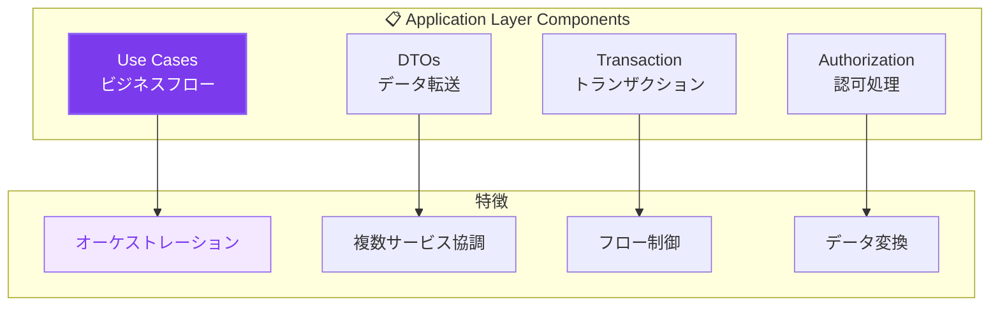

### Domain Layer (ドメイン層)

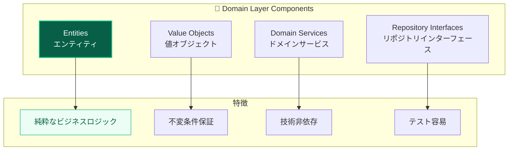

### Infrastructure Layer (インフラストラクチャ層)

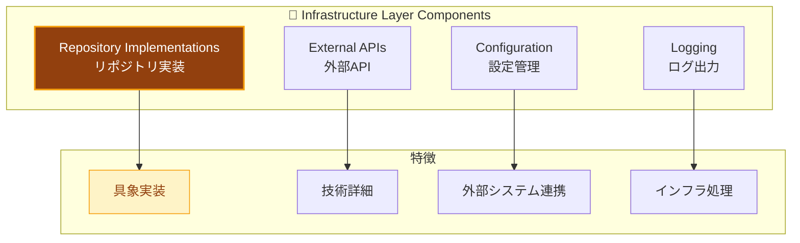

---

## 🔥 アンチパターンと解決策

### よくある設計問題

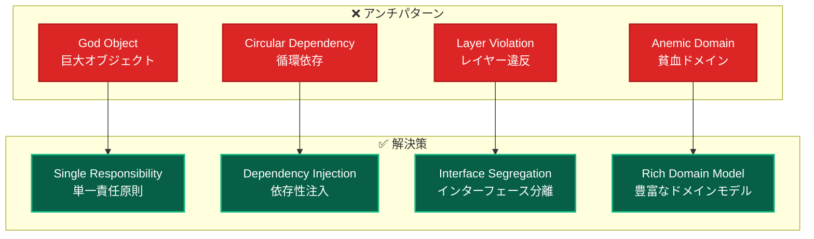

### 具体的な違反例と対策

| 違反パターン                  | 問題                 | 対策                   | 効果               |
| ----------------------------- | -------------------- | ---------------------- | ------------------ |
| **Domain→Infrastructure依存** | テスト困難、技術結合 | Interface + DI         | テスタビリティ向上 |
| **UseCase内でのSQL記述**      | 責務混在、保守困難   | Repository分離         | 関心の分離         |
| **Entity内でのFramework使用** | ドメイン汚染         | Pure TypeScript        | ドメイン純粋性     |
| **UI内でのビジネスロジック**  | 重複、テスト困難     | Domain/Application分離 | 再利用性向上       |

---

## 🎯 設計品質指標

### レイヤー健全性メトリクス

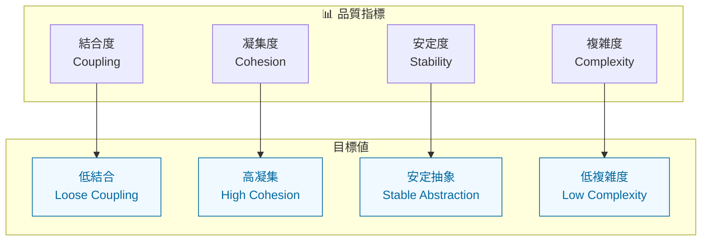

### 測定可能な品質基準

| 指標                 | 測定方法           | 目標値                        | 改善手法           |
| -------------------- | ------------------ | ----------------------------- | ------------------ |
| **循環依存**         | 依存関係グラフ解析 | 0件                           | DI Container分離   |
| **レイヤー違反**     | Import文静的解析   | 0件                           | Biome rules        |
| **Interface使用率**  | 具象依存率計測     | 95%以上                       | Repository pattern |
| **テストカバレッジ** | レイヤー別計測     | Domain 90%+, Application 94%+ | 自動テスト         |

---

## 🚀 スケーリング戦略

### 水平スケーリング

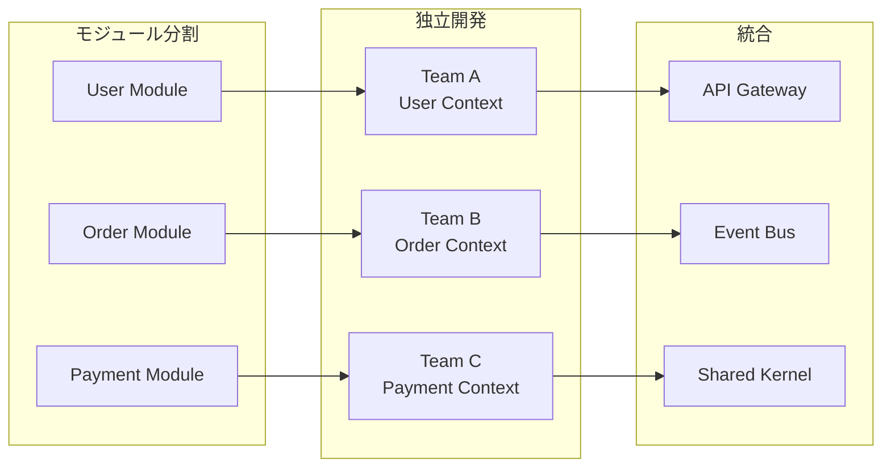

### マイクロサービス移行

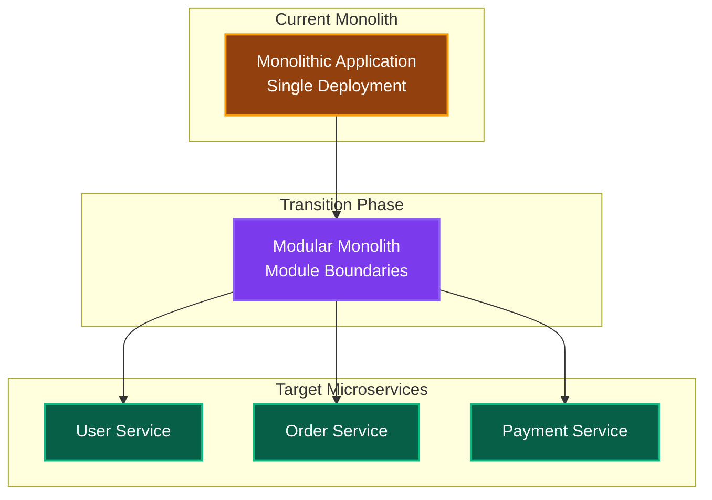

---

## 🔗 関連ドキュメント

### 各レイヤー詳細

- **[Presentation Layer](../../guides/ddd/layers/presentation-layer.md)** - UI・Server Actions実装詳細
- **[Application Layer](../../guides/ddd/layers/application-layer.md)** - UseCase・ビジネスフロー詳細
- **[Domain Layer](../../guides/ddd/layers/domain-layer.md)** - Entity・ドメインロジック詳細
- **[Infrastructure Layer](../../guides/ddd/layers/infrastructure-layer.md)** - Repository・外部サービス詳細

### 設計パターン

- **[依存性注入](../patterns/dependency-injection.md)** - DI実装詳細
- **[エラーハンドリング](../../guides/ddd/cross-cutting/error-handling.md)** - Result型パターン詳細
- **[Repository実装](../../guides/ddd/layers/components/repository-implementations.md)** - データアクセス抽象化

### 実装ガイド

- **[開発フロー](../../guides/development/workflow.md)** - 実際の開発手順
- **[テスト戦略](../../testing/strategy.md)** - レイヤー別テスト手法
- **[よくある問題](../../troubleshooting/common-issues.md)** - トラブルシューティング

---

**🏗️ レイヤードアーキテクチャにより、持続可能で高品質なソフトウェア開発を実現しましょう！**
