# アーキテクチャ概要 🏛️

Next.js 15 + TypeScript + Clean Architecture + DDD による現代的Webアプリケーション設計

---

## 📖 このドキュメントについて

### 🎯 対象読者

- **新規参加メンバー** - プロジェクト全体像の理解
- **アーキテクト・リード** - 設計思想の確認と拡張検討
- **開発者** - 実装時の指針確認

### 📚 前提知識

- **必須**: TypeScript基礎、React/Next.js基礎
- **推奨**: Clean Architecture概念、DDD基礎
- **参考**: [設計原則詳細](principles.md) | [技術スタック詳細](../reference/technologies.md)

### 📍 読み方ガイド

```mermaid
graph LR
    subgraph "⚡ 5分での理解"
        A1[プロジェクトビジョン] --> A2[アーキテクチャ全体像] --> A3[主要パターン]
    end

    subgraph "🔍 15分での深掘り"
        B1[レイヤー詳細] --> B2[データフロー] --> B3[実装アプローチ]
    end

    subgraph "💡 30分での習得"
        C1[技術選択理由] --> C2[実装例確認] --> C3[次のステップ]
    end

    A3 --> B1
    B3 --> C1

    style A1 fill:#065f46,stroke:#10b981,stroke-width:2px,color:#ffffff
    style A2 fill:#065f46,stroke:#10b981,stroke-width:2px,color:#ffffff
    style A3 fill:#065f46,stroke:#10b981,stroke-width:2px,color:#ffffff
    style B1 fill:#0369a1,stroke:#3b82f6,stroke-width:2px,color:#ffffff
    style B2 fill:#0369a1,stroke:#3b82f6,stroke-width:2px,color:#ffffff
    style B3 fill:#0369a1,stroke:#3b82f6,stroke-width:2px,color:#ffffff
    style C1 fill:#7c3aed,stroke:#8b5cf6,stroke-width:2px,color:#ffffff
    style C2 fill:#7c3aed,stroke:#8b5cf6,stroke-width:2px,color:#ffffff
    style C3 fill:#7c3aed,stroke:#8b5cf6,stroke-width:2px,color:#ffffff
```

### 🔗 このドキュメント後の推奨学習パス

1. **概念理解** → [設計原則詳細](principles.md) → [レイヤー構成詳細](layers/overview.md)
2. **実装理解** → [開発フロー](../guides/development/workflow.md) → [最初の機能実装](../guides/development/first-feature.md)  
3. **深掘り学習** → [依存性注入パターン](patterns/dependency-injection.md) → [Result型パターン](patterns/result-pattern.md)

---

## 🚀 プロジェクトビジョン

### 設計思想

このプロジェクトは**持続可能で高品質なソフトウェア開発**を実現するために、以下の原則に基づいて設計されています：

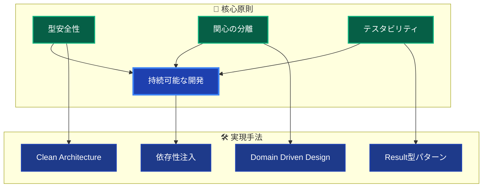

### 🎯 実現される価値

- **開発効率**: 明確な責務分離による高速開発
- **品質保証**: 包括的テスト戦略による高品質
- **保守性**: 変更に強いアーキテクチャ設計
- **スケーラビリティ**: チーム開発に適した構造

---

## 🏗️ アーキテクチャ全体像

### システム構成図

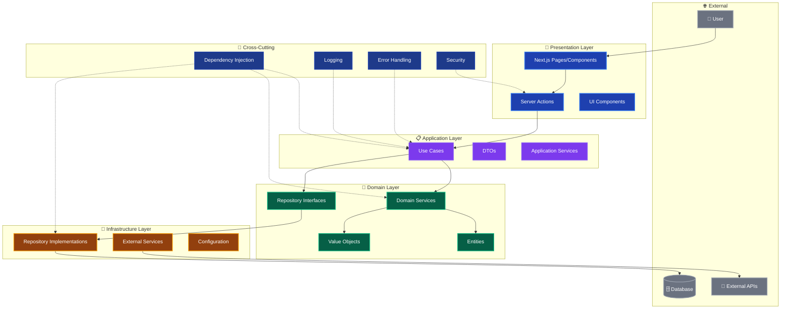

### 依存関係の流れ

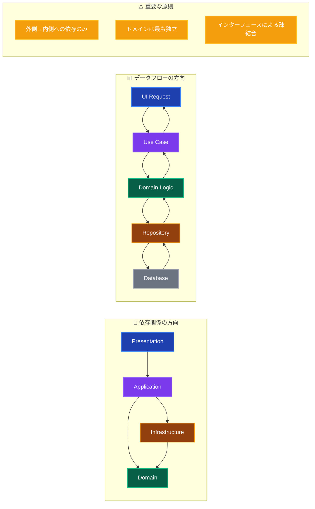

---

## 🎭 レイヤー責務分離

### 各層の明確な役割

| レイヤー | 主要責務 | 許可される処理 | 禁止される処理 |
|---------|---------|-------------|-------------|
| **🎨 Presentation** | UI・ユーザー入力 | コンポーネント描画、Server Actions | ビジネスロジック、DB操作 |
| **📋 Application** | ビジネスフロー制御 | UseCase実装、トランザクション管理 | UI処理、技術的詳細 |
| **👑 Domain** | ビジネスルール | Entity、Value Object、ドメインロジック | フレームワーク依存、外部サービス |
| **🔧 Infrastructure** | 技術的実装 | Repository実装、外部API連携 | ビジネスロジック、UI処理 |

### レイヤー間の相互作用

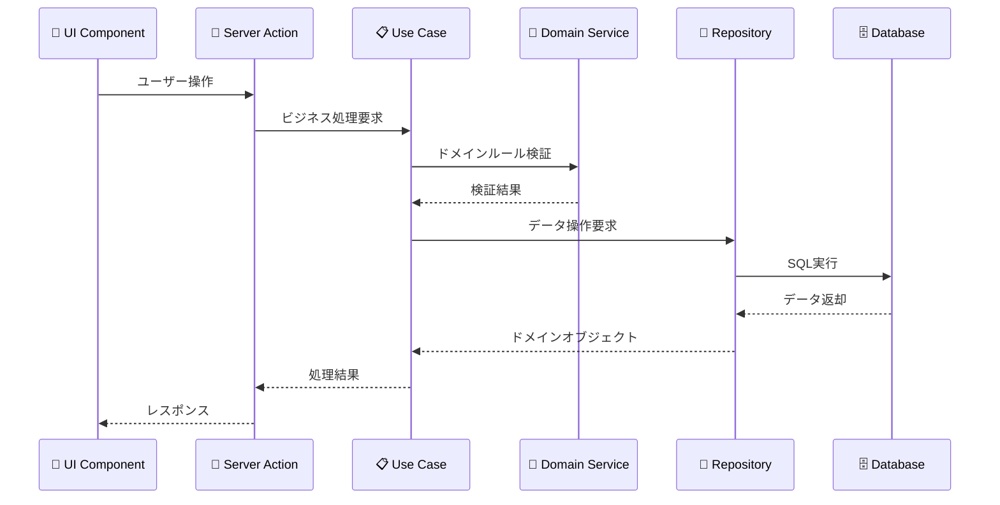

---

## 🔄 主要設計パターン

### Result型パターン

**型安全なエラーハンドリング**により、例外処理を排除し一貫したエラー管理を実現

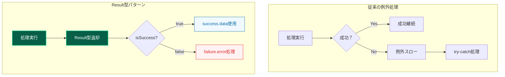

### 依存性注入パターン

**分離DIコンテナ**により、レイヤー別サービス管理と循環依存防止を実現

```mermaid
graph TB
    subgraph "DIコンテナ階層"
        CORE[Core Container<br/>基盤サービス]
        INFRA[Infrastructure Container<br/>技術実装]
        DOMAIN[Domain Container<br/>ビジネスロジック]
        APP[Application Container<br/>ユースケース]
    end
    
    CORE --> INFRA
    INFRA --> DOMAIN
    DOMAIN --> APP
    
    subgraph "注入パターン"
        CONSTRUCTOR[コンストラクター注入<br/>@injectパターン]
        RESOLVE[resolve関数<br/>必要時取得]
    end
    
    CORE --> CONSTRUCTOR
    APP --> RESOLVE
    
    style CORE fill:#1e3a8a,stroke:#1e40af,stroke-width:2px,color:#ffffff
    style INFRA fill:#92400e,stroke:#f59e0b,stroke-width:2px,color:#ffffff
    style DOMAIN fill:#065f46,stroke:#10b981,stroke-width:2px,color:#ffffff
    style APP fill:#7c3aed,stroke:#8b5cf6,stroke-width:2px,color:#ffffff
```

---

## 🚀 主要技術スタック

### フロントエンド技術

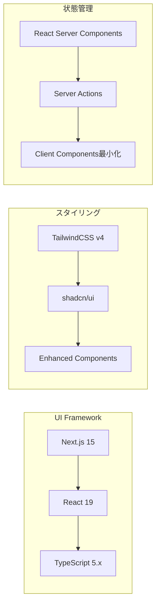

### バックエンド・データ技術

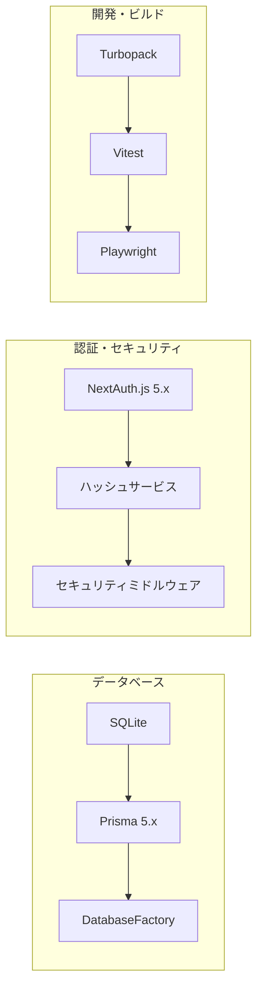

### 品質保証技術

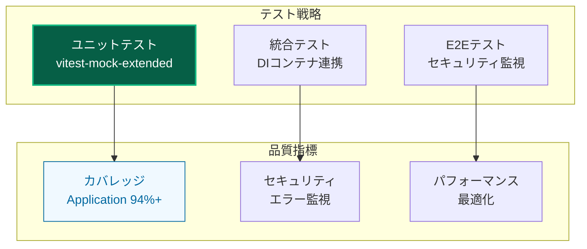

---

## 🎯 アーキテクチャのメリット

### 開発効率向上

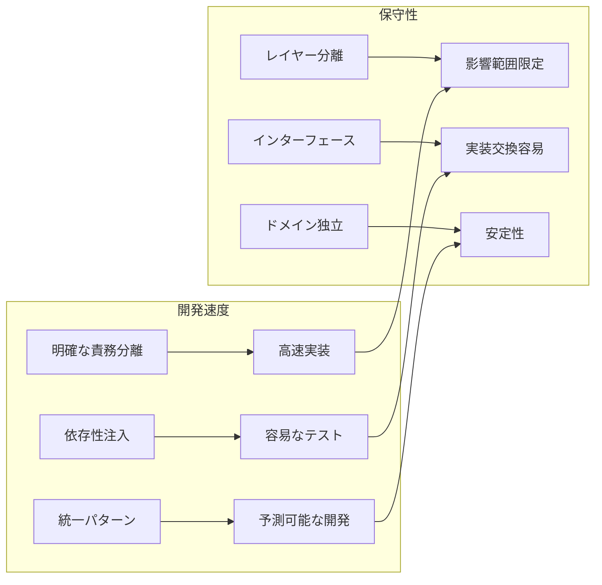

### 品質保証

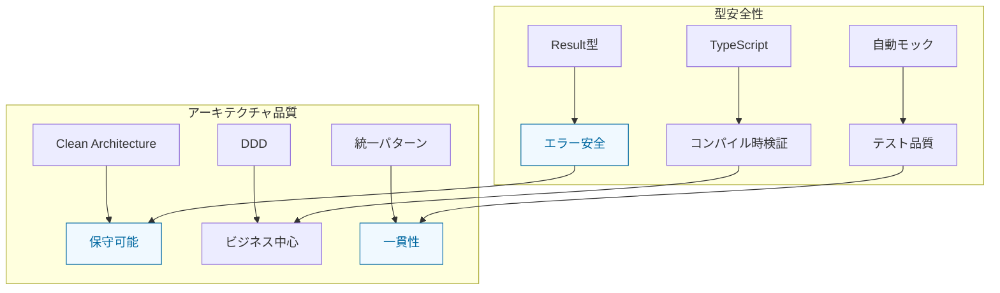

---

## 📈 スケーラビリティ

### チーム開発対応

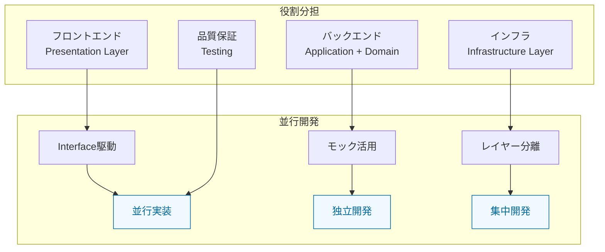

### 機能拡張性

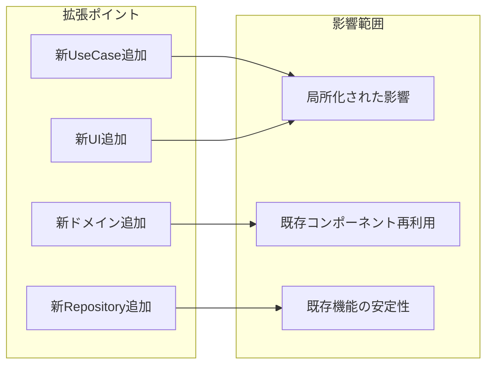

---

## 🎯 次のステップ

### 📚 **理解を深めたい方**

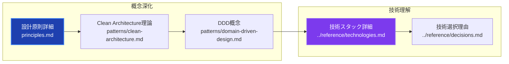

### 🛠️ **実装を始めたい方**

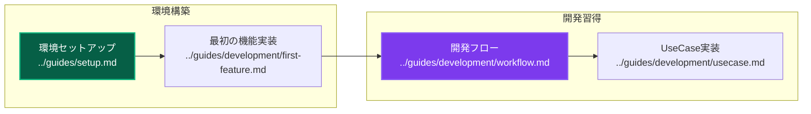

### 🏗️ **レイヤー別詳細を知りたい方**

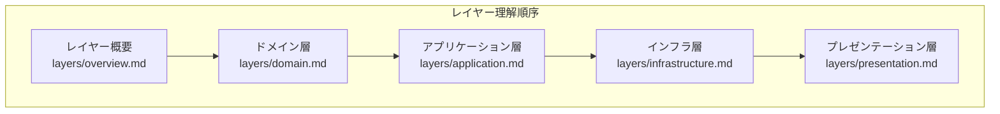

### 🧪 **テスト・品質に関心がある方**

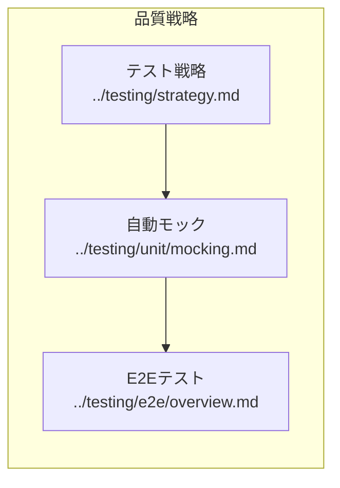

---

## 🔗 詳細なクロスリファレンス

### 📖 **概念・設計理解**

| ドキュメント | 読了目安 | 前提知識 | 次の推奨 |
|-------------|---------|---------|----------|
| **[設計原則](principles.md)** | 15分 | このドキュメント | [レイヤー概要](layers/overview.md) |
| **[レイヤー構成](layers/overview.md)** | 20分 | 設計原則 | 各レイヤー詳細 |
| **[依存性注入](patterns/dependency-injection.md)** | 25分 | レイヤー理解 | [UseCase実装](../guides/development/usecase.md) |
| **[Result型パターン](patterns/result-pattern.md)** | 15分 | TypeScript基礎 | [エラーハンドリング](patterns/error-handling.md) |

### 🛠️ **実装・開発**

| ドキュメント | 読了目安 | 前提知識 | 関連実装 |
|-------------|---------|---------|-----------|
| **[開発フロー](../guides/development/workflow.md)** | 30分 | アーキテクチャ理解 | [コーディング規約](../guides/standards/coding.md) |
| **[最初の機能実装](../guides/development/first-feature.md)** | 45分 | 環境セットアップ | [UseCase実装](../guides/development/usecase.md) |
| **[UseCase実装](../guides/development/usecase.md)** | 20分 | DI・Result型理解 | [Repository実装](../guides/development/repository.md) |
| **[Repository実装](../guides/development/repository.md)** | 25分 | インフラ層理解 | [テスト実装](../testing/unit/overview.md) |

### 🧪 **品質・テスト**

| ドキュメント | 読了目安 | 前提知識 | 実践内容 |
|-------------|---------|---------|----------|
| **[テスト戦略](../testing/strategy.md)** | 30分 | アーキテクチャ理解 | [自動モック](../testing/unit/mocking.md) |
| **[ユニットテスト](../testing/unit/overview.md)** | 20分 | テスト戦略 | [モック戦略](../testing/unit/mocking.md) |
| **[E2Eテスト](../testing/e2e/overview.md)** | 25分 | テスト基礎 | [Playwright活用](../testing/e2e/playwright.md) |

### 🔧 **運用・問題解決**

| ドキュメント | 利用タイミング | 解決内容 | 関連対策 |
|-------------|---------------|----------|----------|
| **[よくある問題](../troubleshooting/common-issues.md)** | 問題発生時 | 一般的問題 | [分野別詳細](../troubleshooting/) |
| **[DI関連問題](../troubleshooting/development/dependency-injection.md)** | DI設定時 | 循環依存等 | [DI設計詳細](patterns/dependency-injection.md) |
| **[テスト問題](../troubleshooting/testing/)** | テスト失敗時 | テスト関連 | [テスト戦略見直し](../testing/strategy.md) |

### 📚 **参考・詳細情報**

| ドキュメント | 参照タイミング | 詳細レベル | 更新頻度 |
|-------------|---------------|-----------|----------|
| **[技術スタック](../reference/technologies.md)** | 技術調査時 | 詳細仕様 | 四半期 |
| **[コマンドリファレンス](../reference/commands.md)** | 日常開発 | 実行方法 | 月次 |
| **[設定詳細](../reference/configuration/)** | 環境構築時 | 設定方法 | 随時 |

---

## 💡 学習効率化のコツ

### 📖 **効果的な読み方**

1. **概要 → 詳細** - このドキュメント → 各レイヤー詳細
2. **理論 → 実践** - 設計原則 → 実装ガイド  
3. **基礎 → 応用** - 基本パターン → 高度な実装

### 🎯 **理解度チェック**

- **基礎理解**: レイヤー責務の説明ができる
- **実装理解**: UseCase・Repository が実装できる
- **応用理解**: 新機能の設計・実装ができる

### 🔄 **継続学習**

- **週次**: [開発フロー](../guides/development/workflow.md) の実践
- **月次**: [設計原則](principles.md) の振り返り
- **四半期**: [アーキテクチャ拡張](patterns/advanced/) の検討

---

**🏛️ このアーキテクチャにより、持続可能で高品質なソフトウェア開発を実現しましょう！**
