# アーキテクチャ概要 🏛️

Next.js 16 + TypeScript + Clean Architecture + DDD による現代的Webアプリケーション設計

---

## 📖 このドキュメントについて

### 🎯 対象読者

- **新規参加メンバー** - プロジェクト全体像の理解
- **アーキテクト・リード** - 設計思想の確認と拡張検討
- **開発者** - 実装時の指針確認

### 📚 前提知識

- **必須**: TypeScript基礎、React/Next.js基礎
- **推奨**: Clean Architecture概念、DDD基礎
- **参考**: [設計原則詳細](principles.md) | [技術スタック詳細](../reference/technologies.md)

### 📍 読み方ガイド

```mermaid
graph LR
    subgraph "⚡ 5分での理解"
        A1[プロジェクトビジョン] --> A2[アーキテクチャ全体像] --> A3[主要パターン]
    end

    subgraph "🔍 15分での深掘り"
        B1[レイヤー詳細] --> B2[データフロー] --> B3[実装アプローチ]
    end

    subgraph "💡 30分での習得"
        C1[技術選択理由] --> C2[実装例確認] --> C3[次のステップ]
    end

    A3 --> B1
    B3 --> C1

    style A1 fill:#065f46,stroke:#10b981,stroke-width:2px,color:#ffffff
    style A2 fill:#065f46,stroke:#10b981,stroke-width:2px,color:#ffffff
    style A3 fill:#065f46,stroke:#10b981,stroke-width:2px,color:#ffffff
    style B1 fill:#0369a1,stroke:#3b82f6,stroke-width:2px,color:#ffffff
    style B2 fill:#0369a1,stroke:#3b82f6,stroke-width:2px,color:#ffffff
    style B3 fill:#0369a1,stroke:#3b82f6,stroke-width:2px,color:#ffffff
    style C1 fill:#7c3aed,stroke:#8b5cf6,stroke-width:2px,color:#ffffff
    style C2 fill:#7c3aed,stroke:#8b5cf6,stroke-width:2px,color:#ffffff
    style C3 fill:#7c3aed,stroke:#8b5cf6,stroke-width:2px,color:#ffffff
```

### 🔗 このドキュメント後の推奨学習パス

1. **概念理解** → [設計原則詳細](principles.md) → [レイヤー構成詳細](layers/overview.md)
2. **実装理解** → [開発フロー](../guides/development/workflow.md) → [最初の機能実装](../guides/development/first-feature.md)
3. **深掘り学習** → [依存性注入パターン](patterns/dependency-injection.md) → [エラーハンドリング](../guides/ddd/cross-cutting/error-handling.md)

---

## 🚀 プロジェクトビジョン

### 設計思想

このプロジェクトは**持続可能で高品質なソフトウェア開発**を実現するために、以下の原則に基づいて設計されています：

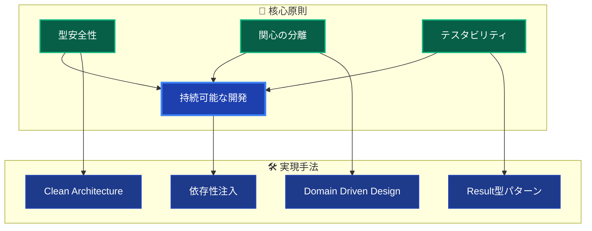
```mermaid
graph TB
    subgraph "🎯 核心原則"
        A[型安全性] --> D[持続可能な開発]
        B[関心の分離] --> D
        C[テスタビリティ] --> D
    end

    subgraph "🛠️ 実現手法"
        E[Clean Architecture]
        F[Domain Driven Design]
        G[Result型パターン]
        H[依存性注入]
    end

    A --> E
    B --> F
    C --> G
    D --> H

    style A fill:#065f46,stroke:#10b981,stroke-width:2px,color:#ffffff
    style B fill:#065f46,stroke:#10b981,stroke-width:2px,color:#ffffff
    style C fill:#065f46,stroke:#10b981,stroke-width:2px,color:#ffffff
    style D fill:#1e40af,stroke:#3b82f6,stroke-width:3px,color:#ffffff
    style E fill:#1e3a8a,stroke:#1e40af,stroke-width:2px,color:#ffffff
    style F fill:#1e3a8a,stroke:#1e40af,stroke-width:2px,color:#ffffff
    style G fill:#1e3a8a,stroke:#1e40af,stroke-width:2px,color:#ffffff
    style H fill:#1e3a8a,stroke:#1e40af,stroke-width:2px,color:#ffffff
```

### 🎯 実現される価値

- **開発効率**: 明確な責務分離による高速開発
- **品質保証**: 包括的テスト戦略による高品質
- **保守性**: 変更に強いアーキテクチャ設計
- **スケーラビリティ**: チーム開発に適した構造

---

## 🏗️ アーキテクチャ全体像

### システム構成図

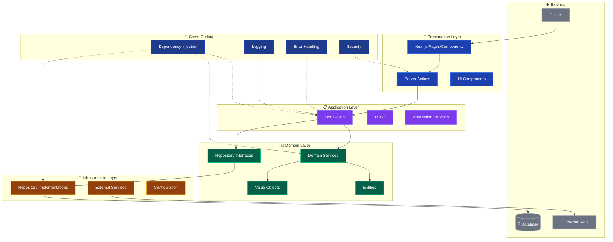
```mermaid
graph TB
    subgraph "🌐 External"
        USER[👤 User]
        API[🔌 External APIs]
        DB[(🗄️ Database)]
    end

    subgraph "🎨 Presentation Layer"
        UI[Next.js Pages/Components]
        SA[Server Actions]
        COMP[UI Components]
    end

    subgraph "📋 Application Layer"
        UC[Use Cases]
        DTO[DTOs]
        SERV[Application Services]
    end

    subgraph "👑 Domain Layer"
        ENT[Entities]
        VO[Value Objects]
        DS[Domain Services]
        REPO_I[Repository Interfaces]
    end

    subgraph "🔧 Infrastructure Layer"
        REPO_IMPL[Repository Implementations]
        EXT_SERV[External Services]
        CONFIG[Configuration]
    end

    subgraph "🎯 Cross-Cutting"
        DI[Dependency Injection]
        LOG[Logging]
        ERR[Error Handling]
        SEC[Security]
    end

    USER --> UI
    UI --> SA
    SA --> UC
    UC --> DS
    UC --> REPO_I
    DS --> ENT
    DS --> VO
    REPO_I --> REPO_IMPL
    REPO_IMPL --> DB
    EXT_SERV --> API

    DI -.-> UC
    DI -.-> DS
    DI -.-> REPO_IMPL
    LOG -.-> UC
    ERR -.-> UC
    SEC -.-> SA

    style UI fill:#1e40af,stroke:#3b82f6,stroke-width:2px,color:#ffffff
    style SA fill:#1e40af,stroke:#3b82f6,stroke-width:2px,color:#ffffff
    style COMP fill:#1e40af,stroke:#3b82f6,stroke-width:2px,color:#ffffff
    style UC fill:#7c3aed,stroke:#8b5cf6,stroke-width:2px,color:#ffffff
    style DTO fill:#7c3aed,stroke:#8b5cf6,stroke-width:2px,color:#ffffff
    style SERV fill:#7c3aed,stroke:#8b5cf6,stroke-width:2px,color:#ffffff
    style ENT fill:#065f46,stroke:#10b981,stroke-width:2px,color:#ffffff
    style VO fill:#065f46,stroke:#10b981,stroke-width:2px,color:#ffffff
    style DS fill:#065f46,stroke:#10b981,stroke-width:2px,color:#ffffff
    style REPO_I fill:#065f46,stroke:#10b981,stroke-width:2px,color:#ffffff
    style REPO_IMPL fill:#92400e,stroke:#f59e0b,stroke-width:2px,color:#ffffff
    style EXT_SERV fill:#92400e,stroke:#f59e0b,stroke-width:2px,color:#ffffff
    style CONFIG fill:#92400e,stroke:#f59e0b,stroke-width:2px,color:#ffffff
    style DI fill:#1e3a8a,stroke:#1e40af,stroke-width:2px,color:#ffffff
    style LOG fill:#1e3a8a,stroke:#1e40af,stroke-width:2px,color:#ffffff
    style ERR fill:#1e3a8a,stroke:#1e40af,stroke-width:2px,color:#ffffff
    style SEC fill:#1e3a8a,stroke:#1e40af,stroke-width:2px,color:#ffffff
    style USER fill:#6b7280,stroke:#9ca3af,stroke-width:2px,color:#ffffff
    style API fill:#6b7280,stroke:#9ca3af,stroke-width:2px,color:#ffffff
    style DB fill:#6b7280,stroke:#9ca3af,stroke-width:2px,color:#ffffff
```

### 依存関係の流れ

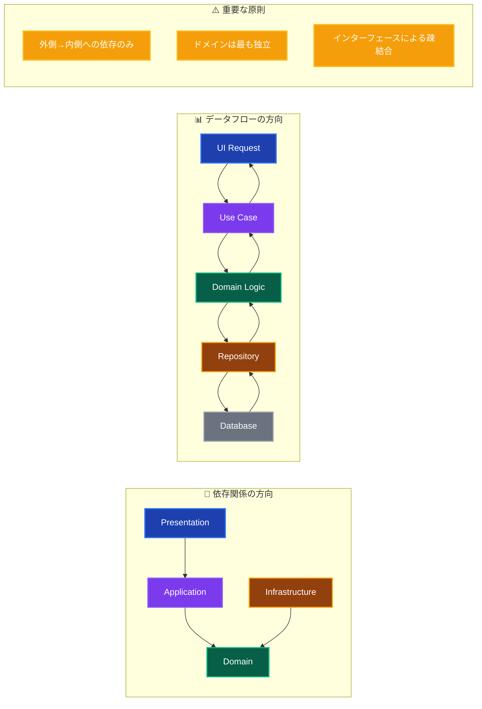
```mermaid
graph LR
    subgraph "🔄 依存関係の方向"
        P[Presentation] --> A[Application]
        A --> D[Domain]
        I[Infrastructure] --> D
    end

    subgraph "📊 データフローの方向"
        UI[UI Request] --> UC[Use Case]
        UC --> DOMAIN[Domain Logic]
        DOMAIN --> REPO[Repository]
        REPO --> DB[Database]
        DB --> REPO
        REPO --> DOMAIN
        DOMAIN --> UC
        UC --> UI
    end

    subgraph "⚠️ 重要な原則"
        RULE1[外側→内側への依存のみ]
        RULE2[ドメインは最も独立]
        RULE3[インターフェースによる疎結合]
    end

    style P fill:#1e40af,stroke:#3b82f6,stroke-width:2px,color:#ffffff
    style A fill:#7c3aed,stroke:#8b5cf6,stroke-width:2px,color:#ffffff
    style D fill:#065f46,stroke:#10b981,stroke-width:2px,color:#ffffff
    style I fill:#92400e,stroke:#f59e0b,stroke-width:2px,color:#ffffff
    style UI fill:#1e40af,stroke:#3b82f6,stroke-width:2px,color:#ffffff
    style UC fill:#7c3aed,stroke:#8b5cf6,stroke-width:2px,color:#ffffff
    style DOMAIN fill:#065f46,stroke:#10b981,stroke-width:2px,color:#ffffff
    style REPO fill:#92400e,stroke:#f59e0b,stroke-width:2px,color:#ffffff
    style DB fill:#6b7280,stroke:#9ca3af,stroke-width:2px,color:#ffffff
    style RULE1 fill:#f59e0b,stroke:#fbbf24,stroke-width:2px,color:#ffffff
    style RULE2 fill:#f59e0b,stroke:#fbbf24,stroke-width:2px,color:#ffffff
    style RULE3 fill:#f59e0b,stroke:#fbbf24,stroke-width:2px,color:#ffffff
```

---

## 🎭 レイヤー責務分離

### 各層の明確な役割

| レイヤー              | 主要責務           | 許可される処理                         | 禁止される処理                   |
| --------------------- | ------------------ | -------------------------------------- | -------------------------------- |
| **🎨 Presentation**   | UI・ユーザー入力   | コンポーネント描画、Server Actions     | ビジネスロジック、DB操作         |
| **📋 Application**    | ビジネスフロー制御 | UseCase実装、トランザクション管理      | UI処理、技術的詳細               |
| **👑 Domain**         | ビジネスルール     | Entity、Value Object、ドメインロジック | フレームワーク依存、外部サービス |
| **🔧 Infrastructure** | 技術的実装         | Repository実装、外部API連携            | ビジネスロジック、UI処理         |

### レイヤー間の相互作用

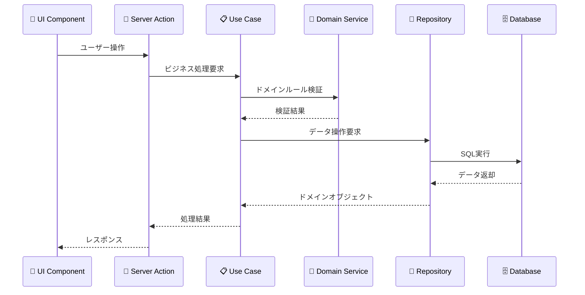
```mermaid
sequenceDiagram
    participant UI as 🎨 UI Component
    participant SA as 🎨 Server Action
    participant UC as 📋 Use Case
    participant DS as 👑 Domain Service
    participant REPO as 🔧 Repository
    participant DB as 🗄️ Database

    UI->>SA: ユーザー操作
    SA->>UC: ビジネス処理要求
    UC->>DS: ドメインルール検証
    DS-->>UC: 検証結果
    UC->>REPO: データ操作要求
    REPO->>DB: SQL実行
    DB-->>REPO: データ返却
    REPO-->>UC: ドメインオブジェクト
    UC-->>SA: 処理結果
    SA-->>UI: レスポンス
```

---

## 🔄 主要設計パターン

### Result型パターン

**型安全なエラーハンドリング**により、例外処理を排除し一貫したエラー管理を実現

```mermaid
graph TB
    subgraph "従来の例外処理"
        A1[処理実行] --> B1{成功？}
        B1 -->|Yes| C1[成功継続]
        B1 -->|No| D1[例外スロー]
        D1 --> E1[try-catch処理]
    end

    subgraph "Result型パターン"
        A2[処理実行] --> B2[Result型返却]
        B2 --> C2{result.isOk()?}
        C2 -->|true| D2[result.value使用]
        C2 -->|false| E2[result.error処理]
    end

    style A2 fill:#065f46,stroke:#10b981,stroke-width:2px,color:#ffffff
    style B2 fill:#065f46,stroke:#10b981,stroke-width:2px,color:#ffffff
    style D2 fill:#f0f9ff,stroke:#0369a1,stroke-width:1px,color:#0369a1
    style E2 fill:#fef2f2,stroke:#dc2626,stroke-width:1px,color:#dc2626
```

### 依存性注入パターン

**分離DIコンテナ**により、レイヤー別サービス管理と循環依存防止を実現

```mermaid
graph TB
    subgraph "DIコンテナ階層"
        CORE[Core Container<br/>基盤サービス]
        INFRA[Infrastructure Container<br/>技術実装]
        DOMAIN[Domain Container<br/>ビジネスロジック]
        APP[Application Container<br/>ユースケース]
    end

    CORE --> INFRA
    INFRA --> DOMAIN
    DOMAIN --> APP

    subgraph "注入パターン"
        CONSTRUCTOR[コンストラクター注入<br/>@injectパターン]
        RESOLVE[resolve関数<br/>必要時取得]
    end

    CORE --> CONSTRUCTOR
    APP --> RESOLVE

    style CORE fill:#1e3a8a,stroke:#1e40af,stroke-width:2px,color:#ffffff
    style INFRA fill:#92400e,stroke:#f59e0b,stroke-width:2px,color:#ffffff
    style DOMAIN fill:#065f46,stroke:#10b981,stroke-width:2px,color:#ffffff
    style APP fill:#7c3aed,stroke:#8b5cf6,stroke-width:2px,color:#ffffff
```

---

## 🚀 主要技術スタック

### フロントエンド技術

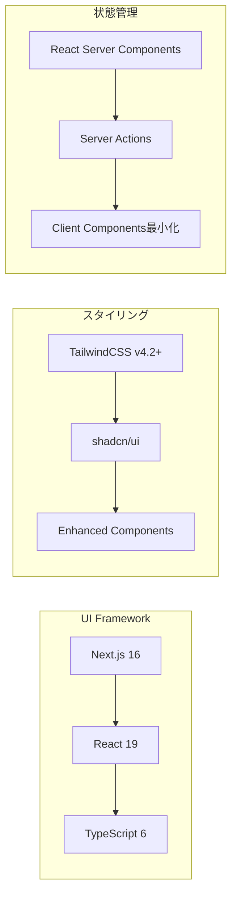
```mermaid
graph LR
    subgraph "UI Framework"
        NEXT[Next.js 16]
        REACT[React 19]
        TS[TypeScript 6]
    end

    subgraph "スタイリング"
        TAILWIND[TailwindCSS v4.2+]
        SHADCN[shadcn/ui]
        ENHANCED[Enhanced Components]
    end

    subgraph "状態管理"
        RSC[React Server Components]
        SA[Server Actions]
        CLIENT[Client Components最小化]
    end

    NEXT --> REACT
    REACT --> TS
    TAILWIND --> SHADCN
    SHADCN --> ENHANCED
    RSC --> SA
    SA --> CLIENT
```

### バックエンド・データ技術

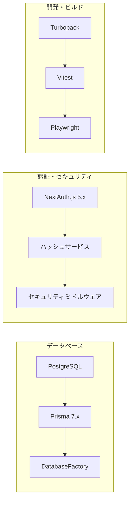
```mermaid
graph LR
    subgraph "データベース"
        POSTGRES[PostgreSQL]
        PRISMA[Prisma 7.x]
        FACTORY[DatabaseFactory]
    end

    subgraph "認証・セキュリティ"
        NEXTAUTH[NextAuth.js 5.x]
        HASH[ハッシュサービス]
        SEC[セキュリティミドルウェア]
    end

    subgraph "開発・ビルド"
        TURBO[Turbopack]
        VITEST[Vitest]
        PLAYWRIGHT[Playwright]
    end

    POSTGRES --> PRISMA
    PRISMA --> FACTORY
    NEXTAUTH --> HASH
    HASH --> SEC
    TURBO --> VITEST
    VITEST --> PLAYWRIGHT
```

### 品質保証技術

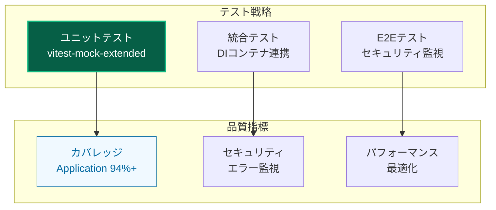
```mermaid
graph TB
    subgraph "テスト戦略"
        UNIT[ユニットテスト<br/>vitest-mock-extended]
        INTEGRATION[統合テスト<br/>DIコンテナ連携]
        E2E[E2Eテスト<br/>セキュリティ監視]
    end

    subgraph "品質指標"
        COV[カバレッジ<br/>Application 94%+]
        SECURITY[セキュリティ<br/>エラー監視]
        PERF[パフォーマンス<br/>最適化]
    end

    UNIT --> COV
    INTEGRATION --> SECURITY
    E2E --> PERF

    style UNIT fill:#065f46,stroke:#10b981,stroke-width:2px,color:#ffffff
    style COV fill:#f0f9ff,stroke:#0369a1,stroke-width:1px,color:#0369a1
```

---

## 🎯 アーキテクチャのメリット

### 開発効率向上

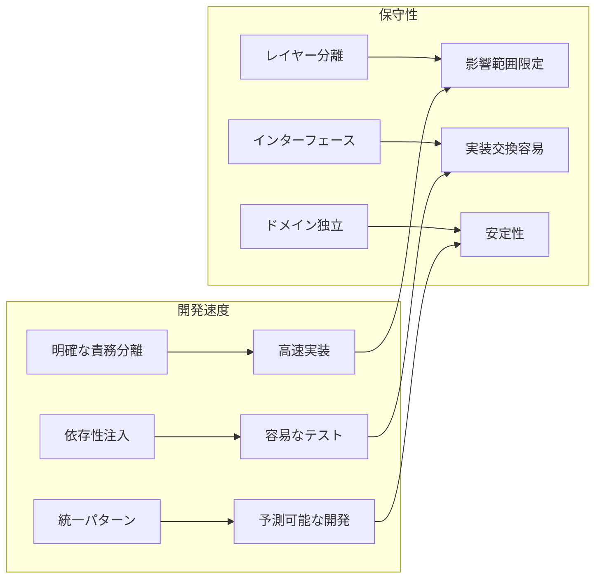
```mermaid
graph LR
    subgraph "開発速度"
        CLEAR[明確な責務分離] --> FAST[高速実装]
        DI[依存性注入] --> MOCK[容易なテスト]
        PATTERN[統一パターン] --> PREDICT[予測可能な開発]
    end

    subgraph "保守性"
        LAYER[レイヤー分離] --> ISOLATE[影響範囲限定]
        INTERFACE[インターフェース] --> REPLACE[実装交換容易]
        DOMAIN[ドメイン独立] --> STABLE[安定性]
    end

    FAST --> ISOLATE
    MOCK --> REPLACE
    PREDICT --> STABLE
```

### 品質保証

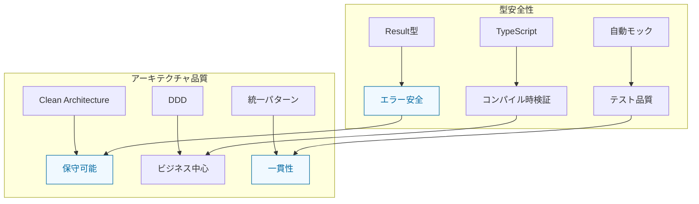
```mermaid
graph TB
    subgraph "型安全性"
        RESULT[Result型] --> SAFE[エラー安全]
        TS[TypeScript] --> COMPILE[コンパイル時検証]
        MOCK[自動モック] --> TEST[テスト品質]
    end

    subgraph "アーキテクチャ品質"
        CLEAN[Clean Architecture] --> MAINTAINABLE[保守可能]
        DDD[DDD] --> BUSINESS[ビジネス中心]
        PATTERN[統一パターン] --> CONSISTENT[一貫性]
    end

    SAFE --> MAINTAINABLE
    COMPILE --> BUSINESS
    TEST --> CONSISTENT

    style SAFE fill:#f0f9ff,stroke:#0369a1,stroke-width:1px,color:#0369a1
    style MAINTAINABLE fill:#f0f9ff,stroke:#0369a1,stroke-width:1px,color:#0369a1
    style CONSISTENT fill:#f0f9ff,stroke:#0369a1,stroke-width:1px,color:#0369a1
```

---

## 📈 スケーラビリティ

### チーム開発対応

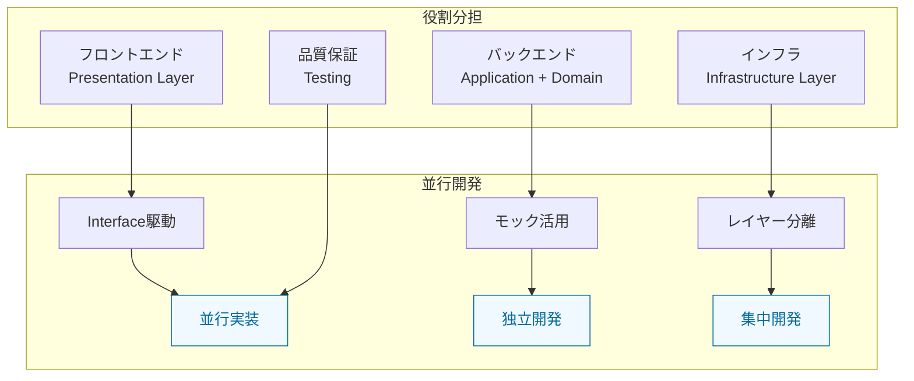
```mermaid
graph TB
    subgraph "役割分担"
        FE[フロントエンド<br/>Presentation Layer]
        BE[バックエンド<br/>Application + Domain]
        INFRA[インフラ<br/>Infrastructure Layer]
        QA[品質保証<br/>Testing]
    end

    subgraph "並行開発"
        INTERFACE[Interface駆動] --> PARALLEL[並行実装]
        MOCK[モック活用] --> INDEPENDENT[独立開発]
        LAYER[レイヤー分離] --> FOCUSED[集中開発]
    end

    FE --> INTERFACE
    BE --> MOCK
    INFRA --> LAYER
    QA --> PARALLEL

    style PARALLEL fill:#f0f9ff,stroke:#0369a1,stroke-width:1px,color:#0369a1
    style INDEPENDENT fill:#f0f9ff,stroke:#0369a1,stroke-width:1px,color:#0369a1
    style FOCUSED fill:#f0f9ff,stroke:#0369a1,stroke-width:1px,color:#0369a1
```

### 機能拡張性

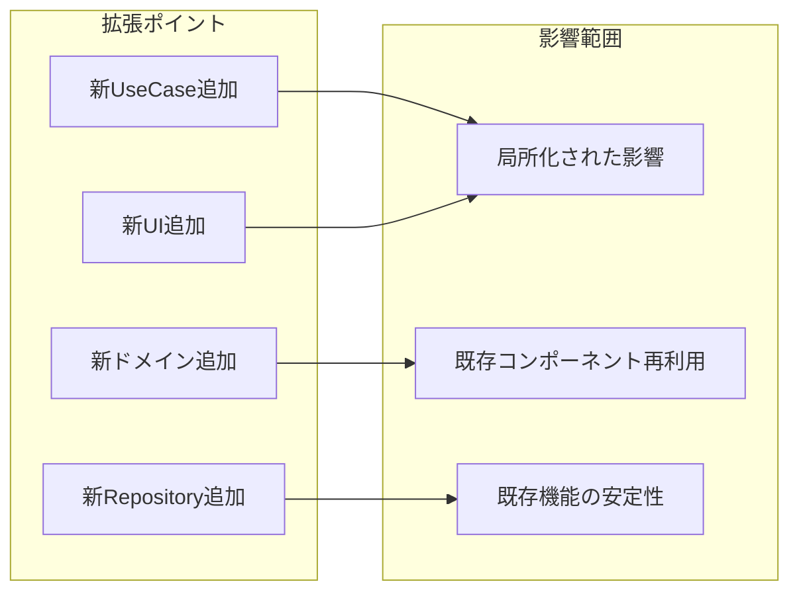
```mermaid
graph LR
    subgraph "拡張ポイント"
        NEW_UC[新UseCase追加]
        NEW_DOMAIN[新ドメイン追加]
        NEW_REPO[新Repository追加]
        NEW_UI[新UI追加]
    end

    subgraph "影響範囲"
        ISOLATED[局所化された影響]
        REUSE[既存コンポーネント再利用]
        STABLE[既存機能の安定性]
    end

    NEW_UC --> ISOLATED
    NEW_DOMAIN --> REUSE
    NEW_REPO --> STABLE
    NEW_UI --> ISOLATED
```

---

## 🎯 次のステップ

### 📚 **理解を深めたい方**

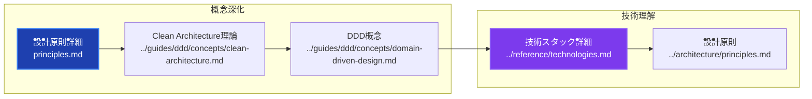
```mermaid
graph LR
    subgraph "概念深化"
        A1[設計原則詳細<br/>principles.md] --> A2[Clean Architecture理論<br/>../guides/ddd/concepts/clean-architecture.md]
        A2 --> A3[DDD概念<br/>../guides/ddd/concepts/domain-driven-design.md]
    end

    subgraph "技術理解"
        B1[技術スタック詳細<br/>../reference/technologies.md] --> B2[設計原則<br/>../architecture/principles.md]
    end

    A3 --> B1

    style A1 fill:#1e40af,stroke:#3b82f6,stroke-width:2px,color:#ffffff
    style B1 fill:#7c3aed,stroke:#8b5cf6,stroke-width:2px,color:#ffffff
```

### 🛠️ **実装を始めたい方**

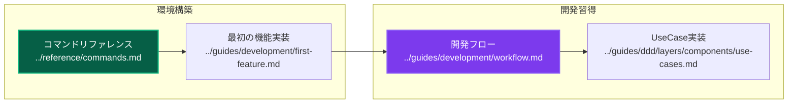
```mermaid
graph LR
    subgraph "環境構築"
        C1[コマンドリファレンス<br/>../reference/commands.md] --> C2[最初の機能実装<br/>../guides/development/first-feature.md]
    end

    subgraph "開発習得"
        C2 --> D1[開発フロー<br/>../guides/development/workflow.md]
        D1 --> D2[UseCase実装<br/>../guides/ddd/layers/components/use-cases.md]
    end

    style C1 fill:#065f46,stroke:#10b981,stroke-width:2px,color:#ffffff
    style D1 fill:#7c3aed,stroke:#8b5cf6,stroke-width:2px,color:#ffffff
```

### 🏗️ **レイヤー別詳細を知りたい方**

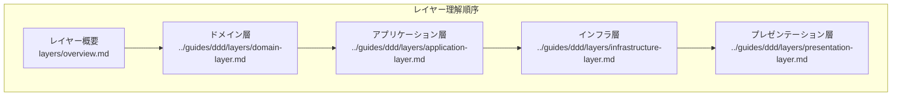
```mermaid
graph TB
    subgraph "レイヤー理解順序"
        E1[レイヤー概要<br/>layers/overview.md] --> E2[ドメイン層<br/>../guides/ddd/layers/domain-layer.md]
        E2 --> E3[アプリケーション層<br/>../guides/ddd/layers/application-layer.md]
        E3 --> E4[インフラ層<br/>../guides/ddd/layers/infrastructure-layer.md]
        E4 --> E5[プレゼンテーション層<br/>../guides/ddd/layers/presentation-layer.md]
    end
```

### 🧪 **テスト・品質に関心がある方**

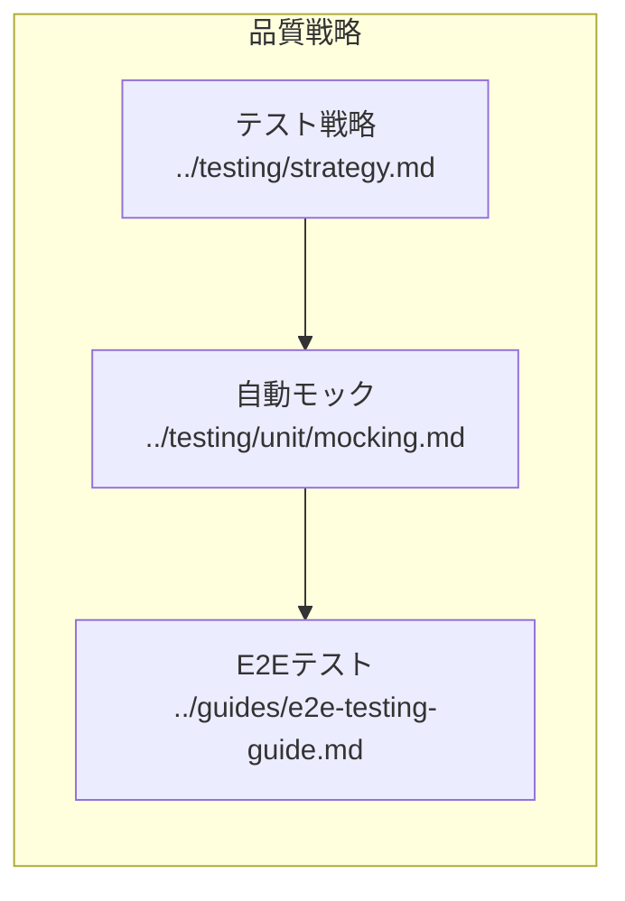
```mermaid
graph LR
    subgraph "品質戦略"
        F1[テスト戦略<br/>../testing/strategy.md] --> F2[自動モック<br/>../testing/unit/mocking.md]
        F2 --> F3[E2Eテスト<br/>../guides/e2e-testing-guide.md]
    end
```

---

## 🔗 詳細なクロスリファレンス

### 📖 **概念・設計理解**

| ドキュメント                                       | 読了目安 | 前提知識         | 次の推奨                                                        |
| -------------------------------------------------- | -------- | ---------------- | --------------------------------------------------------------- |
| **[設計原則](principles.md)**                      | 15分     | このドキュメント | [レイヤー概要](layers/overview.md)                              |
| **[レイヤー構成](layers/overview.md)**             | 20分     | 設計原則         | 各レイヤー詳細                                                  |
| **[依存性注入](patterns/dependency-injection.md)** | 25分     | レイヤー理解     | [UseCase実装](../guides/ddd/layers/components/use-cases.md)     |
| **[エラーハンドリング](../guides/ddd/cross-cutting/error-handling.md)** | 15分     | TypeScript基礎   | [UseCase実装](../guides/ddd/layers/components/use-cases.md) |

### 🛠️ **実装・開発**

| ドキュメント                                                 | 読了目安 | 前提知識           | 関連実装                                                                   |
| ------------------------------------------------------------ | -------- | ------------------ | -------------------------------------------------------------------------- |
| **[開発フロー](../guides/development/workflow.md)**          | 30分     | アーキテクチャ理解 | [コーディング規約](../guides/standards/coding.md)                          |
| **[最初の機能実装](../guides/development/first-feature.md)** | 45分     | 環境セットアップ   | [UseCase実装](../guides/ddd/layers/components/use-cases.md)                |
| **[UseCase実装](../guides/ddd/layers/components/use-cases.md)**          | 20分     | DI・Result型理解   | [Repository実装](../guides/ddd/layers/components/repository-implementations.md) |
| **[Repository実装](../guides/ddd/layers/components/repository-implementations.md)**    | 25分     | インフラ層理解     | [テスト実装](../testing/strategy.md)             |

### 🧪 **品質・テスト**

| ドキュメント                                      | 読了目安 | 前提知識           | 実践内容                                       |
| ------------------------------------------------- | -------- | ------------------ | ---------------------------------------------- |
| **[テスト戦略](../testing/strategy.md)**          | 30分     | アーキテクチャ理解 | [自動モック](../testing/unit/mocking.md)       |
| **[E2Eテスト](../guides/e2e-testing-guide.md)**   | 25分     | テスト基礎         | [テスト戦略](../testing/strategy.md)           |

### 🔧 **運用・問題解決**

| ドキュメント                                                                        | 利用タイミング | 解決内容   | 関連対策                                          |
| ----------------------------------------------------------------------------------- | -------------- | ---------- | ------------------------------------------------- |
| **[よくある問題](../troubleshooting/common-issues.md)**                             | 問題発生時     | 一般的問題 | [開発時の問題](../troubleshooting/development/)   |
| **[DIコンテナ](../guides/ddd/layers/components/di-container.md)**                   | DI設定時       | 循環依存等 | [DI設計詳細](patterns/dependency-injection.md)    |
| **[vitest-mock設定](../troubleshooting/development/vitest-mock-extended-setup.md)** | テスト失敗時   | テスト関連 | [テスト戦略見直し](../testing/strategy.md)        |

### 📚 **参考・詳細情報**

| ドキュメント                                               | 参照タイミング | 詳細レベル | 更新頻度 |
| ---------------------------------------------------------- | -------------- | ---------- | -------- |
| **[技術スタック](../reference/technologies.md)**           | 技術調査時     | 詳細仕様   | 四半期   |
| **[コマンドリファレンス](../reference/commands.md)**       | 日常開発       | 実行方法   | 月次     |
| **[プロジェクト構造](../guides/standards/project-structure.md)** | 環境構築時     | 設定方法   | 随時     |

---

## 💡 学習効率化のコツ

### 📖 **効果的な読み方**

1. **概要 → 詳細** - このドキュメント → 各レイヤー詳細
2. **理論 → 実践** - 設計原則 → 実装ガイド
3. **基礎 → 応用** - 基本パターン → 高度な実装

### 🎯 **理解度チェック**

- **基礎理解**: レイヤー責務の説明ができる
- **実装理解**: UseCase・Repository が実装できる
- **応用理解**: 新機能の設計・実装ができる

### 🔄 **継続学習**

- **週次**: [開発フロー](../guides/development/workflow.md) の実践
- **月次**: [設計原則](principles.md) の振り返り
- **四半期**: [設計原則](./principles.md) の検討

---

**🏛️ このアーキテクチャにより、持続可能で高品質なソフトウェア開発を実現しましょう！**
