# 依存性注入パターン 💉

型安全で保守可能な依存関係管理による品質向上

---

## 🎯 依存性注入の目的

### 解決する問題

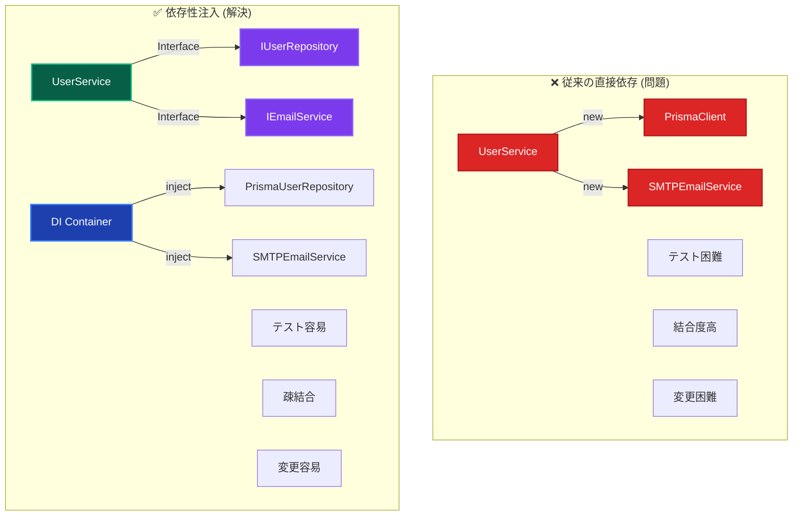

### 実現される価値

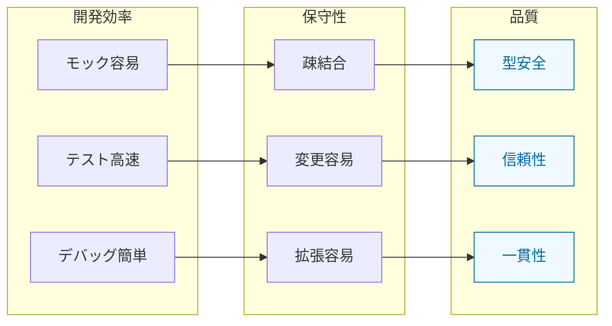

---

## 🏗️ 分離DIコンテナアーキテクチャ

### レイヤー別コンテナ設計

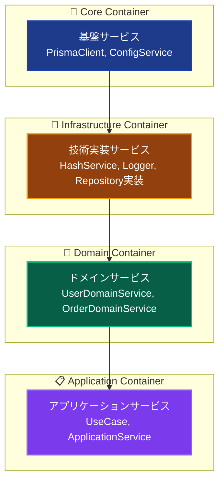

### 継承関係と依存方向

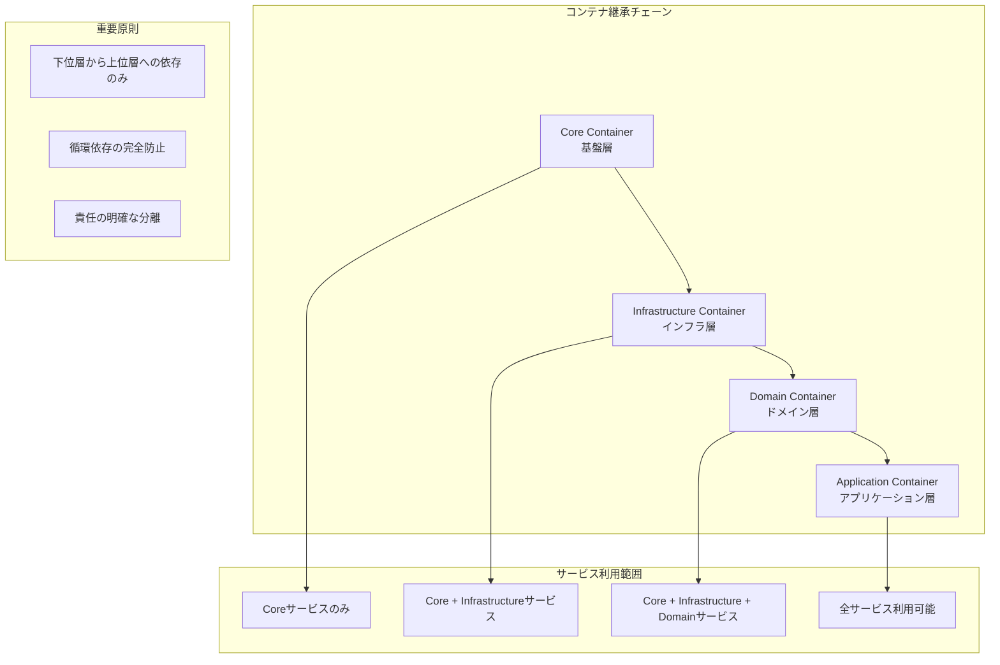

---

## 🎭 注入パターンの使い分け

### パターン選択指針

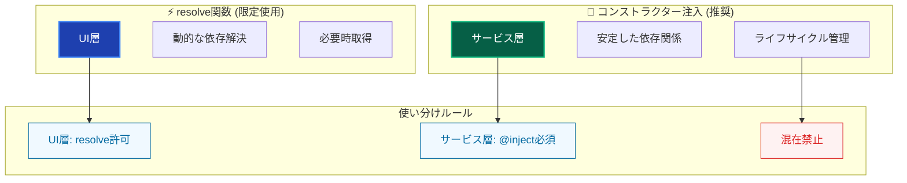

### 適用レイヤーマトリックス

| レイヤー           | 推奨パターン | 理由                      | 使用例                       |
| ------------------ | ------------ | ------------------------- | ---------------------------- |
| **Infrastructure** | `@inject()`  | 安定した依存関係          | Repository, External Service |
| **Domain**         | `@inject()`  | ドメインサービス間協調    | DomainService, Specification |
| **Application**    | `@inject()`  | UseCase間でのサービス共有 | UseCase, ApplicationService  |
| **Presentation**   | `resolve()`  | 必要時のみサービス取得    | Server Actions, Components   |

---

## 🔄 依存関係ライフサイクル

### サービス登録パターン

```mermaid
graph TB
    subgraph "Singleton (推奨)"
        STATELESS[ステートレスサービス]
        SHARED[共有リソース]
        EXPENSIVE[高コスト初期化]
    end

    subgraph "Transient (限定使用)"
        STATEFUL[ステートフルサービス]
        ISOLATED[隔離が必要]
        LIGHTWEIGHT[軽量オブジェクト]
    end

    subgraph "Instance (特殊用途)"
        PRECONFIGURED[事前設定済み]
        EXTERNAL[外部作成]
        MANUAL[手動管理]
    end

    STATELESS --> SHARED
    SHARED --> EXPENSIVE
    STATEFUL --> ISOLATED
    ISOLATED --> LIGHTWEIGHT
    PRECONFIGURED --> EXTERNAL
    EXTERNAL --> MANUAL

    style STATELESS fill:#065f46,stroke:#10b981,stroke-width:2px,color:#ffffff
    style SHARED fill:#065f46,stroke:#10b981,stroke-width:2px,color:#ffffff
    style EXPENSIVE fill:#065f46,stroke:#10b981,stroke-width:2px,color:#ffffff
```

### ライフサイクル管理戦略

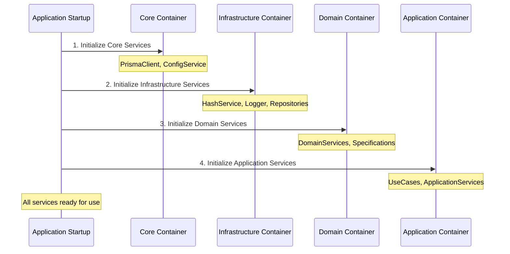

---

## 🛡️ 型安全性の確保

### トークンベース型推論

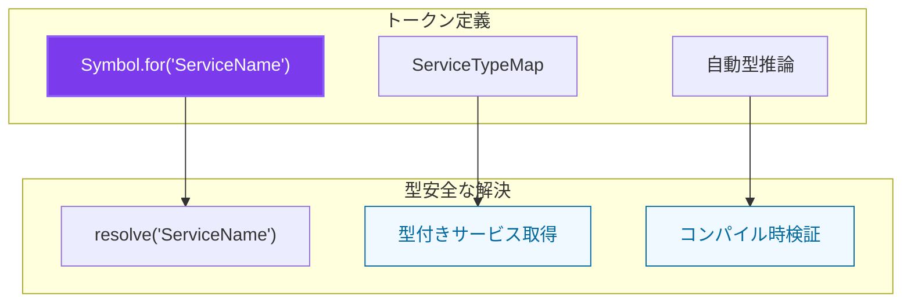

### インターフェース駆動設計

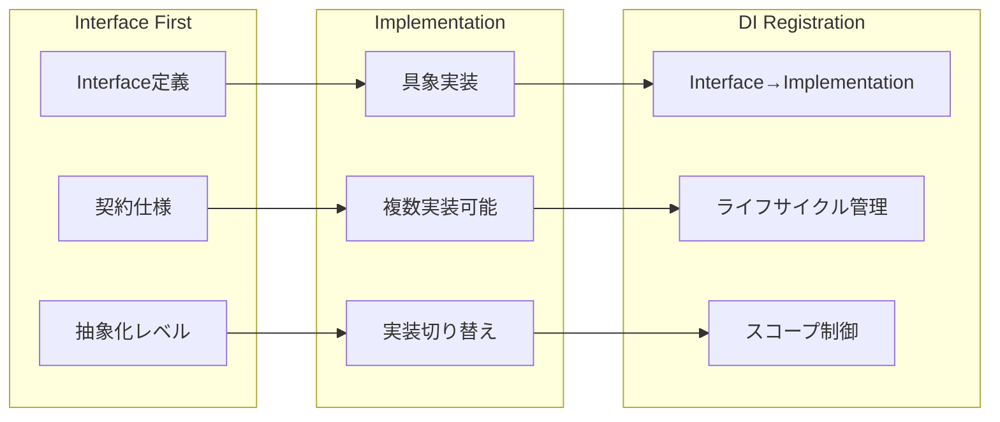

---

## 🧪 テスト戦略統合

### モック注入パターン

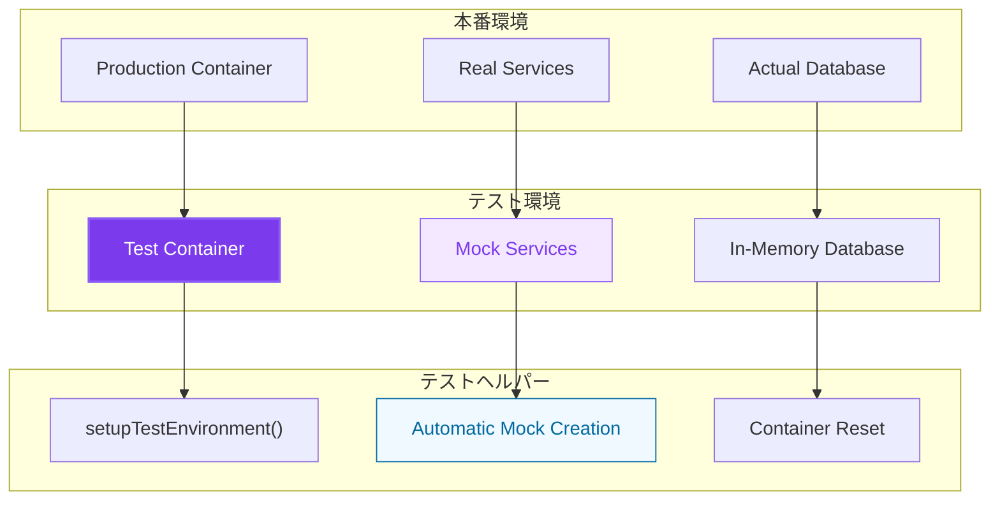

### テスト独立性確保

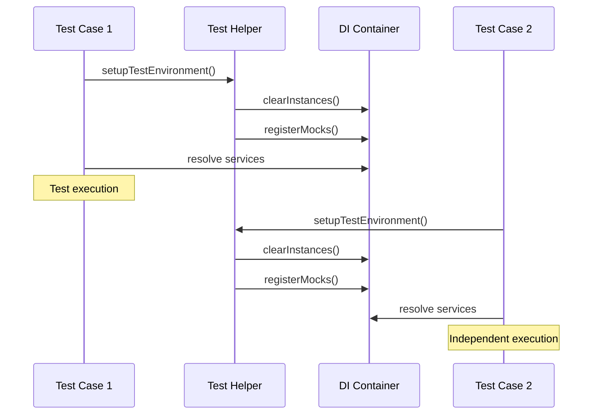

---

## ⚠️ アンチパターンと対策

### よくある問題と解決策

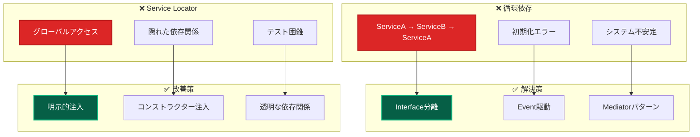

### 避けるべきパターン

| アンチパターン      | 問題                   | 対策             | 効果                 |
| ------------------- | ---------------------- | ---------------- | -------------------- |
| **New演算子多用**   | 硬い結合、テスト困難   | DI Container使用 | 疎結合、モック容易   |
| **Static依存**      | グローバル状態、副作用 | Instance注入     | 状態管理、テスト独立 |
| **Fat Constructor** | 複雑な初期化、責務過多 | Builder/Factory  | 単純化、責務分離     |
| **Mixed Patterns**  | 一貫性欠如、混乱       | 統一パターン     | 予測可能性、保守性   |

---

## 🚀 パフォーマンス最適化

### 遅延初期化戦略

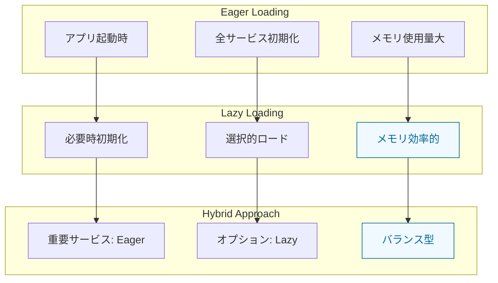

### メモリ管理最適化

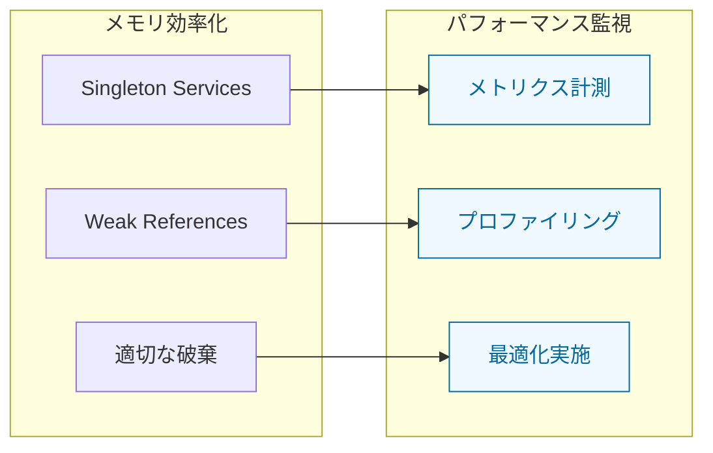

---

## 🔧 実装ベストプラクティス

### サービス設計原則

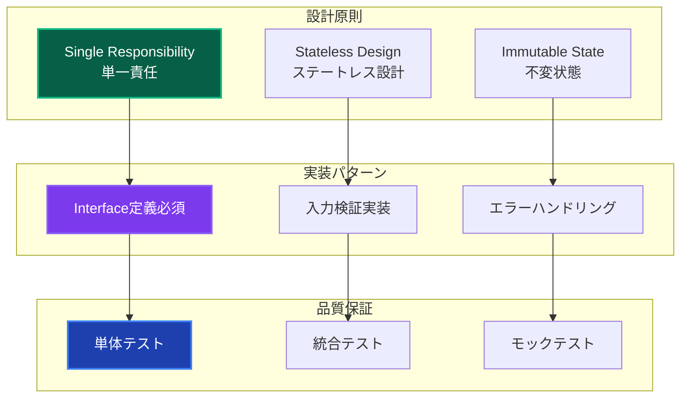

### コード品質チェックリスト

| チェック項目         | 確認内容                    | 合格基準 |
| -------------------- | --------------------------- | -------- |
| **Interface定義**    | すべてのサービスにInterface | 100%     |
| **注入方式統一**     | レイヤー別適切なパターン    | 100%     |
| **循環依存チェック** | 依存関係グラフ検証          | 0件      |
| **テストカバレッジ** | DI関連テスト                | 90%以上  |
| **型安全性**         | any型使用なし               | 100%     |

---

## 🔗 関連ドキュメント

### 設計・実装

- **[レイヤー概要](../layers/overview.md)** - レイヤードアーキテクチャ全体像
- **[エラーハンドリング](../../guides/ddd/cross-cutting/error-handling.md)** - Result型パターン統合
- **[Repository実装](../../guides/ddd/layers/components/repository-implementations.md)** - データアクセス抽象化

### 開発・実践

- **[開発フロー](../../guides/development/workflow.md)** - 実際の開発手順
- **[UseCase実装](../../guides/ddd/layers/components/use-cases.md)** - UseCase開発詳細
- **[テスト戦略](../../testing/strategy.md)** - テスト実装手法

### 問題解決

- **[DIコンテナ](../../guides/ddd/layers/components/di-container.md)** - DI設定詳細
- **[よくある問題](../../troubleshooting/common-issues.md)** - トラブルシューティング
- **[コマンドリファレンス](../../reference/commands.md)** - 開発コマンド

---

**💉 依存性注入により、テスタブルで保守可能な高品質ソフトウェアを実現しましょう！**
