# 設計原則とパターン 🎯

持続可能な高品質ソフトウェアを実現する設計思想と実装原則

---

## 🏛️ 基本設計原則

### SOLID原則の実践

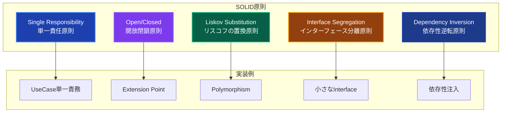

### Clean Architecture 4原則

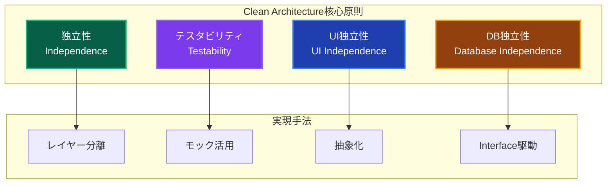

---

## 🎭 レイヤー設計原則

### 依存関係の方向性

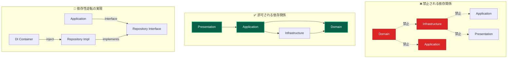

### レイヤー責務の明確化

| 原則           | Description                    | 実装例                                   | 効果                 |
| -------------- | ------------------------------ | ---------------------------------------- | -------------------- |
| **単一責任**   | 各レイヤーは明確な責務のみ持つ | Presentation=UI, Domain=ビジネスロジック | 変更の影響範囲限定   |
| **関心の分離** | 技術的関心とビジネス関心を分離 | Repository=技術, UseCase=ビジネス        | 独立した開発・テスト |
| **安定依存**   | 安定したものに依存する         | Interface依存, 具象避ける                | 変更に強い設計       |
| **抽象化**     | 詳細ではなく抽象に依存         | IRepository, IService                    | 実装の差し替え容易   |

---

## 🔄 主要設計パターン

### 1. Result型パターン

**目的**: 型安全なエラーハンドリングによる品質向上

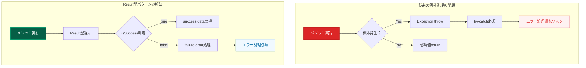

**適用ルール**:

- 全UseCase戻り値: `Promise<Result<T>>`
- エラー分類: ValidationError / DomainError / InfrastructureError
- パターンマッチング: `isSuccess()` / `isFailure()`必須使用

### 2. 依存性注入パターン

**目的**: レイヤー間疎結合とテスタビリティ向上

```mermaid
graph TB
    subgraph "分離DIコンテナ階層"
        CORE[Core Container<br/>基盤サービス]
        INFRA[Infrastructure Container<br/>技術実装サービス]
        DOMAIN[Domain Container<br/>ドメインサービス]
        APP[Application Container<br/>ユースケース]
    end

    subgraph "注入パターン選択"
        CONSTRUCTOR[コンストラクター注入<br/>@injectパターン]
        RESOLVE[resolve関数<br/>必要時取得]
    end

    subgraph "使い分けルール"
        SERVICE[サービス層] --> CONSTRUCTOR
        UI[UI層] --> RESOLVE
    end

    CORE --> INFRA
    INFRA --> DOMAIN
    DOMAIN --> APP

    style CORE fill:#1e3a8a,stroke:#1e40af,stroke-width:2px,color:#ffffff
    style INFRA fill:#92400e,stroke:#f59e0b,stroke-width:2px,color:#ffffff
    style DOMAIN fill:#065f46,stroke:#10b981,stroke-width:2px,color:#ffffff
    style APP fill:#7c3aed,stroke:#8b5cf6,stroke-width:2px,color:#ffffff
```

**注入パターンルール**:

- **サービス層**: `@inject()` コンストラクター注入必須
- **UI層**: `resolve()` 関数による必要時取得OK
- **循環依存**: サービス層での `resolve()` 使用禁止

### 3. Repository パターン

**目的**: ドメイン層の技術的詳細からの独立性確保

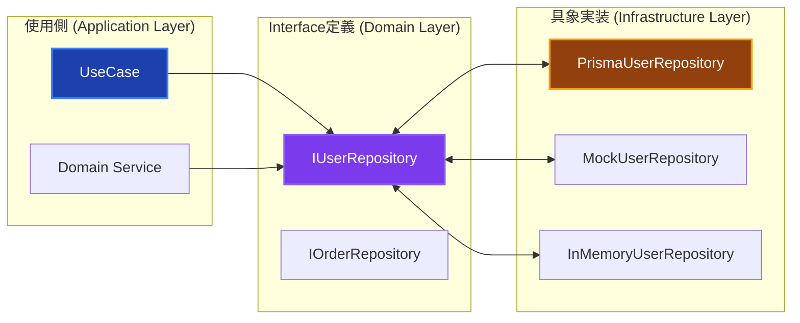

---

## 🧩 Domain Driven Design原則

### 戦略的設計

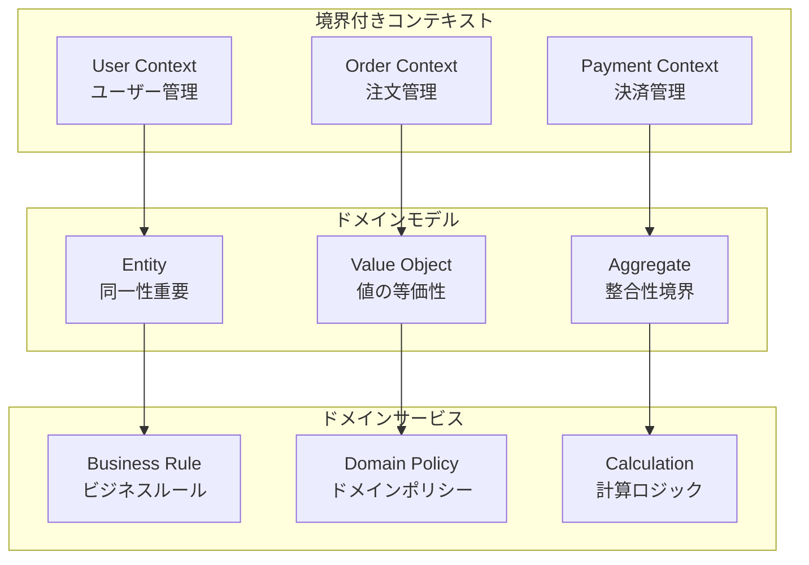

### 戦術的設計パターン

| パターン           | 目的                        | 実装指針                 | 使用場面           |
| ------------------ | --------------------------- | ------------------------ | ------------------ |
| **Entity**         | 同一性とライフサイクル管理  | 不変ID、状態変更メソッド | User, Order等      |
| **Value Object**   | 値の表現と検証              | 不変性、等価比較         | Email, Money等     |
| **Aggregate**      | 整合性境界定義              | ルート経由アクセス       | Order+OrderItem    |
| **Domain Service** | Entity/VOに属さないロジック | ステートレス、純粋関数   | 複雑計算、外部判定 |

---

## 🎨 UI設計原則

### Server-First設計

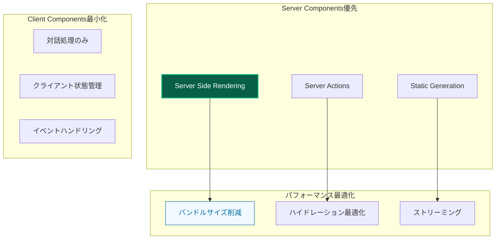

### Enhanced Components設計

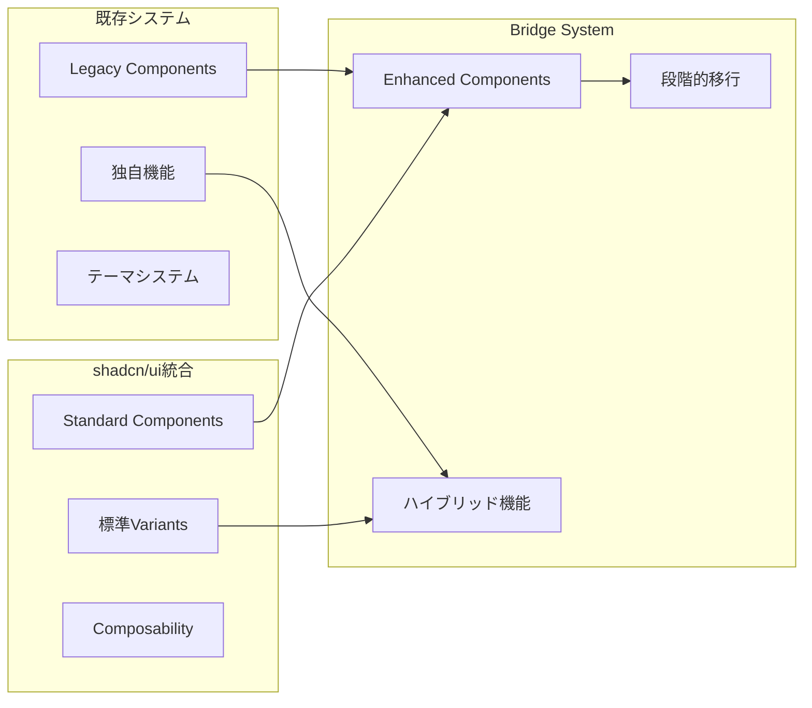

---

## 🧪 テスト設計原則

### テストピラミッド実践

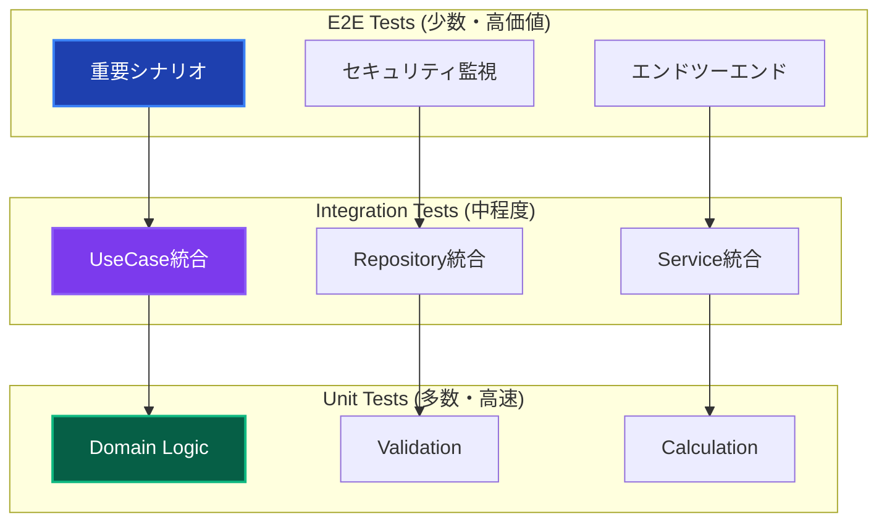

### 自動モック戦略

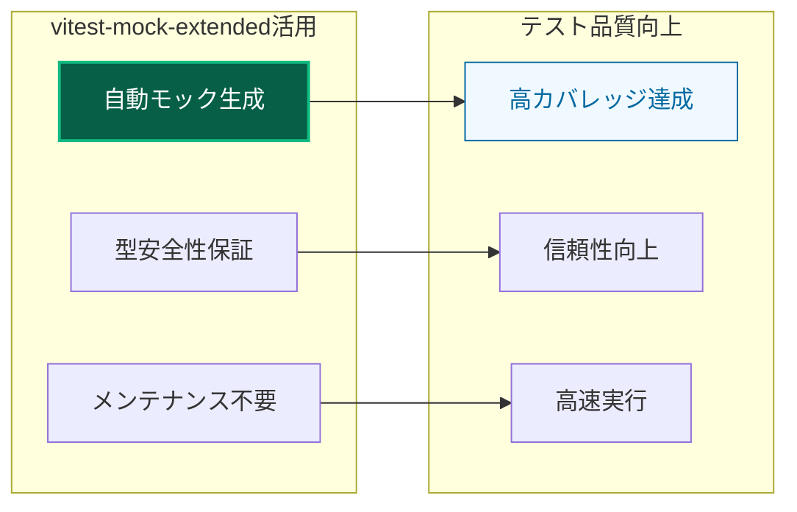

---

## 📊 品質保証原則

### カバレッジ品質基準

| レイヤー           | 目標カバレッジ | 重点観点           | 品質指標                 |
| ------------------ | -------------- | ------------------ | ------------------------ |
| **Application**    | 94%以上        | エラーケース網羅   | Result型変換の完全性     |
| **Domain**         | 90%以上        | ビジネスルール検証 | 不変条件とバリデーション |
| **Infrastructure** | 85%以上        | 外部連携エラー対応 | モック設定とデータ変換   |
| **Presentation**   | 80%以上        | ユーザビリティ     | エラー表示と入力検証     |

### 継続的品質改善

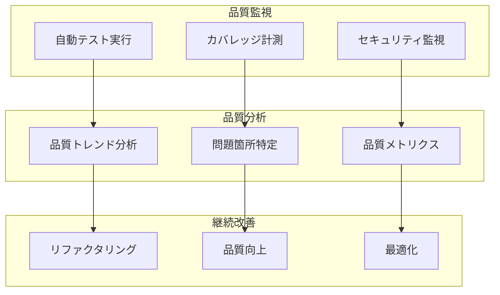

---

## 🚀 スケーラビリティ原則

### 水平スケーリング設計

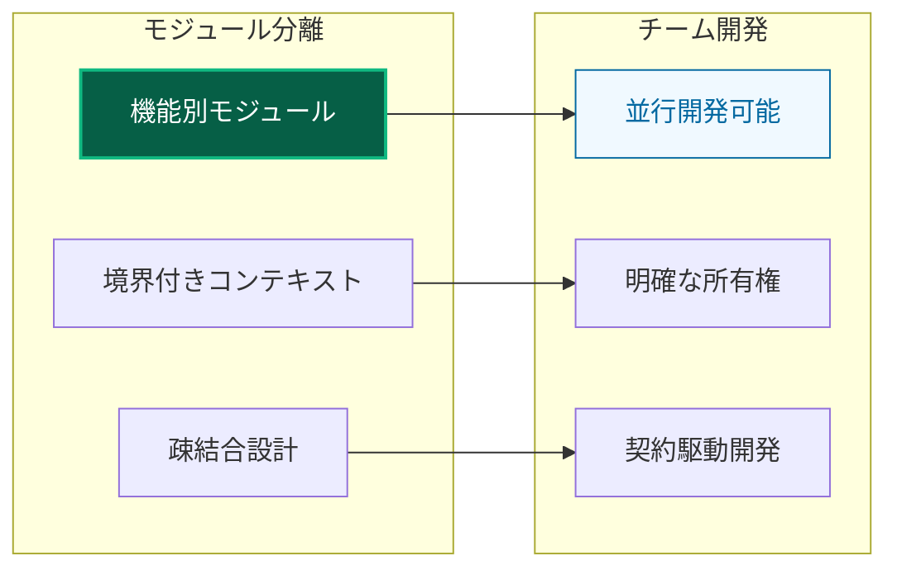

### 拡張ポイント設計

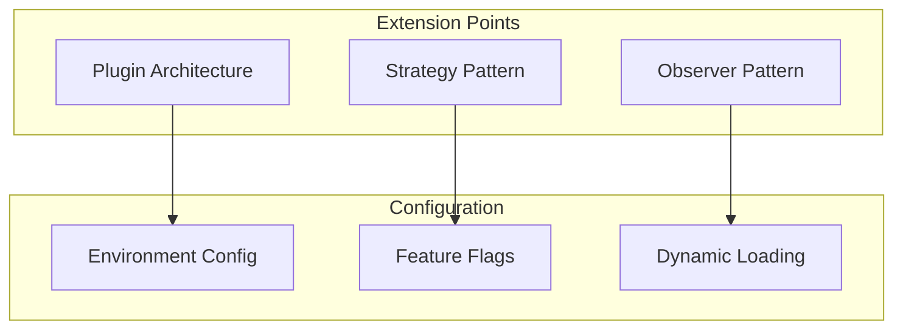

---

## 📋 実装チェックリスト

### 新機能実装時の必須確認

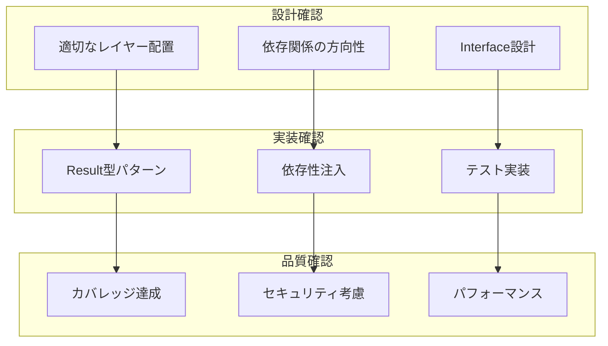

### コードレビューチェックポイント

| 観点               | チェック項目         | 合格基準               |
| ------------------ | -------------------- | ---------------------- |
| **アーキテクチャ** | レイヤー責務遵守     | 各レイヤーの責務に適合 |
| **パターン**       | Result型パターン使用 | 全UseCase適用          |
| **品質**           | テストカバレッジ     | 層別目標達成           |
| **セキュリティ**   | 機密情報処理         | ログマスク等適切実装   |
| **パフォーマンス** | 不要な処理なし       | 効率的な実装           |

---

## 🔗 関連ドキュメント

### 詳細実装ガイド

- **[レイヤー構成](layers/overview.md)** - 各レイヤーの詳細設計
- **[設計パターン詳細](patterns/)** - パターン実装方法
- **[開発フロー](../guides/development/workflow.md)** - 実践的開発手順

### 品質保証

- **[テスト戦略](../testing/strategy.md)** - 包括的テスト手法
- **[コーディング規約](../guides/standards/coding.md)** - 実装標準
- **[トラブルシューティング](../troubleshooting/)** - 問題解決

---

**🎯 これらの原則により、持続可能で高品質なソフトウェア開発を実現しましょう！**
