# Dependency Injection 💉

このドキュメントでは、TSyringeを使用したDependency Injection（DI）の設計と使用方法について説明します。

---

## DI設計の特徴

### 🎯 型安全なサービス解決

`resolve()` 関数により、型推論付きで簡潔にサービスを取得できます。

```typescript
// ✅ 型安全で簡潔な書き方
import { resolve } from '@/layers/infrastructure/di/container';

const createUserUseCase = resolve('CreateUserUseCase');  // CreateUserUseCase型として自動推論
const logger = resolve('Logger');                        // ILogger型として自動推論
```

従来の冗長な書き方は不要です：

```typescript
// ❌ 従来の冗長な書き方（使用しない）
const userService = container.resolve<UserService>(INJECTION_TOKENS.UserService);
```

### 🏗️ レイヤー間の疎結合

各レイヤーはインターフェースにのみ依存し、実装詳細を知りません。

---

## 基本的な使用方法

### Server Actions での使用

```typescript
'use server';
import { resolve } from '@/layers/infrastructure/di/container';

export async function createUser(formData: FormData) {
  // 型推論付きサービス取得
  const createUserUseCase = resolve('CreateUserUseCase');
  const logger = resolve('Logger');

  try {
    const result = await createUserUseCase.execute({
      name: formData.get('name') as string,
      email: formData.get('email') as string,
      password: formData.get('password') as string,
    });
    
    logger.info('ユーザー作成成功', { userId: result.id });
    return { success: true, data: result };
  } catch (error) {
    logger.error('ユーザー作成失敗', { error });
    return { success: false, error: 'ユーザー作成に失敗しました' };
  }
}
```

### Client Components での使用

```typescript
'use client';
import { useServices } from '@/hooks/useServices';

export function MyComponent() {
  const { logger, resolve } = useServices();

  const handleClick = async () => {
    logger.info('ボタンクリック');
    
    // 必要に応じて他のサービスも取得可能
    const errorHandler = resolve('ErrorHandler');
    // ...
  };
}
```

---

## 主要なサービス一覧

### Use Cases

- `CreateUserUseCase` - ユーザー作成フロー
- `SignInUseCase` - サインイン認証フロー

### Domain Services  

- `UserDomainService` - ユーザードメインロジック

### Infrastructure Services

- `Logger` - 構造化ログ出力
- `ConfigService` - 設定値管理
- `ErrorHandler` - エラーハンドリング
- `HashService` - パスワードハッシュ化

### Repository Layer

- `UserRepository` - ユーザーデータアクセス
- `SessionRepository` - セッション管理
- `PrismaClient` - データベース接続

---

## DI設定の仕組み

### トークン定義

DIトークンとサービス型のマッピングが定義されています。

参考実装: [DIトークン](../../src/layers/infrastructure/di/tokens.ts)

### コンテナ設定

各サービスの依存関係とライフサイクルが管理されています。

参考実装: [DIコンテナ](../../src/layers/infrastructure/di/container.ts)

### 型推論の仕組み

TypeScriptの型システムを活用して、文字列キーから型を自動推論します。

---

## NextAuth.js との統合

認証フローでもDIを活用しています：

```typescript
// NextAuth設定内でのDI使用例
export const authOptions: NextAuthOptions = {
  providers: [
    CredentialsProvider({
      async authorize(credentials) {
        const signInUseCase = resolve('SignInUseCase');
        const logger = resolve('Logger');

        logger.info('認証試行開始', { email: credentials?.email });
        
        return await signInUseCase.execute({
          email: credentials?.email || '',
          password: credentials?.password || '',
        });
      }
    })
  ]
};
```

参考実装: [NextAuth設定](../../src/layers/infrastructure/persistence/nextAuth.ts)

---

## テスト時のモック

DIコンテナを使用することで、テスト時に簡単にモックを注入できます。

### setupTestEnvironment関数

テスト環境では、`setupTestEnvironment` 関数を使用してテスト間の独立性を確保し、統一的な `resolve` 関数でサービスを取得します。

```typescript
// tests/utils/helpers/testHelpers.ts
import { beforeEach } from 'vitest';
import { container } from '@/layers/infrastructure/di/container';

/**
 * テスト環境のセットアップ
 * 
 * 各テストの beforeEach で使用することで、テスト間の独立性を確保します。
 */
export function setupTestEnvironment() {
  beforeEach(() => {
    // DIコンテナのリセット
    container.clearInstances();
  });
}
```

### テストでの使用例

```typescript
// tests/unit/usecases/SignInUseCase.test.ts
import { setupTestEnvironment } from '../../utils/helpers/testHelpers';
import { resolve } from '@/layers/infrastructure/di/resolver';

describe('SignInUseCase', () => {
  let signInUseCase: SignInUseCase;

  // テスト環境の自動セットアップ
  setupTestEnvironment();

  beforeEach(() => {
    // モックを登録
    container.registerInstance(INJECTION_TOKENS.Logger, mockLogger);
    
    // 統一的なresolve関数でサービス取得
    signInUseCase = resolve('SignInUseCase');
  });
});
```

**重要**: 本番・テスト環境ともに `resolve()` 関数を使用します。テスト環境では `setupTestEnvironment()` によってコンテナの状態管理を行います。

詳細は [testing-strategy.md](./testing-strategy.md) を参照してください。

---

## ベストプラクティス

### ✅ 推奨パターン

- `resolve()` 関数による型安全なサービス取得
- インターフェースへの依存（実装への直接依存を避ける）
- 必要な時点でのサービス取得（コンストラクタでの過度な注入を避ける）

### ❌ 避けるべきパターン  

- 古い `container.resolve<T>()` 形式の使用
- 実装クラスへの直接依存
- DIコンテナの過度な複雑化

---

## トラブルシューティング

### 型推論が効かない場合

- `resolve()` 関数のインポートを確認
- DIトークンの定義を確認
- TypeScriptのバージョンを確認

### サービスが解決できない場合  

- DIコンテナでのサービス登録を確認
- 循環依存の有無を確認
- `reflect-metadata` のインポートを確認

---

## 🎯 分離DIコンテナアーキテクチャ

本プロジェクトは Clean Architecture の層に基づいてDIコンテナを分離し、循環依存を防ぎつつスケーラブルな構造を実現しています。

### アーキテクチャ概要

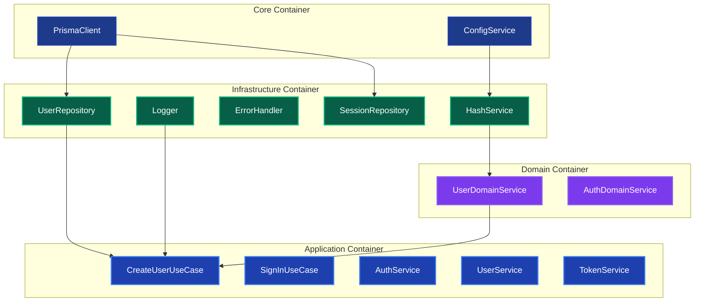

### 依存関係の方向性

```text
Core (基盤層)
  ↓
Infrastructure (インフラ層)
  ↓
Domain (ドメイン層)
  ↓
Application (アプリケーション層)
```

**重要**: 依存関係は常に上位層から下位層への一方向のみです。これにより循環依存を防止しています。

---

## 📦 コンテナファイル構成

### 1. Core Container (`src/layers/infrastructure/di/containers/core.container.ts`)

アプリケーション全体の基盤となるサービスを管理します。

```typescript
import 'reflect-metadata';
import { container } from 'tsyringe';
import { INJECTION_TOKENS } from '../tokens';
import { DatabaseFactory } from '@/layers/infrastructure/persistence/DatabaseFactory';
import { ConfigService } from '@/services/infrastructure/ConfigService';

export const coreContainer = container.createChildContainer();

// PrismaClient: ファクトリーパターンで管理
if (!coreContainer.isRegistered(INJECTION_TOKENS.PrismaClient)) {
  coreContainer.registerInstance(
    INJECTION_TOKENS.PrismaClient,
    DatabaseFactory.getInstance(),
  );
}

// Core Service registrations
safeRegister(INJECTION_TOKENS.ConfigService, ConfigService);
```

**管理対象サービス:**

- `PrismaClient`: データベース接続
- `ConfigService`: 設定管理

### 2. Infrastructure Container (`src/di/containers/infrastructure.container.ts`)

Core層を継承し、技術的な実装詳細を管理します。

```typescript
import { coreContainer } from './core.container';
import { HashService } from '@/services/infrastructure/HashService';
import { Logger } from '@/services/infrastructure/Logger';
import { ErrorHandler } from '@/services/infrastructure/ErrorHandler';
import { PrismaUserRepository } from '@/repositories/implementations/PrismaUserRepository';

export const infrastructureContainer = coreContainer.createChildContainer();

// Infrastructure Service registrations
safeRegister(INJECTION_TOKENS.HashService, HashService);
safeRegister(INJECTION_TOKENS.Logger, Logger);
safeRegister(INJECTION_TOKENS.ErrorHandler, ErrorHandler);

// Repository registrations (Infrastructure層の一部)
safeRegister(INJECTION_TOKENS.UserRepository, PrismaUserRepository);
safeRegister(INJECTION_TOKENS.SessionRepository, PrismaSessionRepository);
```

**管理対象サービス:**

- `HashService`: パスワードハッシュ化
- `Logger`: ログ出力
- `ErrorHandler`: エラーハンドリング
- `Repository実装`: データアクセス層

### 3. Domain Container (`src/di/containers/domain.container.ts`)

Infrastructure層を継承し、ビジネスロジックを管理します。

```typescript
import { infrastructureContainer } from './infrastructure.container';
import { UserDomainService } from '@/services/domain/UserDomainService';

export const domainContainer = infrastructureContainer.createChildContainer();

// Domain Service registrations
safeRegister(INJECTION_TOKENS.UserDomainService, UserDomainService);
```

**管理対象サービス:**

- `UserDomainService`: ユーザーに関するビジネスルール
- その他のドメインサービス（将来追加予定）

### 4. Application Container (`src/di/containers/application.container.ts`)

Domain層を継承し、アプリケーション固有の処理を管理します。

```typescript
import { domainContainer } from './domain.container';
import { CreateUserUseCase } from '@/usecases/user/CreateUserUseCase';
import { SignInUseCase } from '@/usecases/auth/SignInUseCase';
import { UserService } from '@/services/application/UserService';

export const applicationContainer = domainContainer.createChildContainer();

// Use Case registrations
safeRegister(INJECTION_TOKENS.CreateUserUseCase, CreateUserUseCase);
safeRegister(INJECTION_TOKENS.SignInUseCase, SignInUseCase);

// Legacy Service registrations (will be phased out)
safeRegister(INJECTION_TOKENS.UserService, UserService);
safeRegister(INJECTION_TOKENS.AuthService, AuthService);
safeRegister(INJECTION_TOKENS.TokenService, TokenService);
```

**管理対象サービス:**

- `UseCase`: アプリケーションのユースケース
- `Legacy Service`: レガシーアプリケーションサービス（段階的廃止予定）

---

## 💉 依存注入パターンの使い分け

### ✅ 推奨パターン：コンストラクター注入（サービス層）

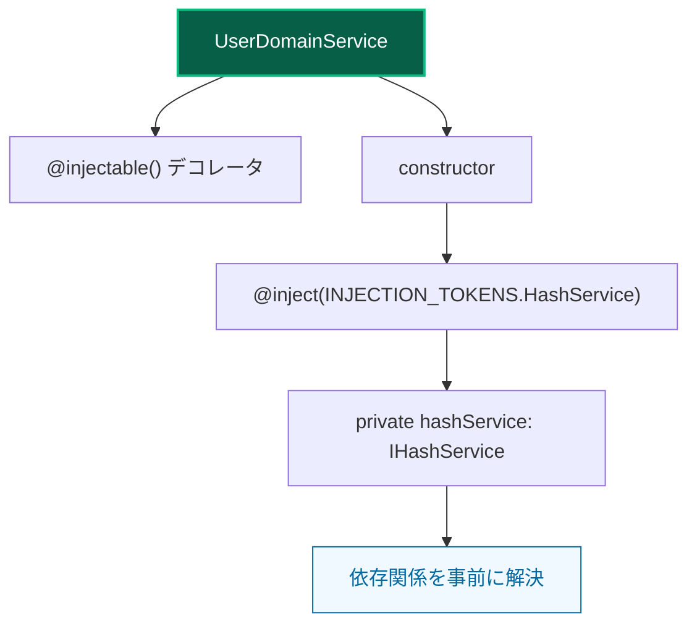

### ✅ 許可パターン：resolve関数（UI層）

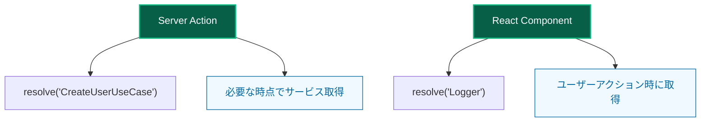

### ❌ 禁止パターン：サービス層でresolve

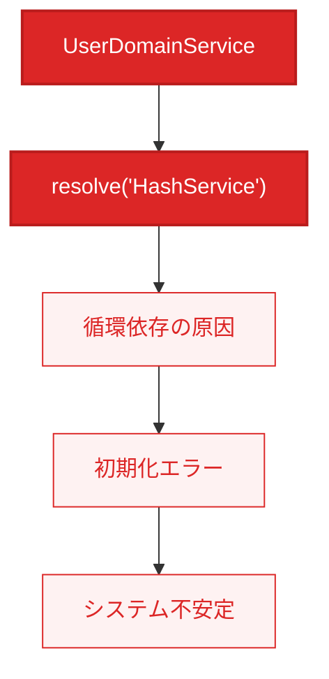

### 📋 パターン使い分けルール

| 層 | 推奨方法 | 理由 |
|---|---|---|
| 🏗️ **サービス層** | `@inject`使用 | 依存関係の事前解決、循環依存回避 |
| 🎨 **UI層** | `resolve`関数使用 | 必要時取得、レンダリング最適化 |
| 🚫 **混在** | 禁止 | アーキテクチャの一貫性維持 |

### 依存注入の階層別使い分け

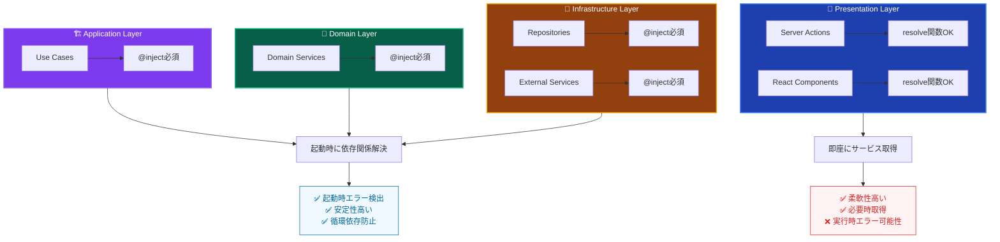

---

## 🔄 DIコンテナ初期化プロセス

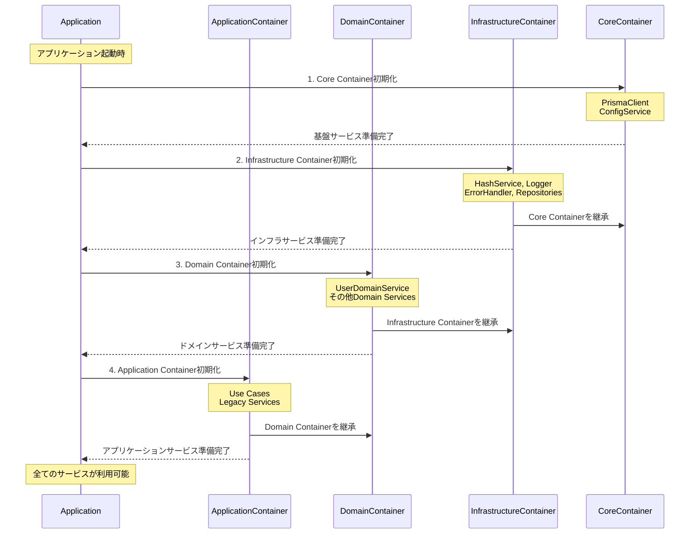

### コンテナ継承チェーンと依存関係

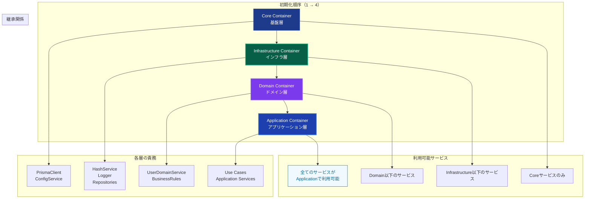

### 初期化フローの重要ポイント

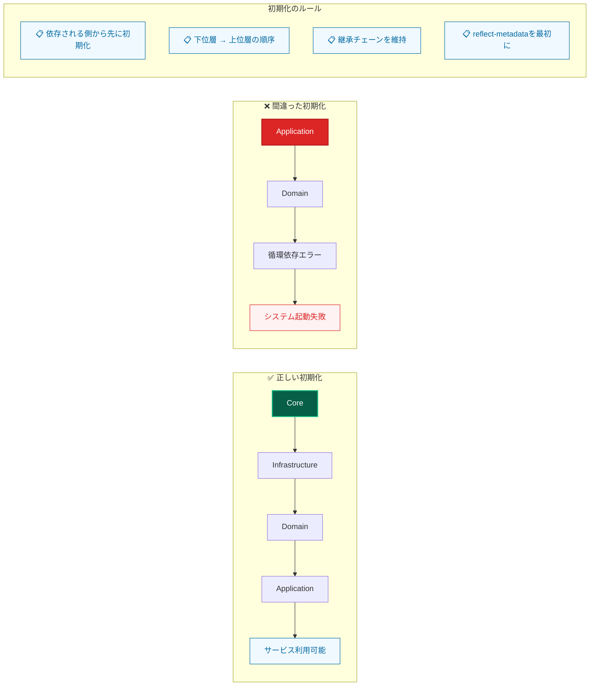

---

## 🛠️ 新しいサービスの追加プロセス

### ステップ1：サービス層の決定と基本設定

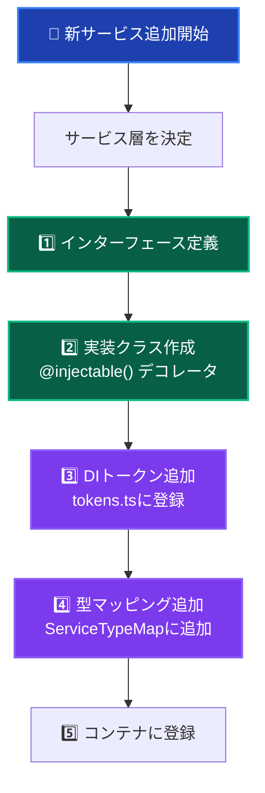

### ステップ2：適切なコンテナファイルの選択

| サービス層 | 使用コンテナファイル | 用途 |
|---|---|---|
| 🏗️ **Core** | `core.container.ts` | 基本的なサービス（Logger、Config等） |
| 🔧 **Infrastructure** | `infrastructure.container.ts` | 外部システム連携（DB、API等） |
| 💎 **Domain** | `domain.container.ts` | ドメインロジック（DomainService等） |
| 🎯 **Application** | `application.container.ts` | ユースケース（UseCase等） |

### ステップ3：サービス利用

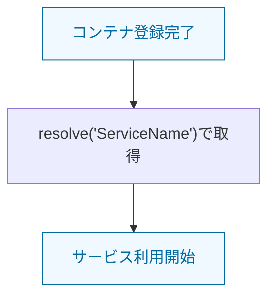

### サービス追加時の層別チェックリスト

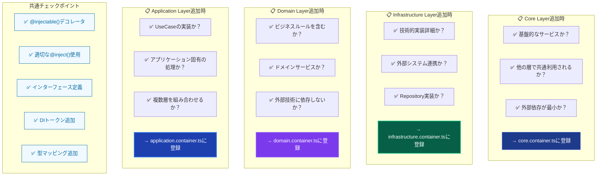

### サービス追加の実装サンプル

**例：ProductDomainServiceを追加する場合**

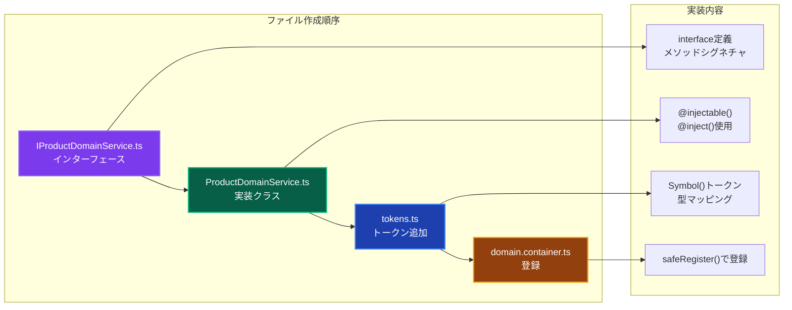

---

## 📋 ベストプラクティス

### ✅ 推奨事項

1. **レイヤー分離の遵守**: 各サービスを適切な層のコンテナに登録
2. **コンストラクター注入**: サービス層では必須
3. **インターフェース依存**: 具象クラスではなくインターフェースに依存
4. **型安全性**: TypeScriptの型推論を最大限活用
5. **初期化順序**: 依存関係の順序を維持

### ❌ 避けるべき事項

1. **循環依存**: サービス層での`resolve`関数使用
2. **層の逆転**: 下位層から上位層への依存
3. **直接インスタンス化**: `new` による直接インスタンス化
4. **型無視**: `any`型の使用
5. **重複登録**: 同じサービスの複数登録

---

## 🐛 トラブルシューティング

### 循環依存エラー

**エラー例:**

```
ReferenceError: Cannot access 'applicationContainer' before initialization
```

**原因:**

- サービス層で`resolve`関数を使用している
- コンテナの初期化順序が間違っている

**解決方法:**

1. サービス層のコードを確認し、`resolve`関数をコンストラクター注入に変更
2. コンテナファイルの初期化順序を確認

### 依存関係解決エラー

**エラー例:**

```
Error: Cannot resolve dependency
```

**原因:**

- DIトークンが正しく登録されていない
- 型とトークンの不一致

**解決方法:**

1. `tokens.ts`での定義を確認
2. 適切なコンテナファイルでの登録を確認
3. インターフェースと実装の一致を確認

### テストでの依存関係エラー

**解決方法:**

1. テストファイルでモックをコンテナに登録
2. DIコンテナ経由でサービスを取得
3. `container.resolve(INJECTION_TOKENS.ServiceName)`を使用

---

## 🔮 将来の拡張

### モジュール分離

将来的には機能別のモジュール分離も検討できます：

```
UserModule
├── UserDomainService
├── UserRepository
└── CreateUserUseCase

ProductModule
├── ProductDomainService
├── ProductRepository
└── CreateProductUseCase
```

### 段階的初期化

より複雑なアプリケーションでは段階的初期化も可能です：

```typescript
export class StagedContainer {
  async initialize() {
    await this.initializeStage1(); // Core
    await this.initializeStage2(); // Infrastructure
    await this.initializeStage3(); // Domain
    await this.initializeStage4(); // Application
  }
}
```

---

## 📚 関連ドキュメント

- [development-guide.md](./development-guide.md) - 開発ガイド
- [architecture-overview.md](./architecture-overview.md) - アーキテクチャ概要
- [testing-strategy.md](./testing-strategy.md) - テスト戦略
