# 🎨 アーキテクチャ図解：ビジュアルで理解するモダンアーキテクチャ

**図解でスッキリ理解！** Clean Architecture + DDD の構造と流れを視覚的に解説します。

---

## 🏗️ 全体アーキテクチャ：4層構造の理解

### 従来のReact開発 vs モダンアーキテクチャ

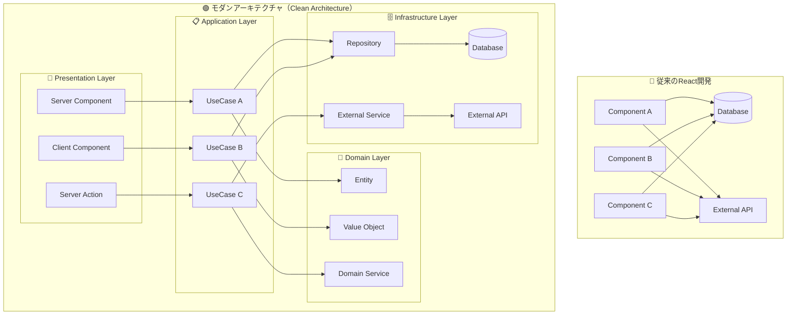

**比較ポイント：**

- **従来**: 各コンポーネントが直接データベースやAPIにアクセス → 複雑化・重複・テスト困難
- **モダン**: 責務が明確に分離 → 保守性・テスタビリティ・再利用性の向上

---

## 🔄 データフロー：リクエストから表示まで

### ユーザー登録機能の例

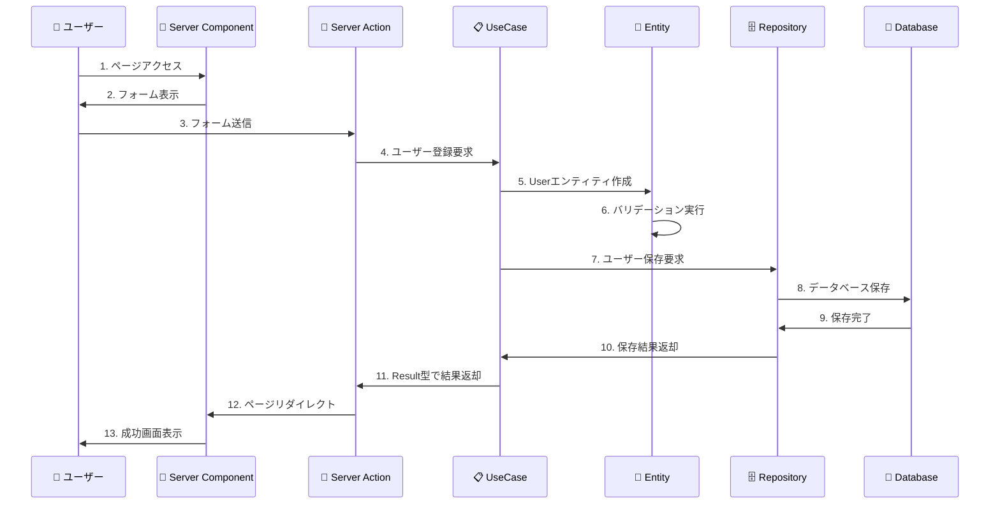

**各ステップの責務：**

1. **Server Component**: 画面表示
2. **Server Action**: フォーム処理・バリデーション
3. **UseCase**: ビジネスフロー制御
4. **Entity**: ビジネスルール適用
5. **Repository**: データ永続化

---

## 📁 ディレクトリ構造とファイル配置

### ファイル配置の全体像

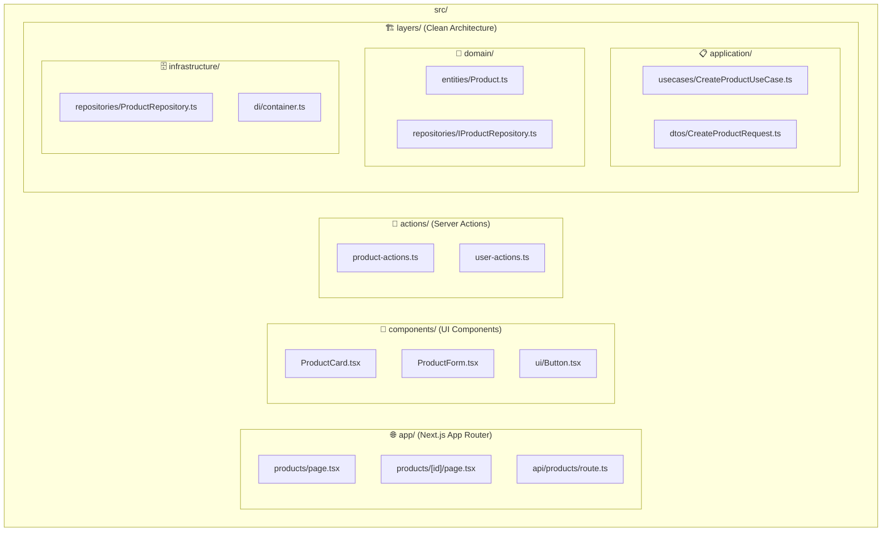

### 新機能追加時の作業フロー

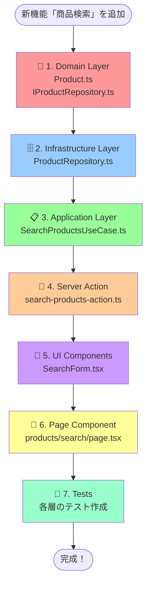

---

## 💉 依存性注入（DI）：サービスの取得と管理

### DIコンテナの仕組み

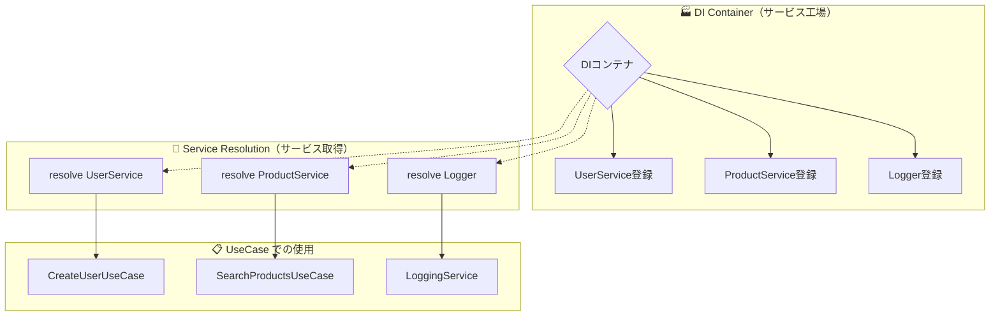

### プロジェクト構造での DI 設定

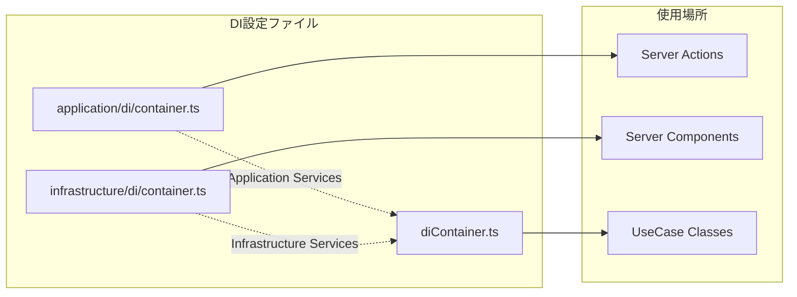

**設定例：**

```typescript
// infrastructure/di/container.ts
container.register('UserRepository', UserRepository);
container.register('Logger', ConsoleLogger);

// application/di/container.ts  
container.register('CreateUserUseCase', CreateUserUseCase);

// 使用時
const userRepository = resolve('UserRepository');
const createUserUseCase = resolve('CreateUserUseCase');
```

---

## 🎯 Result型パターン：エラーハンドリングの流れ

### Success/Failure の分岐処理

```mermaid
graph TD
    Start[UseCase実行] --> Try{処理実行}
    
    Try -->|成功| Success[success(data)]
    Try -->|バリデーションエラー| ValidationError[failure(message, 'VALIDATION_ERROR')]
    Try -->|ビジネスルールエラー| BusinessError[failure(message, 'BUSINESS_ERROR')]
    Try -->|インフラエラー| InfraError[failure(message, 'INFRASTRUCTURE_ERROR')]
    
    Success --> Return[Result型を返却]
    ValidationError --> Return
    BusinessError --> Return
    InfraError --> Return
    
    Return --> Check{isSuccess(result)?}
    Check -->|true| SuccessPath[result.dataで値取得<br>成功処理実行]
    Check -->|false| ErrorPath[result.errorでエラー取得<br>エラー処理実行]
    
    style Success fill:#90EE90
    style ValidationError fill:#FFB6C1
    style BusinessError fill:#FFB6C1
    style InfraError fill:#FFB6C1
    style SuccessPath fill:#90EE90
    style ErrorPath fill:#FFB6C1
```

### 実装例での比較

```mermaid
graph LR
    subgraph "🔴 従来のtry-catch"
        T1[try実行] --> T2{エラー?}
        T2 -->|Yes| T3[catch実行]
        T2 -->|No| T4[成功処理]
        T3 --> T5[throw Error]
        T5 --> T6[呼び出し元でまたtry-catch...]
    end
    
    subgraph "🟢 Result型パターン"
        R1[UseCase実行] --> R2{エラー?}
        R2 -->|Yes| R3[failure()返却]
        R2 -->|No| R4[success()返却]
        R3 --> R5[Result型]
        R4 --> R5
        R5 --> R6[isSuccess/isFailureで分岐]
    end
```

---

## 🧪 テスト戦略：レイヤー別のテスト範囲

### テストピラミッド

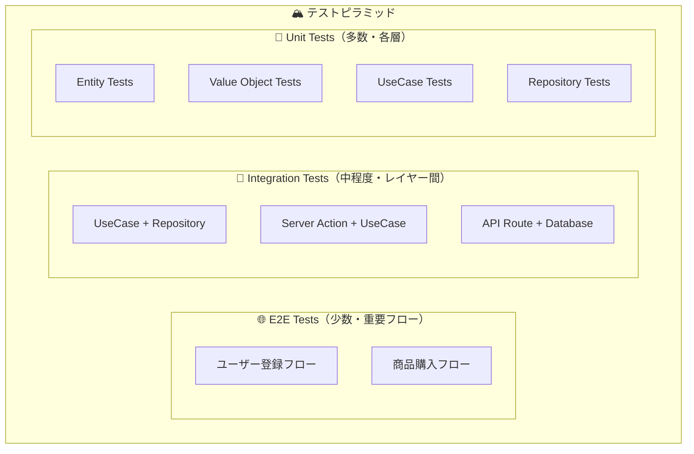

### 各層でのテスト内容

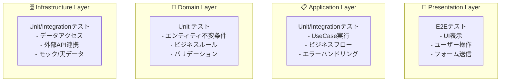

### モック戦略

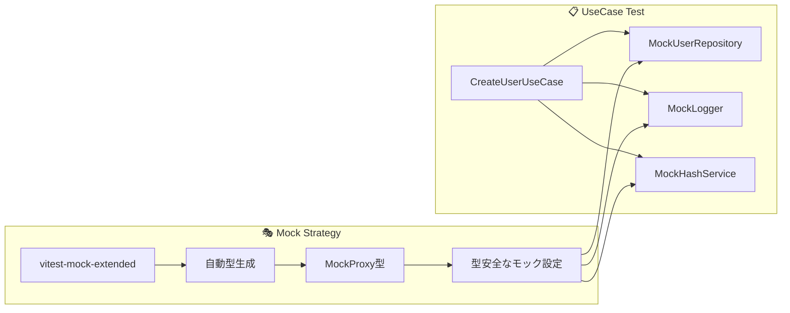

---

## 🚀 Server Components vs Client Components

### 使い分けフローチャート

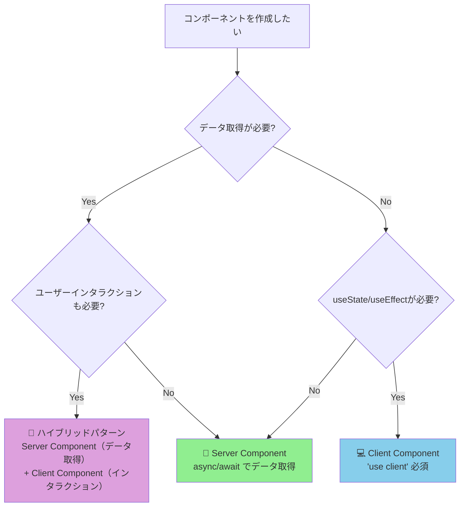

### 実際の使用例

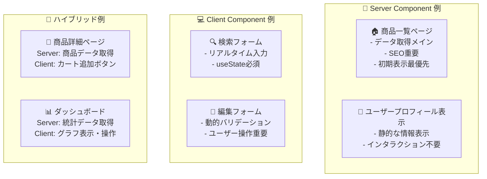

---

## 🎓 学習パス：段階的な理解

### 推奨学習順序

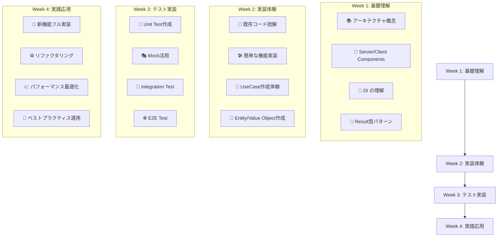

---

## 📊 パフォーマンス比較：従来 vs モダン

### 開発効率の改善

```mermaid
gantt
    title 開発効率比較（機能追加時）
    dateFormat X
    axisFormat %s

    section 従来のReact開発
    要件理解           :0, 1
    設計・アーキテクチャ検討 :1, 3
    実装               :3, 8
    テスト作成         :8, 12
    バグ修正           :12, 16
    
    section モダンアーキテクチャ
    要件理解           :0, 1
    設計（パターン適用） :1, 2
    実装（レイヤー分離） :2, 6
    テスト作成（自動モック） :6, 8
    バグ修正（影響範囲明確） :8, 9
```

### 保守性の向上

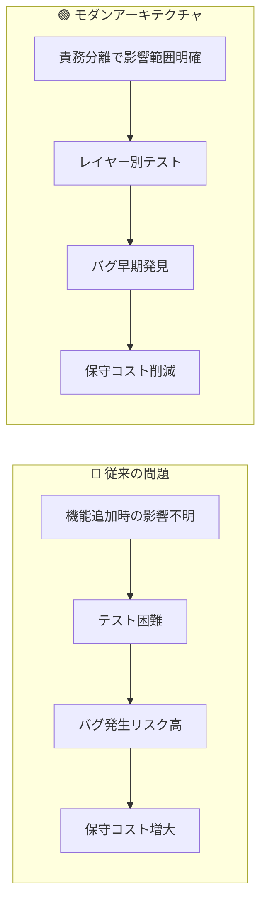

---

## 🎯 まとめ：アーキテクチャの価値

### 短期 vs 長期の比較

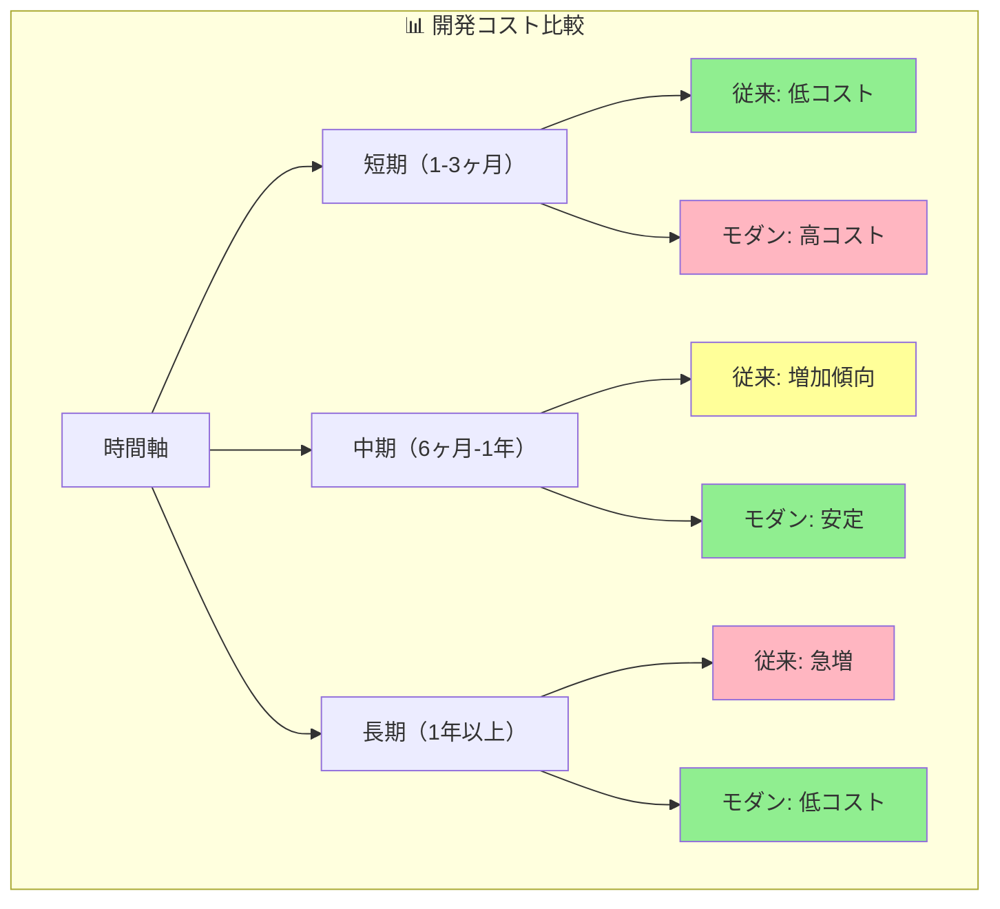

**結論：**

- **初期コスト**: 学習コストがかかるが...
- **中長期**: 圧倒的な開発効率・品質向上
- **チーム開発**: スケールする開発体制
- **保守性**: 持続可能な成長

---

**🌟 図解で理解できましたか？次は実際に手を動かしてみましょう！**

**→ [簡単なチュートリアル](./simple-tutorial.md)** で実践体験 🚀
