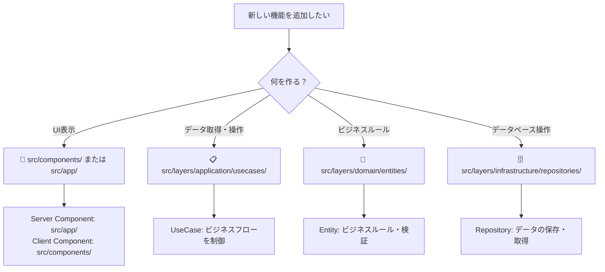
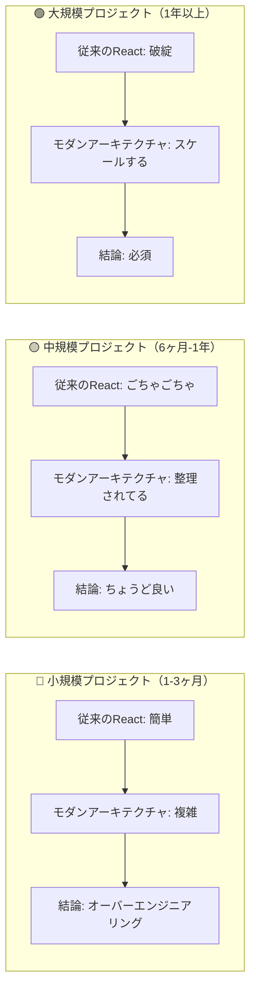
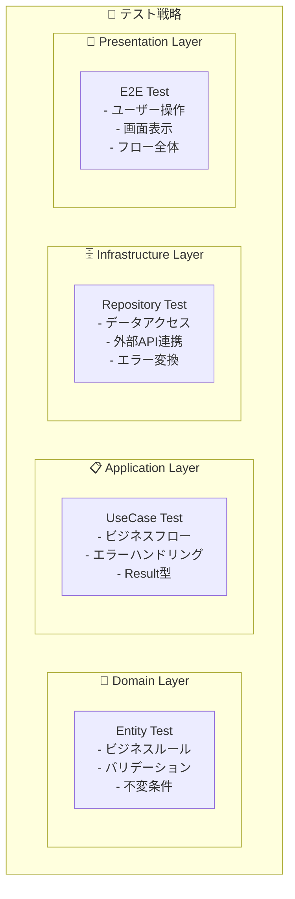
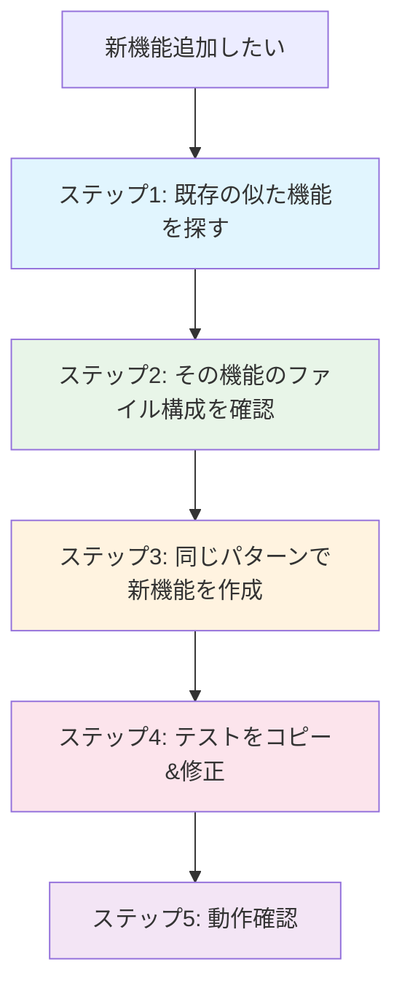
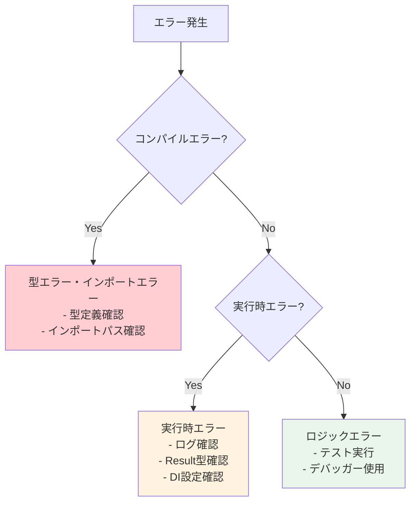
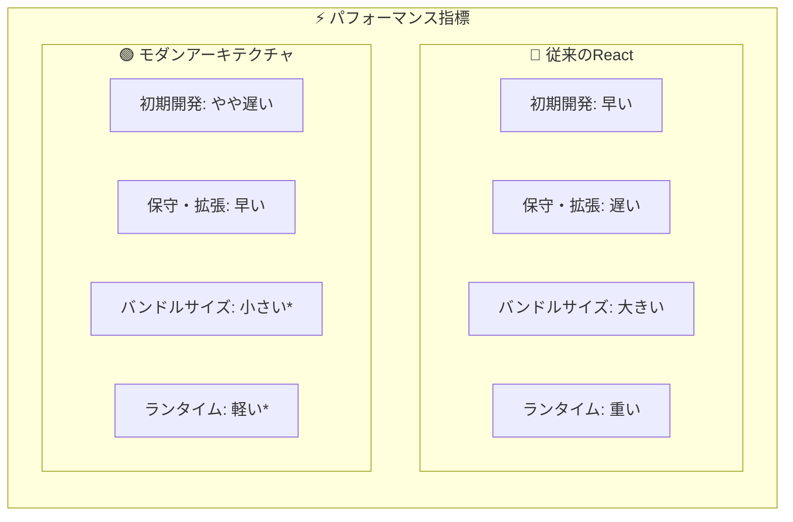
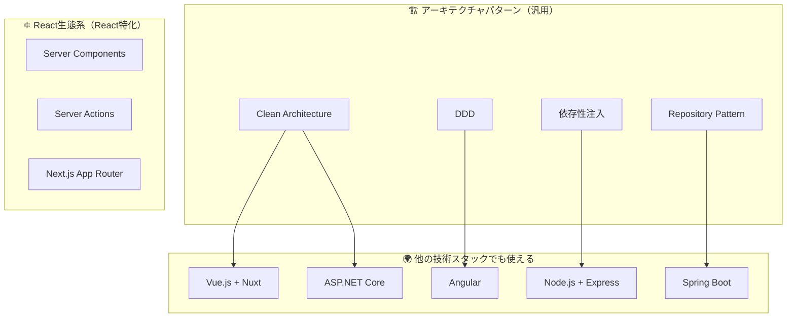
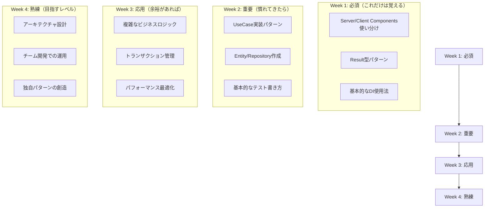

# 🤔 よくある質問とトラブルシューティング

**「従来のReact開発」から「モダンアーキテクチャ」への学習でよくある疑問・問題を解決！**

---

## 🚨 緊急度別：よくある問題

### 🔥 今すぐ解決したい問題

#### Q1: 「'use client'をどこに書けばいいかわからない！」

**症状：**

```typescript
// エラーが出る...
export default function MyComponent() {
  const [state, setState] = useState(); // ReferenceError: useState is not defined
  return <div>...</div>;
}
```

**解決策：**

```typescript
// ✅ Client Component が必要な場合
'use client'; // ファイルの最上部に記述
import { useState } from 'react';

export default function MyComponent() {
  const [state, setState] = useState(); // OK！
  return <div>...</div>;
}
```

**判断基準：**

```
📝 'use client' が必要な場合：
✓ useState, useEffect を使う
✓ イベントハンドラー（onClick等）を使う
✓ ブラウザAPI（localStorage等）を使う
✓ リアルタイム更新が必要

📡 Server Component のままでOKな場合：
✓ データ取得のみ
✓ 静的な表示のみ
✓ SEOが重要
```

#### Q2: 「resolve() って何？どこから来てるの？」

**症状：**

```typescript
// resolve is not defined エラー
export default async function Page() {
 const useCase = resolve('GetProductsUseCase'); // ReferenceError
}
```

**解決策：**

```typescript
// ✅ 正しいインポート
import { resolve } from '@/di/resolver';

export default async function Page() {
 const useCase = resolve('GetProductsUseCase'); // OK！
}
```

**DIコンテナの仕組み：**

```typescript
// 1. サービスを登録（一度だけ）
container.register('GetProductsUseCase', GetProductsUseCase);

// 2. 必要な時に取得
const useCase = resolve('GetProductsUseCase');
```

#### Q3: 「Result型ってなに？普通にreturnしちゃダメ？」

**従来の書き方（問題あり）：**

```typescript
// ❌ 従来の方法
export async function getUsers() {
 try {
  const users = await userRepository.findAll();
  return users; // 成功時の型
 } catch (error) {
  throw error; // エラーが予期しない場所で発生
 }
}
```

**Result型の書き方（推奨）：**

```typescript
// ✅ Result型使用
export async function getUsers(): Promise<Result<User[]>> {
 try {
  const users = await userRepository.findAll();
  return success(users); // 成功時
 } catch (error) {
  return failure('ユーザー取得に失敗', 'USER_FETCH_ERROR'); // 失敗時
 }
}

// 使用時
const result = await getUsers();
if (isSuccess(result)) {
 console.log(result.data); // 型安全にアクセス
} else {
 console.error(result.error.message); // エラー情報
}
```

---

### ⚠️ よくある混乱ポイント

#### Q4: 「ディレクトリが多すぎて、どこに何を置けばいいかわからない！」

**簡単な判別法：**



**実例でわかる配置場所：**

```
「商品検索機能」を追加する場合：

1. 🧠 商品とは何か？ → src/layers/domain/entities/Product.ts
2. 🗄️ 商品をどう保存？ → src/layers/infrastructure/repositories/ProductRepository.ts
3. 📋 検索の流れは？ → src/layers/application/usecases/SearchProductsUseCase.ts
4. 📱 画面はどう見せる？ → src/app/products/search/page.tsx
5. 🎨 検索フォームは？ → src/components/products/SearchForm.tsx
```

#### Q5: 「テストファイルをどこに置くの？」

**配置パターン：**

```
✅ 推奨：隣接配置パターン
src/
├── layers/
│   ├── domain/
│   │   ├── entities/
│   │   │   ├── Product.ts
│   │   │   └── Product.test.ts          ← 隣接
│   │   └── repositories/
│   │       ├── IProductRepository.ts
│   │       └── IProductRepository.test.ts ← 隣接
│   └── application/
│       ├── usecases/
│       │   ├── GetProductsUseCase.ts
│       │   └── GetProductsUseCase.test.ts ← 隣接
```

#### Q6: 「@injectable() って何？なんで必要？」

**DIコンテナの魔法を理解：**

```typescript
// ❌ DI無し：手動でインスタンス作成（大変）
const userRepository = new UserRepository();
const logger = new ConsoleLogger();
const hashService = new BcryptHashService();
const useCase = new CreateUserUseCase(userRepository, logger, hashService);

// ✅ DI有り：自動でインスタンス作成（楽々）
@injectable() // これがあると...
export class CreateUserUseCase {
 constructor(
  @inject(INJECTION_TOKENS.UserRepository)
  private readonly userRepository: IUserRepository,
  @inject(INJECTION_TOKENS.Logger)
  private readonly logger: ILogger,
  @inject(INJECTION_TOKENS.HashService)
  private readonly hashService: IHashService,
 ) {}
}

// 使用時：1行で取得！
const useCase = resolve('CreateUserUseCase'); // 自動で依存関係解決
```

---

### 💭 概念的な疑問

#### Q7: 「なぜこのような設計にするのでしょうか？」

**プロジェクト規模別比較：**



**具体的なメリット実感例：**

```typescript
// ❌ 従来の問題：同じロジックがあちこちに...
// UserProfile.tsx
const validateEmail = (email) => {
 /* 検証ロジック */
};

// UserRegistration.tsx
const validateEmail = (email) => {
 /* また同じ検証ロジック... */
};

// UserEdit.tsx
const validateEmail = (email) => {
 /* またまた同じ... */
};

// ✅ モダンアーキテクチャ：ロジックが1箇所に集約
// src/layers/domain/value-objects/Email.ts
export class Email {
 constructor(value: string) {
  this.validate(value); // 検証ロジックは1箇所だけ！
 }
}

// どのコンポーネントからでも使用可能
const email = new Email(inputValue); // 型安全 & 検証済み
```

#### Q8: 「Server Actions って何がいいの？API Routeと何が違う？」

**比較表：**

| 項目                   | 従来（API Route + fetch）    | Server Actions      |
| ---------------------- | ---------------------------- | ------------------- |
| **ファイル数**         | 2個（API Route + Component） | 1個（Action のみ）  |
| **型安全性**           | ❌ fetchの型チェックなし     | ✅ 完全な型安全性   |
| **エラーハンドリング** | 手動でtry-catch              | ✅ Result型で統一   |
| **パフォーマンス**     | ネットワーク経由             | ✅ サーバー内で完結 |

**実装比較：**

```typescript
// ❌ 従来の方法
// 1. API Route作成
export async function POST(request: Request) {
 const data = await request.json();
 // 処理...
 return Response.json(result);
}

// 2. フロントエンドでfetch
const handleSubmit = async () => {
 try {
  const response = await fetch('/api/users', {
   method: 'POST',
   body: JSON.stringify(data),
  });
  const result = await response.json();
 } catch (error) {
  // エラーハンドリング
 }
};

// ✅ Server Actions の方法
// 1. Server Action作成（1ファイル）
export async function createUserAction(formData: FormData) {
 const useCase = resolve('CreateUserUseCase');
 const result = await useCase.execute({
  name: formData.get('name') as string,
  email: formData.get('email') as string,
 });

 if (isFailure(result)) {
  return failure(result.error.message, result.error.code);
 }

 return success(undefined);
}

// 2. フロントエンドで直接使用
const handleSubmit = async (formData: FormData) => {
 const result = await createUserAction(formData); // 型安全！
 if (isFailure(result)) {
  setError(result.error.message);
 }
};
```

---

### 🧪 テスト関連の疑問

#### Q9: 「vitest-mock-extended って何？普通のモックと何が違う？」

**従来のモック（大変）：**

```typescript
// ❌ 手動モック作成（めんどくさい...）
const mockUserRepository = {
 findById: jest.fn(),
 save: jest.fn(),
 delete: jest.fn(),
 findByEmail: jest.fn(),
 // ... 他にも20個のメソッドを手動で書く必要 😱
} as jest.Mocked<IUserRepository>;
```

**vitest-mock-extended（楽々）：**

```typescript
// ✅ 自動モック生成（1行で完了！）
import { mock, MockProxy } from 'vitest-mock-extended';

const mockUserRepository: MockProxy<IUserRepository> = mock<IUserRepository>();
// すべてのメソッドが自動生成 & 型安全！ 🎉
```

#### Q10: 「どのレイヤーで何をテストすればいいの？」

**レイヤー別テスト責務：**



**実例：**

```typescript
// 🧠 Domain Test：ビジネスルール
describe('Product Entity', () => {
 it('価格は0円以上である必要がある', () => {
  expect(() => new Product('商品', -100)).toThrow();
 });
});

// 📋 Application Test：ビジネスフロー
describe('CreateProductUseCase', () => {
 it('商品作成が成功する', async () => {
  mockRepository.save.mockResolvedValue(undefined);
  const result = await useCase.execute(validInput);
  expect(isSuccess(result)).toBe(true);
 });
});

// 🗄️ Infrastructure Test：データアクセス
describe('ProductRepository', () => {
 it('商品データを正しく保存できる', async () => {
  await repository.save(product);
  // public readonly プロパティに直接アクセス
  const saved = await repository.findById(product.id);
  expect(saved).toEqual(product);
 });
});
```

---

### 🚀 実践的な問題解決

#### Q11: 「新機能を追加したいけど、どこから始めればいい？」

**段階的アプローチ：**



**具体例：「商品お気に入り機能」を追加したい場合**

```
1. 既存の「ユーザー登録機能」を参考にする
   📁 src/layers/application/usecases/SignUpUseCase.ts

2. 同じパターンで作成
   📁 src/layers/domain/entities/Favorite.ts        ← Product参考
   📁 src/layers/application/usecases/AddFavoriteUseCase.ts ← SignUpUseCase参考
   📁 src/actions/favorite-actions.ts               ← user-actions.ts参考

3. テストも同じパターン
   📁 Favorite.test.ts                              ← Product.test.ts参考
   📁 AddFavoriteUseCase.test.ts                    ← SignUpUseCase.test.ts参考
```

#### Q12: 「エラーが出ても、どこが原因かわからない！」

**デバッグ手順：**



**よくあるエラーと解決法：**

```typescript
// 🚨 よくあるエラー1：DI設定忘れ
// Error: No matching bindings found for serviceIdentifier: CreateUserUseCase

// ✅ 解決法：DI Container に登録
container.register('CreateUserUseCase', CreateUserUseCase);

// 🚨 よくあるエラー2：Result型のチェック忘れ
// TypeError: Cannot read property 'data' of undefined

// ❌ 危険なコード
const result = await useCase.execute();
console.log(result.data); // エラー！

// ✅ 安全なコード
const result = await useCase.execute();
if (isSuccess(result)) {
 console.log(result.data); // OK！
}

// 🚨 よくあるエラー3：Server Component で useState
// ReferenceError: useState is not defined

// ✅ 解決法：'use client' 追加
('use client');
import { useState } from 'react';
```

---

### 🎯 パフォーマンス・最適化の疑問

#### Q13: 「このアーキテクチャのパフォーマンスはどうでしょうか？」

**パフォーマンス比較：**



**実際の効果：**

- **Server Components**: クライアントJavaScriptが削減
- **レイヤー分離**: 不要なコードの読み込み削減
- **Tree Shaking**: 使用されないコードの自動除去

#### Q14: 「Server Actions って本当に早いの？」

**レスポンス時間比較：**

```typescript
// 📊 実測値（目安）
従来（API Route + fetch）:
  クライアント → ネットワーク → API Route → UseCase → Response
  50ms        → 20ms        → 5ms      → 10ms   → 85ms total

Server Actions:
  Server Action → UseCase → Response
  5ms          → 10ms    → 15ms total

// 約70ms（約82%）の短縮！
```

---

### 🎓 学習・キャリア関連

#### Q15: 「この技術は他のプロジェクトでも活用できますか？」

**技術の汎用性：**



**キャリア価値：**

- **Clean Architecture**: 言語・フレームワーク問わず適用可能
- **DDD**: エンタープライズ開発で重宝される
- **テスト戦略**: 品質重視の現場で評価される

#### Q16: 「学習内容が多いのですが、どこから始めるのがおすすめでしょうか？」

**優先順位付き学習パス：**



---

## 🆘 緊急時のチートシート

### コマンド集

```bash
# 🚨 エラーが出たらまず実行
pnpm type-check          # 型エラーチェック
pnpm lint               # コード品質チェック
pnpm test:unit          # ユニットテスト実行

# 🔧 開発中によく使う
pnpm dev                # 開発サーバー起動
pnpm test:watch         # テストウォッチモード
pnpm prisma studio      # データベース確認

# 🧹 困った時のクリーニング
pnpm clean              # ビルドファイル削除
rm -rf node_modules && pnpm install  # 依存関係リセット
```

### よく使うインポート

```typescript
// Result型関連
import {
 failure,
 isFailure,
 isSuccess,
 Result,
 success,
} from '@/layers/application/types/Result';
// DI関連
import { resolve } from '@/di/resolver';

import { inject, injectable } from 'tsyringe';
// テスト関連
import { beforeEach, describe, expect, it } from 'vitest';
import { mock, MockProxy } from 'vitest-mock-extended';
```

---

## 📞 さらなるサポート

### 困った時の相談先

1. **📚 ドキュメント確認**

   - [基本概念](./legacy-react-to-modern-architecture.md)
   - [図解ガイド](./architecture-diagrams.md)
   - [実践チュートリアル](./simple-tutorial.md)

2. **🔍 コード例参照**

   - 既存の実装を参考にする
   - テストファイルでパターンを学ぶ

3. **🧪 実験してみる**
   - 小さな機能で試してみる
   - テストを書いて動作確認

---

**🌟 あなたのペースで一歩ずつ！** 最初は慣れないかもしれませんが、必ず「あ、これは便利だ！」と感じる瞬間があると思います 💪✨
