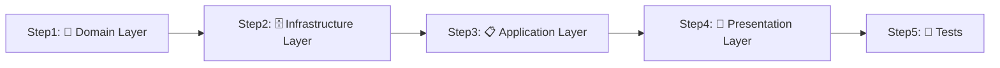

# 🚀 実践チュートリアル：「商品一覧機能」を作ってみよう

**手を動かして覚える！** 実際に簡単な機能を実装しながら、モダンアーキテクチャを体感するチュートリアルです。

---

## 🎯 このチュートリアルで作るもの

**「商品一覧表示機能」** を Clean Architecture + DDD で実装します。

```
📱 最終的にできるもの：
/products ページで商品一覧を表示
- 商品名、価格、説明を表示
- データベースから取得
- エラーハンドリング対応
```

---

## 📋 前提知識チェック

✅ 以下を先に読んでおくことをお勧めします：

- [レガシーReact開発者のためのモダンアーキテクチャ入門](./legacy-react-to-modern-architecture.md)
- [アーキテクチャ図解](./architecture-diagrams.md)

---

## 🏗️ 実装の流れ（Clean Architecture の順番）



**重要：** この順番で実装することで依存関係が正しく保たれます！

---

## Step 1: 🧠 Domain Layer - ビジネスルールを定義

### 1-1. Product Entity を作成

```typescript
// src/layers/domain/entities/Product.ts
export class Product {
 // ✅ public readonly でプロパティに直接アクセス可能
 constructor(
  public readonly id: string,
  public readonly name: string,
  public readonly price: number,
  public readonly description: string,
  public readonly createdAt: Date = new Date(),
 ) {
  this.validatePrice(price);
  this.validateName(name);
 }

 // ✅ ビジネスルール：価格は0円以上
 private validatePrice(price: number): void {
  if (price < 0) {
   throw new Error('価格は0円以上である必要があります');
  }
 }

 // ✅ ビジネスルール：商品名は必須
 private validateName(name: string): void {
  if (!name || name.trim().length === 0) {
   throw new Error('商品名は必須です');
  }
 }

 // getter メソッドは不要（product.id, product.name でアクセス）

 // 表示用の価格フォーマット（ドメインロジック）
 get formattedPrice(): string {
  return `¥${this.price.toLocaleString()}`;
 }
}
```

### 1-2. Repository Interface を定義

```typescript
// src/layers/domain/repositories/IProductRepository.ts
import { Product } from '../entities/Product';

export interface IProductRepository {
 findAll(): Promise<Product[]>;
 findById(id: string): Promise<Product | null>;
 save(product: Product): Promise<void>;
 delete(id: string): Promise<void>;
}
```

---

## Step 2: 🗄️ Infrastructure Layer - データアクセスを実装

### 2-1. Repository 実装を作成

```typescript
// src/layers/infrastructure/repositories/ProductRepository.ts
import { injectable } from 'tsyringe';

import { Product } from '@/layers/domain/entities/Product';
import { IProductRepository } from '@/layers/domain/repositories/IProductRepository';
import { prisma } from '@/layers/infrastructure/database/client';

@injectable()
export class ProductRepository implements IProductRepository {
 async findAll(): Promise<Product[]> {
  try {
   // Prismaでデータベースから取得
   const products = await prisma.product.findMany({
    orderBy: { createdAt: 'desc' },
   });

   // データベースのデータをDomainエンティティに変換
   return products.map(
    (product) =>
     new Product(
      product.id,
      product.name,
      product.price,
      product.description,
      product.createdAt,
     ),
   );
  } catch (error) {
   throw new Error(`商品一覧の取得に失敗しました: ${error.message}`);
  }
 }

 async findById(id: string): Promise<Product | null> {
  try {
   const product = await prisma.product.findUnique({
    where: { id },
   });

   if (!product) {
    return null;
   }

   return new Product(
    product.id,
    product.name,
    product.price,
    product.description,
    product.createdAt,
   );
  } catch (error) {
   throw new Error(`商品の取得に失敗しました: ${error.message}`);
  }
 }

 async save(product: Product): Promise<void> {
  try {
   // public readonly プロパティに直接アクセス
   await prisma.product.upsert({
    where: { id: product.id },
    update: {
     name: product.name,
     price: product.price,
     description: product.description,
    },
    create: {
     id: product.id,
     name: product.name,
     price: product.price,
     description: product.description,
    },
   });
  } catch (error) {
   throw new Error(`商品の保存に失敗しました: ${error.message}`);
  }
 }

 async delete(id: string): Promise<void> {
  try {
   await prisma.product.delete({
    where: { id },
   });
  } catch (error) {
   throw new Error(`商品の削除に失敗しました: ${error.message}`);
  }
 }
}
```

### 2-2. DI Container に登録

```typescript
// src/di/tokens.ts に追加
export const INJECTION_TOKENS = {
 // 既存のトークン...
 // Symbol.for() でグローバルに一意なトークンを作成
 ProductRepository: Symbol.for('ProductRepository'),
} as const;

// 型マッピング（ServiceTypeMap）にも追加
export type ServiceTypeMap = {
 // 既存のマッピング...
 GetProductsUseCase: GetProductsUseCase;
};
```

```typescript
// src/di/infrastructureContainer.ts に追加
import { container } from '@/di/container';
import { INJECTION_TOKENS } from '@/di/tokens';

import { ProductRepository } from '@/layers/infrastructure/repositories/ProductRepository';

// Repositoryの登録
container.register(INJECTION_TOKENS.ProductRepository, {
 useClass: ProductRepository,
});
```

---

## Step 3: 📋 Application Layer - UseCase を実装

### 3-1. DTO を定義

```typescript
// src/layers/application/dtos/GetProductsResponse.ts
export interface GetProductsResponse {
 products: {
  id: string;
  name: string;
  price: number;
  formattedPrice: string;
  description: string;
  createdAt: Date;
 }[];
}
```

### 3-2. UseCase を実装

```typescript
// src/layers/application/usecases/GetProductsUseCase.ts
import { inject, injectable } from 'tsyringe';

import { INJECTION_TOKENS } from '@/di/tokens';
import { GetProductsResponse } from '@/layers/application/dtos/GetProductsResponse';
import { failure, Result, success } from '@/layers/application/types/Result';
import { IProductRepository } from '@/layers/domain/repositories/IProductRepository';
import { ILogger } from '@/layers/domain/services/ILogger';

@injectable()
export class GetProductsUseCase {
 constructor(
  @inject(INJECTION_TOKENS.ProductRepository)
  private readonly productRepository: IProductRepository,

  @inject(INJECTION_TOKENS.Logger)
  private readonly logger: ILogger,
 ) {}

 async execute(): Promise<Result<GetProductsResponse>> {
  this.logger.info('商品一覧取得処理開始');

  try {
   // ドメインエンティティを取得
   const products = await this.productRepository.findAll();

   // DTOに変換（Presentation Layer向けの形式）
   // public readonly プロパティに直接アクセス
   const response: GetProductsResponse = {
    products: products.map((product) => ({
     id: product.id,
     name: product.name,
     price: product.price,
     formattedPrice: product.formattedPrice,
     description: product.description,
     createdAt: product.createdAt,
    })),
   };

   this.logger.info('商品一覧取得成功', { productCount: products.length });
   return success(response);
  } catch (error) {
   this.logger.error('商品一覧取得失敗', { error: error.message });
   return failure('商品一覧の取得に失敗しました', 'PRODUCTS_FETCH_ERROR');
  }
 }
}
```

### 3-3. UseCase を DI Container に登録

```typescript
// src/di/applicationContainer.ts に追加
import { container } from '@/di/container';

import { GetProductsUseCase } from '@/layers/application/usecases/GetProductsUseCase';

// UseCase の登録（文字列キーで ServiceTypeMap と紐付け）
container.register('GetProductsUseCase', {
 useClass: GetProductsUseCase,
});
```

---

## Step 4: 🎨 Presentation Layer - UI を実装

### 4-1. ProductCard コンポーネント作成

```typescript
// src/components/products/ProductCard.tsx
interface ProductCardProps {
  product: {
    id: string;
    name: string;
    formattedPrice: string;
    description: string;
    createdAt: Date;
  };
}

export function ProductCard({ product }: ProductCardProps) {
  return (
    <div className="bg-white rounded-lg shadow-md p-6 hover:shadow-lg transition-shadow">
      <h3 className="text-xl font-semibold text-gray-900 mb-2">
        {product.name}
      </h3>

      <p className="text-2xl font-bold text-blue-600 mb-3">
        {product.formattedPrice}
      </p>

      <p className="text-gray-600 mb-4">
        {product.description}
      </p>

      <p className="text-sm text-gray-400">
        登録日: {product.createdAt.toLocaleDateString('ja-JP')}
      </p>
    </div>
  );
}
```

### 4-2. ProductList コンポーネント作成

```typescript
// src/components/products/ProductList.tsx
import { ProductCard } from './ProductCard';

interface ProductListProps {
  products: {
    id: string;
    name: string;
    formattedPrice: string;
    description: string;
    createdAt: Date;
  }[];
}

export function ProductList({ products }: ProductListProps) {
  if (products.length === 0) {
    return (
      <div className="text-center py-8">
        <p className="text-gray-500">商品が登録されていません。</p>
      </div>
    );
  }

  return (
    <div className="grid grid-cols-1 md:grid-cols-2 lg:grid-cols-3 gap-6">
      {products.map((product) => (
        <ProductCard key={product.id} product={product} />
      ))}
    </div>
  );
}
```

### 4-3. Page Component 作成（Server Component）

```typescript
// src/app/products/page.tsx
import { resolve } from '@/di/resolver';
import { isSuccess, isFailure } from '@/layers/application/types/Result';
import { ProductList } from '@/components/products/ProductList';

export default async function ProductsPage() {
  // 🎯 UseCase を DI Container から取得
  const getProductsUseCase = resolve('GetProductsUseCase');

  // 🎯 UseCase を実行
  const result = await getProductsUseCase.execute();

  // 🎯 Result型でエラーハンドリング
  if (isFailure(result)) {
    return (
      <div className="container mx-auto px-4 py-8">
        <h1 className="text-3xl font-bold text-gray-900 mb-8">商品一覧</h1>
        <div className="bg-red-100 border border-red-400 text-red-700 px-4 py-3 rounded">
          <p>エラー: {result.error.message}</p>
        </div>
      </div>
    );
  }

  // 🎯 成功時の表示
  return (
    <div className="container mx-auto px-4 py-8">
      <h1 className="text-3xl font-bold text-gray-900 mb-8">商品一覧</h1>
      <ProductList products={result.data.products} />
    </div>
  );
}
```

---

## Step 5: 🧪 テストを作成

### 5-1. Product Entity のテスト

```typescript
// src/layers/domain/entities/Product.test.ts
import { describe, expect, it } from 'vitest';

import { Product } from './Product';

describe('Product Entity', () => {
 it('正常な商品を作成できる', () => {
  const product = new Product('1', 'テスト商品', 1000, 'テスト商品の説明');

  // public readonly プロパティに直接アクセス
  expect(product.name).toBe('テスト商品');
  expect(product.price).toBe(1000);
  expect(product.formattedPrice).toBe('¥1,000');
 });

 it('価格が負の値の場合エラーが発生する', () => {
  expect(() => {
   new Product('1', 'テスト商品', -100, 'テスト商品の説明');
  }).toThrow('価格は0円以上である必要があります');
 });

 it('商品名が空の場合エラーが発生する', () => {
  expect(() => {
   new Product('1', '', 1000, 'テスト商品の説明');
  }).toThrow('商品名は必須です');
 });
});
```

### 5-2. GetProductsUseCase のテスト

```typescript
// src/layers/application/usecases/GetProductsUseCase.test.ts
import { beforeEach, describe, expect, it } from 'vitest';
import { mock, MockProxy } from 'vitest-mock-extended';

import { isFailure, isSuccess } from '@/layers/application/types/Result';
import { GetProductsUseCase } from '@/layers/application/usecases/GetProductsUseCase';
import { Product } from '@/layers/domain/entities/Product';
import { IProductRepository } from '@/layers/domain/repositories/IProductRepository';
import { ILogger } from '@/layers/domain/services/ILogger';

describe('GetProductsUseCase', () => {
 let mockProductRepository: MockProxy<IProductRepository>;
 let mockLogger: MockProxy<ILogger>;
 let useCase: GetProductsUseCase;

 beforeEach(() => {
  // 🎭 自動モック生成（vitest-mock-extended）
  mockProductRepository = mock<IProductRepository>();
  mockLogger = mock<ILogger>();
  useCase = new GetProductsUseCase(mockProductRepository, mockLogger);
 });

 it('商品一覧取得が成功する', async () => {
  // モックデータの準備
  const mockProducts = [
   new Product('1', '商品1', 1000, '説明1'),
   new Product('2', '商品2', 2000, '説明2'),
  ];
  mockProductRepository.findAll.mockResolvedValue(mockProducts);

  // UseCase実行
  const result = await useCase.execute();

  // 検証
  expect(isSuccess(result)).toBe(true);
  if (isSuccess(result)) {
   expect(result.data.products).toHaveLength(2);
   expect(result.data.products[0].name).toBe('商品1');
   expect(result.data.products[0].formattedPrice).toBe('¥1,000');
  }

  // ログ出力の確認
  expect(mockLogger.info).toHaveBeenCalledWith('商品一覧取得処理開始');
  expect(mockLogger.info).toHaveBeenCalledWith('商品一覧取得成功', {
   productCount: 2,
  });
 });

 it('リポジトリでエラーが発生した場合、失敗が返される', async () => {
  // モックでエラーを発生させる
  mockProductRepository.findAll.mockRejectedValue(new Error('Database error'));

  // UseCase実行
  const result = await useCase.execute();

  // 検証
  expect(isFailure(result)).toBe(true);
  if (isFailure(result)) {
   expect(result.error.message).toBe('商品一覧の取得に失敗しました');
   expect(result.error.code).toBe('PRODUCTS_FETCH_ERROR');
  }

  // エラーログの確認
  expect(mockLogger.error).toHaveBeenCalledWith('商品一覧取得失敗', {
   error: 'Database error',
  });
 });
});
```

---

## 🚀 実行・確認

### 1. データベースセットアップ

```sql
-- Prisma schema に追加（schema.prisma）
model Product {
  id          String   @id @default(cuid())
  name        String
  price       Int
  description String
  createdAt   DateTime @default(now())
  updatedAt   DateTime @updatedAt

  @@map("products")
}
```

```bash
# マイグレーション実行
pnpm prisma migrate dev --name add-product-table

# サンプルデータ挿入
pnpm prisma db seed
```

### 2. テスト実行

```bash
# テスト実行
pnpm test:unit

# カバレッジ確認
pnpm test:coverage
```

### 3. 開発サーバー起動

```bash
# 開発サーバー起動
pnpm dev

# http://localhost:3000/products にアクセス
```

---

## 🎯 振り返り：何ができたか？

### ✅ 実装できたもの

1. **🧠 Domain Layer**

   - Product Entity（ビジネスルール含む）
   - IProductRepository Interface

2. **🗄️ Infrastructure Layer**

   - ProductRepository 実装
   - DI Container 設定

3. **📋 Application Layer**

   - GetProductsUseCase
   - Result型によるエラーハンドリング

4. **🎨 Presentation Layer**

   - Server Component（/products ページ）
   - UIコンポーネント（ProductCard, ProductList）

5. **🧪 Tests**
   - Entity テスト
   - UseCase テスト（モック使用）

### 🔍 Clean Architecture の効果を体感

**従来のReact開発との違い：**

- ✅ **責務分離**: ビジネスロジックがUIから分離
- ✅ **テスタビリティ**: 各層を独立してテスト可能
- ✅ **型安全**: TypeScript + Result型で実行時エラー削減
- ✅ **再利用性**: UseCaseは他の画面でも使用可能
- ✅ **保守性**: 修正時の影響範囲が明確

---

## 🚀 次のステップ

### レベル1: 基本機能の拡張

- [ ] 商品詳細表示機能の追加
- [ ] 商品検索機能の実装
- [ ] ページネーション機能

### レベル2: より複雑な機能

- [ ] 商品作成・編集機能（Server Actions使用）
- [ ] 商品削除機能
- [ ] カテゴリ分類機能

### レベル3: 高度な機能

- [ ] ユーザー認証との連携
- [ ] 商品お気に入り機能
- [ ] 購入機能（トランザクション管理）

---

## 💡 よくあるつまづきポイント

### Q: UseCase で DI が効かない

```typescript
// ❌ DIコンテナ登録忘れ
// container.register('GetProductsUseCase', GetProductsUseCase); // これを忘れがち

// ✅ 正しい登録
container.register('GetProductsUseCase', GetProductsUseCase);
```

### Q: Result型の使い方がわからない

```typescript
// ❌ 直接値にアクセス
const data = result.data; // コンパイルエラー

// ✅ 型安全なアクセス
if (isSuccess(result)) {
 const data = result.data; // 型安全
}
```

### Q: Server Component で useState が使えない

```typescript
// ❌ Server Component で useState
export default async function Page() {
 const [state, setState] = useState(); // エラー！
}

// ✅ Client Component で useState
('use client');
export function InteractiveComponent() {
 const [state, setState] = useState(); // OK！
}
```

---

**🎉 お疲れ様でした！** Clean Architecture での開発を体感できましたか？

**次は実際のプロジェクトで活用してみましょう！** 💪✨
