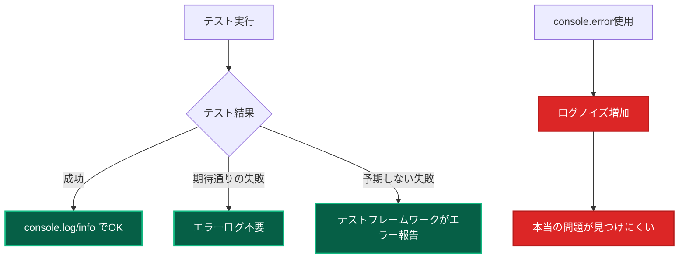

# コーディング基準・規約 📝

このドキュメントでは、プロジェクトで統一すべきコーディング規約、コミットメッセージ、ロギング制約について説明します。

---

## コミットメッセージ規約 🚀

### 基本フォーマット

**フォーマット：`絵文字: 日本語の説明`**

```bash
# ✅ 正しい例
✨: ユーザー登録機能を追加
🐛: サインイン時のバリデーションエラーを修正
📝: READMEにセットアップ手順を追加
🎨: UserComponentのスタイルを改善
🔧: Biomeの設定を更新

# ❌ 避けるべき例
Add user registration feature  # 英語
add: ユーザー登録機能追加     # 絵文字なし
feat: ユーザー登録機能追加    # conventional commitsスタイル
```

### 絵文字ガイド

**機能・修正系**

| 絵文字 | 用途               | 例                                           |
| ------ | ------------------ | -------------------------------------------- |
| ✨     | 新機能追加         | `✨: ユーザープロフィール編集機能を追加`     |
| 🐛     | バグ修正           | `🐛: サインイン時のセッション切れ問題を修正` |
| 🔧     | 設定・ツール変更   | `🔧: Tailwind CSS設定を最新化`               |
| ⚡     | パフォーマンス改善 | `⚡: 画像読み込み速度を最適化`               |
| 💄     | UI・スタイル改善   | `💄: ボタンのホバーエフェクトを改善`         |

**ドキュメント・テスト系**

| 絵文字 | 用途                   | 例                                    |
| ------ | ---------------------- | ------------------------------------- |
| 📝     | ドキュメント追加・更新 | `📝: API仕様書を更新`                 |
| ✅     | テスト追加・修正       | `✅: UserServiceのテストケースを追加` |
| 🧪     | 実験的機能             | `🧪: 新しいUI パターンを試験的に実装` |

**リファクタ・構造系**

| 絵文字 | 用途                 | 例                                           |
| ------ | -------------------- | -------------------------------------------- |
| ♻️     | リファクタリング     | `♻️: UserRepositoryを依存注入パターンに変更` |
| 🗃️     | データベース関連     | `🗃️: ユーザーテーブルにインデックスを追加`   |
| 🔥     | コード・ファイル削除 | `🔥: 未使用のユーティリティ関数を削除`       |

### 実例とその理由

**良いコミットメッセージ例**

```bash
✨: ヘッダーのサイドナビゲーション連動パディング調整
```

**なぜ良いのか：**

- **絵文字で種類が一目瞭然** - ✨で新機能とわかる
- **具体的な変更内容** - どの部分をどう変更したかが明確
- **日本語で可読性が高い** - チームメンバーが理解しやすい

```bash
🐛: フォーム送信時のバリデーションメッセージ重複を修正
```

**なぜ良いのか：**

- **問題の特定** - フォーム送信という状況が明確
- **修正内容の明確化** - バリデーションメッセージ重複という具体的問題

**避けるべきコミットメッセージ例**

```bash
# ❌ 悪い例とその理由
update           # 何を更新したかわからない
fix bug          # どのバグを修正したかわからない
WIP              # 作業中の状態をコミットしてしまっている
小さな修正        # 何の修正かわからない
```

---

## ロギング制約 📊

### テスト時のロギング制約

**原則：テスト時はエラーログを使用しない**

```typescript
// ❌ テストで避けるべきロギング
describe('UserService', () => {
 it('ユーザー作成テスト', async () => {
  try {
   const result = await userService.create(userData);
   expect(result).toBeDefined();
  } catch (error) {
   console.error('テスト失敗:', error); // ❌ エラーログは使わない
   logger.error('Test failed', error); // ❌ エラーログは使わない
   throw error;
  }
 });
});
```

```typescript
// ✅ テストで推奨するロギング
describe('UserService', () => {
 it('ユーザー作成テスト', async () => {
  console.log('ユーザー作成テスト開始'); // ✅ 情報ログはOK

  const result = await userService.create(userData);

  console.log('テスト結果:', result); // ✅ 状況把握のためのログ
  expect(result).toBeDefined();
 });

 it('異常系：バリデーションエラー', async () => {
  console.info('バリデーションエラーテスト開始'); // ✅ infoレベルはOK

  await expect(userService.create(invalidUserData)).rejects.toThrow(
   'バリデーションエラー',
  );

  // テストが正常に失敗した場合はエラーログ不要
 });
});
```

**なぜエラーログを避けるのか？**



### 本番コードでのロギング

**構造化ログによる効果的なロギング**

```typescript
// ✅ 良いロギング例
export class CreateUserUseCase {
 async execute(data: CreateUserRequest): Promise<User> {
  const logger = resolve('Logger');

  // 開始ログ
  logger.info('ユーザー作成開始', {
   email: data.email,
   requestId: generateRequestId(),
  });

  try {
   // ビジネスロジック実行
   const user = await this.userRepository.create(data);

   // 成功ログ
   logger.info('ユーザー作成成功', {
    userId: user.id,
    email: user.email,
    createdAt: user.createdAt,
   });

   return user;
  } catch (error) {
   // エラーログ（本番では必要）
   logger.error('ユーザー作成失敗', {
    email: data.email,
    error: error.message,
    stack: error.stack,
   });
   throw error;
  }
 }
}
```

**ログレベルの使い分け**

| レベル         | 用途                           | 例                                  |
| -------------- | ------------------------------ | ----------------------------------- |
| `logger.error` | 予期しないエラー・システム障害 | データベース接続エラー、外部API障害 |
| `logger.warn`  | 警告・注意喚起                 | 廃止予定機能の使用、設定値の問題    |
| `logger.info`  | 重要なビジネスイベント         | ユーザー登録、重要な処理完了        |
| `logger.debug` | 詳細なデバッグ情報             | 処理ステップの詳細、変数の値        |

---

## TypeScript コーディング規約 📐

### strict mode の徹底

**必須設定：tsconfig.json**

```json
{
 "compilerOptions": {
  "strict": true,
  "noUncheckedIndexedAccess": true,
  "exactOptionalPropertyTypes": true,
  "noImplicitReturns": true,
  "noImplicitOverride": true
 }
}
```

**型安全性の確保**

```typescript
// ✅ 推奨：明示的な型定義
interface CreateUserRequest {
 name: string;
 email: string;
 password: string;
 age?: number; // オプショナルは明示的に
}

export async function createUser(
 data: CreateUserRequest,
): Promise<CreateUserResponse> {
 // 実装
}

// ❌ 避ける：any型の使用
export async function createUser(data: any): Promise<any> {
 // 型安全性が失われる
}
```

### ディレクティブの使用規則

**Server Actions / Client Components**

```typescript
// ✅ Server Actions
'use server';
export async function createUser(formData: FormData) {
 // Server側でのみ実行される処理
}

// ✅ Client Components
('use client');
export function InteractiveButton() {
 const [count, setCount] = useState(0);
 // Client側でのみ実行される処理
}
```

**ディレクティブの配置ルール**

```typescript
// ✅ 正しい配置：ファイルの先頭
'use client';
import React, { useState } from 'react';

export function MyComponent() {
 // コンポーネント実装
}

// ❌ 間違った配置：インポート後
import React, { useState } from 'react';
('use client'); // インポート後は無効
```

---

## モジュール・インポート規約 📦

**基本ルール**

- **index.ts ファイル作成禁止**
- **個別インポート必須**
- **@/\* alias使用必須**
- **相対パス禁止**

```typescript
// ✅ 推奨
import { Button } from '@/components/ui/button';
import { Input } from '@/components/ui/input';

// ❌ 禁止
import { Button, Input } from '@/components/ui'; // index.ts経由
import { Button } from '../../ui/Button'; // 相対パス
```

---

## ファイル・ディレクトリ命名規則 📁

### コンポーネントファイル

**規則：PascalCase + 用途サフィックス**

```
# ✅ 推奨
UserProfileClient.tsx     # Client Component
UserProfilePage.tsx       # Page Component
CreateUserForm.tsx        # フォームコンポーネント
UserListTable.tsx         # テーブルコンポーネント

# ❌ 避ける
userProfile.tsx           # camelCase
user-profile.tsx          # kebab-case
UserProfile.tsx          # 用途不明
```

### UseCase・Service ファイル

**規則：PascalCase + 機能 + 種別**

```
# ✅ 推奨
CreateUserUseCase.ts      # UseCase
UserDomainService.ts      # Domain Service
PrismaUserRepository.ts   # Repository実装

# ❌ 避ける
createUser.ts            # 種別不明
UserUseCase.ts           # 機能不明
userRepository.ts        # camelCase
```

### テストファイル

**規則：対象ファイル名 + .test.ts**

```
# ✅ 推奨
CreateUserUseCase.test.ts
UserDomainService.test.ts
UserProfileClient.test.tsx

# ❌ 避ける
CreateUserTest.ts        # .test. がない
test_CreateUser.ts       # 命名スタイル不統一
```

---

## API・型定義規約 🔗

### Request/Response 型定義

**統一されたパターン**

```typescript
// ✅ 推奨パターン
export interface CreateUserRequest {
 name: string;
 email: string;
 password: string;
}

export interface CreateUserResponse {
 id: string;
 name: string;
 email: string;
 createdAt: Date;
}

export interface ApiResponse<T> {
 success: boolean;
 data?: T;
 error?: string;
 message?: string;
}
```

### エラーハンドリング

**統一されたエラー型**

```typescript
export class DomainError extends Error {
 constructor(
  message: string,
  public readonly code: string,
  public readonly details?: Record<string, any>,
 ) {
  super(message);
  this.name = 'DomainError';
 }
}

// 使用例
throw new DomainError('ユーザーが見つかりません', 'USER_NOT_FOUND', {
 userId: id,
});
```

---

## コード品質チェック 🔍

### 必須チェック項目

**コミット前チェックリスト**

```bash
# 1. リントエラーの確認
pnpm lint

# 2. 型チェック
pnpm type-check

# 3. テスト実行
pnpm test

# 4. フォーマット確認
pnpm format --check
```

### Biome 設定

**プロジェクトルートの設定ファイル**

- `biome.json` - Biome設定（Lint + Format 統合）

**設定例**

```json
// biome.json
{
  "$schema": "https://biomejs.dev/schemas/2.0.0/schema.json",
  "linter": {
    "enabled": true,
    "rules": {
      "recommended": true,
      "suspicious": {
        "noExplicitAny": "error"
      },
      "correctness": {
        "useExhaustiveDependencies": "error"
      }
    }
  },
  "formatter": {
    "enabled": true,
    "indentStyle": "space",
    "indentWidth": 2
  }
}
```

---

## まとめ 🎯

### 開発基準の核心原則

1. **一貫性** - チーム全体で統一されたスタイル
2. **可読性** - 他の開発者が理解しやすいコード
3. **保守性** - 将来の変更に対応しやすい構造
4. **型安全性** - TypeScript strict mode の徹底活用

### 日常の開発フロー

```mermaid
graph LR
    A[コード実装] --> B[型チェック]
    B --> C[テスト実行]
    C --> D[リント・フォーマット]
    D --> E[適切なコミットメッセージ]
    E --> F[コミット]

    style A fill:#065f46,stroke:#10b981,stroke-width:2px,color:#ffffff
    style B fill:#1e40af,stroke:#3b82f6,stroke-width:2px,color:#ffffff
    style C fill:#7c3aed,stroke:#8b5cf6,stroke-width:2px,color:#ffffff
    style D fill:#92400e,stroke:#f59e0b,stroke-width:2px,color:#ffffff
    style E fill:#065f46,stroke:#10b981,stroke-width:2px,color:#ffffff
    style F fill:#1e40af,stroke:#3b82f6,stroke-width:2px,color:#ffffff
```



---

## 関連ドキュメント 📚

- [開発ワークフロー](./development/workflow.md) - 実装手順全般
- [テスト戦略](../testing/strategy.md) - テスト実装方針
- [フロントエンド ベストプラクティス](./frontend-best-practices.md) - UI開発規約
