# アーキテクチャ選択肢の比較 🏗️

このドキュメントでは、3つの主要なアーキテクチャ選択肢を比較し、それぞれのメリット・デメリット、適用場面について詳しく説明します。

---

## 概要 📐

### 3つのアーキテクチャ選択肢

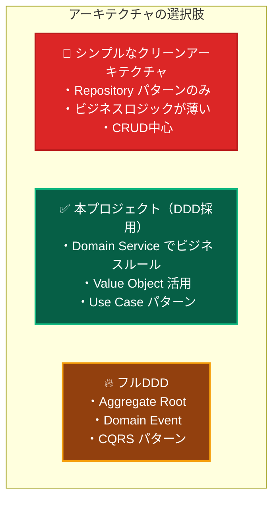

**本プロジェクトは「DDD（ドメイン駆動設計）」を採用しています** 🎯

- ✅ Domain Layer でビジネスロジックを管理
- ✅ Domain Service でビジネスルール検証
- ✅ Value Object（Email、UserId等）を活用
- ✅ Repository パターンで永続化を抽象化
- ✅ Use Case でアプリケーションフローを制御

---

## 選択肢1：シンプルなクリーンアーキテクチャ 🚫

**※ 本プロジェクトでは採用していません**

### 特徴

- Repository パターンのみ
- ビジネスロジックが薄い
- CRUD中心の処理
- 外部サービスとの統合が主目的

### シンプルアーキテクチャの実装フロー

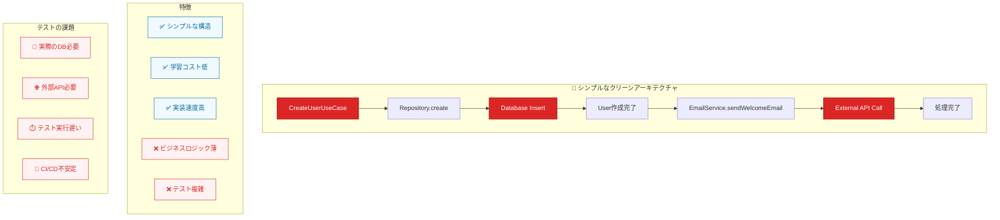

### メリット・デメリット

| 項目                 | 評価             |
| -------------------- | ---------------- |
| **学習コスト**       | 低い             |
| **実装速度**         | 高い             |
| **適用範囲**         | 小規模・CRUD中心 |
| **ビジネスロジック** | 薄い             |
| **テスト複雑度**     | 低い             |

### シンプルアーキテクチャの深刻な問題点

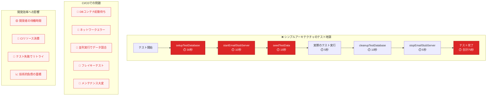

---

## 選択肢2：本プロジェクト（DDD採用） ✅

**※ 本プロジェクトで採用している手法**

### 特徴

- Domain Service でビジネスルール管理
- Value Object で型安全性確保
- Entity で複雑なドメインロジック
- Repository パターンで永続化抽象化
- Use Case でアプリケーションフロー制御

### DDDアプローチの実装フロー

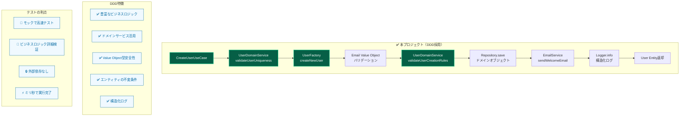

### DDDテストの革命的改善

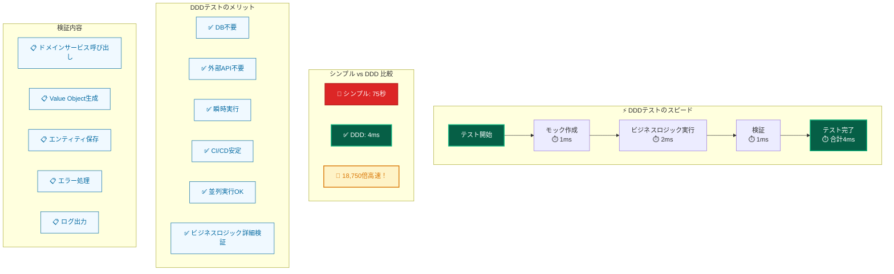

### メリット・デメリット

| 項目                 | 評価                       |
| -------------------- | -------------------------- |
| **学習コスト**       | 中程度                     |
| **実装速度**         | 中程度                     |
| **適用範囲**         | 中規模・ビジネスロジック有 |
| **ビジネスロジック** | 豊富                       |
| **テスト複雑度**     | 中程度                     |
| **保守性**           | 高い                       |

### 実際のメリット

```typescript
// ✅ 本プロジェクト（DDD）の場合：完全に独立したテスト
describe('CreateUserUseCase (DDD)', () => {
 it('ユーザー作成成功', async () => {
  // メリット1: DBもAPIも不要！
  // メリット2: 瞬時にテスト実行（ミリ秒）
  // メリット3: CI/CDで安定動作

  const mockRepo = createMockUserRepository();
  const mockDomainService = createMockUserDomainService();
  const mockEmailService = createMockEmailService();

  const useCase = new CreateUserUseCase(
   mockRepo,
   mockDomainService,
   mockEmailService,
  );

  // 瞬時に実行完了！
  const result = await useCase.execute(userData);

  // ビジネスロジックの詳細な検証が可能
  expect(mockDomainService.validateUserUniqueness).toHaveBeenCalled();
 });
});
```

---

## 選択肢3：フルDDD（高度なパターン） 🔥

**※ 本プロジェクトでは採用していません（オーバーエンジニアリング）**

### 特徴

- Aggregate Root で複数エンティティ管理
- Domain Event で非同期処理
- CQRS でコマンドとクエリ分離
- Event Sourcing（オプション）
- Unit of Work パターン

### フルDDD実装の複雑性

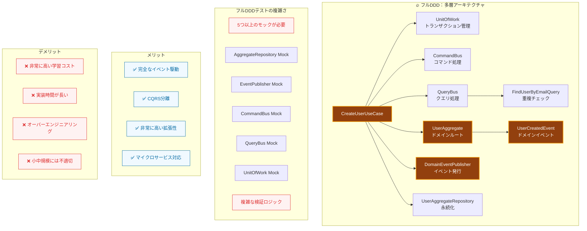

### フルDDDテストの複雑性

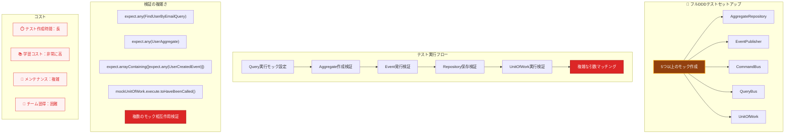

### メリット・デメリット

| 項目                 | 評価                 |
| -------------------- | -------------------- |
| **学習コスト**       | 非常に高い           |
| **実装速度**         | 低い                 |
| **適用範囲**         | 大規模・複雑ドメイン |
| **ビジネスロジック** | 非常に豊富           |
| **テスト複雑度**     | 高い                 |
| **保守性**           | 非常に高い           |

---

## 総合比較 📊

### 各アーキテクチャの比較表

| 観点             | シンプル                  | 本プロジェクト（DDD）                              | フルDDD                                                             |
| ---------------- | ------------------------- | -------------------------------------------------- | ------------------------------------------------------------------- |
| **モック対象**   | Repository + 外部サービス | Repository + DomainService + 外部サービス + Logger | AggregateRepo + EventPublisher + CommandBus + QueryBus + UnitOfWork |
| **テスト内容**   | データの入出力            | ビジネスルール + データフロー                      | Aggregate + Event + CQRS + Transaction                              |
| **モック数**     | 2-3個                     | 4-6個                                              | 5-8個以上                                                           |
| **テストケース** | 正常系中心                | 正常系 + 複数の異常系                              | 正常系 + 異常系 + イベント + トランザクション                       |
| **検証内容**     | 呼び出し回数・引数        | ビジネスロジックの実行順序・条件分岐               | Aggregate状態 + Event発行 + CQRS分離                                |
| **学習コスト**   | 低                        | 中                                                 | 高                                                                  |
| **適用場面**     | 小規模・CRUD中心          | 中規模・ビジネスロジック有                         | 大規模・複雑ドメイン                                                |

### 複雑さの段階的増加

#### 1. シンプルアーキテクチャ：CRUD中心

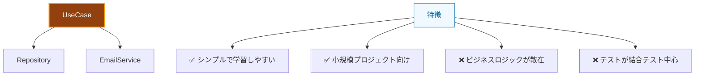

**テスト特性**：モック対象2つ、データ入出力テスト、学習コスト低

#### 2. 本プロジェクト：DDD基本

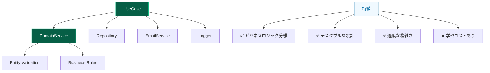

**テスト特性**：モック対象4-6個、ビジネスロジックテスト、学習コスト中

#### 3. フルDDD：高度なパターン

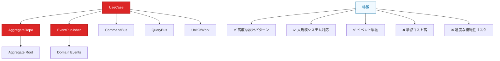

**テスト特性**：モック対象5-8個、イベント+CQRSテスト、学習コスト高

### 実際の開発での比較

| 観点               | シンプル（外部依存）  | 本プロジェクト（DDD）  | フルDDD（高度）        |
| ------------------ | --------------------- | ---------------------- | ---------------------- |
| **テスト実行時間** | 数秒〜数十秒          | 数ミリ秒               | 数ミリ秒               |
| **CI/CD安定性**    | 不安定（外部依存）    | 安定（依存なし）       | 安定（依存なし）       |
| **環境構築**       | 複雑（DB+API+スタブ） | シンプル（コードのみ） | シンプル（コードのみ） |
| **並列実行**       | 困難（データ競合）    | 容易（独立実行）       | 容易（独立実行）       |
| **デバッグ**       | 困難（どこで失敗？）  | 容易（ロジックに集中） | 複雑（多層構造）       |
| **開発速度**       | 遅い（環境待ち）      | 速い（即座に実行）     | 中程度（設計時間）     |
| **保守性**         | 低い（密結合）        | 高い（疎結合）         | 非常に高い（完全分離） |

---

## CI/CDでの実際の違い 🔧

### CI/CD設定の劇的な違い

```mermaid
graph TB
    subgraph "❌ シンプルアーキテクチャのCI地獄"
        A1[GitHub Actions開始] --> A2[PostgreSQLコンテナ起動]
        A2 --> A3[MailHogコンテナ起動]
        A3 --> A4[ヘルスチェック待機<br/>⏱️ 30秒]
        A4 --> A5[テストデータシード<br/>⏱️ 2分]
        A5 --> A6[テスト実行<br/>⏱️ 10分]
        A6 --> A7[コンテナクリーンアップ<br/>⏱️ 1分]
        A7 --> A8[CI完了<br/>⏱️ 合計13分30秒]
    end

    subgraph "シンプルアーキテクチャのCI問題"
        B1[🚫 複雑なサービス設定]
        B2[🚫 ネットワーク依存]
        B3[🚫 リソース消費大]
        B4[🚫 フレイキーテスト]
        B5[🚫 デバッグ困難]
    end

    subgraph "✅ DDD（本プロジェクト）のCIシンプル"
        C1[GitHub Actions開始] --> C2[npm test実行<br/>⏱️ 30秒]
        C2 --> C3[CI完了<br/>⏱️ 合計30秒]
    end

    subgraph "DDDのCIメリット"
        D1[✅ 設定がシンプル]
        D2[✅ 外部サービス不要]
        D3[✅ 高速実行]
        D4[✅ 安定性が高い]
        D5[✅ リソース効率良い]
    end

    subgraph "速度比較"
        E1[シンプル: 13分30秒]
        E2[DDD: 30秒]
        E3[🚀 27倍高速！]
    end

    style A2 fill:#dc2626,stroke:#b91c1c,stroke-width:2px,color:#ffffff
    style A3 fill:#dc2626,stroke:#b91c1c,stroke-width:2px,color:#ffffff
    style A4 fill:#dc2626,stroke:#b91c1c,stroke-width:2px,color:#ffffff
    style A5 fill:#dc2626,stroke:#b91c1c,stroke-width:2px,color:#ffffff
    style A8 fill:#dc2626,stroke:#b91c1c,stroke-width:2px,color:#ffffff

    style C1 fill:#065f46,stroke:#10b981,stroke-width:2px,color:#ffffff
    style C2 fill:#065f46,stroke:#10b981,stroke-width:2px,color:#ffffff
    style C3 fill:#065f46,stroke:#10b981,stroke-width:2px,color:#ffffff

    style B1 fill:#fef2f2,stroke:#dc2626,stroke-width:1px,color:#dc2626
    style B2 fill:#fef2f2,stroke:#dc2626,stroke-width:1px,color:#dc2626
    style B3 fill:#fef2f2,stroke:#dc2626,stroke-width:1px,color:#dc2626
    style B4 fill:#fef2f2,stroke:#dc2626,stroke-width:1px,color:#dc2626
    style B5 fill:#fef2f2,stroke:#dc2626,stroke-width:1px,color:#dc2626

    style D1 fill:#f0f9ff,stroke:#0369a1,stroke-width:1px,color:#0369a1
    style D2 fill:#f0f9ff,stroke:#0369a1,stroke-width:1px,color:#0369a1
    style D3 fill:#f0f9ff,stroke:#0369a1,stroke-width:1px,color:#0369a1
    style D4 fill:#f0f9ff,stroke:#0369a1,stroke-width:1px,color:#0369a1
    style D5 fill:#f0f9ff,stroke:#0369a1,stroke-width:1px,color:#0369a1

    style E1 fill:#dc2626,stroke:#b91c1c,stroke-width:2px,color:#ffffff
    style E2 fill:#065f46,stroke:#10b981,stroke-width:2px,color:#ffffff
    style E3 fill:#fef3c7,stroke:#d97706,stroke-width:2px,color:#d97706
```

---

## 複雑さが増す理由の分析 🔍

### 本プロジェクト（DDD）でモックが増える理由

1. **ドメインサービス**：複雑なビジネスルールを担当
2. **エンティティ**：ドメインオブジェクトの生成・検証
3. **バリューオブジェクト**：Email、UserIdなどの型安全性
4. **ドメインイベント**：ビジネスイベントの処理
5. **ロギング**：ビジネス処理の追跡

### フルDDDでさらに複雑になる理由

1. **Aggregate Root**：複数エンティティの整合性管理
2. **Domain Events**：非同期イベント処理
3. **CQRS**：コマンドとクエリの分離
4. **Unit of Work**：トランザクション管理
5. **Event Sourcing**：イベントストア（オプション）

---

## 選択理由と実際の効果 💡

### なぜDDDの方が実用的なのか？

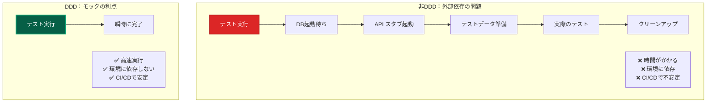

### 実際の開発チームでの体験

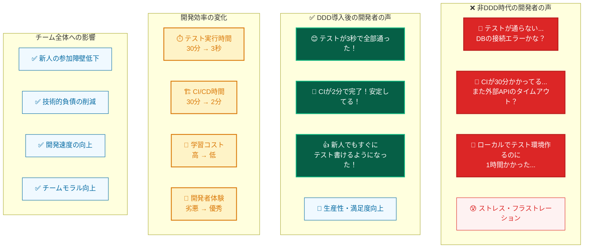

---

## 適用場面の指針 📋

### シンプルアーキテクチャが適している場合

- **プロジェクト規模**: 小規模（1-3人、数ヶ月）
- **ビジネスロジック**: 薄い（CRUD中心）
- **データベース**: 単純なスキーマ
- **外部システム**: 少ない（1-2個）
- **チーム経験**: 初心者が多い

### 本プロジェクト（DDD）が適している場合

- **プロジェクト規模**: 中規模（3-10人、半年以上）
- **ビジネスロジック**: 複雑（バリデーション、ルール多数）
- **データベース**: 複雑なスキーマ
- **外部システム**: 複数（API、メール、決済など）
- **チーム経験**: 中級者以上

### フルDDDが適している場合

- **プロジェクト規模**: 大規模（10人以上、1年以上）
- **ビジネスロジック**: 非常に複雑（イベント、ワークフロー）
- **データベース**: 複雑な関係性
- **外部システム**: 多数（マイクロサービス）
- **チーム経験**: 上級者中心

---

## まとめ 🎯

### 結論

- ❌ **シンプルアーキテクチャ**: 見た目はシンプルだが、実際は**テスト環境の構築・維持が大変**
- ✅ **DDD（本プロジェクト採用）**: 最初は複雑に見えるが、**長期的には圧倒的に効率的**
- 🔥 **フルDDD**: 非常に高い品質を実現できるが、**学習コストと実装コストが高い**

### 本プロジェクトの立ち位置

本プロジェクトでは、**実用性と品質のバランス**を重視し、DDDベースのクリーンアーキテクチャを採用しています。この選択により、**テストの高速化**、**CI/CDの安定化**、**保守性の向上**を実現しています。

---

## 関連ドキュメント 📚

- [クリーンアーキテクチャ概念](./clean-architecture.md) - 基本概念の理解
- [テスト戦略](../testing-with-clean-architecture.md) - テスト手法の詳細
- [プロジェクト設計判断](../project-architecture-decisions.md) - 実装判断の詳細
- [Next.js統合パターン](../nextjs-integration-patterns.md) - Next.jsとの統合方法
