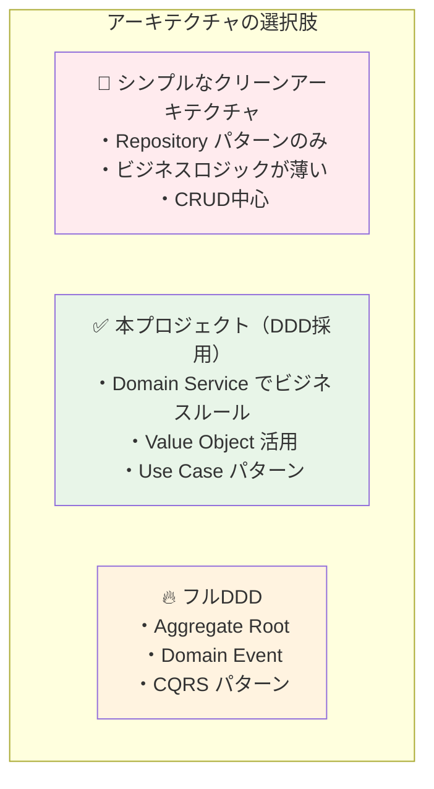
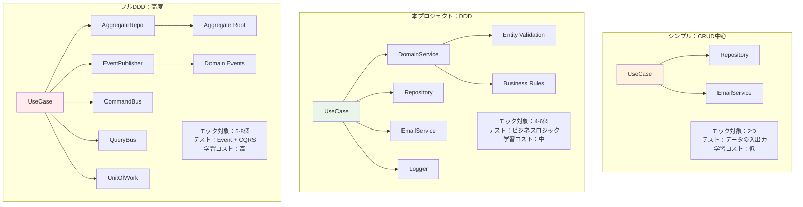
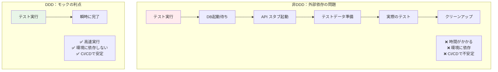

# アーキテクチャ選択肢の比較 🏗️

このドキュメントでは、3つの主要なアーキテクチャ選択肢を比較し、それぞれのメリット・デメリット、適用場面について詳しく説明します。

---

## 概要 📐

### 3つのアーキテクチャ選択肢



**本プロジェクトは「DDD（ドメイン駆動設計）」を採用しています** 🎯

- ✅ Domain Layer でビジネスロジックを管理
- ✅ Domain Service でビジネスルール検証
- ✅ Value Object（Email、UserId等）を活用
- ✅ Repository パターンで永続化を抽象化
- ✅ Use Case でアプリケーションフローを制御

---

## 選択肢1：シンプルなクリーンアーキテクチャ 🚫

**※ 本プロジェクトでは採用していません**

### 特徴

- Repository パターンのみ
- ビジネスロジックが薄い
- CRUD中心の処理
- 外部サービスとの統合が主目的

### 実装例

```typescript
// シンプルなクリーンアーキテクチャ（CRUD中心）
class CreateUserUseCase {
  constructor(
    private userRepository: IUserRepository,
    private emailService: IEmailService
  ) {}
  
  async execute(data: CreateUserRequest): Promise<User> {
    // シンプルなCRUD + 外部サービス呼び出し
    const user = await this.userRepository.create(data);
    await this.emailService.sendWelcomeEmail(user.email);
    return user;
  }
}
```

### テスト例

```typescript
// テスト：シンプルなモック
describe('CreateUserUseCase (シンプル)', () => {
  it('ユーザー作成成功', async () => {
    // モックは単純なCRUD操作のみ
    const mockRepo = { 
      create: vi.fn().mockResolvedValue(mockUser) 
    };
    const mockEmail = { 
      sendWelcomeEmail: vi.fn() 
    };
    
    const useCase = new CreateUserUseCase(mockRepo, mockEmail);
    
    // データの入出力のテストが中心
    const result = await useCase.execute(userData);
    
    expect(result).toBe(mockUser);
    expect(mockEmail.sendWelcomeEmail).toHaveBeenCalledWith(userData.email);
  });
});
```

### メリット・デメリット

| 項目 | 評価 |
|------|------|
| **学習コスト** | 低い |
| **実装速度** | 高い |
| **適用範囲** | 小規模・CRUD中心 |
| **ビジネスロジック** | 薄い |
| **テスト複雑度** | 低い |

### 実際の問題点

```typescript
// ❌ シンプルアーキテクチャの場合：外部依存でテストが困難
describe('CreateUserUseCase (シンプル)', () => {
  it('ユーザー作成成功', async () => {
    // 問題1: 実際のDBが必要
    const testDb = await setupTestDatabase(); // 重い！
    
    // 問題2: 外部APIのスタブサーバーが必要
    const emailStub = await startEmailStubServer(); // 複雑！
    
    // 問題3: テスト環境の準備が大変
    await seedTestData(testDb);
    
    const useCase = new CreateUserUseCase(realRepo, realEmailService);
    
    // 問題4: テストが遅い（DB + 外部API）
    const result = await useCase.execute(userData); // 数秒かかる
    
    // 問題5: CI/CDで不安定
    // - DBコンテナの起動待ち
    // - ネットワークエラーでテスト失敗
    // - 並列実行でデータ競合
    
    await cleanupTestDatabase(testDb);
    await stopEmailStubServer(emailStub);
  });
});
```

---

## 選択肢2：本プロジェクト（DDD採用） ✅

**※ 本プロジェクトで採用している手法**

### 特徴

- Domain Service でビジネスルール管理
- Value Object で型安全性確保
- Entity で複雑なドメインロジック
- Repository パターンで永続化抽象化
- Use Case でアプリケーションフロー制御

### 実装例

```typescript
// ✅ DDD版：ビジネスロジックが複雑
class CreateUserUseCase {
  constructor(
    private userRepository: IUserRepository,
    private userDomainService: UserDomainService,
    private emailService: IEmailService,
    private logger: ILogger
  ) {}
  
  async execute(data: CreateUserRequest): Promise<User> {
    // 1. ドメインサービスでビジネスルール検証
    await this.userDomainService.validateUserUniqueness(new Email(data.email));
    
    // 2. ドメインファクトリーでエンティティ作成
    const user = UserFactory.createNewUser(
      new Email(data.email),
      data.name,
      RegistrationSource.DIRECT
    );
    
    // 3. ドメインサービスで追加検証
    this.userDomainService.validateUserCreationRules(user);
    
    // 4. 永続化
    await this.userRepository.save(user);
    
    // 5. ドメインイベント処理
    await this.emailService.sendWelcomeEmail(user.getEmail().toString());
    
    this.logger.info('ユーザー作成完了', { userId: user.getId().toString() });
    
    return user;
  }
}
```

### テスト例

```typescript
// テスト：複雑なビジネスロジックのモック
describe('CreateUserUseCase (DDD)', () => {
  let mockUserRepository: ReturnType<typeof createMockUserRepository>;
  let mockUserDomainService: ReturnType<typeof createMockUserDomainService>;
  let mockEmailService: ReturnType<typeof createMockEmailService>;
  let mockLogger: ReturnType<typeof createMockLogger>;
  
  beforeEach(() => {
    // DDDでは多くのドメインサービスをモック
    mockUserRepository = createMockUserRepository();
    mockUserDomainService = createMockUserDomainService();
    mockEmailService = createMockEmailService();
    mockLogger = createMockLogger();
  });
  
  it('正常系：複雑なビジネスルールを含むユーザー作成', async () => {
    // Given: ビジネスルールのモック設定
    setupMockReturnValues(mockUserDomainService, {
      validateUserUniqueness: undefined,
      validateUserCreationRules: undefined,
    });
    setupMockReturnValues(mockUserRepository, {
      save: undefined,
    });
    setupMockReturnValues(mockEmailService, {
      sendWelcomeEmail: undefined,
    });
    
    const useCase = new CreateUserUseCase(
      mockUserRepository,
      mockUserDomainService,
      mockEmailService,
      mockLogger
    );
    
    // When: UseCase実行
    const result = await useCase.execute(userData);
    
    // Then: ビジネスロジックの詳細な検証
    expectMockCalledWith(mockUserDomainService.validateUserUniqueness, [expect.any(Email)]);
    expectMockCalledWith(mockUserDomainService.validateUserCreationRules, [expect.any(User)]);
    expectMockCalledWith(mockUserRepository.save, [expect.any(User)]);
    expectMockCalledWith(mockEmailService.sendWelcomeEmail, [userData.email]);
    expectMockCalledWith(mockLogger.info, ['ユーザー作成完了', expect.any(Object)]);
  });
  
  it('異常系：メール重複エラー', async () => {
    // Given: ビジネスルール違反のモック設定
    setupMockReturnValues(mockUserDomainService, {
      validateUserUniqueness: new DomainError('メールアドレスが重複しています', 'EMAIL_DUPLICATE'),
    });
    
    const useCase = new CreateUserUseCase(
      mockUserRepository,
      mockUserDomainService,
      mockEmailService,
      mockLogger
    );
    
    // When & Then: ドメインエラーの検証
    await expect(useCase.execute(userData))
      .rejects.toThrow(DomainError);
    
    // ビジネスルール違反時は後続処理が実行されないことを確認
    expectMockNotCalled(mockUserRepository.save);
    expectMockNotCalled(mockEmailService.sendWelcomeEmail);
  });
});
```

### メリット・デメリット

| 項目 | 評価 |
|------|------|
| **学習コスト** | 中程度 |
| **実装速度** | 中程度 |
| **適用範囲** | 中規模・ビジネスロジック有 |
| **ビジネスロジック** | 豊富 |
| **テスト複雑度** | 中程度 |
| **保守性** | 高い |

### 実際のメリット

```typescript
// ✅ 本プロジェクト（DDD）の場合：完全に独立したテスト
describe('CreateUserUseCase (DDD)', () => {
  it('ユーザー作成成功', async () => {
    // メリット1: DBもAPIも不要！
    // メリット2: 瞬時にテスト実行（ミリ秒）
    // メリット3: CI/CDで安定動作
    
    const mockRepo = createMockUserRepository();
    const mockDomainService = createMockUserDomainService();
    const mockEmailService = createMockEmailService();
    
    const useCase = new CreateUserUseCase(mockRepo, mockDomainService, mockEmailService);
    
    // 瞬時に実行完了！
    const result = await useCase.execute(userData);
    
    // ビジネスロジックの詳細な検証が可能
    expect(mockDomainService.validateUserUniqueness).toHaveBeenCalled();
  });
});
```

---

## 選択肢3：フルDDD（高度なパターン） 🔥

**※ 本プロジェクトでは採用していません（オーバーエンジニアリング）**

### 特徴

- Aggregate Root で複数エンティティ管理
- Domain Event で非同期処理
- CQRS でコマンドとクエリ分離
- Event Sourcing（オプション）
- Unit of Work パターン

### 実装例

```typescript
// フルDDD：Aggregate Root + Domain Event + CQRS
class CreateUserUseCase {
  constructor(
    private userAggregateRepository: IUserAggregateRepository,
    private domainEventPublisher: IDomainEventPublisher,
    private commandBus: ICommandBus,
    private queryBus: IQueryBus,
    private unitOfWork: IUnitOfWork
  ) {}
  
  async execute(command: CreateUserCommand): Promise<UserCreatedEvent> {
    return await this.unitOfWork.execute(async () => {
      // 1. クエリサイドで重複チェック
      const existingUser = await this.queryBus.execute(
        new FindUserByEmailQuery(command.email)
      );
      
      if (existingUser) {
        throw new DomainError('ユーザーが既に存在します');
      }
      
      // 2. Aggregate Root作成
      const userAggregate = UserAggregate.create(
        command.email,
        command.name,
        command.registrationSource
      );
      
      // 3. ドメインイベント発生
      userAggregate.addDomainEvent(
        new UserCreatedEvent(userAggregate.getId(), userAggregate.getEmail())
      );
      
      // 4. 永続化
      await this.userAggregateRepository.save(userAggregate);
      
      // 5. ドメインイベント発行
      await this.domainEventPublisher.publishAll(userAggregate.getDomainEvents());
      
      return userAggregate.getDomainEvents()[0] as UserCreatedEvent;
    });
  }
}
```

### テスト例

```typescript
// テスト：非常に複雑なモック
describe('CreateUserUseCase (フルDDD)', () => {
  let mockAggregateRepo: ReturnType<typeof createMockUserAggregateRepository>;
  let mockEventPublisher: ReturnType<typeof createMockDomainEventPublisher>;
  let mockCommandBus: ReturnType<typeof createMockCommandBus>;
  let mockQueryBus: ReturnType<typeof createMockQueryBus>;
  let mockUnitOfWork: ReturnType<typeof createMockUnitOfWork>;
  
  beforeEach(() => {
    // 多数のインフラストラクチャコンポーネントをモック
    mockAggregateRepo = createMockUserAggregateRepository();
    mockEventPublisher = createMockDomainEventPublisher();
    mockCommandBus = createMockCommandBus();
    mockQueryBus = createMockQueryBus();
    mockUnitOfWork = createMockUnitOfWork();
  });
  
  it('正常系：Aggregate + Event + CQRS', async () => {
    // Given: 複雑なモック設定
    mockQueryBus.execute.mockResolvedValue(null); // 重複なし
    mockAggregateRepo.save.mockResolvedValue(undefined);
    mockEventPublisher.publishAll.mockResolvedValue(undefined);
    
    const useCase = new CreateUserUseCase(
      mockAggregateRepo,
      mockEventPublisher,
      mockCommandBus,
      mockQueryBus,
      mockUnitOfWork
    );
    
    // When: コマンド実行
    const result = await useCase.execute(createUserCommand);
    
    // Then: 複雑な検証
    expect(mockQueryBus.execute).toHaveBeenCalledWith(
      expect.any(FindUserByEmailQuery)
    );
    expect(mockUnitOfWork.execute).toHaveBeenCalled();
    expect(mockAggregateRepo.save).toHaveBeenCalledWith(
      expect.any(UserAggregate)
    );
    expect(mockEventPublisher.publishAll).toHaveBeenCalledWith(
      expect.arrayContaining([expect.any(UserCreatedEvent)])
    );
    expect(result).toBeInstanceOf(UserCreatedEvent);
  });
});
```

### メリット・デメリット

| 項目 | 評価 |
|------|------|
| **学習コスト** | 非常に高い |
| **実装速度** | 低い |
| **適用範囲** | 大規模・複雑ドメイン |
| **ビジネスロジック** | 非常に豊富 |
| **テスト複雑度** | 高い |
| **保守性** | 非常に高い |

---

## 総合比較 📊

### 各アーキテクチャの比較表

| 観点 | シンプル | 本プロジェクト（DDD） | フルDDD |
|------|----------|---------------------|---------|
| **モック対象** | Repository + 外部サービス | Repository + DomainService + 外部サービス + Logger | AggregateRepo + EventPublisher + CommandBus + QueryBus + UnitOfWork |
| **テスト内容** | データの入出力 | ビジネスルール + データフロー | Aggregate + Event + CQRS + Transaction |
| **モック数** | 2-3個 | 4-6個 | 5-8個以上 |
| **テストケース** | 正常系中心 | 正常系 + 複数の異常系 | 正常系 + 異常系 + イベント + トランザクション |
| **検証内容** | 呼び出し回数・引数 | ビジネスロジックの実行順序・条件分岐 | Aggregate状態 + Event発行 + CQRS分離 |
| **学習コスト** | 低 | 中 | 高 |
| **適用場面** | 小規模・CRUD中心 | 中規模・ビジネスロジック有 | 大規模・複雑ドメイン |

### 複雑さの段階的増加



### 実際の開発での比較

| 観点 | シンプル（外部依存） | 本プロジェクト（DDD） | フルDDD（高度） |
|------|---------------------|---------------------|----------------|
| **テスト実行時間** | 数秒〜数十秒 | 数ミリ秒 | 数ミリ秒 |
| **CI/CD安定性** | 不安定（外部依存） | 安定（依存なし） | 安定（依存なし） |
| **環境構築** | 複雑（DB+API+スタブ） | シンプル（コードのみ） | シンプル（コードのみ） |
| **並列実行** | 困難（データ競合） | 容易（独立実行） | 容易（独立実行） |
| **デバッグ** | 困難（どこで失敗？） | 容易（ロジックに集中） | 複雑（多層構造） |
| **開発速度** | 遅い（環境待ち） | 速い（即座に実行） | 中程度（設計時間） |
| **保守性** | 低い（密結合） | 高い（疎結合） | 非常に高い（完全分離） |

---

## CI/CDでの実際の違い 🔧

### シンプルアーキテクチャの場合

```yaml
# ❌ シンプルアーキテクチャの場合：複雑なCI設定
name: Test (シンプル)
jobs:
  test:
    services:
      postgres:
        image: postgres:15
        env:
          POSTGRES_PASSWORD: test
        options: >-
          --health-cmd pg_isready
          --health-interval 10s
          --health-timeout 5s
          --health-retries 5
      
      email-stub:
        image: mailhog/mailhog
        ports:
          - 1025:1025
    
    steps:
      - name: Wait for services
        run: sleep 30  # サービス起動待ち
      
      - name: Setup test data
        run: npm run db:seed  # テストデータ準備
      
      - name: Run tests
        run: npm test  # 遅い、不安定
```

### 本プロジェクト（DDD）の場合

```yaml
# ✅ 本プロジェクト（DDD）の場合：シンプルなCI設定
name: Test (DDD)
jobs:
  test:
    steps:
      - name: Run tests
        run: npm test  # 速い、安定
    # それだけ！外部サービス不要
```

---

## 複雑さが増す理由の分析 🔍

### 本プロジェクト（DDD）でモックが増える理由

1. **ドメインサービス**：複雑なビジネスルールを担当
2. **エンティティ**：ドメインオブジェクトの生成・検証
3. **バリューオブジェクト**：Email、UserIdなどの型安全性
4. **ドメインイベント**：ビジネスイベントの処理
5. **ロギング**：ビジネス処理の追跡

### フルDDDでさらに複雑になる理由

1. **Aggregate Root**：複数エンティティの整合性管理
2. **Domain Events**：非同期イベント処理
3. **CQRS**：コマンドとクエリの分離
4. **Unit of Work**：トランザクション管理
5. **Event Sourcing**：イベントストア（オプション）

---

## 選択理由と実際の効果 💡

### なぜDDDの方が実用的なのか？



### 実際の開発チームでの体験

```typescript
// 実際の開発現場での声

// ❌ 非DDD時代
"テストが通らない...DBの接続エラーかな？"
"CI が30分かかってる...また外部API のタイムアウト？"
"ローカルでテスト環境作るのに1時間かかった..."

// ✅ DDD導入後  
"テストが3秒で全部通った！"
"CI が2分で完了！安定してる！"
"新人でもすぐにテスト書けるようになった！"
```

---

## 適用場面の指針 📋

### シンプルアーキテクチャが適している場合

- **プロジェクト規模**: 小規模（1-3人、数ヶ月）
- **ビジネスロジック**: 薄い（CRUD中心）
- **データベース**: 単純なスキーマ
- **外部システム**: 少ない（1-2個）
- **チーム経験**: 初心者が多い

### 本プロジェクト（DDD）が適している場合

- **プロジェクト規模**: 中規模（3-10人、半年以上）
- **ビジネスロジック**: 複雑（バリデーション、ルール多数）
- **データベース**: 複雑なスキーマ
- **外部システム**: 複数（API、メール、決済など）
- **チーム経験**: 中級者以上

### フルDDDが適している場合

- **プロジェクト規模**: 大規模（10人以上、1年以上）
- **ビジネスロジック**: 非常に複雑（イベント、ワークフロー）
- **データベース**: 複雑な関係性
- **外部システム**: 多数（マイクロサービス）
- **チーム経験**: 上級者中心

---

## まとめ 🎯

### 結論

- ❌ **シンプルアーキテクチャ**: 見た目はシンプルだが、実際は**テスト環境の構築・維持が大変**
- ✅ **DDD（本プロジェクト採用）**: 最初は複雑に見えるが、**長期的には圧倒的に効率的**
- 🔥 **フルDDD**: 非常に高い品質を実現できるが、**学習コストと実装コストが高い**

### 本プロジェクトの立ち位置

本プロジェクトでは、**実用性と品質のバランス**を重視し、DDDベースのクリーンアーキテクチャを採用しています。この選択により、**テストの高速化**、**CI/CDの安定化**、**保守性の向上**を実現しています。

---

## 関連ドキュメント 📚

- [クリーンアーキテクチャ概念](./clean-architecture.md) - 基本概念の理解
- [テスト戦略](../testing-with-clean-architecture.md) - テスト手法の詳細
- [プロジェクト設計判断](../project-architecture-decisions.md) - 実装判断の詳細
- [Next.js統合パターン](../nextjs-integration-patterns.md) - Next.jsとの統合方法
