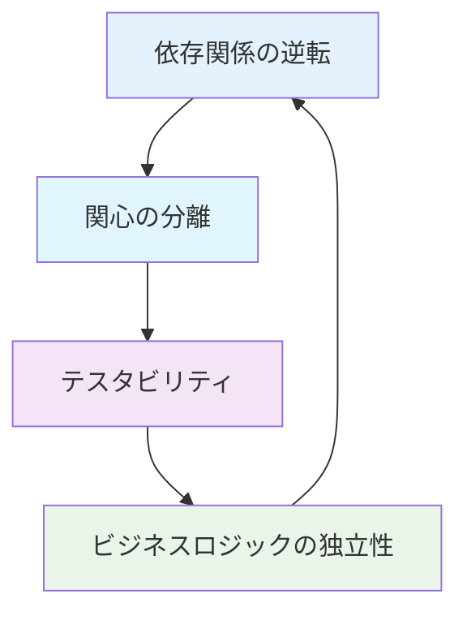
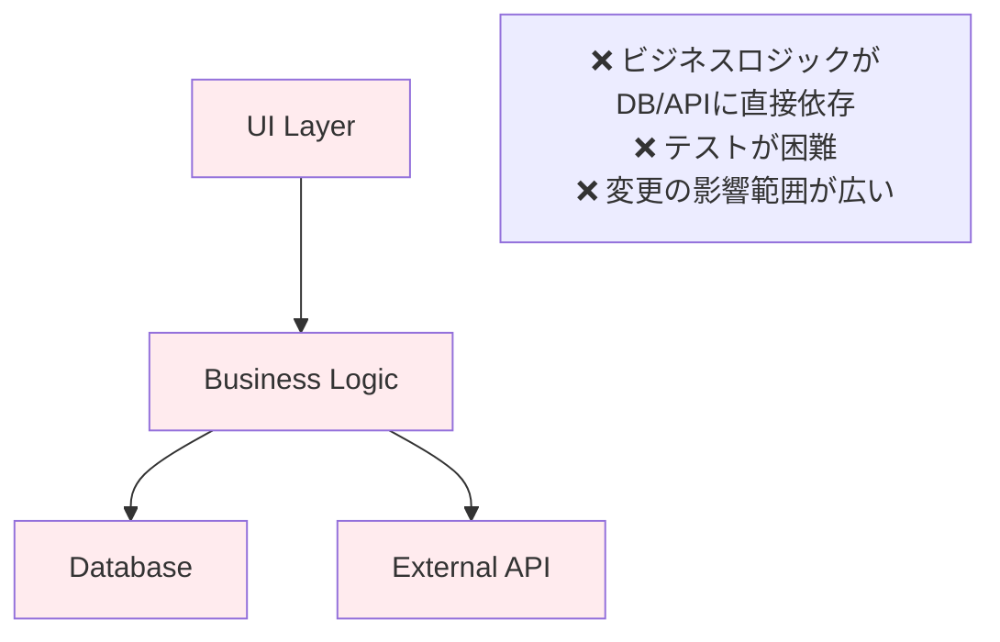
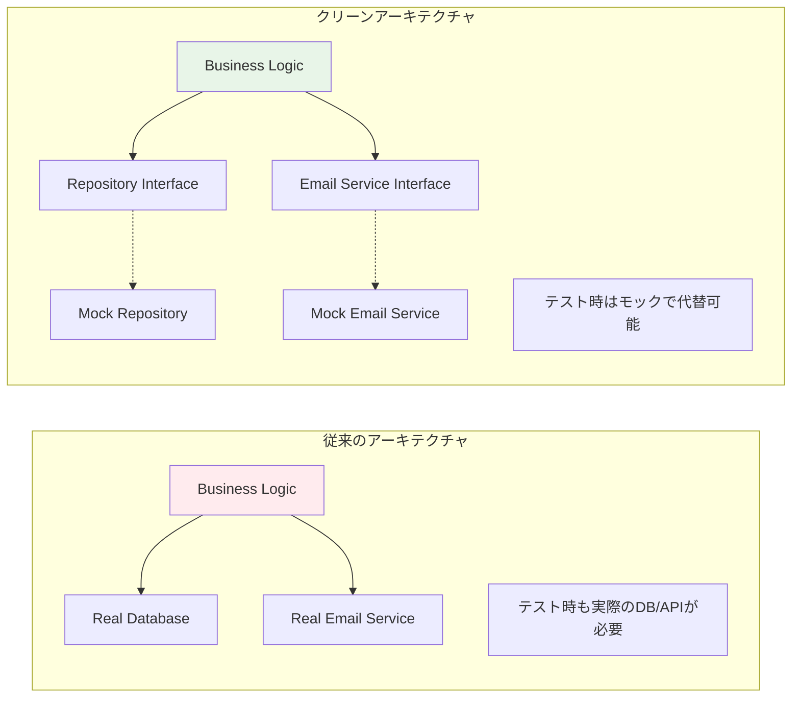
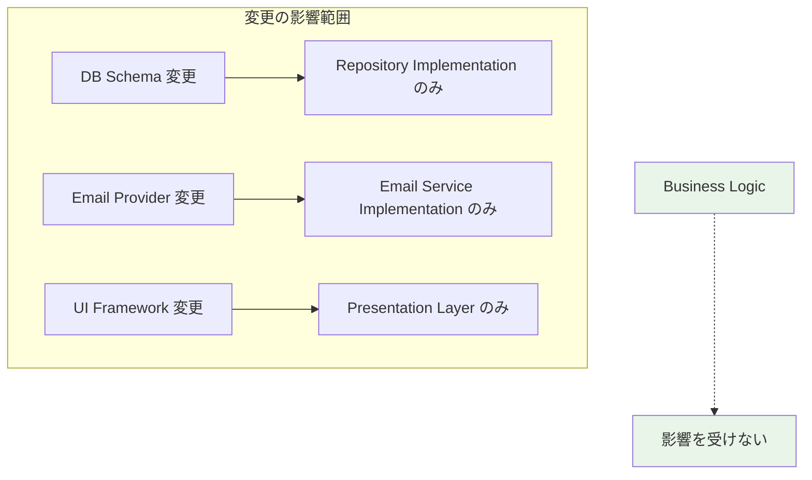
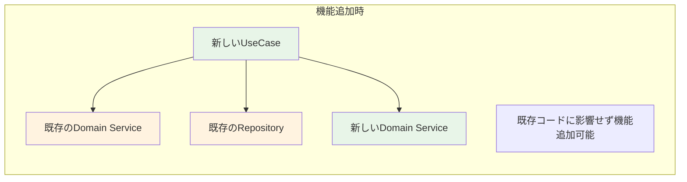
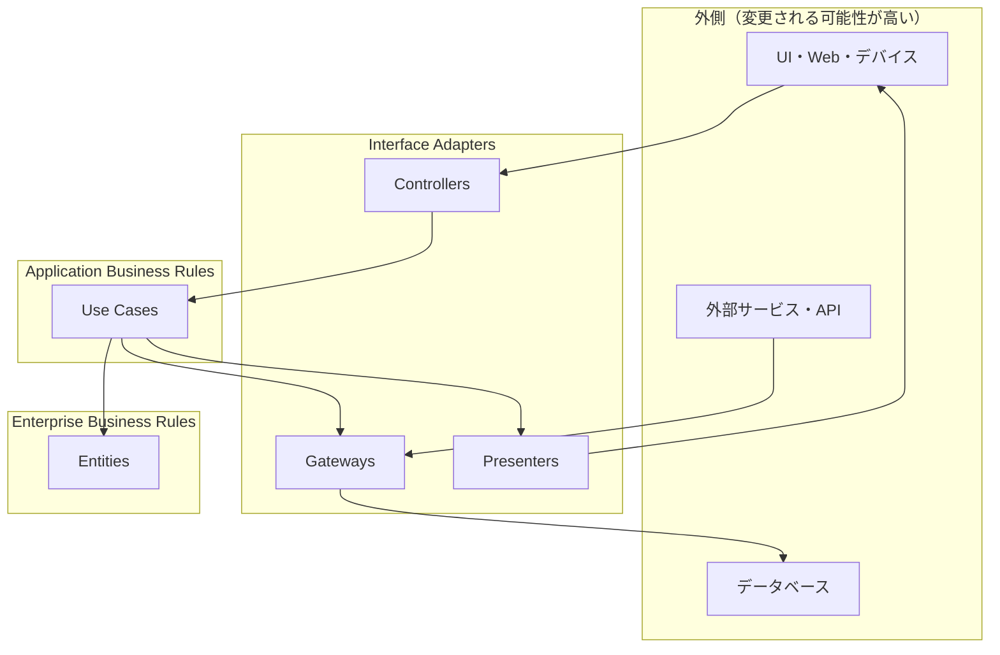
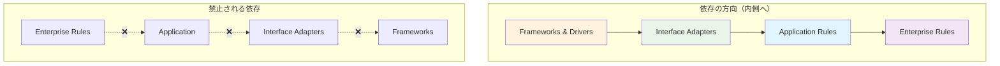
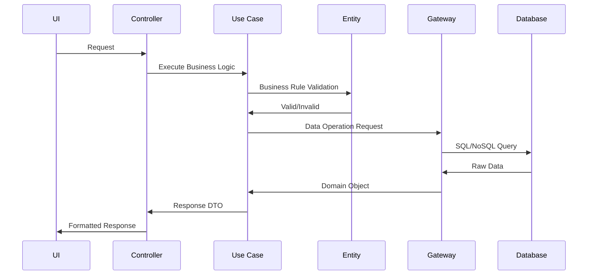
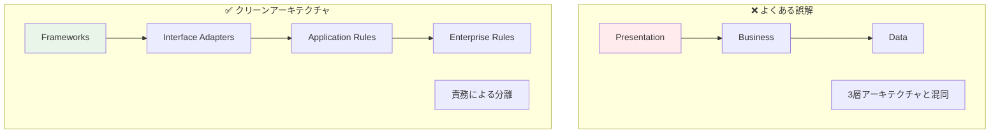

# クリーンアーキテクチャ概念解説 🏛️

このドキュメントでは、クリーンアーキテクチャの概念と理論について詳しく説明します。

---

## 概要 📐

### クリーンアーキテクチャとは

**クリーンアーキテクチャ**は、Robert C. Martin（Uncle Bob）が提唱したソフトウェア設計手法で、**依存関係の方向を内側に向ける**ことで、ビジネスロジックを外部システムから独立させる設計パターンです。

### 核心となる原則



1. **依存関係の逆転 (Dependency Inversion)** - 上位レイヤーが下位レイヤーの詳細に依存しない
2. **関心の分離 (Separation of Concerns)** - 各レイヤーが明確な責務を持つ
3. **テスタビリティ (Testability)** - ビジネスロジックのテストが容易
4. **ビジネスロジックの独立性** - フレームワークやDBに依存しない

---

## クリーンアーキテクチャの動機 🤔

### 問題：従来のアーキテクチャの課題



**具体的な問題例：**

```typescript
// ❌ 悪い例：直接依存
class UserService {
  async createUser(data: any) {
    // データベースに直接依存
    const user = await prisma.user.create({ data });
    
    // 外部APIに直接依存  
    await sendWelcomeEmail(user.email);
    
    return user;
  }
}

// この場合の問題：
// 1. テスト時にDBとメールAPI両方をモックする必要
// 2. DBスキーマ変更でビジネスロジックも修正必要
// 3. メールサービス変更でもコード修正必要
```

### 解決：クリーンアーキテクチャのメリット

#### 1. テスタビリティ 🧪

**なぜテストしやすいのか？**



#### 2. 保守性の向上 🔧

**なぜ保守しやすいのか？**



**具体例：**

```typescript
// 例：Prisma から別のORMに変更する場合

// ❌ 従来の方法だと：
// ビジネスロジック内のPrisma呼び出しを全て修正が必要

// ✅ クリーンアーキテクチャだと：
// Repository実装を変更するだけ

// 変更前
class PrismaUserRepository implements IUserRepository {
  async create(data: CreateUserData): Promise<User> {
    return await this.prisma.user.create({ data });
  }
}

// 変更後（Drizzleに変更）
class DrizzleUserRepository implements IUserRepository {
  async create(data: CreateUserData): Promise<User> {
    return await this.db.insert(users).values(data);
  }
}

// ビジネスロジック（UseCase）は一切変更不要！
```

#### 3. スケーラビリティの確保 📈

**なぜスケールしやすいのか？**



**具体例：**

```typescript
// 例：「ユーザー削除」機能を追加する場合

// 新しいUseCaseを追加するだけ
class DeleteUserUseCase {
  constructor(
    private userRepository: IUserRepository, // 既存のRepository再利用
    private userDomainService: UserDomainService // 既存のDomainService再利用
  ) {}
  
  async execute(userId: string): Promise<void> {
    // 既存のバリデーションロジックを再利用
    await this.userDomainService.validateUserExists(userId);
    
    // 既存のRepository機能を再利用
    await this.userRepository.delete(userId);
  }
}

// 既存のCreateUserUseCase、LoginUseCaseは一切変更不要
// 各レイヤーの責務が明確なため、安全に機能追加可能
```

---

## クリーンアーキテクチャの理論 🎯

### レイヤー構成



### 各レイヤーの責務

| レイヤー | 責務 | 依存先 | なぜこの責務なのか |
|---------|------|--------|--------------------|
| **Enterprise Business Rules** | 核となるビジネスエンティティ | なし | 最も安定したビジネスルールを保護するため |
| **Application Business Rules** | アプリケーション固有のビジネスルール | Entities | アプリケーション特有のフローを管理するため |
| **Interface Adapters** | データ形式の変換・外部システム連携 | Use Cases | 外部システムの変更影響を局所化するため |
| **Frameworks & Drivers** | UI・DB・Web等の具体的技術 | Interface Adapters | 技術的変更の影響を最外層に限定するため |

### 依存関係のルール



**重要な原則：**

1. **内側のレイヤーは外側について何も知らない**
2. **外側のレイヤーは内側のレイヤーを知ってよい**
3. **データフローは依存関係を越えて両方向に流れる**
4. **境界を越えるデータは単純な構造（DTO等）にする**

---

## データフローパターン 🔄

### 理想的なデータフロー



### 依存関係逆転の実現

```typescript
// ✅ 正しい依存関係の向き
interface IUserRepository {
  create(data: CreateUserData): Promise<User>;
}

class CreateUserUseCase {
  constructor(
    private userRepository: IUserRepository // インターフェースに依存
  ) {}
}

class PrismaUserRepository implements IUserRepository {
  // UseCaseが定義したインターフェースを実装
  async create(data: CreateUserData): Promise<User> {
    return await this.prisma.user.create({ data });
  }
}

// DIコンテナで具象クラスを注入
container.register<IUserRepository>('UserRepository', {
  useClass: PrismaUserRepository
});
```

---

## よくある誤解と注意点 ⚠️

### 誤解1：レイヤー数の混同



### 誤解2：すべてをインターフェース化

```typescript
// ❌ 過度なインターフェース化
interface IStringValidator {
  validate(str: string): boolean;
}

// ✅ 適切な境界でのみインターフェース化
interface IUserRepository {
  // 外部システム（DB）との境界
}

interface IEmailService {
  // 外部システム（メールAPI）との境界
}
```

### 誤解3：パフォーマンスへの悪影響

**実際は：**

- 抽象化によるオーバーヘッドは現代のJSエンジンでは無視できる
- テストの高速化により開発効率が大幅向上
- 保守性向上により長期的なパフォーマンス向上

---

## まとめ 🎯

### クリーンアーキテクチャの価値

1. **テストしやすさ** - モックによる独立したテスト
2. **変更に強い** - 影響範囲の局所化
3. **理解しやすい** - 明確な責務分離
4. **再利用しやすい** - ビジネスロジックの独立性

### 導入時の考慮点

- **学習コスト** - チーム全体での理解が必要
- **初期設計時間** - 適切な境界設計が重要
- **プロジェクト規模** - 小規模では過剰になる可能性

---

## 関連ドキュメント 📚

- [アーキテクチャ比較](../architecture-comparison.md) - 他の設計選択肢との比較
- [テスト戦略](../testing-with-clean-architecture.md) - クリーンアーキテクチャでのテスト手法
- [プロジェクト設計判断](../project-architecture-decisions.md) - 本プロジェクトでの実装判断
- [Next.js統合パターン](../nextjs-integration-patterns.md) - Next.jsとの統合方法
