# Domain-Driven Design (DDD) 詳細解説 🧠

このドキュメントでは、DDD（ドメイン駆動設計）の概念、理想的な形、そして本プロジェクトでの実装について詳しく説明します。

---

## DDD の概要 📚

### Domain-Driven Design とは

**Domain-Driven Design (DDD)** は、Eric Evans が提唱したソフトウェア設計手法で、**複雑なビジネスドメインをソフトウェア設計の中心に据える**アプローチです。

### 核心となる哲学

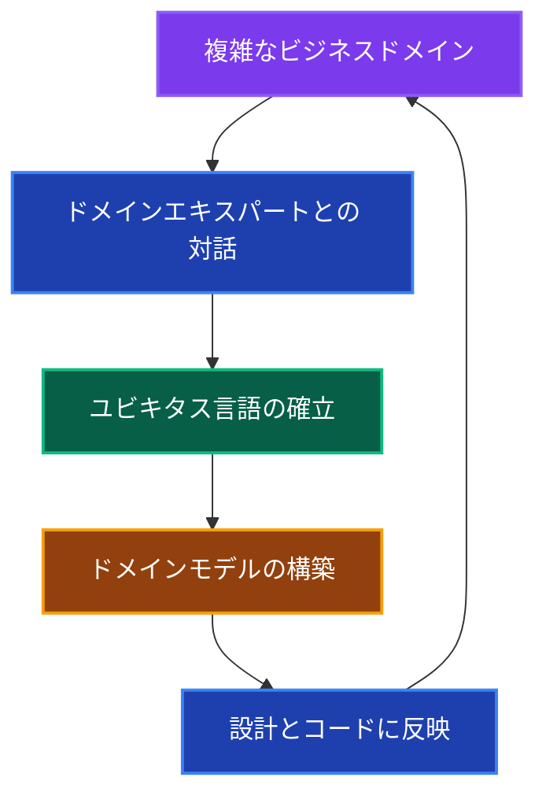

**基本原則：**

1. **ドメインとモデルの一致** - ビジネスの概念がコードに直接反映される
2. **ユビキタス言語** - 開発者とドメインエキスパートが共通の言語を使用
3. **境界づけられたコンテキスト** - 複雑なドメインを管理可能な単位に分割
4. **ドメインの独立性** - ビジネスロジックが技術的関心事から分離

---

## なぜ DDD なのか？ 🤔

### 問題：従来のデータ中心設計

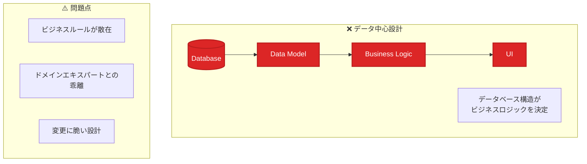

**データ中心設計の問題例：**

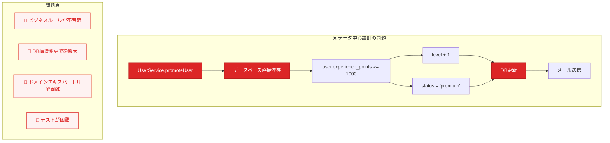

### 解決：DDD アプローチの利点

#### 1. ドメインロジックの集約 🎯

**なぜドメインロジックを集約するのか？**

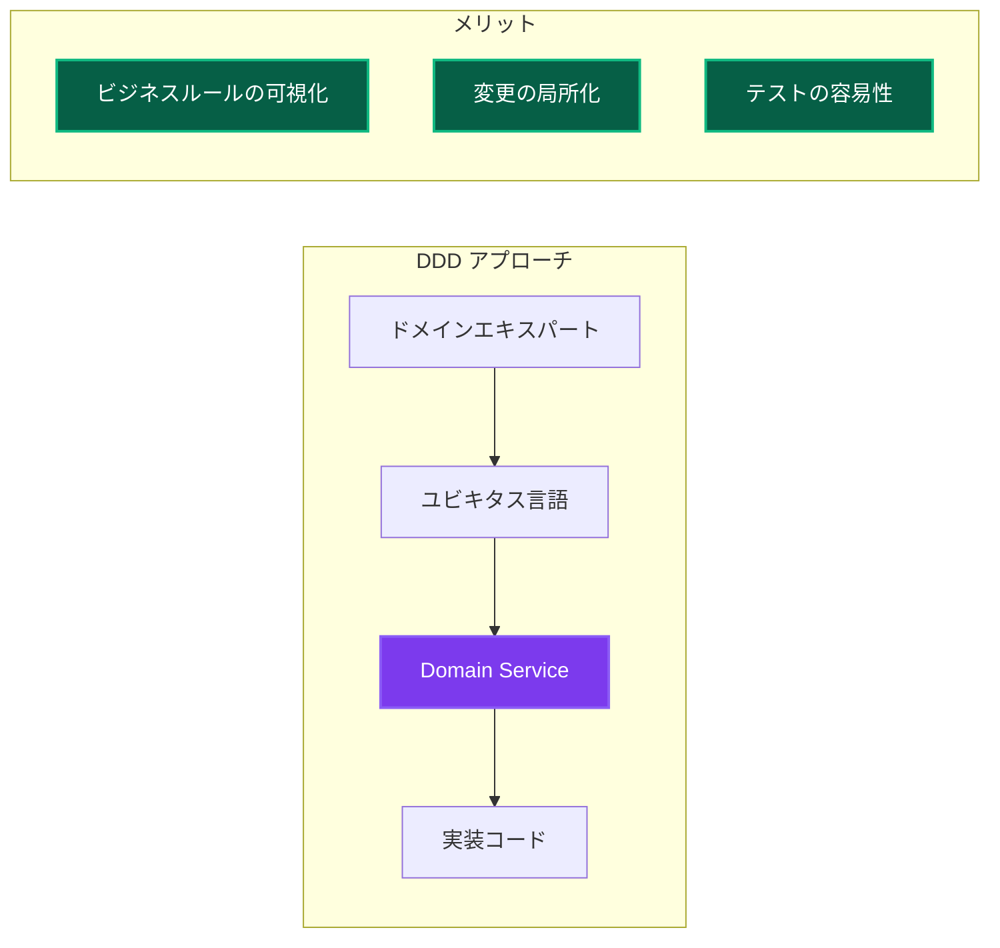

**DDDアプローチの解決例：**

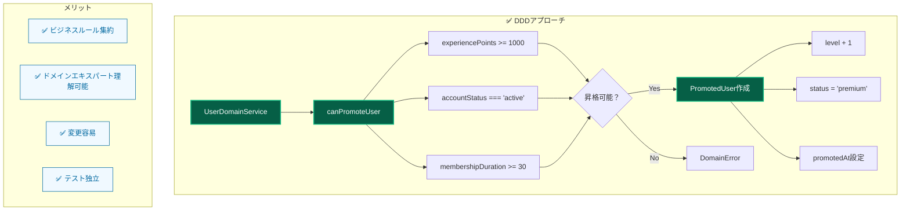

#### 2. 複雑性の管理 📊

**境界づけられたコンテキストによる分割**

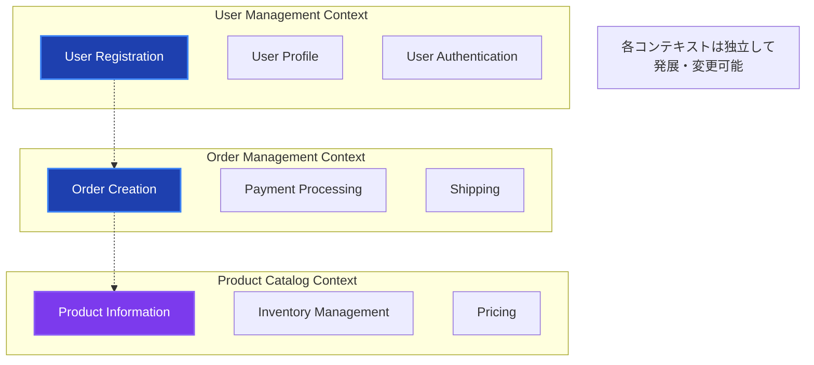

#### 3. ビジネスとコードの一致 🔗

**ユビキタス言語の効果**

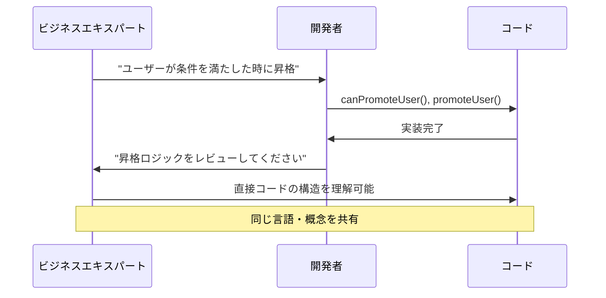

---

## 理想的な DDD 設計 🎯

### DDD の戦術的パターン

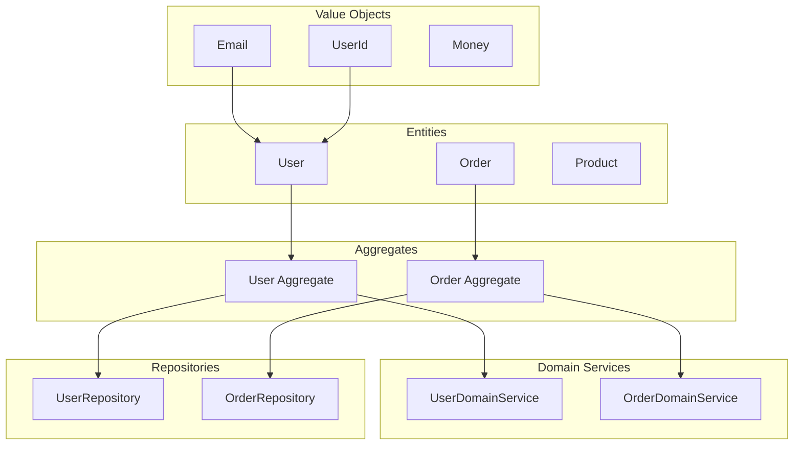

### 各パターンの役割

| パターン           | 責務                                   | 特徴                                   |
| ------------------ | -------------------------------------- | -------------------------------------- |
| **Value Object**   | 値の表現・バリデーション               | 不変、等価性で比較                     |
| **Entity**         | 一意性を持つオブジェクト               | IDによる識別、ライフサイクル管理       |
| **Aggregate**      | 一貫性境界の定義                       | トランザクション単位、変更の整合性確保 |
| **Domain Service** | エンティティに属さないビジネスロジック | 複数のエンティティにまたがる処理       |
| **Repository**     | ドメインオブジェクトの永続化           | ドメインから技術的詳細を隠蔽           |

---

## 本プロジェクトでの DDD 実装 🛠️

### 実装状況とマッピング

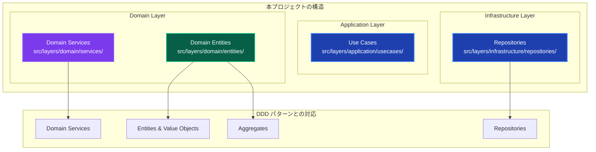

### 実装例：User ドメイン

**1. Value Objects 実装パターン**

```mermaid
graph TB
    subgraph "Email Value Object"
        A[constructor] --> B{isValid?}
        B -->|Yes| C[value設定]
        B -->|No| D[DomainError]
        C --> E[toString()]
        C --> F[equals()]
    end

    subgraph "UserId Value Object"
        G[constructor] --> H{value有効？}
        H -->|Yes| I[value設定]
        H -->|No| J[DomainError]
        I --> K[toString()]
    end

    subgraph "Value Objectの特徴"
        L[✅ 不変性]
        M[✅ 等価性比較]
        N[✅ バリデーション]
        O[✅ 型安全性]
    end

    style A fill:#92400e,stroke:#f59e0b,stroke-width:2px,color:#ffffff
    style G fill:#92400e,stroke:#f59e0b,stroke-width:2px,color:#ffffff
    style C fill:#065f46,stroke:#10b981,stroke-width:2px,color:#ffffff
    style I fill:#065f46,stroke:#10b981,stroke-width:2px,color:#ffffff
    style L fill:#f0f9ff,stroke:#0369a1,stroke-width:1px,color:#0369a1
    style M fill:#f0f9ff,stroke:#0369a1,stroke-width:1px,color:#0369a1
    style N fill:#f0f9ff,stroke:#0369a1,stroke-width:1px,color:#0369a1
    style O fill:#f0f9ff,stroke:#0369a1,stroke-width:1px,color:#0369a1
```

**2. Entity & Aggregate 実装パターン**

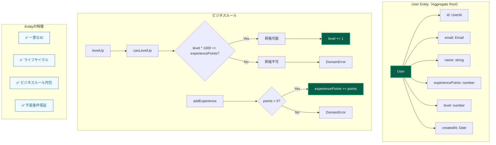

**3. Domain Service 実装パターン**

```mermaid
graph TB
    subgraph "UserDomainService"
        A[canPromoteUser] --> B{user.canLevelUp?}
        B -->|No| C[false]
        B -->|Yes| D[membershipService.getMembership]
        D --> E{membership.duration >= 30?}
        E -->|No| F[false]
        E -->|Yes| G{user.level < 10?}
        G -->|Yes| H[true]
        G -->|No| I[false]

        J[calculatePromotionBonus] --> K[baseBonus = 100]
        K --> L[levelMultiplier = level * 0.1]
        L --> M[bonus = baseBonus * (1 + multiplier)]

        N[validateUserData] --> O{name.length >= 2?}
        O -->|No| P[DomainError]
        O -->|Yes| Q[new Email(email)]
        Q --> R{email valid?}
        R -->|No| S[DomainError]
        R -->|Yes| T[Validation OK]
    end

    subgraph "Domain Serviceの特徴"
        U[✅ 複数Entity協調]
        V[✅ ステートレス]
        W[✅ ビジネスルール実装]
        X[✅ Entity間の調整]
    end

    style A fill:#7c3aed,stroke:#8b5cf6,stroke-width:2px,color:#ffffff
    style J fill:#7c3aed,stroke:#8b5cf6,stroke-width:2px,color:#ffffff
    style N fill:#7c3aed,stroke:#8b5cf6,stroke-width:2px,color:#ffffff
    style H fill:#065f46,stroke:#10b981,stroke-width:2px,color:#ffffff
    style M fill:#065f46,stroke:#10b981,stroke-width:2px,color:#ffffff
    style T fill:#065f46,stroke:#10b981,stroke-width:2px,color:#ffffff
    style U fill:#f0f9ff,stroke:#0369a1,stroke-width:1px,color:#0369a1
    style V fill:#f0f9ff,stroke:#0369a1,stroke-width:1px,color:#0369a1
    style W fill:#f0f9ff,stroke:#0369a1,stroke-width:1px,color:#0369a1
    style X fill:#f0f9ff,stroke:#0369a1,stroke-width:1px,color:#0369a1
```

**4. Repository パターン**

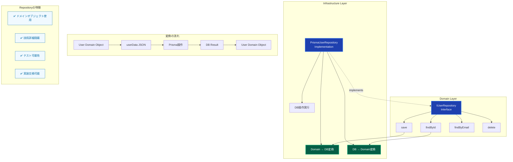

---

## DDD vs 従来手法の比較 ⚖️

### アプローチ比較：ユーザー昇格機能

```mermaid
graph TB
    subgraph "❌ 従来のサービス層中心設計"
        A1[UserService.promoteUser] --> A2[DB検索: findById]
        A2 --> A3{experience_points >= level * 1000?}
        A3 -->|Yes| A4[DB更新: level + 1]
        A4 --> A5[通知送信]
        A3 -->|No| A6[何もしない]
    end

    subgraph "従来手法の問題"
        P1[🚫 ビジネスルール散在]
        P2[🚫 DB構造がロジック決定]
        P3[🚫 ドメインエキスパート理解困難]
        P4[🚫 テスト複雑]
    end

    subgraph "✅ DDDアプローチ"
        B1[PromoteUserUseCase] --> B2[UserRepository.findById]
        B2 --> B3[UserDomainService.canPromoteUser]
        B3 --> B4{昇格可能？}
        B4 -->|Yes| B5[User.levelUp]
        B5 --> B6[UserRepository.save]
        B6 --> B7[NotificationUseCase]
        B4 -->|No| B8[DomainError]
    end

    subgraph "DDDアプローチの利点"
        M1[✅ ビジネスルール集約]
        M2[✅ ドメインエキスパート理解可能]
        M3[✅ 単体テスト容易]
        M4[✅ 変更影響範囲明確]
    end

    style A1 fill:#dc2626,stroke:#b91c1c,stroke-width:2px,color:#ffffff
    style A4 fill:#dc2626,stroke:#b91c1c,stroke-width:2px,color:#ffffff
    style P1 fill:#fef2f2,stroke:#dc2626,stroke-width:1px,color:#dc2626
    style P2 fill:#fef2f2,stroke:#dc2626,stroke-width:1px,color:#dc2626
    style P3 fill:#fef2f2,stroke:#dc2626,stroke-width:1px,color:#dc2626
    style P4 fill:#fef2f2,stroke:#dc2626,stroke-width:1px,color:#dc2626

    style B1 fill:#065f46,stroke:#10b981,stroke-width:2px,color:#ffffff
    style B3 fill:#065f46,stroke:#10b981,stroke-width:2px,color:#ffffff
    style B5 fill:#065f46,stroke:#10b981,stroke-width:2px,color:#ffffff
    style M1 fill:#f0f9ff,stroke:#0369a1,stroke-width:1px,color:#0369a1
    style M2 fill:#f0f9ff,stroke:#0369a1,stroke-width:1px,color:#0369a1
    style M3 fill:#f0f9ff,stroke:#0369a1,stroke-width:1px,color:#0369a1
    style M4 fill:#f0f9ff,stroke:#0369a1,stroke-width:1px,color:#0369a1
```

---

## DDD の効果測定 📈

### 開発体験の向上

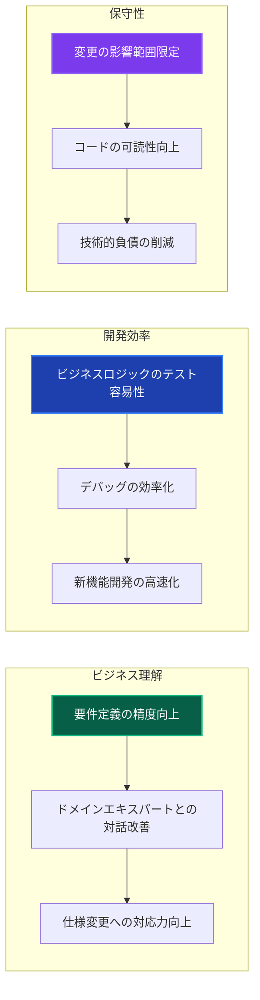

### 具体的な効果例

**1. テストの簡易化**

```typescript
// DDDにより、ビジネスロジックのテストが簡単に
describe('UserDomainService', () => {
 it('昇格条件を満たすユーザーは昇格可能', () => {
  // Given: ドメインオブジェクトの準備
  const user = new User(
   new UserId('123'),
   new Email('test@example.com'),
   'テストユーザー',
   1000, // 経験値
   1, // レベル
   new Date(),
  );

  // When: ビジネスルールの実行
  const canLevelUp = user.canLevelUp();

  // Then: 結果の検証
  expect(canLevelUp).toBe(true);
 });

 // データベースや外部システム不要でテスト可能
});
```

**2. 仕様変更への対応**

```typescript
// 昇格条件の変更例：「レベル5以上はVIPメンバーのみ昇格可能」
export class UserDomainService {
 async canPromoteUser(
  user: User,
  membershipService: MembershipService,
 ): Promise<boolean> {
  if (!user.canLevelUp()) {
   return false;
  }

  // 新しいビジネスルール追加
  if (user.level >= 5) {
   const membership = await membershipService.getMembership(user.id);
   return membership.isVip();
  }

  return true;
 }
}

// 変更箇所：
// ✅ Domain Serviceの1箇所のみ
// ✅ 既存のテストは継続動作
// ✅ 新しいテストケース追加のみで対応
```

---

## まとめ 🎯

### DDD のプロジェクトでの価値

1. **ビジネス価値の最大化**

   - ドメインエキスパートとの協働によるビジネス理解の深化
   - 要件定義の精度向上による手戻りの削減

2. **開発効率の向上**

   - ビジネスロジックの局所化による変更の容易性
   - テストの独立性による開発速度向上

3. **長期的な保守性**
   - ドメインモデルによる複雑性の管理
   - 技術的変更からの業務ロジック保護

### 本プロジェクトでの DDD 成功要因

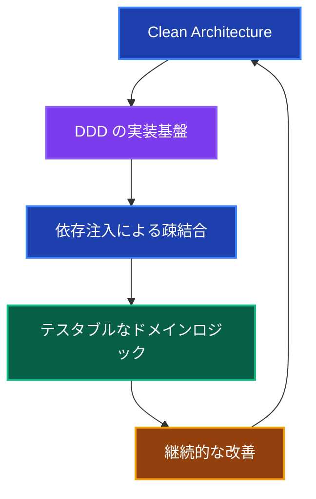

**相乗効果：**

- **Clean Architecture** が DDD の基盤を提供
- **依存注入** がドメインサービスのテストを容易化
- **レイヤー分離** がドメインロジックの独立性を確保

---

## 関連ドキュメント 📚

- [クリーンアーキテクチャ詳細解説](./clean-architecture.md) - アーキテクチャとの関係
- [アーキテクチャ概要](../../../architecture/overview.md) - 全体設計との連携
- [開発ワークフロー](../../development/workflow.md) - 実装手順
- [テスト戦略](../../../testing/strategy.md) - ドメインロジックのテスト手法
