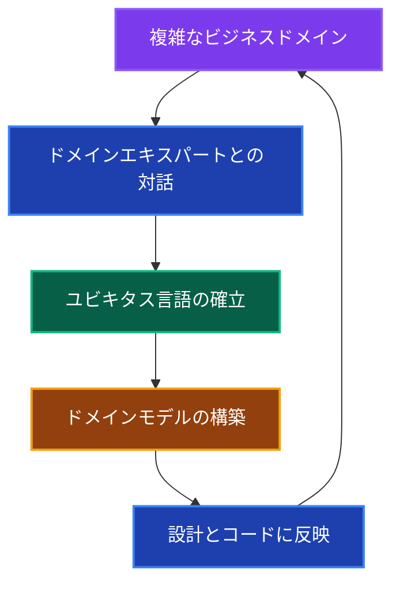
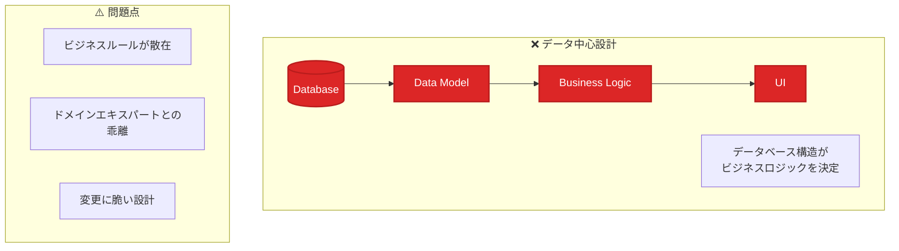
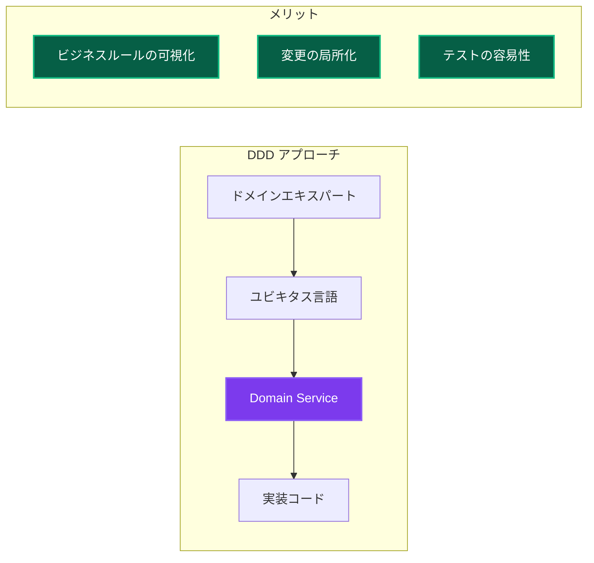
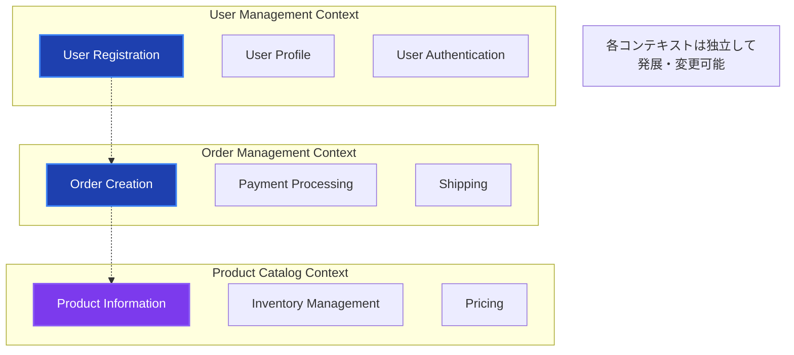
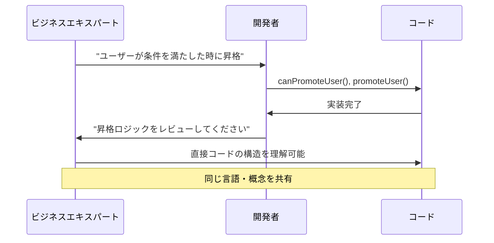
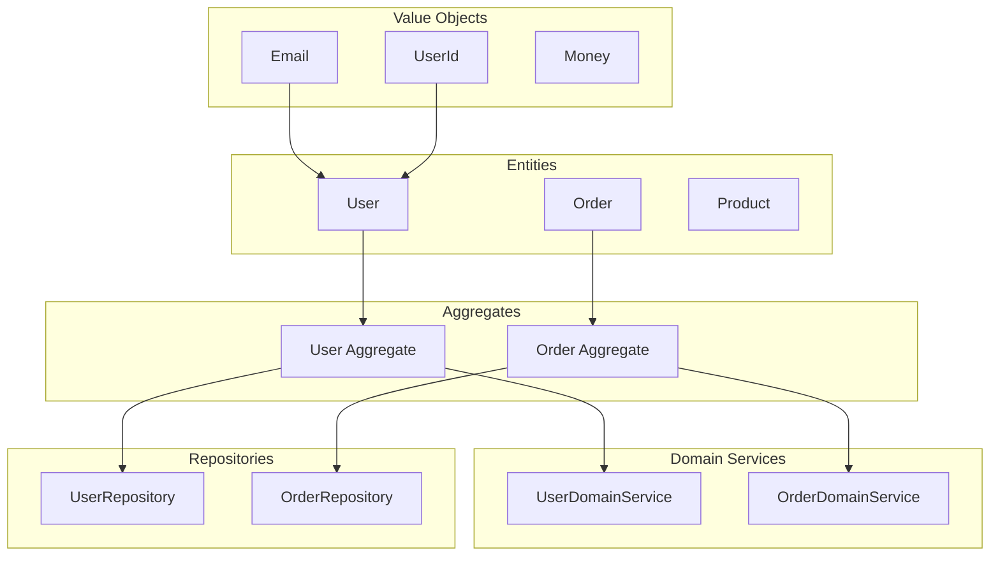
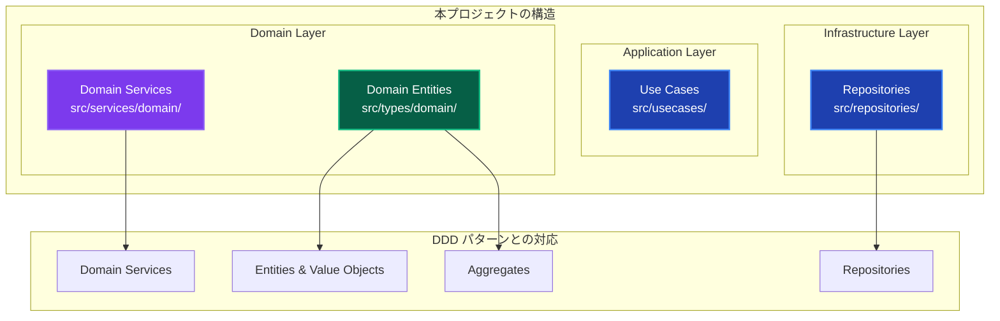
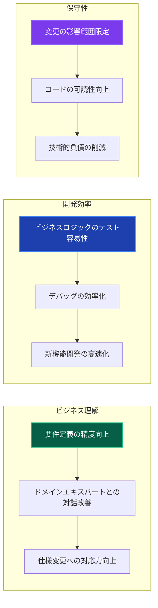
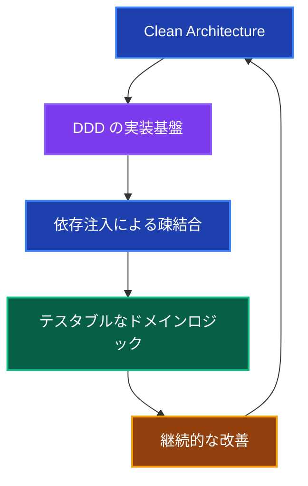

# Domain-Driven Design (DDD) 詳細解説 🧠

このドキュメントでは、DDD（ドメイン駆動設計）の概念、理想的な形、そして本プロジェクトでの実装について詳しく説明します。

---

## DDD の概要 📚

### Domain-Driven Design とは

**Domain-Driven Design (DDD)** は、Eric Evans が提唱したソフトウェア設計手法で、**複雑なビジネスドメインをソフトウェア設計の中心に据える**アプローチです。

### 核心となる哲学



**基本原則：**

1. **ドメインとモデルの一致** - ビジネスの概念がコードに直接反映される
2. **ユビキタス言語** - 開発者とドメインエキスパートが共通の言語を使用
3. **境界づけられたコンテキスト** - 複雑なドメインを管理可能な単位に分割
4. **ドメインの独立性** - ビジネスロジックが技術的関心事から分離

---

## なぜ DDD なのか？ 🤔

### 問題：従来のデータ中心設計



**具体的な問題例：**

```typescript
// ❌ データ中心設計の例
class UserService {
  async promoteUser(userId: string) {
    // データベースの構造に依存したロジック
    const user = await this.db.users.findById(userId);
    
    // ビジネスルールがサービス層に散在
    if (user.experience_points >= 1000) {
      await this.db.users.update(userId, { 
        level: user.level + 1,
        status: 'premium' 
      });
      
      // 副作用の処理も混在
      await this.emailService.sendPromotion(user.email);
    }
  }
}

// 問題：
// 1. "昇格"のビジネスルールがわからない
// 2. データベース構造変更でロジックも変更必要
// 3. ドメインエキスパートにとって理解困難
```

### 解決：DDD アプローチの利点

#### 1. ドメインロジックの集約 🎯

**なぜドメインロジックを集約するのか？**



**具体例：ユーザー昇格のDDD実装**

```typescript
// ✅ DDD アプローチ
export class UserDomainService {
  // ビジネスルールが明確
  canPromoteUser(user: User): boolean {
    // ドメインエキスパートと合意したルール
    return user.experiencePoints >= 1000 && 
           user.accountStatus === 'active' &&
           user.membershipDuration >= 30; // 30日以上の利用
  }
  
  promoteUser(user: User): PromotedUser {
    if (!this.canPromoteUser(user)) {
      throw new DomainError(
        'ユーザーは昇格条件を満たしていません',
        'PROMOTION_CRITERIA_NOT_MET'
      );
    }
    
    // ドメインの知識に基づいた昇格処理
    return new PromotedUser({
      ...user,
      level: user.level + 1,
      status: 'premium',
      promotedAt: new Date(),
    });
  }
}

// メリット：
// 1. ビジネスルールが一箇所に集約
// 2. ドメインエキスパートが理解可能
// 3. 昇格条件の変更が簡単
// 4. ビジネスロジックのテストが独立して可能
```

#### 2. 複雑性の管理 📊

**境界づけられたコンテキストによる分割**



#### 3. ビジネスとコードの一致 🔗

**ユビキタス言語の効果**



---

## 理想的な DDD 設計 🎯

### DDD の戦術的パターン



### 各パターンの役割

| パターン | 責務 | 特徴 |
|---------|------|------|
| **Value Object** | 値の表現・バリデーション | 不変、等価性で比較 |
| **Entity** | 一意性を持つオブジェクト | IDによる識別、ライフサイクル管理 |
| **Aggregate** | 一貫性境界の定義 | トランザクション単位、変更の整合性確保 |
| **Domain Service** | エンティティに属さないビジネスロジック | 複数のエンティティにまたがる処理 |
| **Repository** | ドメインオブジェクトの永続化 | ドメインから技術的詳細を隠蔽 |

---

## 本プロジェクトでの DDD 実装 🛠️

### 実装状況とマッピング



### 実装例：User ドメイン

**1. Value Objects**

```typescript
// src/types/domain/User.ts
export class Email {
  private readonly value: string;
  
  constructor(email: string) {
    if (!this.isValid(email)) {
      throw new DomainError('無効なメールアドレスです', 'INVALID_EMAIL');
    }
    this.value = email;
  }
  
  private isValid(email: string): boolean {
    return /^[^\s@]+@[^\s@]+\.[^\s@]+$/.test(email);
  }
  
  toString(): string {
    return this.value;
  }
  
  equals(other: Email): boolean {
    return this.value === other.value;
  }
}

export class UserId {
  constructor(private readonly value: string) {
    if (!value || value.length === 0) {
      throw new DomainError('ユーザーIDは必須です', 'INVALID_USER_ID');
    }
  }
  
  toString(): string {
    return this.value;
  }
}
```

**2. Entity & Aggregate**

```typescript
// src/types/domain/User.ts
export class User {
  constructor(
    private readonly id: UserId,
    private readonly email: Email,
    private name: string,
    private experiencePoints: number,
    private level: number,
    private readonly createdAt: Date
  ) {}
  
  // ビジネスルールの実装
  canLevelUp(): boolean {
    const requiredPoints = this.level * 1000;
    return this.experiencePoints >= requiredPoints;
  }
  
  levelUp(): void {
    if (!this.canLevelUp()) {
      throw new DomainError(
        '経験値が不足しています',
        'INSUFFICIENT_EXPERIENCE'
      );
    }
    
    this.level += 1;
  }
  
  addExperience(points: number): void {
    if (points <= 0) {
      throw new DomainError(
        '経験値は正の値である必要があります',
        'INVALID_EXPERIENCE_POINTS'
      );
    }
    
    this.experiencePoints += points;
  }
  
  // Getters
  getId(): UserId { return this.id; }
  getEmail(): Email { return this.email; }
  getName(): string { return this.name; }
  getLevel(): number { return this.level; }
  getExperiencePoints(): number { return this.experiencePoints; }
}
```

**3. Domain Service**

```typescript
// src/services/domain/UserDomainService.ts
export class UserDomainService {
  // 複数のエンティティにまたがるビジネスロジック
  async canPromoteUser(user: User, membershipService: MembershipService): Promise<boolean> {
    // ユーザー自身のルール
    if (!user.canLevelUp()) {
      return false;
    }
    
    // メンバーシップに関するルール
    const membership = await membershipService.getMembership(user.getId());
    if (membership.getDurationInDays() < 30) {
      return false;
    }
    
    // 昇格条件の判定
    return user.getLevel() < 10; // 最大レベル制限
  }
  
  calculatePromotionBonus(user: User): number {
    // ビジネスルールに基づくボーナス計算
    const baseBonus = 100;
    const levelMultiplier = user.getLevel() * 0.1;
    
    return Math.floor(baseBonus * (1 + levelMultiplier));
  }
  
  validateUserData(name: string, email: string): void {
    // 統合バリデーション
    if (name.length < 2) {
      throw new DomainError(
        'ユーザー名は2文字以上である必要があります',
        'INVALID_USER_NAME'
      );
    }
    
    // EmailはValue Objectのコンストラクタでバリデーション
    new Email(email);
  }
}
```

**4. Repository インターフェース**

```typescript
// src/repositories/interfaces/IUserRepository.ts
export interface IUserRepository {
  // ドメインオブジェクトを使用
  save(user: User): Promise<void>;
  findById(id: UserId): Promise<User | null>;
  findByEmail(email: Email): Promise<User | null>;
  delete(id: UserId): Promise<void>;
}

// 実装は Infrastructure層
// src/repositories/implementations/PrismaUserRepository.ts
export class PrismaUserRepository implements IUserRepository {
  async save(user: User): Promise<void> {
    // ドメインオブジェクトをデータベース形式に変換
    const userData = {
      id: user.getId().toString(),
      email: user.getEmail().toString(),
      name: user.getName(),
      level: user.getLevel(),
      experiencePoints: user.getExperiencePoints(),
    };
    
    await this.prisma.user.upsert({
      where: { id: userData.id },
      create: userData,
      update: userData,
    });
  }
  
  async findById(id: UserId): Promise<User | null> {
    const userData = await this.prisma.user.findUnique({
      where: { id: id.toString() }
    });
    
    if (!userData) return null;
    
    // データベース形式からドメインオブジェクトに変換
    return new User(
      new UserId(userData.id),
      new Email(userData.email),
      userData.name,
      userData.experiencePoints,
      userData.level,
      userData.createdAt
    );
  }
}
```

---

## DDD vs 従来手法の比較 ⚖️

### コード比較例：ユーザー昇格機能

**従来のアプローチ**

```typescript
// ❌ 従来のサービス層中心設計
class UserService {
  async promoteUser(userId: string) {
    // データベース中心の処理
    const user = await this.userRepository.findById(userId);
    
    // ビジネスルールが散在
    if (user.experience_points >= user.level * 1000) {
      // データベース操作が中心
      await this.userRepository.update(userId, {
        level: user.level + 1,
        updated_at: new Date()
      });
      
      // 副作用の処理
      await this.notificationService.sendLevelUpNotification(user);
    }
  }
}

// 問題：
// 1. ビジネスルールがサービス層に散在
// 2. データベースの構造がロジックを決定
// 3. ドメインエキスパートには理解困難
// 4. テストが複雑（DBモックが必要）
```

**DDD アプローチ**

```typescript
// ✅ DDD による設計
// UseCase (Application Layer)
export class PromoteUserUseCase {
  async execute(userId: string): Promise<void> {
    const user = await this.userRepository.findById(new UserId(userId));
    
    if (!user) {
      throw new DomainError('ユーザーが見つかりません', 'USER_NOT_FOUND');
    }
    
    // ドメインサービスでビジネスルール判定
    const canPromote = await this.userDomainService.canPromoteUser(
      user, 
      this.membershipService
    );
    
    if (!canPromote) {
      throw new DomainError('昇格条件を満たしていません', 'PROMOTION_NOT_ALLOWED');
    }
    
    // ドメインオブジェクトでビジネスロジック実行
    user.levelUp();
    
    // 永続化
    await this.userRepository.save(user);
    
    // 副作用の処理
    await this.notificationUseCase.sendLevelUpNotification(user);
  }
}

// メリット：
// 1. ビジネスルールがドメイン層に集約
// 2. ドメインエキスパートが理解可能
// 3. 単体テストが容易
// 4. 変更の影響範囲が明確
```

---

## DDD の効果測定 📈

### 開発体験の向上



### 具体的な効果例

**1. テストの簡易化**

```typescript
// DDDにより、ビジネスロジックのテストが簡単に
describe('UserDomainService', () => {
  it('昇格条件を満たすユーザーは昇格可能', () => {
    // Given: ドメインオブジェクトの準備
    const user = new User(
      new UserId('123'),
      new Email('test@example.com'),
      'テストユーザー',
      1000, // 経験値
      1,    // レベル
      new Date()
    );
    
    // When: ビジネスルールの実行
    const canLevelUp = user.canLevelUp();
    
    // Then: 結果の検証
    expect(canLevelUp).toBe(true);
  });
  
  // データベースや外部システム不要でテスト可能
});
```

**2. 仕様変更への対応**

```typescript
// 昇格条件の変更例：「レベル5以上はVIPメンバーのみ昇格可能」
export class UserDomainService {
  async canPromoteUser(
    user: User, 
    membershipService: MembershipService
  ): Promise<boolean> {
    if (!user.canLevelUp()) {
      return false;
    }
    
    // 新しいビジネスルール追加
    if (user.getLevel() >= 5) {
      const membership = await membershipService.getMembership(user.getId());
      return membership.isVip();
    }
    
    return true;
  }
}

// 変更箇所：
// ✅ Domain Serviceの1箇所のみ
// ✅ 既存のテストは継続動作
// ✅ 新しいテストケース追加のみで対応
```

---

## まとめ 🎯

### DDD のプロジェクトでの価値

1. **ビジネス価値の最大化**
   - ドメインエキスパートとの協働によるビジネス理解の深化
   - 要件定義の精度向上による手戻りの削減

2. **開発効率の向上**
   - ビジネスロジックの局所化による変更の容易性
   - テストの独立性による開発速度向上

3. **長期的な保守性**
   - ドメインモデルによる複雑性の管理
   - 技術的変更からの業務ロジック保護

### 本プロジェクトでの DDD 成功要因



**相乗効果：**

- **Clean Architecture** が DDD の基盤を提供
- **依存注入** がドメインサービスのテストを容易化
- **レイヤー分離** がドメインロジックの独立性を確保

---

## 関連ドキュメント 📚

- [クリーンアーキテクチャ詳細解説](./clean-architecture.md) - アーキテクチャとの関係
- [アーキテクチャ概要](../architecture-overview.md) - 全体設計との連携
- [開発ガイド](../development-guide.md) - 実装手順
- [テスト戦略](../testing-strategy.md) - ドメインロジックのテスト手法
