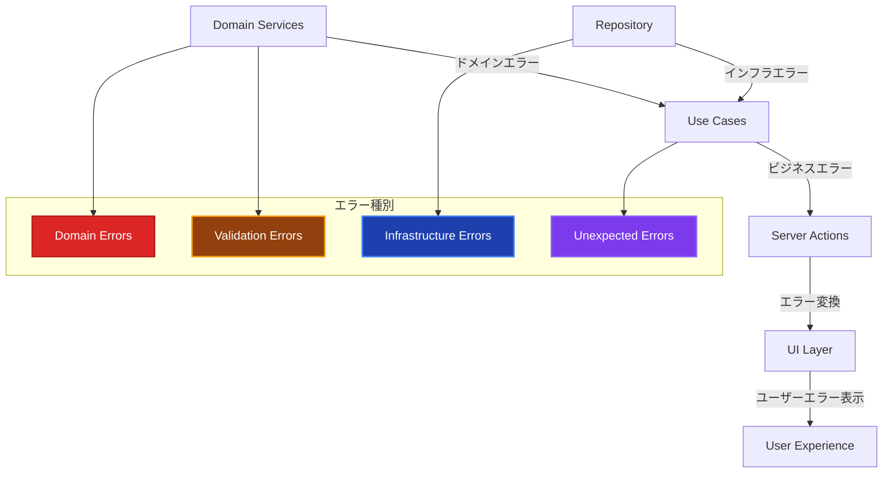
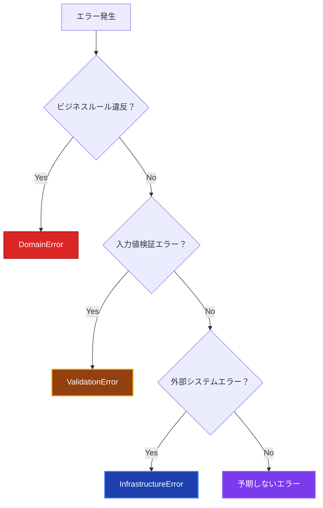

# エラーハンドリング実装ガイド 🚨

このドキュメントでは、Result型パターンを中心とした全レイヤーを横断するエラーハンドリングの実装方針、パターン、ベストプラクティスについて解説します。

## 🚀 Result型パターン採用について

**本プロジェクトでは、例外処理の代わりにResult型パターンを採用しています。**

### メリット

- **型安全性**: 成功・失敗が型レベルで表現される
- **明示的エラーハンドリング**: エラー処理が必須となり、見落としを防止
- **パフォーマンス**: 例外スローのオーバーヘッド削減
- **一貫性**: 全UseCaseで統一されたエラーハンドリング

---

## Result型の基本構造 📝

```typescript
// 統一的なResult型定義
export type Result<T> = Success<T> | Failure;

export interface Success<T> {
 readonly success: true;
 readonly data: T;
}

export interface Failure {
 readonly success: false;
 readonly error: {
  readonly message: string;
  readonly code: string;
  readonly details?: Record<string, unknown>;
 };
}
```

---

## エラーハンドリングの全体像 🎯



---

## ✅ エラー種別と責務

### 1. Domain Error（ドメインエラー） 🏛️

**ビジネスルール違反を表現**

```typescript
// ✅ Domain Layerで定義
export class DomainError extends Error {
 constructor(
  message: string,
  public readonly code: string,
  public readonly details?: Record<string, any>,
 ) {
  super(message);
  this.name = 'DomainError';
 }
}

// ✅ 具体的なドメインエラー
export class UserPromotionError extends DomainError {
 constructor(reason: string, userId: string) {
  super(`ユーザーの昇格に失敗しました: ${reason}`, 'USER_PROMOTION_FAILED', {
   userId,
   reason,
  });
 }
}

export class InsufficientPointsError extends DomainError {
 constructor(required: number, current: number) {
  super(
   `ポイントが不足しています。必要: ${required}, 現在: ${current}`,
   'INSUFFICIENT_POINTS',
   { required, current },
  );
 }
}

// ✅ Domain Layerでの使用例（例外型）
export class User {
 promote(): void {
  if (!this.canPromote()) {
   throw new UserPromotionError(
    '昇格条件を満たしていません',
    this.id.toString(),
   );
  }

  this.level += 1;
 }
}
```

---

## 🎯 Result型パターンの実装例

### UseCase層での実装

```typescript
// ✅ SignInUseCase: Result型でエラーハンドリング
@injectable()
export class SignInUseCase {
 async execute({
  email,
  password,
 }: SignInRequest): Promise<Result<SignInResponse>> {
  this.logger.info('サインイン試行開始', { email });

  try {
   // Email Value Objectを作成（バリデーション込み）
   const emailVO = new Email(email);

   // パスワードの基本バリデーション
   if (!password || password.trim().length === 0) {
    return failure('パスワードを入力してください', 'EMPTY_PASSWORD');
   }

   // ユーザー検索
   const user = await this.userRepository.findByEmail(emailVO);
   if (!user) {
    return failure(
     'メールアドレスまたはパスワードが正しくありません',
     'INVALID_CREDENTIALS',
    );
   }

   // パスワード検証
   const isPasswordValid = await this.hashService.compareHash(
    password,
    user.getPasswordHash(),
   );

   if (!isPasswordValid) {
    return failure(
     'メールアドレスまたはパスワードが正しくありません',
     'INVALID_CREDENTIALS',
    );
   }

   // 成功時のレスポンス
   return success({
    user: {
     id: user.getId().toString(),
     name: user.getName(),
     email: user.getEmail().toString(),
    },
   });
  } catch (error) {
   this.logger.error('サインイン処理中に予期しないエラーが発生', {
    email,
    error: error instanceof Error ? error.message : 'Unknown error',
   });

   // DomainErrorの場合は適切なエラーコードで返す
   if (error instanceof DomainError) {
    return failure(error.message, error.code);
   }

   // その他の予期しないエラー
   return failure('サインイン処理中にエラーが発生しました', 'UNEXPECTED_ERROR');
  }
 }
}
```

### Server Action層での実装

```typescript
// ✅ Server Action: Result型のパターンマッチング
export async function signIn(formData: FormData) {
 try {
  const logger = resolve('Logger');
  const signInUseCase = resolve('SignInUseCase');

  const result = await signInUseCase.execute({
   email,
   password,
  });

  // Result型のパターンマッチング
  if (isSuccess(result)) {
   logger.info('サインイン成功', {
    userId: result.data.user.id,
    email: result.data.user.email,
   });

   return {
    success: true,
    user: result.data.user,
   };
  } else {
   logger.warn('サインイン失敗', {
    error: result.error.message,
    code: result.error.code,
   });

   return {
    error: result.error.message,
    code: result.error.code,
   };
  }
 } catch (error) {
  // 予期しないエラー（UseCaseで処理されなかった例外）
  const logger = resolve('Logger');
  logger.error('サインイン処理中に予期しないエラーが発生', {
   error: error instanceof Error ? error.message : 'Unknown error',
  });

  return {
   error: 'システムエラーが発生しました',
   code: 'SYSTEM_ERROR',
  };
 }
}
```

### Repository層でのエラーハンドリング

```typescript
// ✅ Repository: DomainErrorに変換して返す
@injectable()
export class PrismaUserRepository implements IUserRepository {
 async save(user: User): Promise<void> {
  try {
   const data = this.toPersistenceObject(user);
   await this.prisma.user.upsert({
    where: { id: data.id },
    update: { name: data.name, email: data.email },
    create: data,
   });
  } catch (error) {
   // Prismaエラーを適切なドメインエラーに変換
   if (error instanceof Error) {
    if (error.message.includes('Unique constraint')) {
     if (error.message.includes('email')) {
      throw new DomainError(
       'メールアドレスが既に使用されています',
       'EMAIL_DUPLICATE',
      );
     }
    }
   }
   throw new DomainError('ユーザーの保存に失敗しました', 'USER_SAVE_FAILED');
  }
 }
}
```

### 2. Validation Error（バリデーションエラー） 📝

**入力値検証エラー**

```typescript
// ✅ Domain Layerで定義
export class ValidationError extends Error {
 constructor(
  message: string,
  public readonly field: string,
  public readonly value: any,
  public readonly code: string = 'VALIDATION_ERROR',
 ) {
  super(message);
  this.name = 'ValidationError';
 }
}

// ✅ Value Objectでの使用例
export class Email {
 constructor(email: string) {
  this.validateEmail(email);
  this.value = email.toLowerCase().trim();
 }

 private validateEmail(email: string): void {
  if (!email || email.trim().length === 0) {
   throw new ValidationError(
    'メールアドレスは必須です',
    'email',
    email,
    'EMAIL_REQUIRED',
   );
  }

  const emailRegex = /^[^\s@]+@[^\s@]+\.[^\s@]+$/;
  if (!emailRegex.test(email)) {
   throw new ValidationError(
    'メールアドレスの形式が正しくありません',
    'email',
    email,
    'INVALID_EMAIL_FORMAT',
   );
  }
 }
}
```

### 3. Infrastructure Error（インフラエラー） 🔧

**外部システム・技術的エラー**

```typescript
// ✅ Infrastructure Layerで定義
export class InfrastructureError extends Error {
 constructor(
  message: string,
  public readonly code: string,
  public readonly originalError?: Error,
  public readonly context?: Record<string, any>,
 ) {
  super(message);
  this.name = 'InfrastructureError';
 }
}

export class DatabaseError extends InfrastructureError {
 constructor(
  operation: string,
  originalError: Error,
  context?: Record<string, any>,
 ) {
  super(
   `データベース操作に失敗しました: ${operation}`,
   'DATABASE_ERROR',
   originalError,
   context,
  );
 }
}

export class ExternalApiError extends InfrastructureError {
 constructor(service: string, statusCode: number, originalError?: Error) {
  super(
   `外部API呼び出しに失敗しました: ${service} (Status: ${statusCode})`,
   'EXTERNAL_API_ERROR',
   originalError,
   { service, statusCode },
  );
 }
}

// ✅ Repository実装での使用例
export class PrismaUserRepository implements IUserRepository {
 async save(user: User): Promise<void> {
  try {
   const data = this.toPersistenceObject(user);
   await this.prisma.user.upsert({
    where: { id: data.id },
    update: data,
    create: data,
   });
  } catch (error) {
   throw new DatabaseError('ユーザー保存', error as Error, {
    userId: user.getId().toString(),
   });
  }
 }
}
```

---

## 🎯 レイヤー別エラーハンドリング

### Presentation Layer（Server Actions） 🎨

```typescript
// ✅ Server Actionsでのエラーハンドリング
'use server';
export async function createUserAction(
 formData: FormData,
): Promise<ActionResult> {
 try {
  const userData = {
   name: formData.get('name') as string,
   email: formData.get('email') as string,
  };

  const createUserUseCase = resolve('CreateUserUseCase');
  const user = await createUserUseCase.execute(userData);

  revalidatePath('/users');
  redirect(`/users/${user.id}`);
 } catch (error) {
  // ドメインエラーの適切な処理
  if (error instanceof DomainError) {
   return {
    success: false,
    error: error.message,
    code: error.code,
    field: error instanceof ValidationError ? error.field : undefined,
   };
  }

  // インフラエラーの処理
  if (error instanceof InfrastructureError) {
   console.error('Infrastructure error in createUserAction:', {
    code: error.code,
    message: error.message,
    originalError: error.originalError?.message,
    context: error.context,
   });

   return {
    success: false,
    error:
     'システムエラーが発生しました。しばらく時間をおいて再度お試しください。',
    code: 'SYSTEM_ERROR',
   };
  }

  // 予期しないエラーの処理
  console.error('Unexpected error in createUserAction:', error);
  return {
   success: false,
   error: '予期しないエラーが発生しました。',
   code: 'UNEXPECTED_ERROR',
  };
 }
}

export interface ActionResult {
 success: boolean;
 error?: string;
 code?: string;
 field?: string;
}
```

### Application Layer（Use Cases） 📋

```typescript
// ✅ Use Casesでのエラーハンドリング
export class CreateUserUseCase {
 async execute(request: CreateUserRequest): Promise<CreateUserResponse> {
  try {
   // ドメインサービスでビジネスルール検証
   await this.userDomainService.validateUserUniqueness(
    new Email(request.email),
   );

   // ドメインオブジェクト作成
   const user = UserFactory.createNewUser(
    new Email(request.email),
    request.name,
    RegistrationSource.DIRECT,
   );

   // 永続化
   await this.userRepository.save(user);

   // 外部システム連携
   await this.emailService.sendWelcomeEmail(
    user.getEmail().toString(),
    user.getName(),
   );

   return this.mapToResponse(user);
  } catch (error) {
   // ドメインエラーはそのまま再スロー
   if (error instanceof DomainError || error instanceof ValidationError) {
    throw error;
   }

   // インフラエラーもそのまま再スロー（ログは各レイヤーで出力）
   if (error instanceof InfrastructureError) {
    throw error;
   }

   // 予期しないエラーはラップしてスロー
   this.logger.error('Unexpected error in CreateUserUseCase', {
    request,
    error: error.message,
    stack: error.stack,
   });

   throw new DomainError(
    'ユーザー作成処理中にエラーが発生しました',
    'USER_CREATION_FAILED',
    { originalError: error.message },
   );
  }
 }
}
```

### Domain Layer 🏛️

```typescript
// ✅ Domain Serviceでのエラーハンドリング
export class UserDomainService {
 async validateUserUniqueness(email: Email): Promise<void> {
  try {
   const existingUser = await this.userRepository.findByEmail(email);
   if (existingUser) {
    throw new DomainError(
     'このメールアドレスは既に使用されています',
     'EMAIL_ALREADY_EXISTS',
     { email: email.toString() },
    );
   }
  } catch (error) {
   // ドメインエラーはそのまま再スロー
   if (error instanceof DomainError) {
    throw error;
   }

   // インフラエラーもそのまま再スロー
   if (error instanceof InfrastructureError) {
    throw error;
   }

   // 予期しないエラーはドメインエラーとしてラップ
   throw new DomainError(
    'ユーザー重複チェック中にエラーが発生しました',
    'USER_UNIQUENESS_CHECK_FAILED',
    { email: email.toString(), originalError: error.message },
   );
  }
 }
}
```

---

## 🎨 UI でのエラー表示

### Client Component でのエラーハンドリング

```typescript
// ✅ Client Componentでのエラー表示
'use client';
export function CreateUserFormClient() {
  const [error, setError] = useState<ActionResult | null>(null);
  const [isSubmitting, setIsSubmitting] = useState(false);

  const handleSubmit = async (formData: FormData) => {
    setIsSubmitting(true);
    setError(null);

    const result = await createUserAction(formData);

    if (!result.success) {
      setError(result);
    }

    setIsSubmitting(false);
  };

  return (
    <form action={handleSubmit} className="space-y-4">
      {error && (
        <ErrorDisplay error={error} />
      )}

      <div>
        <input
          name="email"
          type="email"
          placeholder="メールアドレス"
          className={`border rounded px-3 py-2 ${
            error?.field === 'email' ? 'border-red-500' : 'border-gray-300'
          }`}
        />
        {error?.field === 'email' && (
          <p className="text-red-500 text-sm mt-1">{error.error}</p>
        )}
      </div>

      <button
        type="submit"
        disabled={isSubmitting}
        className="bg-blue-500 text-white px-4 py-2 rounded cursor-pointer hover:bg-blue-600 disabled:opacity-50"
      >
        {isSubmitting ? '作成中...' : '作成'}
      </button>
    </form>
  );
}

// ✅ エラー表示コンポーネント
function ErrorDisplay({ error }: { error: ActionResult }) {
  const getErrorStyle = (code: string) => {
    switch (code) {
      case 'VALIDATION_ERROR':
      case 'EMAIL_ALREADY_EXISTS':
        return 'bg-yellow-100 border-yellow-400 text-yellow-700';
      case 'SYSTEM_ERROR':
      case 'DATABASE_ERROR':
        return 'bg-red-100 border-red-400 text-red-700';
      default:
        return 'bg-gray-100 border-gray-400 text-gray-700';
    }
  };

  const getErrorIcon = (code: string) => {
    switch (code) {
      case 'VALIDATION_ERROR':
        return '⚠️';
      case 'SYSTEM_ERROR':
        return '🚨';
      default:
        return 'ℹ️';
    }
  };

  return (
    <div className={`border px-4 py-3 rounded ${getErrorStyle(error.code || '')}`}>
      <div className="flex items-center">
        <span className="mr-2">{getErrorIcon(error.code || '')}</span>
        <span>{error.error}</span>
      </div>
    </div>
  );
}
```

---

## 🧪 テストでのエラーハンドリング

### Domain Layer テスト

```typescript
// ✅ ドメインエラーのテスト
describe('User', () => {
 describe('promote', () => {
  it('昇格条件を満たしていない場合はUserPromotionErrorが発生する', () => {
   // Arrange
   const user = UserFactory.createTestUser({
    experiencePoints: 500,
    level: 2,
   });

   // Act & Assert
   expect(() => user.promote()).toThrow(UserPromotionError);

   expect(() => user.promote()).toThrow(
    'ユーザーの昇格に失敗しました: 昇格条件を満たしていません',
   );
  });
 });

 describe('subtractPoints', () => {
  it('ポイント不足の場合はInsufficientPointsErrorが発生する', () => {
   // Arrange
   const user = UserFactory.createTestUser({ experiencePoints: 100 });

   // Act & Assert
   expect(() => user.subtractPoints(200)).toThrow(InsufficientPointsError);

   try {
    user.subtractPoints(200);
   } catch (error) {
    expect(error).toBeInstanceOf(InsufficientPointsError);
    expect((error as InsufficientPointsError).details).toEqual({
     required: 200,
     current: 100,
    });
   }
  });
 });
});
```

### Use Case テスト

```typescript
// ✅ Use Caseエラーハンドリングのテスト
describe('CreateUserUseCase', () => {
 it('メールアドレス重複時はDomainErrorが発生する', async () => {
  // Arrange
  const mockUserRepository = {
   findByEmail: vi.fn().mockResolvedValue(existingUser),
   save: vi.fn(),
  };

  const useCase = new CreateUserUseCase(
   mockUserRepository,
   mockUserDomainService,
   mockEmailService,
   mockLogger,
  );

  // Act & Assert
  await expect(
   useCase.execute({
    name: 'テストユーザー',
    email: 'test@example.com',
   }),
  ).rejects.toThrow(DomainError);

  await expect(
   useCase.execute({
    name: 'テストユーザー',
    email: 'test@example.com',
   }),
  ).rejects.toThrow('このメールアドレスは既に使用されています');
 });

 it('インフラエラー時は適切にラップされる', async () => {
  // Arrange
  const mockUserRepository = {
   findByEmail: vi
    .fn()
    .mockRejectedValue(new DatabaseError('接続エラー', new Error())),
   save: vi.fn(),
  };

  const useCase = new CreateUserUseCase(
   mockUserRepository,
   mockUserDomainService,
   mockEmailService,
   mockLogger,
  );

  // Act & Assert
  await expect(
   useCase.execute({
    name: 'テストユーザー',
    email: 'test@example.com',
   }),
  ).rejects.toThrow(DatabaseError);
 });
});
```

---

## 📊 ログ出力戦略

### 構造化ログ

```typescript
// ✅ 適切なログ出力
export class CreateUserUseCase {
 async execute(request: CreateUserRequest): Promise<CreateUserResponse> {
  const correlationId = generateCorrelationId();

  this.logger.info('ユーザー作成開始', {
   correlationId,
   email: request.email,
   name: request.name,
  });

  try {
   // ... 処理 ...

   this.logger.info('ユーザー作成完了', {
    correlationId,
    userId: user.getId().toString(),
    email: request.email,
   });

   return this.mapToResponse(user);
  } catch (error) {
   if (error instanceof DomainError) {
    this.logger.warn('ユーザー作成失敗（ビジネスルール違反）', {
     correlationId,
     email: request.email,
     errorCode: error.code,
     errorMessage: error.message,
     errorDetails: error.details,
    });
   } else if (error instanceof InfrastructureError) {
    this.logger.error('ユーザー作成失敗（インフラエラー）', {
     correlationId,
     email: request.email,
     errorCode: error.code,
     errorMessage: error.message,
     originalError: error.originalError?.message,
     context: error.context,
    });
   } else {
    this.logger.error('ユーザー作成失敗（予期しないエラー）', {
     correlationId,
     email: request.email,
     errorMessage: error.message,
     stack: error.stack,
    });
   }

   throw error;
  }
 }
}
```

---

## 🎯 まとめ

### エラーハンドリングの原則

1. **適切なレイヤーでキャッチ** - エラーの性質に応じた処理
2. **情報の保持** - エラーコード、詳細情報の適切な管理
3. **ユーザーフレンドリー** - 技術的詳細を隠した分かりやすいメッセージ
4. **ログの充実** - デバッグ・監視に必要な情報の記録
5. **テスタビリティ** - エラーケースの適切なテスト

### エラー種別判断基準



---

## 関連ドキュメント 📚

- [Domain Layer ガイド](../layers/domain-layer.md) - ドメインエラーの実装詳細
- [Application Layer ガイド](../layers/application-layer.md) - Use Caseでのエラーハンドリング
- [Presentation Layer ガイド](../layers/presentation-layer.md) - UIでのエラー表示
- [ロギング戦略](./logging-strategy.md) - エラーログの出力戦略
- [テスト戦略](../../../testing-strategy.md) - エラーケースのテスト方法
