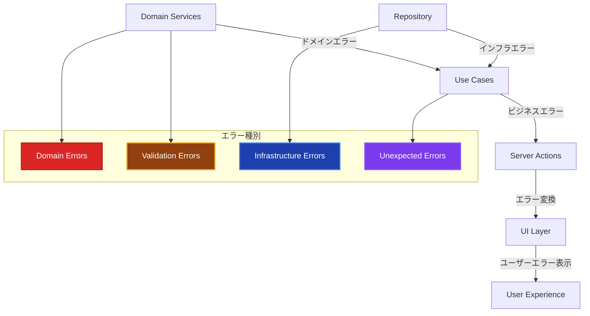
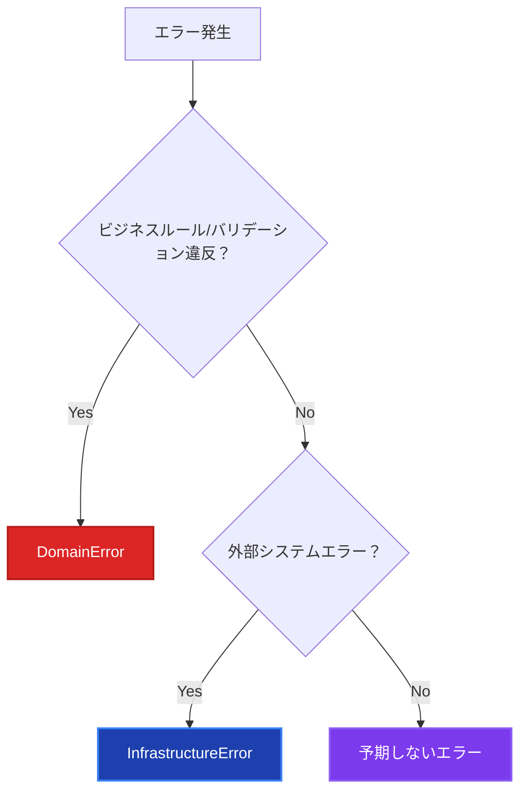

# エラーハンドリング実装ガイド 🚨

このドキュメントでは、Result型パターンを中心とした全レイヤーを横断するエラーハンドリングの実装方針、パターン、ベストプラクティスについて解説します。

## 🚀 Result型パターン採用について

**本プロジェクトでは、例外処理の代わりにResult型パターンを採用しています。**

### メリット

- **型安全性**: 成功・失敗が型レベルで表現される
- **明示的エラーハンドリング**: エラー処理が必須となり、見落としを防止
- **パフォーマンス**: 例外スローのオーバーヘッド削減
- **一貫性**: 全UseCaseで統一されたエラーハンドリング

---

## Result型の基本構造 📝

```typescript
// neverthrow ベースのResult型定義
import { ok, err, type Result } from '@/layers/application/types/Result';
import type { AppError } from '@/layers/application/types/Result';

// AppErrorの型定義
export type AppError = {
 readonly message: string;
 readonly code: string;
 readonly details?: Record<string, unknown>;
};

// Result<T, AppError> を使用（neverthrow）
// ok(data)    → 成功
// err(error)  → 失敗
```

---

## エラーハンドリングの全体像 🎯


```mermaid
graph TD
    UI[UI Layer] --> |ユーザーエラー表示| UE[User Experience]
    SA[Server Actions] --> |エラー変換| UI
    UC[Use Cases] --> |ビジネスエラー| SA
    DS[Domain Services] --> |ドメインエラー| UC
    REPO[Repository] --> |インフラエラー| UC

    subgraph "エラー種別"
        DE[Domain Errors]
        VE[Validation Errors]
        IE[Infrastructure Errors]
        UNE[Unexpected Errors]
    end

    DS --> DE
    DS --> VE
    REPO --> IE
    UC --> UNE

    style DE fill:#dc2626,stroke:#b91c1c,stroke-width:2px,color:#ffffff
    style VE fill:#92400e,stroke:#f59e0b,stroke-width:2px,color:#ffffff
    style IE fill:#1e40af,stroke:#3b82f6,stroke-width:2px,color:#ffffff
    style UNE fill:#7c3aed,stroke:#8b5cf6,stroke-width:2px,color:#ffffff
```

---

## ✅ エラー種別と責務

### 1. Domain Error（ドメインエラー） 🏛️

**ビジネスルール違反を表現**

```typescript
// ✅ Domain Layerで定義
export class DomainError extends Error {
 constructor(
  message: string,
  public readonly code: string,
  public readonly details?: Record<string, any>,
 ) {
  super(message);
  this.name = 'DomainError';
 }
}

// ✅ 具体的なドメインエラー
export class UserPromotionError extends DomainError {
 constructor(reason: string, userId: string) {
  super(`ユーザーの昇格に失敗しました: ${reason}`, 'USER_PROMOTION_FAILED', {
   userId,
   reason,
  });
 }
}

export class InsufficientPointsError extends DomainError {
 constructor(required: number, current: number) {
  super(
   `ポイントが不足しています。必要: ${required}, 現在: ${current}`,
   'INSUFFICIENT_POINTS',
   { required, current },
  );
 }
}

// ✅ Domain Layerでの使用例（例外型）
// public readonly プロパティを直接アクセス（Immutableパターン）
//
// 【注記】Domain層（Entity / Value Object / Domain Service）では DomainError の throw は許容パターン。
// Application層（UseCase）の catch ブロックで err() に変換する。
// Application層以上では throw 禁止・Result型必須。
export class User {
 changeEmail(newEmail: Email): User {
  if (newEmail.value === this.email.value) {
   throw new DomainError(
    '新しいメールアドレスが現在のものと同じです',
    'EMAIL_SAME_AS_CURRENT',
    { userId: this.id.value }, // Value Object: .value でプリミティブ値を取得
   );
  }

  return new User(this.id, newEmail, this.name, this.passwordHash, this.createdAt, new Date());
 }
}
```

---

## 🎯 Result型パターンの実装例

### UseCase層での実装

```typescript
// ✅ SignInUseCase: Result型でエラーハンドリング
@injectable()
export class SignInUseCase {
 async execute({
  email,
  password,
 }: SignInRequest): Promise<Result<SignInResponse, AppError>> {
  this.logger.info('サインイン試行開始', { email });

  try {
   // Email Value Objectを作成（バリデーション込み）
   const emailVO = new Email(email);

   // パスワードの基本バリデーション
   if (!password || password.trim().length === 0) {
    return err({ message: 'パスワードを入力してください', code: 'EMPTY_PASSWORD' });
   }

   // ユーザー検索
   const user = await this.userRepository.findByEmail(emailVO);
   if (!user) {
    return err({
     message: 'メールアドレスまたはパスワードが正しくありません',
     code: 'INVALID_CREDENTIALS',
    });
   }

   // パスワード検証
   const isPasswordValid = await this.hashService.compareHash(
    password,
    user.passwordHash, // public readonly プロパティ
   );

   if (!isPasswordValid) {
    return err({
     message: 'メールアドレスまたはパスワードが正しくありません',
     code: 'INVALID_CREDENTIALS',
    });
   }

   // 成功時のレスポンス
   // Value Object: .value で型安全にプリミティブ値を取得
   return ok({
    user: {
     id: user.id.value,
     name: user.name,
     email: user.email.value,
    },
   });
  } catch (error) {
   this.logger.error('サインイン処理中に予期しないエラーが発生', {
    email,
    error: error instanceof Error ? error.message : 'Unknown error',
   });

   // DomainErrorの場合は適切なエラーコードで返す
   if (error instanceof DomainError) {
    return err({ message: error.message, code: error.code });
   }

   // その他の予期しないエラー
   return err({ message: 'サインイン処理中にエラーが発生しました', code: 'UNEXPECTED_ERROR' });
  }
 }
}
```

### Server Action層での実装

```typescript
// ✅ Server Action: Result型のパターンマッチング
import { resolve } from '@/di/resolver';

export async function signIn(formData: FormData) {
 try {
  // 型安全な resolve 関数でサービス取得
  const logger = resolve('Logger');
  const signInUseCase = resolve('SignInUseCase');

  const result = await signInUseCase.execute({
   email,
   password,
  });

  // Result型のパターンマッチング
  if (result.isOk()) {
   logger.info('サインイン成功', {
    userId: result.value.user.id,
    email: result.value.user.email,
   });

   return {
    success: true,
    user: result.value.user,
   };
  } else {
   logger.warn('サインイン失敗', {
    error: result.error.message,
    code: result.error.code,
   });

   return {
    error: result.error.message,
    code: result.error.code,
   };
  }
 } catch (error) {
  // 予期しないエラー（UseCaseで処理されなかった例外）
  const logger = resolve('Logger');
  logger.error('サインイン処理中に予期しないエラーが発生', {
   error: error instanceof Error ? error.message : 'Unknown error',
  });

  return {
   error: 'システムエラーが発生しました',
   code: 'SYSTEM_ERROR',
  };
 }
}
```

### Repository層でのエラーハンドリング

```typescript
// ✅ Repository: DomainErrorに変換して返す
@injectable()
export class PrismaUserRepository implements IUserRepository {
 async save(user: User): Promise<void> {
  try {
   // public readonly プロパティを直接アクセスして永続化オブジェクト作成
   const data = this.toPersistenceObject(user);
   await this.prisma.user.upsert({
    where: { id: data.id },
    update: { name: data.name, email: data.email },
    create: data,
   });
  } catch (error) {
   // Prismaエラーを適切なドメインエラーに変換
   if (error instanceof Error) {
    if (error.message.includes('Unique constraint')) {
     if (error.message.includes('email')) {
      throw new DomainError(
       'メールアドレスが既に使用されています',
       'EMAIL_DUPLICATE',
      );
     }
    }
   }
   throw new DomainError('ユーザーの保存に失敗しました', 'USER_SAVE_FAILED');
  }
 }
}
```

### 2. Validation Error（バリデーションエラー） 📝

**入力値検証エラー - DomainErrorで表現**

> **注意**: 本プロジェクトでは専用の `ValidationError` クラスは使用せず、`DomainError` でバリデーションエラーを表現します。エラーコードで種別を区別します。

```typescript
// ✅ Value Objectでの使用例（DomainErrorを使用）
import { DomainError } from '@/layers/domain/errors/DomainError';

export class Email {
 public readonly value: string;

 constructor(email: string) {
  this.validateEmail(email);
  this.value = email.toLowerCase().trim();
 }

 private validateEmail(email: string): void {
  if (!email || email.trim().length === 0) {
   throw new DomainError(
    'メールアドレスは必須です',
    'EMAIL_REQUIRED',
   );
  }

  const emailRegex = /^[^\s@]+@[^\s@]+\.[^\s@]+$/;
  if (!emailRegex.test(email)) {
   throw new DomainError(
    'メールアドレスの形式が正しくありません',
    'EMAIL_INVALID_FORMAT',
   );
  }
 }
}
```

**エラーコードの命名規則:**

- `EMAIL_REQUIRED` - 必須チェック
- `EMAIL_INVALID_FORMAT` - 形式チェック
- `EMAIL_TOO_LONG` - 長さチェック
- `EMAIL_INVALID_CHARACTERS` - 禁止文字チェック

### 3. Infrastructure Error（インフラエラー） 🔧

**外部システム・技術的エラー**

```typescript
// ✅ Infrastructure Layerで定義
export class InfrastructureError extends Error {
 constructor(
  message: string,
  public readonly code: string,
  public readonly originalError?: Error,
  public readonly context?: Record<string, any>,
 ) {
  super(message);
  this.name = 'InfrastructureError';
 }
}

export class DatabaseError extends InfrastructureError {
 constructor(
  operation: string,
  originalError: Error,
  context?: Record<string, any>,
 ) {
  super(
   `データベース操作に失敗しました: ${operation}`,
   'DATABASE_ERROR',
   originalError,
   context,
  );
 }
}

export class ExternalApiError extends InfrastructureError {
 constructor(service: string, statusCode: number, originalError?: Error) {
  super(
   `外部API呼び出しに失敗しました: ${service} (Status: ${statusCode})`,
   'EXTERNAL_API_ERROR',
   originalError,
   { service, statusCode },
  );
 }
}

// ✅ Repository実装での使用例
export class PrismaUserRepository implements IUserRepository {
 async save(user: User): Promise<void> {
  try {
   const data = this.toPersistenceObject(user);
   await this.prisma.user.upsert({
    where: { id: data.id },
    update: data,
    create: data,
   });
  } catch (error) {
   throw new DatabaseError('ユーザー保存', error as Error, {
    userId: user.id.value, // Value Object: .value でプリミティブ値を取得
   });
  }
 }
}
```

---

## 🎯 レイヤー別エラーハンドリング

### Presentation Layer（Server Actions） 🎨

```typescript
// ✅ Server Actionsでのエラーハンドリング（neverthrowパターン）
'use server';

import 'reflect-metadata';

import { resolve } from '@/di/resolver';
import { revalidatePath } from 'next/cache';
import { z } from 'zod';

const createUserSchema = z.object({
 name: z.string().min(1, '名前を入力してください'),
 email: z.email('有効なメールアドレスを入力してください'),
 password: z.string().min(8, 'パスワードは8文字以上で入力してください'),
});

export async function createUserAction(
 formData: FormData,
): Promise<ActionResult> {
 try {
  const logger = resolve('Logger');

  logger.info('ユーザー作成処理開始', { action: 'createUserAction' });

  // フォームデータの検証
  const validatedFields = createUserSchema.safeParse({
   name: formData.get('name'),
   email: formData.get('email'),
   password: formData.get('password'),
  });

  if (!validatedFields.success) {
   logger.warn('ユーザー作成: バリデーションエラー', {
    errors: validatedFields.error.flatten().fieldErrors,
   });
   return {
    success: false,
    errors: validatedFields.error.flatten().fieldErrors,
   };
  }

  // 型安全な resolve 関数でUseCase取得
  const createUserUseCase = resolve('CreateUserUseCase');
  const result = await createUserUseCase.execute(validatedFields.data);

  // Result型のパターンマッチング（isOk/isErr）
  if (result.isOk()) {
   logger.info('ユーザー作成成功', {
    userId: result.value.id,
    email: result.value.email,
   });

   revalidatePath('/users');

   return {
    success: true,
    user: {
     id: result.value.id,
     name: result.value.name,
     email: result.value.email,
    },
   };
  } else {
   logger.warn('ユーザー作成失敗', {
    error: result.error.message,
    code: result.error.code,
   });

   return {
    success: false,
    error: result.error.message,
    code: result.error.code,
   };
  }
 } catch (error) {
  // 予期しないエラー（UseCaseで処理されなかった例外）
  const logger = resolve('Logger');

  logger.error('ユーザー作成処理中に予期しないエラーが発生', {
   error: error instanceof Error ? error.message : 'Unknown error',
   stack: error instanceof Error ? error.stack : undefined,
  });

  return {
   success: false,
   error: 'システムエラーが発生しました',
   code: 'SYSTEM_ERROR',
  };
 }
}

export interface ActionResult {
 success: boolean;
 error?: string;
 code?: string;
 errors?: Record<string, string[]>;
 user?: { id: string; name: string; email: string };
}
```

### Application Layer（Use Cases） 📋

```typescript
// ✅ Use Casesでのエラーハンドリング（neverthrowパターン）
import {
  type AppError,
  err,
  ok,
  type Result,
} from '@/layers/application/types/Result';
import { DomainError } from '@/layers/domain/errors/DomainError';

@injectable()
export class CreateUserUseCase {
 async execute(request: CreateUserRequest): Promise<Result<CreateUserResponse, AppError>> {
  this.logger.info('ユーザー作成開始', { name: request.name, email: request.email });

  try {
   // ドメインサービスでビジネスルール検証
   // 【注記】Domain Service の DomainError throw は許容パターン。
   // このcatchブロックで Result型の err() に変換する。
   await this.userDomainService.validateUserUniqueness(
    new Email(request.email),
   );

   // ドメインオブジェクト作成
   const user = User.create(
    new Email(request.email),
    request.name,
    await this.hashService.generateHash(request.password),
   );

   // 永続化
   await this.userRepository.save(user);

   this.logger.info('ユーザー作成完了', {
    userId: user.id.value,
    email: request.email,
   });

   // 成功時は ok() でラップして返す
   return ok({
    id: user.id.value,
    name: user.name,
    email: user.email.value,
    createdAt: user.createdAt,
    updatedAt: user.updatedAt,
   });
  } catch (error) {
   const errorMessage = error instanceof Error ? error.message : 'Unknown error';
   this.logger.error('ユーザー作成失敗', {
    email: request.email,
    error: errorMessage,
    stack: error instanceof Error ? error.stack : undefined,
   });

   // DomainErrorの場合は適切なエラーコードで err() に変換
   if (error instanceof DomainError) {
    return err({ message: error.message, code: error.code });
   }

   // その他の予期しないエラー
   if (error instanceof Error) {
    return err({ message: error.message, code: 'USER_CREATION_FAILED' });
   }

   return err({
    message: 'ユーザーの作成に失敗しました',
    code: 'USER_CREATION_FAILED',
   });
  }
 }
}
```

### Domain Layer 🏛️

```typescript
// ✅ Domain Serviceでのエラーハンドリング
//
// 【注記】Domain Service の DomainError throw は許容パターン。
// Application層（UseCase）の catch ブロックで Result型の err() に変換される。
// Domain Service 自身は Result型を返さず、throw DomainError で表現する。
export class UserDomainService {
 async validateUserUniqueness(email: Email): Promise<void> {
  try {
   const existingUser = await this.userRepository.findByEmail(email);
   if (existingUser) {
    // Domain Service の DomainError throw は許容。UseCase が catch して err() に変換する。
    throw new DomainError(
     'このメールアドレスは既に使用されています',
     'EMAIL_ALREADY_EXISTS',
     { email: email.value },
    );
   }
  } catch (error) {
   // ドメインエラーはそのまま再スロー（UseCase 側で err() に変換）
   if (error instanceof DomainError) {
    throw error;
   }

   // インフラエラーもそのまま再スロー
   if (error instanceof InfrastructureError) {
    throw error;
   }

   // 予期しないエラーはドメインエラーとしてラップ
   throw new DomainError(
    'ユーザー重複チェック中にエラーが発生しました',
    'USER_UNIQUENESS_CHECK_FAILED',
    { email: email.value, originalError: (error as Error).message },
   );
  }
 }
}
```

---

## 🎨 UI でのエラー表示

### Client Component でのエラーハンドリング

```typescript
// ✅ Client Componentでのエラー表示
'use client';
export function CreateUserFormClient() {
  const [error, setError] = useState<ActionResult | null>(null);
  const [isSubmitting, setIsSubmitting] = useState(false);

  const handleSubmit = async (formData: FormData) => {
    setIsSubmitting(true);
    setError(null);

    const result = await createUserAction(formData);

    if (!result.success) {
      setError(result);
    }

    setIsSubmitting(false);
  };

  return (
    <form action={handleSubmit} className="space-y-4">
      {error && (
        <ErrorDisplay error={error} />
      )}

      <div>
        <input
          name="email"
          type="email"
          placeholder="メールアドレス"
          className={`border rounded px-3 py-2 ${
            error?.field === 'email' ? 'border-red-500' : 'border-gray-300'
          }`}
        />
        {error?.field === 'email' && (
          <p className="text-red-500 text-sm mt-1">{error.error}</p>
        )}
      </div>

      <button
        type="submit"
        disabled={isSubmitting}
        className="bg-blue-500 text-white px-4 py-2 rounded cursor-pointer hover:bg-blue-600 disabled:opacity-50"
      >
        {isSubmitting ? '作成中...' : '作成'}
      </button>
    </form>
  );
}

// ✅ エラー表示コンポーネント
function ErrorDisplay({ error }: { error: ActionResult }) {
  const getErrorStyle = (code: string) => {
    switch (code) {
      case 'VALIDATION_ERROR':
      case 'EMAIL_ALREADY_EXISTS':
        return 'bg-yellow-100 border-yellow-400 text-yellow-700';
      case 'SYSTEM_ERROR':
      case 'DATABASE_ERROR':
        return 'bg-red-100 border-red-400 text-red-700';
      default:
        return 'bg-gray-100 border-gray-400 text-gray-700';
    }
  };

  const getErrorIcon = (code: string) => {
    switch (code) {
      case 'VALIDATION_ERROR':
        return '⚠️';
      case 'SYSTEM_ERROR':
        return '🚨';
      default:
        return 'ℹ️';
    }
  };

  return (
    <div className={`border px-4 py-3 rounded ${getErrorStyle(error.code || '')}`}>
      <div className="flex items-center">
        <span className="mr-2">{getErrorIcon(error.code || '')}</span>
        <span>{error.error}</span>
      </div>
    </div>
  );
}
```

---

## 🧪 テストでのエラーハンドリング

### Domain Layer テスト

```typescript
// ✅ ドメインエラーのテスト
describe('User', () => {
 describe('changeEmail', () => {
  it('同じメールアドレスに変更しようとした場合はDomainErrorが発生する', () => {
   // Arrange
   const user = User.create(
    new Email('test@example.com'),
    'テストユーザー',
    'hashedPassword123',
   );

   // Act & Assert
   expect(() => user.changeEmail(new Email('test@example.com'))).toThrow(DomainError);

   expect(() => user.changeEmail(new Email('test@example.com'))).toThrow(
    '新しいメールアドレスが現在のものと同じです',
   );
  });
 });

 describe('updateProfile', () => {
  it('空の名前で更新しようとした場合はDomainErrorが発生する', () => {
   // Arrange
   const user = User.create(
    new Email('test@example.com'),
    'テストユーザー',
    'hashedPassword123',
   );

   // Act & Assert
   expect(() => user.updateProfile('')).toThrow(DomainError);

   try {
    user.updateProfile('');
   } catch (error) {
    expect(error).toBeInstanceOf(DomainError);
    expect((error as DomainError).message).toBe('名前は必須です');
   }
  });
 });
});
```

### Use Case テスト

```typescript
// ✅ Use Caseエラーハンドリングのテスト（neverthrowパターン）
// rejects.toThrow() ではなく result.isErr() + result.error でアサート
describe('CreateUserUseCase', () => {
 it('メールアドレス重複時はエラーResultが返る', async () => {
  // Arrange
  const validationError = new DomainError(
   'このメールアドレスは既に使用されています',
   'EMAIL_ALREADY_EXISTS',
  );
  mockUserDomainService.validateUserUniqueness.mockRejectedValue(validationError);

  // Act
  const result = await createUserUseCase.execute({
   name: 'テストユーザー',
   email: 'test@example.com',
   password: 'password123',
  });

  // Assert — Result型のisErr()でエラーを確認
  expect(result.isErr()).toBe(true);
  if (result.isErr()) {
   expect(result.error.message).toBe('このメールアドレスは既に使用されています');
   expect(result.error.code).toBe('EMAIL_ALREADY_EXISTS');
  }
 });

 it('インフラエラー時は USER_CREATION_FAILED エラーResultが返る', async () => {
  // Arrange
  const dbError = new Error('Database connection failed');
  mockUserDomainService.validateUserUniqueness.mockResolvedValue(undefined);
  mockUserRepository.save.mockRejectedValue(dbError);

  // Act
  const result = await createUserUseCase.execute({
   name: 'テストユーザー',
   email: 'test@example.com',
   password: 'password123',
  });

  // Assert — Result型のisErr()でエラーを確認
  expect(result.isErr()).toBe(true);
  if (result.isErr()) {
   expect(result.error.message).toBe('Database connection failed');
   expect(result.error.code).toBe('USER_CREATION_FAILED');
  }
 });
});
```

---

## 📊 ログ出力戦略

### 構造化ログ

```typescript
// ✅ 適切なログ出力（neverthrowパターン）
import {
  type AppError,
  err,
  ok,
  type Result,
} from '@/layers/application/types/Result';
import { DomainError } from '@/layers/domain/errors/DomainError';

export class CreateUserUseCase {
 async execute(request: CreateUserRequest): Promise<Result<CreateUserResponse, AppError>> {
  const correlationId = generateCorrelationId();

  this.logger.info('ユーザー作成開始', {
   correlationId,
   email: request.email,
   name: request.name,
  });

  try {
   // ... 処理 ...

   this.logger.info('ユーザー作成完了', {
    correlationId,
    userId: user.id.value, // Value Object: .value でプリミティブ値を取得
    email: request.email,
   });

   // 成功時は ok() でラップして返す（throw 禁止）
   return ok(this.mapToResponse(user));
  } catch (error) {
   // エラーの種別に応じてログレベルを使い分ける
   if (error instanceof DomainError) {
    this.logger.warn('ユーザー作成失敗（ビジネスルール違反）', {
     correlationId,
     email: request.email,
     errorCode: error.code,
     errorMessage: error.message,
     errorDetails: error.details,
    });
    // DomainError は err() に変換して返す（throw しない）
    return err({ message: error.message, code: error.code });
   }

   this.logger.error('ユーザー作成失敗（予期しないエラー）', {
    correlationId,
    email: request.email,
    errorMessage: error instanceof Error ? error.message : 'Unknown error',
    stack: error instanceof Error ? error.stack : undefined,
   });

   // 予期しないエラーも err() に変換して返す（throw 禁止）
   return err({
    message: error instanceof Error ? error.message : 'ユーザーの作成に失敗しました',
    code: 'USER_CREATION_FAILED',
   });
  }
 }
}
```

---

## 🎯 まとめ

### エラーハンドリングの原則

1. **適切なレイヤーでキャッチ** - エラーの性質に応じた処理
2. **情報の保持** - エラーコード、詳細情報の適切な管理
3. **ユーザーフレンドリー** - 技術的詳細を隠した分かりやすいメッセージ
4. **ログの充実** - デバッグ・監視に必要な情報の記録
5. **テスタビリティ** - エラーケースの適切なテスト

### エラー種別判断基準


```mermaid
graph TD
    A[エラー発生] --> B{ビジネスルール/バリデーション違反？}
    B -->|Yes| C[DomainError]
    B -->|No| D{外部システムエラー？}
    D -->|Yes| E[InfrastructureError]
    D -->|No| F[予期しないエラー]

    style C fill:#dc2626,stroke:#b91c1c,stroke-width:2px,color:#ffffff
    style E fill:#1e40af,stroke:#3b82f6,stroke-width:2px,color:#ffffff
    style F fill:#7c3aed,stroke:#8b5cf6,stroke-width:2px,color:#ffffff
```

---

## combineResults() - 複数 Result の結合

複数の `Result` を組み合わせるユーティリティ。neverthrow の `combine` / `combineWithAllErrors` を使用。

```typescript
import { combineResults } from '@/layers/application/types/Result';
import type { AppError } from '@/layers/application/types/Result';

// 複数のバリデーション結果を結合
const nameResult = validateName(input.name);       // Result<string, AppError>
const emailResult = validateEmail(input.email);   // Result<Email, AppError>
const ageResult = validateAge(input.age);         // Result<number, AppError>

const combined = combineResults([nameResult, emailResult, ageResult]);
// 全て成功 → ok([name, email, age])
// いずれか失敗 → 最初のerrをそのまま返す

if (combined.isErr()) {
  return combined; // 最初の失敗をそのまま上位に伝搬
}

const [name, email, age] = combined.value;
```

**使いどころ:**

- UseCase 内で複数の Value Object バリデーションをまとめて実行する場合
- 並行処理結果を集約する場合

**実装**: `src/layers/application/types/Result.ts`

---

## 関連ドキュメント 📚

- [Domain Layer ガイド](../layers/domain-layer.md) - ドメインエラーの実装詳細
- [Application Layer ガイド](../layers/application-layer.md) - Use Caseでのエラーハンドリング
- [Presentation Layer ガイド](../layers/presentation-layer.md) - UIでのエラー表示
- [ロギング戦略](./logging-strategy.md) - エラーログの出力戦略
- [テスト戦略](../../../testing/strategy.md) - エラーケースのテスト方法
