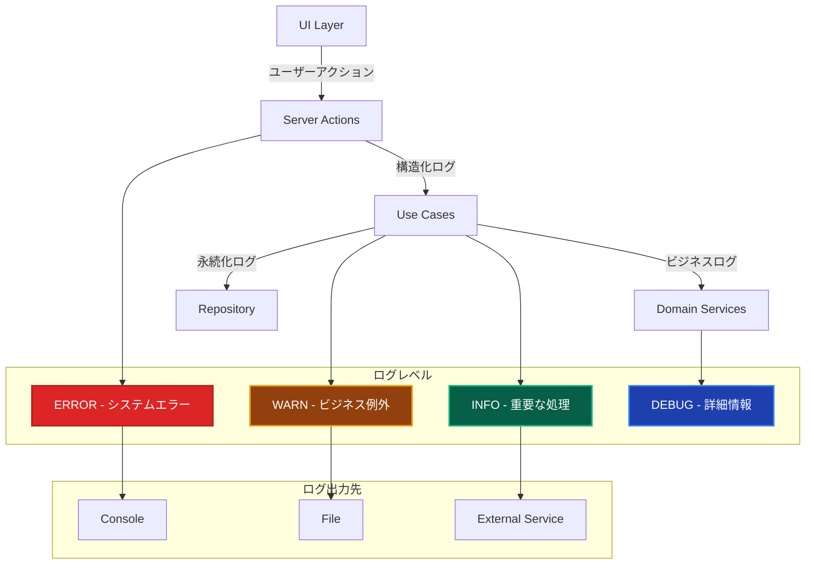

# ロギング戦略実装ガイド 📊

このドキュメントでは、全レイヤーを横断するロギングの実装方針、パターン、ベストプラクティスについて解説します。

---

## ロギングの全体像 🎯



---

## ✅ ログレベル定義

### 1. ERROR - システムエラー 🚨

**予期しないエラー、システム障害**

```typescript
// ✅ ERRORレベルの使用例
export class CreateUserUseCase {
  async execute(request: CreateUserRequest): Promise<CreateUserResponse> {
    try {
      // ... 処理 ...
    } catch (error) {
      if (error instanceof InfrastructureError) {
        this.logger.error('ユーザー作成失敗（インフラエラー）', {
          correlationId: this.correlationId,
          userId: request.email,
          errorCode: error.code,
          errorMessage: error.message,
          originalError: error.originalError?.message,
          stack: error.stack,
          context: error.context
        });
      }
      
      throw error;
    }
  }
}
```

### 2. WARN - ビジネス例外 ⚠️

**ビジネスルール違反、予期される例外**

```typescript
// ✅ WARNレベルの使用例
export class UserDomainService {
  async validateUserUniqueness(email: Email): Promise<void> {
    const existingUser = await this.userRepository.findByEmail(email);
    
    if (existingUser) {
      this.logger.warn('ユーザー重複検出', {
        correlationId: this.correlationId,
        email: email.toString(),
        existingUserId: existingUser.getId().toString(),
        action: 'user_creation_blocked'
      });
      
      throw new DomainError(
        'このメールアドレスは既に使用されています',
        'EMAIL_ALREADY_EXISTS'
      );
    }
  }
}
```

### 3. INFO - 重要な処理 ℹ️

**ビジネス上重要な処理の開始・完了**

```typescript
// ✅ INFOレベルの使用例
export class CreateUserUseCase {
  async execute(request: CreateUserRequest): Promise<CreateUserResponse> {
    this.logger.info('ユーザー作成開始', {
      correlationId: this.correlationId,
      email: request.email,
      name: request.name,
      registrationSource: request.source
    });
    
    try {
      const user = await this.createUser(request);
      
      this.logger.info('ユーザー作成完了', {
        correlationId: this.correlationId,
        userId: user.getId().toString(),
        email: request.email,
        level: user.getLevel(),
        createdAt: new Date().toISOString()
      });
      
      return this.mapToResponse(user);
    } catch (error) {
      // エラーハンドリング...
    }
  }
}
```

### 4. DEBUG - 詳細情報 🔍

**開発・デバッグ用の詳細情報**

```typescript
// ✅ DEBUGレベルの使用例
export class UserFactory {
  static createNewUser(
    email: Email,
    name: string,
    source: RegistrationSource
  ): User {
    const logger = resolve<ILogger>('Logger');
    
    logger.debug('ユーザーファクトリー実行', {
      email: email.toString(),
      name,
      source,
      timestamp: new Date().toISOString()
    });
    
    const user = new User(
      UserId.generate(),
      email,
      name,
      UserLevel.BEGINNER,
      0,
      source,
      new Date()
    );
    
    logger.debug('ユーザーオブジェクト作成完了', {
      userId: user.getId().toString(),
      level: user.getLevel(),
      points: user.getExperiencePoints()
    });
    
    return user;
  }
}
```

---

## 🎯 レイヤー別ロギング戦略

### Presentation Layer（Server Actions） 🎨

```typescript
// ✅ Server Actionsでのロギング
'use server';
export async function createUserAction(formData: FormData): Promise<ActionResult> {
  const correlationId = generateCorrelationId();
  const logger = resolve<ILogger>('Logger');
  
  const userData = {
    name: formData.get('name') as string,
    email: formData.get('email') as string,
  };
  
  logger.info('ユーザー作成アクション開始', {
    correlationId,
    action: 'create_user',
    userAgent: headers().get('user-agent'),
    ip: headers().get('x-forwarded-for'),
    email: userData.email
  });
  
  try {
    const createUserUseCase = resolve('CreateUserUseCase');
    const user = await createUserUseCase.execute({
      ...userData,
      correlationId
    });
    
    logger.info('ユーザー作成アクション成功', {
      correlationId,
      userId: user.id,
      redirectTo: `/users/${user.id}`
    });
    
    revalidatePath('/users');
    redirect(`/users/${user.id}`);
    
  } catch (error) {
    if (error instanceof DomainError) {
      logger.warn('ユーザー作成アクション失敗（ビジネスエラー）', {
        correlationId,
        errorCode: error.code,
        errorMessage: error.message,
        email: userData.email
      });
    } else {
      logger.error('ユーザー作成アクション失敗（システムエラー）', {
        correlationId,
        errorMessage: error.message,
        stack: error.stack,
        email: userData.email
      });
    }
    
    return {
      success: false,
      error: error.message,
      code: error instanceof DomainError ? error.code : 'SYSTEM_ERROR'
    };
  }
}
```

### Application Layer（Use Cases） 📋

```typescript
// ✅ Use Casesでのロギング
export class CreateUserUseCase {
  constructor(
    private userRepository: IUserRepository,
    private userDomainService: UserDomainService,
    private emailService: IEmailService,
    private logger: ILogger
  ) {}
  
  async execute(request: CreateUserRequest): Promise<CreateUserResponse> {
    const startTime = Date.now();
    
    this.logger.info('ユーザー作成ユースケース開始', {
      correlationId: request.correlationId,
      email: request.email,
      name: request.name,
      source: request.source
    });
    
    try {
      // ビジネスルール検証
      this.logger.debug('ユーザー重複チェック開始', {
        correlationId: request.correlationId,
        email: request.email
      });
      
      await this.userDomainService.validateUserUniqueness(
        new Email(request.email)
      );
      
      // ドメインオブジェクト作成
      this.logger.debug('ユーザーオブジェクト作成', {
        correlationId: request.correlationId,
        email: request.email
      });
      
      const user = UserFactory.createNewUser(
        new Email(request.email),
        request.name,
        RegistrationSource.DIRECT
      );
      
      // 永続化
      this.logger.debug('ユーザー永続化開始', {
        correlationId: request.correlationId,
        userId: user.getId().toString()
      });
      
      await this.userRepository.save(user);
      
      // 外部システム連携
      this.logger.debug('ウェルカムメール送信開始', {
        correlationId: request.correlationId,
        userId: user.getId().toString(),
        email: request.email
      });
      
      await this.emailService.sendWelcomeEmail(
        user.getEmail().toString(),
        user.getName()
      );
      
      const duration = Date.now() - startTime;
      
      this.logger.info('ユーザー作成ユースケース完了', {
        correlationId: request.correlationId,
        userId: user.getId().toString(),
        email: request.email,
        duration: `${duration}ms`,
        performance: duration > 1000 ? 'slow' : 'normal'
      });
      
      return this.mapToResponse(user);
      
    } catch (error) {
      const duration = Date.now() - startTime;
      
      if (error instanceof DomainError) {
        this.logger.warn('ユーザー作成ユースケース失敗（ビジネスエラー）', {
          correlationId: request.correlationId,
          email: request.email,
          errorCode: error.code,
          errorMessage: error.message,
          duration: `${duration}ms`
        });
      } else {
        this.logger.error('ユーザー作成ユースケース失敗（システムエラー）', {
          correlationId: request.correlationId,
          email: request.email,
          errorMessage: error.message,
          stack: error.stack,
          duration: `${duration}ms`
        });
      }
      
      throw error;
    }
  }
}
```

### Infrastructure Layer 🔧

```typescript
// ✅ Repository実装でのロギング
export class PrismaUserRepository implements IUserRepository {
  constructor(
    private prisma: PrismaClient,
    private logger: ILogger
  ) {}
  
  async save(user: User): Promise<void> {
    const startTime = Date.now();
    const userId = user.getId().toString();
    
    this.logger.debug('ユーザー保存開始', {
      userId,
      operation: 'save'
    });
    
    try {
      const data = this.toPersistenceObject(user);
      
      await this.prisma.user.upsert({
        where: { id: data.id },
        update: data,
        create: data
      });
      
      const duration = Date.now() - startTime;
      
      this.logger.debug('ユーザー保存完了', {
        userId,
        operation: 'save',
        duration: `${duration}ms`
      });
      
    } catch (error) {
      const duration = Date.now() - startTime;
      
      this.logger.error('ユーザー保存失敗', {
        userId,
        operation: 'save',
        errorMessage: error.message,
        duration: `${duration}ms`
      });
      
      throw new DatabaseError(
        'ユーザー保存',
        error as Error,
        { userId }
      );
    }
  }
}
```

---

## 🔧 ロガー実装

### Logger Interface

```typescript
// ✅ ロガーインターフェース
export interface ILogger {
  error(message: string, context?: LogContext): void;
  warn(message: string, context?: LogContext): void;
  info(message: string, context?: LogContext): void;
  debug(message: string, context?: LogContext): void;
}

export interface LogContext {
  correlationId?: string;
  userId?: string;
  email?: string;
  errorCode?: string;
  duration?: string;
  [key: string]: any;
}
```

### Winston Logger 実装

```typescript
// ✅ Winston実装
import winston from 'winston';

export class WinstonLogger implements ILogger {
  private logger: winston.Logger;
  
  constructor() {
    this.logger = winston.createLogger({
      level: process.env.LOG_LEVEL || 'info',
      format: winston.format.combine(
        winston.format.timestamp(),
        winston.format.errors({ stack: true }),
        winston.format.json()
      ),
      transports: [
        new winston.transports.Console({
          format: winston.format.combine(
            winston.format.colorize(),
            winston.format.simple()
          )
        }),
        new winston.transports.File({
          filename: 'logs/error.log',
          level: 'error'
        }),
        new winston.transports.File({
          filename: 'logs/combined.log'
        })
      ]
    });
  }
  
  error(message: string, context?: LogContext): void {
    this.logger.error(message, {
      ...context,
      timestamp: new Date().toISOString(),
      level: 'ERROR'
    });
  }
  
  warn(message: string, context?: LogContext): void {
    this.logger.warn(message, {
      ...context,
      timestamp: new Date().toISOString(),
      level: 'WARN'
    });
  }
  
  info(message: string, context?: LogContext): void {
    this.logger.info(message, {
      ...context,
      timestamp: new Date().toISOString(),
      level: 'INFO'
    });
  }
  
  debug(message: string, context?: LogContext): void {
    this.logger.debug(message, {
      ...context,
      timestamp: new Date().toISOString(),
      level: 'DEBUG'
    });
  }
}
```

---

## 🎯 ベストプラクティス

### 1. 構造化ログの活用

```typescript
// ✅ 良い例：構造化ログ
this.logger.info('ユーザー作成完了', {
  correlationId: 'req-123',
  userId: 'user-456',
  email: 'user@example.com',
  duration: '250ms',
  action: 'create_user'
});

// ❌ 悪い例：文字列ログ
this.logger.info(`ユーザー作成完了: user-456 (250ms)`);
```

### 2. 相関ID の活用

```typescript
// ✅ 相関IDでリクエストを追跡
export function generateCorrelationId(): string {
  return `req-${Date.now()}-${Math.random().toString(36).substr(2, 9)}`;
}

// 全てのログに相関IDを含める
this.logger.info('処理開始', {
  correlationId: request.correlationId,
  // ... その他のコンテキスト
});
```

### 3. パフォーマンス監視

```typescript
// ✅ 処理時間の記録
const startTime = Date.now();
try {
  // ... 処理 ...
  const duration = Date.now() - startTime;
  
  this.logger.info('処理完了', {
    duration: `${duration}ms`,
    performance: duration > 1000 ? 'slow' : 'normal'
  });
} catch (error) {
  const duration = Date.now() - startTime;
  this.logger.error('処理失敗', {
    duration: `${duration}ms`,
    error: error.message
  });
}
```

---

## 🧪 テストでのロギング

### ログのモック化

```typescript
// ✅ テスト用ロガーモック
export class MockLogger implements ILogger {
  public logs: Array<{ level: string; message: string; context?: LogContext }> = [];
  
  error(message: string, context?: LogContext): void {
    this.logs.push({ level: 'ERROR', message, context });
  }
  
  warn(message: string, context?: LogContext): void {
    this.logs.push({ level: 'WARN', message, context });
  }
  
  info(message: string, context?: LogContext): void {
    this.logs.push({ level: 'INFO', message, context });
  }
  
  debug(message: string, context?: LogContext): void {
    this.logs.push({ level: 'DEBUG', message, context });
  }
  
  getLogsByLevel(level: string) {
    return this.logs.filter(log => log.level === level);
  }
  
  clear() {
    this.logs = [];
  }
}

// ✅ テストでの使用例
describe('CreateUserUseCase', () => {
  let mockLogger: MockLogger;
  
  beforeEach(() => {
    mockLogger = new MockLogger();
  });
  
  it('正常系でINFOログが出力される', async () => {
    // Arrange
    const useCase = new CreateUserUseCase(
      mockUserRepository,
      mockUserDomainService,
      mockEmailService,
      mockLogger
    );
    
    // Act
    await useCase.execute(validRequest);
    
    // Assert
    const infoLogs = mockLogger.getLogsByLevel('INFO');
    expect(infoLogs).toHaveLength(2); // 開始と完了
    expect(infoLogs[0].message).toBe('ユーザー作成ユースケース開始');
    expect(infoLogs[1].message).toBe('ユーザー作成ユースケース完了');
  });
});
```

---

## 📊 ログ分析・監視

### ログ集約の例

```typescript
// ✅ ログ集約用のメタデータ
export interface LogMetadata {
  service: string;
  version: string;
  environment: string;
  correlationId: string;
  userId?: string;
  sessionId?: string;
  requestId?: string;
}

export class EnhancedLogger implements ILogger {
  constructor(
    private baseLogger: ILogger,
    private metadata: LogMetadata
  ) {}
  
  private enrichContext(context?: LogContext): LogContext {
    return {
      ...this.metadata,
      ...context,
      timestamp: new Date().toISOString()
    };
  }
  
  error(message: string, context?: LogContext): void {
    this.baseLogger.error(message, this.enrichContext(context));
  }
  
  // ... 他のメソッドも同様
}
```

---

## 関連ドキュメント 📚

- [エラーハンドリング](./error-handling.md) - エラーログの出力戦略
- [Application Layer ガイド](../layers/application-layer.md) - Use Caseでのロギング実装
- [Infrastructure Layer ガイド](../layers/infrastructure-layer.md) - Repository層でのロギング
- [テスト戦略](../../../testing-strategy.md) - ログのテスト方法
- [依存性注入](../../../dependency-injection.md) - ロガーのDI設定
