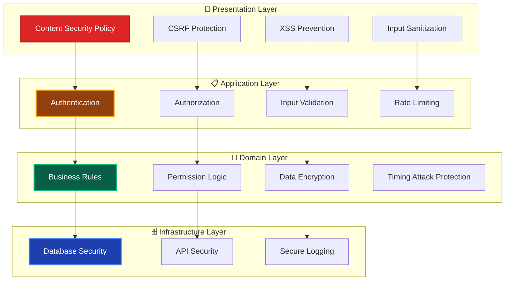

# セキュリティ実装ガイド 🔐

このドキュメントでは、全レイヤーを横断するセキュリティの実装方針、パターン、ベストプラクティスについて解説します。

---

## セキュリティの全体像 🎯



---

## ✅ レイヤー別セキュリティ実装

### Presentation Layer（UI・Server Actions） 🎨

#### 1. CSRF Protection

```typescript
// ✅ Server Actionsでの自動CSRF保護
'use server';

// ✅ カスタムCSRFトークン（必要に応じて）
import { generateCSRFToken, validateCSRFToken } from '@/lib/csrf';

export async function updateUserAction(
 formData: FormData,
): Promise<ActionResult> {
 // Next.js Server Actionsは自動的にCSRF保護が有効

 const session = await getServerSession(authOptions);
 if (!session?.user) {
  return {
   success: false,
   error: '認証が必要です',
   code: 'UNAUTHORIZED',
  };
 }

 // ... 処理
}

export async function sensitiveAction(
 formData: FormData,
 csrfToken: string,
): Promise<ActionResult> {
 if (!validateCSRFToken(csrfToken)) {
  return {
   success: false,
   error: 'Invalid CSRF token',
   code: 'CSRF_ERROR',
  };
 }

 // ... 処理
}
```

#### 2. XSS Prevention

```typescript
// ✅ 入力値のサニタイゼーション
import DOMPurify from 'isomorphic-dompurify';

export function sanitizeHtml(input: string): string {
  return DOMPurify.sanitize(input, {
    ALLOWED_TAGS: ['p', 'br', 'strong', 'em'],
    ALLOWED_ATTR: []
  });
}

// ✅ React での安全な表示
export function UserContent({ content }: { content: string }) {
  const sanitizedContent = sanitizeHtml(content);

  return (
    <div
      dangerouslySetInnerHTML={{ __html: sanitizedContent }}
      className="user-content"
    />
  );
}

// ✅ テンプレートリテラルでの安全な文字列構築
export function createNotification(userName: string, action: string): string {
  // HTMLエスケープを確実に行う
  const escapedUserName = escapeHtml(userName);
  const escapedAction = escapeHtml(action);

  return `${escapedUserName}さんが${escapedAction}しました`;
}
```

#### 3. Content Security Policy

```typescript
// ✅ next.config.js でのCSP設定
const nextConfig = {
 async headers() {
  return [
   {
    source: '/(.*)',
    headers: [
     {
      key: 'Content-Security-Policy',
      value: [
       "default-src 'self'",
       "script-src 'self' 'unsafe-inline' 'unsafe-eval'", // 開発時のみ
       "style-src 'self' 'unsafe-inline'",
       "img-src 'self' data: https:",
       "font-src 'self'",
       "connect-src 'self'",
       "frame-ancestors 'none'",
      ].join('; '),
     },
     {
      key: 'X-Frame-Options',
      value: 'DENY',
     },
     {
      key: 'X-Content-Type-Options',
      value: 'nosniff',
     },
    ],
   },
  ];
 },
};
```

---

### Application Layer（Use Cases） 📋

#### 1. 認証・認可

```typescript
// ✅ 認証チェック付きUse Case
export class UpdateUserProfileUseCase {
 async execute(
  request: UpdateUserProfileRequest,
  currentUserId: string,
 ): Promise<UpdateUserProfileResponse> {
  // 認証チェック
  if (!currentUserId) {
   throw new SecurityError('認証が必要です', 'AUTHENTICATION_REQUIRED');
  }

  // 認可チェック
  if (request.targetUserId !== currentUserId) {
   const hasPermission = await this.permissionService.canUpdateUser(
    currentUserId,
    request.targetUserId,
   );

   if (!hasPermission) {
    throw new SecurityError(
     'このユーザーを更新する権限がありません',
     'AUTHORIZATION_FAILED',
    );
   }
  }

  // 入力値検証
  const validatedRequest = await this.validateRequest(request);

  // ... ビジネスロジック実行
 }

 private async validateRequest(
  request: UpdateUserProfileRequest,
 ): Promise<UpdateUserProfileRequest> {
  // SQLインジェクション対策
  if (this.containsSqlInjection(request.bio)) {
   throw new DomainError(
    '不正な文字が含まれています',
    'VALIDATION_INVALID_INPUT',
    { field: 'bio', value: request.bio },
   );
  }

  // XSS対策
  return {
   ...request,
   bio: sanitizeHtml(request.bio),
   name: escapeHtml(request.name),
  };
 }
}
```

#### 2. Rate Limiting

```typescript
// ✅ レート制限の実装
export class RateLimitService {
 private redis: Redis;

 async checkRateLimit(
  key: string,
  limit: number,
  windowMs: number,
 ): Promise<boolean> {
  const current = await this.redis.incr(key);

  if (current === 1) {
   await this.redis.expire(key, Math.ceil(windowMs / 1000));
  }

  return current <= limit;
 }
}

// ✅ Use Caseでの使用
export class CreateUserUseCase {
 async execute(request: CreateUserRequest): Promise<CreateUserResponse> {
  const rateLimitKey = `create_user:${request.ip}`;

  const allowed = await this.rateLimitService.checkRateLimit(
   rateLimitKey,
   5, // 5回まで
   60 * 1000, // 1分間
  );

  if (!allowed) {
   throw new SecurityError(
    'リクエストが多すぎます。しばらく時間をおいて再度お試しください',
    'RATE_LIMIT_EXCEEDED',
   );
  }

  // ... 処理続行
 }
}
```

---

### Domain Layer 🧠

#### 1. ビジネスルールベースの認可

```typescript
// ✅ ドメインレベルでの権限チェック
export class User {
 canEditPost(post: Post): boolean {
  // 投稿者本人または管理者のみ編集可能
  return post.authorId.equals(this.id) || this.hasRole(UserRole.ADMIN);
 }

 canViewPrivateProfile(targetUser: User): boolean {
  // 本人、友達、または管理者のみ閲覧可能
  return (
   this.id.equals(targetUser.id) ||
   this.isFriendWith(targetUser) ||
   this.hasRole(UserRole.ADMIN)
  );
 }

 canPromoteUser(targetUser: User): boolean {
  // 管理者のみ、かつ自分より下位レベルのユーザーのみ昇格可能
  return (
   this.hasRole(UserRole.ADMIN) && this.level > targetUser.level
  );
 }
}

// ✅ 権限チェック付きドメインサービス
export class PostDomainService {
 async updatePost(
  post: Post,
  updates: PostUpdates,
  currentUser: User,
 ): Promise<void> {
  if (!currentUser.canEditPost(post)) {
   throw new DomainError(
    'この投稿を編集する権限がありません',
    'POST_EDIT_FORBIDDEN',
   );
  }

  // 管理者以外は公開状態を変更できない
  if (updates.isPublic !== undefined && !currentUser.hasRole(UserRole.ADMIN)) {
   throw new DomainError(
    '公開状態を変更する権限がありません',
    'POST_VISIBILITY_CHANGE_FORBIDDEN',
   );
  }

  post.update(updates);
 }
}
```

#### 2. データ暗号化

```typescript
// ✅ 機密データの暗号化
export class PersonalInfo {
 constructor(
  private encryptedPhoneNumber: string,
  private encryptedAddress: string,
  private encryptionService: IEncryptionService,
 ) {}

 getPhoneNumber(): string {
  return this.encryptionService.decrypt(this.encryptedPhoneNumber);
 }

 getAddress(): string {
  return this.encryptionService.decrypt(this.encryptedAddress);
 }

 static create(
  phoneNumber: string,
  address: string,
  encryptionService: IEncryptionService,
 ): PersonalInfo {
  return new PersonalInfo(
   encryptionService.encrypt(phoneNumber),
   encryptionService.encrypt(address),
   encryptionService,
  );
 }
}

// ✅ パスワードハッシュ化
export class Password {
 constructor(private hashedValue: string) {}

 static async create(plainPassword: string): Promise<Password> {
  // パスワード強度チェック
  if (!this.isStrongPassword(plainPassword)) {
   throw new DomainError(
    'パスワードは8文字以上で、大文字・小文字・数字・記号を含む必要があります',
    'PASSWORD_TOO_WEAK',
    { field: 'password' },
   );
  }

  const hashedValue = await bcrypt.hash(plainPassword, 12);
  return new Password(hashedValue);
 }

 async verify(plainPassword: string): Promise<boolean> {
  return bcrypt.compare(plainPassword, this.hashedValue);
 }

 private static isStrongPassword(password: string): boolean {
  const minLength = 8;
  const hasUpperCase = /[A-Z]/.test(password);
  const hasLowerCase = /[a-z]/.test(password);
  const hasNumbers = /\d/.test(password);
  const hasSpecialChar = /[!@#$%^&*(),.?":{}|<>]/.test(password);

  return (
   password.length >= minLength &&
   hasUpperCase &&
   hasLowerCase &&
   hasNumbers &&
   hasSpecialChar
  );
 }
}
```

#### 3. タイミング攻撃対策 ⏱️

タイミング攻撃は、処理時間の差異から機密情報を推測する攻撃手法です。認証やトークン比較で特に重要です。

```typescript
import { timingSafeEqual } from 'node:crypto';

// ✅ 定数時間文字列比較（タイミング攻撃対策）
export function timingSafeCompare(a: string, b: string): boolean {
 // 長さが異なる場合も定数時間で比較
 const aBuffer = Buffer.from(a, 'utf-8');
 const bBuffer = Buffer.from(b, 'utf-8');

 // 長さを揃えるためのパディング
 const maxLength = Math.max(aBuffer.length, bBuffer.length);
 const aPadded = Buffer.alloc(maxLength, 0);
 const bPadded = Buffer.alloc(maxLength, 0);

 aBuffer.copy(aPadded);
 bBuffer.copy(bPadded);

 // 長さチェックも定数時間で
 const lengthMatch = aBuffer.length === bBuffer.length;

 // timingSafeEqual は同じ長さのバッファのみ比較可能
 return timingSafeEqual(aPadded, bPadded) && lengthMatch;
}

// ✅ トークン検証（タイミング攻撃対策済み）
export class SessionService {
 async validateSessionToken(providedToken: string): Promise<boolean> {
  const session = await this.findByTokenPrefix(providedToken);

  if (!session) {
   // ユーザーが存在しない場合でも同じ処理時間を確保
   await this.dummyCompare();
   return false;
  }

  // 定数時間でトークン比較
  return timingSafeCompare(providedToken, session.token);
 }

 // ダミー比較でタイミング差を隠蔽
 private async dummyCompare(): Promise<void> {
  const dummy = 'x'.repeat(64);
  timingSafeCompare(dummy, dummy);
 }
}

// ✅ パスワード検証（bcryptは内部で定数時間比較）
export class AuthService {
 async verifyPassword(
  plainPassword: string,
  hashedPassword: string,
 ): Promise<boolean> {
  // bcrypt.compare は定数時間比較を内部で実装済み
  // ただし、ユーザーが存在しない場合のダミーハッシュ比較が必要

  if (!hashedPassword) {
   // ユーザー不存在時もダミーハッシュと比較して処理時間を統一
   const dummyHash = await bcrypt.hash('dummy', 12);
   await bcrypt.compare(plainPassword, dummyHash);
   return false;
  }

  return bcrypt.compare(plainPassword, hashedPassword);
 }
}

// ✅ ログイン処理（ユーザー列挙攻撃対策）
export class SignInUseCase {
 async execute(request: SignInRequest): Promise<Result<SignInResponse>> {
  const startTime = Date.now();

  const user = await this.userRepository.findByEmail(
   new Email(request.email),
  );

  // ユーザーが存在しなくても同じエラーメッセージ
  // かつ同じ処理時間になるよう制御
  let isValid = false;

  if (user) {
   isValid = await this.authService.verifyPassword(
    request.password,
    user.passwordHash,
   );
  } else {
   // ダミーのパスワード検証で処理時間を統一
   await this.authService.verifyPassword(request.password, '');
  }

  // 処理時間を一定に（最低500ms）
  const elapsed = Date.now() - startTime;
  if (elapsed < 500) {
   await this.sleep(500 - elapsed);
  }

  if (!isValid) {
   // ユーザー存在有無を漏らさないエラーメッセージ
   return failure(
    'メールアドレスまたはパスワードが正しくありません',
    'INVALID_CREDENTIALS',
   );
  }

  // 認証成功処理...
  return success(response);
 }

 private sleep(ms: number): Promise<void> {
  return new Promise((resolve) => setTimeout(resolve, ms));
 }
}
```

**タイミング攻撃対策のポイント:**

| 対策項目 | 説明 |
| --- | --- |
| **定数時間比較** | `crypto.timingSafeEqual` を使用して文字列比較 |
| **ダミー処理** | ユーザー不存在時もダミー処理で時間を統一 |
| **最小処理時間** | 認証処理に最低処理時間を設定 |
| **統一エラー** | 失敗原因を特定できない汎用エラーメッセージ |

---

### Infrastructure Layer 🔧

#### 1. データベースセキュリティ

```typescript
// ✅ SQLインジェクション対策（Prisma使用）
export class PrismaUserRepository implements IUserRepository {
 async findByEmail(email: Email): Promise<User | null> {
  // Prismaは自動的にSQLインジェクション対策済み
  const userData = await this.prisma.user.findUnique({
   where: {
    email: email.value, // パラメータ化クエリが自動生成される
   },
  });

  return userData ? this.toDomainObject(userData) : null;
 }

 async searchUsers(query: string): Promise<User[]> {
  // 検索クエリのサニタイゼーション
  const sanitizedQuery = query
   .replace(/[%_]/g, '\\$&') // LIKE演算子のエスケープ
   .substring(0, 100); // 長さ制限

  const users = await this.prisma.user.findMany({
   where: {
    OR: [
     { name: { contains: sanitizedQuery, mode: 'insensitive' } },
     { email: { contains: sanitizedQuery, mode: 'insensitive' } },
    ],
   },
   take: 50, // 結果数制限
  });

  return users.map((user) => this.toDomainObject(user));
 }
}
```

#### 2. API セキュリティ

```typescript
// ✅ 外部API呼び出しのセキュリティ
export class ExternalApiService {
 private readonly apiKey: string;
 private readonly baseUrl: string;

 constructor() {
  this.apiKey = process.env.EXTERNAL_API_KEY!;
  this.baseUrl = process.env.EXTERNAL_API_BASE_URL!;

  if (!this.apiKey || !this.baseUrl) {
   throw new Error('External API credentials not configured');
  }
 }

 async callApi(endpoint: string, data: any): Promise<any> {
  // URL検証
  if (!this.isValidEndpoint(endpoint)) {
   throw new SecurityError('不正なエンドポイントです', 'INVALID_ENDPOINT');
  }

  // リクエストサイズ制限
  const requestSize = JSON.stringify(data).length;
  if (requestSize > 1024 * 1024) {
   // 1MB制限
   throw new SecurityError(
    'リクエストサイズが大きすぎます',
    'REQUEST_TOO_LARGE',
   );
  }

  try {
   const response = await fetch(`${this.baseUrl}${endpoint}`, {
    method: 'POST',
    headers: {
     Authorization: `Bearer ${this.apiKey}`,
     'Content-Type': 'application/json',
     'User-Agent': 'MyApp/1.0',
    },
    body: JSON.stringify(data),
    timeout: 10000, // 10秒タイムアウト
   });

   if (!response.ok) {
    throw new ExternalApiError('External API', response.status);
   }

   return response.json();
  } catch (error) {
   this.logger.error('External API call failed', {
    endpoint,
    error: error.message,
    // APIキーは絶対にログに出力しない
   });

   throw error;
  }
 }

 private isValidEndpoint(endpoint: string): boolean {
  // 許可されたエンドポイントのホワイトリスト
  const allowedEndpoints = ['/users', '/posts', '/notifications'];

  return allowedEndpoints.some((allowed) => endpoint.startsWith(allowed));
 }
}
```

#### 3. セキュアログ

```typescript
// ✅ 機密情報を含まないログ出力
export class SecureLogger implements ILogger {
 private sensitiveFields = [
  'password',
  'token',
  'apiKey',
  'secret',
  'creditCard',
  'ssn',
 ];

 info(message: string, context?: LogContext): void {
  const sanitizedContext = this.sanitizeContext(context);
  this.baseLogger.info(message, sanitizedContext);
 }

 error(message: string, context?: LogContext): void {
  const sanitizedContext = this.sanitizeContext(context);
  this.baseLogger.error(message, sanitizedContext);
 }

 private sanitizeContext(context?: LogContext): LogContext {
  if (!context) return {};

  const sanitized = { ...context };

  // 機密フィールドをマスク
  for (const field of this.sensitiveFields) {
   if (sanitized[field]) {
    sanitized[field] = '***REDACTED***';
   }
  }

  // ネストしたオブジェクトも処理
  for (const key in sanitized) {
   if (typeof sanitized[key] === 'object' && sanitized[key] !== null) {
    sanitized[key] = this.sanitizeObject(sanitized[key]);
   }
  }

  return sanitized;
 }

 private sanitizeObject(obj: any): any {
  const sanitized = { ...obj };

  for (const field of this.sensitiveFields) {
   if (sanitized[field]) {
    sanitized[field] = '***REDACTED***';
   }
  }

  return sanitized;
 }
}
```

---

## 🧪 セキュリティテスト

### 1. 認証・認可テスト

```typescript
// ✅ 認証テスト
describe('UpdateUserProfileUseCase', () => {
 it('未認証ユーザーはエラーになる', async () => {
  // Arrange
  const useCase = new UpdateUserProfileUseCase(
   mockUserRepository,
   mockPermissionService,
  );

  // Act & Assert
  await expect(useCase.execute(validRequest, null)).rejects.toThrow(
   SecurityError,
  );

  await expect(useCase.execute(validRequest, null)).rejects.toThrow(
   '認証が必要です',
  );
 });

 it('他人のプロフィールは更新できない', async () => {
  // Arrange
  const useCase = new UpdateUserProfileUseCase(
   mockUserRepository,
   mockPermissionService,
  );

  mockPermissionService.canUpdateUser.mockResolvedValue(false);

  // Act & Assert
  await expect(
   useCase.execute(
    {
     targetUserId: 'other-user-id',
     name: 'New Name',
    },
    'current-user-id',
   ),
  ).rejects.toThrow(SecurityError);
 });
});
```

### 2. 入力値検証テスト

```typescript
// ✅ XSS対策テスト
describe('sanitizeHtml', () => {
 it('スクリプトタグが除去される', () => {
  // Arrange
  const maliciousInput = '<script>alert("XSS")</script><p>正常なテキスト</p>';

  // Act
  const result = sanitizeHtml(maliciousInput);

  // Assert
  expect(result).toBe('<p>正常なテキスト</p>');
  expect(result).not.toContain('<script>');
 });

 it('イベントハンドラーが除去される', () => {
  // Arrange
  const maliciousInput = '<p onclick="alert(\'XSS\')">テキスト</p>';

  // Act
  const result = sanitizeHtml(maliciousInput);

  // Assert
  expect(result).toBe('<p>テキスト</p>');
  expect(result).not.toContain('onclick');
 });
});
```

---

## 🎯 セキュリティチェックリスト

### 開発時チェック項目

- [ ] **認証**: 全ての保護されたエンドポイントで認証チェック実装
- [ ] **認可**: ビジネスルールに基づく適切な権限チェック
- [ ] **入力検証**: 全ての入力値に対するバリデーション・サニタイゼーション
- [ ] **出力エスケープ**: HTMLエスケープ・SQLパラメータ化の実装
- [ ] **CSRF対策**: Server Actionsでの適切なCSRF保護
- [ ] **XSS対策**: Content Security Policy設定とサニタイゼーション
- [ ] **レート制限**: API呼び出し頻度の制限実装
- [ ] **タイミング攻撃対策**: 定数時間比較・ダミー処理・最小処理時間の実装
- [ ] **ユーザー列挙対策**: 認証失敗時の統一エラーメッセージ
- [ ] **ログセキュリティ**: 機密情報のログ出力防止
- [ ] **暗号化**: 機密データの適切な暗号化
- [ ] **エラーハンドリング**: 情報漏洩を防ぐエラーメッセージ

### デプロイ前チェック項目

- [ ] **環境変数**: 本番環境での機密情報の適切な管理
- [ ] **HTTPS**: 全通信のHTTPS化
- [ ] **セキュリティヘッダー**: CSP、HSTS等の設定
- [ ] **依存関係**: 脆弱性のあるパッケージの更新
- [ ] **ログ監視**: セキュリティイベントの監視設定

---

## 関連ドキュメント 📚

- [エラーハンドリング](./error-handling.md) - セキュリティエラーの適切な処理
- [ロギング戦略](./logging-strategy.md) - セキュアなログ出力
- [Application Layer ガイド](../layers/application-layer.md) - 認証・認可の実装
- [Domain Layer ガイド](../layers/domain-layer.md) - ビジネスルールベースの権限制御
- [テスト戦略](../../../testing/strategy.md) - セキュリティテストの実装
