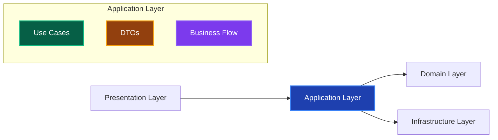

# Application Layer 実装ガイド 📋

このドキュメントでは、Application Layer（アプリケーション層）での実装ルール、許可される処理、禁止される処理について詳しく解説します。

---

## Application Layer の責務 🎯

### 基本的な役割



**Application Layerの責務：**

1. **ビジネスフローの制御** - 複数のDomain Serviceの組み合わせ
2. **トランザクション管理** - データ整合性の確保
3. **外部システム連携の制御** - Infrastructure Layerの活用
4. **データ変換** - Presentation ↔ Domain 間のDTO変換
5. **認可・権限チェック** - ユーザー権限の検証

---

## ✅ 書いて良いもの（許可される処理）

### 1. Use Case実装 🎬

**ビジネスフローの制御**

```typescript
// ✅ 許可：Use Case実装
export class CreateUserUseCase {
  constructor(
    private userRepository: IUserRepository,
    private userDomainService: UserDomainService,
    private emailService: IEmailService,
    private logger: ILogger
  ) {}
  
  async execute(request: CreateUserRequest): Promise<CreateUserResponse> {
    this.logger.info('ユーザー作成開始', { email: request.email });
    
    try {
      // 1. ドメインサービスでビジネスルール検証
      await this.userDomainService.validateUserData(request.name, request.email);
      
      // 2. Repository使用（実装詳細はInfrastructure Layerを参照）
      const existingUser = await this.userRepository.findByEmail(request.email);
      if (existingUser) {
        throw new DomainError('このメールアドレスは既に使用されています', 'EMAIL_ALREADY_EXISTS');
      }
      
      // 3. ドメインオブジェクト作成
      const user = User.create(
        generateUserId(),
        new Email(request.email),
        request.name
      );
      
      // 4. 永続化
      await this.userRepository.save(user);
      
      // 5. 外部サービス連携（実装詳細はInfrastructure Layerを参照）
      await this.emailService.sendWelcomeEmail(
        user.getEmail().toString(),
        user.getName()
      );
      
      this.logger.info('ユーザー作成完了', { userId: user.getId().toString() });
      
      // 6. レスポンス変換
      return {
        id: user.getId().toString(),
        name: user.getName(),
        email: user.getEmail().toString(),
        level: user.getLevel(),
        createdAt: user.getCreatedAt()
      };
      
    } catch (error) {
      this.logger.error('ユーザー作成失敗', { email: request.email, error: error.message });
      throw error;
    }
  }
}
```

**なぜ許可されるのか：**

- ビジネスフローの制御はApplication Layerの責務
- 複数のDomain Serviceを組み合わせる処理
- トランザクション境界の管理

### 2. DTO（Data Transfer Object）定義 📦

**レイヤー間のデータ変換**

```typescript
// ✅ 許可：Request/Response DTO
export interface CreateUserRequest {
  name: string;
  email: string;
  password: string;
}

export interface CreateUserResponse {
  id: string;
  name: string;
  email: string;
  level: number;
  createdAt: Date;
}

export interface GetUsersRequest {
  page?: number;
  limit?: number;
  searchQuery?: string;
  sortBy?: 'name' | 'createdAt' | 'level';
  sortOrder?: 'asc' | 'desc';
}

export interface GetUsersResponse {
  users: UserSummary[];
  totalCount: number;
  currentPage: number;
  totalPages: number;
}

export interface UserSummary {
  id: string;
  name: string;
  email: string;
  level: number;
  lastLoginAt?: Date;
}
```

**なぜ許可されるのか：**

- レイヤー間の結合度を下げる
- Presentation Layerが Domain Layer に直接依存することを防ぐ
- APIの安定性を確保

### 3. トランザクション管理 🔄

**データ整合性の確保**

```typescript
// ✅ 許可：トランザクション管理
export class TransferUserPointsUseCase {
  constructor(
    private userRepository: IUserRepository,
    private pointTransactionRepository: IPointTransactionRepository,
    private userDomainService: UserDomainService,
    private databaseFactory: IDatabaseFactory
  ) {}
  
  async execute(request: TransferPointsRequest): Promise<void> {
    // トランザクション開始
    const transaction = await this.databaseFactory.beginTransaction();
    
    try {
      // 1. 送信者・受信者の取得
      const sender = await this.userRepository.findById(request.senderId, transaction);
      const receiver = await this.userRepository.findById(request.receiverId, transaction);
      
      if (!sender || !receiver) {
        throw new DomainError('ユーザーが見つかりません', 'USER_NOT_FOUND');
      }
      
      // 2. ビジネスルール検証（Domain Serviceに委譲）
      this.userDomainService.validatePointTransfer(sender, receiver, request.points);
      
      // 3. ドメインオブジェクトでビジネスロジック実行
      sender.subtractPoints(request.points);
      receiver.addPoints(request.points);
      
      // 4. 永続化（同一トランザクション内）
      await this.userRepository.save(sender, transaction);
      await this.userRepository.save(receiver, transaction);
      
      // 5. 取引履歴記録
      const pointTransaction = new PointTransaction(
        request.senderId,
        request.receiverId,
        request.points,
        new Date()
      );
      await this.pointTransactionRepository.save(pointTransaction, transaction);
      
      // トランザクションコミット
      await transaction.commit();
      
    } catch (error) {
      // トランザクションロールバック
      await transaction.rollback();
      throw error;
    }
  }
}
```

**トランザクション管理のベストプラクティス：**

1. **トランザクション境界の明確化** - Use Case単位でトランザクションを管理
2. **適切なロールバック** - エラー時の確実なデータ整合性確保
3. **Repository連携** - 同一トランザクション内での複数Repository操作
4. **Domain Service活用** - ビジネスルール検証の委譲

### 4. 認可・権限チェック 🔐

**ユーザー権限の検証**

```typescript
// ✅ 許可：認可処理
export class DeleteUserUseCase {
  constructor(
    private userRepository: IUserRepository,
    private authService: IAuthService,
    private logger: ILogger
  ) {}
  
  async execute(request: DeleteUserRequest, currentUserId: string): Promise<void> {
    // 1. 認証チェック
    const currentUser = await this.userRepository.findById(currentUserId);
    if (!currentUser) {
      throw new DomainError('認証が必要です', 'AUTHENTICATION_REQUIRED');
    }
    
    // 2. 権限チェック
    const hasPermission = await this.authService.hasPermission(
      currentUserId, 
      'DELETE_USER'
    );
    
    if (!hasPermission && currentUserId !== request.targetUserId) {
      throw new DomainError('この操作を実行する権限がありません', 'INSUFFICIENT_PERMISSION');
    }
    
    // 3. 対象ユーザーの取得・削除
    const targetUser = await this.userRepository.findById(request.targetUserId);
    if (!targetUser) {
      throw new DomainError('対象ユーザーが見つかりません', 'USER_NOT_FOUND');
    }
    
    // 4. ビジネスルール検証（Domain Serviceに委譲）
    const canDelete = targetUser.canBeDeleted();
    if (!canDelete) {
      throw new DomainError('このユーザーは削除できません', 'USER_CANNOT_BE_DELETED');
    }
    
    // 5. 削除実行
    await this.userRepository.delete(request.targetUserId);
    
    this.logger.info('ユーザー削除完了', { 
      targetUserId: request.targetUserId,
      deletedBy: currentUserId 
    });
  }
}
```

### 5. 複数レイヤー間の調整 🎭

**Domain Service + Repository + 外部サービスの組み合わせ**

```typescript
// ✅ 許可：複数レイヤー間調整
export class PromoteUserUseCase {
  constructor(
    private userRepository: IUserRepository,
    private userDomainService: UserDomainService,
    private notificationService: INotificationService,
    private logger: ILogger
  ) {}
  
  async execute(userId: string): Promise<PromoteUserResponse> {
    // 1. ユーザー取得
    const user = await this.userRepository.findById(userId);
    if (!user) {
      throw new DomainError('ユーザーが見つかりません', 'USER_NOT_FOUND');
    }
    
    // 2. 昇格可能性チェック（Domain Serviceに委譲）
    const canPromote = this.userDomainService.canPromoteUser(user);
    if (!canPromote) {
      throw new DomainError('昇格条件を満たしていません', 'PROMOTION_NOT_ALLOWED');
    }
    
    // 3. ドメインオブジェクトで昇格実行
    const oldLevel = user.getLevel();
    user.promote();
    const newLevel = user.getLevel();
    
    // 4. 永続化
    await this.userRepository.save(user);
    
    // 5. 通知送信（外部サービス）
    await this.notificationService.sendPromotionNotification(
      user.getEmail().toString(),
      user.getName(),
      newLevel
    );
    
    this.logger.info('ユーザー昇格完了', { 
      userId,
      oldLevel,
      newLevel 
    });
    
    return {
      userId: user.getId().toString(),
      newLevel,
      promotedAt: new Date()
    };
  }
}
```

---

## ❌ 書いてはダメなもの（禁止される処理）

### 1. ビジネスロジック 🚫

```typescript
// ❌ 禁止：ビジネスロジックの実装
export class CreateUserUseCase {
  async execute(request: CreateUserRequest): Promise<CreateUserResponse> {
    // ❌ ビジネスルール判定はDomain Layerの責務
    if (request.name.length < 2) {
      throw new Error('名前は2文字以上必要です');
    }
    
    // ❌ 経験値計算ロジックはDomain Layerの責務
    const initialExp = request.isVip ? 100 : 0;
    
    const user = new User(/* ... */);
    await this.userRepository.save(user);
  }
}

// ✅ 正しい実装：Domain Layerに委譲
export class CreateUserUseCase {
  async execute(request: CreateUserRequest): Promise<CreateUserResponse> {
    // Domain Layerのファクトリーメソッドを使用
    const user = User.create(
      generateUserId(),
      new Email(request.email), // Value Objectでバリデーション
      request.name // Entityでバリデーション
    );
    
    await this.userRepository.save(user);
  }
}
```

### 2. データベース・技術的詳細 💾

```typescript
// ❌ 禁止：技術的実装詳細
export class GetUsersUseCase {
  async execute(request: GetUsersRequest): Promise<GetUsersResponse> {
    // ❌ SQLクエリの直接記述
    const users = await this.prisma.$queryRaw`
      SELECT * FROM users 
      WHERE name ILIKE ${`%${request.searchQuery}%`}
      ORDER BY created_at DESC
    `;
    
    return { users };
  }
}

// ✅ 正しい実装：Repositoryに委譲
export class GetUsersUseCase {
  async execute(request: GetUsersRequest): Promise<GetUsersResponse> {
    const criteria = new UserSearchCriteria(
      request.searchQuery,
      request.page,
      request.limit,
      request.sortBy,
      request.sortOrder
    );
    
    const users = await this.userRepository.findByCriteria(criteria);
    
    return {
      users: users.map(user => ({
        id: user.getId().toString(),
        name: user.getName(),
        email: user.getEmail().toString(),
        level: user.getLevel(),
        lastLoginAt: user.getLastLoginAt()
      }))
    };
  }
}
```

### 3. UI・プレゼンテーション処理 🎨

```typescript
// ❌ 禁止：UI関連処理
export class GetUserProfileUseCase {
  async execute(userId: string): Promise<UserProfileResponse> {
    const user = await this.userRepository.findById(userId);
    
    // ❌ 表示フォーマットはPresentation Layerの責務
    const displayName = user.getName().length > 20 
      ? user.getName().substring(0, 20) + '...' 
      : user.getName();
    
    const levelBadge = user.getLevel() >= 10 ? '🏆' : '⭐';
    
    return {
      displayName,
      levelBadge,
      formattedJoinDate: user.getCreatedAt().toLocaleDateString('ja-JP')
    };
  }
}

// ✅ 正しい実装：生データのみ返却
export class GetUserProfileUseCase {
  async execute(userId: string): Promise<UserProfileResponse> {
    const user = await this.userRepository.findById(userId);
    
    return {
      id: user.getId().toString(),
      name: user.getName(),
      email: user.getEmail().toString(),
      level: user.getLevel(),
      experiencePoints: user.getExperiencePoints(),
      createdAt: user.getCreatedAt(),
      lastLoginAt: user.getLastLoginAt()
    };
  }
}
```

---

## 🎯 実装パターン

### 複雑なビジネスフロー管理

```typescript
// ✅ 適切なビジネスフロー制御
export class ProcessOrderUseCase {
  constructor(
    private orderRepository: IOrderRepository,
    private userRepository: IUserRepository,
    private inventoryService: IInventoryService,
    private paymentService: IPaymentService,
    private emailService: IEmailService,
    private databaseFactory: IDatabaseFactory
  ) {}
  
  async execute(request: ProcessOrderRequest): Promise<ProcessOrderResponse> {
    const transaction = await this.databaseFactory.beginTransaction();
    
    try {
      // 1. ユーザー情報取得・検証
      const user = await this.userRepository.findById(request.userId, transaction);
      if (!user) {
        throw new DomainError('ユーザーが見つかりません', 'USER_NOT_FOUND');
      }
      
      // 2. 在庫確認（外部サービス連携）
      const products = await this.inventoryService.checkAvailability(
        request.items, 
        transaction
      );
      
      // 3. 注文ドメインオブジェクト作成
      const order = Order.create(
        generateOrderId(),
        user.getId(),
        products,
        new Date()
      );
      
      // 4. 在庫予約
      await this.inventoryService.reserveProducts(products, transaction);
      
      // 5. 注文保存
      await this.orderRepository.save(order, transaction);
      
      // 6. 決済処理
      const payment = await this.paymentService.processPayment(
        order.getTotalAmount(),
        request.paymentMethod,
        transaction
      );
      
      await this.paymentRepository.save(payment, transaction);
      
      // 7. トランザクションコミット
      await transaction.commit();
      
      // 8. 確認メール送信（トランザクション外）
      await this.emailService.sendOrderConfirmation(order);
      
      return {
        orderId: order.getId().toString(),
        totalAmount: order.getTotalAmount(),
        status: order.getStatus(),
        estimatedDeliveryDate: order.getEstimatedDeliveryDate()
      };
      
    } catch (error) {
      await transaction.rollback();
      throw error;
    }
  }
}
```

---

## 📚 関連リンク

### レイヤー間連携

- **[Domain Layer ガイド](./domain-layer.md)** - ビジネスロジック実装の詳細
- **[Infrastructure Layer ガイド](./infrastructure-layer.md)** - Repository実装、外部サービス実装の詳細
- **[Presentation Layer ガイド](./presentation-layer.md)** - Server Actions、UI処理の詳細

### 詳細実装ガイド

- **[Use Cases](./components/use-cases.md)** - UseCaseの詳細実装パターン

---

## 💡 まとめ

**Application Layerの成功パターン：**

1. **UseCase中心設計** - 1つのUseCaseが1つのビジネスフローを制御
2. **適切な依存関係** - Domain/Infrastructure Layerへの適切な委譲
3. **トランザクション管理** - データ整合性の確保
4. **DTO活用** - レイヤー間の結合度最小化
5. **適切なエラーハンドリング** - ビジネス例外とシステム例外の分離

**避けるべきアンチパターン：**

1. **Fat UseCase** - 複数のビジネスフローを1つのUseCaseに詰め込む
2. **技術的詳細の漏出** - SQLクエリや外部API仕様への直接依存
3. **ビジネスロジックの実装** - Domain Layerの責務を奪う
4. **UI関連処理** - Presentation Layerの責務を奪う

**Application Layerはオーケストレーター役に徹すること！** 🎭✨
