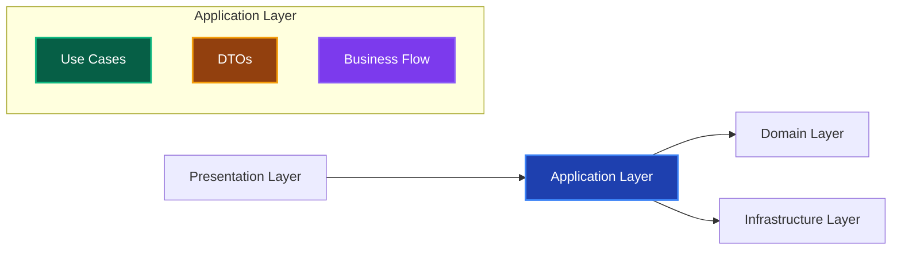

# Application Layer 実装ガイド 📋

このドキュメントでは、Application Layer（アプリケーション層）での実装ルール、許可される処理、禁止される処理について詳しく解説します。

## 🚀 Result型パターンの採用

**本プロジェクトでは、Application LayerのUseCaseにおいてResult型パターンを採用しています。**

```typescript
// 必要なimport
import { ok, err, type Result, type AppError } from '@/layers/application/types/Result';
import { DomainError } from '@/layers/domain/errors/DomainError';
```

### メリット

- **型安全性**: 成功・失敗が型レベルで表現される
- **明示的エラーハンドリング**: エラー処理が必須となり、見落としを防止
- **一貫性**: 全UseCaseで統一されたエラーハンドリング
- **テスタビリティ**: エラーケースのテストが容易

---

## Application Layer の責務 🎯

### 基本的な役割


```mermaid
graph LR
    PRES[Presentation Layer] --> APP[Application Layer]
    APP --> DOMAIN[Domain Layer]
    APP --> INFRA[Infrastructure Layer]

    subgraph "Application Layer"
        UC[Use Cases]
        DTO[DTOs]
        FLOW[Business Flow]
    end

    style APP fill:#1e40af,stroke:#3b82f6,stroke-width:2px,color:#ffffff
    style UC fill:#065f46,stroke:#10b981,stroke-width:2px,color:#ffffff
    style DTO fill:#92400e,stroke:#f59e0b,stroke-width:2px,color:#ffffff
    style FLOW fill:#7c3aed,stroke:#8b5cf6,stroke-width:2px,color:#ffffff
```

**Application Layerの責務：**

1. **ビジネスフローの制御** - 複数のDomain Serviceの組み合わせ
2. **トランザクション管理** - データ整合性の確保
3. **外部システム連携の制御** - Infrastructure Layerの活用
4. **データ変換** - Presentation ↔ Domain 間のDTO変換
5. **認可・権限チェック** - ユーザー権限の検証

---

## ✅ 書いて良いもの（許可される処理）

### 1. Use Case実装 🎬

**ビジネスフローの制御**

```typescript
// ✅ 許可：Use Case実装（Result型パターン）
export class CreateUserUseCase {
 constructor(
  private userRepository: IUserRepository,
  private userDomainService: UserDomainService,
  private hashService: IHashService,
  private logger: ILogger,
 ) {}

 async execute(
  request: CreateUserRequest,
 ): Promise<Result<CreateUserResponse, AppError>> {
  this.logger.info('ユーザー作成開始', { email: request.email });

  try {
   // 1. Email Value Objectを作成（バリデーション込み）
   const emailVO = new Email(request.email);

   // 2. ドメインサービスでビジネスルール検証
   await this.userDomainService.validateUserData(request.name, request.email);

   // 3. パスワードハッシュ化
   const hashedPassword = await this.hashService.generateHash(request.password);

   // 4. ドメインオブジェクト作成
   const user = User.create(emailVO, request.name, hashedPassword);

   // 5. 永続化
   await this.userRepository.save(user);

   this.logger.info('ユーザー作成完了', {
    userId: user.id.value,
    email: request.email,
   });

   // 6. 成功レスポンス
   // Value Object: .value で型安全にプリミティブ値を取得
   // プリミティブ型: 直接アクセス
   return ok({
    id: user.id.value,
    name: user.name,
    email: user.email.value,
    createdAt: user.createdAt,
    updatedAt: user.updatedAt,
   });
  } catch (error) {
   this.logger.error('ユーザー作成失敗', {
    email: request.email,
    error: error instanceof Error ? error.message : 'Unknown error',
   });

   // DomainErrorの場合は適切なエラーコードで返す
   if (error instanceof DomainError) {
    return err({ message: error.message, code: error.code });
   }

   // その他の予期しないエラー
   return err({ message: 'ユーザー作成に失敗しました', code: 'UNEXPECTED_ERROR' });
  }
 }
}
```

**なぜ許可されるのか：**

- ビジネスフローの制御はApplication Layerの責務
- 複数のDomain Serviceを組み合わせる処理
- トランザクション境界の管理

### 2. DTO（Data Transfer Object）定義 📦

**レイヤー間のデータ変換**

```typescript
// ✅ 許可：Request/Response DTO（Result型対応）
export interface CreateUserRequest {
 name: string;
 email: string;
 password: string;
}

export interface CreateUserResponse {
 id: string;
 name: string;
 email: string;
 createdAt: Date;
 updatedAt: Date;
}

export interface UpdateUserRequest {
 userId: string;
 name?: string;
 email?: string;
}

export interface UpdateUserResponse {
 id: string;
 name: string;
 email: string;
 updatedAt: Date;
}

export interface GetUsersRequest {
 page?: number;
 limit?: number;
 searchQuery?: string;
 sortBy?: 'name' | 'createdAt' | 'updatedAt';
 sortOrder?: 'asc' | 'desc';
}

export interface GetUsersResponse {
 users: UserSummary[];
 totalCount: number;
 currentPage: number;
 totalPages: number;
}

export interface UserSummary {
 id: string;
 name: string;
 email: string;
 createdAt: Date;
 updatedAt: Date;
}
```

**なぜ許可されるのか：**

- レイヤー間の結合度を下げる
- Presentation Layerが Domain Layer に直接依存することを防ぐ
- APIの安定性を確保

### 3. トランザクション管理 🔄

**データ整合性の確保**

```typescript
// ✅ 許可：トランザクション管理
export class TransferUserPointsUseCase {
 constructor(
  private userRepository: IUserRepository,
  private pointTransactionRepository: IPointTransactionRepository,
  private userDomainService: UserDomainService,
  private databaseFactory: IDatabaseFactory,
 ) {}

 async execute(request: TransferPointsRequest): Promise<void> {
  // トランザクション開始
  const transaction = await this.databaseFactory.beginTransaction();

  try {
   // 1. 送信者・受信者の取得
   const sender = await this.userRepository.findById(
    request.senderId,
    transaction,
   );
   const receiver = await this.userRepository.findById(
    request.receiverId,
    transaction,
   );

   if (!sender || !receiver) {
    throw new DomainError('ユーザーが見つかりません', 'USER_NOT_FOUND');
   }

   // 2. ビジネスルール検証（Domain Serviceに委譲）
   this.userDomainService.validatePointTransfer(
    sender,
    receiver,
    request.points,
   );

   // 3. ドメインオブジェクトでビジネスロジック実行
   sender.subtractPoints(request.points);
   receiver.addPoints(request.points);

   // 4. 永続化（同一トランザクション内）
   await this.userRepository.save(sender, transaction);
   await this.userRepository.save(receiver, transaction);

   // 5. 取引履歴記録
   const pointTransaction = new PointTransaction(
    request.senderId,
    request.receiverId,
    request.points,
    new Date(),
   );
   await this.pointTransactionRepository.save(pointTransaction, transaction);

   // トランザクションコミット
   await transaction.commit();
  } catch (error) {
   // トランザクションロールバック
   await transaction.rollback();
   throw error;
  }
 }
}
```

**トランザクション管理のベストプラクティス：**

1. **トランザクション境界の明確化** - Use Case単位でトランザクションを管理
2. **適切なロールバック** - エラー時の確実なデータ整合性確保
3. **Repository連携** - 同一トランザクション内での複数Repository操作
4. **Domain Service活用** - ビジネスルール検証の委譲

### 4. 認可・権限チェック 🔐

**ユーザー権限の検証**

```typescript
// ✅ 許可：認可処理（Result型パターン）
export class DeleteUserUseCase {
 constructor(
  private userRepository: IUserRepository,
  private authService: IAuthService,
  private logger: ILogger,
 ) {}

 async execute(
  request: DeleteUserRequest,
  currentUserId: string,
 ): Promise<Result<void, AppError>> {
  try {
   // 1. 認証チェック
   const currentUser = await this.userRepository.findById(
    new UserId(currentUserId),
   );
   if (!currentUser) {
    return err({ message: '認証が必要です', code: 'AUTHENTICATION_REQUIRED' });
   }

   // 2. 権限チェック
   const hasPermission = await this.authService.hasPermission(
    currentUserId,
    'DELETE_USER',
   );

   if (!hasPermission && currentUserId !== request.targetUserId) {
    return err({
     message: 'この操作を実行する権限がありません',
     code: 'INSUFFICIENT_PERMISSION',
    });
   }

   // 3. 対象ユーザーの取得
   const targetUser = await this.userRepository.findById(
    new UserId(request.targetUserId),
   );
   if (!targetUser) {
    return err({ message: '対象ユーザーが見つかりません', code: 'USER_NOT_FOUND' });
   }

   // 4. ビジネスルール検証（Domain Serviceに委譲）
   const canDelete = targetUser.canBeDeleted();
   if (!canDelete) {
    return err({ message: 'このユーザーは削除できません', code: 'USER_CANNOT_BE_DELETED' });
   }

   // 5. 削除実行
   await this.userRepository.delete(new UserId(request.targetUserId));

   this.logger.info('ユーザー削除完了', {
    targetUserId: request.targetUserId,
    deletedBy: currentUserId,
   });

   return ok(undefined);
  } catch (error) {
   this.logger.error('ユーザー削除失敗', {
    targetUserId: request.targetUserId,
    currentUserId,
    error: error instanceof Error ? error.message : 'Unknown error',
   });

   // DomainErrorの場合は適切なエラーコードで返す
   if (error instanceof DomainError) {
    return err({ message: error.message, code: error.code });
   }

   // その他の予期しないエラー
   return err({ message: 'ユーザー削除に失敗しました', code: 'UNEXPECTED_ERROR' });
  }
 }
}
```

### 5. 複数レイヤー間の調整 🎭

**Domain Service + Repository + 外部サービスの組み合わせ**

```typescript
// ✅ 許可：複数レイヤー間調整（Result型パターン）
export class PromoteUserUseCase {
 constructor(
  private userRepository: IUserRepository,
  private userDomainService: UserDomainService,
  private notificationService: INotificationService,
  private logger: ILogger,
 ) {}

 async execute(userId: string): Promise<Result<PromoteUserResponse, AppError>> {
  try {
   // 1. ユーザー取得
   const user = await this.userRepository.findById(new UserId(userId));
   if (!user) {
    return err({ message: 'ユーザーが見つかりません', code: 'USER_NOT_FOUND' });
   }

   // 2. 昇格可能性チェック（Domain Serviceに委譲）
   const canPromote = await this.userDomainService.canPromoteUser(user);
   if (!canPromote) {
    return err({ message: '昇格条件を満たしていません', code: 'PROMOTION_NOT_ALLOWED' });
   }

   // 3. ドメインオブジェクトでメール変更実行
   const oldEmail = user.email;
   const updatedUser = user.changeEmail(new Email(request.newEmail));

   // 4. 永続化
   await this.userRepository.save(updatedUser);

   // 5. 通知送信（外部サービス）
   await this.notificationService.sendEmailChangedNotification(
    updatedUser.email.value,
    updatedUser.name,
    oldEmail.value,
   );

   this.logger.info('ユーザー昇格完了', {
    userId,
    oldLevel,
    newLevel,
   });

   return ok({
    userId: user.id.value,
    newLevel,
    oldLevel,
    promotedAt: new Date(),
   });
  } catch (error) {
   this.logger.error('ユーザー昇格失敗', {
    userId,
    error: error instanceof Error ? error.message : 'Unknown error',
   });

   // DomainErrorの場合は適切なエラーコードで返す
   if (error instanceof DomainError) {
    return err({ message: error.message, code: error.code });
   }

   // その他の予期しないエラー
   return err({ message: 'ユーザー昇格に失敗しました', code: 'UNEXPECTED_ERROR' });
  }
 }
}
```

---

## ❌ 書いてはダメなもの（禁止される処理）

### 1. ビジネスロジック 🚫

```typescript
// ❌ 禁止：ビジネスロジックの実装
export class CreateUserUseCase {
 async execute(
  request: CreateUserRequest,
 ): Promise<Result<CreateUserResponse, AppError>> {
  // ❌ ビジネスルール判定はDomain Layerの責務
  if (request.name.length < 2) {
   return err({ message: '名前は2文字以上必要です', code: 'INVALID_NAME' });
  }

  // ❌ 経験値計算ロジックはDomain Layerの責務
  const initialExp = request.isVip ? 100 : 0;

  const user = new User(/* ... */);
  await this.userRepository.save(user);

  return ok({ id: user.id /* ... */ });
 }
}

// ✅ 正しい実装：Domain Layerに委譲（Result型パターン）
export class CreateUserUseCase {
 async execute(
  request: CreateUserRequest,
 ): Promise<Result<CreateUserResponse, AppError>> {
  try {
   // Domain Layerのファクトリーメソッドを使用
   const emailVO = new Email(request.email); // Value Objectでバリデーション
   const user = User.create(emailVO, request.name, hashedPassword); // Entityでバリデーション

   await this.userRepository.save(user);

   return ok({
    id: user.id.value,
    name: user.name,
    email: user.email.value,
    createdAt: user.createdAt,
    updatedAt: user.updatedAt,
   });
  } catch (error) {
   if (error instanceof DomainError) {
    return err({ message: error.message, code: error.code });
   }
   return err({ message: 'ユーザー作成に失敗しました', code: 'UNEXPECTED_ERROR' });
  }
 }
}
```

### 2. データベース・技術的詳細 💾

```typescript
// ❌ 禁止：技術的実装詳細
export class GetUsersUseCase {
 async execute(request: GetUsersRequest): Promise<Result<GetUsersResponse, AppError>> {
  // ❌ SQLクエリの直接記述
  const users = await this.prisma.$queryRaw`
      SELECT * FROM users
      WHERE name ILIKE ${`%${request.searchQuery}%`}
      ORDER BY created_at DESC
    `;

  return ok({ users });
 }
}

// ✅ 正しい実装：Repositoryに委譲（Result型パターン）
export class GetUsersUseCase {
 async execute(request: GetUsersRequest): Promise<Result<GetUsersResponse, AppError>> {
  try {
   const criteria = new UserSearchCriteria(
    request.searchQuery,
    request.page,
    request.limit,
    request.sortBy,
    request.sortOrder,
   );

   const { users, totalCount } =
    await this.userRepository.findByCriteria(criteria);

   return ok({
    users: users.map((user) => ({
     id: user.id.value,
     name: user.name,
     email: user.email.value,
     createdAt: user.createdAt,
     updatedAt: user.updatedAt,
    })),
    totalCount,
    currentPage: request.page || 1,
    totalPages: Math.ceil(totalCount / (request.limit || 10)),
   });
  } catch (error) {
   this.logger.error('ユーザー検索失敗', {
    searchQuery: request.searchQuery,
    error: error instanceof Error ? error.message : 'Unknown error',
   });

   if (error instanceof DomainError) {
    return err({ message: error.message, code: error.code });
   }
   return err({ message: 'ユーザー検索に失敗しました', code: 'UNEXPECTED_ERROR' });
  }
 }
}
```

### 3. UI・プレゼンテーション処理 🎨

```typescript
// ❌ 禁止：UI関連処理
export class GetUserProfileUseCase {
 async execute(userId: string): Promise<Result<UserProfileResponse, AppError>> {
  const user = await this.userRepository.findById(new UserId(userId));

  // ❌ 表示フォーマットはPresentation Layerの責務
  const displayName =
   user.name.length > 20
    ? user.name.substring(0, 20) + '...'
    : user.name;

  const emailDomain = user.email.value.split('@')[1];

  return ok({
   displayName,
   emailDomain,
   formattedJoinDate: user.createdAt.toLocaleDateString('ja-JP'),
  });
 }
}

// ✅ 正しい実装：生データのみ返却（Result型パターン）
export class GetUserProfileUseCase {
 async execute(userId: string): Promise<Result<UserProfileResponse, AppError>> {
  try {
   const user = await this.userRepository.findById(new UserId(userId));
   if (!user) {
    return err({ message: 'ユーザーが見つかりません', code: 'USER_NOT_FOUND' });
   }

   return ok({
    id: user.id.value,
    name: user.name,
    email: user.email.value,
    createdAt: user.createdAt,
    updatedAt: user.updatedAt,
   });
  } catch (error) {
   this.logger.error('ユーザープロフィール取得失敗', {
    userId,
    error: error instanceof Error ? error.message : 'Unknown error',
   });

   if (error instanceof DomainError) {
    return err({ message: error.message, code: error.code });
   }
   return err({
    message: 'ユーザープロフィールの取得に失敗しました',
    code: 'UNEXPECTED_ERROR',
   });
  }
 }
}
```

---

## 🎯 実装パターン

### 複雑なビジネスフロー管理

```typescript
// ✅ 適切なビジネスフロー制御
export class ProcessOrderUseCase {
 constructor(
  private orderRepository: IOrderRepository,
  private userRepository: IUserRepository,
  private inventoryService: IInventoryService,
  private paymentService: IPaymentService,
  private emailService: IEmailService,
  private databaseFactory: IDatabaseFactory,
 ) {}

 async execute(request: ProcessOrderRequest): Promise<ProcessOrderResponse> {
  const transaction = await this.databaseFactory.beginTransaction();

  try {
   // 1. ユーザー情報取得・検証
   const user = await this.userRepository.findById(request.userId, transaction);
   if (!user) {
    throw new DomainError('ユーザーが見つかりません', 'USER_NOT_FOUND');
   }

   // 2. 在庫確認（外部サービス連携）
   const products = await this.inventoryService.checkAvailability(
    request.items,
    transaction,
   );

   // 3. 注文ドメインオブジェクト作成
   const order = Order.create(
    generateOrderId(),
    user.id,
    products,
    new Date(),
   );

   // 4. 在庫予約
   await this.inventoryService.reserveProducts(products, transaction);

   // 5. 注文保存
   await this.orderRepository.save(order, transaction);

   // 6. 決済処理
   const payment = await this.paymentService.processPayment(
    order.totalAmount,
    request.paymentMethod,
    transaction,
   );

   await this.paymentRepository.save(payment, transaction);

   // 7. トランザクションコミット
   await transaction.commit();

   // 8. 確認メール送信（トランザクション外）
   await this.emailService.sendOrderConfirmation(order);

   return {
    orderId: order.id.value,
    totalAmount: order.totalAmount,
    status: order.status,
    estimatedDeliveryDate: order.estimatedDeliveryDate,
   };
  } catch (error) {
   await transaction.rollback();
   throw error;
  }
 }
}
```

---

## 📚 関連リンク

### レイヤー間連携

- **[Domain Layer ガイド](./domain-layer.md)** - ビジネスロジック実装の詳細
- **[Infrastructure Layer ガイド](./infrastructure-layer.md)** - Repository実装、外部サービス実装の詳細
- **[Presentation Layer ガイド](./presentation-layer.md)** - Server Actions、UI処理の詳細

### 詳細実装ガイド

- **[Use Cases](./components/use-cases.md)** - UseCaseの詳細実装パターン

---

## 💡 まとめ

**Application Layerの成功パターン：**

1. **UseCase中心設計** - 1つのUseCaseが1つのビジネスフローを制御
2. **Result型パターン** - 統一されたエラーハンドリングによる型安全性
3. **適切な依存関係** - Domain/Infrastructure Layerへの適切な委譲
4. **トランザクション管理** - データ整合性の確保
5. **DTO活用** - レイヤー間の結合度最小化
6. **構造化ログ** - デバッグ・監視に必要な情報の記録

**避けるべきアンチパターン：**

1. **Fat UseCase** - 複数のビジネスフローを1つのUseCaseに詰め込む
2. **例外による制御フロー** - Result型パターンを使わない不統一なエラーハンドリング
3. **技術的詳細の漏出** - SQLクエリや外部API仕様への直接依存
4. **ビジネスロジックの実装** - Domain Layerの責務を奪う
5. **UI関連処理** - Presentation Layerの責務を奪う

**関連ドキュメント 📚**

- **[エラーハンドリング実装ガイド](../cross-cutting/error-handling.md)** - Result型パターンの詳細実装
- **[Use Cases](./components/use-cases.md)** - UseCaseの詳細実装パターン

**Application Layerはオーケストレーター役に徹すること！** 🎭✨
