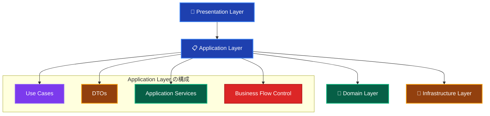
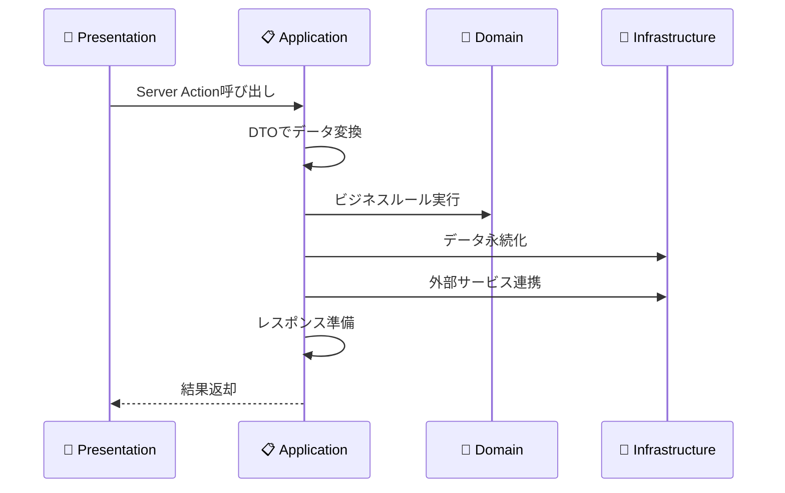
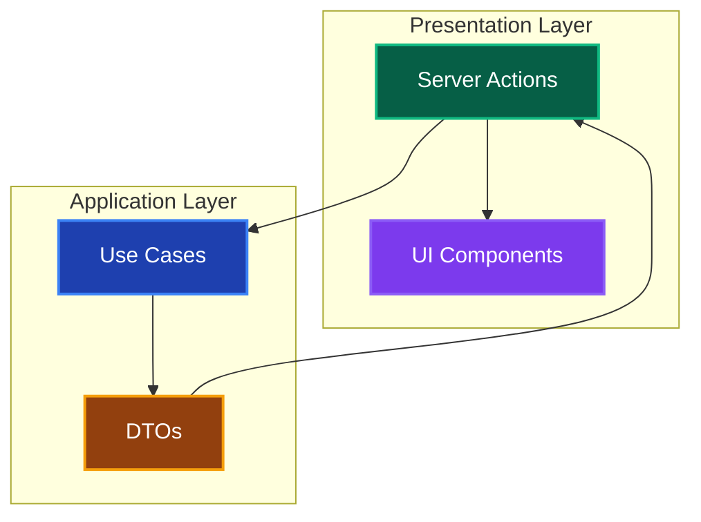
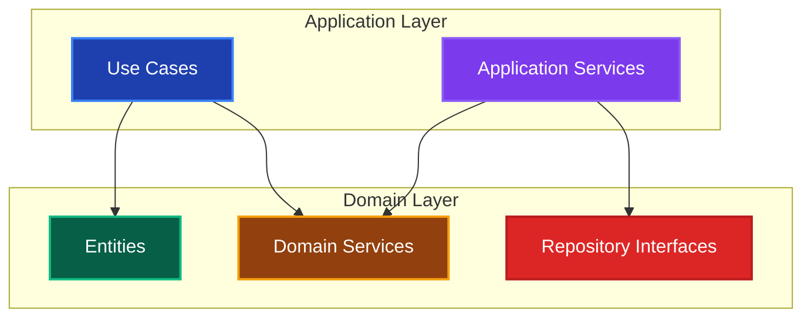
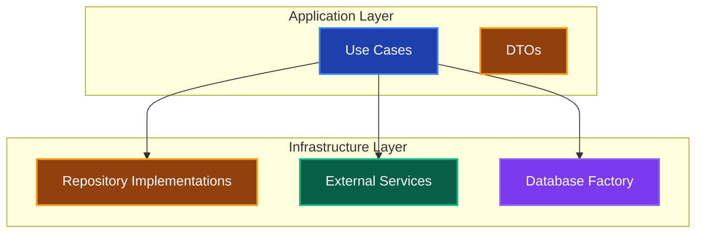

# Application Layer（アプリケーション層）概要 📋

このドキュメントでは、Application Layer の全体像と他レイヤーとの連携について解説し、各コンポーネントへの案内を提供します。

---

## Application Layer の役割 🎯

Application Layer は、ビジネスフローの制御と調整を行う中間層です。Presentation Layer からの要求を受け取り、Domain Layer のビジネスロジックと Infrastructure Layer の技術的実装を組み合わせて、ユースケースを実現します。

### 基本的な位置づけ 🗺️



### 他レイヤーとの調整役 🎼



---

## 🎯 何をするレイヤーか

### 責務 📋

1. **ユースケース（Use Case）の実装**
   - ビジネスフローの制御
   - 複数のDomain Serviceの組み合わせ
   - トランザクション境界の管理

2. **データ変換（DTO）**
   - Presentation ↔ Domain 間のデータ変換
   - レイヤー間の結合度低減
   - APIの安定性確保

3. **認可・権限チェック**
   - ユーザー権限の検証
   - セキュリティルールの適用
   - アクセス制御

4. **外部システム連携の制御**
   - Infrastructure Layer の活用
   - 外部APIコールの調整
   - エラーハンドリング

### 技術的特徴 ⚙️

- **Pure TypeScript** で実装（フレームワーク非依存）
- **TSyringe** を使用した依存性注入
- **トランザクション管理** でデータ整合性を確保
- **DTO パターン** でレイヤー間のデータ変換

---

## 🚫 何をしないレイヤーか

### 禁止事項 ❌

1. **UI関連の処理**

   ```typescript
   // ❌ 禁止：UI状態の管理
   const [isLoading, setIsLoading] = useState(false);
   ```

2. **具体的なデータベース実装**

   ```typescript
   // ❌ 禁止：直接的なDB操作
   import { PrismaClient } from '@prisma/client';
   const result = await prisma.user.findMany();
   ```

3. **ビジネスルール・ドメインロジックの実装**

   ```typescript
   // ❌ 禁止：ビジネスルールをApplication Layerで実装
   const calculateUserLevel = (experiencePoints: number) => {
     return Math.floor(experiencePoints / 1000) + 1; // Domain Layerの責務
   };
   ```

4. **外部サービスの具体的実装**

   ```typescript
   // ❌ 禁止：具体的なAPI実装
   import axios from 'axios';
   const response = await axios.post('https://api.example.com/users');
   ```

---

## 🔗 他レイヤーとの連携関係

### Presentation Layer との連携 🎨



**連携方法：**

- Server Actions から Use Cases を呼び出し
- DTOs でデータ形式を統一
- エラー情報をPresentation Layer に適切に返却

### Domain Layer との連携 👑



**連携方法：**

- Domain Service でビジネスロジック実行
- Repository Interface 経由でデータアクセス
- Entity のファクトリーメソッド活用

### Infrastructure Layer との連携 🔧



**連携方法：**

- Repository 実装でデータ永続化
- 外部サービス経由で API 連携
- トランザクション管理でデータ整合性確保

---

## 📁 Application Layer のコンポーネント

Application Layer は以下のコンポーネントで構成されています：

### 🎬 [Use Cases（ユースケース）](../components/use-cases.md)

- **責務**: ビジネスフローの制御と複数サービスの組み合わせ
- **含まれるもの**: 具体的なビジネスシナリオの実装、トランザクション管理
- **技術**: TypeScript、TSyringe、Domain/Infrastructure Layer 連携

### 📦 [DTOs（データ転送オブジェクト）](../components/dtos.md)

- **責務**: レイヤー間のデータ変換と型安全性の確保
- **含まれるもの**: Request/Response インターフェース、データ変換ロジック
- **技術**: TypeScript Interface、型定義

### 🔐 [Authorization Services（認可サービス）](../components/authorization-services.md)

- **責務**: ユーザー権限の検証とアクセス制御
- **含まれるもの**: 権限チェック、ロールベースアクセス制御
- **技術**: TypeScript、セキュリティライブラリ

### 🔄 [Transaction Management（トランザクション管理）](../components/transaction-management.md)

- **責務**: データ整合性の確保と複数操作の原子性保証
- **含まれるもの**: トランザクション境界定義、ロールバック処理
- **技術**: Database Factory パターン、Repository パターン

### 📬 [Application Services（アプリケーションサービス）](../components/application-services.md)

- **責務**: 複雑なビジネスフローの調整と外部システム連携
- **含まれるもの**: 複数Use Caseの組み合わせ、バッチ処理制御
- **技術**: TypeScript、外部API連携、スケジューリング

---

## 🏗️ 実装時の設計指針

### 1. **単一責任の原則** 🎯

```typescript
// ✅ 良い例：単一のユースケースに集中
export class CreateUserUseCase {
  async execute(request: CreateUserRequest): Promise<CreateUserResponse> {
    // ユーザー作成に関連する処理のみ
  }
}

// ❌ 悪い例：複数の責務を持つ
export class UserManagementUseCase {
  async createUser() { /* ... */ }
  async updateUser() { /* ... */ }
  async deleteUser() { /* ... */ }
  async sendEmail() { /* ... */ } // メール送信は別の責務
}
```

### 2. **適切なトランザクション境界** 🔄

```typescript
// ✅ 推薦：Use Case レベルでのトランザクション管理
export class TransferPointsUseCase {
  async execute(request: TransferPointsRequest): Promise<void> {
    const transaction = await this.databaseFactory.beginTransaction();
    
    try {
      // 複数の操作を同一トランザクション内で実行
      await this.userRepository.save(sender, transaction);
      await this.userRepository.save(receiver, transaction);
      await this.transactionRepository.save(record, transaction);
      
      await transaction.commit();
    } catch (error) {
      await transaction.rollback();
      throw error;
    }
  }
}
```

### 3. **適切なエラーハンドリング** 🚨

```typescript
// ✅ 推薦：レイヤー固有のエラー処理
export class CreateUserUseCase {
  async execute(request: CreateUserRequest): Promise<CreateUserResponse> {
    try {
      // ドメインロジック実行
      const user = await this.userDomainService.createUser(request);
      
      // インフラストラクチャ処理
      await this.userRepository.save(user);
      await this.emailService.sendWelcomeEmail(user.getEmail());
      
    } catch (error) {
      if (error instanceof DomainError) {
        // ドメインエラーはそのまま上位に
        throw error;
      } else if (error instanceof InfrastructureError) {
        // インフラエラーは適切にハンドリング
        this.logger.error('Infrastructure error occurred', error);
        throw new ApplicationError('システムエラーが発生しました');
      }
      
      // 予期しないエラー
      throw new ApplicationError('予期しないエラーが発生しました');
    }
  }
}
```

### 4. **DTOの適切な設計** 📦

```typescript
// ✅ 推薦：明確で型安全なDTO設計
export interface CreateUserRequest {
  readonly name: string;
  readonly email: string;
  readonly password: string;
}

export interface CreateUserResponse {
  readonly id: string;
  readonly name: string;
  readonly email: string;
  readonly level: number;
  readonly createdAt: Date;
}

// 変換ロジックの分離
export class UserDTOMapper {
  static toCreateUserRequest(formData: FormData): CreateUserRequest {
    return {
      name: formData.get('name') as string,
      email: formData.get('email') as string,
      password: formData.get('password') as string,
    };
  }
  
  static toCreateUserResponse(user: User): CreateUserResponse {
    return {
      id: user.getId().toString(),
      name: user.getName(),
      email: user.getEmail().toString(),
      level: user.getLevel(),
      createdAt: user.getCreatedAt(),
    };
  }
}
```

---

## 🧪 テスト戦略

### Unit Tests（単体テスト）

- **Vitest** を使用
- Use Case の各メソッドを独立してテスト
- Repository と External Service のモック化

### Integration Tests（統合テスト）

- **実際のDatabase Factory** を使用
- 複数レイヤーを通したデータフローの検証
- トランザクション動作の確認

---

## 🔄 依存性注入パターン

```typescript
// ✅ 推薦：コンストラクタインジェクション
@injectable()
export class CreateUserUseCase {
  constructor(
    @inject('IUserRepository') private userRepository: IUserRepository,
    @inject('IUserDomainService') private userDomainService: IUserDomainService,
    @inject('IEmailService') private emailService: IEmailService,
    @inject('ILogger') private logger: ILogger
  ) {}
  
  async execute(request: CreateUserRequest): Promise<CreateUserResponse> {
    // 実装...
  }
}
```

---

**各コンポーネントの詳細な実装ルールについては、上記のリンク先ドキュメントを参照してください！** 📖
