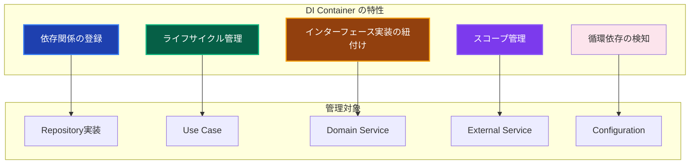
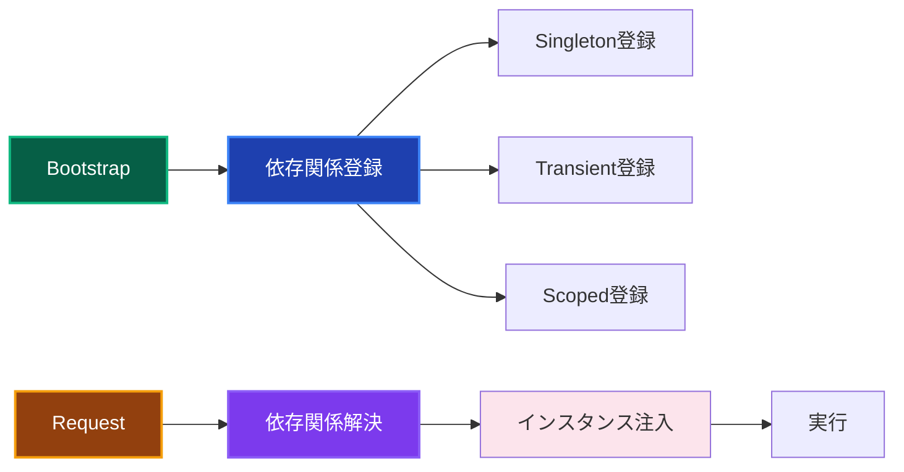

# DI Container - 依存性注入コンテナ 📦

アプリケーション全体の依存性注入を管理するコンポーネントです。TSyringeを使用して、各レイヤーのオブジェクトの生成と注入を自動化し、テスタビリティと保守性を向上させます。

---

## 🎯 コンポーネントの定義

**DI Container**は、Infrastructure Layerに属し、依存性注入の設定と管理を責務とするコンポーネントです。アプリケーションのブートストラップ時にすべての依存関係を登録し、実行時に適切なインスタンスを提供します。

### 📊 特性と役割



### 🔄 依存性注入の流れ



---

## ✅ 何をして良いか

### 1. コンテナの初期化と設定 🚀

**アプリケーション起動時のDIコンテナ設定**

```typescript
// ✅ 許可：DIコンテナの初期化
import { container, Lifecycle } from 'tsyringe';
import 'reflect-metadata';

export class DIContainer {
  private static isInitialized = false;
  
  static async initialize(): Promise<void> {
    if (this.isInitialized) {
      return;
    }
    
    try {
      // 設定の登録
      await this.registerConfiguration();
      
      // Infrastructure Layerの登録
      await this.registerInfrastructure();
      
      // Domain Layerの登録
      await this.registerDomain();
      
      // Application Layerの登録
      await this.registerApplication();
      
      this.isInitialized = true;
      console.log('DI Container initialized successfully');
      
    } catch (error) {
      console.error('DI Container initialization failed:', error);
      throw new DIContainerError(
        'DIコンテナの初期化に失敗しました',
        'CONTAINER_INITIALIZATION_FAILED',
        error
      );
    }
  }
  
  static resolve<T>(token: string | symbol | Function): T {
    if (!this.isInitialized) {
      throw new DIContainerError(
        'DIコンテナが初期化されていません',
        'CONTAINER_NOT_INITIALIZED'
      );
    }
    
    try {
      return container.resolve(token as any);
    } catch (error) {
      throw new DIContainerError(
        `依存関係の解決に失敗しました: ${String(token)}`,
        'DEPENDENCY_RESOLUTION_FAILED',
        error
      );
    }
  }
  
  static isReady(): boolean {
    return this.isInitialized;
  }
  
  static async reset(): Promise<void> {
    container.clearInstances();
    this.isInitialized = false;
    await this.initialize();
  }
  
  // 設定管理の登録
  private static async registerConfiguration(): Promise<void> {
    console.log('Registering Configuration...');
    
    // 設定オブジェクトをSingletonとして登録
    const config = ConfigurationFactory.create();
    container.registerInstance('IApplicationConfig', config);
    
    // 環境別の設定サービス
    container.register('IConfigurationValidator', ConfigurationValidator, {
      lifecycle: Lifecycle.Singleton
    });
    
    // 機密情報管理
    const secretManager = new SecretManager(process.env.ENCRYPTION_KEY!);
    container.registerInstance('ISecretManager', secretManager);
  }
  
  // Infrastructure Layer の登録
  private static async registerInfrastructure(): Promise<void> {
    console.log('Registering Infrastructure Layer...');
    
    // データベース関連
    container.register('IDatabaseFactory', PrismaDatabaseFactory, {
      lifecycle: Lifecycle.Singleton
    });
    
    // Repository実装
    container.register('IUserRepository', PrismaUserRepository, {
      lifecycle: Lifecycle.Singleton
    });
    
    container.register('IOrderRepository', PrismaOrderRepository, {
      lifecycle: Lifecycle.Singleton
    });
    
    container.register('IProductRepository', PrismaProductRepository, {
      lifecycle: Lifecycle.Singleton
    });
    
    // 外部サービス
    container.register('IEmailService', SendGridEmailService, {
      lifecycle: Lifecycle.Singleton
    });
    
    container.register('IFileStorageService', AwsS3FileStorageService, {
      lifecycle: Lifecycle.Singleton
    });
    
    container.register('IExternalApiService', ExternalApiService, {
      lifecycle: Lifecycle.Singleton
    });
    
    // ログサービス
    container.register('ILogger', WinstonLogger, {
      lifecycle: Lifecycle.Singleton
    });
    
    // キャッシュサービス
    container.register('ICacheService', RedisCacheService, {
      lifecycle: Lifecycle.Singleton
    });
  }
  
  // Domain Layer の登録
  private static async registerDomain(): Promise<void> {
    console.log('Registering Domain Layer...');
    
    // Domain Service
    container.register('UserDomainService', UserDomainService, {
      lifecycle: Lifecycle.Singleton
    });
    
    container.register('OrderDomainService', OrderDomainService, {
      lifecycle: Lifecycle.Singleton
    });
    
    container.register('ProductDomainService', ProductDomainService, {
      lifecycle: Lifecycle.Singleton
    });
    
    // Domain Event管理
    container.register('IDomainEventPublisher', DomainEventPublisher, {
      lifecycle: Lifecycle.Singleton
    });
    
    container.register('IDomainEventSubscriber', DomainEventSubscriber, {
      lifecycle: Lifecycle.Singleton
    });
  }
  
  // Application Layer の登録
  private static async registerApplication(): Promise<void> {
    console.log('Registering Application Layer...');
    
    // Use Cases（リクエストスコープ）
    container.register('CreateUserUseCase', CreateUserUseCase, {
      lifecycle: Lifecycle.Transient
    });
    
    container.register('GetUserUseCase', GetUserUseCase, {
      lifecycle: Lifecycle.Transient
    });
    
    container.register('UpdateUserUseCase', UpdateUserUseCase, {
      lifecycle: Lifecycle.Transient
    });
    
    container.register('DeleteUserUseCase', DeleteUserUseCase, {
      lifecycle: Lifecycle.Transient
    });
    
    container.register('CreateOrderUseCase', CreateOrderUseCase, {
      lifecycle: Lifecycle.Transient
    });
    
    container.register('ProcessOrderUseCase', ProcessOrderUseCase, {
      lifecycle: Lifecycle.Transient
    });
    
    // Application Service
    container.register('UserApplicationService', UserApplicationService, {
      lifecycle: Lifecycle.Singleton
    });
    
    container.register('OrderApplicationService', OrderApplicationService, {
      lifecycle: Lifecycle.Singleton
    });
  }
}
```

### 2. 環境別コンテナ設定 🌍

**開発・テスト・本番環境での依存関係の切り替え**

```typescript
// ✅ 許可：環境別DIコンテナ設定
export class EnvironmentSpecificDIContainer extends DIContainer {
  static async initializeForEnvironment(environment: string): Promise<void> {
    console.log(`Initializing DI Container for ${environment} environment`);
    
    switch (environment) {
      case 'development':
        await this.initializeDevelopment();
        break;
      case 'test':
        await this.initializeTest();
        break;
      case 'staging':
        await this.initializeStaging();
        break;
      case 'production':
        await this.initializeProduction();
        break;
      default:
        throw new DIContainerError(
          `未対応の環境です: ${environment}`,
          'UNSUPPORTED_ENVIRONMENT'
        );
    }
  }
  
  // 開発環境用設定
  private static async initializeDevelopment(): Promise<void> {
    await this.initialize();
    
    // 開発環境固有の上書き
    container.register('ILogger', ConsoleLogger, {
      lifecycle: Lifecycle.Singleton
    });
    
    // 開発環境ではメール送信をモック
    container.register('IEmailService', MockEmailService, {
      lifecycle: Lifecycle.Singleton
    });
    
    // 開発環境では外部APIをモック
    container.register('IExternalApiService', MockExternalApiService, {
      lifecycle: Lifecycle.Singleton
    });
    
    // 開発環境ではファイルストレージをローカル
    container.register('IFileStorageService', LocalFileStorageService, {
      lifecycle: Lifecycle.Singleton
    });
    
    console.log('Development environment DI configuration applied');
  }
  
  // テスト環境用設定
  private static async initializeTest(): Promise<void> {
    // テスト用の最小構成
    container.register('IApplicationConfig', TestApplicationConfig, {
      lifecycle: Lifecycle.Singleton
    });
    
    // すべてのサービスをモック
    container.register('IUserRepository', MockUserRepository, {
      lifecycle: Lifecycle.Singleton
    });
    
    container.register('IOrderRepository', MockOrderRepository, {
      lifecycle: Lifecycle.Singleton
    });
    
    container.register('IEmailService', MockEmailService, {
      lifecycle: Lifecycle.Singleton
    });
    
    container.register('IFileStorageService', MockFileStorageService, {
      lifecycle: Lifecycle.Singleton
    });
    
    container.register('ILogger', TestLogger, {
      lifecycle: Lifecycle.Singleton
    });
    
    // Use Casesは実際のものを使用（テスト対象）
    await this.registerApplication();
    
    console.log('Test environment DI configuration applied');
  }
  
  // 本番環境用設定
  private static async initializeProduction(): Promise<void> {
    await this.initialize();
    
    // 本番環境では追加の監視サービス
    container.register('IMetricsService', PrometheusMetricsService, {
      lifecycle: Lifecycle.Singleton
    });
    
    container.register('IHealthCheckService', HealthCheckService, {
      lifecycle: Lifecycle.Singleton
    });
    
    // 本番環境では高可用性対応
    container.register('IEmailService', ResilientEmailService, {
      lifecycle: Lifecycle.Singleton
    });
    
    container.register('IFileStorageService', HighAvailabilityFileStorageService, {
      lifecycle: Lifecycle.Singleton
    });
    
    console.log('Production environment DI configuration applied');
  }
}
```

### 3. モジュール化されたコンテナ設定 📚

**機能別にコンテナ設定を分割管理**

```typescript
// ✅ 許可：モジュール化されたDI設定
export abstract class DIModule {
  abstract register(): Promise<void>;
}

// ユーザー管理モジュール
export class UserModule extends DIModule {
  async register(): Promise<void> {
    console.log('Registering User Module...');
    
    // User関連のRepository
    container.register('IUserRepository', PrismaUserRepository, {
      lifecycle: Lifecycle.Singleton
    });
    
    // User関連のDomain Service
    container.register('UserDomainService', UserDomainService, {
      lifecycle: Lifecycle.Singleton
    });
    
    // User関連のUse Cases
    container.register('CreateUserUseCase', CreateUserUseCase, {
      lifecycle: Lifecycle.Transient
    });
    
    container.register('GetUserUseCase', GetUserUseCase, {
      lifecycle: Lifecycle.Transient
    });
    
    container.register('UpdateUserUseCase', UpdateUserUseCase, {
      lifecycle: Lifecycle.Transient
    });
    
    container.register('DeleteUserUseCase', DeleteUserUseCase, {
      lifecycle: Lifecycle.Transient
    });
    
    // User関連のEvent Handlers
    container.register('UserCreatedEventHandler', UserCreatedEventHandler, {
      lifecycle: Lifecycle.Singleton
    });
    
    container.register('UserUpdatedEventHandler', UserUpdatedEventHandler, {
      lifecycle: Lifecycle.Singleton
    });
  }
}

// 注文管理モジュール
export class OrderModule extends DIModule {
  async register(): Promise<void> {
    console.log('Registering Order Module...');
    
    // Order関連のRepository
    container.register('IOrderRepository', PrismaOrderRepository, {
      lifecycle: Lifecycle.Singleton
    });
    
    container.register('IOrderItemRepository', PrismaOrderItemRepository, {
      lifecycle: Lifecycle.Singleton
    });
    
    // Order関連のDomain Service
    container.register('OrderDomainService', OrderDomainService, {
      lifecycle: Lifecycle.Singleton
    });
    
    container.register('PaymentDomainService', PaymentDomainService, {
      lifecycle: Lifecycle.Singleton
    });
    
    // Order関連のUse Cases
    container.register('CreateOrderUseCase', CreateOrderUseCase, {
      lifecycle: Lifecycle.Transient
    });
    
    container.register('ProcessOrderUseCase', ProcessOrderUseCase, {
      lifecycle: Lifecycle.Transient
    });
    
    container.register('CancelOrderUseCase', CancelOrderUseCase, {
      lifecycle: Lifecycle.Transient
    });
    
    // Order関連のEvent Handlers
    container.register('OrderCreatedEventHandler', OrderCreatedEventHandler, {
      lifecycle: Lifecycle.Singleton
    });
    
    container.register('OrderProcessedEventHandler', OrderProcessedEventHandler, {
      lifecycle: Lifecycle.Singleton
    });
  }
}

// 外部サービスモジュール
export class ExternalServicesModule extends DIModule {
  async register(): Promise<void> {
    console.log('Registering External Services Module...');
    
    const config = container.resolve<IApplicationConfig>('IApplicationConfig');
    
    // メールサービス
    container.registerInstance('IEmailService', new SendGridEmailService(
      config.externalServices.sendgrid.apiKey,
      config.externalServices.sendgrid.fromEmail,
      container.resolve<ILogger>('ILogger')
    ));
    
    // ファイルストレージサービス
    container.registerInstance('IFileStorageService', new AwsS3FileStorageService(
      config.externalServices.aws.region,
      config.externalServices.aws.accessKeyId,
      config.externalServices.aws.secretAccessKey,
      container.resolve<ILogger>('ILogger')
    ));
    
    // 外部APIサービス
    container.registerInstance('IExternalApiService', new ExternalApiService(
      'https://api.external-service.com',
      config.externalServices.apiKey,
      30000,
      container.resolve<ILogger>('ILogger')
    ));
    
    // 決済サービス
    container.register('IPaymentService', StripePaymentService, {
      lifecycle: Lifecycle.Singleton
    });
  }
}

// モジュール化されたコンテナ
export class ModularDIContainer {
  private static modules: DIModule[] = [];
  
  static addModule(module: DIModule): void {
    this.modules.push(module);
  }
  
  static async initialize(): Promise<void> {
    console.log('Initializing Modular DI Container...');
    
    // 基本設定の登録
    await this.registerCore();
    
    // 各モジュールの登録
    for (const module of this.modules) {
      await module.register();
    }
    
    console.log('Modular DI Container initialized successfully');
  }
  
  private static async registerCore(): Promise<void> {
    // コア設定の登録
    const config = ConfigurationFactory.create();
    container.registerInstance('IApplicationConfig', config);
    
    // ログサービス
    container.register('ILogger', WinstonLogger, {
      lifecycle: Lifecycle.Singleton
    });
    
    // データベースファクトリー
    container.register('IDatabaseFactory', PrismaDatabaseFactory, {
      lifecycle: Lifecycle.Singleton
    });
  }
}

// 使用例：アプリケーション起動時
export async function bootstrapApplication(): Promise<void> {
  // モジュールの追加
  ModularDIContainer.addModule(new UserModule());
  ModularDIContainer.addModule(new OrderModule());
  ModularDIContainer.addModule(new ExternalServicesModule());
  
  // コンテナの初期化
  await ModularDIContainer.initialize();
}
```

### 4. 条件付き登録とファクトリー 🏭

**条件に応じた実装の動的切り替え**

```typescript
// ✅ 許可：条件付き依存関係登録
export class ConditionalDIContainer {
  static async registerEmailService(): Promise<void> {
    const config = container.resolve<IApplicationConfig>('IApplicationConfig');
    const logger = container.resolve<ILogger>('ILogger');
    
    // 環境と設定に応じたメールサービスの選択
    if (config.app.environment === 'development') {
      // 開発環境ではConsoleEmailService
      container.registerInstance('IEmailService', new ConsoleEmailService(logger));
      
    } else if (config.features.enableEmailNotifications) {
      // 本番環境でメール機能が有効な場合
      const primaryService = new SendGridEmailService(
        config.externalServices.sendgrid.apiKey,
        config.externalServices.sendgrid.fromEmail,
        logger
      );
      
      const fallbackService = new MailgunEmailService(
        config.externalServices.mailgun.apiKey,
        config.externalServices.mailgun.domain,
        logger
      );
      
      // フォールバック機能付きのメールサービス
      container.registerInstance('IEmailService', 
        new ResilientEmailService(primaryService, fallbackService, logger)
      );
      
    } else {
      // メール機能が無効な場合はNullObjectパターン
      container.registerInstance('IEmailService', new NullEmailService(logger));
    }
  }
  
  static async registerFileStorageService(): Promise<void> {
    const config = container.resolve<IApplicationConfig>('IApplicationConfig');
    const logger = container.resolve<ILogger>('ILogger');
    
    if (config.features.enableFileUploads) {
      if (config.app.environment === 'production') {
        // 本番環境ではAWS S3
        container.registerInstance('IFileStorageService', new AwsS3FileStorageService(
          config.externalServices.aws.region,
          config.externalServices.aws.accessKeyId,
          config.externalServices.aws.secretAccessKey,
          logger
        ));
      } else {
        // 開発環境ではローカルファイルシステム
        container.registerInstance('IFileStorageService', new LocalFileStorageService(
          './uploads',
          logger
        ));
      }
    } else {
      // ファイルアップロード機能が無効
      container.registerInstance('IFileStorageService', new NullFileStorageService(logger));
    }
  }
  
  static async registerCacheService(): Promise<void> {
    const config = container.resolve<IApplicationConfig>('IApplicationConfig');
    const logger = container.resolve<ILogger>('ILogger');
    
    if (config.features.enableCaching) {
      // Redis接続が利用可能な場合
      try {
        const redisService = new RedisCacheService(
          config.externalServices.redis.url,
          config.externalServices.redis.password,
          config.externalServices.redis.ttl,
          logger
        );
        
        await redisService.healthCheck();
        container.registerInstance('ICacheService', redisService);
        
      } catch (error) {
        logger.warn('Redis接続に失敗しました。インメモリキャッシュを使用します。', { error });
        
        // フォールバック：インメモリキャッシュ
        container.registerInstance('ICacheService', new InMemoryCacheService(
          config.externalServices.redis.ttl,
          logger
        ));
      }
    } else {
      // キャッシュ機能が無効
      container.registerInstance('ICacheService', new NullCacheService(logger));
    }
  }
}

// ファクトリー関数を使用した動的登録
export class DIFactories {
  static registerUserRepositoryFactory(): void {
    container.register<IUserRepository>(
      'IUserRepository',
      {
        useFactory: (dependencyContainer) => {
          const config = dependencyContainer.resolve<IApplicationConfig>('IApplicationConfig');
          const logger = dependencyContainer.resolve<ILogger>('ILogger');
          const dbFactory = dependencyContainer.resolve<IDatabaseFactory>('IDatabaseFactory');
          
          if (config.app.environment === 'test') {
            return new InMemoryUserRepository(logger);
          } else {
            return new PrismaUserRepository(dbFactory.createClient(), logger);
          }
        }
      },
      { lifecycle: Lifecycle.Singleton }
    );
  }
  
  static registerMetricsServiceFactory(): void {
    container.register<IMetricsService>(
      'IMetricsService',
      {
        useFactory: (dependencyContainer) => {
          const config = dependencyContainer.resolve<IApplicationConfig>('IApplicationConfig');
          const logger = dependencyContainer.resolve<ILogger>('ILogger');
          
          if (config.features.enableMetrics) {
            return new PrometheusMetricsService(
              config.app.port + 1, // メトリクス用ポート
              logger
            );
          } else {
            return new NullMetricsService(logger);
          }
        }
      },
      { lifecycle: Lifecycle.Singleton }
    );
  }
}
```

---

## ❌ 何をしてはならないか

### 1. 循環依存の作成 🔄

```typescript
// ❌ 禁止：循環依存を引き起こす設定
export class BadCircularDependency {
  static register(): void {
    // ❌ ServiceAがServiceBに依存し、ServiceBがServiceAに依存
    container.register('ServiceA', ServiceA); // ServiceAのコンストラクタでServiceBが必要
    container.register('ServiceB', ServiceB); // ServiceBのコンストラクタでServiceAが必要
    
    // 結果：resolve時にエラーが発生
  }
}

// ✅ 正しい：依存関係を整理
export class GoodDependencyStructure {
  static register(): void {
    // ✅ 依存関係を一方向に整理
    container.register('ServiceC', ServiceC); // 依存なし
    container.register('ServiceA', ServiceA); // ServiceCに依存
    container.register('ServiceB', ServiceB); // ServiceAとServiceCに依存
  }
}
```

### 2. 具象クラスへの直接依存 🎭

```typescript
// ❌ 禁止：具象クラスを直接注入
export class BadConcreteDependency {
  static register(): void {
    // ❌ 具象クラスPrismaUserRepositoryを直接登録
    container.register('UserRepository', PrismaUserRepository);
    
    // ❌ Use Caseで具象クラスに依存
    container.register('CreateUserUseCase', CreateUserUseCase); // PrismaUserRepositoryに直接依存
  }
}

// ✅ 正しい：インターフェースを介した依存
export class GoodInterfaceDependency {
  static register(): void {
    // ✅ インターフェースとして登録
    container.register('IUserRepository', PrismaUserRepository);
    
    // ✅ Use CaseはIUserRepositoryインターフェースに依存
    container.register('CreateUserUseCase', CreateUserUseCase);
  }
}
```

### 3. ライフサイクルの不適切な設定 ⏱️

```typescript
// ❌ 禁止：不適切なライフサイクル設定
export class BadLifecycleManagement {
  static register(): void {
    // ❌ RepositoryをTransientで登録（毎回新しいインスタンス）
    container.register('IUserRepository', PrismaUserRepository, {
      lifecycle: Lifecycle.Transient // データベース接続が毎回作られる
    });
    
    // ❌ Use CaseをSingletonで登録（状態を持ってしまう可能性）
    container.register('CreateUserUseCase', CreateUserUseCase, {
      lifecycle: Lifecycle.Singleton // リクエスト間で状態が共有される危険
    });
  }
}

// ✅ 正しい：適切なライフサイクル設定
export class GoodLifecycleManagement {
  static register(): void {
    // ✅ RepositoryはSingleton（接続プールを共有）
    container.register('IUserRepository', PrismaUserRepository, {
      lifecycle: Lifecycle.Singleton
    });
    
    // ✅ Use CaseはTransient（リクエスト毎に新しいインスタンス）
    container.register('CreateUserUseCase', CreateUserUseCase, {
      lifecycle: Lifecycle.Transient
    });
  }
}
```

---

## 🎨 デザインパターンとベストプラクティス

### 1. Module Pattern 📦

**機能別モジュール化による依存関係の整理**

```typescript
export interface DIModule {
  name: string;
  dependencies: string[];
  register(): Promise<void>;
}

export class ModularDIRegistry {
  private modules = new Map<string, DIModule>();
  private registrationOrder: string[] = [];
  
  addModule(module: DIModule): void {
    this.modules.set(module.name, module);
  }
  
  async registerAll(): Promise<void> {
    // 依存関係を考慮した登録順序の決定
    this.calculateRegistrationOrder();
    
    // 順序通りに登録
    for (const moduleName of this.registrationOrder) {
      const module = this.modules.get(moduleName)!;
      console.log(`Registering module: ${moduleName}`);
      await module.register();
    }
  }
  
  private calculateRegistrationOrder(): void {
    const visited = new Set<string>();
    const order: string[] = [];
    
    const visit = (moduleName: string) => {
      if (visited.has(moduleName)) return;
      
      const module = this.modules.get(moduleName);
      if (!module) throw new Error(`Module not found: ${moduleName}`);
      
      // 依存モジュールを先に処理
      for (const dependency of module.dependencies) {
        visit(dependency);
      }
      
      visited.add(moduleName);
      order.push(moduleName);
    };
    
    for (const moduleName of this.modules.keys()) {
      visit(moduleName);
    }
    
    this.registrationOrder = order;
  }
}
```

### 2. Factory Pattern 🏭

**複雑なオブジェクト生成の抽象化**

```typescript
export class ServiceFactory {
  static createEmailService(config: IApplicationConfig, logger: ILogger): IEmailService {
    const environment = config.app.environment;
    
    switch (environment) {
      case 'development':
        return new ConsoleEmailService(logger);
      
      case 'test':
        return new MockEmailService(logger);
      
      case 'production':
        return new SendGridEmailService(
          config.externalServices.sendgrid.apiKey,
          config.externalServices.sendgrid.fromEmail,
          logger
        );
      
      default:
        throw new Error(`Unsupported environment: ${environment}`);
    }
  }
  
  static createRepositoryFactory(config: IApplicationConfig): IRepositoryFactory {
    if (config.app.environment === 'test') {
      return new InMemoryRepositoryFactory();
    } else {
      return new PrismaRepositoryFactory(config.database);
    }
  }
}
```

### 3. Decorator Pattern 🎨

**サービスの機能拡張**

```typescript
export class DecoratedServiceRegistry {
  static registerDecoratedEmailService(): void {
    container.register<IEmailService>(
      'IEmailService',
      {
        useFactory: (container) => {
          const baseService = new SendGridEmailService(/* ... */);
          const logger = container.resolve<ILogger>('ILogger');
          const metrics = container.resolve<IMetricsService>('IMetricsService');
          
          // デコレーターで機能を追加
          let emailService: IEmailService = baseService;
          emailService = new LoggingEmailServiceDecorator(emailService, logger);
          emailService = new MetricsEmailServiceDecorator(emailService, metrics);
          emailService = new RetryEmailServiceDecorator(emailService, 3);
          
          return emailService;
        }
      },
      { lifecycle: Lifecycle.Singleton }
    );
  }
}

class LoggingEmailServiceDecorator implements IEmailService {
  constructor(
    private readonly baseService: IEmailService,
    private readonly logger: ILogger
  ) {}
  
  async sendWelcomeEmail(email: string, name: string): Promise<void> {
    this.logger.info('メール送信開始', { email, name });
    try {
      await this.baseService.sendWelcomeEmail(email, name);
      this.logger.info('メール送信成功', { email });
    } catch (error) {
      this.logger.error('メール送信失敗', { email, error });
      throw error;
    }
  }
}
```

---

## 🧪 テスト戦略

### 1. DIコンテナのユニットテスト

```typescript
describe('DIContainer', () => {
  beforeEach(async () => {
    // 各テスト前にコンテナをリセット
    container.clearInstances();
    await DIContainer.reset();
  });
  
  describe('initialize', () => {
    it('正常にコンテナが初期化されること', async () => {
      // Arrange & Act
      await DIContainer.initialize();
      
      // Assert
      expect(DIContainer.isReady()).toBe(true);
      
      // 主要なサービスが登録されていることを確認
      expect(() => DIContainer.resolve('IApplicationConfig')).not.toThrow();
      expect(() => DIContainer.resolve('IUserRepository')).not.toThrow();
      expect(() => DIContainer.resolve('IEmailService')).not.toThrow();
    });
    
    it('重複初期化が問題なく処理されること', async () => {
      // Arrange
      await DIContainer.initialize();
      
      // Act & Assert
      await expect(DIContainer.initialize()).resolves.not.toThrow();
      expect(DIContainer.isReady()).toBe(true);
    });
    
    it('必須設定が不足している場合にエラーが投げられること', async () => {
      // Arrange
      delete process.env.DATABASE_URL;
      
      // Act & Assert
      await expect(DIContainer.initialize()).rejects.toThrow(DIContainerError);
    });
  });
  
  describe('resolve', () => {
    beforeEach(async () => {
      await DIContainer.initialize();
    });
    
    it('登録されたサービスが正常に解決されること', () => {
      // Act
      const userRepository = DIContainer.resolve<IUserRepository>('IUserRepository');
      const emailService = DIContainer.resolve<IEmailService>('IEmailService');
      
      // Assert
      expect(userRepository).toBeDefined();
      expect(emailService).toBeDefined();
      expect(userRepository).toBeInstanceOf(PrismaUserRepository);
      expect(emailService).toBeInstanceOf(SendGridEmailService);
    });
    
    it('Singletonサービスが同じインスタンスを返すこと', () => {
      // Act
      const instance1 = DIContainer.resolve<IUserRepository>('IUserRepository');
      const instance2 = DIContainer.resolve<IUserRepository>('IUserRepository');
      
      // Assert
      expect(instance1).toBe(instance2);
    });
    
    it('Transientサービスが異なるインスタンスを返すこと', () => {
      // Act
      const instance1 = DIContainer.resolve<CreateUserUseCase>('CreateUserUseCase');
      const instance2 = DIContainer.resolve<CreateUserUseCase>('CreateUserUseCase');
      
      // Assert
      expect(instance1).not.toBe(instance2);
      expect(instance1).toBeInstanceOf(CreateUserUseCase);
      expect(instance2).toBeInstanceOf(CreateUserUseCase);
    });
    
    it('未登録のサービスでエラーが投げられること', () => {
      // Act & Assert
      expect(() => DIContainer.resolve('UnregisteredService')).toThrow(DIContainerError);
    });
  });
});
```

### 2. 環境別設定のテスト

```typescript
describe('EnvironmentSpecificDIContainer', () => {
  let originalEnv: string;
  
  beforeEach(() => {
    originalEnv = process.env.NODE_ENV || '';
    container.clearInstances();
  });
  
  afterEach(() => {
    process.env.NODE_ENV = originalEnv;
  });
  
  it('開発環境でモックサービスが登録されること', async () => {
    // Arrange
    process.env.NODE_ENV = 'development';
    
    // Act
    await EnvironmentSpecificDIContainer.initializeForEnvironment('development');
    
    // Assert
    const emailService = DIContainer.resolve<IEmailService>('IEmailService');
    const fileService = DIContainer.resolve<IFileStorageService>('IFileStorageService');
    
    expect(emailService).toBeInstanceOf(MockEmailService);
    expect(fileService).toBeInstanceOf(LocalFileStorageService);
  });
  
  it('テスト環境で全てのサービスがモック化されること', async () => {
    // Arrange
    process.env.NODE_ENV = 'test';
    
    // Act
    await EnvironmentSpecificDIContainer.initializeForEnvironment('test');
    
    // Assert
    const userRepository = DIContainer.resolve<IUserRepository>('IUserRepository');
    const emailService = DIContainer.resolve<IEmailService>('IEmailService');
    
    expect(userRepository).toBeInstanceOf(MockUserRepository);
    expect(emailService).toBeInstanceOf(MockEmailService);
  });
  
  it('本番環境で本物のサービスが登録されること', async () => {
    // Arrange
    process.env.NODE_ENV = 'production';
    
    // Act
    await EnvironmentSpecificDIContainer.initializeForEnvironment('production');
    
    // Assert
    const userRepository = DIContainer.resolve<IUserRepository>('IUserRepository');
    const emailService = DIContainer.resolve<IEmailService>('IEmailService');
    const metricsService = DIContainer.resolve<IMetricsService>('IMetricsService');
    
    expect(userRepository).toBeInstanceOf(PrismaUserRepository);
    expect(emailService).toBeInstanceOf(ResilientEmailService);
    expect(metricsService).toBeInstanceOf(PrometheusMetricsService);
  });
});
```

### 3. 統合テスト（実際のDI使用）

```typescript
describe('DI Integration Tests', () => {
  beforeAll(async () => {
    await EnvironmentSpecificDIContainer.initializeForEnvironment('test');
  });
  
  describe('Use Case Integration', () => {
    it('CreateUserUseCaseが適切に依存関係を解決して動作すること', async () => {
      // Arrange
      const useCase = DIContainer.resolve<CreateUserUseCase>('CreateUserUseCase');
      const request: CreateUserRequest = {
        name: 'テストユーザー',
        email: 'test@example.com',
        password: 'password123'
      };
      
      // Act
      const result = await useCase.execute(request);
      
      // Assert
      expect(result).toBeDefined();
      expect(result.name).toBe('テストユーザー');
      expect(result.email).toBe('test@example.com');
      expect(result.id).toBeDefined();
    });
    
    it('複数のUse Caseが同じRepositoryインスタンスを共有すること', () => {
      // Arrange & Act
      const createUseCase = DIContainer.resolve<CreateUserUseCase>('CreateUserUseCase');
      const getUserUseCase = DIContainer.resolve<GetUserUseCase>('GetUserUseCase');
      
      // リフレクションで内部のRepositoryインスタンスを取得
      const createRepo = (createUseCase as any).userRepository;
      const getRepo = (getUserUseCase as any).userRepository;
      
      // Assert
      expect(createRepo).toBe(getRepo); // 同じインスタンス
    });
  });
});
```

---

## ✅ 実装チェックリスト

### 基本実装

- [ ] TSyringeの設定とreflect-metadataの導入
- [ ] 基本的なDIコンテナクラスの実装
- [ ] 依存関係の登録メソッド
- [ ] 依存関係の解決メソッド
- [ ] エラーハンドリング（DIContainerError）

### ライフサイクル管理

- [ ] Singleton の適切な使用（Repository、Configuration等）
- [ ] Transient の適切な使用（Use Case等）
- [ ] Scoped の適切な使用（必要に応じて）
- [ ] コンテナのリセット機能
- [ ] メモリリーク対策

### 環境対応

- [ ] 環境別DIコンテナ設定
- [ ] 開発環境用モック登録
- [ ] テスト環境用設定
- [ ] 本番環境用高可用性サービス登録
- [ ] 設定値による条件付き登録

### モジュール化

- [ ] 機能別DIモジュールの作成
- [ ] モジュール間依存関係の管理
- [ ] モジュール登録順序の制御
- [ ] モジュールの独立性確保
- [ ] モジュール別テスト

### テスト

- [ ] DIコンテナの単体テスト
- [ ] 依存関係解決のテスト
- [ ] ライフサイクルのテスト
- [ ] 環境別設定のテスト
- [ ] 統合テスト（実際のDI使用）

### 運用・保守

- [ ] 循環依存の検知と回避
- [ ] 登録済みサービスの一覧出力機能
- [ ] DIコンテナの健全性チェック
- [ ] 起動時間の最適化
- [ ] DIコンテナの監視とメトリクス
