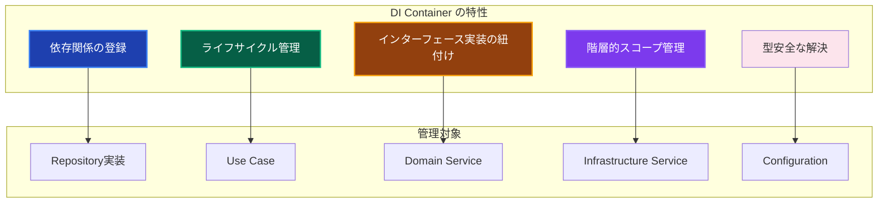
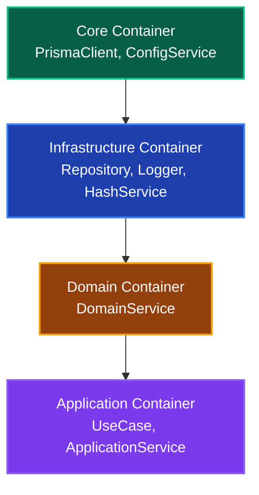

# DI Container - 依存性注入コンテナ 📦

アプリケーション全体の依存性注入を管理するコンポーネントです。TSyringeを使用して、各レイヤーのオブジェクトの生成と注入を自動化し、テスタビリティと保守性を向上させます。

---

## 🎯 コンポーネントの定義

**DI Container**は、Infrastructure Layerに属し、依存性注入の設定と管理を責務とするコンポーネントです。アプリケーションのブートストラップ時にすべての依存関係を登録し、実行時に適切なインスタンスを提供します。

### 📊 特性と役割



### 🔄 階層的コンテナ構造

本プロジェクトでは、Clean Architectureの層に基づいて**階層的な子コンテナ**を使用します：



各子コンテナは親コンテナのサービスを継承しつつ、自身のレイヤーに属するサービスを追加登録します。

---

## 📁 ファイル構成

```
src/di/
├── container.ts              # メインエントリポイント（全コンテナの初期化）
├── resolver.ts               # 型安全なresolve関数
├── tokens.ts                 # INJECTION_TOKENS定義 + ServiceTypeMap
└── containers/
    ├── core.container.ts         # Core層（PrismaClient, Config）
    ├── infrastructure.container.ts # Infrastructure層（Repository, Logger等）
    ├── domain.container.ts       # Domain層（DomainService）
    └── application.container.ts  # Application層（UseCase）
```

---

## ✅ 実装パターン

### 1. INJECTION_TOKENSの定義 🔑

Symbol.forを使用した型安全なトークン定義と、ServiceTypeMapによる型マッピングを行います。

```typescript
// src/di/tokens.ts
import type { PrismaClient } from '@/layers/infrastructure/persistence/prisma/generated';
import type { IUserRepository } from '@/layers/domain/repositories/IUserRepository';
import type { CreateUserUseCase } from '@/layers/application/usecases/user/CreateUserUseCase';

/**
 * DI トークン定義
 * Symbol.for() を使用してシングルトンSymbolを生成
 */
export const INJECTION_TOKENS = {
  // Core
  PrismaClient: Symbol.for('PrismaClient'),
  ConfigService: Symbol.for('ConfigService'),

  // Infrastructure - Services
  Logger: Symbol.for('Logger'),
  HashService: Symbol.for('HashService'),
  ErrorHandler: Symbol.for('ErrorHandler'),
  AuthSessionService: Symbol.for('AuthSessionService'),
  /** ログイン試行管理・アカウントロックアウトService */
  LoginAttemptService: Symbol.for('LoginAttemptService'),
  /** Rate Limitサービス（認証リクエスト制限） */
  RateLimitService: Symbol.for('RateLimitService'),

  // Infrastructure - Repositories
  UserRepository: Symbol.for('UserRepository'),
  SessionRepository: Symbol.for('SessionRepository'),
  // [HYGEN:REPO_TOKENS]

  // Domain
  UserDomainService: Symbol.for('UserDomainService'),

  // Application - UseCases
  CreateUserUseCase: Symbol.for('CreateUserUseCase'),
  GetUsersUseCase: Symbol.for('GetUsersUseCase'),
  SignInUseCase: Symbol.for('SignInUseCase'),
  // [HYGEN:USECASE_TOKENS]

  // Application - Services (Legacy)
  UserService: Symbol.for('UserService'),
  AuthService: Symbol.for('AuthService'),
} as const;

/**
 * トークン名からサービス型へのマッピング
 * resolve関数での型推論に使用
 */
export interface ServiceTypeMap {
  // Core
  PrismaClient: PrismaClient;
  ConfigService: IConfigService;

  // Infrastructure - Services
  Logger: ILogger;
  HashService: IHashService;
  ErrorHandler: IErrorHandler;
  AuthSessionService: IAuthSessionService;
  LoginAttemptService: ILoginAttemptService;
  RateLimitService: IRateLimitService;

  // Infrastructure - Repositories
  UserRepository: IUserRepository;
  SessionRepository: ISessionRepository;
  // [HYGEN:REPO_TYPEMAP]

  // Domain
  UserDomainService: UserDomainService;

  // Application - UseCases
  CreateUserUseCase: CreateUserUseCase;
  GetUsersUseCase: GetUsersUseCase;
  SignInUseCase: SignInUseCase;
  // [HYGEN:USECASE_TYPEMAP]

  // Application - Services (Legacy)
  UserService: UserService;
  AuthService: AuthService;
}

// 型ヘルパー
export type ServiceType<K extends keyof ServiceTypeMap> = ServiceTypeMap[K];
export type InjectionToken = (typeof INJECTION_TOKENS)[keyof typeof INJECTION_TOKENS];
```

### 2. 型安全なresolve関数 🎯

ServiceTypeMapを活用して、文字列キーから正しい型を推論します。

```typescript
// src/di/resolver.ts
import { applicationContainer } from '@/di/containers/application.container';
import { INJECTION_TOKENS, type ServiceType, type ServiceTypeMap } from '@/di/tokens';

/**
 * 型安全な依存関係解決
 * @param serviceName - ServiceTypeMapのキー名
 * @returns 対応する型のサービスインスタンス
 *
 * @example
 * // 型が自動推論される
 * const userRepo = resolve('UserRepository');  // IUserRepository
 * const useCase = resolve('CreateUserUseCase'); // CreateUserUseCase
 */
export function resolve<K extends keyof ServiceTypeMap>(
  serviceName: K,
): ServiceType<K> {
  return applicationContainer.resolve<ServiceType<K>>(
    INJECTION_TOKENS[serviceName] as any,
  );
}
```

### 3. 階層的コンテナの実装 📦

各レイヤーごとに子コンテナを作成し、依存関係の方向を制御します。

```typescript
// src/di/containers/core.container.ts
import 'reflect-metadata';
import { container } from 'tsyringe';
import { INJECTION_TOKENS } from '@/di/tokens';
import { DatabaseFactory } from '@/layers/infrastructure/persistence/DatabaseFactory';
import { ConfigService } from '@/layers/infrastructure/services/ConfigService';

export const coreContainer = container.createChildContainer();

// 重複登録を防ぐヘルパー関数
function safeRegister<T>(token: symbol, creator: new (...args: any[]) => T) {
  if (!coreContainer.isRegistered(token)) {
    coreContainer.registerSingleton(creator);
    coreContainer.register(token, { useToken: creator });
  }
}

// PrismaClient: ファクトリーパターンで管理
if (!coreContainer.isRegistered(INJECTION_TOKENS.PrismaClient)) {
  coreContainer.registerInstance(
    INJECTION_TOKENS.PrismaClient,
    DatabaseFactory.getInstance(),
  );
}

// Core Service
safeRegister(INJECTION_TOKENS.ConfigService, ConfigService);

console.log('✅ Core Container初期化完了');
```

```typescript
// src/di/containers/infrastructure.container.ts
import 'reflect-metadata';
import { coreContainer } from '@/di/containers/core.container';
import { INJECTION_TOKENS } from '@/di/tokens';
import { PrismaUserRepository } from '@/layers/infrastructure/repositories/implementations/PrismaUserRepository';
import { Logger } from '@/layers/infrastructure/services/Logger';
import { HashService } from '@/layers/infrastructure/services/HashService';
// [HYGEN:REPO_IMPORTS]

export const infrastructureContainer = coreContainer.createChildContainer();

function safeRegister<T>(token: symbol, creator: new (...args: any[]) => T) {
  if (!infrastructureContainer.isRegistered(token)) {
    infrastructureContainer.registerSingleton(creator);
    infrastructureContainer.register(token, { useToken: creator });
  }
}

// Infrastructure Services
safeRegister(INJECTION_TOKENS.Logger, Logger);
safeRegister(INJECTION_TOKENS.HashService, HashService);
safeRegister(INJECTION_TOKENS.ErrorHandler, ErrorHandler);

// Repository実装
safeRegister(INJECTION_TOKENS.UserRepository, PrismaUserRepository);
safeRegister(INJECTION_TOKENS.SessionRepository, PrismaSessionRepository);
// [HYGEN:REPO_REGISTER]

console.log('✅ Infrastructure Container初期化完了');
```

```typescript
// src/di/containers/domain.container.ts
import 'reflect-metadata';
import { infrastructureContainer } from '@/di/containers/infrastructure.container';
import { INJECTION_TOKENS } from '@/di/tokens';
import { UserDomainService } from '@/layers/domain/services/UserDomainService';

export const domainContainer = infrastructureContainer.createChildContainer();

function safeRegister<T>(token: symbol, creator: new (...args: any[]) => T) {
  if (!domainContainer.isRegistered(token)) {
    domainContainer.registerSingleton(creator);
    domainContainer.register(token, { useToken: creator });
  }
}

// Domain Services
safeRegister(INJECTION_TOKENS.UserDomainService, UserDomainService);

console.log('✅ Domain Container初期化完了');
```

```typescript
// src/di/containers/application.container.ts
import 'reflect-metadata';
import { domainContainer } from '@/di/containers/domain.container';
import { INJECTION_TOKENS } from '@/di/tokens';
import { CreateUserUseCase } from '@/layers/application/usecases/user/CreateUserUseCase';
import { SignInUseCase } from '@/layers/application/usecases/auth/SignInUseCase';
// [HYGEN:USECASE_IMPORTS]

export const applicationContainer = domainContainer.createChildContainer();

function safeRegister<T>(token: symbol, creator: new (...args: any[]) => T) {
  if (!applicationContainer.isRegistered(token)) {
    applicationContainer.registerSingleton(creator);
    applicationContainer.register(token, { useToken: creator });
  }
}

// Use Cases
safeRegister(INJECTION_TOKENS.CreateUserUseCase, CreateUserUseCase);
safeRegister(INJECTION_TOKENS.SignInUseCase, SignInUseCase);
// [HYGEN:USECASE_REGISTER]

// Legacy Services (段階的廃止予定)
safeRegister(INJECTION_TOKENS.UserService, UserService);
safeRegister(INJECTION_TOKENS.AuthService, AuthService);

console.log('✅ Application Container初期化完了');
```

### 4. メインエントリポイント 🚀

```typescript
// src/di/container.ts
import 'reflect-metadata';
import { applicationContainer } from '@/di/containers/application.container';

/**
 * 分離されたDIコンテナアーキテクチャ
 *
 * Clean Architectureの層に基づいてコンテナを分離：
 * Core → Infrastructure → Domain → Application
 */

// レイヤー別コンテナを順次初期化
import '@/di/containers/core.container';
import '@/di/containers/domain.container';
import '@/di/containers/infrastructure.container';

/**
 * 最上位のアプリケーションコンテナをデフォルトコンテナとしてエクスポート
 */
export const container = applicationContainer;

// ⚠️ resolve関数は resolver.ts から import してください
// ここでexportすると循環参照になります
```

---

## 🎯 使用方法

### Server Actionsでの使用（推奨）

```typescript
// src/app/server-actions/user/createUser.ts
'use server';

import 'reflect-metadata';

import { resolve } from '@/di/resolver';

export async function createUserAction(formData: FormData) {
  // 型安全な解決 - CreateUserUseCaseが自動推論される
  const createUserUseCase = resolve('CreateUserUseCase');

  const result = await createUserUseCase.execute({
    name: formData.get('name') as string,
    email: formData.get('email') as string,
    password: formData.get('password') as string,
  });

  return result;
}
```

### UseCase内でのコンストラクタインジェクション

```typescript
// src/layers/application/usecases/user/CreateUserUseCase.ts
import { injectable, inject } from 'tsyringe';
import { INJECTION_TOKENS } from '@/di/tokens';
import type { IUserRepository } from '@/layers/domain/repositories/IUserRepository';
import type { ILogger } from '@/layers/application/interfaces/ILogger';

@injectable()
export class CreateUserUseCase {
  constructor(
    @inject(INJECTION_TOKENS.UserRepository)
    private readonly userRepository: IUserRepository,

    @inject(INJECTION_TOKENS.Logger)
    private readonly logger: ILogger,

    @inject(INJECTION_TOKENS.HashService)
    private readonly hashService: IHashService,
  ) {}

  async execute(request: CreateUserRequest): Promise<Result<UserDTO>> {
    this.logger.info('ユーザー作成開始', { email: request.email });
    // ...
  }
}
```

---

## 🔧 新しいサービスの追加手順

### 手動追加の場合

1. **tokens.tsにトークン追加**

```typescript
// src/di/tokens.ts
export const INJECTION_TOKENS = {
  // ...既存のトークン
  NewService: Symbol.for('NewService'),  // 追加
} as const;

export interface ServiceTypeMap {
  // ...既存のマッピング
  NewService: INewService;  // 追加
}
```

2. **適切なコンテナファイルに登録**

```typescript
// レイヤーに応じて適切なcontainerファイルを選択
// Infrastructure Service → infrastructure.container.ts
// Domain Service → domain.container.ts
// UseCase → application.container.ts

safeRegister(INJECTION_TOKENS.NewService, NewService);
```

### Hygen（コード生成）を使用する場合

```bash
# UseCase生成（自動的にDI登録も行われる）
pnpm gen:usecase

# Repository生成
pnpm gen:repo
```

Hygenマーカー（`[HYGEN:USECASE_TOKENS]`等）の位置に自動的にコードが挿入されます。

---

## 🧪 テスト戦略

### setupTestEnvironmentの使用

```typescript
// tests/layers/application/usecases/user/CreateUserUseCase.test.ts
import { container } from 'tsyringe';
import { setupTestEnvironment } from '@tests/utils/helpers/testHelpers';
import { mock, MockProxy } from 'vitest-mock-extended';
import { INJECTION_TOKENS } from '@/di/tokens';

describe('CreateUserUseCase', () => {
  // 各テスト前にDIコンテナをリセット
  setupTestEnvironment();

  let useCase: CreateUserUseCase;
  let mockUserRepository: MockProxy<IUserRepository>;
  let mockLogger: MockProxy<ILogger>;
  let mockHashService: MockProxy<IHashService>;

  beforeEach(() => {
    // モックの作成
    mockUserRepository = mock<IUserRepository>();
    mockLogger = mock<ILogger>();
    mockHashService = mock<IHashService>();

    // モックをコンテナに登録
    container.registerInstance(INJECTION_TOKENS.UserRepository, mockUserRepository);
    container.registerInstance(INJECTION_TOKENS.Logger, mockLogger);
    container.registerInstance(INJECTION_TOKENS.HashService, mockHashService);

    // UseCaseの解決
    useCase = container.resolve(CreateUserUseCase);
  });

  it('正常にユーザーが作成されること', async () => {
    // Arrange
    mockHashService.hash.mockResolvedValue('hashed_password');
    mockUserRepository.create.mockResolvedValue(mockUser);

    // Act
    const result = await useCase.execute(validRequest);

    // Assert
    expect(isSuccess(result)).toBe(true);
    expect(mockUserRepository.create).toHaveBeenCalledOnce();
  });
});
```

### Singleton vs Transient の考慮

| サービス種別 | ライフサイクル | 理由 |
|------------|--------------|------|
| Repository | Singleton | DB接続プールの共有 |
| Logger | Singleton | ログ設定の一貫性 |
| HashService | Singleton | ステートレス |
| UseCase | Singleton* | 本プロジェクトではSingleton採用 |
| DomainService | Singleton | ステートレス |

*注: リクエストスコープが必要な場合はTransientに変更可能

---

## ❌ 禁止事項

### 1. 循環依存の作成

```typescript
// ❌ 禁止：AがBに依存し、BがAに依存
@injectable()
class ServiceA {
  constructor(@inject(INJECTION_TOKENS.ServiceB) private b: ServiceB) {}
}

@injectable()
class ServiceB {
  constructor(@inject(INJECTION_TOKENS.ServiceA) private a: ServiceA) {}
}
```

### 2. resolve()の直接使用をClient Componentで行う

```typescript
// ❌ 禁止：Client ComponentでDI使用
'use client';
import { resolve } from '@/di/resolver';

function ClientComponent() {
  const service = resolve('UserService'); // サーバー専用機能でエラー
}

// ✅ 正しい：Server Actionを経由する
'use server';
export async function fetchData() {
  const service = resolve('UserService');
  return await service.getData();
}
```

### 3. トークンの直接Symbol作成

```typescript
// ❌ 禁止：個別にSymbol作成
const myToken = Symbol.for('UserRepository');
container.resolve(myToken);

// ✅ 正しい：INJECTION_TOKENSを使用
container.resolve(INJECTION_TOKENS.UserRepository);
```

---

## 📚 関連ドキュメント

- [Server Actions](./server-actions.md) - Server Actions実装パターン
- [Client Component設計](./client-di.md) - Server Actions中心アプローチ
- [UseCase](./use-cases.md) - UseCase実装パターン
- [テスト戦略](../../../../testing/strategy.md) - DIを使用したテストパターン
- [コード生成](../../../code-generator.md) - Hygenによる自動生成

---

## ✅ 実装チェックリスト

### トークン追加時

- [ ] `tokens.ts`の`INJECTION_TOKENS`にSymbol追加
- [ ] `tokens.ts`の`ServiceTypeMap`に型マッピング追加
- [ ] 適切なコンテナファイルに`safeRegister`で登録
- [ ] `@injectable()`デコレータをクラスに付与
- [ ] コンストラクタで`@inject(INJECTION_TOKENS.xxx)`を使用

### テスト時

- [ ] `setupTestEnvironment()`を使用
- [ ] `vitest-mock-extended`でモック作成
- [ ] `container.registerInstance()`でモック登録
- [ ] 各テスト前にコンテナリセットを確認
