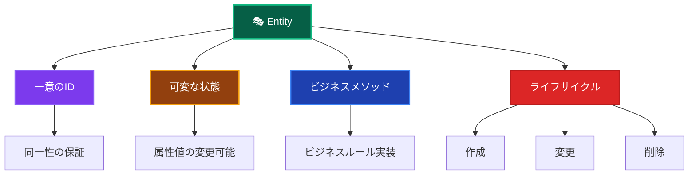

# Entities（エンティティ）🎭

このドキュメントでは、Domain Layer の Entities について、その役割と実装ルールを詳しく解説します。

---

## Entities とは？ 🏛️

Entity（エンティティ）は、**一意性を持つビジネス上重要な概念**を表現するドメインオブジェクトです。同じ属性を持つ他のオブジェクトとは区別される、独自のIDを持つオブジェクトとして定義されます。

### Entity の特徴 📋



### Entity vs Value Object の違い 🔍

| 観点 | Entity | Value Object |
|------|--------|--------------|
| **同一性** | IDによる同一性 | 値による等価性 |
| **可変性** | 状態変更可能 | 不変（Immutable） |
| **ライフサイクル** | 作成・変更・削除 | 作成のみ |
| **例** | User, Order, Product | Email, Money, Address |

---

## ✅ 何をして良いか

### 1. **一意のIDを持つ** 🆔

```typescript
// ✅ 推薦：一意のIDによる識別
export class User {
  private constructor(
    private readonly id: UserId,  // 一意のID
    private email: Email,
    private name: string,
    private experiencePoints: number,
    private level: number,
    private readonly createdAt: Date,
    private lastLoginAt?: Date
  ) {
    this.validateInvariants();
  }
  
  // IDアクセサ
  getId(): UserId {
    return this.id;
  }
  
  // 同一性判定
  equals(other: User): boolean {
    return this.id.equals(other.id);
  }
}
```

### 2. **ビジネスメソッドの実装** 🎯

```typescript
// ✅ 推薦：Entity内でのビジネスロジック実装
export class User {
  // ビジネスメソッド：経験値追加
  addExperiencePoints(points: number): void {
    if (points <= 0) {
      throw new DomainError(
        '経験値は正の値である必要があります',
        'INVALID_EXPERIENCE_POINTS'
      );
    }
    
    this.experiencePoints += points;
    this.checkLevelUp(); // 内部でレベルアップ判定
    this.validateInvariants(); // 不変条件検証
  }
  
  // ビジネスメソッド：昇格処理
  promote(): void {
    if (!this.canPromote()) {
      throw new DomainError(
        '昇格条件を満たしていません',
        'PROMOTION_NOT_ALLOWED'
      );
    }
    
    const oldLevel = this.level;
    this.level += 1;
    
    // ドメインイベント発行
    DomainEvents.raise(new UserPromotedEvent(
      this.id,
      oldLevel,
      this.level,
      new Date()
    ));
  }
  
  // ビジネスルール：昇格可能性判定
  canPromote(): boolean {
    return this.experiencePoints >= this.getRequiredExperienceForNextLevel() &&
           this.level < 10 &&
           this.isActive();
  }
}
```

### 3. **不変条件の保証** 🛡️

```typescript
// ✅ 推薦：常に妥当な状態を保証
export class User {
  private validateInvariants(): void {
    if (this.experiencePoints < 0) {
      throw new DomainError(
        '経験値は0以上である必要があります',
        'INVALID_EXPERIENCE_POINTS'
      );
    }
    
    if (this.level < 1 || this.level > 10) {
      throw new DomainError(
        'レベルは1-10の範囲である必要があります',
        'INVALID_LEVEL'
      );
    }
    
    if (this.name.trim().length === 0) {
      throw new DomainError(
        '名前は空文字列にできません',
        'INVALID_NAME'
      );
    }
    
    // メールアドレスの妥当性はValue Objectで保証済み
  }
}
```

### 4. **ファクトリーメソッドの提供** 🏭

```typescript
// ✅ 推薦：適切なオブジェクト生成メソッド
export class User {
  // 新規作成用ファクトリーメソッド
  static create(
    id: UserId,
    email: Email,
    name: string
  ): User {
    return new User(
      id,
      email,
      name,
      0,        // 初期経験値
      1,        // 初期レベル
      new Date() // 作成日時
    );
  }
  
  // 復元用ファクトリーメソッド（Repository用）
  static reconstruct(
    id: UserId,
    email: Email,
    name: string,
    experiencePoints: number,
    level: number,
    createdAt: Date,
    lastLoginAt?: Date
  ): User {
    return new User(
      id,
      email,
      name,
      experiencePoints,
      level,
      createdAt,
      lastLoginAt
    );
  }
}
```

### 5. **状態変更の制御** 🔄

```typescript
// ✅ 推薦：適切な状態変更メソッド
export class User {
  // 状態変更は専用メソッドで
  updateEmail(newEmail: Email): void {
    // ビジネスルール：メール変更の妥当性チェック
    if (this.email.equals(newEmail)) {
      return; // 同じメールアドレスの場合は何もしない
    }
    
    const oldEmail = this.email;
    this.email = newEmail;
    
    // ドメインイベント発行
    DomainEvents.raise(new UserEmailChangedEvent(
      this.id,
      oldEmail,
      newEmail,
      new Date()
    ));
    
    this.validateInvariants();
  }
  
  // サインイン処理
  recordLogin(): void {
    const now = new Date();
    const wasFirstLogin = !this.lastLoginAt;
    
    this.lastLoginAt = now;
    
    // 初回サインインボーナス
    if (wasFirstLogin) {
      this.addExperiencePoints(50);
    }
    // 連続サインインボーナス
    else if (this.isConsecutiveLogin()) {
      this.addExperiencePoints(10);
    }
  }
}
```

---

## ❌ 何をしてはならないか

### 1. **データベース操作の直接実装** 🚫

```typescript
// ❌ 禁止：Entity内でのデータベース操作
export class User {
  async save(): Promise<void> {
    const prisma = new PrismaClient(); // 禁止
    await prisma.user.update({
      where: { id: this.id.toString() },
      data: { /* ... */ }
    });
  }
  
  async delete(): Promise<void> {
    const prisma = new PrismaClient(); // 禁止
    await prisma.user.delete({ where: { id: this.id.toString() } });
  }
}
```

### 2. **UI・表示用フォーマットの実装** 🎨

```typescript
// ❌ 禁止：表示用フォーマット
export class User {
  getDisplayName(): string {
    return `${this.name}様`; // Presentation Layerの責務
  }
  
  getFormattedLevel(): string {
    return `レベル ${this.level}`; // 表示フォーマットは禁止
  }
  
  toJSON(): object {
    // API レスポンス用の変換は Application Layer の責務
    return {
      id: this.id.toString(),
      name: this.name,
      displayLevel: this.getFormattedLevel() // 禁止
    };
  }
}
```

### 3. **外部サービスの直接呼び出し** 🌐

```typescript
// ❌ 禁止：外部API呼び出し
export class User {
  async sendWelcomeEmail(): Promise<void> {
    // メール送信は Infrastructure Layer の責務
    const emailService = new SendGridService(); // 禁止
    await emailService.send({
      to: this.email.toString(),
      subject: 'Welcome!',
      body: '登録ありがとうございます'
    });
  }
  
  async uploadAvatar(file: Buffer): Promise<string> {
    // ファイルアップロードは Infrastructure Layer の責務
    const s3 = new AWS.S3(); // 禁止
    const result = await s3.upload({
      Bucket: 'avatars',
      Key: `${this.id.toString()}.jpg`,
      Body: file
    }).promise();
    
    return result.Location;
  }
}
```

### 4. **Application Layer のロジック** 📋

```typescript
// ❌ 禁止：ユースケース的なフロー制御
export class User {
  async completeRegistration(): Promise<void> {
    // 複数のサービスを組み合わせた処理は Application Layer の責務
    await this.save(); // Repository操作
    await this.sendWelcomeEmail(); // メール送信
    await this.createInitialSettings(); // 他のEntity操作
    // これらの組み合わせはUse Caseで行うべき
  }
}
```

### 5. **フレームワーク・インフラ依存** 🔧

```typescript
// ❌ 禁止：フレームワーク依存
import { NextRequest } from 'next/server'; // 禁止
import { PrismaClient } from '@prisma/client'; // 禁止

export class User {
  processRequest(req: NextRequest): void { // 禁止
    // Next.js固有の処理は Presentation Layer の責務
  }
}
```

---

## 🏗️ 設計パターンとベストプラクティス

### 1. **Rich Domain Model の採用** 💰

```typescript
// ✅ 推薦：ビジネスロジックをEntityに集約
export class User {
  // データだけでなく、振る舞いも持つ
  private constructor(/* ... */) {
    this.validateInvariants();
  }
  
  // ビジネスメソッド群
  addExperiencePoints(points: number): void { /* ... */ }
  promote(): void { /* ... */ }
  canPromote(): boolean { /* ... */ }
  isActive(): boolean { /* ... */ }
  
  // 状態変更メソッド
  updateEmail(email: Email): void { /* ... */ }
  recordLogin(): void { /* ... */ }
}

// ❌ 避ける：Anemic Domain Model（貧血モデル）
export class User {
  // データのみでビジネスロジックがない
  id: string;
  email: string;
  name: string;
  experiencePoints: number;
  level: number;
}
```

### 2. **カプセル化の徹底** 🔒

```typescript
// ✅ 推薦：適切なカプセル化
export class User {
  private constructor(
    private readonly id: UserId,     // 読み取り専用
    private email: Email,           // private
    private name: string,           // private
    private experiencePoints: number, // private
    private level: number           // private
  ) {}
  
  // 必要な情報のみ公開
  getId(): UserId { return this.id; }
  getEmail(): Email { return this.email; }
  getName(): string { return this.name; }
  getLevel(): number { return this.level; }
  
  // 状態変更は制御されたメソッド経由のみ
  updateEmail(newEmail: Email): void { /* ... */ }
}

// ❌ 避ける：直接的なプロパティアクセス
export class User {
  public id: string;    // public は避ける
  public email: string; // 直接変更可能になってしまう
  public name: string;
}
```

### 3. **ドメインイベントの活用** 📡

```typescript
// ✅ 推薦：重要なビジネスイベントの通知
export class User {
  promote(): void {
    const oldLevel = this.level;
    this.level += 1;
    
    // ビジネス上重要なイベントを発行
    DomainEvents.raise(new UserPromotedEvent(
      this.id,
      oldLevel,
      this.level,
      new Date()
    ));
  }
  
  addExperiencePoints(points: number): void {
    this.experiencePoints += points;
    
    if (this.checkLevelUp()) {
      // レベルアップイベント
      DomainEvents.raise(new UserLevelUpEvent(
        this.id,
        this.level - 1,
        this.level,
        new Date()
      ));
    }
  }
}
```

---

## 🧪 テスト戦略

### Unit Tests（単体テスト）

```typescript
// ✅ Entity テストの例
describe('User Entity', () => {
  describe('create', () => {
    it('正常なパラメータでUserを作成できる', () => {
      // Arrange
      const id = new UserId('user-123');
      const email = new Email('test@example.com');
      const name = 'テストユーザー';
      
      // Act
      const user = User.create(id, email, name);
      
      // Assert
      expect(user.getId()).toEqual(id);
      expect(user.getEmail()).toEqual(email);
      expect(user.getName()).toBe(name);
      expect(user.getLevel()).toBe(1);
      expect(user.getExperiencePoints()).toBe(0);
    });
  });
  
  describe('addExperiencePoints', () => {
    it('経験値追加でレベルアップが発生する', () => {
      // Arrange
      const user = User.create(
        new UserId('user-123'),
        new Email('test@example.com'),
        'テストユーザー'
      );
      
      // Act
      user.addExperiencePoints(1000);
      
      // Assert
      expect(user.getLevel()).toBe(2);
      expect(user.getExperiencePoints()).toBe(1000);
      
      // ドメインイベントの確認
      const events = DomainEvents.getEvents();
      expect(events).toHaveLength(1);
      expect(events[0]).toBeInstanceOf(UserLevelUpEvent);
    });
    
    it('負の経験値でエラーが発生する', () => {
      // Arrange
      const user = User.create(
        new UserId('user-123'),
        new Email('test@example.com'),
        'テストユーザー'
      );
      
      // Act & Assert
      expect(() => user.addExperiencePoints(-100))
        .toThrow('経験値は正の値である必要があります');
    });
  });
  
  describe('不変条件', () => {
    it('レベルが範囲外の場合エラーが発生する', () => {
      // Arrange & Act & Assert
      expect(() => User.reconstruct(
        new UserId('user-123'),
        new Email('test@example.com'),
        'テストユーザー',
        0,
        11, // 範囲外のレベル
        new Date()
      )).toThrow('レベルは1-10の範囲である必要があります');
    });
  });
});
```

---

## 🔍 実装チェックリスト

Entity を実装する際の確認事項：

### 基本構造

- [ ] 一意のIDを持っている
- [ ] プライベートコンストラクタを使用している  
- [ ] ファクトリーメソッド（create/reconstruct）を提供している
- [ ] 適切なgetterメソッドを提供している

### ビジネスロジック

- [ ] ビジネスメソッドを Entity 内に実装している
- [ ] 不変条件を validateInvariants() で検証している
- [ ] 状態変更は専用メソッドで制御している
- [ ] 重要なイベントでドメインイベントを発行している

### 禁止事項の回避

- [ ] データベース操作を直接実装していない
- [ ] UI・表示フォーマットを実装していない
- [ ] 外部サービスを直接呼び出していない
- [ ] フレームワークに依存していない

### テスト

- [ ] 各ビジネスメソッドの単体テストがある
- [ ] 不変条件違反のテストがある
- [ ] ドメインイベント発行のテストがある
- [ ] ファクトリーメソッドのテストがある

---

**Entity は Domain Layer の中核となるコンポーネントです。ビジネスルールを適切に実装し、技術的詳細から独立させることが重要です！** 🎭✨
