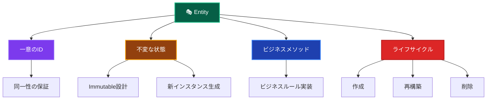

# Entities（エンティティ）🎭

このドキュメントでは、Domain Layer の Entities について、その役割と実装ルールを詳しく解説します。

---

## Entities とは？ 🏛️

Entity（エンティティ）は、**一意性を持つビジネス上重要な概念**を表現するドメインオブジェクトです。同じ属性を持つ他のオブジェクトとは区別される、独自のIDを持つオブジェクトとして定義されます。

### Entity の特徴 📋



### Entity vs Value Object の違い 🔍

| 観点               | Entity               | Value Object          |
| ------------------ | -------------------- | --------------------- |
| **同一性**         | IDによる同一性       | 値による等価性        |
| **可変性**         | 不変（Immutable）    | 不変（Immutable）     |
| **変更方法**       | 新インスタンス生成   | 新インスタンス生成    |
| **ライフサイクル** | 作成・再構築・削除   | 作成・廃棄のみ        |
| **例**             | User, Order, Product | Email, Money, Address |

---

## 🎯 Entity 設計原則

### 🔒 Immutable設計の重要性

**すべてのEntityは基本的にimmutable（不変）でなければなりません。**

従来のOOP教育では「Entityは可変（mutable）」とされることが多いですが、**現代的なドメイン駆動設計では、EntityもImmutableにすることが強く推奨されます。**

#### なぜEntityもImmutableにすべきなのか？

1. **スレッドセーフ性** 🧵

   - 複数のスレッドから同時にアクセスされても安全
   - 競合状態（Race Condition）の回避

2. **予期しない副作用の防止** 🛡️

   - オブジェクトが他の場所で変更される心配がない
   - バグの原因となる「アクション・アット・ア・ディスタンス」を防止

3. **テストの簡単さ** 🧪

   - 状態が変わらないため、テストの予測が容易
   - モックやスタブの設定が単純

4. **イベントソーシングとの親和性** 📊
   - 不変のオブジェクトはイベントストアに保存しやすい
   - 履歴追跡が容易

#### Immutable Entity実装パターン

```typescript
// ✅ 正しいImmutable Entity（public readonly パターン）
export class User {
 public readonly id: UserId;
 public readonly email: Email;
 public readonly name: string;
 public readonly passwordHash: string;
 public readonly createdAt: Date;
 public readonly updatedAt: Date;

 private constructor(props: UserProps) {
  this.id = props.id;
  this.email = props.email;
  this.name = props.name;
  this.passwordHash = props.passwordHash;
  this.createdAt = props.createdAt;
  this.updatedAt = props.updatedAt;
  this.validateInvariants();
 }

 // ファクトリーメソッド：新規作成
 static create(input: CreateUserInput): User {
  const now = new Date();
  return new User({
   id: UserId.generate(),
   email: input.email,
   name: input.name,
   passwordHash: input.passwordHash,
   createdAt: now,
   updatedAt: now,
  });
 }

 // ファクトリーメソッド：再構築（永続化から復元）
 static reconstruct(props: UserProps): User {
  return new User(props);
 }

 // 新しいインスタンスを返すビジネスメソッド
 updateProfile(email: Email, name: string): User {
  return new User({
   ...this.toProps(),
   email,
   name,
   updatedAt: new Date(),
  });
 }

 private toProps(): UserProps {
  return {
   id: this.id,
   email: this.email,
   name: this.name,
   passwordHash: this.passwordHash,
   createdAt: this.createdAt,
   updatedAt: this.updatedAt,
  };
 }
}

// ❌ 間違った可変実装
export class User {
 public id: UserId;    // ❌ readonly がない = mutable
 public email: Email;  // ❌ readonly がない = mutable
 public name: string;  // ❌ readonly がない = mutable

 // ❌ 状態を変更するメソッド（void を返す）
 updateProfile(email: Email, name: string): void {
  this.email = email;  // ❌ 危険！元のインスタンスを変更
  this.name = name;    // ❌ 危険！元のインスタンスを変更
 }
}
```

#### UseCaseでの使い方

```typescript
// ✅ Immutable Entityの正しい使い方
export class UpdateUserUseCase {
 async execute(
  request: UpdateUserRequest,
 ): Promise<Result<UpdateUserResponse>> {
  const existingUser = await this.userRepository.findById(
   new UserId(request.userId),
  );

  // 新しいインスタンスを生成（existingUserは変更されない）
  const updatedUser = existingUser.updateProfile(
   new Email(request.email),
   request.name,
  );

  // 新しいインスタンスを永続化
  await this.userRepository.update(updatedUser);

  // public readonly で直接アクセス
  return success({
   id: updatedUser.id.value,
   email: updatedUser.email.value,
   name: updatedUser.name,
   updatedAt: updatedUser.updatedAt,  // 直接アクセス（getterではない）
  });
 }
}
```

---

## ✅ 何をして良いか

### 1. **一意のIDを持つ** 🆔

```typescript
// ✅ 推薦：一意のIDによる識別（public readonly パターン）
export class User {
 public readonly id: UserId;        // 一意のID
 public readonly email: Email;
 public readonly name: string;
 public readonly createdAt: Date;
 public readonly updatedAt: Date;

 private constructor(props: UserProps) {
  this.id = props.id;
  this.email = props.email;
  this.name = props.name;
  this.createdAt = props.createdAt;
  this.updatedAt = props.updatedAt;
  this.validateInvariants();
 }

 // 同一性判定
 equals(other: User): boolean {
  return this.id.equals(other.id);
 }
}
```

### 2. **ビジネスメソッドの実装（Immutableパターン）** 🎯

```typescript
// ✅ 推薦：Entity内でのビジネスロジック実装（新インスタンス返却）
export class User {
 public readonly id: UserId;
 public readonly experiencePoints: number;
 public readonly level: number;
 // ... その他のプロパティ

 // ビジネスメソッド：経験値追加（新インスタンスを返す）
 addExperiencePoints(points: number): User {
  if (points <= 0) {
   throw new DomainError(
    '経験値は正の値である必要があります',
    'INVALID_EXPERIENCE_POINTS',
   );
  }

  const newExperiencePoints = this.experiencePoints + points;
  const newLevel = this.calculateLevelFromExperience(newExperiencePoints);

  return new User({
   ...this.toProps(),
   experiencePoints: newExperiencePoints,
   level: newLevel,
   updatedAt: new Date(),
  });
 }

 // ビジネスメソッド：昇格処理（新インスタンスを返す）
 promote(): User {
  if (!this.canPromote()) {
   throw new DomainError('昇格条件を満たしていません', 'PROMOTION_NOT_ALLOWED');
  }

  return new User({
   ...this.toProps(),
   level: this.level + 1,
   updatedAt: new Date(),
  });
 }

 // ビジネスルール：昇格可能性判定（読み取り専用メソッド）
 canPromote(): boolean {
  return (
   this.experiencePoints >= this.getRequiredExperienceForNextLevel() &&
   this.level < 10 &&
   this.isActive
  );
 }

 // 内部ヘルパー
 private toProps(): UserProps {
  return {
   id: this.id,
   experiencePoints: this.experiencePoints,
   level: this.level,
   // ... その他のプロパティ
  };
 }
}
```

### 3. **不変条件の保証** 🛡️

```typescript
// ✅ 推薦：常に妥当な状態を保証
export class User {
 private validateInvariants(): void {
  if (this.experiencePoints < 0) {
   throw new DomainError(
    '経験値は0以上である必要があります',
    'INVALID_EXPERIENCE_POINTS',
   );
  }

  if (this.level < 1 || this.level > 10) {
   throw new DomainError(
    'レベルは1-10の範囲である必要があります',
    'INVALID_LEVEL',
   );
  }

  if (this.name.trim().length === 0) {
   throw new DomainError('名前は空文字列にできません', 'INVALID_NAME');
  }

  // メールアドレスの妥当性はValue Objectで保証済み
 }
}
```

### 4. **ファクトリーメソッドの提供** 🏭

```typescript
// ✅ 推薦：適切なオブジェクト生成メソッド
export class User {
 // 新規作成用ファクトリーメソッド
 static create(id: UserId, email: Email, name: string): User {
  return new User(
   id,
   email,
   name,
   0, // 初期経験値
   1, // 初期レベル
   new Date(), // 作成日時
  );
 }

 // 復元用ファクトリーメソッド（Repository用）
 static reconstruct(
  id: UserId,
  email: Email,
  name: string,
  experiencePoints: number,
  level: number,
  createdAt: Date,
  lastLoginAt?: Date,
 ): User {
  return new User(
   id,
   email,
   name,
   experiencePoints,
   level,
   createdAt,
   lastLoginAt,
  );
 }
}
```

### 5. **状態変更の制御（新インスタンス返却）** 🔄

```typescript
// ✅ 推薦：適切な状態変更メソッド（Immutableパターン）
export class User {
 public readonly email: Email;
 public readonly lastLoginAt: Date | null;
 // ... その他のプロパティ

 // 状態変更は新インスタンスを返す専用メソッドで
 updateEmail(newEmail: Email): User {
  // ビジネスルール：メール変更の妥当性チェック
  if (this.email.equals(newEmail)) {
   return this; // 同じメールアドレスの場合は自身を返す
  }

  // 新しいインスタンスを返す（元のオブジェクトは変更しない）
  return new User({
   ...this.toProps(),
   email: newEmail,
   updatedAt: new Date(),
  });
 }

 // サインイン処理（新インスタンスを返す）
 recordLogin(): User {
  const now = new Date();
  const wasFirstLogin = !this.lastLoginAt;

  let updatedUser = new User({
   ...this.toProps(),
   lastLoginAt: now,
   updatedAt: now,
  });

  // 初回サインインボーナス
  if (wasFirstLogin) {
   updatedUser = updatedUser.addExperiencePoints(50);
  }
  // 連続サインインボーナス
  else if (this.isConsecutiveLogin()) {
   updatedUser = updatedUser.addExperiencePoints(10);
  }

  return updatedUser;
 }
}
```

---

## ❌ 何をしてはならないか

### 1. **データベース操作の直接実装** 🚫

```typescript
// ❌ 禁止：Entity内でのデータベース操作
export class User {
 async save(): Promise<void> {
  const prisma = new PrismaClient(); // 禁止
  await prisma.user.update({
   where: { id: this.id.value },
   data: {
    /* ... */
   },
  });
 }

 async delete(): Promise<void> {
  const prisma = new PrismaClient(); // 禁止
  await prisma.user.delete({ where: { id: this.id.value } });
 }
}
```

### 2. **UI・表示用フォーマットの実装** 🎨

```typescript
// ❌ 禁止：表示用フォーマット
export class User {
 getDisplayName(): string {
  return `${this.name}様`; // Presentation Layerの責務
 }

 getFormattedLevel(): string {
  return `レベル ${this.level}`; // 表示フォーマットは禁止
 }

 toJSON(): object {
  // API レスポンス用の変換は Application Layer の責務
  return {
   id: this.id.value,
   name: this.name,
   displayLevel: this.getFormattedLevel(), // 禁止
  };
 }
}
```

### 3. **外部サービスの直接呼び出し** 🌐

```typescript
// ❌ 禁止：外部API呼び出し
export class User {
 async sendWelcomeEmail(): Promise<void> {
  // メール送信は Infrastructure Layer の責務
  const emailService = new SendGridService(); // 禁止
  await emailService.send({
   to: this.email.value,
   subject: 'Welcome!',
   body: '登録ありがとうございます',
  });
 }

 async uploadAvatar(file: Buffer): Promise<string> {
  // ファイルアップロードは Infrastructure Layer の責務
  const s3 = new AWS.S3(); // 禁止
  const result = await s3
   .upload({
    Bucket: 'avatars',
    Key: `${this.id.value}.jpg`,
    Body: file,
   })
   .promise();

  return result.Location;
 }
}
```

### 4. **Application Layer のロジック** 📋

```typescript
// ❌ 禁止：ユースケース的なフロー制御
export class User {
 async completeRegistration(): Promise<void> {
  // 複数のサービスを組み合わせた処理は Application Layer の責務
  await this.save(); // Repository操作
  await this.sendWelcomeEmail(); // メール送信
  await this.createInitialSettings(); // 他のEntity操作
  // これらの組み合わせはUse Caseで行うべき
 }
}
```

### 5. **フレームワーク・インフラ依存** 🔧

```typescript
// ❌ 禁止：フレームワーク依存
import { PrismaClient } from '@prisma/client'; // 禁止
import { NextRequest } from 'next/server'; // 禁止

export class User {
 processRequest(req: NextRequest): void {
  // 禁止
  // Next.js固有の処理は Presentation Layer の責務
 }
}
```

---

## 🏗️ 設計パターンとベストプラクティス

### 1. **Rich Domain Model の採用（Immutableパターン）** 💰

```typescript
// ✅ 推薦：ビジネスロジックをEntityに集約（不変設計）
export class User {
 public readonly id: UserId;
 public readonly email: Email;
 public readonly name: string;
 public readonly experiencePoints: number;
 public readonly level: number;
 public readonly isActive: boolean;

 private constructor(props: UserProps) {
  // 全プロパティを設定
  this.id = props.id;
  this.email = props.email;
  // ...
  this.validateInvariants();
 }

 // ビジネスメソッド群（新インスタンスを返す）
 addExperiencePoints(points: number): User { /* 新インスタンス返却 */ }
 promote(): User { /* 新インスタンス返却 */ }
 updateEmail(email: Email): User { /* 新インスタンス返却 */ }
 recordLogin(): User { /* 新インスタンス返却 */ }

 // 読み取り専用判定メソッド
 canPromote(): boolean { /* 状態を変更しない */ }
}

// ❌ 避ける：Anemic Domain Model（貧血モデル）
export class User {
 // データのみでビジネスロジックがない
 id: string;
 email: string;
 name: string;
 experiencePoints: number;
 level: number;
}
```

### 2. **カプセル化の徹底（public readonly パターン）** 🔒

```typescript
// ✅ 推薦：public readonly による適切なカプセル化
export class User {
 public readonly id: UserId;       // 読み取り専用で公開
 public readonly email: Email;     // 読み取り専用で公開
 public readonly name: string;     // 読み取り専用で公開
 public readonly level: number;    // 読み取り専用で公開
 public readonly createdAt: Date;
 public readonly updatedAt: Date;

 private constructor(props: UserProps) {
  this.id = props.id;
  this.email = props.email;
  this.name = props.name;
  this.level = props.level;
  this.createdAt = props.createdAt;
  this.updatedAt = props.updatedAt;
  this.validateInvariants();
 }

 // 状態変更は新インスタンスを返すメソッド経由のみ
 updateEmail(newEmail: Email): User {
  return new User({
   ...this.toProps(),
   email: newEmail,
   updatedAt: new Date(),
  });
 }

 private toProps(): UserProps {
  return {
   id: this.id,
   email: this.email,
   name: this.name,
   level: this.level,
   createdAt: this.createdAt,
   updatedAt: this.updatedAt,
  };
 }
}

// ❌ 避ける：mutableなpublicプロパティ
export class User {
 public id: string;    // ❌ readonlyがない = 外部から変更可能
 public email: string; // ❌ 直接変更可能になってしまう
 public name: string;
}
```

**getterメソッドは禁止、public readonly を使用:**

| 観点 | public readonly | getter メソッド |
|------|-----------------|-----------------|
| **使用可否** | ✅ 必須 | ❌ 禁止 |
| **アクセス** | `user.email` | ~~`user.getEmail()`~~ |
| **理由** | シンプルで明確 | 不要な複雑性 |
| **Immutability** | TypeScriptで保証 | 実装依存 |

> ⚠️ **重要**: Entityでは `get` プレフィックス付きのgetterメソッド（`getEmail()`, `getName()` 等）は使用禁止です。
> `public readonly` で直接プロパティにアクセスしてください。

### 3. **ドメインイベントの活用（Immutableパターン）** 📡

```typescript
// ✅ 推薦：重要なビジネスイベントの通知（UseCase側で処理）
export class User {
 public readonly level: number;
 public readonly experiencePoints: number;

 // 昇格処理（新インスタンスを返す）
 promote(): User {
  const newLevel = this.level + 1;

  return new User({
   ...this.toProps(),
   level: newLevel,
   updatedAt: new Date(),
  });
  // 注: イベント発行はUseCase側で行う
 }

 // 経験値追加（新インスタンスを返す）
 addExperiencePoints(points: number): User {
  const newExperiencePoints = this.experiencePoints + points;
  const newLevel = this.calculateLevelFromExperience(newExperiencePoints);

  return new User({
   ...this.toProps(),
   experiencePoints: newExperiencePoints,
   level: newLevel,
   updatedAt: new Date(),
  });
 }

 // レベルアップ判定（読み取り専用）
 hasLeveledUp(previousLevel: number): boolean {
  return this.level > previousLevel;
 }
}

// UseCase でのイベント発行例
const previousLevel = user.level;
const updatedUser = user.addExperiencePoints(1000);

if (updatedUser.hasLeveledUp(previousLevel)) {
 DomainEvents.raise(
  new UserLevelUpEvent(updatedUser.id, previousLevel, updatedUser.level, new Date()),
 );
}
```

---

## 🧪 テスト戦略

### Unit Tests（単体テスト）

```typescript
// ✅ Entity テストの例（public readonly パターン）
describe('User Entity', () => {
 describe('create', () => {
  it('正常なパラメータでUserを作成できる', () => {
   // Arrange
   const id = new UserId('user-123');
   const email = new Email('test@example.com');
   const name = 'テストユーザー';

   // Act
   const user = User.create({ id, email, name });

   // Assert（直接プロパティアクセス）
   expect(user.id).toEqual(id);
   expect(user.email).toEqual(email);
   expect(user.name).toBe(name);
   expect(user.level).toBe(1);
   expect(user.experiencePoints).toBe(0);
  });
 });

 describe('addExperiencePoints', () => {
  it('経験値追加でレベルアップが発生する', () => {
   // Arrange
   const user = User.create({
    id: new UserId('user-123'),
    email: new Email('test@example.com'),
    name: 'テストユーザー',
   });

   // Act（新インスタンスを受け取る）
   const updatedUser = user.addExperiencePoints(1000);

   // Assert（元のuserは変更されない）
   expect(user.level).toBe(1);
   expect(user.experiencePoints).toBe(0);

   // 新しいインスタンスの確認
   expect(updatedUser.level).toBe(2);
   expect(updatedUser.experiencePoints).toBe(1000);
  });

  it('負の経験値でエラーが発生する', () => {
   // Arrange
   const user = User.create({
    id: new UserId('user-123'),
    email: new Email('test@example.com'),
    name: 'テストユーザー',
   });

   // Act & Assert
   expect(() => user.addExperiencePoints(-100)).toThrow(
    '経験値は正の値である必要があります',
   );
  });
 });

 describe('不変条件', () => {
  it('レベルが範囲外の場合エラーが発生する', () => {
   // Arrange & Act & Assert
   expect(() =>
    User.reconstruct({
     id: new UserId('user-123'),
     email: new Email('test@example.com'),
     name: 'テストユーザー',
     experiencePoints: 0,
     level: 11, // 範囲外のレベル
     createdAt: new Date(),
     updatedAt: new Date(),
    }),
   ).toThrow('レベルは1-10の範囲である必要があります');
  });
 });
});
```

---

## 🔍 実装チェックリスト

Entity を実装する際の確認事項：

### 基本構造

- [ ] 一意のIDを持っている（Value Object として）
- [ ] プライベートコンストラクタを使用している
- [ ] ファクトリーメソッド（create/reconstruct）を提供している
- [ ] `public readonly` でプロパティを公開している（getterメソッドは禁止）
- [ ] `toProps()` メソッドで内部状態を取得できる

### Immutable設計

- [ ] 全プロパティが `readonly` である
- [ ] 状態変更メソッドは新インスタンスを返す（`void` ではない）
- [ ] 元のインスタンスは変更されない
- [ ] 不変条件を validateInvariants() で検証している

### ビジネスロジック

- [ ] ビジネスメソッドを Entity 内に実装している
- [ ] 判定メソッド（canXxx, isXxx）は `boolean` を返す
- [ ] 更新メソッドは新しい `Entity` インスタンスを返す

### 禁止事項の回避

- [ ] getterメソッド（`getXxx()`）を使用していない
- [ ] データベース操作を直接実装していない
- [ ] UI・表示フォーマットを実装していない
- [ ] 外部サービスを直接呼び出していない
- [ ] フレームワークに依存していない

### テスト

- [ ] 各ビジネスメソッドの単体テストがある
- [ ] 不変条件違反のテストがある
- [ ] Immutability（元のインスタンスが変更されないこと）のテストがある
- [ ] ファクトリーメソッドのテストがある

---

**Entity は Domain Layer の中核となるコンポーネントです。ビジネスルールを適切に実装し、技術的詳細から独立させることが重要です！** 🎭✨
