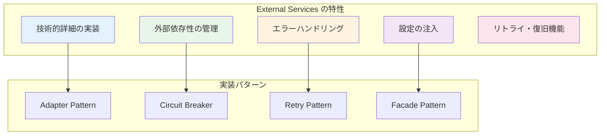
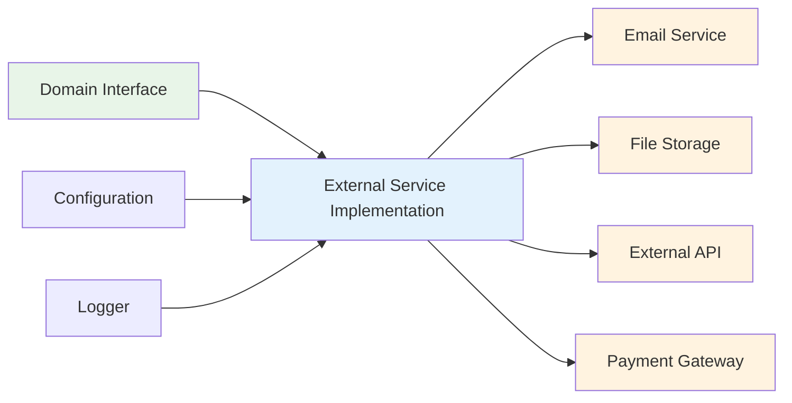

# External Services - 外部サービス実装 🌐

外部システムとの連携を担当するコンポーネントです。メール送信、API呼び出し、ファイルストレージなど、アプリケーション外部のサービスとの統合を責務とします。

---

## 🎯 コンポーネントの定義

**External Services**は、Infrastructure Layerに属し、外部システムやサードパーティサービスとの連携を具体的に実装するコンポーネントです。Domain Layerで定義されたインターフェースを実装し、実際の技術的詳細を隠蔽します。

### 📊 特性と役割



### 🔄 外部サービスとの関係性



---

## ✅ 何をして良いか

### 1. メールサービス実装 📧

**Domain Interfaceを実装した具体的なメール送信サービス**

```typescript
// Domain Interface (参考)
export interface IEmailService {
  sendWelcomeEmail(email: string, name: string): Promise<void>;
  sendPasswordResetEmail(email: string, resetToken: string): Promise<void>;
  sendPromotionNotification(email: string, name: string, level: number): Promise<void>;
}

// ✅ 許可：SendGrid実装
export class SendGridEmailService implements IEmailService {
  private readonly client: sgMail.MailService;
  
  constructor(
    private readonly apiKey: string,
    private readonly fromEmail: string,
    private readonly logger: ILogger
  ) {
    this.client = sgMail;
    this.client.setApiKey(this.apiKey);
  }
  
  async sendWelcomeEmail(email: string, name: string): Promise<void> {
    this.logger.info('ウェルカムメール送信開始', { email, name });
    
    try {
      const msg = {
        to: email,
        from: this.fromEmail,
        subject: 'ようこそ！アカウント作成が完了しました',
        html: this.buildWelcomeEmailTemplate(name),
        text: `${name}さん、ようこそ！アカウント作成が完了しました。`
      };
      
      await this.client.send(msg);
      this.logger.info('ウェルカムメール送信完了', { email });
      
    } catch (error) {
      this.logger.error('ウェルカムメール送信失敗', { email, error });
      throw new ExternalServiceError(
        'ウェルカムメールの送信に失敗しました',
        'EMAIL_SEND_FAILED',
        error
      );
    }
  }
  
  async sendPasswordResetEmail(email: string, resetToken: string): Promise<void> {
    this.logger.info('パスワードリセットメール送信開始', { email });
    
    try {
      const resetUrl = `${process.env.APP_URL}/reset-password?token=${resetToken}`;
      
      const msg = {
        to: email,
        from: this.fromEmail,
        subject: 'パスワードリセットのご案内',
        html: this.buildPasswordResetTemplate(resetUrl),
        text: `パスワードリセット用URL: ${resetUrl}`
      };
      
      await this.client.send(msg);
      this.logger.info('パスワードリセットメール送信完了', { email });
      
    } catch (error) {
      this.logger.error('パスワードリセットメール送信失敗', { email, error });
      throw new ExternalServiceError(
        'パスワードリセットメールの送信に失敗しました',
        'EMAIL_SEND_FAILED',
        error
      );
    }
  }
  
  async sendPromotionNotification(email: string, name: string, level: number): Promise<void> {
    this.logger.info('昇格通知メール送信開始', { email, name, level });
    
    try {
      const msg = {
        to: email,
        from: this.fromEmail,
        subject: `🎉 レベルアップ！レベル${level}になりました`,
        html: this.buildPromotionTemplate(name, level),
        text: `${name}さん、おめでとうございます！レベル${level}に昇格しました。`
      };
      
      await this.client.send(msg);
      this.logger.info('昇格通知メール送信完了', { email, level });
      
    } catch (error) {
      this.logger.error('昇格通知メール送信失敗', { email, level, error });
      throw new ExternalServiceError(
        '昇格通知メールの送信に失敗しました',
        'EMAIL_SEND_FAILED',
        error
      );
    }
  }
  
  private buildWelcomeEmailTemplate(name: string): string {
    return `
      <!DOCTYPE html>
      <html>
        <head>
          <meta charset="utf-8">
          <title>ようこそ！</title>
        </head>
        <body>
          <h1>ようこそ、${name}さん！</h1>
          <p>アカウント作成が完了しました。</p>
          <p>これからよろしくお願いいたします。</p>
        </body>
      </html>
    `;
  }
  
  private buildPasswordResetTemplate(resetUrl: string): string {
    return `
      <!DOCTYPE html>
      <html>
        <head>
          <meta charset="utf-8">
          <title>パスワードリセット</title>
        </head>
        <body>
          <h1>パスワードリセットのご案内</h1>
          <p>以下のリンクからパスワードをリセットしてください：</p>
          <a href="${resetUrl}">パスワードリセット</a>
          <p>このリンクは24時間有効です。</p>
        </body>
      </html>
    `;
  }
  
  private buildPromotionTemplate(name: string, level: number): string {
    return `
      <!DOCTYPE html>
      <html>
        <head>
          <meta charset="utf-8">
          <title>レベルアップ通知</title>
        </head>
        <body>
          <h1>🎉 おめでとうございます！</h1>
          <p>${name}さん、レベル${level}に昇格しました！</p>
          <p>これからも頑張ってください。</p>
        </body>
      </html>
    `;
  }
}
```

### 2. ファイルストレージサービス実装 📁

**S3互換ストレージサービスの実装**

```typescript
// Domain Interface (参考)
export interface IFileStorageService {
  uploadFile(bucket: string, key: string, file: Buffer, metadata?: Record<string, string>): Promise<FileUploadResult>;
  downloadFile(bucket: string, key: string): Promise<Buffer>;
  deleteFile(bucket: string, key: string): Promise<void>;
  generatePresignedUrl(bucket: string, key: string, expiresIn: number): Promise<string>;
}

// ✅ 許可：AWS S3実装
export class AwsS3FileStorageService implements IFileStorageService {
  private readonly s3Client: S3Client;
  
  constructor(
    private readonly region: string,
    private readonly accessKeyId: string,
    private readonly secretAccessKey: string,
    private readonly logger: ILogger
  ) {
    this.s3Client = new S3Client({
      region: this.region,
      credentials: {
        accessKeyId: this.accessKeyId,
        secretAccessKey: this.secretAccessKey
      }
    });
  }
  
  async uploadFile(
    bucket: string, 
    key: string, 
    file: Buffer, 
    metadata?: Record<string, string>
  ): Promise<FileUploadResult> {
    this.logger.info('ファイルアップロード開始', { bucket, key, size: file.length });
    
    try {
      const command = new PutObjectCommand({
        Bucket: bucket,
        Key: key,
        Body: file,
        Metadata: metadata,
        ContentType: this.inferContentType(key)
      });
      
      const result = await this.s3Client.send(command);
      
      const uploadResult: FileUploadResult = {
        bucket,
        key,
        etag: result.ETag || '',
        url: `https://${bucket}.s3.${this.region}.amazonaws.com/${key}`,
        size: file.length
      };
      
      this.logger.info('ファイルアップロード完了', uploadResult);
      return uploadResult;
      
    } catch (error) {
      this.logger.error('ファイルアップロード失敗', { bucket, key, error });
      throw new ExternalServiceError(
        'ファイルのアップロードに失敗しました',
        'FILE_UPLOAD_FAILED',
        error
      );
    }
  }
  
  async downloadFile(bucket: string, key: string): Promise<Buffer> {
    this.logger.info('ファイルダウンロード開始', { bucket, key });
    
    try {
      const command = new GetObjectCommand({
        Bucket: bucket,
        Key: key
      });
      
      const result = await this.s3Client.send(command);
      
      if (!result.Body) {
        throw new ExternalServiceError(
          'ファイルが見つかりません',
          'FILE_NOT_FOUND'
        );
      }
      
      const buffer = await this.streamToBuffer(result.Body as any);
      this.logger.info('ファイルダウンロード完了', { bucket, key, size: buffer.length });
      
      return buffer;
      
    } catch (error) {
      this.logger.error('ファイルダウンロード失敗', { bucket, key, error });
      throw new ExternalServiceError(
        'ファイルのダウンロードに失敗しました',
        'FILE_DOWNLOAD_FAILED',
        error
      );
    }
  }
  
  async deleteFile(bucket: string, key: string): Promise<void> {
    this.logger.info('ファイル削除開始', { bucket, key });
    
    try {
      const command = new DeleteObjectCommand({
        Bucket: bucket,
        Key: key
      });
      
      await this.s3Client.send(command);
      this.logger.info('ファイル削除完了', { bucket, key });
      
    } catch (error) {
      this.logger.error('ファイル削除失敗', { bucket, key, error });
      throw new ExternalServiceError(
        'ファイルの削除に失敗しました',
        'FILE_DELETE_FAILED',
        error
      );
    }
  }
  
  async generatePresignedUrl(bucket: string, key: string, expiresIn: number): Promise<string> {
    this.logger.info('署名付きURL生成開始', { bucket, key, expiresIn });
    
    try {
      const command = new GetObjectCommand({
        Bucket: bucket,
        Key: key
      });
      
      const url = await getSignedUrl(this.s3Client, command, { expiresIn });
      this.logger.info('署名付きURL生成完了', { bucket, key });
      
      return url;
      
    } catch (error) {
      this.logger.error('署名付きURL生成失敗', { bucket, key, error });
      throw new ExternalServiceError(
        '署名付きURLの生成に失敗しました',
        'PRESIGNED_URL_FAILED',
        error
      );
    }
  }
  
  private inferContentType(key: string): string {
    const ext = key.split('.').pop()?.toLowerCase();
    const mimeTypes: Record<string, string> = {
      'jpg': 'image/jpeg',
      'jpeg': 'image/jpeg',
      'png': 'image/png',
      'gif': 'image/gif',
      'pdf': 'application/pdf',
      'txt': 'text/plain',
      'json': 'application/json'
    };
    
    return mimeTypes[ext || ''] || 'application/octet-stream';
  }
  
  private async streamToBuffer(stream: any): Promise<Buffer> {
    const chunks: Uint8Array[] = [];
    for await (const chunk of stream) {
      chunks.push(chunk);
    }
    return Buffer.concat(chunks);
  }
}
```

### 3. 外部API呼び出しサービス実装 🔌

**サードパーティAPIとの連携実装**

```typescript
// Domain Interface (参考)
export interface IExternalApiService {
  validateAddress(address: string): Promise<AddressValidationResult>;
  getExchangeRate(fromCurrency: string, toCurrency: string): Promise<number>;
  sendSmsNotification(phoneNumber: string, message: string): Promise<void>;
}

// ✅ 許可：外部API実装（Circuit Breaker付き）
export class ExternalApiService implements IExternalApiService {
  private readonly httpClient: AxiosInstance;
  private readonly circuitBreaker: CircuitBreaker;
  
  constructor(
    private readonly baseUrl: string,
    private readonly apiKey: string,
    private readonly timeout: number,
    private readonly logger: ILogger
  ) {
    this.httpClient = axios.create({
      baseURL: this.baseUrl,
      timeout: this.timeout,
      headers: {
        'Authorization': `Bearer ${this.apiKey}`,
        'Content-Type': 'application/json'
      }
    });
    
    // Circuit Breaker設定
    this.circuitBreaker = new CircuitBreaker(this.makeApiCall.bind(this), {
      failureThreshold: 5,
      successThreshold: 3,
      timeout: this.timeout,
      resetTimeout: 30000
    });
    
    this.setupInterceptors();
  }
  
  async validateAddress(address: string): Promise<AddressValidationResult> {
    this.logger.info('住所検証API呼び出し開始', { address });
    
    try {
      const response = await this.circuitBreaker.fire('POST', '/validate-address', {
        address
      });
      
      const result: AddressValidationResult = {
        isValid: response.data.valid,
        normalizedAddress: response.data.normalized_address,
        suggestions: response.data.suggestions || [],
        confidence: response.data.confidence
      };
      
      this.logger.info('住所検証API呼び出し完了', { address, isValid: result.isValid });
      return result;
      
    } catch (error) {
      this.logger.error('住所検証API呼び出し失敗', { address, error });
      throw new ExternalServiceError(
        '住所検証サービスとの通信に失敗しました',
        'ADDRESS_VALIDATION_FAILED',
        error
      );
    }
  }
  
  async getExchangeRate(fromCurrency: string, toCurrency: string): Promise<number> {
    this.logger.info('為替レートAPI呼び出し開始', { fromCurrency, toCurrency });
    
    try {
      const response = await this.circuitBreaker.fire('GET', '/exchange-rate', {
        params: {
          from: fromCurrency,
          to: toCurrency
        }
      });
      
      const rate = response.data.rate;
      this.logger.info('為替レートAPI呼び出し完了', { fromCurrency, toCurrency, rate });
      
      return rate;
      
    } catch (error) {
      this.logger.error('為替レートAPI呼び出し失敗', { fromCurrency, toCurrency, error });
      throw new ExternalServiceError(
        '為替レートサービスとの通信に失敗しました',
        'EXCHANGE_RATE_FAILED',
        error
      );
    }
  }
  
  async sendSmsNotification(phoneNumber: string, message: string): Promise<void> {
    this.logger.info('SMS送信API呼び出し開始', { phoneNumber });
    
    try {
      await this.circuitBreaker.fire('POST', '/send-sms', {
        phone_number: phoneNumber,
        message
      });
      
      this.logger.info('SMS送信API呼び出し完了', { phoneNumber });
      
    } catch (error) {
      this.logger.error('SMS送信API呼び出し失敗', { phoneNumber, error });
      throw new ExternalServiceError(
        'SMS送信サービスとの通信に失敗しました',
        'SMS_SEND_FAILED',
        error
      );
    }
  }
  
  private async makeApiCall(method: string, url: string, data?: any): Promise<any> {
    return await this.httpClient.request({
      method: method as any,
      url,
      data,
      ...data
    });
  }
  
  private setupInterceptors(): void {
    // リクエストインターセプター
    this.httpClient.interceptors.request.use(
      (config) => {
        this.logger.debug('API呼び出し開始', {
          method: config.method,
          url: config.url,
          baseURL: config.baseURL
        });
        return config;
      },
      (error) => {
        this.logger.error('APIリクエスト設定エラー', { error });
        return Promise.reject(error);
      }
    );
    
    // レスポンスインターセプター
    this.httpClient.interceptors.response.use(
      (response) => {
        this.logger.debug('API呼び出し成功', {
          method: response.config.method,
          url: response.config.url,
          status: response.status
        });
        return response;
      },
      (error) => {
        this.logger.error('API呼び出しエラー', {
          method: error.config?.method,
          url: error.config?.url,
          status: error.response?.status,
          message: error.message
        });
        return Promise.reject(error);
      }
    );
  }
}
```

---

## ❌ 何をしてはならないか

### 1. ビジネスロジックの実装 🚫

```typescript
// ❌ 禁止：External Serviceでビジネスロジックを実装
export class BadEmailService implements IEmailService {
  async sendWelcomeEmail(email: string, name: string): Promise<void> {
    // ❌ ユーザーレベルの計算（ビジネスロジック）
    const userLevel = this.calculateUserLevel(name); // これはDomain Layer
    
    // ❌ 送信可能性の判定（ビジネスルール）
    if (!this.canSendEmail(email)) { // これもDomain Layer
      throw new Error('メール送信不可');
    }
    
    // ❌ ポイント計算（ビジネスロジック）
    const bonusPoints = this.calculateWelcomeBonus(); // これもDomain Layer
    
    await this.sendEmail(email, `ようこそ${name}さん！レベル${userLevel}`);
  }
}

// ✅ 正しい：技術的詳細のみ実装
export class GoodEmailService implements IEmailService {
  async sendWelcomeEmail(email: string, name: string): Promise<void> {
    // ✅ 純粋にメール送信のみ実装
    const template = this.buildWelcomeTemplate(name);
    await this.sendEmail(email, template);
  }
}
```

### 2. Domain Objectの直接操作 🎭

```typescript
// ❌ 禁止：External ServiceでDomain Objectを操作
export class BadFileService implements IFileStorageService {
  async uploadUserAvatar(user: User, file: Buffer): Promise<void> {
    const result = await this.uploadFile('avatars', user.getId().toString(), file);
    
    // ❌ Domain Objectの直接変更
    user.setAvatarUrl(result.url); // これはDomain LayerまたはUse Caseの責務
    user.addExperiencePoints(10); // これもDomain Layerの責務
  }
}

// ✅ 正しい：ファイル操作のみ実装
export class GoodFileService implements IFileStorageService {
  async uploadFile(bucket: string, key: string, file: Buffer): Promise<FileUploadResult> {
    // ✅ 純粋にファイルアップロードのみ実装
    return await this.performUpload(bucket, key, file);
  }
}
```

### 3. 設定値のハードコーディング 🔧

```typescript
// ❌ 禁止：設定値のハードコーディング
export class BadApiService {
  constructor() {
    // ❌ APIキーやURLをハードコーディング
    this.apiKey = 'sk-1234567890abcdef'; // 危険！
    this.baseUrl = 'https://api.example.com'; // 変更不可能
    this.timeout = 5000; // 環境によって調整したい
  }
}

// ✅ 正しい：設定の注入
export class GoodApiService {
  constructor(
    private readonly apiKey: string,
    private readonly baseUrl: string,
    private readonly timeout: number
  ) {
    // ✅ 設定値は外部から注入
  }
}
```

---

## 🎨 デザインパターンとベストプラクティス

### 1. Adapter Pattern 🔌

**外部APIの差異を隠蔽**

```typescript
// 複数の外部サービスを統一インターフェースで扱う
export class UnifiedEmailServiceAdapter implements IEmailService {
  constructor(
    private readonly primaryService: SendGridEmailService,
    private readonly fallbackService: MailgunEmailService,
    private readonly logger: ILogger
  ) {}
  
  async sendWelcomeEmail(email: string, name: string): Promise<void> {
    try {
      await this.primaryService.sendWelcomeEmail(email, name);
    } catch (error) {
      this.logger.warn('プライマリサービス失敗、フォールバックに切り替え', { error });
      await this.fallbackService.sendWelcomeEmail(email, name);
    }
  }
}
```

### 2. Circuit Breaker Pattern ⚡

**外部サービス障害からの保護**

```typescript
export class ResilientExternalService {
  private readonly circuitBreaker: CircuitBreaker;
  
  constructor(private readonly service: IExternalApiService) {
    this.circuitBreaker = new CircuitBreaker(
      this.service.validateAddress.bind(this.service),
      {
        failureThreshold: 3,
        successThreshold: 2,
        timeout: 10000,
        resetTimeout: 30000
      }
    );
  }
  
  async validateAddressWithFallback(address: string): Promise<AddressValidationResult> {
    try {
      return await this.circuitBreaker.fire(address);
    } catch (error) {
      // フォールバック：簡易検証
      return this.performBasicValidation(address);
    }
  }
}
```

### 3. Retry Pattern 🔄

**一時的な障害に対する自動リトライ**

```typescript
export class RetryableEmailService implements IEmailService {
  constructor(
    private readonly baseService: IEmailService,
    private readonly maxRetries: number = 3,
    private readonly retryDelay: number = 1000
  ) {}
  
  async sendWelcomeEmail(email: string, name: string): Promise<void> {
    for (let attempt = 1; attempt <= this.maxRetries; attempt++) {
      try {
        await this.baseService.sendWelcomeEmail(email, name);
        return; // 成功
      } catch (error) {
        if (attempt === this.maxRetries) {
          throw error; // 最後の試行で失敗
        }
        
        await this.delay(this.retryDelay * attempt);
      }
    }
  }
  
  private delay(ms: number): Promise<void> {
    return new Promise(resolve => setTimeout(resolve, ms));
  }
}
```

---

## 🧪 テスト戦略

### 1. モック化したユニットテスト

```typescript
describe('SendGridEmailService', () => {
  let emailService: SendGridEmailService;
  let mockSgMail: jest.Mocked<typeof sgMail>;
  let mockLogger: jest.Mocked<ILogger>;
  
  beforeEach(() => {
    mockSgMail = {
      send: jest.fn()
    } as any;
    
    mockLogger = {
      info: jest.fn(),
      error: jest.fn()
    } as any;
    
    emailService = new SendGridEmailService(
      'test-api-key',
      'test@example.com',
      mockLogger
    );
    
    // SendGridクライアントをモック化
    (emailService as any).client = mockSgMail;
  });
  
  describe('sendWelcomeEmail', () => {
    it('正常にウェルカムメールが送信されること', async () => {
      // Arrange
      mockSgMail.send.mockResolvedValue([{} as any, {}]);
      
      // Act
      await emailService.sendWelcomeEmail('user@example.com', 'テストユーザー');
      
      // Assert
      expect(mockSgMail.send).toHaveBeenCalledWith({
        to: 'user@example.com',
        from: 'test@example.com',
        subject: 'ようこそ！アカウント作成が完了しました',
        html: expect.stringContaining('テストユーザー'),
        text: expect.stringContaining('テストユーザー')
      });
      
      expect(mockLogger.info).toHaveBeenCalledWith(
        'ウェルカムメール送信完了',
        { email: 'user@example.com' }
      );
    });
    
    it('送信失敗時にExternalServiceErrorが投げられること', async () => {
      // Arrange
      const sendError = new Error('SendGrid API Error');
      mockSgMail.send.mockRejectedValue(sendError);
      
      // Act & Assert
      await expect(
        emailService.sendWelcomeEmail('user@example.com', 'テストユーザー')
      ).rejects.toThrow(ExternalServiceError);
      
      expect(mockLogger.error).toHaveBeenCalledWith(
        'ウェルカムメール送信失敗',
        { email: 'user@example.com', error: sendError }
      );
    });
  });
});
```

### 2. 統合テスト（実際のサービスを使用）

```typescript
describe('SendGridEmailService Integration', () => {
  let emailService: SendGridEmailService;
  
  beforeAll(() => {
    // テスト環境でのみ実行
    if (process.env.NODE_ENV !== 'test' || !process.env.SENDGRID_TEST_API_KEY) {
      throw new Error('統合テストは適切なテスト環境でのみ実行してください');
    }
    
    emailService = new SendGridEmailService(
      process.env.SENDGRID_TEST_API_KEY!,
      process.env.TEST_FROM_EMAIL!,
      new ConsoleLogger()
    );
  });
  
  it('実際のSendGridサービスでメール送信が成功すること', async () => {
    // 実際のテスト用メールアドレスを使用
    await expect(
      emailService.sendWelcomeEmail(
        process.env.TEST_TO_EMAIL!,
        'テスト統合ユーザー'
      )
    ).resolves.not.toThrow();
  }, 30000); // タイムアウト30秒
});
```

---

## ✅ 実装チェックリスト

### 基本実装

- [ ] Domain Interfaceの完全な実装
- [ ] 適切なエラーハンドリング（ExternalServiceError）
- [ ] ログ出力（開始・成功・失敗）
- [ ] 設定値の外部注入（環境変数、DIコンテナ）
- [ ] タイムアウト設定

### 信頼性向上

- [ ] Circuit Breaker Patternの実装
- [ ] Retry Patternの実装
- [ ] フォールバック機能
- [ ] ヘルスチェック機能
- [ ] メトリクス取得

### セキュリティ

- [ ] API キーの安全な管理
- [ ] 通信の暗号化（HTTPS/TLS）
- [ ] レート制限の実装
- [ ] 入力値の検証
- [ ] 機密情報のログ出力回避

### テスト

- [ ] ユニットテスト（モック使用）
- [ ] 統合テスト（実際のサービス使用）
- [ ] エラーケースのテスト
- [ ] タイムアウトのテスト
- [ ] リトライ動作のテスト

### 運用・監視

- [ ] 適切なログレベル設定
- [ ] パフォーマンスメトリクス
- [ ] アラート設定
- [ ] 障害時の切り替え手順
- [ ] 設定変更手順の文書化
