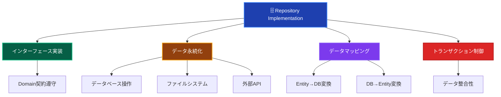
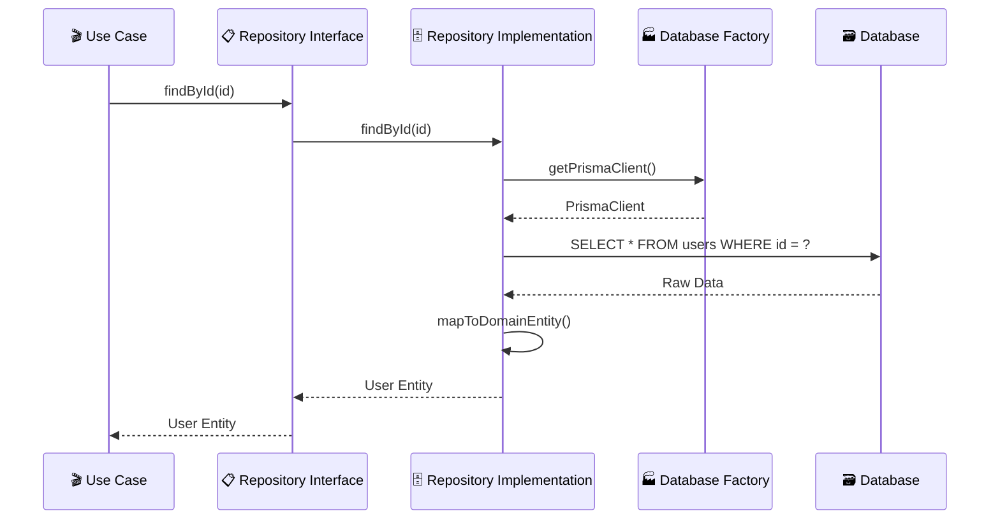

# Repository Implementations（リポジトリ実装）🗄️

このドキュメントでは、Infrastructure Layer の Repository Implementations について、その役割と実装ルールを詳しく解説します。

---

## Repository Implementations とは？ 📚

Repository Implementation（リポジトリ実装）は、**Domain Layer で定義されたリポジトリインターフェースを具体的に実装**し、実際のデータ永続化処理を担当するコンポーネントです。データベース、ファイルシステム、外部API等への具体的なアクセス方法を実装します。

### Repository Implementation の特徴 📋



### Repository のレイヤー関係 🏗️



---

## ✅ 何をして良いか

### 1. **Repository Interface の実装** 📋

```typescript
// ✅ 推薦：Domain Interface の忠実な実装
import { INJECTION_TOKENS } from '@/di/tokens';
import { DomainError } from '@/layers/domain/errors/DomainError';
import type { IUserRepository } from '@/layers/domain/repositories/IUserRepository';
import type { ITransaction } from '@/layers/domain/repositories/ITransaction';
import type { PrismaClient } from '@/layers/infrastructure/persistence/prisma/generated';
import { inject, injectable } from 'tsyringe';

@injectable()
export class PrismaUserRepository implements IUserRepository {
 constructor(
  @inject(INJECTION_TOKENS.PrismaClient) private prisma: PrismaClient,
 ) {}

 async findById(id: UserId): Promise<User | null> {
  try {
   const userData = await this.prisma.user.findUnique({
    where: { id: id.value },
   });

   if (!userData) {
    return null;
   }

   return this.toDomainObject(userData);
  } catch (error) {
   throw this.convertToDomainError(error, 'USER_FIND_ERROR');
  }
 }

 async findByEmail(email: Email): Promise<User | null> {
  try {
   const userData = await this.prisma.user.findUnique({
    where: { email: email.value },
   });

   return userData ? this.toDomainObject(userData) : null;
  } catch (error) {
   throw this.convertToDomainError(error, 'USER_FIND_BY_EMAIL_ERROR');
  }
 }

 async save(user: User, transaction?: ITransaction): Promise<void> {
  try {
   const prisma = transaction?.prisma ?? this.prisma;
   const userData = this.toPersistenceObject(user);

   await prisma.user.create({
    data: userData,
   });
  } catch (error) {
   throw this.convertToDomainError(error, 'USER_SAVE_ERROR');
  }
 }

 async update(user: User, transaction?: ITransaction): Promise<void> {
  try {
   const prisma = transaction?.prisma ?? this.prisma;
   const userData = this.toPersistenceObject(user);

   await prisma.user.update({
    where: { id: user.id.value },
    data: userData,
   });
  } catch (error) {
   throw this.convertToDomainError(error, 'USER_UPDATE_ERROR');
  }
 }

 async delete(id: UserId, transaction?: ITransaction): Promise<void> {
  try {
   const prisma = transaction?.prisma ?? this.prisma;

   await prisma.user.delete({
    where: { id: id.value },
   });
  } catch (error) {
   throw this.convertToDomainError(error, 'USER_DELETE_ERROR');
  }
 }

 // エラー変換ヘルパー
 private convertToDomainError(error: unknown, code: string): DomainError {
  if (error instanceof DomainError) {
   return error;
  }
  const message =
   error instanceof Error ? error.message : '不明なエラーが発生しました';
  return new DomainError(message, code);
 }
}
```

### 2. **データマッピングの実装** 🔄

```typescript
// ✅ 推薦：適切なデータマッピング（toDomainObject / toPersistenceObject）
export class PrismaUserRepository implements IUserRepository {
 // DB → Domain Entity 変換
 private toDomainObject(userData: {
  id: string;
  email: string;
  name: string;
  createdAt: Date;
  updatedAt: Date;
 }): User {
  return User.reconstruct({
   id: new UserId(userData.id),
   email: new Email(userData.email),
   name: userData.name,
   createdAt: userData.createdAt,
   updatedAt: userData.updatedAt,
  });
 }

 // Domain Entity → DB 変換
 private toPersistenceObject(user: User): {
  id: string;
  email: string;
  name: string;
  createdAt: Date;
  updatedAt: Date;
 } {
  return {
   id: user.id.value,           // public readonly アクセス
   email: user.email.value,     // public readonly アクセス
   name: user.name,             // public readonly アクセス
   createdAt: user.createdAt,   // public readonly アクセス
   updatedAt: user.updatedAt,   // public readonly アクセス
  };
 }
}
```

**重要：Entity の public readonly パターン**

本プロジェクトでは、Entity は getter メソッドではなく `public readonly` プロパティを使用します：

```typescript
// ✅ 実際のパターン
user.id.value       // UserId の value プロパティ
user.email.value    // Email の value プロパティ
user.name           // string プロパティ

// ❌ 使用しない
user.getId()        // getter メソッドは使用しない
user.getEmail()
```

### 3. **トランザクション制御** 🔄

```typescript
// ✅ 推薦：トランザクション対応Repository
// ITransaction インターフェース
export interface ITransaction {
 prisma: PrismaClient;
 commit(): Promise<void>;
 rollback(): Promise<void>;
}

// Repository でのトランザクション使用パターン
export class PrismaUserRepository implements IUserRepository {
 constructor(
  @inject(INJECTION_TOKENS.PrismaClient) private prisma: PrismaClient,
 ) {}

 async save(user: User, transaction?: ITransaction): Promise<void> {
  try {
   // トランザクションがあればそのPrismaを使用、なければデフォルト
   const prisma = transaction?.prisma ?? this.prisma;
   const userData = this.toPersistenceObject(user);

   await prisma.user.create({
    data: userData,
   });
  } catch (error) {
   throw this.convertToDomainError(error, 'USER_SAVE_ERROR');
  }
 }

 async update(user: User, transaction?: ITransaction): Promise<void> {
  try {
   const prisma = transaction?.prisma ?? this.prisma;
   const userData = this.toPersistenceObject(user);

   await prisma.user.update({
    where: { id: user.id.value },
    data: userData,
   });
  } catch (error) {
   throw this.convertToDomainError(error, 'USER_UPDATE_ERROR');
  }
 }

 async delete(id: UserId, transaction?: ITransaction): Promise<void> {
  try {
   const prisma = transaction?.prisma ?? this.prisma;

   await prisma.user.delete({
    where: { id: id.value },
   });
  } catch (error) {
   throw this.convertToDomainError(error, 'USER_DELETE_ERROR');
  }
 }
}
```

**トランザクション使用例（UseCase内）:**

```typescript
// UseCase でのトランザクション管理
@injectable()
export class TransferFundsUseCase {
 constructor(
  @inject(INJECTION_TOKENS.PrismaClient) private prisma: PrismaClient,
  @inject(INJECTION_TOKENS.UserRepository) private userRepository: IUserRepository,
 ) {}

 async execute(request: TransferRequest): Promise<Result<void>> {
  // Prisma の $transaction を使用
  try {
   await this.prisma.$transaction(async (tx) => {
    const transaction: ITransaction = { prisma: tx } as ITransaction;

    // トランザクション内で Repository 操作
    const sender = await this.userRepository.findById(request.senderId);
    const receiver = await this.userRepository.findById(request.receiverId);

    // ビジネスロジック
    sender.deductBalance(request.amount);
    receiver.addBalance(request.amount);

    // 同一トランザクションで更新
    await this.userRepository.update(sender, transaction);
    await this.userRepository.update(receiver, transaction);
   });

   return success(undefined);
  } catch (error) {
   return failure('送金処理に失敗しました', 'TRANSFER_FAILED');
  }
 }
}
```

### 4. **複雑な検索条件の実装** 🔍

```typescript
// ✅ 推薦：ドメイン要求に応じた検索実装
@injectable()
export class PrismaUserRepository implements IUserRepository {
 constructor(
  @inject(INJECTION_TOKENS.PrismaClient) private prisma: PrismaClient,
 ) {}

 async findAll(): Promise<User[]> {
  try {
   const userData = await this.prisma.user.findMany({
    orderBy: { createdAt: 'desc' },
   });

   return userData.map((data) => this.toDomainObject(data));
  } catch (error) {
   throw this.convertToDomainError(error, 'USER_FIND_ALL_ERROR');
  }
 }

 async findActiveUsers(criteria: ActiveUserSearchCriteria): Promise<User[]> {
  try {
   const whereClause: Prisma.UserWhereInput = {
    isActive: true,
    lastLoginAt: {
     gte: criteria.activeThreshold,
    },
   };

   // 検索条件の動的構築
   if (criteria.levelRange) {
    whereClause.level = {
     gte: criteria.levelRange.min,
     lte: criteria.levelRange.max,
    };
   }

   if (criteria.emailDomain) {
    whereClause.email = {
     endsWith: `@${criteria.emailDomain}`,
    };
   }

   const userData = await this.prisma.user.findMany({
    where: whereClause,
    orderBy: [{ level: 'desc' }, { lastLoginAt: 'desc' }],
    take: criteria.limit,
    skip: criteria.offset,
   });

   return userData.map((data) => this.toDomainObject(data));
  } catch (error) {
   throw this.convertToDomainError(error, 'ACTIVE_USER_SEARCH_ERROR');
  }
 }

 async countByLevelRange(minLevel: number, maxLevel: number): Promise<number> {
  try {
   return await this.prisma.user.count({
    where: {
     level: {
      gte: minLevel,
      lte: maxLevel,
     },
     isActive: true,
    },
   });
  } catch (error) {
   throw this.convertToDomainError(error, 'USER_COUNT_ERROR');
  }
 }
}
```

### 5. **パフォーマンス最適化** ⚡

```typescript
// ✅ 推薦：パフォーマンスを考慮した実装
@injectable()
export class PrismaUserRepository implements IUserRepository {
 constructor(
  @inject(INJECTION_TOKENS.PrismaClient) private prisma: PrismaClient,
 ) {}

 async findByIds(ids: UserId[]): Promise<User[]> {
  if (ids.length === 0) {
   return [];
  }

  try {
   // バッチ取得でN+1問題を回避
   const userData = await this.prisma.user.findMany({
    where: {
     id: { in: ids.map((id) => id.value) },
    },
   });

   // 元の順序を保持してマッピング
   const userMap = new Map(
    userData.map((data) => [data.id, this.toDomainObject(data)]),
   );

   return ids
    .map((id) => userMap.get(id.value))
    .filter((user): user is User => user !== undefined);
  } catch (error) {
   throw this.convertToDomainError(error, 'BATCH_USER_FETCH_ERROR');
  }
 }

 // 関連データを含む取得（N+1回避）
 async findByIdWithRelations(id: UserId): Promise<UserWithRelations | null> {
  try {
   const userData = await this.prisma.user.findUnique({
    where: { id: id.value },
    include: {
     profile: true,
     sessions: {
      where: { expiresAt: { gte: new Date() } },
      take: 1,
      orderBy: { createdAt: 'desc' },
     },
    },
   });

   return userData ? this.toDomainObjectWithRelations(userData) : null;
  } catch (error) {
   throw this.convertToDomainError(error, 'USER_FIND_WITH_RELATIONS_ERROR');
  }
 }
}
```

**パフォーマンス最適化のポイント:**

- **N+1 問題の回避**: `findMany` + `include` で関連データを一括取得
- **バッチ処理**: 複数IDの取得は `findByIds` で一括処理
- **順序の保持**: Map を使用して元の ID 順序を維持

---

## ❌ 何をしてはならないか

### 1. **ビジネスロジックの実装** 🚫

```typescript
// ❌ 禁止：Repository内でのビジネスロジック
export class PrismaUserRepository implements IUserRepository {
 async save(user: User): Promise<void> {
  // ビジネスルール検証（Domain Layerの責務）
  if (user.level > 10) {
   throw new Error('レベルが高すぎます'); // 禁止
  }

  // 昇格処理（Domain Layerの責務）
  if (user.experiencePoints >= 1000) {
   user.promote(); // 禁止
  }

  // データ保存のみが責務
  await this.persistUser(user);
 }
}
```

### 2. **Application Layer の機能実装** 📋

```typescript
// ❌ 禁止：ユースケースレベルの処理
export class PrismaUserRepository implements IUserRepository {
 async createUserWithWelcomeEmail(userData: CreateUserData): Promise<User> {
  // ユーザー作成
  const user = User.create(/*...*/);
  await this.save(user);

  // メール送信（Application Layerの責務）
  const emailService = new EmailService(); // 禁止
  await emailService.sendWelcomeEmail(user.email); // 禁止

  // 分析データ送信（Application Layerの責務）
  const analytics = new AnalyticsService(); // 禁止
  await analytics.track('user_created', user.id); // 禁止

  return user;
 }
}
```

### 3. **Presentation Layer への依存** 🎨

```typescript
// ❌ 禁止：UI固有の処理
export class PrismaUserRepository implements IUserRepository {
 async findUsersForDisplay(): Promise<UserDisplayData[]> {
  const users = await this.findAll();

  // 表示用フォーマット（Presentation Layerの責務）
  return users.map((user) => ({
   displayName: `${user.name}様`, // 禁止
   formattedLevel: `レベル ${user.level}`, // 禁止
   statusColor: user.isActive ? 'green' : 'red', // 禁止
  }));
 }
}
```

### 4. **具体的な技術の外部漏出** 🔧

```typescript
// ❌ 禁止：実装詳細の漏出
export class PrismaUserRepository implements IUserRepository {
 // Prisma特有の型を外部に公開
 async findByIdRaw(id: string): Promise<PrismaUser> {
  // 禁止
  return await this.prisma.user.findUnique({ where: { id } });
 }

 // SQLを直接公開
 async executeRawQuery(sql: string): Promise<any> {
  // 禁止
  return await this.prisma.$queryRaw(sql);
 }

 // Prismaクライアントを直接公開
 getPrismaClient(): PrismaClient {
  // 禁止
  return this.prisma;
 }
}
```

### 5. **不適切なエラーハンドリング** ⚠️

```typescript
// ❌ 禁止：不適切なエラー処理
export class PrismaUserRepository implements IUserRepository {
 async findById(id: UserId): Promise<User | null> {
  try {
   const userData = await this.prisma.user.findUnique({
    where: { id: id.value },
   });

   return userData ? this.mapToDomainEntity(userData) : null;
  } catch (error) {
   // エラーを隠蔽
   console.log('エラーが発生しましたが無視します'); // 禁止
   return null; // 禁止
  }
 }

 async save(user: User): Promise<void> {
  try {
   await this.persistUser(user);
  } catch (error) {
   // ドメインエラーとして投げる（間違い）
   throw new DomainError('保存に失敗しました', 'SAVE_FAILED'); // 禁止
  }
 }
}
```

---

## 🏗️ 設計パターンとベストプラクティス

### 1. **データマッパーパターン** 🗺️

```typescript
// ✅ 推薦：専用マッパークラスの使用（複雑なマッピング向け）
export class UserDataMapper {
 static toDomain(userData: PrismaUserData): User {
  return User.reconstruct({
   id: new UserId(userData.id),
   email: new Email(userData.email),
   name: userData.name,
   createdAt: userData.createdAt,
   updatedAt: userData.updatedAt,
  });
 }

 static toPersistence(user: User): PrismaUserData {
  return {
   id: user.id.value,        // public readonly アクセス
   email: user.email.value,  // public readonly アクセス
   name: user.name,
   createdAt: user.createdAt,
   updatedAt: user.updatedAt,
  };
 }

 static toDomainList(userDataList: PrismaUserData[]): User[] {
  return userDataList.map((data) => this.toDomain(data));
 }
}

// Repository内での使用
@injectable()
export class PrismaUserRepository implements IUserRepository {
 private toDomainObject(userData: PrismaUserData): User {
  return UserDataMapper.toDomain(userData);
 }

 private toPersistenceObject(user: User): PrismaUserData {
  return UserDataMapper.toPersistence(user);
 }
}
```

**注意**: シンプルなマッピングの場合、Repository 内にインラインで実装しても問題ありません。マッパークラスへの分離は、複雑な変換ロジックがある場合に有効です。

### 2. **Repository Factory パターン** 🏭

本プロジェクトでは、DIコンテナ経由で Repository を直接注入するため、Repository Factory は通常不要です。
ただし、テスト用のインメモリ実装など、動的に Repository 実装を切り替える必要がある場合に有効です。

```typescript
// ✅ 推薦：DIコンテナ経由の直接注入（標準パターン）
@injectable()
export class CreateUserUseCase {
 constructor(
  @inject(INJECTION_TOKENS.UserRepository) private userRepository: IUserRepository,
 ) {}
}

// テスト用InMemory実装（テストで差し替え）
export class InMemoryUserRepository implements IUserRepository {
 private users: Map<string, User> = new Map();

 async findById(id: UserId): Promise<User | null> {
  return this.users.get(id.value) ?? null;
 }

 async save(user: User): Promise<void> {
  this.users.set(user.id.value, user);
 }

 // ... 他のメソッド
}
```

### 3. **仕様パターンの活用** 📋

```typescript
// ✅ 推薦：複雑な検索条件の仕様化
import type { Prisma } from '@/layers/infrastructure/persistence/prisma/generated';

export class UserSearchSpecification {
 constructor(
  public readonly isActive?: boolean,
  public readonly levelRange?: { min: number; max: number },
  public readonly emailDomain?: string,
  public readonly lastLoginSince?: Date,
 ) {}

 buildWhereClause(): Prisma.UserWhereInput {
  const where: Prisma.UserWhereInput = {};

  if (this.isActive !== undefined) {
   where.isActive = this.isActive;
  }

  if (this.levelRange) {
   where.level = {
    gte: this.levelRange.min,
    lte: this.levelRange.max,
   };
  }

  if (this.emailDomain) {
   where.email = {
    endsWith: `@${this.emailDomain}`,
   };
  }

  if (this.lastLoginSince) {
   where.lastLoginAt = {
    gte: this.lastLoginSince,
   };
  }

  return where;
 }
}

// Repository内での使用
@injectable()
export class PrismaUserRepository implements IUserRepository {
 constructor(
  @inject(INJECTION_TOKENS.PrismaClient) private prisma: PrismaClient,
 ) {}

 async findBySpecification(spec: UserSearchSpecification): Promise<User[]> {
  const userData = await this.prisma.user.findMany({
   where: spec.buildWhereClause(),
  });

  return userData.map((data) => this.toDomainObject(data));
 }
}
```

---

## 🧪 テスト戦略

本プロジェクトでは **vitest-mock-extended** を使用した単体テストを推奨します。
Repository の統合テストも重要ですが、開発効率を考慮し、モックを活用した高速なテストを基本とします。

### Unit Tests（単体テスト - 推奨）

```typescript
import { setupTestEnvironment } from '@tests/utils/helpers/testHelpers';
import { mock, MockProxy } from 'vitest-mock-extended';
import { container } from 'tsyringe';

// ✅ Repository 単体テストの例（モック使用）
describe('PrismaUserRepository', () => {
 setupTestEnvironment(); // DIコンテナリセット

 let repository: PrismaUserRepository;
 let mockPrisma: MockProxy<PrismaClient>;

 beforeEach(() => {
  mockPrisma = mock<PrismaClient>();
  container.registerInstance(INJECTION_TOKENS.PrismaClient, mockPrisma);
  repository = container.resolve(PrismaUserRepository);
 });

 describe('findById', () => {
  it('ユーザーが見つかった場合、ドメインオブジェクトを返す', async () => {
   // Arrange
   const userId = new UserId('test-user-123');
   const prismaUser = {
    id: 'test-user-123',
    email: 'test@example.com',
    name: 'テストユーザー',
    createdAt: new Date(),
    updatedAt: new Date(),
   };
   mockPrisma.user.findUnique.mockResolvedValue(prismaUser);

   // Act
   const result = await repository.findById(userId);

   // Assert
   expect(result).not.toBeNull();
   expect(result!.id.value).toBe('test-user-123');
   expect(result!.email.value).toBe('test@example.com');
   expect(result!.name).toBe('テストユーザー');
  });

  it('ユーザーが見つからない場合、nullを返す', async () => {
   // Arrange
   mockPrisma.user.findUnique.mockResolvedValue(null);

   // Act
   const result = await repository.findById(new UserId('not-found'));

   // Assert
   expect(result).toBeNull();
  });
 });

 describe('save', () => {
  it('ユーザーを正常に保存できる', async () => {
   // Arrange
   const user = User.create({
    email: new Email('test@example.com'),
    name: 'テストユーザー',
   });
   mockPrisma.user.create.mockResolvedValue({} as any);

   // Act & Assert
   await expect(repository.save(user)).resolves.not.toThrow();
   expect(mockPrisma.user.create).toHaveBeenCalledWith({
    data: expect.objectContaining({
     email: 'test@example.com',
     name: 'テストユーザー',
    }),
   });
  });
 });
});
```

### Integration Tests（統合テスト - オプション）

実際のデータベースを使用した統合テストは、E2Eテストまたは特定のシナリオで実施します。

---

## 🔍 実装チェックリスト

Repository Implementation を実装する際の確認事項：

### Interface 実装

- [ ] Domain Layer のインターフェースを正確に実装している
- [ ] 全てのメソッドで適切な戻り値型を使用している
- [ ] ドメインオブジェクトの契約を守っている

### データマッピング

- [ ] データベースモデルとドメインエンティティの変換が適切
- [ ] Value Object の変換が正しく実装されている
- [ ] マッピングエラーが適切にハンドリングされている

### エラーハンドリング

- [ ] InfrastructureError として適切にエラーを投げている
- [ ] ログ出力が適切に実装されている
- [ ] データベース固有のエラーを隠蔽している

### パフォーマンス

- [ ] N+1問題を回避している
- [ ] 適切なインデックスが使用されている
- [ ] バッチ処理が適切に実装されている

### テスト

- [ ] 統合テストが実装されている
- [ ] トランザクション制御のテストがある
- [ ] エラーケースのテストがある

---

**Repository Implementation は Domain と Infrastructure を繋ぐ重要なコンポーネントです。ドメインモデルの整合性を保ちながら、効率的なデータアクセスを実現することが重要です！** 🗄️✨
