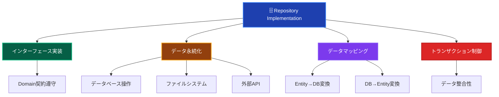
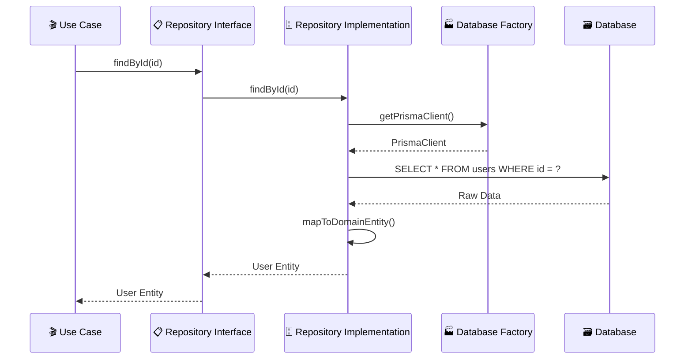

# Repository Implementations（リポジトリ実装）🗄️

このドキュメントでは、Infrastructure Layer の Repository Implementations について、その役割と実装ルールを詳しく解説します。

---

## Repository Implementations とは？ 📚

Repository Implementation（リポジトリ実装）は、**Domain Layer で定義されたリポジトリインターフェースを具体的に実装**し、実際のデータ永続化処理を担当するコンポーネントです。データベース、ファイルシステム、外部API等への具体的なアクセス方法を実装します。

### Repository Implementation の特徴 📋



### Repository のレイヤー関係 🏗️



---

## ✅ 何をして良いか

### 1. **Repository Interface の実装** 📋

```typescript
// ✅ 推薦：Domain Interface の忠実な実装
@injectable()
export class PrismaUserRepository implements IUserRepository {
 constructor(
  @inject('IDatabaseFactory') private databaseFactory: IDatabaseFactory,
  @inject('ILogger') private logger: ILogger,
 ) {}

 async findById(id: UserId): Promise<User | null> {
  try {
   this.logger.debug('ユーザー検索開始', { userId: id.toString() });

   const prisma = this.databaseFactory.getPrismaClient();
   const userData = await prisma.user.findUnique({
    where: { id: id.toString() },
    include: {
     profile: true,
     sessions: {
      where: { expiresAt: { gte: new Date() } },
      take: 1,
     },
    },
   });

   if (!userData) {
    this.logger.debug('ユーザーが見つかりません', { userId: id.toString() });
    return null;
   }

   const user = this.mapToDomainEntity(userData);
   this.logger.debug('ユーザー検索完了', { userId: id.toString() });

   return user;
  } catch (error) {
   this.logger.error('ユーザー検索エラー', {
    userId: id.toString(),
    error: error.message,
   });
   throw new InfrastructureError(
    'ユーザー検索中にエラーが発生しました',
    'USER_FIND_ERROR',
    error,
   );
  }
 }

 async findByEmail(email: Email): Promise<User | null> {
  try {
   const prisma = this.databaseFactory.getPrismaClient();
   const userData = await prisma.user.findUnique({
    where: { email: email.toString() },
    include: { profile: true },
   });

   return userData ? this.mapToDomainEntity(userData) : null;
  } catch (error) {
   this.logger.error('メールアドレスによるユーザー検索エラー', {
    email: email.toString(),
    error: error.message,
   });
   throw new InfrastructureError(
    'ユーザー検索中にエラーが発生しました',
    'USER_FIND_BY_EMAIL_ERROR',
    error,
   );
  }
 }

 async save(user: User): Promise<void> {
  try {
   this.logger.debug('ユーザー保存開始', { userId: user.getId().toString() });

   const prisma = this.databaseFactory.getPrismaClient();
   const userData = this.mapToPersistenceData(user);

   await prisma.user.upsert({
    where: { id: user.getId().toString() },
    create: userData,
    update: userData,
   });

   this.logger.debug('ユーザー保存完了', { userId: user.getId().toString() });
  } catch (error) {
   this.logger.error('ユーザー保存エラー', {
    userId: user.getId().toString(),
    error: error.message,
   });
   throw new InfrastructureError(
    'ユーザー保存中にエラーが発生しました',
    'USER_SAVE_ERROR',
    error,
   );
  }
 }
}
```

### 2. **データマッピングの実装** 🔄

```typescript
// ✅ 推薦：適切なデータマッピング
export class PrismaUserRepository implements IUserRepository {
 private mapToDomainEntity(userData: any): User {
  return User.reconstruct(
   new UserId(userData.id),
   new Email(userData.email),
   userData.name,
   userData.experiencePoints || 0,
   userData.level || 1,
   userData.createdAt,
   userData.lastLoginAt || undefined,
  );
 }

 private mapToPersistenceData(user: User): any {
  return {
   id: user.getId().toString(),
   email: user.getEmail().toString(),
   name: user.getName(),
   experiencePoints: user.getExperiencePoints(),
   level: user.getLevel(),
   createdAt: user.getCreatedAt(),
   lastLoginAt: user.getLastLoginAt(),
   updatedAt: new Date(),
  };
 }

 // 複雑なマッピングの場合は専用クラスに分離
 private mapToUserWithProfile(userData: any): User {
  const user = this.mapToDomainEntity(userData);

  // プロフィール情報がある場合の追加マッピング
  if (userData.profile) {
   user.updateProfile({
    displayName: userData.profile.displayName,
    avatarUrl: userData.profile.avatarUrl,
    bio: userData.profile.bio,
   });
  }

  return user;
 }
}
```

### 3. **トランザクション制御** 🔄

```typescript
// ✅ 推薦：トランザクション対応Repository
export class PrismaUserRepository implements IUserRepository {
 async save(user: User, transaction?: ITransaction): Promise<void> {
  try {
   const prisma = transaction
    ? (transaction as PrismaTransaction).getPrismaClient()
    : this.databaseFactory.getPrismaClient();

   const userData = this.mapToPersistenceData(user);

   await prisma.user.upsert({
    where: { id: user.getId().toString() },
    create: userData,
    update: userData,
   });

   // ドメインイベントの永続化
   await this.persistDomainEvents(user, prisma);
  } catch (error) {
   throw new InfrastructureError(
    'ユーザー保存中にエラーが発生しました',
    'USER_SAVE_ERROR',
    error,
   );
  }
 }

 async findByIdForUpdate(
  id: UserId,
  transaction: ITransaction,
 ): Promise<User | null> {
  try {
   const prisma = (transaction as PrismaTransaction).getPrismaClient();

   // 悲観的ロック（SELECT FOR UPDATE相当）
   const userData = await prisma.user.findUnique({
    where: { id: id.toString() },
    // Prismaでは自動的にトランザクション内でロックが適用される
   });

   return userData ? this.mapToDomainEntity(userData) : null;
  } catch (error) {
   throw new InfrastructureError(
    'ユーザー排他制御取得エラー',
    'USER_LOCK_ERROR',
    error,
   );
  }
 }

 private async persistDomainEvents(user: User, prisma: any): Promise<void> {
  const events = DomainEvents.getEventsForEntity(user.getId());

  for (const event of events) {
   await prisma.domainEvent.create({
    data: {
     entityId: user.getId().toString(),
     entityType: 'User',
     eventType: event.constructor.name,
     eventData: JSON.stringify(event),
     occurredAt: event.occurredAt,
    },
   });
  }

  DomainEvents.clearEventsForEntity(user.getId());
 }
}
```

### 4. **複雑な検索条件の実装** 🔍

```typescript
// ✅ 推薦：ドメイン要求に応じた検索実装
export class PrismaUserRepository implements IUserRepository {
 async findActiveUsers(criteria: ActiveUserSearchCriteria): Promise<User[]> {
  try {
   const prisma = this.databaseFactory.getPrismaClient();

   const whereClause: any = {
    isActive: true,
    lastLoginAt: {
     gte: criteria.getActiveThreshold(),
    },
   };

   // 検索条件の動的構築
   if (criteria.hasLevelRange()) {
    whereClause.level = {
     gte: criteria.getMinLevel(),
     lte: criteria.getMaxLevel(),
    };
   }

   if (criteria.hasEmailDomain()) {
    whereClause.email = {
     endsWith: `@${criteria.getEmailDomain()}`,
    };
   }

   const userData = await prisma.user.findMany({
    where: whereClause,
    orderBy: [{ level: 'desc' }, { lastLoginAt: 'desc' }],
    take: criteria.getLimit(),
    skip: criteria.getOffset(),
   });

   return userData.map((data) => this.mapToDomainEntity(data));
  } catch (error) {
   throw new InfrastructureError(
    'アクティブユーザー検索エラー',
    'ACTIVE_USER_SEARCH_ERROR',
    error,
   );
  }
 }

 async countByLevelRange(minLevel: number, maxLevel: number): Promise<number> {
  try {
   const prisma = this.databaseFactory.getPrismaClient();

   return await prisma.user.count({
    where: {
     level: {
      gte: minLevel,
      lte: maxLevel,
     },
     isActive: true,
    },
   });
  } catch (error) {
   throw new InfrastructureError(
    'ユーザー数カウントエラー',
    'USER_COUNT_ERROR',
    error,
   );
  }
 }
}
```

### 5. **パフォーマンス最適化** ⚡

```typescript
// ✅ 推薦：パフォーマンスを考慮した実装
export class PrismaUserRepository implements IUserRepository {
 async findByIdsWithProfiles(ids: UserId[]): Promise<User[]> {
  if (ids.length === 0) {
   return [];
  }

  try {
   const prisma = this.databaseFactory.getPrismaClient();

   // バッチ取得でN+1問題を回避
   const userData = await prisma.user.findMany({
    where: {
     id: { in: ids.map((id) => id.toString()) },
    },
    include: {
     profile: true,
     sessions: {
      where: { expiresAt: { gte: new Date() } },
      take: 1,
      orderBy: { createdAt: 'desc' },
     },
    },
   });

   // 元の順序を保持してマッピング
   const userMap = new Map(
    userData.map((data) => [data.id, this.mapToUserWithProfile(data)]),
   );

   return ids
    .map((id) => userMap.get(id.toString()))
    .filter((user) => user !== undefined) as User[];
  } catch (error) {
   throw new InfrastructureError(
    'ユーザー一括取得エラー',
    'BATCH_USER_FETCH_ERROR',
    error,
   );
  }
 }

 // キャッシュ対応（Redis等を使用）
 async findByIdWithCache(id: UserId): Promise<User | null> {
  const cacheKey = `user:${id.toString()}`;

  try {
   // キャッシュから取得試行
   const cachedData = await this.cacheService.get(cacheKey);
   if (cachedData) {
    this.logger.debug('キャッシュからユーザー取得', { userId: id.toString() });
    return this.deserializeUser(cachedData);
   }

   // キャッシュにない場合はDBから取得
   const user = await this.findById(id);
   if (user) {
    await this.cacheService.set(
     cacheKey,
     this.serializeUser(user),
     300, // 5分間キャッシュ
    );
   }

   return user;
  } catch (error) {
   // キャッシュエラーは無視してDBから取得
   this.logger.warn('キャッシュエラー、DBから取得', {
    userId: id.toString(),
    error: error.message,
   });
   return await this.findById(id);
  }
 }
}
```

---

## ❌ 何をしてはならないか

### 1. **ビジネスロジックの実装** 🚫

```typescript
// ❌ 禁止：Repository内でのビジネスロジック
export class PrismaUserRepository implements IUserRepository {
 async save(user: User): Promise<void> {
  // ビジネスルール検証（Domain Layerの責務）
  if (user.getLevel() > 10) {
   throw new Error('レベルが高すぎます'); // 禁止
  }

  // 昇格処理（Domain Layerの責務）
  if (user.getExperiencePoints() >= 1000) {
   user.promote(); // 禁止
  }

  // データ保存のみが責務
  await this.persistUser(user);
 }
}
```

### 2. **Application Layer の機能実装** 📋

```typescript
// ❌ 禁止：ユースケースレベルの処理
export class PrismaUserRepository implements IUserRepository {
 async createUserWithWelcomeEmail(userData: CreateUserData): Promise<User> {
  // ユーザー作成
  const user = User.create(/*...*/);
  await this.save(user);

  // メール送信（Application Layerの責務）
  const emailService = new EmailService(); // 禁止
  await emailService.sendWelcomeEmail(user.getEmail()); // 禁止

  // 分析データ送信（Application Layerの責務）
  const analytics = new AnalyticsService(); // 禁止
  await analytics.track('user_created', user.getId()); // 禁止

  return user;
 }
}
```

### 3. **Presentation Layer への依存** 🎨

```typescript
// ❌ 禁止：UI固有の処理
export class PrismaUserRepository implements IUserRepository {
 async findUsersForDisplay(): Promise<UserDisplayData[]> {
  const users = await this.findAll();

  // 表示用フォーマット（Presentation Layerの責務）
  return users.map((user) => ({
   displayName: `${user.getName()}様`, // 禁止
   formattedLevel: `レベル ${user.getLevel()}`, // 禁止
   statusColor: user.isActive() ? 'green' : 'red', // 禁止
  }));
 }
}
```

### 4. **具体的な技術の外部漏出** 🔧

```typescript
// ❌ 禁止：実装詳細の漏出
export class PrismaUserRepository implements IUserRepository {
 // Prisma特有の型を外部に公開
 async findByIdRaw(id: string): Promise<PrismaUser> {
  // 禁止
  return await this.prisma.user.findUnique({ where: { id } });
 }

 // SQLを直接公開
 async executeRawQuery(sql: string): Promise<any> {
  // 禁止
  return await this.prisma.$queryRaw(sql);
 }

 // Prismaクライアントを直接公開
 getPrismaClient(): PrismaClient {
  // 禁止
  return this.prisma;
 }
}
```

### 5. **不適切なエラーハンドリング** ⚠️

```typescript
// ❌ 禁止：不適切なエラー処理
export class PrismaUserRepository implements IUserRepository {
 async findById(id: UserId): Promise<User | null> {
  try {
   const userData = await this.prisma.user.findUnique({
    where: { id: id.toString() },
   });

   return userData ? this.mapToDomainEntity(userData) : null;
  } catch (error) {
   // エラーを隠蔽
   console.log('エラーが発生しましたが無視します'); // 禁止
   return null; // 禁止
  }
 }

 async save(user: User): Promise<void> {
  try {
   await this.persistUser(user);
  } catch (error) {
   // ドメインエラーとして投げる（間違い）
   throw new DomainError('保存に失敗しました', 'SAVE_FAILED'); // 禁止
  }
 }
}
```

---

## 🏗️ 設計パターンとベストプラクティス

### 1. **データマッパーパターン** 🗺️

```typescript
// ✅ 推薦：専用マッパークラスの使用
export class UserDataMapper {
 static toDomain(userData: PrismaUserData): User {
  return User.reconstruct(
   new UserId(userData.id),
   new Email(userData.email),
   userData.name,
   userData.experiencePoints,
   userData.level,
   userData.createdAt,
   userData.lastLoginAt,
  );
 }

 static toPersistence(user: User): PrismaUserData {
  return {
   id: user.getId().toString(),
   email: user.getEmail().toString(),
   name: user.getName(),
   experiencePoints: user.getExperiencePoints(),
   level: user.getLevel(),
   createdAt: user.getCreatedAt(),
   lastLoginAt: user.getLastLoginAt(),
   updatedAt: new Date(),
  };
 }

 static toDomainList(userDataList: PrismaUserData[]): User[] {
  return userDataList.map((data) => this.toDomain(data));
 }
}

// Repository内での使用
export class PrismaUserRepository implements IUserRepository {
 private mapToDomainEntity(userData: any): User {
  return UserDataMapper.toDomain(userData);
 }

 private mapToPersistenceData(user: User): any {
  return UserDataMapper.toPersistence(user);
 }
}
```

### 2. **Repository Factory パターン** 🏭

```typescript
// ✅ 推薦：複数の永続化手段への対応
export interface IRepositoryFactory {
 createUserRepository(): IUserRepository;
 createSessionRepository(): ISessionRepository;
}

@injectable()
export class PrismaRepositoryFactory implements IRepositoryFactory {
 constructor(
  @inject('IDatabaseFactory') private databaseFactory: IDatabaseFactory,
  @inject('ILogger') private logger: ILogger,
 ) {}

 createUserRepository(): IUserRepository {
  return new PrismaUserRepository(this.databaseFactory, this.logger);
 }

 createSessionRepository(): ISessionRepository {
  return new PrismaSessionRepository(this.databaseFactory, this.logger);
 }
}

// テスト用実装
export class InMemoryRepositoryFactory implements IRepositoryFactory {
 createUserRepository(): IUserRepository {
  return new InMemoryUserRepository();
 }

 createSessionRepository(): ISessionRepository {
  return new InMemorySessionRepository();
 }
}
```

### 3. **仕様パターンの活用** 📋

```typescript
// ✅ 推薦：複雑な検索条件の仕様化
export class UserSearchSpecification {
 constructor(
  private isActive?: boolean,
  private levelRange?: { min: number; max: number },
  private emailDomain?: string,
  private lastLoginSince?: Date,
 ) {}

 buildWhereClause(): any {
  const where: any = {};

  if (this.isActive !== undefined) {
   where.isActive = this.isActive;
  }

  if (this.levelRange) {
   where.level = {
    gte: this.levelRange.min,
    lte: this.levelRange.max,
   };
  }

  if (this.emailDomain) {
   where.email = {
    endsWith: `@${this.emailDomain}`,
   };
  }

  if (this.lastLoginSince) {
   where.lastLoginAt = {
    gte: this.lastLoginSince,
   };
  }

  return where;
 }
}

// Repository内での使用
export class PrismaUserRepository implements IUserRepository {
 async findBySpecification(spec: UserSearchSpecification): Promise<User[]> {
  const prisma = this.databaseFactory.getPrismaClient();

  const userData = await prisma.user.findMany({
   where: spec.buildWhereClause(),
  });

  return userData.map((data) => this.mapToDomainEntity(data));
 }
}
```

---

## 🧪 テスト戦略

### Integration Tests（統合テスト）

```typescript
// ✅ Repository 統合テストの例
describe('PrismaUserRepository Integration Tests', () => {
 let repository: PrismaUserRepository;
 let databaseFactory: TestDatabaseFactory;

 beforeEach(async () => {
  databaseFactory = new TestDatabaseFactory();
  await databaseFactory.setupTestDatabase();

  repository = new PrismaUserRepository(databaseFactory, new TestLogger());
 });

 afterEach(async () => {
  await databaseFactory.cleanupTestDatabase();
 });

 describe('save and findById', () => {
  it('ユーザーを保存して取得できる', async () => {
   // Arrange
   const user = User.create(
    new UserId('test-user-123'),
    new Email('test@example.com'),
    'テストユーザー',
   );

   // Act
   await repository.save(user);
   const foundUser = await repository.findById(user.getId());

   // Assert
   expect(foundUser).not.toBeNull();
   expect(foundUser!.getId().equals(user.getId())).toBe(true);
   expect(foundUser!.getEmail().equals(user.getEmail())).toBe(true);
   expect(foundUser!.getName()).toBe(user.getName());
  });
 });

 describe('findByEmail', () => {
  it('メールアドレスでユーザーを検索できる', async () => {
   // Arrange
   const user = User.create(
    new UserId('test-user-123'),
    new Email('test@example.com'),
    'テストユーザー',
   );
   await repository.save(user);

   // Act
   const foundUser = await repository.findByEmail(user.getEmail());

   // Assert
   expect(foundUser).not.toBeNull();
   expect(foundUser!.getId().equals(user.getId())).toBe(true);
  });

  it('存在しないメールアドレスの場合nullを返す', async () => {
   // Act
   const foundUser = await repository.findByEmail(
    new Email('nonexistent@example.com'),
   );

   // Assert
   expect(foundUser).toBeNull();
  });
 });

 describe('transaction support', () => {
  it('トランザクション内でユーザーを保存できる', async () => {
   // Arrange
   const user = User.create(
    new UserId('test-user-123'),
    new Email('test@example.com'),
    'テストユーザー',
   );

   const transaction = await databaseFactory.beginTransaction();

   try {
    // Act
    await repository.save(user, transaction);
    await transaction.commit();

    // Assert
    const foundUser = await repository.findById(user.getId());
    expect(foundUser).not.toBeNull();
   } catch (error) {
    await transaction.rollback();
    throw error;
   }
  });
 });
});
```

---

## 🔍 実装チェックリスト

Repository Implementation を実装する際の確認事項：

### Interface 実装

- [ ] Domain Layer のインターフェースを正確に実装している
- [ ] 全てのメソッドで適切な戻り値型を使用している
- [ ] ドメインオブジェクトの契約を守っている

### データマッピング

- [ ] データベースモデルとドメインエンティティの変換が適切
- [ ] Value Object の変換が正しく実装されている
- [ ] マッピングエラーが適切にハンドリングされている

### エラーハンドリング

- [ ] InfrastructureError として適切にエラーを投げている
- [ ] ログ出力が適切に実装されている
- [ ] データベース固有のエラーを隠蔽している

### パフォーマンス

- [ ] N+1問題を回避している
- [ ] 適切なインデックスが使用されている
- [ ] バッチ処理が適切に実装されている

### テスト

- [ ] 統合テストが実装されている
- [ ] トランザクション制御のテストがある
- [ ] エラーケースのテストがある

---

**Repository Implementation は Domain と Infrastructure を繋ぐ重要なコンポーネントです。ドメインモデルの整合性を保ちながら、効率的なデータアクセスを実現することが重要です！** 🗄️✨
