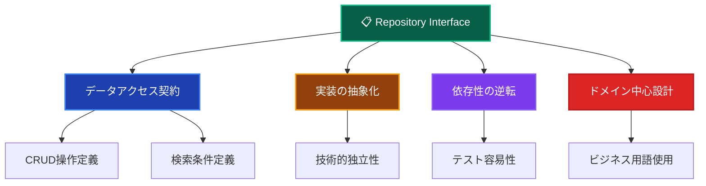
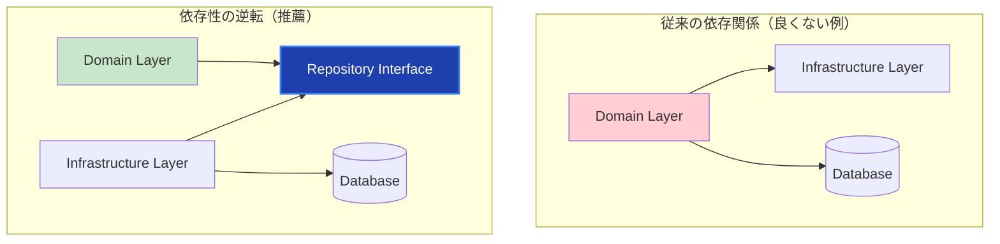

# Repository Interfaces（リポジトリインターフェース）📋

このドキュメントでは、Domain Layer の Repository Interfaces について、その役割と実装ルールを詳しく解説します。

---

## Repository Interfaces とは？ 🤝

Repository Interface（リポジトリインターフェース）は、**Domain Layer でデータアクセスの契約を定義するインターフェース**です。具体的な永続化手段に依存せず、ドメインオブジェクトの保存・取得に必要な操作を抽象的に定義します。

### Repository Interface の特徴 📋



### 依存性の逆転 🔄



---

## ✅ 何をして良いか

### 1. **ドメインオブジェクトに特化した契約定義** 🎯

```typescript
// ✅ 推薦：ドメインに焦点を当てたインターフェース
export interface IUserRepository {
 // 基本CRUD操作
 findById(id: UserId): Promise<User | null>;
 findByEmail(email: Email): Promise<User | null>;
 save(user: User): Promise<void>;
 delete(id: UserId): Promise<void>;

 // ドメイン特有の検索
 findActiveUsers(criteria: ActiveUserCriteria): Promise<User[]>;
 findUsersByLevel(minLevel: number, maxLevel: number): Promise<User[]>;
 findUsersWithRecentActivity(since: Date): Promise<User[]>;

 // ビジネス用語での検索
 findPremiumUsers(): Promise<User[]>;
 findUsersEligibleForPromotion(): Promise<User[]>;
 findInactiveUsersForCleanup(threshold: Date): Promise<User[]>;

 // 集計・統計
 countActiveUsers(): Promise<number>;
 countUsersByLevel(level: number): Promise<number>;

 // トランザクション対応
 save(user: User, transaction?: ITransaction): Promise<void>;
 findByIdForUpdate(id: UserId, transaction: ITransaction): Promise<User | null>;
}
```

### 2. **Value Object を活用した型安全性** 💎

```typescript
// ✅ 推薦：Value Object を使った型安全なインターフェース
export interface IUserRepository {
 // プリミティブ型ではなくValue Objectを使用
 findById(id: UserId): Promise<User | null>;
 findByEmail(email: Email): Promise<User | null>;

 // 複合条件もValue Objectで表現
 findBySearchCriteria(criteria: UserSearchCriteria): Promise<User[]>;

 // 日付もValue Objectで型安全に
 findUsersRegisteredAfter(date: RegistrationDate): Promise<User[]>;
}

// 検索条件のValue Object
export class UserSearchCriteria {
 constructor(
  private readonly namePattern?: string,
  private readonly emailDomain?: string,
  private readonly minLevel?: number,
  private readonly maxLevel?: number,
  private readonly registrationPeriod?: DateRange,
  private readonly isActive?: boolean,
 ) {}

 hasNamePattern(): boolean {
  return this.namePattern !== undefined;
 }

 getNamePattern(): string | undefined {
  return this.namePattern;
 }

 hasLevelRange(): boolean {
  return this.minLevel !== undefined && this.maxLevel !== undefined;
 }

 getMinLevel(): number | undefined {
  return this.minLevel;
 }

 getMaxLevel(): number | undefined {
  return this.maxLevel;
 }
}
```

### 3. **ドメイン駆動な検索メソッド** 🔍

```typescript
// ✅ 推薦：ビジネス意図を表現した検索メソッド
export interface IUserRepository {
 // ✅ ドメイン用語を使用した分かりやすいメソッド名
 findVIPCustomers(): Promise<User[]>;
 findUsersNeedingAttention(): Promise<User[]>;
 findCandidatesForPromotion(): Promise<User[]>;
 findChurnRiskUsers(): Promise<User[]>;

 // ✅ ビジネスルールを表現した条件
 findUsersEligibleForReward(minimumActivity: ActivityLevel): Promise<User[]>;
 findUsersInTrialPeriod(): Promise<User[]>;
 findOverdueSubscriptionUsers(): Promise<User[]>;

 // ✅ ドメインイベントに関連した検索
 findUsersWithPendingNotifications(): Promise<User[]>;
 findUsersRequiringPasswordReset(): Promise<User[]>;
}

// ❌ 避ける：技術的すぎるメソッド名
export interface IUserRepository {
 findUsersByQuery(sql: string): Promise<User[]>; // 技術的すぎる
 findUsersByJsonFilter(filter: object): Promise<User[]>; // 抽象化不足
 getUsersFromTable(tableName: string): Promise<User[]>; // 実装詳細が漏出
}
```

### 4. **仕様パターンの活用** 📊

```typescript
// ✅ 推薦：仕様パターンでの複雑な条件表現
export interface IUserRepository {
 findBySpecification(specification: IUserSpecification): Promise<User[]>;
 countBySpecification(specification: IUserSpecification): Promise<number>;
 existsBySpecification(specification: IUserSpecification): Promise<boolean>;
}

// 仕様インターフェース
export interface IUserSpecification {
 isSatisfiedBy(user: User): boolean;
 and(other: IUserSpecification): IUserSpecification;
 or(other: IUserSpecification): IUserSpecification;
 not(): IUserSpecification;
}

// 具体的な仕様実装例
export class ActiveUserSpecification implements IUserSpecification {
 constructor(private readonly activityThreshold: Date) {}

 isSatisfiedBy(user: User): boolean {
  return user.isActive() && user.getLastLoginAt() > this.activityThreshold;
 }

 and(other: IUserSpecification): IUserSpecification {
  return new AndSpecification(this, other);
 }

 or(other: IUserSpecification): IUserSpecification {
  return new OrSpecification(this, other);
 }

 not(): IUserSpecification {
  return new NotSpecification(this);
 }
}

export class PremiumUserSpecification implements IUserSpecification {
 isSatisfiedBy(user: User): boolean {
  return user.getLevel() >= 5 && user.hasActiveSubscription();
 }

 // and, or, not の実装...
}

// 使用例
const activeAndPremiumUsers = await userRepository.findBySpecification(
 new ActiveUserSpecification(
  new Date(Date.now() - 30 * 24 * 60 * 60 * 1000),
 ).and(new PremiumUserSpecification()),
);
```

### 5. **ページネーションとソート** 📄

```typescript
// ✅ 推薦：ドメイン駆動なページネーション
export interface IUserRepository {
 findWithPagination(
  criteria: UserSearchCriteria,
  pagination: PaginationOptions,
  sort: SortOptions,
 ): Promise<PaginatedResult<User>>;
}

// ページネーション用Value Object
export class PaginationOptions {
 constructor(
  private readonly page: number,
  private readonly size: number,
 ) {
  if (page < 1) {
   throw new DomainError(
    'ページ番号は1以上である必要があります',
    'INVALID_PAGE',
   );
  }
  if (size < 1 || size > 100) {
   throw new DomainError(
    'ページサイズは1-100の範囲である必要があります',
    'INVALID_PAGE_SIZE',
   );
  }
 }

 getPage(): number {
  return this.page;
 }

 getSize(): number {
  return this.size;
 }

 getOffset(): number {
  return (this.page - 1) * this.size;
 }
}

// ソート用Value Object
export class SortOptions {
 constructor(
  private readonly field: SortField,
  private readonly direction: SortDirection,
 ) {}

 getField(): SortField {
  return this.field;
 }

 getDirection(): SortDirection {
  return this.direction;
 }
}

export enum SortField {
 NAME = 'name',
 EMAIL = 'email',
 LEVEL = 'level',
 CREATED_AT = 'createdAt',
 LAST_LOGIN = 'lastLoginAt',
}

export enum SortDirection {
 ASC = 'asc',
 DESC = 'desc',
}

// 結果用Value Object
export class PaginatedResult<T> {
 constructor(
  private readonly items: T[],
  private readonly totalCount: number,
  private readonly pagination: PaginationOptions,
 ) {}

 getItems(): T[] {
  return this.items;
 }

 getTotalCount(): number {
  return this.totalCount;
 }

 getTotalPages(): number {
  return Math.ceil(this.totalCount / this.pagination.getSize());
 }

 hasNextPage(): boolean {
  return this.pagination.getPage() < this.getTotalPages();
 }

 hasPreviousPage(): boolean {
  return this.pagination.getPage() > 1;
 }
}
```

---

## ❌ 何をしてはならないか

### 1. **実装詳細の漏出** 🚫

```typescript
// ❌ 禁止：データベース固有の型や概念の露出
export interface IUserRepository {
 // SQL固有の概念
 findUsersBySQL(sql: string): Promise<User[]>; // 禁止
 executeQuery(query: QueryBuilder): Promise<User[]>; // 禁止

 // ORM固有の型
 findUsersPrisma(where: Prisma.UserWhereInput): Promise<User[]>; // 禁止

 // データベーススキーマの露出
 findUsersFromUserTable(): Promise<UserTableRow[]>; // 禁止

 // 技術的な実装詳細
 findUsersWithJoin(joinClause: string): Promise<User[]>; // 禁止
}
```

### 2. **Application Layer の機能含有** 📋

```typescript
// ❌ 禁止：ユースケース的な処理をインターフェースに含める
export interface IUserRepository {
 // 複数の操作を組み合わせた処理（Use Caseの責務）
 createUserWithWelcomeEmail(userData: UserData): Promise<User>; // 禁止
 updateUserAndNotifyAdmins(user: User): Promise<void>; // 禁止
 deleteUserAndCleanupData(id: UserId): Promise<void>; // 禁止

 // 外部サービス呼び出しを含む処理
 saveUserAndSendEmail(user: User): Promise<void>; // 禁止
 validateUserWithExternalAPI(user: User): Promise<boolean>; // 禁止
}
```

### 3. **UI・表示用の情報を含む** 🎨

```typescript
// ❌ 禁止：表示用データの取得
export interface IUserRepository {
 // 表示用フォーマット（Presentation Layerの責務）
 findUsersForDisplay(): Promise<UserDisplayData[]>; // 禁止
 getUsersSummaryWithFormatting(): Promise<UserSummaryView[]>; // 禁止

 // UI固有の構造
 findUsersForDropdown(): Promise<DropdownOption[]>; // 禁止
 getUsersForTable(columns: string[]): Promise<TableRow[]>; // 禁止
}

// 適切な分離
export interface IUserRepository {
 // ✅ ドメインオブジェクトのみを返す
 findActiveUsers(): Promise<User[]>;
 findUsersSummary(): Promise<UserSummary[]>; // ドメインのサマリー
}
```

### 4. **過度に汎用的なインターフェース** 🔧

```typescript
// ❌ 禁止：汎用すぎるインターフェース
export interface IUserRepository {
 // 何でもできる汎用メソッド
 find(criteria: any): Promise<any[]>; // 禁止
 query(params: object): Promise<object[]>; // 禁止
 search(filter: Filter): Promise<Entity[]>; // 禁止

 // 型安全性を犠牲にした汎用性
 findByCriteria(criteria: Record<string, any>): Promise<User[]>; // 禁止
}

// ✅ 推薦：型安全で意図が明確
export interface IUserRepository {
 findById(id: UserId): Promise<User | null>;
 findByEmail(email: Email): Promise<User | null>;
 findBySearchCriteria(criteria: UserSearchCriteria): Promise<User[]>;
}
```

### 5. **トランザクション管理の詳細露出** 🔄

```typescript
// ❌ 禁止：具体的なトランザクション実装の露出
export interface IUserRepository {
 // 具体的なトランザクション型
 saveWithPrismaTransaction(user: User, tx: PrismaTransaction): Promise<void>; // 禁止
 saveWithDatabaseConnection(
  user: User,
  conn: DatabaseConnection,
 ): Promise<void>; // 禁止

 // トランザクション制御
 beginTransaction(): Promise<DatabaseTransaction>; // 禁止
 commitTransaction(tx: DatabaseTransaction): Promise<void>; // 禁止
 rollbackTransaction(tx: DatabaseTransaction): Promise<void>; // 禁止
}

// ✅ 推薦：抽象的なトランザクション概念
export interface IUserRepository {
 save(user: User, transaction?: ITransaction): Promise<void>;
 findByIdForUpdate(id: UserId, transaction: ITransaction): Promise<User | null>;
}

// 抽象的なトランザクションインターフェース
export interface ITransaction {
 // 具体的な実装は Infrastructure Layer で定義
}
```

---

## 🏗️ 設計パターンとベストプラクティス

### 1. **Command Query Separation** 📊

```typescript
// ✅ 推薦：コマンドとクエリの明確な分離
export interface IUserRepository {
 // コマンド（状態を変更する操作）
 save(user: User): Promise<void>;
 delete(id: UserId): Promise<void>;

 // クエリ（状態を変更しない操作）
 findById(id: UserId): Promise<User | null>;
 findByEmail(email: Email): Promise<User | null>;
 exists(id: UserId): Promise<boolean>;
 count(): Promise<number>;
}

// コマンドは void または結果の識別子のみを返す
// クエリは状態を変更せず、データを返す
```

### 2. **Collection-Oriented Interface** 📚

```typescript
// ✅ 推薦：コレクション指向のインターフェース
export interface IUserRepository {
 // コレクションのように扱える操作
 add(user: User): Promise<void>;
 remove(user: User): Promise<void>;
 contains(user: User): Promise<boolean>;

 // ドメイン言語での検索
 findAll(): Promise<User[]>;
 findMatching(specification: IUserSpecification): Promise<User[]>;

 // 一意性制約の表現
 findByUniqueEmail(email: Email): Promise<User | null>;
}
```

### 3. **Aggregate Root Focus** 🌳

```typescript
// ✅ 推薦：Aggregate Root に焦点を当てたリポジトリ
export interface IUserRepository {
 // User Aggregate のルートエンティティのみを扱う
 findById(id: UserId): Promise<User | null>;
 save(user: User): Promise<void>; // Aggregate 全体を保存
 delete(id: UserId): Promise<void>; // Aggregate 全体を削除
}

// ❌ 避ける：子エンティティを直接操作するリポジトリ
export interface IUserProfileRepository {
 // User の一部を直接操作
 findByUserId(userId: UserId): Promise<UserProfile | null>; // 避ける
 saveProfile(profile: UserProfile): Promise<void>; // 避ける
}

// User Aggregate 内の Profile は User 経由でアクセス
const user = await userRepository.findById(userId);
if (user) {
 user.updateProfile(newProfileData);
 await userRepository.save(user); // Aggregate 全体を保存
}
```

### 4. **Factory メソッドパターン** 🏭

```typescript
// ✅ 推薦：検索条件のファクトリーメソッド
export interface IUserRepository {
 findBySpecification(spec: IUserSpecification): Promise<User[]>;
}

// ファクトリークラスで検索条件を構築
export class UserSpecifications {
 static isActive(): IUserSpecification {
  return new ActiveUserSpecification();
 }

 static hasLevel(level: number): IUserSpecification {
  return new UserLevelSpecification(level);
 }

 static registeredAfter(date: Date): IUserSpecification {
  return new RegistrationDateSpecification(date);
 }

 static isVIP(): IUserSpecification {
  return this.hasLevel(10).and(this.isActive());
 }

 static needsAttention(): IUserSpecification {
  return new InactiveUserSpecification().or(
   new OverdueSubscriptionSpecification(),
  );
 }
}

// 使用例
const vipUsers = await userRepository.findBySpecification(
 UserSpecifications.isVIP(),
);

const usersNeedingAttention = await userRepository.findBySpecification(
 UserSpecifications.needsAttention(),
);
```

---

## 🧪 テスト戦略

### Repository Interface のテスト

```typescript
// ✅ インターフェース準拠テスト
export function createUserRepositoryTests(
 repositoryFactory: () => IUserRepository,
 cleanup: () => Promise<void>,
) {
 describe('IUserRepository Implementation Tests', () => {
  let repository: IUserRepository;

  beforeEach(async () => {
   repository = repositoryFactory();
  });

  afterEach(async () => {
   await cleanup();
  });

  describe('findById', () => {
   it('存在するユーザーを取得できる', async () => {
    // Arrange
    const user = User.create(
     new UserId('test-123'),
     new Email('test@example.com'),
     'テストユーザー',
    );
    await repository.save(user);

    // Act
    const found = await repository.findById(user.getId());

    // Assert
    expect(found).not.toBeNull();
    expect(found!.getId().equals(user.getId())).toBe(true);
    expect(found!.getEmail().equals(user.getEmail())).toBe(true);
   });

   it('存在しないユーザーの場合nullを返す', async () => {
    // Act
    const found = await repository.findById(new UserId('nonexistent'));

    // Assert
    expect(found).toBeNull();
   });
  });

  describe('save', () => {
   it('新しいユーザーを保存できる', async () => {
    // Arrange
    const user = User.create(
     new UserId('new-user-123'),
     new Email('new@example.com'),
     'New User',
    );

    // Act
    await repository.save(user);

    // Assert
    const saved = await repository.findById(user.getId());
    expect(saved).not.toBeNull();
    expect(saved!.getName()).toBe('New User');
   });
  });

  describe('specification pattern', () => {
   it('仕様による検索ができる', async () => {
    // Arrange
    const activeUser = User.create(
     new UserId('active-1'),
     new Email('active@example.com'),
     'Active User',
    );
    activeUser.recordLogin(); // アクティブにする

    const inactiveUser = User.create(
     new UserId('inactive-1'),
     new Email('inactive@example.com'),
     'Inactive User',
    );

    await repository.save(activeUser);
    await repository.save(inactiveUser);

    // Act
    const activeUsers = await repository.findBySpecification(
     UserSpecifications.isActive(),
    );

    // Assert
    expect(activeUsers).toHaveLength(1);
    expect(activeUsers[0].getId().equals(activeUser.getId())).toBe(true);
   });
  });
 });
}

// 異なる実装でのテスト実行
describe('Prisma Repository', () => {
 createUserRepositoryTests(
  () => new PrismaUserRepository(databaseFactory, logger),
  () => cleanupPrismaTestData(),
 );
});

describe('In-Memory Repository', () => {
 createUserRepositoryTests(
  () => new InMemoryUserRepository(),
  () => Promise.resolve(),
 );
});
```

---

## 🔍 実装チェックリスト

Repository Interface を定義する際の確認事項：

### インターフェース設計

- [ ] ドメインオブジェクトのみを扱っている
- [ ] Value Object を適切に使用している
- [ ] ビジネス用語でメソッド名を定義している
- [ ] Command Query Separation を適用している

### 抽象化レベル

- [ ] 実装技術に依存していない
- [ ] データベース固有の概念を含んでいない
- [ ] 適切なレベルの抽象化を保っている

### 責務分離

- [ ] Application Layer の責務を含んでいない
- [ ] Presentation Layer の責務を含んでいない
- [ ] 単一の Aggregate Root にフォーカスしている

### テスト容易性

- [ ] モック化が容易な設計になっている
- [ ] インターフェース準拠テストが作成可能
- [ ] 複数の実装でテストできる

---

**Repository Interface は Domain Layer の重要な境界です。適切な抽象化により、ビジネスロジックを技術的詳細から独立させることができます！** 📋✨
