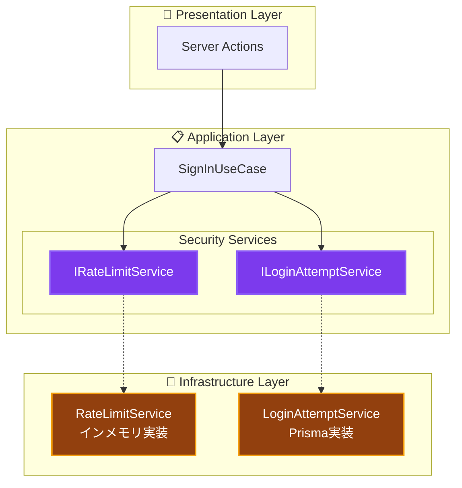

# セキュリティサービス実装ガイド 🔐

認証・認可に関わるセキュリティサービスの実装パターンと使用方法

---

## 📖 このドキュメントについて

### 🎯 目的

- **実装理解**: 各セキュリティサービスの内部動作と設計意図
- **使用方法**: UseCase内での適切な使用パターン
- **テスト**: セキュリティサービスのテスト戦略

### 📚 前提知識

- **必須**: [セキュリティ概念](../../cross-cutting/security.md)
- **推奨**: [依存性注入](../../../../architecture/patterns/dependency-injection.md)
- **参考**: [環境変数リファレンス](../../../../reference/environment-variables.md)

### 🔗 関連ドキュメント

- **[UseCase実装](use-cases.md)** - UseCase内での使用方法
- **[DIコンテナ](di-container.md)** - サービス登録と解決
- **[エラーハンドリング](../../cross-cutting/error-handling.md)** - セキュリティエラー処理

---

## 🏗️ セキュリティサービス全体像



---

## 🛡️ Rate Limit Service

### 概要

認証エンドポイントへの過剰なリクエストを防止するためのサービス。
**Sliding Window Log** アルゴリズムを使用。

### インターフェース定義

```typescript
// src/layers/application/interfaces/IRateLimitService.ts

export interface RateLimitCheckResult {
  /** リクエストが許可されたか */
  allowed: boolean;
  /** 現在のリクエスト数 */
  current: number;
  /** ウィンドウ内の上限 */
  limit: number;
  /** 残りリクエスト数 */
  remaining: number;
  /** 制限超過時: 再試行可能になるまでのミリ秒 */
  retryAfterMs?: number;
}

export interface IRateLimitService {
  /**
   * Rate Limitをチェックし、リクエストを記録
   * @param key 識別キー（例: IPアドレス、ユーザーID）
   */
  checkLimit(key: string): Promise<RateLimitCheckResult>;

  /**
   * 指定キーのRate Limitをリセット
   */
  resetLimit(key: string): Promise<void>;

  /**
   * 期限切れエントリのクリーンアップ
   */
  cleanup(): Promise<void>;
}
```

### 実装詳細

```typescript
// src/layers/infrastructure/services/RateLimitService.ts

@injectable()
export class RateLimitService implements IRateLimitService {
  /**
   * キー別のリクエストタイムスタンプ記録
   * Map<識別キー, タイムスタンプ配列>
   */
  private readonly requests = new Map<string, number[]>();

  constructor(@inject(INJECTION_TOKENS.Logger) private logger: ILogger) {}

  async checkLimit(key: string): Promise<RateLimitCheckResult> {
    // Rate Limit機能が無効の場合
    if (!Env.AUTH_RATE_LIMIT_ENABLED) {
      return {
        allowed: true,
        current: 0,
        limit: Env.AUTH_RATE_LIMIT_MAX,
        remaining: Env.AUTH_RATE_LIMIT_MAX,
      };
    }

    const now = Date.now();
    const windowStart = now - Env.AUTH_RATE_LIMIT_WINDOW_MS;

    // 既存のリクエスト記録を取得し、ウィンドウ内のものだけフィルタ
    const existingRequests = this.requests.get(key) ?? [];
    const windowRequests = existingRequests.filter(
      (timestamp) => timestamp > windowStart,
    );

    const currentCount = windowRequests.length;
    const limit = Env.AUTH_RATE_LIMIT_MAX;

    // 制限超過チェック
    if (currentCount >= limit) {
      const oldestRequest = Math.min(...windowRequests);
      const retryAfterMs = oldestRequest + Env.AUTH_RATE_LIMIT_WINDOW_MS - now;

      return {
        allowed: false,
        current: currentCount,
        limit,
        retryAfterMs: Math.max(0, retryAfterMs),
        remaining: 0,
      };
    }

    // リクエストを記録
    windowRequests.push(now);
    this.requests.set(key, windowRequests);

    return {
      allowed: true,
      current: currentCount + 1,
      limit,
      remaining: limit - currentCount - 1,
    };
  }
}
```

### 設計ポイント

| 項目 | 説明 |
|------|------|
| **アルゴリズム** | Sliding Window Log（正確だがメモリ使用量多め） |
| **ストレージ** | インメモリ Map（サーバー再起動でリセット） |
| **スケーラビリティ** | 単一サーバー向け。分散環境では Redis 等への置き換え推奨 |
| **クリーンアップ** | `cleanup()` メソッドで古いエントリを定期削除 |

### UseCase での使用例

```typescript
@injectable()
export class SignInUseCase {
  constructor(
    @inject(INJECTION_TOKENS.RateLimitService)
    private rateLimitService: IRateLimitService,
    // ... 他の依存関係
  ) {}

  async execute(request: SignInRequest): Promise<Result<SignInResponse>> {
    // Rate Limit チェック（IPアドレスベース）
    const rateLimitKey = `signin:${request.ipAddress}`;
    const rateLimitResult = await this.rateLimitService.checkLimit(rateLimitKey);

    if (!rateLimitResult.allowed) {
      this.logger.warn('Rate Limit超過', {
        ip: request.ipAddress,
        retryAfterMs: rateLimitResult.retryAfterMs,
      });

      return failure(
        `リクエストが多すぎます。${Math.ceil(rateLimitResult.retryAfterMs! / 1000)}秒後に再試行してください`,
        'RATE_LIMIT_EXCEEDED',
      );
    }

    // 認証処理続行...
  }
}
```

---

## 🔒 Login Attempt Service

### 概要

ブルートフォース攻撃を防止するためのアカウントロックアウト機能。
**データベースベース**で永続化され、サーバー再起動後もロック状態を維持。

### インターフェース定義

```typescript
// src/layers/application/interfaces/ILoginAttemptService.ts

export interface LockoutCheckResult {
  /** アカウントがロックされているか */
  isLocked: boolean;
  /** 失敗回数 */
  failedAttempts: number;
  /** 残りの試行回数 */
  remainingAttempts: number;
  /** ロック解除時刻（ロック中の場合） */
  lockoutUntil?: Date;
}

export interface RecordAttemptParams {
  /** 対象メールアドレス */
  email: string;
  /** ログイン成功/失敗 */
  success: boolean;
  /** IPアドレス（監査用） */
  ipAddress?: string;
  /** 失敗理由（失敗時） */
  failureReason?: string;
}

export interface ILoginAttemptService {
  /**
   * ログイン試行を記録
   */
  recordAttempt(params: RecordAttemptParams): Promise<void>;

  /**
   * アカウントのロックアウト状態をチェック
   */
  checkLockout(email: string): Promise<LockoutCheckResult>;

  /**
   * 指定メールアドレスの試行履歴をリセット
   */
  resetAttempts(email: string): Promise<void>;

  /**
   * 古い履歴のクリーンアップ
   */
  cleanup(retentionDays: number): Promise<number>;
}
```

### 実装詳細

```typescript
// src/layers/infrastructure/services/LoginAttemptService.ts

@injectable()
export class LoginAttemptService implements ILoginAttemptService {
  constructor(
    @inject(INJECTION_TOKENS.PrismaClient) private prisma: PrismaClient,
    @inject(INJECTION_TOKENS.Logger) private logger: ILogger,
  ) {}

  async checkLockout(email: string): Promise<LockoutCheckResult> {
    const normalizedEmail = email.toLowerCase();

    // ロックアウト機能が無効の場合
    if (!Env.AUTH_LOCKOUT_ENABLED) {
      return {
        isLocked: false,
        failedAttempts: 0,
        remainingAttempts: Env.AUTH_LOCKOUT_THRESHOLD,
      };
    }

    const windowStart = new Date(Date.now() - Env.AUTH_LOCKOUT_DURATION_MS);

    // Race Condition対策: トランザクション内で全クエリを実行
    const result = await this.prisma.$transaction(async (tx) => {
      // 最後の成功を取得
      const lastSuccess = await tx.loginAttempt.findFirst({
        where: { email: normalizedEmail, success: true },
        orderBy: { createdAt: 'desc' },
      });

      // ウィンドウ内の失敗回数をカウント
      const failedAttempts = await tx.loginAttempt.count({
        where: {
          email: normalizedEmail,
          success: false,
          createdAt: {
            gte: lastSuccess ? lastSuccess.createdAt : windowStart,
          },
        },
      });

      // 最後の失敗を取得（ロック解除時刻の計算用）
      const lastFailure = await tx.loginAttempt.findFirst({
        where: {
          email: normalizedEmail,
          success: false,
          createdAt: {
            gte: lastSuccess ? lastSuccess.createdAt : windowStart,
          },
        },
        orderBy: { createdAt: 'desc' },
      });

      return { lastSuccess, failedAttempts, lastFailure };
    });

    const { failedAttempts, lastFailure } = result;
    const isLocked = failedAttempts >= Env.AUTH_LOCKOUT_THRESHOLD;

    // ロック期間が過ぎていればロック解除
    if (isLocked && lastFailure) {
      const lockoutUntil = new Date(
        lastFailure.createdAt.getTime() + Env.AUTH_LOCKOUT_DURATION_MS,
      );

      if (lockoutUntil <= new Date()) {
        return {
          isLocked: false,
          failedAttempts: 0,
          remainingAttempts: Env.AUTH_LOCKOUT_THRESHOLD,
        };
      }

      return {
        isLocked: true,
        failedAttempts,
        lockoutUntil,
        remainingAttempts: 0,
      };
    }

    return {
      isLocked,
      failedAttempts,
      remainingAttempts: Math.max(0, Env.AUTH_LOCKOUT_THRESHOLD - failedAttempts),
    };
  }
}
```

### 設計ポイント

| 項目 | 説明 |
|------|------|
| **ストレージ** | Prisma/PostgreSQL（永続化） |
| **リセット条件** | 成功ログインで失敗カウントをリセット |
| **自動解除** | ロック期間経過後に自動解除 |
| **Race Condition対策** | トランザクションで一貫性を保証 |
| **監査証跡** | 全試行を記録（成功/失敗問わず） |

### UseCase での使用例

```typescript
@injectable()
export class SignInUseCase {
  constructor(
    @inject(INJECTION_TOKENS.LoginAttemptService)
    private loginAttemptService: ILoginAttemptService,
    // ... 他の依存関係
  ) {}

  async execute(request: SignInRequest): Promise<Result<SignInResponse>> {
    // ロックアウトチェック
    const lockoutResult = await this.loginAttemptService.checkLockout(
      request.email,
    );

    if (lockoutResult.isLocked) {
      this.logger.warn('アカウントロックアウト中', {
        email: request.email,
        lockoutUntil: lockoutResult.lockoutUntil,
      });

      return failure(
        `アカウントがロックされています。${lockoutResult.lockoutUntil?.toLocaleString()}以降に再試行してください`,
        'ACCOUNT_LOCKED',
      );
    }

    // 認証処理...
    const authResult = await this.authenticate(request);

    // 結果を記録
    await this.loginAttemptService.recordAttempt({
      email: request.email,
      success: authResult.success,
      ipAddress: request.ipAddress,
      failureReason: authResult.success ? undefined : authResult.reason,
    });

    if (!authResult.success) {
      // 残り試行回数を通知
      const remaining = lockoutResult.remainingAttempts - 1;
      if (remaining > 0) {
        return failure(
          `認証に失敗しました。残り${remaining}回で${Env.AUTH_LOCKOUT_DURATION_MS / 60000}分間ロックされます`,
          'INVALID_CREDENTIALS',
        );
      }
    }

    // 成功処理...
  }
}
```

---

## 🔑 Token Service

### 概要

JWT/セッショントークンの生成・検証を担当するサービス。

### インターフェース定義

```typescript
// src/layers/application/services/TokenService.ts

export interface TokenSessionResult {
  accessToken: string;
  accessTokenExpireAt: Date;
  resetToken: string;
  resetTokenExpireAt: Date;
  session: UserSessionWithUser;
}

export interface ITokenService {
  /**
   * 新しいトークンセッションを作成
   */
  createNewTokenSession(userId: string): Promise<Result<TokenSessionResult>>;
}
```

### UseCase での使用例

```typescript
@injectable()
export class SignInUseCase {
  constructor(
    @inject(INJECTION_TOKENS.TokenService)
    private tokenService: ITokenService,
    // ... 他の依存関係
  ) {}

  async execute(request: SignInRequest): Promise<Result<SignInResponse>> {
    // 認証成功後、トークン発行
    const tokenResult = await this.tokenService.createNewTokenSession(user.id.value);

    if (isFailure(tokenResult)) {
      return failure(tokenResult.error.message, tokenResult.error.code);
    }

    return success({
      accessToken: tokenResult.data.accessToken,
      expiresAt: tokenResult.data.accessTokenExpireAt,
      user: {
        id: user.id.value,
        email: user.email.value,
        name: user.name,
      },
    });
  }
}
```

---

## 🧪 テスト戦略

### モック生成（vitest-mock-extended）

```typescript
// tests/utils/mocks/autoMocks.ts

export const createAutoMockRateLimitService = (): MockProxy<IRateLimitService> => {
  const mockService = mock<IRateLimitService>();
  // デフォルトでRate Limitを許可する状態を返す
  mockService.checkLimit.mockResolvedValue({
    allowed: true,
    current: 0,
    limit: 5,
    remaining: 5,
  });
  mockService.resetLimit.mockResolvedValue(undefined);
  mockService.cleanup.mockResolvedValue(undefined);
  return mockService;
};

export const createAutoMockLoginAttemptService = (): MockProxy<ILoginAttemptService> => {
  const mockService = mock<ILoginAttemptService>();
  // デフォルトでロックアウト無し、Rate Limit無しの状態を返す
  mockService.checkLockout.mockResolvedValue({
    isLocked: false,
    failedAttempts: 0,
    remainingAttempts: 5,
  });
  mockService.recordAttempt.mockResolvedValue(undefined);
  mockService.resetAttempts.mockResolvedValue(undefined);
  return mockService;
};
```

### テスト例

```typescript
describe('SignInUseCase - セキュリティ', () => {
  let useCase: SignInUseCase;
  let mockRateLimitService: MockProxy<IRateLimitService>;
  let mockLoginAttemptService: MockProxy<ILoginAttemptService>;

  setupTestEnvironment();

  beforeEach(() => {
    mockRateLimitService = createAutoMockRateLimitService();
    mockLoginAttemptService = createAutoMockLoginAttemptService();

    container.registerInstance(
      INJECTION_TOKENS.RateLimitService,
      mockRateLimitService,
    );
    container.registerInstance(
      INJECTION_TOKENS.LoginAttemptService,
      mockLoginAttemptService,
    );

    useCase = resolve('SignInUseCase');
  });

  describe('Rate Limiting', () => {
    it('Rate Limit超過時はエラーを返す', async () => {
      // Arrange
      mockRateLimitService.checkLimit.mockResolvedValue({
        allowed: false,
        current: 5,
        limit: 5,
        remaining: 0,
        retryAfterMs: 30000,
      });

      // Act
      const result = await useCase.execute(validRequest);

      // Assert
      expect(isFailure(result)).toBe(true);
      if (isFailure(result)) {
        expect(result.error.code).toBe('RATE_LIMIT_EXCEEDED');
      }
    });
  });

  describe('アカウントロックアウト', () => {
    it('ロックアウト中はエラーを返す', async () => {
      // Arrange
      mockLoginAttemptService.checkLockout.mockResolvedValue({
        isLocked: true,
        failedAttempts: 5,
        remainingAttempts: 0,
        lockoutUntil: new Date(Date.now() + 900000),
      });

      // Act
      const result = await useCase.execute(validRequest);

      // Assert
      expect(isFailure(result)).toBe(true);
      if (isFailure(result)) {
        expect(result.error.code).toBe('ACCOUNT_LOCKED');
      }
    });

    it('認証失敗時にログイン試行を記録する', async () => {
      // Arrange - 認証失敗をセットアップ
      mockUserRepository.findByEmail.mockResolvedValue(null);

      // Act
      await useCase.execute(validRequest);

      // Assert
      expect(mockLoginAttemptService.recordAttempt).toHaveBeenCalledWith(
        expect.objectContaining({
          email: validRequest.email,
          success: false,
        }),
      );
    });
  });
});
```

---

## 📊 セキュリティサービス比較

| 項目 | RateLimitService | LoginAttemptService |
|------|------------------|---------------------|
| **目的** | リクエスト頻度制限 | アカウント保護 |
| **識別キー** | IPアドレス/ユーザーID | メールアドレス |
| **ストレージ** | インメモリ | データベース |
| **永続化** | なし（再起動でリセット） | あり |
| **環境変数** | `AUTH_RATE_LIMIT_*` | `AUTH_LOCKOUT_*` |
| **本番推奨** | Redis置き換え | そのまま使用可 |

---

## 🔧 DI登録

```typescript
// src/di/containers/infrastructure.container.ts

container.registerSingleton<IRateLimitService>(
  INJECTION_TOKENS.RateLimitService,
  RateLimitService,
);

container.registerSingleton<ILoginAttemptService>(
  INJECTION_TOKENS.LoginAttemptService,
  LoginAttemptService,
);
```

---

## 📚 関連ドキュメント

- **[セキュリティ概念](../../cross-cutting/security.md)** - セキュリティ全体像
- **[環境変数リファレンス](../../../../reference/environment-variables.md)** - 設定値詳細
- **[UseCase実装](use-cases.md)** - UseCase内での統合方法
- **[テスト戦略](../../../../testing/strategy.md)** - セキュリティテスト

---

**🔐 適切なセキュリティサービス実装で、安全なアプリケーションを構築しましょう！**
