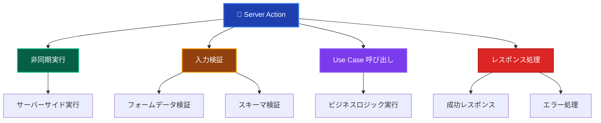
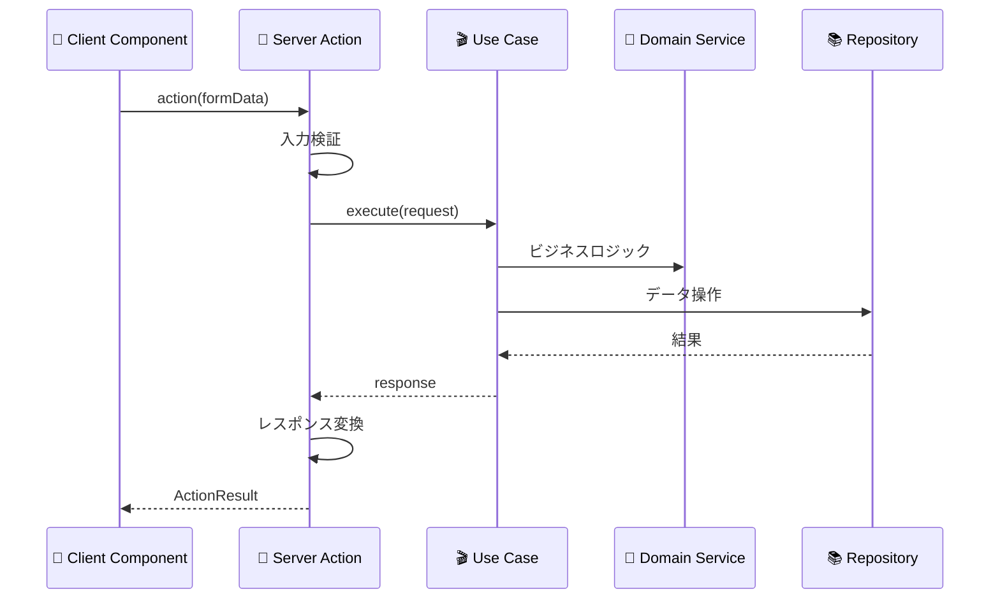
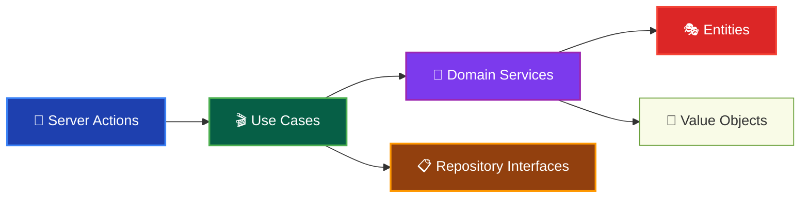
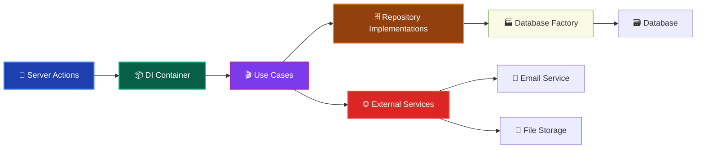

# Server Actions（サーバーアクション）🚀

このドキュメントでは、Presentation Layer の Server Actions について、その役割と実装ルールを詳しく解説します。

---

## Server Actions とは？ ⚡

Server Action（サーバーアクション）は、**Next.js App Router の機能で、サーバー側で実行される非同期関数**です。フォーム送信やユーザーアクションに対応し、Use Case を呼び出してビジネスロジックを実行し、結果をクライアントに返します。

### Server Action の特徴 📋



### Server Action の実行フロー 🎭



### Domain Layer との関係 👑



### Infrastructure Layer との関係 🔧



---

## ✅ 何をして良いか

### 1. **フォームデータの受け取りと検証** 📝

```typescript
// ✅ 推薦：適切な入力検証を持つServer Action
'use server';

import 'reflect-metadata'; // ⚠️ TSyringe DI使用時は必須

import { resolve } from '@/di/resolver';
import { isFailure } from '@/layers/application/types/Result';
import { DomainError } from '@/layers/domain/errors/DomainError';
import { redirect } from 'next/navigation';
import { z } from 'zod';

// 入力スキーマ定義
const CreateUserSchema = z.object({
 name: z.string().min(1, '名前は必須です').max(50, '名前は50文字以内です'),
 email: z.string().email('有効なメールアドレスを入力してください'),
 password: z.string().min(8, 'パスワードは8文字以上です'),
});

export interface CreateUserActionResult {
 success: boolean;
 message: string;
 errors?: Record<string, string[]>;
 userId?: string;
}

export async function createUserAction(
 formData: FormData,
): Promise<CreateUserActionResult> {
 try {
  // 1. フォームデータの抽出
  const rawData = {
   name: formData.get('name') as string,
   email: formData.get('email') as string,
   password: formData.get('password') as string,
  };

  // 2. 入力データの検証
  const validationResult = CreateUserSchema.safeParse(rawData);
  if (!validationResult.success) {
   return {
    success: false,
    message: '入力データが正しくありません',
    errors: validationResult.error.flatten().fieldErrors,
   };
  }

  // 3. Use Case の実行（resolve関数でDIコンテナから取得）
  const createUserUseCase = resolve('CreateUserUseCase');
  const result = await createUserUseCase.execute({
   name: validationResult.data.name,
   email: validationResult.data.email,
   password: validationResult.data.password,
  });

  // 4. Result型パターンでの成功/失敗判定
  if (isFailure(result)) {
   return {
    success: false,
    message: result.error.message,
   };
  }

  // 5. 成功レスポンス
  return {
   success: true,
   message: 'ユーザーを作成しました',
   userId: result.data.id,
  };
 } catch (error) {
  // 6. 予期しないエラーハンドリング
  console.error('ユーザー作成エラー:', error);

  return {
   success: false,
   message: 'システムエラーが発生しました',
  };
 }
}
```

### 2. **認証・認可の処理** 🔐

```typescript
// ✅ 推薦：認証を伴うServer Action
'use server';

import 'reflect-metadata'; // ⚠️ TSyringe DI使用時は必須

import { resolve } from '@/di/resolver';
import { isFailure } from '@/layers/application/types/Result';
import { cookies } from 'next/headers';
import { redirect } from 'next/navigation';

export async function updateUserProfileAction(
 formData: FormData,
): Promise<UpdateProfileActionResult> {
 try {
  // 1. 認証チェック
  const sessionToken = (await cookies()).get('session-token')?.value;
  if (!sessionToken) {
   redirect('/login');
  }

  // 2. セッション検証
  const authService = resolve('AuthenticationService');
  const currentUser = await authService.getCurrentUser(sessionToken);
  if (!currentUser) {
   redirect('/login');
  }

  // 3. 入力データの検証
  const updateData = {
   name: formData.get('name') as string,
   bio: formData.get('bio') as string,
  };

  const validationResult = UpdateProfileSchema.safeParse(updateData);
  if (!validationResult.success) {
   return {
    success: false,
    message: '入力データが正しくありません',
    errors: validationResult.error.flatten().fieldErrors,
   };
  }

  // 4. Use Case の実行（認証済みユーザーIDを渡す）
  const updateProfileUseCase = resolve('UpdateUserProfileUseCase');
  const result = await updateProfileUseCase.execute({
   userId: currentUser.id,
   name: validationResult.data.name,
   bio: validationResult.data.bio,
  });

  if (isFailure(result)) {
   return {
    success: false,
    message: result.error.message,
   };
  }

  return {
   success: true,
   message: 'プロフィールを更新しました',
  };
 } catch (error) {
  return {
   success: false,
   message: 'プロフィールの更新に失敗しました',
  };
 }
}
```

### 3. **ファイルアップロードの処理** 📁

```typescript
// ✅ 推薦：ファイルアップロード対応Server Action
'use server';

import 'reflect-metadata'; // ⚠️ TSyringe DI使用時は必須

import { resolve } from '@/di/resolver';
import { isFailure } from '@/layers/application/types/Result';
import { redirect } from 'next/navigation';

export async function uploadAvatarAction(
 formData: FormData,
): Promise<UploadAvatarActionResult> {
 try {
  // 1. 認証チェック
  const currentUser = await getCurrentAuthenticatedUser();
  if (!currentUser) {
   redirect('/login');
  }

  // 2. ファイル取得と検証
  const file = formData.get('avatar') as File;
  if (!file || file.size === 0) {
   return {
    success: false,
    message: 'ファイルを選択してください',
   };
  }

  // ファイルサイズ制限（5MB）
  if (file.size > 5 * 1024 * 1024) {
   return {
    success: false,
    message: 'ファイルサイズは5MB以下にしてください',
   };
  }

  // ファイル形式チェック
  const allowedTypes = ['image/jpeg', 'image/png', 'image/webp'];
  if (!allowedTypes.includes(file.type)) {
   return {
    success: false,
    message: 'JPEG、PNG、WebP形式のファイルのみアップロード可能です',
   };
  }

  // 3. ファイルデータをバッファに変換
  const buffer = Buffer.from(await file.arrayBuffer());

  // 4. Use Case の実行
  const uploadAvatarUseCase = resolve('UploadUserAvatarUseCase');
  const result = await uploadAvatarUseCase.execute({
   userId: currentUser.id,
   fileName: file.name,
   fileType: file.type,
   fileBuffer: buffer,
  });

  if (isFailure(result)) {
   return {
    success: false,
    message: result.error.message,
   };
  }

  return {
   success: true,
   message: 'アバターをアップロードしました',
   avatarUrl: result.data.avatarUrl,
  };
 } catch (error) {
  console.error('アバターアップロードエラー:', error);

  return {
   success: false,
   message: 'アバターのアップロードに失敗しました',
  };
 }
}
```

### 4. **リダイレクト処理** 🔄

```typescript
// ✅ 推薦：適切なリダイレクト処理
'use server';

import { revalidatePath } from 'next/cache';
import { redirect } from 'next/navigation';

export async function deleteUserAction(userId: string): Promise<void> {
 try {
  // 1. 認証・認可チェック
  const currentUser = await getCurrentAuthenticatedUser();
  if (!currentUser) {
   redirect('/login');
  }

  // 2. Use Case の実行
  const deleteUserUseCase = resolve('DeleteUserUseCase');
  await deleteUserUseCase.execute({ targetUserId: userId, requesterId: currentUser.id });

  // 3. キャッシュの再検証
  revalidatePath('/admin/users');

  // 4. リダイレクト
  redirect('/admin/users?deleted=true');
 } catch (error) {
  if (error instanceof ApplicationError) {
   // エラー情報をクエリパラメータで渡す
   redirect(`/admin/users?error=${encodeURIComponent(error.message)}`);
  }

  redirect('/admin/users?error=delete_failed');
 }
}

// 条件付きリダイレクト
export async function loginAction(
 formData: FormData,
): Promise<LoginActionResult> {
 try {
  const loginData = {
   email: formData.get('email') as string,
   password: formData.get('password') as string,
   redirectTo: (formData.get('redirectTo') as string) || '/dashboard',
  };

  // バリデーション
  const validationResult = LoginSchema.safeParse(loginData);
  if (!validationResult.success) {
   return {
    success: false,
    errors: validationResult.error.flatten().fieldErrors,
   };
  }

  // サインイン処理
  const loginUseCase = resolve('SignInUseCase');
  const result = await loginUseCase.execute({
   email: validationResult.data.email,
   password: validationResult.data.password,
  });

  // Result型パターンでの成功/失敗判定
  if (isFailure(result)) {
   return {
    success: false,
    message: result.error.message,
   };
  }

  // セッションCookie設定
  (await cookies()).set('session-token', result.data.sessionToken, {
   httpOnly: true,
   secure: process.env.NODE_ENV === 'production',
   sameSite: 'strict',
   maxAge: 60 * 60 * 24 * 7, // 7日間
  });

  // 成功時のリダイレクト
  redirect(validationResult.data.redirectTo);
 } catch (error) {
  return {
   success: false,
   message: 'サインインに失敗しました',
  };
 }
}
```

### 5. **キャッシュの管理** 💾

```typescript
// ✅ 推薦：適切なキャッシュ管理
'use server';

import { revalidatePath, revalidateTag } from 'next/cache';

export async function updatePostAction(
 postId: string,
 formData: FormData,
): Promise<UpdatePostActionResult> {
 try {
  // 投稿更新処理
  const updatePostUseCase = resolve('UpdatePostUseCase');
  await updatePostUseCase.execute({
   postId,
   title: formData.get('title') as string,
   content: formData.get('content') as string,
  });

  // 関連するキャッシュを無効化
  revalidatePath(`/posts/${postId}`); // 特定の投稿ページ
  revalidatePath('/posts'); // 投稿一覧ページ
  revalidateTag('posts'); // posts タグのキャッシュ
  revalidateTag(`post-${postId}`); // 特定の投稿のキャッシュ

  return {
   success: true,
   message: '投稿を更新しました',
  };
 } catch (error) {
  return {
   success: false,
   message: '投稿の更新に失敗しました',
  };
 }
}

// 複数のパスの同時無効化
export async function publishPostAction(postId: string): Promise<void> {
 try {
  const publishPostUseCase = resolve('PublishPostUseCase');
  await publishPostUseCase.execute({ postId });

  // 複数のパスを同時に無効化
  const pathsToRevalidate = [
   `/posts/${postId}`,
   '/posts',
   '/posts/published',
   '/admin/posts',
  ];

  pathsToRevalidate.forEach((path) => {
   revalidatePath(path);
  });

  redirect('/posts?published=true');
 } catch (error) {
  redirect(`/admin/posts?error=publish_failed`);
 }
}
```

---

## ❌ 何をしてはならないか

### 1. **ビジネスロジックの直接実装** 🚫

```typescript
// ❌ 禁止：Server Action内でのビジネスロジック
'use server';

export async function createUserAction(formData: FormData) {
 // ビジネスルール（Domain Layerの責務）
 const email = formData.get('email') as string;
 const level = email.includes('@premium.com') ? 5 : 1; // 禁止

 // 複雑な計算ロジック（Domain Layerの責務）
 const experiencePoints = Math.floor(Math.random() * 1000); // 禁止

 // データベース直接操作（Infrastructure Layerの責務）
 const prisma = new PrismaClient(); // 禁止
 await prisma.user.create({
  data: {
   email,
   level,
   experiencePoints,
  },
 });
}
```

### 2. **複雑なUI状態管理** 🎨

```typescript
// ❌ 禁止：Server Action内でのUI制御
'use server';

export async function updateUserAction(formData: FormData) {
 // UI状態の直接制御（Client Componentの責務）
 const showSpinner = true; // 禁止
 const modalVisible = false; // 禁止

 // DOM操作（Client Componentの責務）
 document.getElementById('loading').style.display = 'block'; // 禁止

 // Use Case実行
 await updateUser(formData);

 // UI更新（Client Componentの責務）
 document.getElementById('success-message').innerHTML = '更新完了'; // 禁止
}
```

### 3. **クライアントサイド専用APIの使用** 💻

```typescript
// ❌ 禁止：クライアントサイドAPIの使用
'use server';

export async function saveUserPreferencesAction(formData: FormData) {
 // localStorage（サーバーサイドでは使用不可）
 localStorage.setItem('theme', formData.get('theme')); // 禁止

 // window オブジェクト（サーバーサイドでは使用不可）
 window.location.href = '/dashboard'; // 禁止

 // ブラウザAPI（サーバーサイドでは使用不可）
 navigator.geolocation.getCurrentPosition(() => {}); // 禁止
}
```

### 4. **長時間実行される処理** ⏰

```typescript
// ❌ 禁止：長時間実行される処理
'use server';

export async function processLargeDataAction(formData: FormData) {
 // 長時間のデータ処理（バックグラウンドジョブにすべき）
 const largeDataset = await fetchLargeDataset();

 for (let i = 0; i < 1000000; i++) {
  await processDataItem(largeDataset[i]); // 禁止
  // Server Actionは短時間で完了すべき
 }

 // このような処理は Background Job で実行すべき
}
```

### 5. **外部サービスの直接呼び出し** 🌐

```typescript
// ❌ 禁止：外部サービスの直接呼び出し
'use server';

export async function sendEmailAction(formData: FormData) {
 // 外部サービスの直接呼び出し（Infrastructure Layerの責務）
 const sgMail = require('@sendgrid/mail'); // 禁止
 sgMail.setApiKey(process.env.SENDGRID_API_KEY);

 await sgMail.send({
  to: formData.get('email'),
  from: 'noreply@example.com',
  subject: 'Welcome',
  text: 'Welcome to our service',
 });

 // Use Case経由で外部サービスを呼び出すべき
}
```

---

## 🏗️ 設計パターンとベストプラクティス

### 1. **共通エラーハンドリング** 🛡️

```typescript
// ✅ 推薦：共通エラーハンドリングパターン
export interface ActionResult<T = any> {
 success: boolean;
 message: string;
 data?: T;
 errors?: Record<string, string[]>;
}

export function handleActionError(error: unknown): ActionResult {
 console.error('Server Action エラー:', error);

 if (error instanceof DomainError) {
  return {
   success: false,
   message: error.message,
  };
 }

 if (error instanceof ApplicationError) {
  return {
   success: false,
   message: error.message,
  };
 }

 if (error instanceof z.ZodError) {
  return {
   success: false,
   message: '入力データが正しくありません',
   errors: error.flatten().fieldErrors,
  };
 }

 return {
  success: false,
  message: 'システムエラーが発生しました',
 };
}

// 使用例
export async function createUserAction(
 formData: FormData,
): Promise<ActionResult> {
 try {
  // 処理実行
  const result = await createUser(formData);

  return {
   success: true,
   message: 'ユーザーを作成しました',
   data: result,
  };
 } catch (error) {
  return handleActionError(error);
 }
}
```

### 2. **バリデーションの標準化** 📋

```typescript
// ✅ 推薦：バリデーション用ヘルパー
export async function validateFormData<T>(
 formData: FormData,
 schema: z.ZodSchema<T>,
): Promise<
 | { success: true; data: T }
 | { success: false; errors: Record<string, string[]> }
> {
 const rawData = Object.fromEntries(formData.entries());
 const result = schema.safeParse(rawData);

 if (!result.success) {
  return {
   success: false,
   errors: result.error.flatten().fieldErrors,
  };
 }

 return {
  success: true,
  data: result.data,
 };
}

// 使用例
export async function updateUserAction(
 formData: FormData,
): Promise<ActionResult> {
 const validation = await validateFormData(formData, UpdateUserSchema);

 if (!validation.success) {
  return {
   success: false,
   message: '入力データが正しくありません',
   errors: validation.errors,
  };
 }

 // Use Case実行（resolve関数でDI取得）
 const updateUserUseCase = resolve('UpdateUserUseCase');
 const result = await updateUserUseCase.execute(validation.data);

 if (isFailure(result)) {
  return {
   success: false,
   message: result.error.message,
  };
 }

 return {
  success: true,
  message: 'ユーザー情報を更新しました',
 };
}
```

### 3. **認証ヘルパーの活用** 🔐

```typescript
// ✅ 推薦：認証ヘルパー関数
import { resolve } from '@/di/resolver';
import { cookies } from 'next/headers';
import { redirect } from 'next/navigation';

export async function requireAuthentication(): Promise<AuthenticatedUser> {
 const sessionToken = (await cookies()).get('session-token')?.value;

 if (!sessionToken) {
  redirect('/login');
 }

 const authService = resolve('AuthenticationService');
 const user = await authService.getCurrentUser(sessionToken);

 if (!user) {
  redirect('/login');
 }

 return user;
}

export async function requirePermission(
 permission: string,
): Promise<AuthenticatedUser> {
 const user = await requireAuthentication();

 const authService = resolve('AuthorizationService');
 const hasPermission = await authService.hasPermission(user.id, permission);

 if (!hasPermission) {
  throw new ApplicationError('権限がありません', 'INSUFFICIENT_PERMISSION');
 }

 return user;
}

// 使用例
export async function deleteUserAction(userId: string): Promise<ActionResult> {
 try {
  const currentUser = await requirePermission('DELETE_USER');

  const deleteUserUseCase = resolve('DeleteUserUseCase');
  const result = await deleteUserUseCase.execute({
   targetUserId: userId,
   requesterId: currentUser.id,
  });

  if (isFailure(result)) {
   return {
    success: false,
    message: result.error.message,
   };
  }

  return {
   success: true,
   message: 'ユーザーを削除しました',
  };
 } catch (error) {
  return handleActionError(error);
 }
}
```

---

## 🧪 テスト戦略

### Unit Tests（単体テスト）

```typescript
// ✅ Server Action テストの例（vitest-mock-extended使用）
import { container } from 'tsyringe';
import { mock, type MockProxy } from 'vitest-mock-extended';
import { success, failure } from '@/layers/application/types/Result';
import { setupTestEnvironment } from '@tests/utils/helpers/testHelpers';
import { INJECTION_TOKENS } from '@/di/tokens';

describe('createUserAction', () => {
 setupTestEnvironment(); // DIコンテナリセット

 let mockCreateUserUseCase: MockProxy<CreateUserUseCase>;

 beforeEach(() => {
  mockCreateUserUseCase = mock<CreateUserUseCase>();

  // DI コンテナにモックを登録
  container.registerInstance(
   INJECTION_TOKENS.CreateUserUseCase,
   mockCreateUserUseCase,
  );
 });

 it('正常なデータでユーザーを作成できる', async () => {
  // Arrange
  const formData = new FormData();
  formData.append('name', 'テストユーザー');
  formData.append('email', 'test@example.com');
  formData.append('password', 'password123');

  // Result型でモック設定
  mockCreateUserUseCase.execute.mockResolvedValue(
   success({
    id: 'user-123',
    name: 'テストユーザー',
    email: 'test@example.com',
   }),
  );

  // Act
  const result = await createUserAction(formData);

  // Assert
  expect(result.success).toBe(true);
  expect(result.message).toBe('ユーザーを作成しました');
  expect(result.userId).toBe('user-123');

  expect(mockCreateUserUseCase.execute).toHaveBeenCalledWith({
   name: 'テストユーザー',
   email: 'test@example.com',
   password: 'password123',
  });
 });

 it('UseCase失敗時にエラーメッセージを返す', async () => {
  // Arrange
  const formData = new FormData();
  formData.append('name', 'テストユーザー');
  formData.append('email', 'existing@example.com');
  formData.append('password', 'password123');

  mockCreateUserUseCase.execute.mockResolvedValue(
   failure('このメールアドレスは既に登録されています', 'EMAIL_ALREADY_EXISTS'),
  );

  // Act
  const result = await createUserAction(formData);

  // Assert
  expect(result.success).toBe(false);
  expect(result.message).toBe('このメールアドレスは既に登録されています');
 });

 it('不正なデータでバリデーションエラーが発生する', async () => {
  // Arrange
  const formData = new FormData();
  formData.append('name', ''); // 空の名前
  formData.append('email', 'invalid-email'); // 不正なメール
  formData.append('password', '123'); // 短いパスワード

  // Act
  const result = await createUserAction(formData);

  // Assert
  expect(result.success).toBe(false);
  expect(result.errors).toBeDefined();
  expect(result.errors!.name).toContain('名前は必須です');
  expect(result.errors!.email).toContain(
   '有効なメールアドレスを入力してください',
  );
  expect(result.errors!.password).toContain('パスワードは8文字以上です');
 });
});
```

---

## 🔍 実装チェックリスト

Server Action を実装する際の確認事項：

### 基本構造

- [ ] `'use server'` ディレクティブを使用している
- [ ] 非同期関数として実装している
- [ ] 適切な戻り値型を定義している
- [ ] エラーハンドリングが適切に実装されている

### 入力検証

- [ ] フォームデータの検証を実装している
- [ ] Zodスキーマを使用している
- [ ] 適切なエラーメッセージを提供している

### Use Case連携

- [ ] DIコンテナからUse Caseを取得している
- [ ] Use Caseに適切なパラメータを渡している
- [ ] Use Caseからの結果を適切に処理している

### 認証・認可

- [ ] 必要に応じて認証チェックを実装している
- [ ] 権限チェックを適切に行っている
- [ ] 認証失敗時のリダイレクトを実装している

### テスト

- [ ] 正常系のテストがある
- [ ] バリデーションエラーのテストがある
- [ ] 認証・認可のテストがある
- [ ] Use Case呼び出しのテストがある

---

**Server Action は Next.js App Router における重要なコンポーネントです。適切な入力検証とUse Case連携により、安全で保守性の高いサーバーサイド処理を実現できます！** 🚀✨
