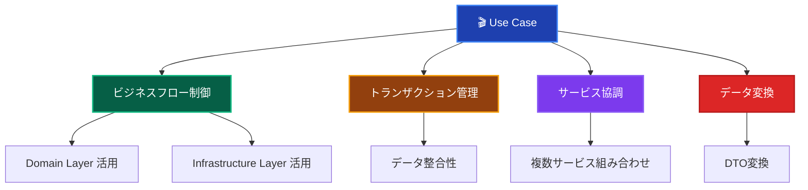
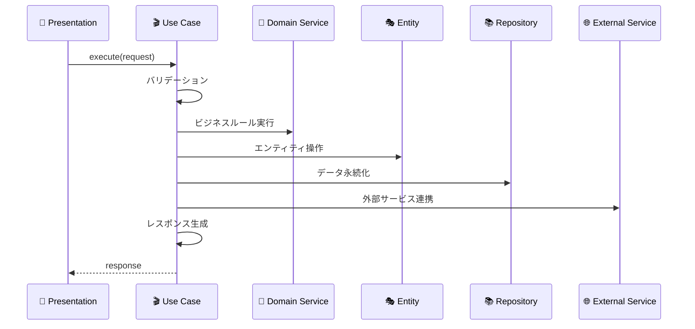

# Use Cases（ユースケース）🎬

このドキュメントでは、Application Layer の Use Cases について、その役割と実装ルールを詳しく解説します。

## 🚀 Result型パターンの採用

**本プロジェクトでは、Use CaseにおいてResult型パターンを採用しています。**

```typescript
// 必要なimport
import { Result, success, failure } from '@/layers/application/types/Result';
import { DomainError } from '@/layers/domain/errors/DomainError';
```

### Result型パターンの利点

- **型安全性**: 成功・失敗が型レベルで表現される
- **明示的エラーハンドリング**: エラー処理が必須となり、見落としを防止
- **統一的なエラー処理**: 全Use Caseで一貫したエラーハンドリング
- **テスタビリティ**: エラーケースのテストが容易

---

## Use Cases とは？ 🎯

Use Case（ユースケース）は、**特定のビジネスシナリオを実現するアプリケーション固有のフロー**を実装するコンポーネントです。
Presentation Layer からの要求を受け取り、Domain Layer のビジネスロジックと Infrastructure Layer の技術実装を組み合わせて、
具体的なユースケースを実現します。

### Use Case の特徴 📋



### Use Case の責務範囲 🎭



---

## ✅ 何をして良いか

### 1. **ビジネスフローの制御** 🎛️

```typescript
// ✅ 推薦：Use Case でのフロー制御（Result型パターン）
@injectable()
export class CreateUserUseCase {
  constructor(
    @inject('IUserRepository') private userRepository: IUserRepository,
    @inject('IUserDomainService') private userDomainService: IUserDomainService,
    @inject('IHashService') private hashService: IHashService,
    @inject('ILogger') private logger: ILogger
  ) {}
  
  async execute(request: CreateUserRequest): Promise<Result<CreateUserResponse>> {
    this.logger.info('ユーザー作成開始', { email: request.email });
    
    try {
      // 1. Email Value Objectを作成（バリデーション込み）
      const emailVO = new Email(request.email);
      
      // 2. ドメインサービスでビジネスルール検証
      await this.userDomainService.validateUserData(
        request.name,
        request.email
      );
      
      // 3. パスワードハッシュ化
      const hashedPassword = await this.hashService.generateHash(request.password);
      
      // 4. ドメインオブジェクト作成
      const user = User.create(emailVO, request.name, hashedPassword);
      
      // 5. データ永続化
      await this.userRepository.save(user);
      
      this.logger.info('ユーザー作成完了', { 
        userId: user.getId().toString(),
        email: request.email 
      });
      
      // 6. 成功レスポンス
      return success({
        id: user.getId().toString(),
        name: user.getName(),
        email: user.getEmail().toString(),
        createdAt: user.getCreatedAt(),
        updatedAt: user.getUpdatedAt()
      });
      
    } catch (error) {
      this.logger.error('ユーザー作成失敗', { 
        email: request.email, 
        error: error instanceof Error ? error.message : 'Unknown error'
      });
      
      // DomainErrorの場合は適切なエラーコードで返す
      if (error instanceof DomainError) {
        return failure(error.message, error.code);
      }
      
      // その他の予期しないエラー
      return failure('ユーザー作成に失敗しました', 'UNEXPECTED_ERROR');
    }
  }
}
```

### 2. **トランザクション管理** 🔄

```typescript
// ✅ 推薦：Use Case レベルでのトランザクション制御
@injectable()
export class TransferUserPointsUseCase {
  constructor(
    @inject('IUserRepository') private userRepository: IUserRepository,
    @inject('IPointTransactionRepository') private pointTransactionRepository: IPointTransactionRepository,
    @inject('IUserDomainService') private userDomainService: IUserDomainService,
    @inject('IDatabaseFactory') private databaseFactory: IDatabaseFactory
  ) {}
  
  async execute(request: TransferPointsRequest): Promise<void> {
    // トランザクション開始
    const transaction = await this.databaseFactory.beginTransaction();
    
    try {
      // 1. 送信者・受信者の取得
      const sender = await this.userRepository.findById(
        new UserId(request.senderId),
        transaction
      );
      const receiver = await this.userRepository.findById(
        new UserId(request.receiverId),
        transaction
      );
      
      if (!sender || !receiver) {
        throw new DomainError('ユーザーが見つかりません', 'USER_NOT_FOUND');
      }
      
      // 2. ビジネスルール検証
      this.userDomainService.validatePointTransfer(
        sender,
        receiver,
        request.points
      );
      
      // 3. ポイント移動処理
      sender.subtractPoints(request.points);
      receiver.addPoints(request.points);
      
      // 4. エンティティ保存（同一トランザクション内）
      await this.userRepository.save(sender, transaction);
      await this.userRepository.save(receiver, transaction);
      
      // 5. 取引履歴記録
      const pointTransaction = new PointTransaction(
        new UserId(request.senderId),
        new UserId(request.receiverId),
        request.points,
        new Date()
      );
      await this.pointTransactionRepository.save(pointTransaction, transaction);
      
      // トランザクションコミット
      await transaction.commit();
      
    } catch (error) {
      // トランザクションロールバック
      await transaction.rollback();
      throw error;
    }
  }
}
```

### 3. **認可・権限チェック** 🔐

```typescript
// ✅ 推薦：Use Case での認可処理（Result型パターン）
@injectable()
export class DeleteUserUseCase {
  constructor(
    @inject('IUserRepository') private userRepository: IUserRepository,
    @inject('IAuthorizationService') private authService: IAuthorizationService,
    @inject('ILogger') private logger: ILogger
  ) {}
  
  async execute(
    request: DeleteUserRequest,
    currentUserId: string
  ): Promise<Result<void>> {
    try {
      // 1. 実行者の認証
      const currentUser = await this.userRepository.findById(
        new UserId(currentUserId)
      );
      if (!currentUser) {
        return failure('認証が必要です', 'AUTHENTICATION_REQUIRED');
      }
      
      // 2. 権限チェック
      const hasPermission = await this.authService.hasPermission(
        currentUserId,
        'DELETE_USER'
      );
      
      // 3. 自分自身または管理者権限の確認
      const isOwnAccount = currentUserId === request.targetUserId;
      const isAdmin = await this.authService.hasRole(currentUserId, 'ADMIN');
      
      if (!isOwnAccount && !isAdmin && !hasPermission) {
        return failure(
          'このユーザーを削除する権限がありません',
          'INSUFFICIENT_PERMISSION'
        );
      }
      
      // 4. 削除対象ユーザーの取得
      const targetUser = await this.userRepository.findById(
        new UserId(request.targetUserId)
      );
      if (!targetUser) {
        return failure('ユーザーが見つかりません', 'USER_NOT_FOUND');
      }
      
      // 5. ビジネスルール：管理者の削除制限
      if (await this.authService.hasRole(request.targetUserId, 'ADMIN') && !isAdmin) {
        return failure(
          '管理者ユーザーは削除できません',
          'CANNOT_DELETE_ADMIN'
        );
      }
      
      // 6. 削除実行
      await this.userRepository.delete(new UserId(request.targetUserId));
      
      this.logger.info('ユーザー削除完了', {
        deletedUserId: request.targetUserId,
        deletedBy: currentUserId
      });
      
      return success(undefined);
      
    } catch (error) {
      this.logger.error('ユーザー削除失敗', {
        targetUserId: request.targetUserId,
        currentUserId,
        error: error instanceof Error ? error.message : 'Unknown error'
      });
      
      // DomainErrorの場合は適切なエラーコードで返す
      if (error instanceof DomainError) {
        return failure(error.message, error.code);
      }
      
      // その他の予期しないエラー
      return failure('ユーザー削除に失敗しました', 'UNEXPECTED_ERROR');
    }
  }
}
```

### 4. **複数サービスの協調** 🤝

```typescript
// ✅ 推薦：複数のドメインサービス・外部サービスの組み合わせ
@injectable()
export class CompleteUserRegistrationUseCase {
  constructor(
    @inject('IUserRepository') private userRepository: IUserRepository,
    @inject('IUserDomainService') private userDomainService: IUserDomainService,
    @inject('IEmailService') private emailService: IEmailService,
    @inject('IFileService') private fileService: IFileService,
    @inject('IAnalyticsService') private analyticsService: IAnalyticsService
  ) {}
  
  async execute(request: CompleteRegistrationRequest): Promise<void> {
    // 1. ユーザー取得
    const user = await this.userRepository.findById(
      new UserId(request.userId)
    );
    if (!user) {
      throw new DomainError('ユーザーが見つかりません', 'USER_NOT_FOUND');
    }
    
    // 2. 登録完了可能性の検証（ドメインサービス）
    this.userDomainService.validateRegistrationCompletion(user);
    
    // 3. プロフィール画像のアップロード（外部サービス）
    let avatarUrl: string | undefined;
    if (request.avatarFile) {
      avatarUrl = await this.fileService.uploadFile(
        request.avatarFile,
        `avatars/${user.getId().toString()}`,
        'image/jpeg'
      );
    }
    
    // 4. ユーザー情報の更新
    if (request.displayName) {
      user.updateDisplayName(request.displayName);
    }
    if (avatarUrl) {
      user.updateAvatarUrl(avatarUrl);
    }
    user.completeRegistration();
    
    // 5. データ保存
    await this.userRepository.save(user);
    
    // 6. ウェルカムメール送信（外部サービス）
    await this.emailService.sendRegistrationCompleteEmail(
      user.getEmail().toString(),
      user.getName()
    );
    
    // 7. 分析データ送信（外部サービス）
    await this.analyticsService.trackEvent('user_registration_completed', {
      userId: user.getId().toString(),
      registrationDate: new Date(),
      hasAvatar: !!avatarUrl
    });
  }
}
```

### 5. **エラーハンドリングと適切なロギング** 📝

```typescript
// ✅ 推薦：適切なエラーハンドリング（Result型パターン）
@injectable()
export class UpdateUserProfileUseCase {
  constructor(
    @inject('IUserRepository') private userRepository: IUserRepository,
    @inject('IUserDomainService') private userDomainService: IUserDomainService,
    @inject('ILogger') private logger: ILogger
  ) {}
  
  async execute(request: UpdateUserProfileRequest): Promise<Result<UpdateUserProfileResponse>> {
    const startTime = Date.now();
    
    try {
      this.logger.info('プロフィール更新開始', {
        userId: request.userId,
        fields: Object.keys(request).filter(key => key !== 'userId')
      });
      
      // 1. ユーザー取得
      const user = await this.userRepository.findById(
        new UserId(request.userId)
      );
      
      if (!user) {
        return failure('ユーザーが見つかりません', 'USER_NOT_FOUND');
      }
      
      // 2. Email重複チェック（Emailが更新される場合）
      if (request.email) {
        const isDuplicate = await this.userDomainService.isEmailDuplicate(
          new Email(request.email)
        );
        if (isDuplicate) {
          return failure(
            'このメールアドレスは既に使用されています',
            'EMAIL_DUPLICATE'
          );
        }
      }
      
      // 3. 更新処理
      if (request.name) {
        user.updateName(request.name);
      }
      if (request.email) {
        user.updateEmail(new Email(request.email));
      }
      
      await this.userRepository.update(user);
      
      const duration = Date.now() - startTime;
      this.logger.info('プロフィール更新完了', {
        userId: request.userId,
        duration
      });
      
      return success({
        id: user.getId().toString(),
        name: user.getName(),
        email: user.getEmail().toString(),
        updatedAt: user.getUpdatedAt()
      });
      
    } catch (error) {
      const duration = Date.now() - startTime;
      
      this.logger.error('プロフィール更新失敗', {
        userId: request.userId,
        error: error instanceof Error ? error.message : 'Unknown error',
        duration
      });
      
      // DomainErrorの場合は適切なエラーコードで返す
      if (error instanceof DomainError) {
        return failure(error.message, error.code);
      }
      
      // その他の予期しないエラー
      return failure('ユーザー更新に失敗しました', 'UNEXPECTED_ERROR');
    }
  }
}
```

---

## ❌ 何をしてはならないか

### 1. **ビジネスルール・ドメインロジックの実装** 🚫

```typescript
// ❌ 禁止：Use Case内でのビジネスルール実装
export class CreateUserUseCase {
  async execute(request: CreateUserRequest): Promise<CreateUserResponse> {
    // ビジネスルール：レベル計算（Domain Layerの責務）
    const level = Math.floor(request.experiencePoints / 1000) + 1; // 禁止
    
    // ビジネスルール：昇格判定（Domain Layerの責務）
    const canPromote = request.experiencePoints >= 5000 && 
                      request.loginCount >= 30; // 禁止
    
    // このようなビジネスロジックは Entity や Domain Service で実装すべき
  }
}
```

### 2. **UI・プレゼンテーション固有の処理** 🎨

```typescript
// ❌ 禁止：UI固有の処理
export class GetUserUseCase {
  async execute(request: GetUserRequest): Promise<GetUserResponse> {
    const user = await this.userRepository.findById(request.userId);
    
    return {
      // 表示フォーマットは Presentation Layer の責務
      displayName: `${user.getName()}様`, // 禁止
      formattedLevel: `レベル ${user.getLevel()}`, // 禁止
      colorCode: user.getLevel() >= 10 ? '#gold' : '#silver' // 禁止
    };
  }
}
```

### 3. **直接的なデータベース操作** 🗄️

```typescript
// ❌ 禁止：Use Case内での直接DB操作
export class CreateUserUseCase {
  async execute(request: CreateUserRequest): Promise<CreateUserResponse> {
    // 直接的なDB操作は禁止
    const prisma = new PrismaClient(); // 禁止
    const user = await prisma.user.create({
      data: {
        email: request.email,
        name: request.name
      }
    });
    
    // Repository パターンを使用すべき
  }
}
```

### 4. **具体的な外部サービス実装** 🔌

```typescript
// ❌ 禁止：具体的な外部サービス実装
export class CreateUserUseCase {
  async execute(request: CreateUserRequest): Promise<CreateUserResponse> {
    // 具体的なメールサービス実装は禁止
    const sgMail = require('@sendgrid/mail'); // 禁止
    sgMail.setApiKey(process.env.SENDGRID_API_KEY);
    
    await sgMail.send({
      to: request.email,
      from: 'noreply@example.com',
      subject: 'Welcome!',
      text: 'ご登録ありがとうございます'
    });
    
    // Interface経由での依存性注入を使用すべき
  }
}
```

### 5. **複雑なDTO変換ロジック** 📦

```typescript
// ❌ 禁止：複雑なDTO変換ロジック
export class GetUserListUseCase {
  async execute(request: GetUserListRequest): Promise<GetUserListResponse> {
    const users = await this.userRepository.findAll();
    
    // 複雑な変換ロジック（別クラスに分離すべき）
    const userSummaries = users.map(user => ({
      id: user.getId().toString(),
      name: user.getName(),
      email: user.getEmail().toString(),
      // 複雑な計算ロジック
      score: this.calculateUserScore(user), // 禁止
      recommendations: this.generateRecommendations(user), // 禁止
      socialConnections: this.buildSocialGraph(user) // 禁止
    }));
    
    return { users: userSummaries };
  }
  
  // 複雑な計算ロジックは Domain Service やヘルパークラスに移すべき
  private calculateUserScore(user: User): number { /* ... */ }
  private generateRecommendations(user: User): any[] { /* ... */ }
  private buildSocialGraph(user: User): any { /* ... */ }
}
```

---

## 🏗️ 設計パターンとベストプラクティス

### 1. **単一責任の原則** 🎯

```typescript
// ✅ 推薦：単一のユースケースに集中
export class CreateUserUseCase {
  async execute(request: CreateUserRequest): Promise<CreateUserResponse> {
    // ユーザー作成のみに集中
  }
}

export class SendWelcomeEmailUseCase {
  async execute(request: SendWelcomeEmailRequest): Promise<void> {
    // ウェルカムメール送信のみに集中
  }
}

// ❌ 避ける：複数の責務を持つUse Case
export class UserManagementUseCase {
  async createUser() { /* ... */ }
  async updateUser() { /* ... */ }
  async deleteUser() { /* ... */ }
  async sendEmail() { /* ... */ }
  async generateReport() { /* ... */ } // 責務が多すぎる
}
```

### 2. **適切なDTO設計** 📋

```typescript
// ✅ 推薦：明確で型安全なDTO
export interface CreateUserRequest {
  readonly name: string;
  readonly email: string;
  readonly password: string;
}

export interface CreateUserResponse {
  readonly id: string;
  readonly name: string;
  readonly email: string;
  readonly level: number;
  readonly createdAt: Date;
}

// DTOマッパーで変換ロジックを分離
export class UserDTOMapper {
  static toCreateUserResponse(user: User): CreateUserResponse {
    return {
      id: user.getId().toString(),
      name: user.getName(),
      email: user.getEmail().toString(),
      level: user.getLevel(),
      createdAt: user.getCreatedAt()
    };
  }
}
```

### 3. **依存性注入の活用** 💉

```typescript
// ✅ 推薦：コンストラクタインジェクション
@injectable()
export class CreateUserUseCase {
  constructor(
    @inject('IUserRepository') private userRepository: IUserRepository,
    @inject('IUserDomainService') private userDomainService: IUserDomainService,
    @inject('IEmailService') private emailService: IEmailService,
    @inject('ILogger') private logger: ILogger
  ) {}
  
  async execute(request: CreateUserRequest): Promise<CreateUserResponse> {
    // 注入された依存関係を使用
  }
}
```

---

## 🧪 テスト戦略

### Unit Tests（単体テスト）

```typescript
// ✅ Use Case テストの例（Result型パターン対応）
describe('CreateUserUseCase', () => {
  let createUserUseCase: CreateUserUseCase;
  let mockUserRepository: MockProxy<IUserRepository>;
  let mockUserDomainService: MockProxy<IUserDomainService>;
  let mockHashService: MockProxy<IHashService>;
  let mockLogger: MockProxy<ILogger>;
  
  beforeEach(() => {
    // vitest-mock-extended を使用した自動モック生成
    mockUserRepository = createAutoMockUserRepository();
    mockUserDomainService = createAutoMockUserDomainService();
    mockHashService = createAutoMockHashService();
    mockLogger = createAutoMockLogger();
    
    createUserUseCase = new CreateUserUseCase(
      mockUserRepository,
      mockUserDomainService,
      mockHashService,
      mockLogger
    );
  });
  
  it('正常にユーザーを作成できる', async () => {
    // Arrange
    const request: CreateUserRequest = {
      name: 'テストユーザー',
      email: 'test@example.com',
      password: 'password123'
    };
    
    mockUserDomainService.validateUserData.mockResolvedValue(undefined);
    mockHashService.generateHash.mockResolvedValue('hashedPassword');
    mockUserRepository.save.mockResolvedValue(undefined);
    
    // Act
    const result = await createUserUseCase.execute(request);
    
    // Assert - Result型パターン対応
    expect(isSuccess(result)).toBe(true);
    if (isSuccess(result)) {
      expect(result.data.name).toBe('テストユーザー');
      expect(result.data.email).toBe('test@example.com');
      expect(result.data.id).toEqual(expect.any(String));
      expect(result.data.createdAt).toEqual(expect.any(Date));
      expect(result.data.updatedAt).toEqual(expect.any(Date));
    }
    
    expect(mockUserDomainService.validateUserData).toHaveBeenCalledWith(
      'テストユーザー',
      'test@example.com'
    );
    expect(mockHashService.generateHash).toHaveBeenCalledWith('password123');
    expect(mockUserRepository.save).toHaveBeenCalledWith(expect.any(User));
  });
  
  it('メールアドレス重複でエラーが返される', async () => {
    // Arrange
    const request: CreateUserRequest = {
      name: 'テストユーザー',
      email: 'test@example.com',
      password: 'password123'
    };
    
    const duplicateError = new DomainError(
      'このメールアドレスは既に使用されています',
      'EMAIL_DUPLICATE'
    );
    mockUserDomainService.validateUserData.mockRejectedValue(duplicateError);
    
    // Act
    const result = await createUserUseCase.execute(request);
    
    // Assert - Result型パターン対応
    expect(isFailure(result)).toBe(true);
    if (isFailure(result)) {
      expect(result.error.message).toBe('このメールアドレスは既に使用されています');
      expect(result.error.code).toBe('EMAIL_DUPLICATE');
    }
    
    expect(mockUserRepository.save).not.toHaveBeenCalled();
  });
  
  it('バリデーションエラーが適切に処理される', async () => {
    // Arrange
    const request: CreateUserRequest = {
      name: 'テストユーザー',
      email: 'invalid-email', // 無効なメールアドレス
      password: 'password123'
    };
    
    // Act
    const result = await createUserUseCase.execute(request);
    
    // Assert - Email Value Object のバリデーションエラー
    expect(isFailure(result)).toBe(true);
    if (isFailure(result)) {
      expect(result.error.message).toBe('ユーザー作成に失敗しました');
      expect(result.error.code).toBe('UNEXPECTED_ERROR');
    }
  });
});
```

---

## 🔍 実装チェックリスト

Use Case を実装する際の確認事項：

### 基本構造

- [ ] 単一責任の原則に従っている
- [ ] 依存性注入を使用している
- [ ] 適切なDTO（Request/Response）を定義している
- [ ] エラーハンドリングが適切に実装されている

### フロー制御

- [ ] ビジネスフローを適切に制御している
- [ ] 必要な場合にトランザクション管理を行っている
- [ ] Domain Layer のサービスを活用している
- [ ] Infrastructure Layer のサービスを適切に使用している

### 責務分離

- [ ] ビジネスルールを Domain Layer に委譲している
- [ ] 技術的詳細を Infrastructure Layer に委譲している
- [ ] UI固有の処理を含んでいない
- [ ] 適切なレベルでの抽象化を行っている

### テスト

- [ ] 正常系のテストがある
- [ ] 異常系のテストがある
- [ ] 依存関係のモック化ができている
- [ ] エラーハンドリングのテストがある

---

**Use Case は Application Layer の中心となるコンポーネントです。適切なフロー制御により、ビジネス価値を提供する具体的なシナリオを実現します！** 🎬✨
