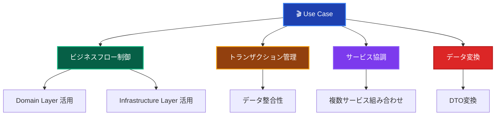
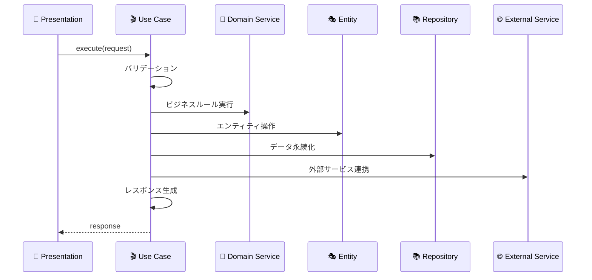

# Use Cases（ユースケース）🎬

このドキュメントでは、Application Layer の Use Cases について、その役割と実装ルールを詳しく解説します。

## 🚀 Result型パターンの採用

**本プロジェクトでは、Use CaseにおいてResult型パターンを採用しています。**

```typescript
// 必要なimport
import { ok, err, type Result, type AppError } from '@/layers/application/types/Result';
import { DomainError } from '@/layers/domain/errors/DomainError';
```

### Result型パターンの利点

- **型安全性**: 成功・失敗が型レベルで表現される
- **明示的エラーハンドリング**: エラー処理が必須となり、見落としを防止
- **統一的なエラー処理**: 全Use Caseで一貫したエラーハンドリング
- **テスタビリティ**: エラーケースのテストが容易

---

## Use Cases とは？ 🎯

Use Case（ユースケース）は、**特定のビジネスシナリオを実現するアプリケーション固有のフロー**を実装するコンポーネントです。
Presentation Layer からの要求を受け取り、Domain Layer のビジネスロジックと Infrastructure Layer の技術実装を組み合わせて、
具体的なユースケースを実現します。

### Use Case の特徴 📋


```mermaid
graph TD
    UC[🎬 Use Case] --> FLOW[ビジネスフロー制御]
    UC --> TRANSACTION[トランザクション管理]
    UC --> ORCHESTRATION[サービス協調]
    UC --> CONVERSION[データ変換]

    FLOW --> DOMAIN[Domain Layer 活用]
    FLOW --> INFRA[Infrastructure Layer 活用]
    TRANSACTION --> CONSISTENCY[データ整合性]
    ORCHESTRATION --> MULTIPLE[複数サービス組み合わせ]
    CONVERSION --> DTO[DTO変換]

    style UC fill:#1e40af,stroke:#3b82f6,stroke-width:2px,color:#ffffff
    style FLOW fill:#065f46,stroke:#10b981,stroke-width:2px,color:#ffffff
    style TRANSACTION fill:#92400e,stroke:#f59e0b,stroke-width:2px,color:#ffffff
    style ORCHESTRATION fill:#7c3aed,stroke:#8b5cf6,stroke-width:2px,color:#ffffff
    style CONVERSION fill:#dc2626,stroke:#b91c1c,stroke-width:2px,color:#ffffff
```

### Use Case の責務範囲 🎭


```mermaid
sequenceDiagram
    participant Pres as 🎨 Presentation
    participant UC as 🎬 Use Case
    participant Domain as 👑 Domain Service
    participant Entity as 🎭 Entity
    participant Repo as 📚 Repository
    participant Ext as 🌐 External Service

    Pres->>UC: execute(request)
    UC->>UC: バリデーション
    UC->>Domain: ビジネスルール実行
    UC->>Entity: エンティティ操作
    UC->>Repo: データ永続化
    UC->>Ext: 外部サービス連携
    UC->>UC: レスポンス生成
    UC-->>Pres: response
```

---

## ✅ 何をして良いか

### 1. **ビジネスフローの制御** 🎛️

```typescript
// ✅ 推薦：Use Case でのフロー制御（Result型パターン）
import { INJECTION_TOKENS } from '@/di/tokens';

@injectable()
export class CreateUserUseCase {
 constructor(
  @inject(INJECTION_TOKENS.UserRepository) private userRepository: IUserRepository,
  @inject(INJECTION_TOKENS.UserDomainService) private userDomainService: IUserDomainService,
  @inject(INJECTION_TOKENS.HashService) private hashService: IHashService,
  @inject(INJECTION_TOKENS.Logger) private logger: ILogger,
 ) {}

 async execute(
  request: CreateUserRequest,
 ): Promise<Result<CreateUserResponse, AppError>> {
  this.logger.info('ユーザー作成開始', { email: request.email });

  try {
   // 1. Email Value Objectを作成（バリデーション込み）
   const emailVO = new Email(request.email);

   // 2. ドメインサービスでビジネスルール検証
   await this.userDomainService.validateUserData(request.name, request.email);

   // 3. パスワードハッシュ化
   const hashedPassword = await this.hashService.generateHash(request.password);

   // 4. ドメインオブジェクト作成
   const user = User.create(emailVO, request.name, hashedPassword);

   // 5. データ永続化
   await this.userRepository.save(user);

   this.logger.info('ユーザー作成完了', {
    userId: user.id.value,
    email: request.email,
   });

   // 6. 成功レスポンス
   // Value Object: .value で型安全にプリミティブ値を取得
   // プリミティブ型: 直接アクセス
   return ok({
    id: user.id.value,
    name: user.name,
    email: user.email.value,
    createdAt: user.createdAt,
    updatedAt: user.updatedAt,
   });
  } catch (error) {
   this.logger.error('ユーザー作成失敗', {
    email: request.email,
    error: error instanceof Error ? error.message : 'Unknown error',
   });

   // DomainErrorの場合は適切なエラーコードで返す
   if (error instanceof DomainError) {
    return err({ message: error.message, code: error.code });
   }

   // その他の予期しないエラー
   return err({ message: 'ユーザー作成に失敗しました', code: 'UNEXPECTED_ERROR' });
  }
 }
}
```

### 2. **トランザクション管理** 🔄

```typescript
// ✅ 推薦：Use Case レベルでのトランザクション制御
import { INJECTION_TOKENS } from '@/di/tokens';

@injectable()
export class TransferUserPointsUseCase {
 constructor(
  @inject(INJECTION_TOKENS.UserRepository) private userRepository: IUserRepository,
  @inject(INJECTION_TOKENS.PointTransactionRepository)
  private pointTransactionRepository: IPointTransactionRepository,
  @inject(INJECTION_TOKENS.UserDomainService) private userDomainService: UserDomainService,
  @inject(INJECTION_TOKENS.PrismaClient) private prisma: PrismaClient,
 ) {}

 async execute(request: TransferPointsRequest): Promise<void> {
  // トランザクション開始
  const transaction = await this.databaseFactory.beginTransaction();

  try {
   // 1. 送信者・受信者の取得
   const sender = await this.userRepository.findById(
    new UserId(request.senderId),
    transaction,
   );
   const receiver = await this.userRepository.findById(
    new UserId(request.receiverId),
    transaction,
   );

   if (!sender || !receiver) {
    throw new DomainError('ユーザーが見つかりません', 'USER_NOT_FOUND');
   }

   // 2. ビジネスルール検証
   this.userDomainService.validatePointTransfer(
    sender,
    receiver,
    request.points,
   );

   // 3. ポイント移動処理
   sender.subtractPoints(request.points);
   receiver.addPoints(request.points);

   // 4. エンティティ保存（同一トランザクション内）
   await this.userRepository.save(sender, transaction);
   await this.userRepository.save(receiver, transaction);

   // 5. 取引履歴記録
   const pointTransaction = new PointTransaction(
    new UserId(request.senderId),
    new UserId(request.receiverId),
    request.points,
    new Date(),
   );
   await this.pointTransactionRepository.save(pointTransaction, transaction);

   // トランザクションコミット
   await transaction.commit();
  } catch (error) {
   // トランザクションロールバック
   await transaction.rollback();
   throw error;
  }
 }
}
```

### 3. **認可・権限チェック** 🔐

```typescript
// ✅ 推薦：Use Case での認可処理（Result型パターン）
import { INJECTION_TOKENS } from '@/di/tokens';

@injectable()
export class DeleteUserUseCase {
 constructor(
  @inject(INJECTION_TOKENS.UserRepository) private userRepository: IUserRepository,
  @inject(INJECTION_TOKENS.AuthorizationService) private authService: IAuthorizationService,
  @inject(INJECTION_TOKENS.Logger) private logger: ILogger,
 ) {}

 async execute(
  request: DeleteUserRequest,
  currentUserId: string,
 ): Promise<Result<void, AppError>> {
  try {
   // 1. 実行者の認証
   const currentUser = await this.userRepository.findById(
    new UserId(currentUserId),
   );
   if (!currentUser) {
    return err({ message: '認証が必要です', code: 'AUTHENTICATION_REQUIRED' });
   }

   // 2. 権限チェック
   const hasPermission = await this.authService.hasPermission(
    currentUserId,
    'DELETE_USER',
   );

   // 3. 自分自身または管理者権限の確認
   const isOwnAccount = currentUserId === request.targetUserId;
   const isAdmin = await this.authService.hasRole(currentUserId, 'ADMIN');

   if (!isOwnAccount && !isAdmin && !hasPermission) {
    return err({
     message: 'このユーザーを削除する権限がありません',
     code: 'INSUFFICIENT_PERMISSION',
    });
   }

   // 4. 削除対象ユーザーの取得
   const targetUser = await this.userRepository.findById(
    new UserId(request.targetUserId),
   );
   if (!targetUser) {
    return err({ message: 'ユーザーが見つかりません', code: 'USER_NOT_FOUND' });
   }

   // 5. ビジネスルール：管理者の削除制限
   if (
    (await this.authService.hasRole(request.targetUserId, 'ADMIN')) &&
    !isAdmin
   ) {
    return err({ message: '管理者ユーザーは削除できません', code: 'CANNOT_DELETE_ADMIN' });
   }

   // 6. 削除実行
   await this.userRepository.delete(new UserId(request.targetUserId));

   this.logger.info('ユーザー削除完了', {
    deletedUserId: request.targetUserId,
    deletedBy: currentUserId,
   });

   return ok(undefined);
  } catch (error) {
   this.logger.error('ユーザー削除失敗', {
    targetUserId: request.targetUserId,
    currentUserId,
    error: error instanceof Error ? error.message : 'Unknown error',
   });

   // DomainErrorの場合は適切なエラーコードで返す
   if (error instanceof DomainError) {
    return err({ message: error.message, code: error.code });
   }

   // その他の予期しないエラー
   return err({ message: 'ユーザー削除に失敗しました', code: 'UNEXPECTED_ERROR' });
  }
 }
}
```

### 4. **複数サービスの協調** 🤝

```typescript
// ✅ 推薦：複数のドメインサービス・外部サービスの組み合わせ
import { INJECTION_TOKENS } from '@/di/tokens';

@injectable()
export class CompleteUserRegistrationUseCase {
 constructor(
  @inject(INJECTION_TOKENS.UserRepository) private userRepository: IUserRepository,
  @inject(INJECTION_TOKENS.UserDomainService) private userDomainService: UserDomainService,
  @inject(INJECTION_TOKENS.EmailService) private emailService: IEmailService,
  @inject(INJECTION_TOKENS.FileService) private fileService: IFileService,
  @inject(INJECTION_TOKENS.AnalyticsService) private analyticsService: IAnalyticsService,
 ) {}

 async execute(request: CompleteRegistrationRequest): Promise<void> {
  // 1. ユーザー取得
  const user = await this.userRepository.findById(new UserId(request.userId));
  if (!user) {
   throw new DomainError('ユーザーが見つかりません', 'USER_NOT_FOUND');
  }

  // 2. 登録完了可能性の検証（ドメインサービス）
  this.userDomainService.validateRegistrationCompletion(user);

  // 3. プロフィール画像のアップロード（外部サービス）
  let avatarUrl: string | undefined;
  if (request.avatarFile) {
   avatarUrl = await this.fileService.uploadFile(
    request.avatarFile,
    `avatars/${user.id.value}`,
    'image/jpeg',
   );
  }

  // 4. ユーザー情報の更新
  if (request.displayName) {
   user.updateDisplayName(request.displayName);
  }
  if (avatarUrl) {
   user.updateAvatarUrl(avatarUrl);
  }
  user.completeRegistration();

  // 5. データ保存
  await this.userRepository.save(user);

  // 6. ウェルカムメール送信（外部サービス）
  await this.emailService.sendRegistrationCompleteEmail(
   user.email.value,
   user.name,
  );

  // 7. 分析データ送信（外部サービス）
  await this.analyticsService.trackEvent('user_registration_completed', {
   userId: user.id.value,
   registrationDate: new Date(),
   hasAvatar: !!avatarUrl,
  });
 }
}
```

### 5. **エラーハンドリングと適切なロギング** 📝

```typescript
// ✅ 推薦：適切なエラーハンドリング（Result型パターン）
import { INJECTION_TOKENS } from '@/di/tokens';

@injectable()
export class UpdateUserProfileUseCase {
 constructor(
  @inject(INJECTION_TOKENS.UserRepository) private userRepository: IUserRepository,
  @inject(INJECTION_TOKENS.UserDomainService) private userDomainService: UserDomainService,
  @inject(INJECTION_TOKENS.Logger) private logger: ILogger,
 ) {}

 async execute(
  request: UpdateUserProfileRequest,
 ): Promise<Result<UpdateUserProfileResponse, AppError>> {
  const startTime = Date.now();

  try {
   this.logger.info('プロフィール更新開始', {
    userId: request.userId,
    fields: Object.keys(request).filter((key) => key !== 'userId'),
   });

   // 1. ユーザー取得
   const user = await this.userRepository.findById(new UserId(request.userId));

   if (!user) {
    return err({ message: 'ユーザーが見つかりません', code: 'USER_NOT_FOUND' });
   }

   // 2. Email重複チェック（Emailが更新される場合）
   if (request.email) {
    const isDuplicate = await this.userDomainService.isEmailDuplicate(
     new Email(request.email),
    );
    if (isDuplicate) {
     return err({
      message: 'このメールアドレスは既に使用されています',
      code: 'EMAIL_DUPLICATE',
     });
    }
   }

   // 3. 更新処理
   if (request.name) {
    user.updateName(request.name);
   }
   if (request.email) {
    user.updateEmail(new Email(request.email));
   }

   await this.userRepository.update(user);

   const duration = Date.now() - startTime;
   this.logger.info('プロフィール更新完了', {
    userId: request.userId,
    duration,
   });

   return ok({
    id: user.id.value,
    name: user.name,
    email: user.email.value,
    updatedAt: user.updatedAt,
   });
  } catch (error) {
   const duration = Date.now() - startTime;

   this.logger.error('プロフィール更新失敗', {
    userId: request.userId,
    error: error instanceof Error ? error.message : 'Unknown error',
    duration,
   });

   // DomainErrorの場合は適切なエラーコードで返す
   if (error instanceof DomainError) {
    return err({ message: error.message, code: error.code });
   }

   // その他の予期しないエラー
   return err({ message: 'ユーザー更新に失敗しました', code: 'UNEXPECTED_ERROR' });
  }
 }
}
```

---

## ❌ 何をしてはならないか

### 1. **ビジネスルール・ドメインロジックの実装** 🚫

```typescript
// ❌ 禁止：Use Case内でのビジネスルール実装
export class CreateUserUseCase {
 async execute(request: CreateUserRequest): Promise<CreateUserResponse> {
  // ビジネスルール：メールフォーマット検証（Domain Layerの責務）
  const isValidEmail = /^[^\s@]+@[^\s@]+\.[^\s@]+$/.test(request.email); // 禁止

  // ビジネスルール：メール変更可否判定（Domain Layerの責務）
  const canChangeEmail =
   request.newEmail !== request.currentEmail; // 禁止

  // このようなビジネスロジックは Entity や Domain Service で実装すべき
 }
}
```

### 2. **UI・プレゼンテーション固有の処理** 🎨

```typescript
// ❌ 禁止：UI固有の処理
export class GetUserUseCase {
 async execute(request: GetUserRequest): Promise<GetUserResponse> {
  const user = await this.userRepository.findById(request.userId);

  return {
   // 表示フォーマットは Presentation Layer の責務
   displayName: `${user.name}様`, // 禁止
   formattedEmail: `連絡先: ${user.email.value}`, // 禁止
   registrationAge: `${daysSince(user.createdAt)}日前に登録`, // 禁止
  };
 }
}
```

### 3. **直接的なデータベース操作** 🗄️

```typescript
// ❌ 禁止：Use Case内での直接DB操作
export class CreateUserUseCase {
 async execute(request: CreateUserRequest): Promise<CreateUserResponse> {
  // 直接的なDB操作は禁止
  const prisma = new PrismaClient(); // 禁止
  const user = await prisma.user.create({
   data: {
    email: request.email,
    name: request.name,
   },
  });

  // Repository パターンを使用すべき
 }
}
```

### 4. **具体的な外部サービス実装** 🔌

```typescript
// ❌ 禁止：具体的な外部サービス実装
export class CreateUserUseCase {
 async execute(request: CreateUserRequest): Promise<CreateUserResponse> {
  // 具体的なメールサービス実装は禁止
  const sgMail = require('@sendgrid/mail'); // 禁止
  sgMail.setApiKey(process.env.SENDGRID_API_KEY);

  await sgMail.send({
   to: request.email,
   from: 'noreply@example.com',
   subject: 'Welcome!',
   text: 'ご登録ありがとうございます',
  });

  // Interface経由での依存性注入を使用すべき
 }
}
```

### 5. **複雑なDTO変換ロジック** 📦

```typescript
// ❌ 禁止：複雑なDTO変換ロジック
export class GetUserListUseCase {
 async execute(request: GetUserListRequest): Promise<GetUserListResponse> {
  const users = await this.userRepository.findAll();

  // 複雑な変換ロジック（別クラスに分離すべき）
  const userSummaries = users.map((user) => ({
   id: user.id.value,
   name: user.name,
   email: user.email.value,
   // 複雑な計算ロジック
   score: this.calculateUserScore(user), // 禁止
   recommendations: this.generateRecommendations(user), // 禁止
   socialConnections: this.buildSocialGraph(user), // 禁止
  }));

  return { users: userSummaries };
 }

 // 複雑な計算ロジックは Domain Service やヘルパークラスに移すべき
 private calculateUserScore(user: User): number {
  /* ... */
 }
 private generateRecommendations(user: User): any[] {
  /* ... */
 }
 private buildSocialGraph(user: User): any {
  /* ... */
 }
}
```

---

## 🏗️ 設計パターンとベストプラクティス

### 1. **単一責任の原則** 🎯

```typescript
// ✅ 推薦：単一のユースケースに集中
export class CreateUserUseCase {
 async execute(request: CreateUserRequest): Promise<CreateUserResponse> {
  // ユーザー作成のみに集中
 }
}

export class SendWelcomeEmailUseCase {
 async execute(request: SendWelcomeEmailRequest): Promise<void> {
  // ウェルカムメール送信のみに集中
 }
}

// ❌ 避ける：複数の責務を持つUse Case
export class UserManagementUseCase {
 async createUser() {
  /* ... */
 }
 async updateUser() {
  /* ... */
 }
 async deleteUser() {
  /* ... */
 }
 async sendEmail() {
  /* ... */
 }
 async generateReport() {
  /* ... */
 } // 責務が多すぎる
}
```

### 2. **適切なDTO設計** 📋

```typescript
// ✅ 推薦：明確で型安全なDTO
export interface CreateUserRequest {
 readonly name: string;
 readonly email: string;
 readonly password: string;
}

export interface CreateUserResponse {
 readonly id: string;
 readonly name: string;
 readonly email: string;
 readonly level: number;
 readonly createdAt: Date;
}

// DTOマッパーで変換ロジックを分離
export class UserDTOMapper {
 static toCreateUserResponse(user: User): CreateUserResponse {
  // Value Object: .value で型安全にプリミティブ値を取得
  // プリミティブ型: 直接アクセス
  return {
   id: user.id.value,
   name: user.name,
   email: user.email.value,
   createdAt: user.createdAt,
  };
 }
}
```

### 3. **依存性注入の活用** 💉

```typescript
// ✅ 推薦：コンストラクタインジェクション
import { INJECTION_TOKENS } from '@/di/tokens';

@injectable()
export class CreateUserUseCase {
 constructor(
  @inject(INJECTION_TOKENS.UserRepository) private userRepository: IUserRepository,
  @inject(INJECTION_TOKENS.UserDomainService) private userDomainService: UserDomainService,
  @inject(INJECTION_TOKENS.EmailService) private emailService: IEmailService,
  @inject(INJECTION_TOKENS.Logger) private logger: ILogger,
 ) {}

 async execute(request: CreateUserRequest): Promise<Result<CreateUserResponse, AppError>> {
  // 注入された依存関係を使用
 }
}
```

---

## 🧪 テスト戦略

### Unit Tests（単体テスト）

```typescript
// ✅ Use Case テストの例（Result型パターン対応）
describe('CreateUserUseCase', () => {
 let createUserUseCase: CreateUserUseCase;
 let mockUserRepository: MockProxy<IUserRepository>;
 let mockUserDomainService: MockProxy<IUserDomainService>;
 let mockHashService: MockProxy<IHashService>;
 let mockLogger: MockProxy<ILogger>;

 beforeEach(() => {
  // vitest-mock-extended を使用した自動モック生成
  mockUserRepository = createAutoMockUserRepository();
  mockUserDomainService = createAutoMockUserDomainService();
  mockHashService = createAutoMockHashService();
  mockLogger = createAutoMockLogger();

  createUserUseCase = new CreateUserUseCase(
   mockUserRepository,
   mockUserDomainService,
   mockHashService,
   mockLogger,
  );
 });

 it('正常にユーザーを作成できる', async () => {
  // Arrange
  const request: CreateUserRequest = {
   name: 'テストユーザー',
   email: 'test@example.com',
   password: 'password123',
  };

  mockUserDomainService.validateUserData.mockResolvedValue(undefined);
  mockHashService.generateHash.mockResolvedValue('hashedPassword');
  mockUserRepository.save.mockResolvedValue(undefined);

  // Act
  const result = await createUserUseCase.execute(request);

  // Assert - Result型パターン対応
  expect(result.isOk()).toBe(true);
  if (result.isOk()) {
   expect(result.value.name).toBe('テストユーザー');
   expect(result.value.email).toBe('test@example.com');
   expect(result.value.id).toEqual(expect.any(String));
   expect(result.value.createdAt).toEqual(expect.any(Date));
   expect(result.value.updatedAt).toEqual(expect.any(Date));
  }

  expect(mockUserDomainService.validateUserData).toHaveBeenCalledWith(
   'テストユーザー',
   'test@example.com',
  );
  expect(mockHashService.generateHash).toHaveBeenCalledWith('password123');
  expect(mockUserRepository.save).toHaveBeenCalledWith(expect.any(User));
 });

 it('メールアドレス重複でエラーが返される', async () => {
  // Arrange
  const request: CreateUserRequest = {
   name: 'テストユーザー',
   email: 'test@example.com',
   password: 'password123',
  };

  const duplicateError = new DomainError(
   'このメールアドレスは既に使用されています',
   'EMAIL_DUPLICATE',
  );
  mockUserDomainService.validateUserData.mockRejectedValue(duplicateError);

  // Act
  const result = await createUserUseCase.execute(request);

  // Assert - Result型パターン対応
  expect(result.isErr()).toBe(true);
  if (result.isErr()) {
   expect(result.error.message).toBe(
    'このメールアドレスは既に使用されています',
   );
   expect(result.error.code).toBe('EMAIL_DUPLICATE');
  }

  expect(mockUserRepository.save).not.toHaveBeenCalled();
 });

 it('バリデーションエラーが適切に処理される', async () => {
  // Arrange
  const request: CreateUserRequest = {
   name: 'テストユーザー',
   email: 'invalid-email', // 無効なメールアドレス
   password: 'password123',
  };

  // Act
  const result = await createUserUseCase.execute(request);

  // Assert - Email Value Object のバリデーションエラー
  expect(result.isErr()).toBe(true);
  if (result.isErr()) {
   expect(result.error.message).toBe('ユーザー作成に失敗しました');
   expect(result.error.code).toBe('UNEXPECTED_ERROR');
  }
 });
});
```

---

## 🔍 実装チェックリスト

Use Case を実装する際の確認事項：

### 基本構造

- [ ] 単一責任の原則に従っている
- [ ] 依存性注入を使用している
- [ ] 適切なDTO（Request/Response）を定義している
- [ ] エラーハンドリングが適切に実装されている

### フロー制御

- [ ] ビジネスフローを適切に制御している
- [ ] 必要な場合にトランザクション管理を行っている
- [ ] Domain Layer のサービスを活用している
- [ ] Infrastructure Layer のサービスを適切に使用している

### 責務分離

- [ ] ビジネスルールを Domain Layer に委譲している
- [ ] 技術的詳細を Infrastructure Layer に委譲している
- [ ] UI固有の処理を含んでいない
- [ ] 適切なレベルでの抽象化を行っている

### テスト

- [ ] 正常系のテストがある
- [ ] 異常系のテストがある
- [ ] 依存関係のモック化ができている
- [ ] エラーハンドリングのテストがある

---

**Use Case は Application Layer の中心となるコンポーネントです。適切なフロー制御により、ビジネス価値を提供する具体的なシナリオを実現します！** 🎬✨
