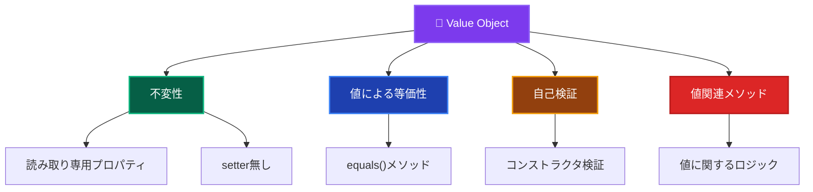

# Value Objects（値オブジェクト）💎

このドキュメントでは、Domain Layer の Value Objects について、その役割と実装ルールを詳しく解説します。

---

## Value Objects とは？ 🏷️

Value Object（値オブジェクト）は、**値による等価性を持つ不変のドメインオブジェクト**です。自身の値（プロパティの組み合わせ）によって識別され、同じ値を持つオブジェクトは等価とみなされます。

### Value Object の特徴 📋



### Entity vs Value Object の違い 🔍

| 観点 | Entity | Value Object |
|------|--------|--------------|
| **識別方法** | IDによる同一性 | 値による等価性 |
| **変更可能性** | 可変（Mutable） | 不変（Immutable） |
| **ライフサイクル** | 作成・変更・削除 | 作成・廃棄のみ |
| **フォーカス** | アイデンティティ | 値・属性 |
| **例** | User, Order, Product | Email, Money, Address |

---

## ✅ 何をして良いか

### 1. **不変性の保証** 🔒

```typescript
// ✅ 推薦：不変な Value Object
export class Email {
  private readonly value: string;
  
  constructor(value: string) {
    this.validateFormat(value);
    this.value = value.toLowerCase().trim(); // 正規化
  }
  
  // 値の取得（getter）
  toString(): string {
    return this.value;
  }
  
  // 値の取得（別名）
  getValue(): string {
    return this.value;
  }
  
  // 新しいインスタンスを返すメソッド
  withDomain(domain: string): Email {
    const localPart = this.value.split('@')[0];
    return new Email(`${localPart}@${domain}`);
  }
  
  private validateFormat(value: string): void {
    if (!value || value.trim().length === 0) {
      throw new DomainError('メールアドレスは必須です', 'EMAIL_REQUIRED');
    }
    
    const emailRegex = /^[^\s@]+@[^\s@]+\.[^\s@]+$/;
    if (!emailRegex.test(value)) {
      throw new DomainError('不正なメールアドレス形式です', 'EMAIL_INVALID_FORMAT');
    }
    
    if (value.length > 254) {
      throw new DomainError('メールアドレスが長すぎます', 'EMAIL_TOO_LONG');
    }
  }
}
```

### 2. **値による等価性の実装** ⚖️

```typescript
// ✅ 推薦：equals() メソッドの実装
export class Money {
  private readonly amount: number;
  private readonly currency: string;
  
  constructor(amount: number, currency: string) {
    this.validateAmount(amount);
    this.validateCurrency(currency);
    
    this.amount = Math.round(amount * 100) / 100; // 小数点対応
    this.currency = currency.toUpperCase();
  }
  
  // 値による等価性判定
  equals(other: Money): boolean {
    if (!(other instanceof Money)) {
      return false;
    }
    
    return this.amount === other.amount && 
           this.currency === other.currency;
  }
  
  // ハッシュコード（オプション）
  hashCode(): string {
    return `${this.amount}_${this.currency}`;
  }
  
  getAmount(): number {
    return this.amount;
  }
  
  getCurrency(): string {
    return this.currency;
  }
  
  private validateAmount(amount: number): void {
    if (isNaN(amount) || amount < 0) {
      throw new DomainError('金額は0以上の数値である必要があります', 'INVALID_AMOUNT');
    }
  }
  
  private validateCurrency(currency: string): void {
    const validCurrencies = ['USD', 'EUR', 'JPY', 'GBP'];
    if (!validCurrencies.includes(currency.toUpperCase())) {
      throw new DomainError('サポートされていない通貨です', 'UNSUPPORTED_CURRENCY');
    }
  }
}
```

### 3. **ドメインロジックの実装** 🧮

```typescript
// ✅ 推薦：値に関するビジネスロジック
export class Money {
  // 算術演算（新しいインスタンスを返す）
  add(other: Money): Money {
    this.validateSameCurrency(other);
    return new Money(this.amount + other.amount, this.currency);
  }
  
  subtract(other: Money): Money {
    this.validateSameCurrency(other);
    const newAmount = this.amount - other.amount;
    
    if (newAmount < 0) {
      throw new DomainError('残高不足です', 'INSUFFICIENT_BALANCE');
    }
    
    return new Money(newAmount, this.currency);
  }
  
  multiply(multiplier: number): Money {
    if (multiplier < 0) {
      throw new DomainError('乗数は0以上である必要があります', 'INVALID_MULTIPLIER');
    }
    
    return new Money(this.amount * multiplier, this.currency);
  }
  
  // 比較演算
  isGreaterThan(other: Money): boolean {
    this.validateSameCurrency(other);
    return this.amount > other.amount;
  }
  
  isLessThan(other: Money): boolean {
    this.validateSameCurrency(other);
    return this.amount < other.amount;
  }
  
  isZero(): boolean {
    return this.amount === 0;
  }
  
  // 通貨変換
  convertTo(targetCurrency: string, exchangeRate: number): Money {
    if (exchangeRate <= 0) {
      throw new DomainError('為替レートは正の値である必要があります', 'INVALID_EXCHANGE_RATE');
    }
    
    const convertedAmount = this.amount * exchangeRate;
    return new Money(convertedAmount, targetCurrency);
  }
  
  private validateSameCurrency(other: Money): void {
    if (this.currency !== other.currency) {
      throw new DomainError(
        `異なる通貨での操作はできません: ${this.currency} と ${other.currency}`,
        'CURRENCY_MISMATCH'
      );
    }
  }
}
```

### 4. **複合値オブジェクトの実装** 🏗️

```typescript
// ✅ 推薦：複数の値を持つ Value Object
export class Address {
  private readonly postalCode: string;
  private readonly prefecture: string;
  private readonly city: string;
  private readonly streetAddress: string;
  private readonly building?: string;
  
  constructor(
    postalCode: string,
    prefecture: string,
    city: string,
    streetAddress: string,
    building?: string
  ) {
    this.validatePostalCode(postalCode);
    this.validatePrefecture(prefecture);
    this.validateCity(city);
    this.validateStreetAddress(streetAddress);
    
    this.postalCode = postalCode.replace(/[^0-9]/g, ''); // 数字のみ
    this.prefecture = prefecture.trim();
    this.city = city.trim();
    this.streetAddress = streetAddress.trim();
    this.building = building?.trim();
  }
  
  // 値による等価性
  equals(other: Address): boolean {
    if (!(other instanceof Address)) {
      return false;
    }
    
    return this.postalCode === other.postalCode &&
           this.prefecture === other.prefecture &&
           this.city === other.city &&
           this.streetAddress === other.streetAddress &&
           this.building === other.building;
  }
  
  // フォーマット済み住所の取得
  getFormattedAddress(): string {
    const parts = [
      `〒${this.postalCode}`,
      this.prefecture,
      this.city,
      this.streetAddress
    ];
    
    if (this.building) {
      parts.push(this.building);
    }
    
    return parts.join(' ');
  }
  
  // 配送可能判定
  isDeliverable(): boolean {
    // 特定の地域の配送可能性判定
    const nonDeliverableAreas = ['離島', '山間部'];
    return !nonDeliverableAreas.some(area => 
      this.city.includes(area) || 
      this.streetAddress.includes(area)
    );
  }
  
  // 同一都道府県判定
  isSamePrefecture(other: Address): boolean {
    return this.prefecture === other.prefecture;
  }
  
  // アクセサメソッド
  getPostalCode(): string { return this.postalCode; }
  getPrefecture(): string { return this.prefecture; }
  getCity(): string { return this.city; }
  getStreetAddress(): string { return this.streetAddress; }
  getBuilding(): string | undefined { return this.building; }
  
  private validatePostalCode(postalCode: string): void {
    const cleanedCode = postalCode.replace(/[^0-9]/g, '');
    if (cleanedCode.length !== 7) {
      throw new DomainError('郵便番号は7桁である必要があります', 'INVALID_POSTAL_CODE');
    }
  }
  
  private validatePrefecture(prefecture: string): void {
    if (!prefecture || prefecture.trim().length === 0) {
      throw new DomainError('都道府県は必須です', 'PREFECTURE_REQUIRED');
    }
  }
  
  private validateCity(city: string): void {
    if (!city || city.trim().length === 0) {
      throw new DomainError('市区町村は必須です', 'CITY_REQUIRED');
    }
  }
  
  private validateStreetAddress(streetAddress: string): void {
    if (!streetAddress || streetAddress.trim().length === 0) {
      throw new DomainError('番地は必須です', 'STREET_ADDRESS_REQUIRED');
    }
  }
}
```

### 5. **ファクトリーメソッドの提供** 🏭

```typescript
// ✅ 推薦：便利なファクトリーメソッド
export class UserId {
  private readonly value: string;
  
  constructor(value: string) {
    this.validateFormat(value);
    this.value = value;
  }
  
  // 標準的なファクトリーメソッド
  static of(value: string): UserId {
    return new UserId(value);
  }
  
  // UUID生成ファクトリーメソッド
  static generate(): UserId {
    return new UserId(crypto.randomUUID());
  }
  
  // 数値からの変換
  static fromNumber(num: number): UserId {
    return new UserId(`user-${num}`);
  }
  
  // 文字列からの安全な変換
  static tryParse(value: string): UserId | null {
    try {
      return new UserId(value);
    } catch {
      return null;
    }
  }
  
  toString(): string {
    return this.value;
  }
  
  equals(other: UserId): boolean {
    return other instanceof UserId && this.value === other.value;
  }
  
  private validateFormat(value: string): void {
    if (!value || value.trim().length === 0) {
      throw new DomainError('ユーザーIDは必須です', 'USER_ID_REQUIRED');
    }
    
    if (value.length > 50) {
      throw new DomainError('ユーザーIDが長すぎます', 'USER_ID_TOO_LONG');
    }
    
    const validPattern = /^[a-zA-Z0-9\-_]+$/;
    if (!validPattern.test(value)) {
      throw new DomainError('ユーザーIDに不正な文字が含まれています', 'USER_ID_INVALID_FORMAT');
    }
  }
}
```

---

## ❌ 何をしてはならないか

### 1. **可変性の導入** 🚫

```typescript
// ❌ 禁止：値を変更可能にする
export class Email {
  private value: string; // readonly を付けない
  
  constructor(value: string) {
    this.value = value;
  }
  
  // setter メソッドは禁止
  setValue(value: string): void {
    this.value = value; // 値の変更は禁止
  }
  
  // 自身を変更するメソッドは禁止
  normalize(): void {
    this.value = this.value.toLowerCase(); // 禁止
  }
}
```

### 2. **IDによる同一性の実装** 🆔

```typescript
// ❌ 禁止：Value Object での ID による同一性
export class Money {
  private readonly id: string; // ID は不要
  private readonly amount: number;
  
  constructor(amount: number) {
    this.id = crypto.randomUUID(); // 禁止
    this.amount = amount;
  }
  
  // ID による等価性判定は禁止
  equals(other: Money): boolean {
    return this.id === other.id; // 禁止
  }
}
```

### 3. **Entity の責務を持つ実装** 👑

```typescript
// ❌ 禁止：Entity的な振る舞い
export class Email {
  private value: string;
  
  constructor(value: string) {
    this.value = value;
  }
  
  // データベース操作は禁止
  async save(): Promise<void> {
    const db = getDatabase();
    await db.emails.save(this); // 禁止
  }
  
  // 複雑なビジネスフローは禁止
  async sendVerificationEmail(): Promise<void> {
    const emailService = getEmailService();
    await emailService.send(this.value, 'verify'); // 禁止
  }
}
```

### 4. **外部サービスへの依存** 🌐

```typescript
// ❌ 禁止：外部サービスの直接呼び出し
export class Address {
  private postalCode: string;
  
  constructor(postalCode: string) {
    this.postalCode = postalCode;
  }
  
  // 外部API呼び出しは禁止
  async validateWithPostalService(): Promise<boolean> {
    const response = await fetch(`https://api.zipcode.com/validate/${this.postalCode}`);
    return response.ok; // 禁止
  }
}
```

### 5. **複雑なビジネスロジック** 🏢

```typescript
// ❌ 禁止：Entity レベルの複雑なロジック
export class Money {
  private amount: number;
  private currency: string;
  
  // 複雑なビジネスルール（Domain Service の責務）
  calculateTaxWithBusinessRules(taxRate: number, isBusinessCustomer: boolean, country: string): Money {
    // 複雑な税金計算ロジック（禁止）
    if (isBusinessCustomer && country === 'JP') {
      // 法人税の複雑な計算
      return this.multiply(taxRate * 0.8);
    }
    // このような複雑なロジックは Domain Service で実装すべき
  }
}
```

---

## 🏗️ 設計パターンとベストプラクティス

### 1. **Primitive Obsession の回避** 💡

```typescript
// ❌ 避ける：プリミティブ型の乱用
export class User {
  constructor(
    private id: string,        // string のまま
    private email: string,     // string のまま
    private amount: number,    // number のまま
    private currency: string   // string のまま
  ) {}
}

// ✅ 推薦：Value Object の活用
export class User {
  constructor(
    private id: UserId,        // Value Object
    private email: Email,      // Value Object
    private balance: Money     // Value Object
  ) {}
}
```

### 2. **Null Object パターン** 🔄

```typescript
// ✅ 推薦：Null Object パターンの実装
export class Email {
  private static readonly EMPTY = new Email('');
  
  static empty(): Email {
    return Email.EMPTY;
  }
  
  static isValid(value: string): boolean {
    try {
      new Email(value);
      return true;
    } catch {
      return false;
    }
  }
  
  isEmpty(): boolean {
    return this.value === '';
  }
}

// 使用例
const email = user.getEmail();
if (!email.isEmpty()) {
  // メール送信処理
}
```

### 3. **Type Safety の向上** 🛡️

```typescript
// ✅ 推薦：型安全な Value Object 設計
export class Temperature {
  private readonly value: number;
  private readonly unit: 'celsius' | 'fahrenheit';
  
  private constructor(value: number, unit: 'celsius' | 'fahrenheit') {
    this.value = value;
    this.unit = unit;
  }
  
  static celsius(value: number): Temperature {
    return new Temperature(value, 'celsius');
  }
  
  static fahrenheit(value: number): Temperature {
    return new Temperature(value, 'fahrenheit');
  }
  
  toCelsius(): Temperature {
    if (this.unit === 'celsius') {
      return this;
    }
    
    const celsiusValue = (this.value - 32) * 5 / 9;
    return Temperature.celsius(celsiusValue);
  }
  
  toFahrenheit(): Temperature {
    if (this.unit === 'fahrenheit') {
      return this;
    }
    
    const fahrenheitValue = (this.value * 9 / 5) + 32;
    return Temperature.fahrenheit(fahrenheitValue);
  }
}
```

---

## 🧪 テスト戦略

### Unit Tests（単体テスト）

```typescript
// ✅ Value Object テストの例
describe('Email Value Object', () => {
  describe('constructor', () => {
    it('正常なメールアドレスでEmailを作成できる', () => {
      // Arrange & Act
      const email = new Email('test@example.com');
      
      // Assert
      expect(email.toString()).toBe('test@example.com');
    });
    
    it('メールアドレスが正規化される', () => {
      // Arrange & Act
      const email = new Email('  Test@Example.COM  ');
      
      // Assert
      expect(email.toString()).toBe('test@example.com');
    });
    
    it('不正なメールアドレスでエラーが発生する', () => {
      // Arrange & Act & Assert
      expect(() => new Email('invalid-email'))
        .toThrow('不正なメールアドレス形式です');
    });
  });
  
  describe('equals', () => {
    it('同じ値のEmailは等価である', () => {
      // Arrange
      const email1 = new Email('test@example.com');
      const email2 = new Email('test@example.com');
      
      // Act & Assert
      expect(email1.equals(email2)).toBe(true);
    });
    
    it('異なる値のEmailは等価でない', () => {
      // Arrange
      const email1 = new Email('test1@example.com');
      const email2 = new Email('test2@example.com');
      
      // Act & Assert
      expect(email1.equals(email2)).toBe(false);
    });
  });
});

describe('Money Value Object', () => {
  describe('arithmetic operations', () => {
    it('同じ通貨の金額を加算できる', () => {
      // Arrange
      const money1 = new Money(100, 'USD');
      const money2 = new Money(50, 'USD');
      
      // Act
      const result = money1.add(money2);
      
      // Assert
      expect(result.getAmount()).toBe(150);
      expect(result.getCurrency()).toBe('USD');
    });
    
    it('異なる通貨の金額を加算するとエラーが発生する', () => {
      // Arrange
      const money1 = new Money(100, 'USD');
      const money2 = new Money(50, 'JPY');
      
      // Act & Assert
      expect(() => money1.add(money2))
        .toThrow('異なる通貨での操作はできません');
    });
  });
  
  describe('immutability', () => {
    it('算術演算は新しいインスタンスを返す', () => {
      // Arrange
      const originalMoney = new Money(100, 'USD');
      
      // Act
      const newMoney = originalMoney.add(new Money(50, 'USD'));
      
      // Assert
      expect(originalMoney.getAmount()).toBe(100); // 元のインスタンスは変更されない
      expect(newMoney.getAmount()).toBe(150);
    });
  });
});
```

---

## 🔍 実装チェックリスト

Value Object を実装する際の確認事項：

### 基本構造

- [ ] 全てのプロパティが `readonly` である
- [ ] setter メソッドが存在しない
- [ ] `equals()` メソッドを実装している
- [ ] 適切な検証ロジックがある

### 不変性

- [ ] コンストラクタで値を設定後、変更不可能
- [ ] 値を変更するメソッドは新しいインスタンスを返す
- [ ] 状態を変更するメソッドが存在しない

### ドメインロジック

- [ ] 値に関連するビジネスロジックを実装している
- [ ] 適切な検証・正規化を行っている
- [ ] 値の変換・計算メソッドを提供している

### 禁止事項の回避

- [ ] ID による同一性を実装していない
- [ ] データベース操作を実装していない
- [ ] 外部サービスを直接呼び出していない
- [ ] Entity レベルの複雑なロジックを含んでいない

### テスト

- [ ] 値の等価性テストがある
- [ ] 不変性のテストがある
- [ ] 検証ロジックのテストがある
- [ ] 算術演算・変換メソッドのテストがある

---

**Value Object は Domain Layer の基盤となるコンポーネントです。不変性と値による等価性を保ちながら、適切なドメインロジックを実装することが重要です！** 💎✨
