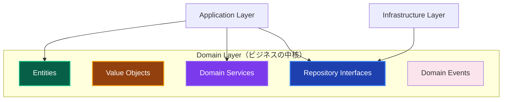
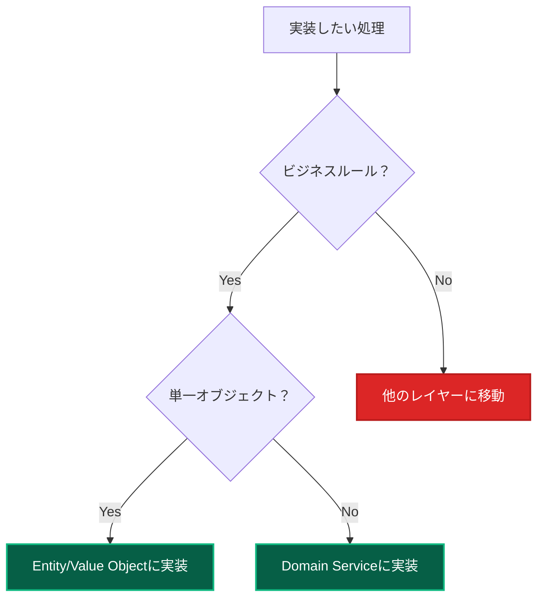

# Domain Layer 実装ガイド 🏛️

このドキュメントでは、Domain Layer（ドメイン層）での実装ルール、許可される処理、禁止される処理について詳しく解説します。

---

## Domain Layer の責務 👑

### 基本的な役割


```mermaid
graph TD
    subgraph "Domain Layer（ビジネスの中核）"
        ENTITY[Entities]
        VO[Value Objects]
        DS[Domain Services]
        REPO[Repository Interfaces]
        DOMAIN_EVENT[Domain Events]
    end

    APP[Application Layer] --> ENTITY
    APP --> DS
    APP --> REPO

    INFRA[Infrastructure Layer] --> REPO

    style ENTITY fill:#065f46,stroke:#10b981,stroke-width:2px,color:#ffffff
    style VO fill:#92400e,stroke:#f59e0b,stroke-width:2px,color:#ffffff
    style DS fill:#7c3aed,stroke:#8b5cf6,stroke-width:2px,color:#ffffff
    style REPO fill:#1e40af,stroke:#3b82f6,stroke-width:2px,color:#ffffff
    style DOMAIN_EVENT fill:#fce4ec
```

**Domain Layerの責務：**

1. **ビジネスルールの実装** - 企業・業界固有のルール
2. **ドメインオブジェクトの管理** - Entity、Value Object
3. **ドメインサービスの提供** - 複数オブジェクト間のビジネスロジック
4. **不変条件の保証** - データの整合性・妥当性
5. **ドメインイベントの発行** - ビジネス上重要な出来事の通知

---

## ✅ 書いて良いもの（許可される処理）

### 1. Entity（エンティティ）実装 🎭

**ビジネス上の重要な概念を表現**

```typescript
// ✅ 許可：Entity実装（Immutable + public readonly パターン）
export class User {
 private constructor(
  // public readonly でプロパティに直接アクセス可能
  public readonly id: UserId,
  public readonly email: Email,
  public readonly name: string,
  public readonly passwordHash: string,
  public readonly createdAt: Date,
  public readonly updatedAt: Date,
 ) {
  // 不変条件の検証
  this.validateInvariants();
 }

 // ファクトリーメソッド（新規作成: 3引数）
 static create(email: Email, name: string, passwordHash: string): User {
  const now = new Date();
  return new User(
   UserId.generate(),
   email,
   name,
   passwordHash,
   now,
   now,
  );
 }

 // ファクトリーメソッド（DB復元: 6引数）
 static reconstruct(
  id: UserId,
  email: Email,
  name: string,
  passwordHash: string,
  createdAt: Date,
  updatedAt: Date,
 ): User {
  return new User(id, email, name, passwordHash, createdAt, updatedAt);
 }

 // ビジネスロジック：メール変更（新インスタンスを返す）
 changeEmail(newEmail: Email): User {
  return new User(
   this.id,
   newEmail,
   this.name,
   this.passwordHash,
   this.createdAt,
   new Date(),
  );
 }

 // ビジネスロジック：プロフィール更新（新インスタンスを返す）
 updateProfile(newName: string): User {
  if (!newName || newName.trim().length === 0) {
   throw new DomainError('名前は空文字列にできません', 'INVALID_NAME');
  }

  return new User(
   this.id,
   this.email,
   newName,
   this.passwordHash,
   this.createdAt,
   new Date(),
  );
 }

 // ビジネスロジック：パスワード変更（新インスタンスを返す）
 updatePasswordHash(newPasswordHash: string): User {
  if (!newPasswordHash || newPasswordHash.trim().length === 0) {
   throw new DomainError('パスワードハッシュは空にできません', 'INVALID_PASSWORD_HASH');
  }

  return new User(
   this.id,
   this.email,
   this.name,
   newPasswordHash,
   this.createdAt,
   new Date(),
  );
 }

 // ※ ゲッターは不要 - public readonly でプロパティに直接アクセス
 // user.id, user.email, user.name, user.passwordHash などで取得可能

 // プライベートメソッド：不変条件検証
 private validateInvariants(): void {
  if (!this.passwordHash || this.passwordHash.trim().length === 0) {
   throw new DomainError('パスワードハッシュは空にできません', 'INVALID_PASSWORD_HASH');
  }

  if (this.name.trim().length === 0) {
   throw new DomainError('名前は空文字列にできません', 'INVALID_NAME');
  }
 }
}
```

**なぜ許可されるのか：**

- ビジネス上の重要な概念を表現
- ビジネスルールの実装場所として最適
- 不変条件の保証が可能

### 2. Value Object（値オブジェクト）実装 💎

**不変で等価性を持つ値の表現**

```typescript
// ✅ 許可：Value Object実装
export class Email {
 private readonly value: string;

 constructor(email: string) {
  this.validateEmail(email);
  this.value = email.toLowerCase().trim();
 }

 toString(): string {
  return this.value;
 }

 // 等価性判定
 equals(other: Email): boolean {
  return this.value === other.value;
 }

 // ドメインメソッド
 getDomain(): string {
  return this.value.split('@')[1];
 }

 isCompanyEmail(): boolean {
  const companyDomains = ['company.com', 'corp.com'];
  return companyDomains.includes(this.getDomain());
 }

 private validateEmail(email: string): void {
  if (!email || email.trim().length === 0) {
   throw new DomainError('メールアドレスは必須です', 'EMAIL_REQUIRED');
  }

  const emailRegex = /^[^\s@]+@[^\s@]+\.[^\s@]+$/;
  if (!emailRegex.test(email)) {
   throw new DomainError(
    'メールアドレスの形式が正しくありません',
    'INVALID_EMAIL_FORMAT',
   );
  }

  if (email.length > 254) {
   throw new DomainError('メールアドレスが長すぎます', 'EMAIL_TOO_LONG');
  }
 }
}

// ✅ 許可：複雑なValue Object
export class Money {
 private readonly amount: number;
 private readonly currency: string;

 constructor(amount: number, currency: string = 'JPY') {
  this.validateAmount(amount);
  this.validateCurrency(currency);

  this.amount = Math.round(amount * 100) / 100; // 小数点以下2桁に丸める
  this.currency = currency.toUpperCase();
 }

 // ビジネスロジック：加算
 add(other: Money): Money {
  this.ensureSameCurrency(other);
  return new Money(this.amount + other.amount, this.currency);
 }

 // ビジネスロジック：減算
 subtract(other: Money): Money {
  this.ensureSameCurrency(other);
  const result = this.amount - other.amount;

  if (result < 0) {
   throw new DomainError('金額が負の値になります', 'NEGATIVE_AMOUNT');
  }

  return new Money(result, this.currency);
 }

 // ビジネスロジック：乗算
 multiply(multiplier: number): Money {
  if (multiplier < 0) {
   throw new DomainError(
    '乗数は正の値である必要があります',
    'INVALID_MULTIPLIER',
   );
  }

  return new Money(this.amount * multiplier, this.currency);
 }

 // 比較
 isGreaterThan(other: Money): boolean {
  this.ensureSameCurrency(other);
  return this.amount > other.amount;
 }

 equals(other: Money): boolean {
  return this.amount === other.amount && this.currency === other.currency;
 }

 // ※ public readonly の場合はゲッターは不要
 // money.amount, money.currency で直接アクセス可能

 private validateAmount(amount: number): void {
  if (amount < 0) {
   throw new DomainError('金額は0以上である必要があります', 'NEGATIVE_AMOUNT');
  }

  if (!Number.isFinite(amount)) {
   throw new DomainError(
    '金額は有限の数値である必要があります',
    'INVALID_AMOUNT',
   );
  }
 }

 private validateCurrency(currency: string): void {
  const validCurrencies = ['JPY', 'USD', 'EUR'];
  if (!validCurrencies.includes(currency.toUpperCase())) {
   throw new DomainError(
    'サポートされていない通貨です',
    'UNSUPPORTED_CURRENCY',
   );
  }
 }

 private ensureSameCurrency(other: Money): void {
  if (this.currency !== other.currency) {
   throw new DomainError(
    '異なる通貨同士の計算はできません',
    'CURRENCY_MISMATCH',
   );
  }
 }
}
```

### 3. Domain Service（ドメインサービス）実装 🔧

**複数のドメインオブジェクト間のビジネスロジック**

```typescript
// ✅ 許可：Domain Service実装
export class UserDomainService {
 constructor(private userRepository: IUserRepository) {}

 // ビジネスルール：ユーザーデータの妥当性検証
 async validateUserData(name: string, email: string): Promise<void> {
  // 名前の妥当性チェック
  if (name.trim().length < 2) {
   throw new DomainError(
    '名前は2文字以上である必要があります',
    'INVALID_NAME_LENGTH',
   );
  }

  if (name.length > 50) {
   throw new DomainError(
    '名前は50文字以内である必要があります',
    'NAME_TOO_LONG',
   );
  }

  // 禁止文字チェック
  const forbiddenChars = /[<>\"'&]/;
  if (forbiddenChars.test(name)) {
   throw new DomainError(
    '名前に使用できない文字が含まれています',
    'INVALID_NAME_CHARACTERS',
   );
  }

  // メールアドレスの重複チェック（他のドメインオブジェクトとの関係性）
  const existingUser = await this.userRepository.findByEmail(email);
  if (existingUser) {
   throw new DomainError(
    'このメールアドレスは既に使用されています',
    'EMAIL_ALREADY_EXISTS',
   );
  }
 }

 // ビジネスルール：メール変更可否の判定（public readonly プロパティを直接アクセス）
 async canChangeEmail(user: User, newEmail: Email): Promise<boolean> {
  // 同じメールアドレスへの変更は不可
  if (user.email.equals(newEmail)) {
   return false;
  }

  // 他のユーザーが既に使用していないか確認
  const existingUser = await this.userRepository.findByEmail(newEmail.toString());
  if (existingUser && !existingUser.id.equals(user.id)) {
   return false;
  }

  return true;
 }

 // ビジネスルール：重複メールチェック
 async validateEmailUniqueness(email: Email, excludeUserId?: UserId): Promise<void> {
  const existingUser = await this.userRepository.findByEmail(email.toString());

  if (existingUser) {
   if (!excludeUserId || !existingUser.id.equals(excludeUserId)) {
    throw new DomainError(
     'このメールアドレスは既に使用されています',
     'EMAIL_ALREADY_EXISTS',
    );
   }
  }
 }

 // ビジネスルール：ユーザー削除可否判定
 async canDeleteUser(user: User): Promise<boolean> {
  // 実際の実装では関連データの存在チェックなどを行う
  return true;
 }
}
```

**なぜ許可されるのか：**

- 複数のドメインオブジェクト間の関係性を扱う
- ビジネスルールの実装場所として最適
- 単一のEntityでは表現できない複雑なビジネスロジック

### 4. Repository Interface（リポジトリインターフェース）定義 📚

**データアクセスの抽象化**

```typescript
// ✅ 許可：Repository Interface定義
export interface IUserRepository {
 // 基本CRUD
 findById(id: UserId): Promise<User | null>;
 findByEmail(email: Email): Promise<User | null>;
 save(user: User): Promise<void>;
 delete(id: UserId): Promise<void>;

 // ビジネス固有のクエリ
 findByCreatedAfter(since: Date): Promise<User[]>;
 findRecentUsers(limit: number): Promise<User[]>;

 // 検索・フィルタリング
 findMany(criteria: UserSearchCriteria): Promise<User[]>;
 count(searchQuery?: string): Promise<number>;

 // トランザクション対応
 save(user: User, transaction?: Transaction): Promise<void>;
 findById(id: UserId, transaction?: Transaction): Promise<User | null>;
}

export interface UserSearchCriteria {
 page?: number;
 limit?: number;
 searchQuery?: string;
 sortBy?: 'name' | 'email' | 'createdAt' | 'updatedAt';
 sortOrder?: 'asc' | 'desc';
}

// ✅ 許可：複雑なRepository Interface
export interface IOrderRepository {
 findById(id: OrderId): Promise<Order | null>;
 findByUserId(userId: UserId): Promise<Order[]>;
 findRecentByUserId(userId: UserId, limit: number): Promise<Order[]>;
 save(order: Order): Promise<void>;

 // ビジネス分析用クエリ
 findOrdersByDateRange(startDate: Date, endDate: Date): Promise<Order[]>;
 calculateTotalSalesByPeriod(startDate: Date, endDate: Date): Promise<Money>;
 findTopSellingProducts(limit: number): Promise<ProductSalesData[]>;

 // 複雑な検索
 findOrdersWithCriteria(criteria: OrderSearchCriteria): Promise<Order[]>;
}
```

### 5. Domain Event（ドメインイベント）実装 📢

**ビジネス上重要な出来事の表現**

```typescript
// ✅ 許可：Domain Event実装
export abstract class DomainEvent {
 public readonly occurredAt: Date;
 public readonly eventId: string;

 constructor() {
  this.occurredAt = new Date();
  this.eventId = generateEventId();
 }

 abstract getEventName(): string;
}

export class UserCreatedEvent extends DomainEvent {
 constructor(
  public readonly userId: UserId,
  public readonly email: Email,
  public readonly name: string,
 ) {
  super();
 }

 getEventName(): string {
  return 'UserCreated';
 }
}

export class UserLevelUpEvent extends DomainEvent {
 constructor(
  public readonly userId: UserId,
  public readonly newLevel: number,
  public readonly previousLevel: number,
 ) {
  super();
 }

 getEventName(): string {
  return 'UserLevelUp';
 }
}

export class UserPromotedEvent extends DomainEvent {
 constructor(
  public readonly userId: UserId,
  public readonly newLevel: number,
 ) {
  super();
 }

 getEventName(): string {
  return 'UserPromoted';
 }
}

// ✅ 許可：Domain Event Publisher
export class DomainEvents {
 private static events: DomainEvent[] = [];
 private static handlers: Map<string, ((event: DomainEvent) => void)[]> =
  new Map();

 static raise(event: DomainEvent): void {
  this.events.push(event);
 }

 static register(
  eventName: string,
  handler: (event: DomainEvent) => void,
 ): void {
  if (!this.handlers.has(eventName)) {
   this.handlers.set(eventName, []);
  }
  this.handlers.get(eventName)!.push(handler);
 }

 static async dispatchEvents(): Promise<void> {
  const eventsToDispatch = [...this.events];
  this.events = [];

  for (const event of eventsToDispatch) {
   const eventHandlers = this.handlers.get(event.getEventName()) || [];

   for (const handler of eventHandlers) {
    try {
     await handler(event);
    } catch (error) {
     console.error(`Error handling event ${event.getEventName()}:`, error);
    }
   }
  }
 }

 static clearEvents(): void {
  this.events = [];
 }
}
```

---

## ❌ 書いてはダメなもの（禁止される処理）

### 1. トランザクション管理・フロー制御 🚫

```typescript
// ❌ 禁止：トランザクション管理をDomainに実装
export class User {
 async transferPoints(receiver: User, points: number): Promise<void> {
  // ❌ トランザクション管理はApplication Layerの責務
  const transaction = await this.databaseFactory.beginTransaction();

  try {
   this.subtractPoints(points);
   receiver.addPoints(points);

   await this.userRepository.save(this, transaction);
   await this.userRepository.save(receiver, transaction);

   await transaction.commit();
  } catch (error) {
   await transaction.rollback();
   throw error;
  }
 }
}

// ✅ 正しい実装：ドメインロジックのみ（Immutableパターン）
export class User {
 // メール変更（新インスタンスを返す）
 changeEmail(newEmail: Email): User {
  if (!newEmail) {
   throw new DomainError('メールアドレスは必須です', 'EMAIL_REQUIRED');
  }

  return new User(
   this.id,
   newEmail,
   this.name,
   this.passwordHash,
   this.createdAt,
   new Date(),
  );
 }

 // プロフィール更新（新インスタンスを返す）
 updateProfile(newName: string): User {
  if (!newName || newName.trim().length === 0) {
   throw new DomainError('名前は空文字列にできません', 'INVALID_NAME');
  }

  return new User(
   this.id,
   this.email,
   newName,
   this.passwordHash,
   this.createdAt,
   new Date(),
  );
 }
}
```

**なぜ禁止なのか：**

- トランザクション管理はApplication Layerの責務
- データベースアクセスはInfrastructure Layerの責務
- Domain Layerは純粋なビジネスロジックに集中すべき

### 2. 外部サービス呼び出し 🌐

```typescript
// ❌ 禁止：外部サービス呼び出し
export class User {
 changeEmail(newEmail: Email): User {
  // ❌ 外部サービス呼び出しはInfrastructure Layerの責務
  await this.emailService.sendEmailChangeNotification(newEmail);
  return new User(/* ... */);
 }
}

// ✅ 正しい実装：ドメインイベント発行
export class User {
 changeEmail(newEmail: Email): User {
  if (!this.canChangeEmail(newEmail)) {
   throw new DomainError('メールアドレスを変更できません', 'EMAIL_CHANGE_NOT_ALLOWED');
  }

  const oldEmail = this.email;
  const updatedUser = new User(
   this.id,
   newEmail,
   this.name,
   this.passwordHash,
   this.createdAt,
   new Date(),
  );

  // ドメインイベントで通知（外部サービス呼び出しは行わない）
  DomainEvents.raise(new UserEmailChangedEvent(this.id, oldEmail, newEmail));

  return updatedUser;
 }
}
```

### 3. 表示用フォーマット 🎨

**表示用フォーマットは禁止**

```typescript
// ❌ 禁止：UI関連の処理をDomainに実装
export class User {
 // ❌ 表示用フォーマットはPresentation Layerの責務
 getDisplayName(): string {
  return `${this.name} <${this.email}>`;
 }

 getFormattedCreatedAt(): string {
  return this.createdAt.toLocaleDateString('ja-JP');
 }

 // ❌ UI状態の管理
 isEditable(): boolean {
  return true; // UI固有の判定
 }
}

// ✅ 正しい実装：純粋なビジネスロジックのみ
export class User {
 // ビジネスルール：メール変更可否判定
 canChangeEmail(newEmail: Email): boolean {
  return !this.email.equals(newEmail);
 }

 // ビジネスルール：名前の妥当性確認
 isValidName(): boolean {
  return this.name.trim().length >= 1 && this.name.trim().length <= 50;
 }
}
```

### 4. フレームワーク固有の実装 🔧

**Next.js・React固有の処理は禁止**

```typescript
// ❌ 禁止：フレームワーク固有の実装をDomainに記述
export class User {
 // ❌ Next.js固有の処理
 async revalidateUserCache(): Promise<void> {
  await revalidatePath(`/users/${this.id}`);
 }

 // ❌ React固有の処理
 toReactProps(): UserProps {
  return {
   id: this.id.value,
   name: this.name,
   email: this.email.value,
   onEdit: () => {},
   onDelete: () => {},
  };
 }

 // ❌ HTTP関連の処理
 toApiResponse(): ApiResponse<UserData> {
  return {
   success: true,
   data: {
    id: this.id.value,
    name: this.name,
    email: this.email.value,
   },
  };
 }
}

// ✅ 正しい実装：フレームワークに依存しないピュアなドメインロジック
export class User {
 // ビジネスルール：メール変更（新インスタンスを返す）
 changeEmail(newEmail: Email): User {
  return new User(
   this.id,
   newEmail,
   this.name,
   this.passwordHash,
   this.createdAt,
   new Date(),
  );
 }

 // ビジネスルール：プロフィール更新（新インスタンスを返す）
 updateProfile(newName: string): User {
  if (!newName || newName.trim().length === 0) {
   throw new DomainError('名前は空文字列にできません', 'INVALID_NAME');
  }

  return new User(
   this.id,
   this.email,
   newName,
   this.passwordHash,
   this.createdAt,
   new Date(),
  );
 }
}
```

---

## 🎯 実装パターン・ベストプラクティス

### Entity設計パターン

**1. 不変条件の保証**

```typescript
// ✅ 適切な不変条件の実装
export class Order {
 private constructor(
  private readonly id: OrderId,
  private readonly userId: UserId,
  private items: OrderItem[],
  private status: OrderStatus,
  private readonly createdAt: Date,
 ) {
  this.validateInvariants();
 }

 addItem(product: Product, quantity: number): void {
  if (this.status !== OrderStatus.DRAFT) {
   throw new DomainError(
    '確定済みの注文には商品を追加できません',
    'ORDER_NOT_EDITABLE',
   );
  }

  const existingItem = this.items.find((item) =>
   item.productId.equals(product.id),
  );

  if (existingItem) {
   existingItem.increaseQuantity(quantity);
  } else {
   this.items.push(
    new OrderItem(product.id, quantity, product.price),
   );
  }

  this.validateInvariants();
 }

 confirm(): void {
  if (this.items.length === 0) {
   throw new DomainError('商品が選択されていません', 'NO_ITEMS_IN_ORDER');
  }

  if (this.status !== OrderStatus.DRAFT) {
   throw new DomainError('既に確定済みの注文です', 'ORDER_ALREADY_CONFIRMED');
  }

  this.status = OrderStatus.CONFIRMED;
  DomainEvents.raise(new OrderConfirmedEvent(this.id, this.userId));
 }

 private validateInvariants(): void {
  if (this.items.length > 100) {
   throw new DomainError('注文商品数は100個までです', 'TOO_MANY_ITEMS');
  }

  const totalAmount = this.calculateTotalAmount();
  if (totalAmount.isGreaterThan(new Money(1000000))) {
   throw new DomainError(
    '注文金額が上限を超えています',
    'ORDER_AMOUNT_EXCEEDED',
   );
  }
 }
}
```

**2. ファクトリーパターンの活用**

```typescript
// ✅ 適切なファクトリーパターン
export class UserFactory {
 static createNewUser(
  email: Email,
  name: string,
  passwordHash: string,
 ): User {
  const user = User.create(email, name, passwordHash);

  // ドメインイベント発行
  DomainEvents.raise(new UserCreatedEvent(user.id, email, name));

  return user;
 }

 static createTestUser(overrides: Partial<{
  id: UserId;
  email: Email;
  name: string;
  passwordHash: string;
  createdAt: Date;
  updatedAt: Date;
 }> = {}): User {
  const now = new Date();
  const defaultData = {
   id: new UserId('test-user-id'),
   email: new Email('test@example.com'),
   name: 'テストユーザー',
   passwordHash: 'test_hashed_password',
   createdAt: now,
   updatedAt: now,
  };

  const userData = { ...defaultData, ...overrides };

  return User.reconstruct(
   userData.id,
   userData.email,
   userData.name,
   userData.passwordHash,
   userData.createdAt,
   userData.updatedAt,
  );
 }
}
```

### Value Object設計パターン

**1. 複雑なバリデーション**

```typescript
// ✅ 複雑なValue Objectの実装
export class PhoneNumber {
 private readonly value: string;
 private readonly countryCode: string;

 constructor(phoneNumber: string, countryCode: string = 'JP') {
  this.countryCode = countryCode.toUpperCase();
  this.value = this.normalizePhoneNumber(phoneNumber);
  this.validatePhoneNumber();
 }

 toString(): string {
  return this.value;
 }

 toInternationalFormat(): string {
  switch (this.countryCode) {
   case 'JP':
    return `+81-${this.value.substring(1)}`;
   case 'US':
    return `+1-${this.value}`;
   default:
    return this.value;
  }
 }

 equals(other: PhoneNumber): boolean {
  return this.value === other.value && this.countryCode === other.countryCode;
 }

 private normalizePhoneNumber(phoneNumber: string): string {
  // ハイフン、スペース、括弧を除去
  return phoneNumber.replace(/[-\s()]/g, '');
 }

 private validatePhoneNumber(): void {
  if (!this.value) {
   throw new DomainError('電話番号は必須です', 'PHONE_NUMBER_REQUIRED');
  }

  switch (this.countryCode) {
   case 'JP':
    this.validateJapanesePhoneNumber();
    break;
   case 'US':
    this.validateUSPhoneNumber();
    break;
   default:
    throw new DomainError(
     'サポートされていない国コードです',
     'UNSUPPORTED_COUNTRY_CODE',
    );
  }
 }

 private validateJapanesePhoneNumber(): void {
  const mobileRegex = /^0[789]0\d{8}$/;
  const landlineRegex = /^0\d{9,10}$/;

  if (!mobileRegex.test(this.value) && !landlineRegex.test(this.value)) {
   throw new DomainError(
    '日本の電話番号形式が正しくありません',
    'INVALID_JP_PHONE_FORMAT',
   );
  }
 }

 private validateUSPhoneNumber(): void {
  const usPhoneRegex = /^\d{10}$/;

  if (!usPhoneRegex.test(this.value)) {
   throw new DomainError(
    'アメリカの電話番号形式が正しくありません',
    'INVALID_US_PHONE_FORMAT',
   );
  }
 }
}
```

---

## 🧪 テスト戦略

### Domain Objectのテスト

```typescript
// ✅ 適切なDomain Objectテスト
describe('User', () => {
 describe('create', () => {
  it('正常なパラメータでUserを作成できる', () => {
   // Arrange
   const email = new Email('test@example.com');
   const name = 'テストユーザー';
   const passwordHash = 'hashed_password_abc123';

   // Act
   const user = User.create(email, name, passwordHash);

   // Assert（public readonly プロパティを直接アクセス）
   expect(user.email).toEqual(email);
   expect(user.name).toBe(name);
   expect(user.passwordHash).toBe(passwordHash);
  });
 });

 describe('changeEmail', () => {
  it('メール変更で新しいインスタンスが返される', () => {
   // Arrange
   const user = User.create(
    new Email('old@example.com'),
    'テストユーザー',
    'hashed_password_abc123',
   );
   const newEmail = new Email('new@example.com');

   // Act（新インスタンスを受け取る）
   const updatedUser = user.changeEmail(newEmail);

   // Assert（元のuserは変更されない）
   expect(user.email.toString()).toBe('old@example.com');
   expect(updatedUser.email).toEqual(newEmail);
   expect(updatedUser.id).toEqual(user.id);
  });
 });

 describe('updateProfile', () => {
  it('空の名前でエラーが発生する', () => {
   // Arrange
   const user = User.create(
    new Email('test@example.com'),
    'テストユーザー',
    'hashed_password_abc123',
   );

   // Act & Assert
   expect(() => user.updateProfile('')).toThrow(
    new DomainError('名前は空文字列にできません', 'INVALID_NAME'),
   );
  });

  it('名前を変更すると新しいインスタンスが返される', () => {
   // Arrange
   const user = User.create(
    new Email('test@example.com'),
    '旧名前',
    'hashed_password_abc123',
   );

   // Act
   const updatedUser = user.updateProfile('新名前');

   // Assert
   expect(user.name).toBe('旧名前');
   expect(updatedUser.name).toBe('新名前');
  });
 });
});
```

---

## 🎯 まとめ

### Domain Layer の原則

1. **ビジネスルールに集中** - 企業・業界固有のルールの実装
2. **フレームワーク非依存** - 純粋なTypeScriptで実装
3. **不変条件の保証** - データの整合性・妥当性の確保
4. **テスタビリティ** - 単体テストが容易な設計
5. **ドメインエキスパートとの対話** - 業務専門家が理解できるコード

### 判断基準


```mermaid
graph TD
    A[実装したい処理] --> B{ビジネスルール？}
    B -->|Yes| C{単一オブジェクト？}
    B -->|No| D[他のレイヤーに移動]

    C -->|Yes| E[Entity/Value Objectに実装]
    C -->|No| F[Domain Serviceに実装]

    style E fill:#065f46,stroke:#10b981,stroke-width:2px,color:#ffffff
    style F fill:#065f46,stroke:#10b981,stroke-width:2px,color:#ffffff
    style D fill:#dc2626,stroke:#b91c1c,stroke-width:2px,color:#ffffff
```

### Domain Layer設計のチェックリスト

- [ ] ビジネスルールが適切に表現されているか？
- [ ] 不変条件が保証されているか？
- [ ] フレームワークに依存していないか？
- [ ] ドメインエキスパートが理解できるか？
- [ ] 単体テストが書きやすいか？
- [ ] 適切にドメインイベントを発行しているか？

---

## 関連ドキュメント 📚

### レイヤー間連携

- [Application Layer ガイド](./application-layer.md) - Use Case実装の詳細
- [Infrastructure Layer ガイド](./infrastructure-layer.md) - Repository実装の詳細

### 詳細実装ガイド

- [Entities](./components/entities.md) - Entityの詳細実装パターン
- [Value Objects](./components/value-objects.md) - Value Objectの詳細実装パターン
- [Repository Interfaces](./components/repository-interfaces.md) - Repository Interfaceの詳細設計

### 概念・理論

- [ドメイン駆動設計](../concepts/domain-driven-design.md) - DDD概念の詳細
