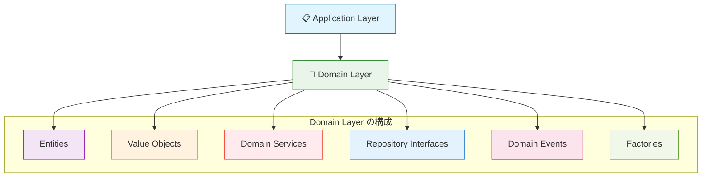
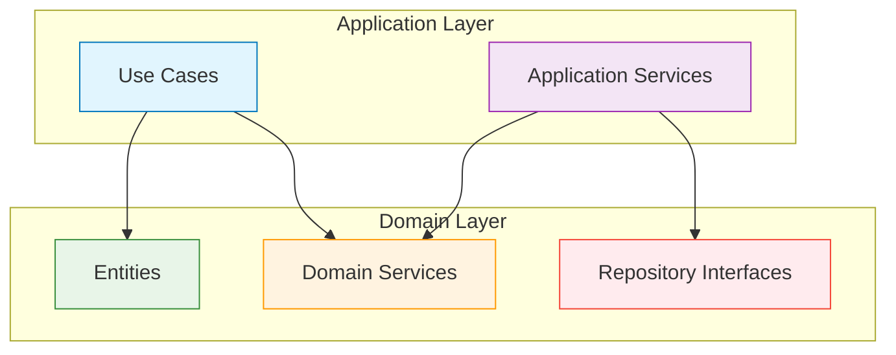

# Domain Layer（ドメイン層）概要 👑

このドキュメントでは、Domain Layer の全体像と他レイヤーとの関係について解説し、各コンポーネントへの案内を provide します。

---

## Domain Layer の役割 🏛️

Domain Layer は、ビジネスルールとドメイン知識を実装する最も重要な層です。企業固有・業界固有のルールを表現し、他のレイヤーから技術的詳細を完全に分離することで、ビジネスロジックの純粋性を保ちます。

### 基本的な位置づけ 🗺️



### ドメインの独立性 🛡️

```mermaid
graph TD
    subgraph "Domain Layer（技術非依存）"
        PURE[Pure Business Logic]
        RULES[Business Rules]
        INVARIANTS[Invariants]
    end
    
    subgraph "外部依存（禁止）"
        FRAMEWORK[Frameworks]
        DB[Database]
        API[External APIs]
        UI[UI Libraries]
    end
    
    PURE -.-> FRAMEWORK
    RULES -.-> DB
    INVARIANTS -.-> API
    PURE -.-> UI
    
    style PURE fill:#e8f5e8,stroke:#388e3c
    style RULES fill:#e8f5e8,stroke:#388e3c
    style INVARIANTS fill:#e8f5e8,stroke:#388e3c
    
    style FRAMEWORK fill:#ffebee,stroke:#f44336
    style DB fill:#ffebee,stroke:#f44336
    style API fill:#ffebee,stroke:#f44336
    style UI fill:#ffebee,stroke:#f44336
    
    classDef forbidden stroke-dasharray: 5 5,stroke:#f44336
    class PURE-->FRAMEWORK,RULES-->DB,INVARIANTS-->API,PURE-->UI forbidden
```

---

## 🎯 何をするレイヤーか

### 責務 📋

1. **ビジネスルールの実装**
   - 企業・業界固有のルール
   - データの妥当性検証
   - 不変条件の保証

2. **ドメインオブジェクトの管理**
   - Entity（エンティティ）の設計・実装
   - Value Object（値オブジェクト）の定義
   - オブジェクト間の関係性の表現

3. **ドメインサービスの提供**
   - 単一のEntityでは表現できないビジネスロジック
   - 複数オブジェクト間の協調処理
   - ドメイン固有の計算・判定

4. **契約の定義**
   - Repository Interfaceの定義
   - External Service Interfaceの定義
   - データアクセス仕様の規定

### 技術的特徴 ⚙️

- **Pure TypeScript** のみ使用（フレームワーク非依存）
- **ドメイン駆動設計（DDD）** のパターンを活用
- **不変条件の保証** でデータ整合性を確保
- **ドメインイベント** でビジネス上重要な出来事を通知

---

## 🚫 何をしないレイヤーか

### 禁止事項 ❌

1. **フレームワーク・ライブラリ依存**

   ```typescript
   // ❌ 禁止：フレームワーク依存
   import { NextRequest } from 'next/server';
   import { PrismaClient } from '@prisma/client';
   ```

2. **具体的なデータベース操作**

   ```typescript
   // ❌ 禁止：直接的なDB操作
   export class User {
     async save() {
       const prisma = new PrismaClient();
       await prisma.user.create({ data: this });
     }
   }
   ```

3. **UI・プレゼンテーション関連の処理**

   ```typescript
   // ❌ 禁止：表示フォーマット等
   export class User {
     getDisplayName(): string {
       return `${this.firstName} ${this.lastName}様`; // 表示用フォーマット
     }
   }
   ```

4. **外部API・サービスの直接呼び出し**

   ```typescript
   // ❌ 禁止：外部サービス直接アクセス
   import axios from 'axios';
   export class User {
     async sendEmail() {
       await axios.post('https://api.sendgrid.com/...');
     }
   }
   ```

5. **インフラストラクチャ関連の実装**

   ```typescript
   // ❌ 禁止：ファイルシステム等
   import fs from 'fs';
   export class User {
     saveToFile() {
       fs.writeFileSync('./user.json', JSON.stringify(this));
     }
   }
   ```

---

## 🔗 他レイヤーとの関係

### Application Layer との関係 📋



**連携方法：**

- Application Layer から Domain Service を呼び出し
- Entity のファクトリーメソッドとビジネスメソッドを活用
- Repository Interface で契約を定義

### Infrastructure Layer との関係（依存性逆転） 🔧

```mermaid
graph TD
    subgraph "Domain Layer"
        REPO_IF[Repository Interface]
    end
    
    subgraph "Infrastructure Layer"
        REPO_IMPL[Repository Implementation]
    end
    
    REPO_IMPL -.-> REPO_IF
    
    style REPO_IF fill:#e8f5e8,stroke:#388e3c
    style REPO_IMPL fill:#fff3e0,stroke:#f57c00
    
    classDef dependencyInversion stroke-dasharray: 5 5,stroke:#4caf50
    class REPO_IMPL-->REPO_IF dependencyInversion
```

**重要：** Domain Layer は Infrastructure Layer に **依存してはいけません**。逆に、Infrastructure Layer が Domain Layer に定義されたインターフェースを実装します（依存性逆転の原則）。

### Presentation Layer との関係（直接依存禁止） 🎨

```mermaid
graph TD
    PRES[🎨 Presentation Layer] -.-> DOMAIN[👑 Domain Layer]
    PRES --> APP[📋 Application Layer]
    APP --> DOMAIN
    
    style PRES fill:#e3f2fd,stroke:#1976d2
    style APP fill:#e1f5fe,stroke:#0277bd
    style DOMAIN fill:#e8f5e8,stroke:#388e3c
    
    classDef forbidden stroke-dasharray: 5 5,stroke:#f44336
    class PRES-->DOMAIN forbidden
```

**重要：** Presentation Layer は Domain Layer に **直接依存してはいけません**。必ずApplication Layer を経由します。

---

## 📁 Domain Layer のコンポーネント

Domain Layer は以下のコンポーネントで構成されています：

### 🎭 [Entities（エンティティ）](../components/entities.md)

- **責務**: 一意性を持つビジネス上重要な概念の表現
- **含まれるもの**: ID、ビジネスメソッド、不変条件、ライフサイクル管理
- **技術**: Pure TypeScript、ファクトリーパターン、ドメインイベント

### 💎 [Value Objects（値オブジェクト）](../components/value-objects.md)

- **責務**: 不変で等価性を持つ値の表現
- **含まれるもの**: 値の検証、等価性判定、ドメインメソッド
- **技術**: Immutable クラス、バリデーション、型安全性

### 🔧 [Domain Services（ドメインサービス）](../components/domain-services.md)

- **責務**: 複数オブジェクト間のビジネスロジック
- **含まれるもの**: オブジェクト協調処理、ドメイン固有計算、複雑な判定
- **技術**: Pure TypeScript、依存性注入、ステートレス設計

### 📋 [Repository Interfaces（リポジトリインターフェース）](../components/repository-interfaces.md)

- **責務**: データアクセスの契約定義
- **含まれるもの**: CRUD操作、検索条件、永続化仕様
- **技術**: TypeScript Interface、ジェネリクス、型安全性

### 📬 [Domain Events（ドメインイベント）](../components/domain-events.md)

- **責務**: ビジネス上重要な出来事の通知
- **含まれるもの**: イベント定義、発行・購読パターン、イベント情報
- **技術**: Observer パターン、イベント駆動アーキテクチャ

### 🏭 [Factories（ファクトリ）](../components/factories.md)

- **責務**: 複雑なオブジェクト生成の責務
- **含まれるもの**: オブジェクト構築ロジック、初期化処理、依存関係解決
- **技術**: Factory パターン、Builder パターン

### 🚨 [Domain Errors（ドメインエラー）](../components/domain-errors.md)

- **責務**: ドメイン固有のエラー定義
- **含まれるもの**: ビジネスルール違反、不変条件エラー、エラーコード
- **技術**: カスタムエラークラス、エラーハンドリング

---

## 🏗️ 実装時の設計指針

### 1. **Rich Domain Model の採用** 💰

```typescript
// ✅ 推薦：ビジネスロジックをEntityに集約
export class User {
  private constructor(
    private readonly id: UserId,
    private email: Email,
    private experiencePoints: number,
    private level: number
  ) {
    this.validateInvariants();
  }
  
  // ビジネスメソッド
  addExperiencePoints(points: number): void {
    if (points <= 0) {
      throw new DomainError('経験値は正の値である必要があります');
    }
    
    this.experiencePoints += points;
    this.checkLevelUp();
    this.validateInvariants();
  }
  
  // 不変条件の保証
  private validateInvariants(): void {
    if (this.experiencePoints < 0) {
      throw new DomainError('経験値は0以上である必要があります');
    }
  }
}

// ❌ 避ける：Anemic Domain Model（贫血模型）
export class User {
  id: string;
  email: string;
  experiencePoints: number;
  level: number; // データだけでロジックがない
}
```

### 2. **不変条件の徹底** 🛡️

```typescript
// ✅ 推薦：常に妥当な状態を保証
export class Email {
  private readonly value: string;
  
  constructor(email: string) {
    this.validateEmail(email);
    this.value = email.toLowerCase().trim();
  }
  
  private validateEmail(email: string): void {
    if (!email || email.trim().length === 0) {
      throw new DomainError('メールアドレスは必須です');
    }
    
    const emailRegex = /^[^\s@]+@[^\s@]+\.[^\s@]+$/;
    if (!emailRegex.test(email)) {
      throw new DomainError('メールアドレスの形式が正しくありません');
    }
  }
}
```

### 3. **ドメインイベントの活用** 📡

```typescript
// ✅ 推薦：ビジネス上重要な出来事を通知
export class User {
  promote(): void {
    if (!this.canPromote()) {
      throw new DomainError('昇格条件を満たしていません');
    }
    
    const oldLevel = this.level;
    this.level += 1;
    
    // ドメインイベント発行
    DomainEvents.raise(new UserPromotedEvent(
      this.id,
      oldLevel,
      this.level,
      new Date()
    ));
  }
}
```

### 4. **依存性逆転の原則** 🔄

```typescript
// ✅ 推薦：Domain LayerでInterfaceを定義
export interface IUserRepository {
  findById(id: UserId): Promise<User | null>;
  findByEmail(email: Email): Promise<User | null>;
  save(user: User): Promise<void>;
  delete(id: UserId): Promise<void>;
}

// Infrastructure LayerでImplementation
// （Infrastructure Layerで実装）
export class PrismaUserRepository implements IUserRepository {
  // 具体的な実装...
}
```

---

## 🧪 テスト戦略

### Unit Tests（単体テスト）

- **Vitest** を使用
- Entity とValue Object の各メソッドを独立してテスト
- ビジネスルールの検証に重点

### Domain Tests（ドメインテスト）

- **Domain Service** の複雑なロジックをテスト
- **不変条件** の検証
- **ドメインイベント** の発行確認

```typescript
// ✅ ドメインテストの例
describe('User Entity', () => {
  it('経験値追加時にレベルアップが発生する', () => {
    // Arrange
    const user = User.create(
      new UserId('user-123'),
      new Email('test@example.com'),
      'テストユーザー'
    );
    
    // Act
    user.addExperiencePoints(1000);
    
    // Assert
    expect(user.getLevel()).toBe(2);
    
    // ドメインイベントの確認
    const events = DomainEvents.getEvents();
    expect(events).toHaveLength(1);
    expect(events[0]).toBeInstanceOf(UserLevelUpEvent);
  });
});
```

---

**各コンポーネントの詳細な実装ルールについては、上記のリンク先ドキュメントを参照してください！** 📖
