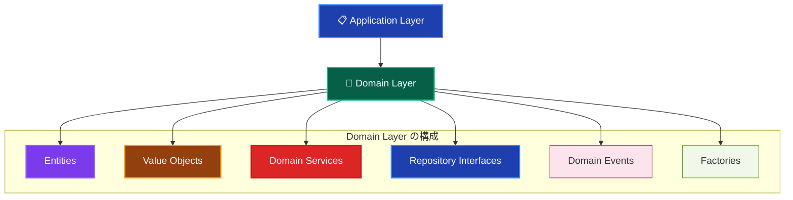
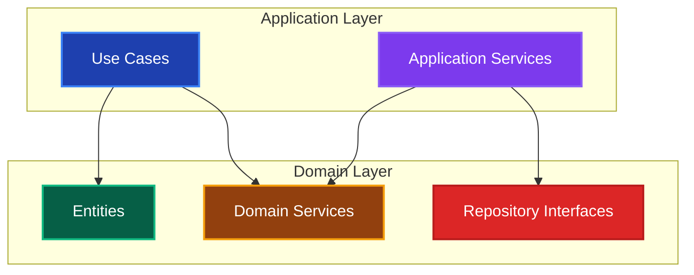

# Domain Layer（ドメイン層）概要 👑

このドキュメントでは、Domain Layer の全体像と他レイヤーとの関係について解説し、各コンポーネントへの案内を provide します。

---

## Domain Layer の役割 🏛️

Domain Layer は、ビジネスルールとドメイン知識を実装する最も重要な層です。企業固有・業界固有のルールを表現し、他のレイヤーから技術的詳細を完全に分離することで、ビジネスロジックの純粋性を保ちます。

### 基本的な位置づけ 🗺️


```mermaid
graph TD
    APP[📋 Application Layer] --> DOMAIN[👑 Domain Layer]

    subgraph "Domain Layer の構成"
        ENTITY[Entities]
        VO[Value Objects]
        DS[Domain Services]
        REPO_IF[Repository Interfaces]
        DOMAIN_EVENT[Domain Events]
        FACTORY[Factories]
    end

    DOMAIN --> ENTITY
    DOMAIN --> VO
    DOMAIN --> DS
    DOMAIN --> REPO_IF
    DOMAIN --> DOMAIN_EVENT
    DOMAIN --> FACTORY

    style APP fill:#1e40af,stroke:#3b82f6,stroke-width:2px,color:#ffffff
    style DOMAIN fill:#065f46,stroke:#10b981,stroke-width:2px,color:#ffffff
    style ENTITY fill:#7c3aed,stroke:#8b5cf6,stroke-width:2px,color:#ffffff
    style VO fill:#92400e,stroke:#f59e0b,stroke-width:2px,color:#ffffff
    style DS fill:#dc2626,stroke:#b91c1c,stroke-width:2px,color:#ffffff
    style REPO_IF fill:#1e40af,stroke:#3b82f6,stroke-width:2px,color:#ffffff
    style DOMAIN_EVENT fill:#fce4ec,stroke:#c2185b
    style FACTORY fill:#f1f8e9,stroke:#689f38
```

### ドメインの独立性 🛡️

```mermaid
graph TD
    subgraph "Domain Layer（技術非依存）"
        PURE[Pure Business Logic]
        RULES[Business Rules]
        INVARIANTS[Invariants]
    end

    subgraph "外部依存（禁止）"
        FRAMEWORK[Frameworks]
        DB[Database]
        API[External APIs]
        UI[UI Libraries]
    end

    PURE -.-> FRAMEWORK
    RULES -.-> DB
    INVARIANTS -.-> API
    PURE -.-> UI

    style PURE fill:#065f46,stroke:#10b981,stroke-width:2px,color:#ffffff
    style RULES fill:#065f46,stroke:#10b981,stroke-width:2px,color:#ffffff
    style INVARIANTS fill:#065f46,stroke:#10b981,stroke-width:2px,color:#ffffff

    style FRAMEWORK fill:#dc2626,stroke:#b91c1c,stroke-width:2px,color:#ffffff
    style DB fill:#dc2626,stroke:#b91c1c,stroke-width:2px,color:#ffffff
    style API fill:#dc2626,stroke:#b91c1c,stroke-width:2px,color:#ffffff
    style UI fill:#dc2626,stroke:#b91c1c,stroke-width:2px,color:#ffffff

    classDef forbidden stroke-dasharray: 5 5,stroke:#f44336
    class PURE-->FRAMEWORK,RULES-->DB,INVARIANTS-->API,PURE-->UI forbidden
```

---

## 🎯 何をするレイヤーか

### 責務 📋

1. **ビジネスルールの実装**

   - 企業・業界固有のルール
   - データの妥当性検証
   - 不変条件の保証

2. **ドメインオブジェクトの管理**

   - Entity（エンティティ）の設計・実装
   - Value Object（値オブジェクト）の定義
   - オブジェクト間の関係性の表現

3. **ドメインサービスの提供**

   - 単一のEntityでは表現できないビジネスロジック
   - 複数オブジェクト間の協調処理
   - ドメイン固有の計算・判定

4. **契約の定義**
   - Repository Interfaceの定義
   - External Service Interfaceの定義
   - データアクセス仕様の規定

### 技術的特徴 ⚙️

- **Pure TypeScript** のみ使用（フレームワーク非依存）
- **ドメイン駆動設計（DDD）** のパターンを活用
- **不変条件の保証** でデータ整合性を確保
- **ドメインイベント** でビジネス上重要な出来事を通知

---

## 🚫 何をしないレイヤーか

### 禁止事項 ❌

1. **フレームワーク・ライブラリ依存**

   ```typescript
   // ❌ 禁止：フレームワーク依存
   import { PrismaClient } from '@prisma/client';
   import { NextRequest } from 'next/server';
   ```

2. **具体的なデータベース操作**

   ```typescript
   // ❌ 禁止：直接的なDB操作
   export class User {
    async save() {
     const prisma = new PrismaClient();
     await prisma.user.create({ data: this });
    }
   }
   ```

3. **UI・プレゼンテーション関連の処理**

   ```typescript
   // ❌ 禁止：表示フォーマット等
   export class User {
    getDisplayName(): string {
     return `${this.firstName} ${this.lastName}様`; // 表示用フォーマット
    }
   }
   ```

4. **外部API・サービスの直接呼び出し**

   ```typescript
   // ❌ 禁止：外部サービス直接アクセス
   import axios from 'axios';

   export class User {
    async sendEmail() {
     await axios.post('https://api.sendgrid.com/...');
    }
   }
   ```

5. **インフラストラクチャ関連の実装**

   ```typescript
   // ❌ 禁止：ファイルシステム等
   import fs from 'fs';

   export class User {
    saveToFile() {
     fs.writeFileSync('./user.json', JSON.stringify(this));
    }
   }
   ```

---

## 🔗 他レイヤーとの関係

### Application Layer との関係 📋


```mermaid
graph TD
    subgraph "Application Layer"
        UC[Use Cases]
        AS[Application Services]
    end

    subgraph "Domain Layer"
        ENTITY[Entities]
        DS[Domain Services]
        REPO_IF[Repository Interfaces]
    end

    UC --> DS
    UC --> ENTITY
    AS --> DS
    AS --> REPO_IF

    style UC fill:#1e40af,stroke:#3b82f6,stroke-width:2px,color:#ffffff
    style AS fill:#7c3aed,stroke:#8b5cf6,stroke-width:2px,color:#ffffff
    style ENTITY fill:#065f46,stroke:#10b981,stroke-width:2px,color:#ffffff
    style DS fill:#92400e,stroke:#f59e0b,stroke-width:2px,color:#ffffff
    style REPO_IF fill:#dc2626,stroke:#b91c1c,stroke-width:2px,color:#ffffff
```

**連携方法：**

- Application Layer から Domain Service を呼び出し
- Entity のファクトリーメソッドとビジネスメソッドを活用
- Repository Interface で契約を定義

### Infrastructure Layer との関係（依存性逆転） 🔧

```mermaid
graph TD
    subgraph "Domain Layer"
        REPO_IF[Repository Interface]
    end

    subgraph "Infrastructure Layer"
        REPO_IMPL[Repository Implementation]
    end

    REPO_IMPL -.-> REPO_IF

    style REPO_IF fill:#065f46,stroke:#10b981,stroke-width:2px,color:#ffffff
    style REPO_IMPL fill:#92400e,stroke:#f59e0b,stroke-width:2px,color:#ffffff

    classDef dependencyInversion stroke-dasharray: 5 5,stroke:#4caf50
    class REPO_IMPL-->REPO_IF dependencyInversion
```

**重要：** Domain Layer は Infrastructure Layer に **依存してはいけません**。逆に、Infrastructure Layer が Domain Layer に定義されたインターフェースを実装します（依存性逆転の原則）。

### Presentation Layer との関係（直接依存禁止） 🎨

```mermaid
graph TD
    PRES[🎨 Presentation Layer] -.-> DOMAIN[👑 Domain Layer]
    PRES --> APP[📋 Application Layer]
    APP --> DOMAIN

    style PRES fill:#1e40af,stroke:#3b82f6,stroke-width:2px,color:#ffffff
    style APP fill:#1e40af,stroke:#3b82f6,stroke-width:2px,color:#ffffff
    style DOMAIN fill:#065f46,stroke:#10b981,stroke-width:2px,color:#ffffff

    classDef forbidden stroke-dasharray: 5 5,stroke:#f44336
    class PRES-->DOMAIN forbidden
```

**重要：** Presentation Layer は Domain Layer に **直接依存してはいけません**。必ずApplication Layer を経由します。

---

## 📁 Domain Layer のコンポーネント

Domain Layer は以下のコンポーネントで構成されています。
詳細な実装パターンは [Domain Layer 実装ガイド](../domain-layer.md) を参照してください。

### 🎭 [Entities（エンティティ）](../components/entities.md)

- **責務**: 一意性を持つビジネス上重要な概念の表現
- **含まれるもの**: ID、ビジネスメソッド、不変条件、ライフサイクル管理
- **技術**: Pure TypeScript、ファクトリーパターン、ドメインイベント

### 💎 [Value Objects（値オブジェクト）](../components/value-objects.md)

- **責務**: 不変で等価性を持つ値の表現
- **含まれるもの**: 値の検証、等価性判定、ドメインメソッド
- **技術**: Immutable クラス、バリデーション、型安全性

### 🔧 Domain Services（ドメインサービス）

- **責務**: 複数オブジェクト間のビジネスロジック
- **含まれるもの**: オブジェクト協調処理、ドメイン固有計算、複雑な判定
- **技術**: Pure TypeScript、依存性注入、ステートレス設計
- **詳細**: [Domain Layer 実装ガイド](../domain-layer.md#domain-services) を参照

### 📋 [Repository Interfaces（リポジトリインターフェース）](../components/repository-interfaces.md)

- **責務**: データアクセスの契約定義
- **含まれるもの**: CRUD操作、検索条件、永続化仕様
- **技術**: TypeScript Interface、ジェネリクス、型安全性

### 📬 Domain Events（ドメインイベント）

- **責務**: ビジネス上重要な出来事の通知
- **含まれるもの**: イベント定義、発行・購読パターン、イベント情報
- **技術**: Observer パターン、イベント駆動アーキテクチャ
- **詳細**: [Domain Layer 実装ガイド](../domain-layer.md#domain-events) を参照

### 🏭 Factories（ファクトリ）

- **責務**: 複雑なオブジェクト生成の責務
- **含まれるもの**: オブジェクト構築ロジック、初期化処理、依存関係解決
- **技術**: Factory パターン、Builder パターン
- **詳細**: Entity の `create()` / `reconstruct()` メソッドで実装（[Entities](../components/entities.md) を参照）

### 🚨 Domain Errors（ドメインエラー）

- **責務**: ドメイン固有のエラー定義
- **含まれるもの**: ビジネスルール違反、不変条件エラー、エラーコード
- **技術**: カスタムエラークラス、エラーハンドリング
- **詳細**: [エラーハンドリング](../../cross-cutting/error-handling.md) を参照

---

## 🏗️ 実装時の設計指針

### 1. **Rich Domain Model の採用** 💰

```typescript
// ✅ 推薦：ビジネスロジックをEntityに集約（Immutableパターン）
export class User {
 private constructor(
  public readonly id: UserId,
  public readonly email: Email,
  public readonly name: string,
  public readonly passwordHash: string,
  public readonly createdAt: Date,
  public readonly updatedAt: Date,
 ) {}

 // ビジネスメソッド（新インスタンスを返す）
 changeEmail(newEmail: Email): User {
  if (newEmail.value === this.email.value) {
   throw new DomainError('新しいメールアドレスが現在のものと同じです');
  }
  return new User(this.id, newEmail, this.name, this.passwordHash, this.createdAt, new Date());
 }

 updateProfile(newName: string): User {
  if (!newName || newName.trim().length === 0) {
   throw new DomainError('名前は必須です');
  }
  return new User(this.id, this.email, newName, this.passwordHash, this.createdAt, new Date());
 }
}

// ❌ 避ける：Anemic Domain Model（貧血モデル）
export class User {
 id: string;
 email: string;
 name: string; // データだけでロジックがない
}
```

### 2. **不変条件の徹底** 🛡️

```typescript
// ✅ 推薦：常に妥当な状態を保証
export class Email {
 private readonly value: string;

 constructor(email: string) {
  this.validateEmail(email);
  this.value = email.toLowerCase().trim();
 }

 private validateEmail(email: string): void {
  if (!email || email.trim().length === 0) {
   throw new DomainError('メールアドレスは必須です');
  }

  const emailRegex = /^[^\s@]+@[^\s@]+\.[^\s@]+$/;
  if (!emailRegex.test(email)) {
   throw new DomainError('メールアドレスの形式が正しくありません');
  }
 }
}
```

### 3. **ドメインイベントの活用** 📡

```typescript
// ✅ 推薦：ビジネス上重要な出来事を通知
export class User {
 changeEmail(newEmail: Email): User {
  if (newEmail.value === this.email.value) {
   throw new DomainError('新しいメールアドレスが現在のものと同じです');
  }

  const oldEmail = this.email;
  const updated = new User(this.id, newEmail, this.name, this.passwordHash, this.createdAt, new Date());

  // ドメインイベント発行
  DomainEvents.raise(
   new UserEmailChangedEvent(this.id, oldEmail, newEmail, new Date()),
  );

  return updated;
 }
}
```

### 4. **依存性逆転の原則** 🔄

```typescript
// ✅ 推薦：Domain LayerでInterfaceを定義
export interface IUserRepository {
 findById(id: UserId): Promise<User | null>;
 findByEmail(email: Email): Promise<User | null>;
 save(user: User): Promise<void>;
 delete(id: UserId): Promise<void>;
}

// Infrastructure LayerでImplementation
// （Infrastructure Layerで実装）
export class PrismaUserRepository implements IUserRepository {
 // 具体的な実装...
}
```

---

## 🧪 テスト戦略

### Unit Tests（単体テスト）

- **Vitest** を使用
- Entity とValue Object の各メソッドを独立してテスト
- ビジネスルールの検証に重点

### Domain Tests（ドメインテスト）

- **Domain Service** の複雑なロジックをテスト
- **不変条件** の検証
- **ドメインイベント** の発行確認

```typescript
// ✅ ドメインテストの例
describe('User Entity', () => {
 it('メール変更時にドメインイベントが発行される', () => {
  // Arrange
  const user = User.create(
   new Email('old@example.com'),
   'テストユーザー',
   'hashedPassword123',
  );

  // Act
  const updatedUser = user.changeEmail(new Email('new@example.com'));

  // Assert
  expect(updatedUser.email.value).toBe('new@example.com');

  // ドメインイベントの確認
  const events = DomainEvents.getEvents();
  expect(events).toHaveLength(1);
  expect(events[0]).toBeInstanceOf(UserEmailChangedEvent);
 });
});
```

---

**各コンポーネントの詳細な実装ルールについては、上記のリンク先ドキュメントを参照してください！** 📖
