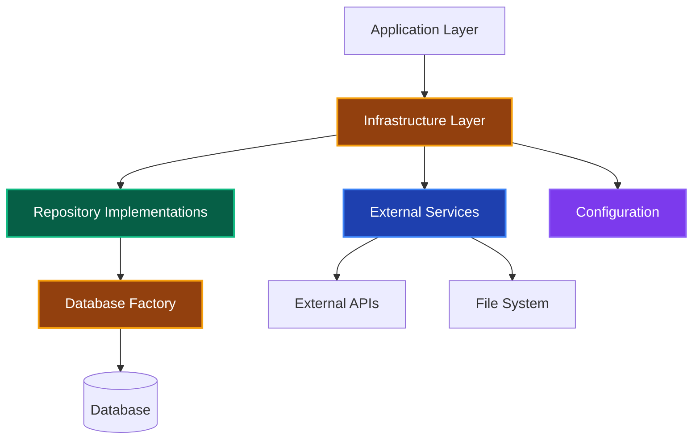

# Infrastructure Layer 実装ガイド 🔧

このドキュメントでは、Infrastructure Layer（インフラストラクチャ層）での実装ルール、許可される処理、禁止される処理について解説します。

---

## Infrastructure Layer の責務 🏗️



**Infrastructure Layerの責務：**

1. **Repository実装** - データベースアクセスの具体的実装
2. **外部サービス連携** - API、メール、ファイルシステム等
3. **設定管理** - 環境変数、接続情報等
4. **技術的詳細の隠蔽** - 上位レイヤーから実装詳細を隠す

---

## ✅ 書いて良いもの（許可される処理）

### 1. Repository実装 📚

**データベースアクセスの具体的実装**

```typescript
// ✅ 許可：完全なRepository実装
export class PrismaUserRepository implements IUserRepository {
 constructor(private prisma: PrismaClient) {}

 async findById(
  id: UserId,
  transaction?: PrismaTransaction,
 ): Promise<User | null> {
  const client = transaction || this.prisma;
  const userData = await client.user.findUnique({
   where: { id: id.toString() },
  });

  return userData ? this.toDomainObject(userData) : null;
 }

 async findByEmail(email: string): Promise<User | null> {
  const userData = await this.prisma.user.findUnique({
   where: { email },
  });

  return userData ? this.toDomainObject(userData) : null;
 }

 async findByCriteria(criteria: UserSearchCriteria): Promise<User[]> {
  const where: Prisma.UserWhereInput = {};

  if (criteria.searchQuery) {
   where.OR = [
    { name: { contains: criteria.searchQuery, mode: 'insensitive' } },
    { email: { contains: criteria.searchQuery, mode: 'insensitive' } },
   ];
  }

  if (criteria.minLevel !== undefined) {
   where.level = { gte: criteria.minLevel };
  }

  if (criteria.isActive !== undefined) {
   const thirtyDaysAgo = new Date();
   thirtyDaysAgo.setDate(thirtyDaysAgo.getDate() - 30);

   where.lastLoginAt = criteria.isActive
    ? { gte: thirtyDaysAgo }
    : { lt: thirtyDaysAgo };
  }

  const users = await this.prisma.user.findMany({
   where,
   orderBy: { [criteria.sortBy || 'createdAt']: criteria.sortOrder || 'desc' },
   skip: criteria.page ? (criteria.page - 1) * (criteria.limit || 10) : 0,
   take: criteria.limit || 10,
  });

  return users.map(this.toDomainObject);
 }

 async save(user: User, transaction?: PrismaTransaction): Promise<void> {
  const client = transaction || this.prisma;
  const data = this.toPersistenceObject(user);

  await client.user.upsert({
   where: { id: data.id },
   update: {
    ...data,
    updatedAt: new Date(),
   },
   create: data,
  });
 }

 async delete(id: UserId): Promise<void> {
  await this.prisma.user.delete({
   where: { id: id.toString() },
  });
 }

 async count(searchQuery?: string): Promise<number> {
  const where: Prisma.UserWhereInput = {};

  if (searchQuery) {
   where.OR = [
    { name: { contains: searchQuery, mode: 'insensitive' } },
    { email: { contains: searchQuery, mode: 'insensitive' } },
   ];
  }

  return await this.prisma.user.count({ where });
 }

 // ドメインオブジェクト変換（Infrastructure層の責務）
 private toDomainObject(data: any): User {
  return User.reconstruct(
   new UserId(data.id),
   new Email(data.email),
   data.name,
   data.experiencePoints,
   data.level,
   data.createdAt,
   data.lastLoginAt,
  );
 }

 // 永続化オブジェクト変換（Infrastructure層の責務）
 private toPersistenceObject(user: User) {
  return {
   id: user.getId().toString(),
   email: user.getEmail().toString(),
   name: user.getName(),
   experiencePoints: user.getExperiencePoints(),
   level: user.getLevel(),
   createdAt: user.getCreatedAt(),
   lastLoginAt: user.getLastLoginAt(),
  };
 }
}
```

**Repository実装のベストプラクティス：**

1. **トランザクション対応** - オプショナルトランザクション引数のサポート
2. **検索条件の柔軟性** - 複雑な検索クエリへの対応
3. **データ変換の責務** - Domain ↔ Persistence間の変換処理
4. **エラーハンドリング** - データベース固有エラーの適切な処理

### 2. 外部サービス実装 🌐

**外部システム連携の具体的実装**

```typescript
// ✅ 許可：メールサービス実装
export class SendGridEmailService implements IEmailService {
 constructor(private apiKey: string) {
  sgMail.setApiKey(this.apiKey);
 }

 async sendWelcomeEmail(email: string, name: string): Promise<void> {
  const msg = {
   to: email,
   from: process.env.FROM_EMAIL!,
   subject: 'ようこそ！アカウント作成が完了しました',
   html: this.buildWelcomeEmailTemplate(name),
  };

  try {
   await sgMail.send(msg);
  } catch (error) {
   throw new InfrastructureError(
    'ウェルカムメールの送信に失敗しました',
    'EMAIL_SEND_FAILED',
    error,
   );
  }
 }

 async sendPromotionNotification(
  email: string,
  name: string,
  newLevel: number,
 ): Promise<void> {
  const msg = {
   to: email,
   from: process.env.FROM_EMAIL!,
   subject: `🎉 レベルアップ！レベル${newLevel}になりました`,
   html: this.buildPromotionEmailTemplate(name, newLevel),
  };

  try {
   await sgMail.send(msg);
  } catch (error) {
   throw new InfrastructureError(
    'レベルアップ通知メールの送信に失敗しました',
    'EMAIL_SEND_FAILED',
    error,
   );
  }
 }

 private buildWelcomeEmailTemplate(name: string): string {
  return `
      <div style="font-family: Arial, sans-serif; max-width: 600px; margin: 0 auto;">
        <h1 style="color: #333;">ようこそ、${name}さん！</h1>
        <p>アカウント作成が完了しました。</p>
        <p>レベル1からスタートです。頑張ってレベルアップしましょう！</p>
      </div>
    `;
 }

 private buildPromotionEmailTemplate(name: string, level: number): string {
  const badge = level >= 10 ? '🏆' : level >= 5 ? '⭐' : '🌱';
  return `
      <div style="font-family: Arial, sans-serif; max-width: 600px; margin: 0 auto;">
        <h1 style="color: #4CAF50;">🎉 レベルアップおめでとうございます！</h1>
        <p>${name}さんがレベル${level}になりました ${badge}</p>
        <p>今後もサービスをお楽しみください！</p>
      </div>
    `;
 }
}

// ✅ 許可：ファイルストレージサービス実装
export class S3FileService implements IFileService {
 constructor(private s3Client: S3Client) {}

 async uploadFile(
  file: Buffer,
  key: string,
  contentType?: string,
 ): Promise<string> {
  const command = new PutObjectCommand({
   Bucket: process.env.S3_BUCKET_NAME!,
   Key: key,
   Body: file,
   ContentType: contentType || 'application/octet-stream',
  });

  try {
   await this.s3Client.send(command);
   return `https://${process.env.S3_BUCKET_NAME}.s3.amazonaws.com/${key}`;
  } catch (error) {
   throw new InfrastructureError(
    'ファイルのアップロードに失敗しました',
    'FILE_UPLOAD_FAILED',
    error,
   );
  }
 }

 async downloadFile(key: string): Promise<Buffer> {
  const command = new GetObjectCommand({
   Bucket: process.env.S3_BUCKET_NAME!,
   Key: key,
  });

  try {
   const response = await this.s3Client.send(command);
   const stream = response.Body as Readable;

   const chunks: Buffer[] = [];
   for await (const chunk of stream) {
    chunks.push(chunk);
   }

   return Buffer.concat(chunks);
  } catch (error) {
   throw new InfrastructureError(
    'ファイルのダウンロードに失敗しました',
    'FILE_DOWNLOAD_FAILED',
    error,
   );
  }
 }

 async deleteFile(key: string): Promise<void> {
  const command = new DeleteObjectCommand({
   Bucket: process.env.S3_BUCKET_NAME!,
   Key: key,
  });

  try {
   await this.s3Client.send(command);
  } catch (error) {
   throw new InfrastructureError(
    'ファイルの削除に失敗しました',
    'FILE_DELETE_FAILED',
    error,
   );
  }
 }
}

// ✅ 許可：認証サービス実装
export class AuthService implements IAuthService {
 constructor(private jwtSecret: string) {}

 async hashPassword(password: string): Promise<string> {
  const saltRounds = 12;
  return await bcrypt.hash(password, saltRounds);
 }

 async verifyPassword(password: string, hash: string): Promise<boolean> {
  return await bcrypt.compare(password, hash);
 }

 async generateAccessToken(userId: string): Promise<string> {
  const payload = { userId, type: 'access' };
  return jwt.sign(payload, this.jwtSecret, { expiresIn: '1h' });
 }

 async generateRefreshToken(userId: string): Promise<string> {
  const payload = { userId, type: 'refresh' };
  return jwt.sign(payload, this.jwtSecret, { expiresIn: '7d' });
 }

 async verifyToken(token: string): Promise<{ userId: string; type: string }> {
  try {
   const payload = jwt.verify(token, this.jwtSecret) as any;
   return { userId: payload.userId, type: payload.type };
  } catch (error) {
   throw new InfrastructureError(
    'トークンの検証に失敗しました',
    'TOKEN_VERIFICATION_FAILED',
    error,
   );
  }
 }

 async hasPermission(userId: string, permission: string): Promise<boolean> {
  // 実際の実装では権限管理システムにアクセス
  const userPermissions = await this.getUserPermissions(userId);
  return userPermissions.includes(permission);
 }

 private async getUserPermissions(userId: string): Promise<string[]> {
  // 実装詳細: データベースや外部サービスから権限情報を取得
  // ここではサンプル実装
  return ['READ_USER', 'UPDATE_OWN_PROFILE'];
 }
}
```

### 3. 設定・環境管理 ⚙️

**環境固有の設定管理**

```typescript
// ✅ 許可：データベース設定管理
export class DatabaseConfig {
 static getDatabaseUrl(): string {
  const url = process.env.DATABASE_URL;
  if (!url) {
   throw new InfrastructureError(
    'DATABASE_URL環境変数が設定されていません',
    'DATABASE_CONFIG_MISSING',
   );
  }
  return url;
 }

 static getConnectionOptions(): PrismaClientOptions {
  return {
   datasources: {
    db: {
     url: this.getDatabaseUrl(),
    },
   },
   log:
    process.env.NODE_ENV === 'development'
     ? ['query', 'info', 'warn']
     : ['error'],
  };
 }

 static createPrismaClient(): PrismaClient {
  return new PrismaClient(this.getConnectionOptions());
 }
}

// ✅ 許可：外部サービス設定管理
export class ExternalServiceConfig {
 static getSendGridConfig() {
  const apiKey = process.env.SENDGRID_API_KEY;
  const fromEmail = process.env.FROM_EMAIL;

  if (!apiKey || !fromEmail) {
   throw new InfrastructureError(
    'SendGrid設定が不完全です',
    'SENDGRID_CONFIG_MISSING',
   );
  }

  return { apiKey, fromEmail };
 }

 static getS3Config() {
  const region = process.env.AWS_REGION;
  const accessKeyId = process.env.AWS_ACCESS_KEY_ID;
  const secretAccessKey = process.env.AWS_SECRET_ACCESS_KEY;
  const bucketName = process.env.S3_BUCKET_NAME;

  if (!region || !accessKeyId || !secretAccessKey || !bucketName) {
   throw new InfrastructureError('S3設定が不完全です', 'S3_CONFIG_MISSING');
  }

  return { region, accessKeyId, secretAccessKey, bucketName };
 }
}
```

### 4. DI Container登録 📦

**依存性注入の設定**

```typescript
// ✅ 許可：Infrastructure层のDI登録
export const registerInfrastructureServices = (
 container: DependencyContainer,
) => {
 // Database
 container.register('PrismaClient', {
  useFactory: () => DatabaseConfig.createPrismaClient(),
 });

 // Repositories
 container.register('IUserRepository', {
  useFactory: (c) => new PrismaUserRepository(c.resolve('PrismaClient')),
 });

 container.register('IOrderRepository', {
  useFactory: (c) => new PrismaOrderRepository(c.resolve('PrismaClient')),
 });

 // External Services
 container.register('IEmailService', {
  useFactory: () => {
   const config = ExternalServiceConfig.getSendGridConfig();
   return new SendGridEmailService(config.apiKey);
  },
 });

 container.register('IFileService', {
  useFactory: () => {
   const config = ExternalServiceConfig.getS3Config();
   const s3Client = new S3Client({
    region: config.region,
    credentials: {
     accessKeyId: config.accessKeyId,
     secretAccessKey: config.secretAccessKey,
    },
   });
   return new S3FileService(s3Client);
  },
 });

 container.register('IAuthService', {
  useFactory: () => {
   const secret = process.env.JWT_SECRET!;
   return new AuthService(secret);
  },
 });

 // Database Factory
 container.register('IDatabaseFactory', {
  useFactory: (c) => new PrismaDatabaseFactory(c.resolve('PrismaClient')),
 });
};
```

---

## ❌ 書いてはダメなもの（禁止される処理）

### 1. ビジネスロジック 🚫

```typescript
// ❌ 禁止：ビジネスロジックをInfrastructureに実装
export class PrismaUserRepository implements IUserRepository {
 async save(user: User): Promise<void> {
  // ❌ ビジネスルール判定はDomain Layerの責務
  if (user.getLevel() >= 5 && user.getExperiencePoints() < 5000) {
   throw new Error('レベル5以上は5000ポイント必要です');
  }

  await this.prisma.user.upsert(/* ... */);
 }
}

// ✅ 正しい実装：純粋なデータアクセスのみ
export class PrismaUserRepository implements IUserRepository {
 async save(user: User): Promise<void> {
  const data = this.toPersistenceObject(user);
  await this.prisma.user.upsert({
   where: { id: data.id },
   update: data,
   create: data,
  });
 }
}
```

### 2. UI・プレゼンテーション処理 🎨

```typescript
// ❌ 禁止：UI関連処理をInfrastructureに実装
export class EmailService implements IEmailService {
 async sendWelcomeEmail(email: string, name: string): Promise<void> {
  // ❌ 表示フォーマットはPresentation Layerの責務
  const displayName = name.length > 10 ? name.substring(0, 10) + '...' : name;
  const levelBadge = '🌱'; // 初心者バッジ

  const html = `<h1>ようこそ、${displayName}${levelBadge}さん！</h1>`;

  await this.sendEmail(email, 'ようこそ！', html);
 }
}

// ✅ 正しい実装：テンプレートは内部管理、データは外部から受け取る
export class EmailService implements IEmailService {
 async sendWelcomeEmail(email: string, name: string): Promise<void> {
  const html = this.buildWelcomeEmailTemplate(name);
  await this.sendEmail(email, 'ようこそ！', html);
 }

 private buildWelcomeEmailTemplate(name: string): string {
  return `<h1>ようこそ、${name}さん！</h1>`;
 }
}
```

---

## 🎯 実装パターン

### Repository実装パターン

```typescript
// ✅ 適切なRepository実装
export class PrismaOrderRepository implements IOrderRepository {
 async findOrdersWithCriteria(criteria: OrderSearchCriteria): Promise<Order[]> {
  const where: Prisma.OrderWhereInput = {};

  if (criteria.userId) {
   where.userId = criteria.userId;
  }

  if (criteria.status) {
   where.status = criteria.status;
  }

  if (criteria.dateRange) {
   where.createdAt = {
    gte: criteria.dateRange.start,
    lte: criteria.dateRange.end,
   };
  }

  const orders = await this.prisma.order.findMany({
   where,
   include: { items: true },
   orderBy: { [criteria.sortBy || 'createdAt']: criteria.sortOrder || 'desc' },
   skip: criteria.page ? (criteria.page - 1) * (criteria.limit || 10) : 0,
   take: criteria.limit || 10,
  });

  return orders.map(this.toDomainObject);
 }
}
```

---

## 📚 関連リンク

### レイヤー間連携

- **[Application Layer ガイド](./application-layer.md)** - Repository・外部サービスの使用方法
- **[Domain Layer ガイド](./domain-layer.md)** - Repository Interfaceの定義方法

### 詳細実装ガイド

- **[Repository Implementations](./components/repository-implementations.md)** - Repository実装の詳細パターン
- **[External Services](./components/external-services.md)** - 外部サービス連携の実装詳細
- **[Configuration Management](./components/configuration-management.md)** - 設定管理と環境変数の処理
- **[DI Container](./components/di-container.md)** - 依存性注入コンテナの設定と管理

### システム設計

- **[依存性注入ガイド](../../dependency-injection.md)** - DI Container設定の詳細

---

## 💡 まとめ

**Infrastructure Layerの責務：**

1. **具体的実装に集中** - Repository、外部サービスの詳細実装
2. **技術的詳細の管理** - データベース、API、ファイルシステム等
3. **設定・環境管理** - 環境固有の設定値管理
4. **エラーハンドリング** - インフラ固有エラーの適切な処理

**Infrastructure Layerは技術的な詳細実装に徹すること！** 🔧✨
