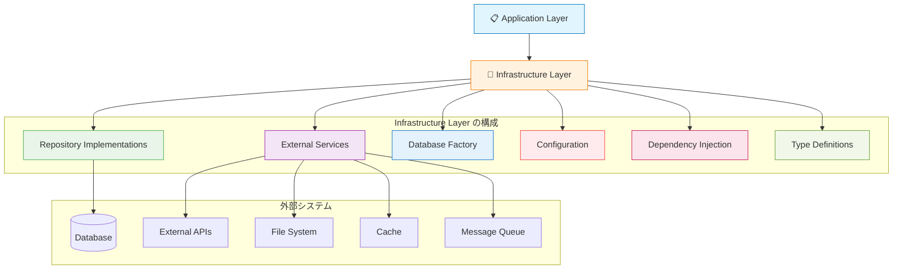
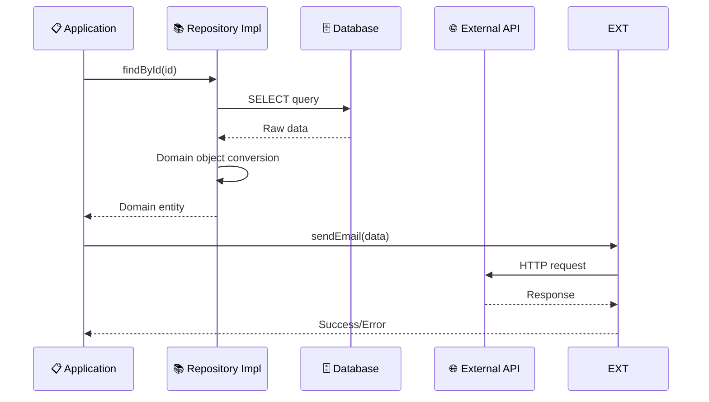
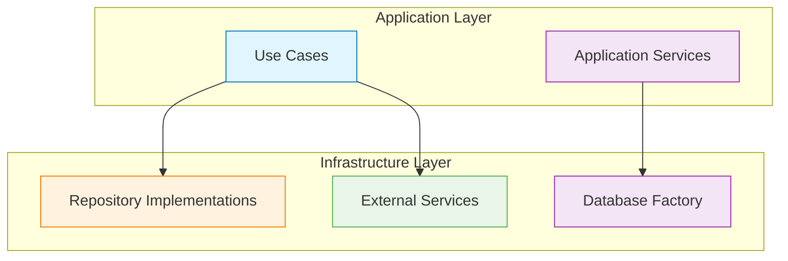

# Infrastructure Layer（インフラストラクチャ層）概要 🔧

このドキュメントでは、Infrastructure Layer の全体像と他レイヤーとの連携について解説し、各コンポーネントへの案内を提供します。

---

## Infrastructure Layer の役割 🏗️

Infrastructure Layer は、技術的詳細と外部システム連携を担当する最下位の層です。データベース、外部API、ファイルシステムなどの具体的な実装を提供し、上位レイヤーから技術的複雑さを隠蔽します。

### 基本的な位置づけ 🗺️



### 技術的詳細の隠蔽 🎭



---

## 🎯 何をするレイヤーか

### 責務 📋

1. **Repository実装**
   - Domain Layer で定義されたインターフェースの具体的実装
   - データベースアクセスの詳細処理
   - データ変換（Domain ↔ Persistence）

2. **外部サービス連携**
   - 外部API呼び出し
   - メール送信サービス
   - ファイルストレージ操作
   - キャッシュ管理

3. **設定管理**
   - 環境変数の読み込み
   - 接続設定の管理
   - セキュリティ設定

4. **依存性注入の設定**
   - DIコンテナの設定
   - インターフェースと実装のバインディング
   - ライフサイクル管理

### 技術的特徴 ⚙️

- **Prisma** でデータベースアクセス
- **外部SDK** で外部サービス連携
- **TSyringe** で依存性注入管理
- **型安全性** を保ちながら技術詳細を実装

---

## 🚫 何をしないレイヤーか

### 禁止事項 ❌

1. **ビジネスロジックの実装**

   ```typescript
   // ❌ 禁止：Repository内でビジネス判定
   export class PrismaUserRepository {
     async save(user: User): Promise<void> {
       // ビジネスロジックは Domain Layer の責務
       if (user.getLevel() >= 10) {
         // 昇格処理... ← これは禁止
       }
       await this.prisma.user.create({...});
     }
   }
   ```

2. **UI・プレゼンテーション関連の処理**

   ```typescript
   // ❌ 禁止：表示用フォーマット
   export class UserRepository {
     async findById(id: string): Promise<User> {
       const userData = await this.prisma.user.findUnique({...});
       // 表示用フォーマット ← Presentation Layerの責務
       return { ...userData, displayName: `${userData.name}様` };
     }
   }
   ```

3. **ユースケース・アプリケーションフローの制御**

   ```typescript
   // ❌ 禁止：複数の操作を組み合わせたビジネスフロー
   export class UserRepository {
     async createUserWithNotification(userData: any): Promise<void> {
       await this.create(userData);
       await this.sendWelcomeEmail(userData.email); // Application Layerの責務
     }
   }
   ```

4. **Domain Layer への逆方向依存**

   ```typescript
   // ❌ 禁止：Infrastructure から Domain への依存（循環参照）
   import { UserDomainService } from '@/layers/domain/services/UserDomainService';
   export class UserRepository {
     constructor(private domainService: UserDomainService) {} // 禁止
   }
   ```

---

## 🔗 他レイヤーとの連携関係

### Application Layer との連携 📋



**連携方法：**

- Application Layer から Repository 実装を注入
- External Service で外部システム連携
- Database Factory でトランザクション管理

### Domain Layer との関係（依存性逆転） 👑

```mermaid
graph TD
    subgraph "Domain Layer"
        REPO_IF[Repository Interface]
        EXT_IF[External Service Interface]
    end
    
    subgraph "Infrastructure Layer"
        REPO_IMPL[Repository Implementation]
        EXT_IMPL[External Service Implementation]
    end
    
    REPO_IMPL -.-> REPO_IF
    EXT_IMPL -.-> EXT_IF
    
    style REPO_IF fill:#e8f5e8,stroke:#388e3c
    style EXT_IF fill:#e8f5e8,stroke:#388e3c
    style REPO_IMPL fill:#fff3e0,stroke:#f57c00
    style EXT_IMPL fill:#fff3e0,stroke:#f57c00
    
    classDef dependencyInversion stroke-dasharray: 5 5,stroke:#4caf50
    class REPO_IMPL-->REPO_IF,EXT_IMPL-->EXT_IF dependencyInversion
```

**重要：** Infrastructure Layer は Domain Layer で定義されたインターフェースを実装し、具体的な技術詳細を隠蔽します。

### Presentation Layer との関係（直接依存禁止） 🎨

```mermaid
graph TD
    PRES[🎨 Presentation Layer] -.-> INFRA[🔧 Infrastructure Layer]
    PRES --> APP[📋 Application Layer]
    APP --> INFRA
    
    style PRES fill:#e3f2fd,stroke:#1976d2
    style APP fill:#e1f5fe,stroke:#0277bd
    style INFRA fill:#fff3e0,stroke:#f57c00
    
    classDef forbidden stroke-dasharray: 5 5,stroke:#f44336
    class PRES-->INFRA forbidden
```

**重要：** Presentation Layer は Infrastructure Layer に **直接依存してはいけません**。必ずApplication Layer を経由します。

---

## 📁 Infrastructure Layer のコンポーネント

Infrastructure Layer は以下のコンポーネントで構成されています：

### 📚 [Repository Implementations（リポジトリ実装）](../components/repository-implementations.md)

- **責務**: Domain Repository Interface の具体的実装
- **含まれるもの**: CRUD操作、検索クエリ、データ変換ロジック
- **技術**: Prisma、データベース固有実装、トランザクション管理

### 🌐 [External Services（外部サービス）](../components/external-services.md)

- **責務**: 外部システムとの連携実装
- **含まれるもの**: API呼び出し、メール送信、ファイル操作、キャッシュ管理
- **技術**: HTTP Client、外部SDK、認証処理

### 🗄️ [Database Factory（データベースファクトリ）](../components/database-factory.md)

- **責務**: データベース接続とトランザクション管理
- **含まれるもの**: 接続プール、トランザクション制御、設定管理
- **技術**: Prisma Client、接続管理、エラーハンドリング

### ⚙️ [Configuration Management（設定管理）](../components/configuration-management.md)

- **責務**: 環境設定と設定値の管理
- **含まれるもの**: 環境変数、接続文字列、セキュリティ設定
- **技術**: 環境変数読み込み、設定バリデーション

### 💉 [Dependency Injection Setup（依存性注入設定）](../components/dependency-injection-setup.md)

- **責務**: DIコンテナの設定とバインディング
- **含まれるもの**: インターフェース実装バインディング、ライフサイクル管理
- **技術**: TSyringe、コンテナ設定、依存関係解決

### 📝 [Type Definitions（型定義）](../components/type-definitions.md)

- **責務**: Infrastructure 固有の型定義
- **含まれるもの**: データベーススキーマ型、外部API型、設定型
- **技術**: TypeScript Interface、ジェネリクス、型ガード

### 🔄 [Data Mappers（データマッパー）](../components/data-mappers.md)

- **責務**: Domain オブジェクトと永続化データの変換
- **含まれるもの**: Domain → Persistence、Persistence → Domain 変換
- **技術**: TypeScript、オブジェクト変換ロジック

---

## 🏗️ 実装時の設計指針

### 1. **依存性逆転の徹底** 🔄

```typescript
// ✅ 推薦：Domain Interface の実装
export class PrismaUserRepository implements IUserRepository {
  constructor(private prisma: PrismaClient) {}
  
  async findById(id: UserId): Promise<User | null> {
    const userData = await this.prisma.user.findUnique({
      where: { id: id.toString() }
    });
    
    return userData ? this.toDomainObject(userData) : null;
  }
  
  // Domain オブジェクトへの変換
  private toDomainObject(data: any): User {
    return User.reconstruct(
      new UserId(data.id),
      new Email(data.email),
      data.name,
      data.experiencePoints,
      data.level,
      data.createdAt,
      data.lastLoginAt
    );
  }
}
```

### 2. **適切なエラーハンドリング** 🚨

```typescript
// ✅ 推薦：Infrastructure 固有エラーの適切な処理
export class SendGridEmailService implements IEmailService {
  async sendWelcomeEmail(email: string, name: string): Promise<void> {
    try {
      await sgMail.send({
        to: email,
        from: process.env.FROM_EMAIL!,
        subject: 'ようこそ！',
        html: this.buildWelcomeTemplate(name)
      });
    } catch (error) {
      if (error.response?.status === 429) {
        throw new InfrastructureError(
          'メール送信レート制限に達しました',
          'EMAIL_RATE_LIMIT',
          error
        );
      }
      
      throw new InfrastructureError(
        'メール送信に失敗しました',
        'EMAIL_SEND_FAILED',
        error
      );
    }
  }
}
```

### 3. **トランザクション対応** 🔄

```typescript
// ✅ 推薦：トランザクション対応Repository
export class PrismaUserRepository implements IUserRepository {
  async save(user: User, transaction?: PrismaTransaction): Promise<void> {
    const client = transaction || this.prisma;
    const data = this.toPersistenceObject(user);
    
    await client.user.upsert({
      where: { id: data.id },
      update: { ...data, updatedAt: new Date() },
      create: data
    });
  }
  
  async delete(id: UserId, transaction?: PrismaTransaction): Promise<void> {
    const client = transaction || this.prisma;
    await client.user.delete({
      where: { id: id.toString() }
    });
  }
}
```

### 4. **設定の外部化** ⚙️

```typescript
// ✅ 推薦：設定値の適切な管理
export class DatabaseConfig {
  static get connectionString(): string {
    const url = process.env.DATABASE_URL;
    if (!url) {
      throw new ConfigurationError('DATABASE_URL is not configured');
    }
    return url;
  }
  
  static get maxConnections(): number {
    return parseInt(process.env.DB_MAX_CONNECTIONS || '10');
  }
  
  static get timeout(): number {
    return parseInt(process.env.DB_TIMEOUT || '30000');
  }
}
```

---

## 🧪 テスト戦略

### Integration Tests（統合テスト）

- **実際のDatabase** を使用したテスト
- **Repository実装** の動作検証
- **トランザクション** の動作確認

### External Service Tests（外部サービステスト）

- **モックサーバー** を使用したテスト
- **エラーケース** の動作検証
- **レート制限** の対応確認

```typescript
// ✅ Repository統合テストの例
describe('PrismaUserRepository', () => {
  let repository: PrismaUserRepository;
  let prisma: PrismaClient;
  
  beforeEach(async () => {
    prisma = new PrismaClient();
    repository = new PrismaUserRepository(prisma);
    await prisma.$transaction(async (tx) => {
      await tx.user.deleteMany(); // テストデータリセット
    });
  });
  
  it('ユーザーの保存と取得ができる', async () => {
    // Arrange
    const user = User.create(
      new UserId('test-123'),
      new Email('test@example.com'),
      'テストユーザー'
    );
    
    // Act
    await repository.save(user);
    const savedUser = await repository.findById(new UserId('test-123'));
    
    // Assert
    expect(savedUser).not.toBeNull();
    expect(savedUser!.getName()).toBe('テストユーザー');
    expect(savedUser!.getEmail().toString()).toBe('test@example.com');
  });
});
```

---

## 🔧 技術スタック

### データベース関連

- **Prisma** - ORM・クエリビルダー
- **PostgreSQL** - メインデータベース
- **Redis** - キャッシュ・セッション管理

### 外部サービス連携

- **SendGrid** - メール送信
- **AWS S3** - ファイルストレージ
- **Stripe** - 決済処理

### 依存性注入

- **TSyringe** - DIコンテナ
- **reflect-metadata** - メタデータ反映

### ユーティリティ

- **zod** - バリデーション
- **winston** - ロギング

---

## 📈 パフォーマンス最適化

### 1. **接続プールの設定**

```typescript
// Prisma接続プール設定
const prisma = new PrismaClient({
  datasources: {
    db: {
      url: process.env.DATABASE_URL
    }
  },
  // 接続プール設定
  __internal: {
    engine: {
      poolSize: 10,
      idleTimeout: 30000
    }
  }
});
```

### 2. **クエリ最適化**

```typescript
// インデックスを活用した効率的なクエリ
async findByEmail(email: Email): Promise<User | null> {
  const userData = await this.prisma.user.findUnique({
    where: { 
      email: email.toString() // email カラムにインデックス設定
    },
    select: {
      id: true,
      email: true,
      name: true,
      experiencePoints: true,
      level: true,
      createdAt: true,
      lastLoginAt: true
      // 必要なフィールドのみ取得
    }
  });
  
  return userData ? this.toDomainObject(userData) : null;
}
```

---

**各コンポーネントの詳細な実装ルールについては、上記のリンク先ドキュメントを参照してください！** 📖
