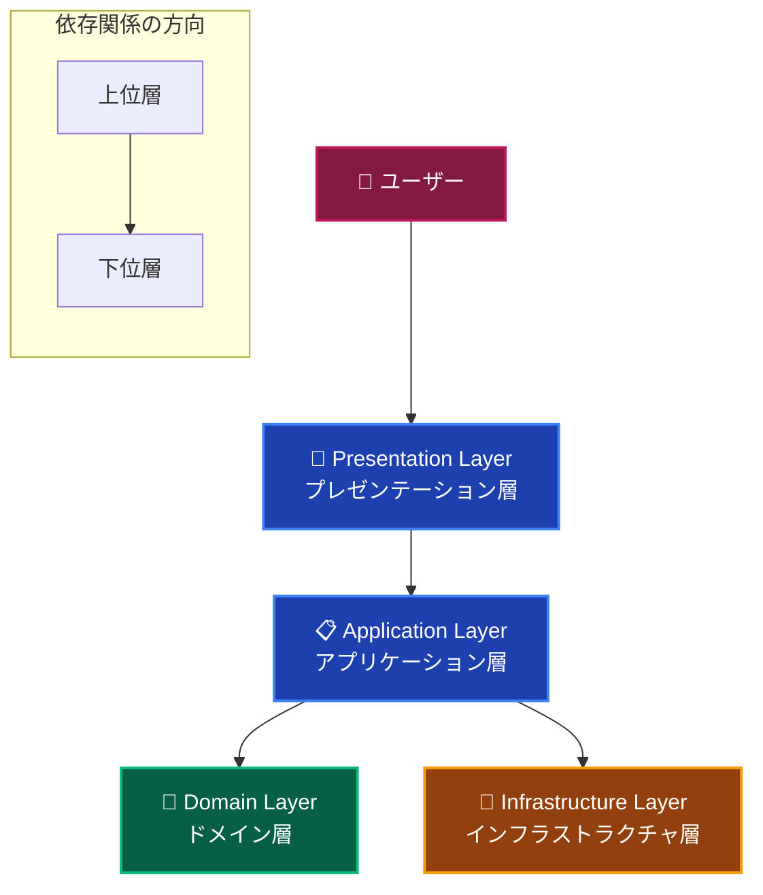
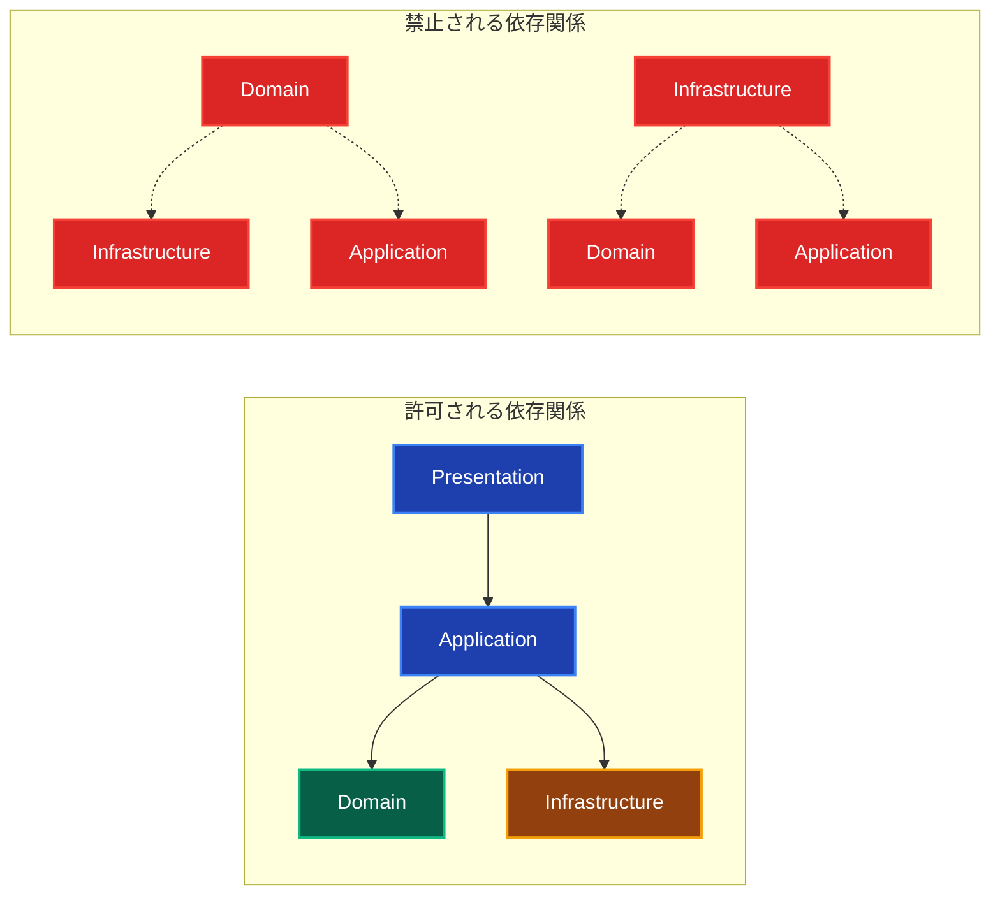

# レイヤードアーキテクチャ ガイド 🏗️

このドキュメントでは、プロジェクトで採用しているレイヤードアーキテクチャの全体像とその設計思想について解説します。

---

## レイヤードアーキテクチャとは？ 🤔

レイヤードアーキテクチャ（層状アーキテクチャ）は、アプリケーションを論理的に独立した複数の層に分割する設計パターンです。各層は特定の責務を持ち、決められた方向にのみ依存関係を形成します。

### 基本的な構造 🎯



### 層間の依存関係ルール 📏



**重要なルール：**

1. **上位層から下位層への依存のみ許可** - 逆方向の依存は禁止
2. **Domain層は最も独立性が高い** - フレームワークやDBに依存しない
3. **Infrastructure層が最も外部依存が多い** - 技術的詳細を担当

---

## 各層の責務と役割 🎭

### 🎨 Presentation Layer（プレゼンテーション層）

**責務：** ユーザーインターフェースとユーザー入力の処理

- UI コンポーネントの描画
- ユーザー操作の受付（クリック、フォーム入力等）
- UI状態の管理（モーダル開閉、タブ選択等）
- Server Actions経由でのApplication Layer呼び出し

**技術スタック：** Next.js App Router、React、TailwindCSS、Flowbite-React

### 📋 Application Layer（アプリケーション層）

**責務：** ビジネスフローの制御と調整

- Use Case（ユースケース）の実装
- トランザクション管理
- Domain LayerとInfrastructure Layerの組み合わせ
- データ変換（DTO）

**技術スタック：** TypeScript、TSyringe（DI）

### 👑 Domain Layer（ドメイン層）

**責務：** ビジネスルールとドメイン知識の実装

- Entity（エンティティ）
- Value Object（値オブジェクト）
- Domain Service（ドメインサービス）
- Repository Interface（リポジトリインターフェース）
- Domain Event（ドメインイベント）

**技術スタック：** Pure TypeScript（フレームワーク非依存）

### 🔧 Infrastructure Layer（インフラストラクチャ層）

**責務：** 技術的詳細と外部システム連携

- Repository実装
- 外部API連携
- データベースアクセス
- ファイルシステム操作
- 設定管理

**技術スタック：** Prisma、外部API SDK、Node.js標準ライブラリ

---

## レイヤードアーキテクチャのメリット 👍

### 1. **関心の分離** 🎯

- 各層が明確な責務を持つ
- 変更の影響範囲を限定できる
- 理解しやすい構造

### 2. **テスタビリティ** 🧪

- 各層を独立してテストできる
- モックによる依存関係の切断が容易
- 単体テストから統合テストまで段階的に実行可能

### 3. **保守性** 🔧

- 技術的詳細とビジネスロジックの分離
- フレームワーク変更時の影響範囲を限定
- 新機能追加時の既存コードへの影響を最小化

### 4. **再利用性** ♻️

- Domain Layerは他のアプリケーションでも再利用可能
- Infrastructure Layerの実装を差し替え可能
- Use Caseの組み合わせで新しい機能を構築

### 5. **スケーラビリティ** 📈

- チーム開発での役割分担が明確
- 層ごとに異なる開発者が並行して作業可能
- 大規模プロジェクトでの管理が容易

---

## レイヤードアーキテクチャのデメリット ⚠️

### 1. **複雑性の増加** 🤯

- 小規模プロジェクトでは過剰設計になる可能性
- 学習コストが高い
- 初期構築に時間がかかる

### 2. **性能のオーバーヘッド** ⏱️

- 層間でのデータ変換コスト
- 抽象化による処理の遅延
- メモリ使用量の増加

### 3. **開発初期の負荷** 💼

- インターフェース設計に時間がかかる
- 依存性注入の設定が複雑
- デバッグ時のスタックトレースが深い

### 4. **過度な抽象化のリスク** 🌀

- 実装が過度に複雑になる可能性
- 理解困難なインターフェース設計
- 変更時の影響範囲の把握が困難

---

## 実装における注意点 ⚡

### 1. **依存関係の方向を厳守**

```typescript
// ❌ 禁止：Domain LayerがInfrastructure Layerに依存
import { PrismaClient } from '@prisma/client'; // Domain内では禁止

// ✅ 許可：Interface経由での依存関係の逆転
export interface IUserRepository {
  findById(id: UserId): Promise<User | null>;
}
```

### 2. **Domainレイヤーの独立性を保つ**

```typescript
// ❌ 禁止：フレームワーク依存
import { NextRequest } from 'next/server'; // Domain内では禁止

// ✅ 許可：Pure TypeScript
export class User {
  private constructor(private id: UserId, private name: string) {}
}
```

### 3. **レイヤー間の適切なデータ変換**

```typescript
// ✅ Application LayerでのDTO変換
export class CreateUserUseCase {
  async execute(request: CreateUserRequest): Promise<CreateUserResponse> {
    // Domain オブジェクト作成
    const user = User.create(request.name, new Email(request.email));
    
    // Repository保存
    await this.userRepository.save(user);
    
    // DTO変換してレスポンス
    return {
      id: user.getId().toString(),
      name: user.getName(),
      email: user.getEmail().toString()
    };
  }
}
```

---

## 各層の詳細ドキュメント 📚

各層の詳細な実装ルールと具体例については、以下のドキュメントを参照してください：

### 🎨 [Presentation Layer（プレゼンテーション層）](./presentation/presentation.md)

- UI コンポーネントの実装
- Server Actions の作成
- UI状態管理
- フォームバリデーション

### 📋 [Application Layer（アプリケーション層）](./application/application.md)

- Use Case の実装
- トランザクション管理
- DTO の設計
- 認可・権限チェック

### 👑 [Domain Layer（ドメイン層）](./domain/domain.md)

- Entity の設計
- Value Object の実装
- Domain Service の作成
- Repository Interface の定義

### 🔧 [Infrastructure Layer（インフラストラクチャ層）](./infrastructure/infrastructure.md)

- Repository 実装
- 外部サービス連携
- データベース操作
- 設定管理

---

## アーキテクチャ進化の指針 🚀

### Phase 1: 基本構造の確立

- [ ] 各層の基本的な責務分離
- [ ] 依存関係の方向性確立
- [ ] 基本的なEntity・Value Object実装

### Phase 2: ドメインモデルの充実

- [ ] 複雑なビジネスルールの実装
- [ ] Domain Service の活用
- [ ] Domain Event の導入

### Phase 3: 高度な機能の追加

- [ ] CQRS（Command Query Responsibility Segregation）の導入
- [ ] イベントソーシングの検討
- [ ] マイクロサービス分割の検討

---

**📖 各層の詳細については、上記のリンク先ドキュメントを必ず確認してください！**
