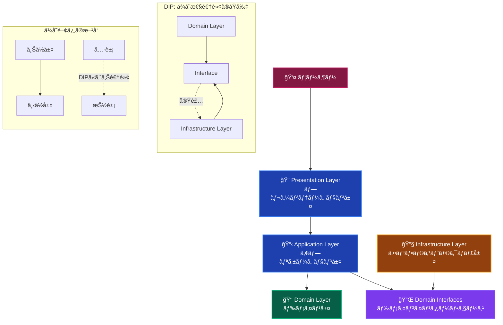
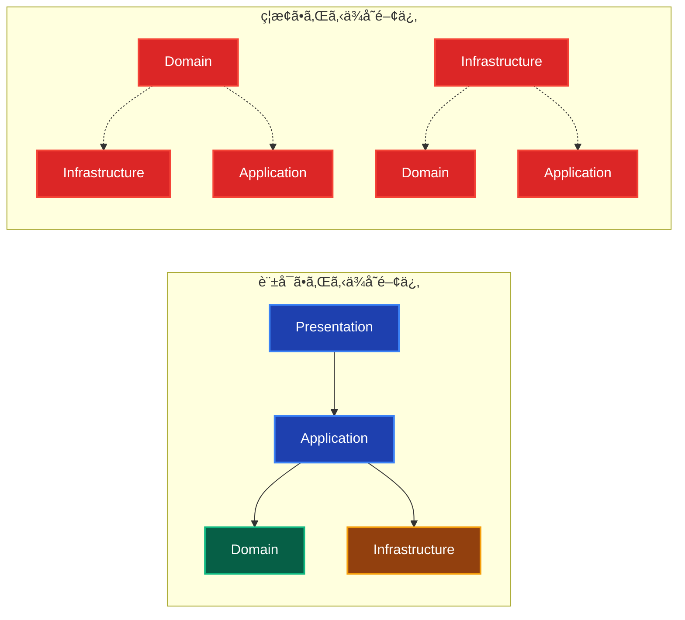
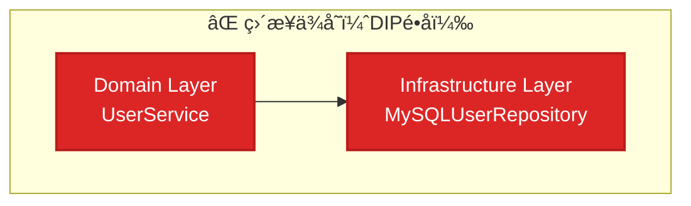
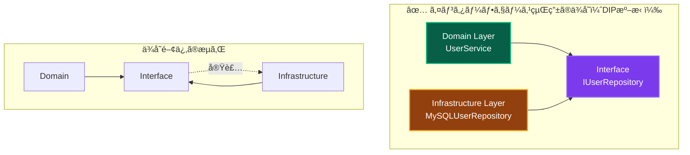
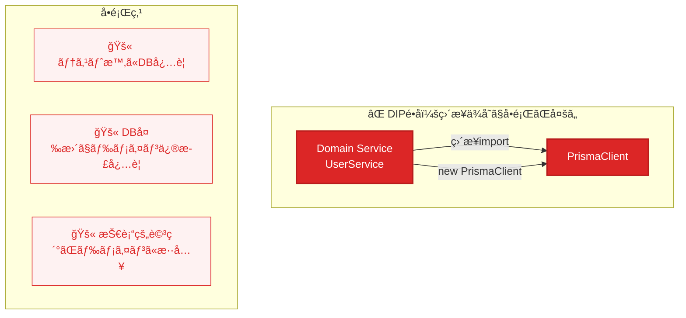
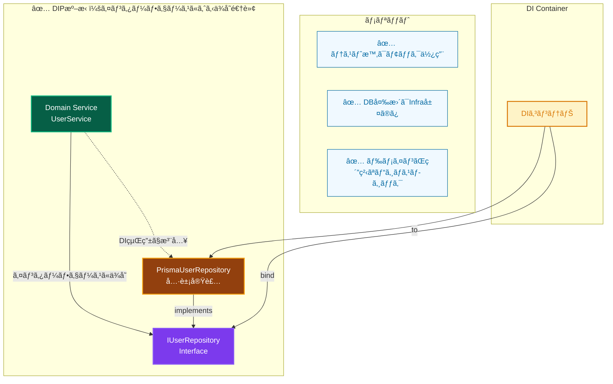
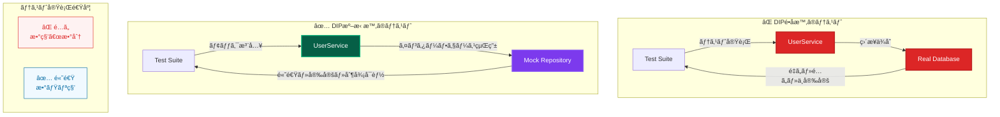
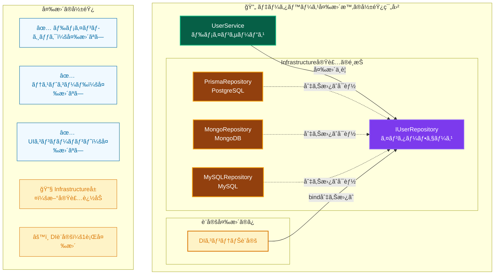

# レイヤードアーキテクãƒãƒ£ ガイド ğŸ—ï¸

ã“ã®ãƒ‰ã‚­ãƒ¥ãƒ¡ãƒ³ãƒˆã§ã¯ã€ãƒ—ロジェクトã§æ¡ç”¨ã—ã¦ã„るレイヤードアーキテクãƒãƒ£ã®å…¨ä½“åƒã¨ãã®è¨­è¨ˆæ€æƒ³ã«ã¤ã„ã¦è§£èª¬ã—ã¾ã™ã€‚

---

## レイヤードアーキテクãƒãƒ£ã¨ã¯ï¼Ÿ 🤔

レイヤードアーキテクãƒãƒ£ï¼ˆå±¤çŠ¶ã‚¢ãƒ¼ã‚­ãƒ†ã‚¯ãƒãƒ£ï¼‰ã¯ã€ã‚¢ãƒ—リケーションを論ç†çš„ã«ç‹¬ç«‹ã—ãŸè¤‡æ•°ã®å±¤ã«åˆ†å‰²ã™ã‚‹è¨­è¨ˆãƒ‘ターンã§ã™ã€‚å„層ã¯ç‰¹å®šã®è²¬å‹™ã‚’æŒã¡ã€æ±ºã‚られãŸæ–¹å‘ã«ã®ã¿ä¾å­˜é–¢ä¿‚ã‚’å½¢æˆã—ã¾ã™ã€‚

### 基本的ãªæ§‹é€  ğŸ¯


```mermaid
graph TD
    USER[👤 ユーザー] --> PRES[🨠Presentation Layer<br/>プレゼンテーション層]
    PRES --> APP[📋 Application Layer<br/>アプリケーション層]
    APP --> DOMAIN[👑 Domain Layer<br/>ドメイン層]
    APP --> DOMAIN_INTERFACES[🔌 Domain Interfaces<br/>ドメインインターフェース]
    INFRA[🔧 Infrastructure Layer<br/>インフラストラクãƒãƒ£å±¤] --> DOMAIN_INTERFACES

    subgraph "DIP: ä¾å­˜æ€§é€†è»¢ã®åŸå‰‡"
        direction TB
        DOMAIN_LAYER[Domain Layer] --> INTERFACE[Interface]
        INFRA_LAYER[Infrastructure Layer] --> INTERFACE
        INTERFACE -.->|実装| INFRA_LAYER
    end

    subgraph "ä¾å­˜é–¢ä¿‚ã®æ–¹å‘"
        direction TB
        HIGH[上ä½å±¤] --> LOW[下ä½å±¤]
        CONCRETE[具象] -.->|DIPã«ã‚ˆã‚Šé€†è»¢| ABSTRACT[抽象]
    end

    style PRES fill:#1e40af,stroke:#3b82f6,stroke-width:2px,color:#ffffff
    style APP fill:#1e40af,stroke:#3b82f6,stroke-width:2px,color:#ffffff
    style DOMAIN fill:#065f46,stroke:#10b981,stroke-width:2px,color:#ffffff
    style DOMAIN_INTERFACES fill:#7c3aed,stroke:#8b5cf6,stroke-width:2px,color:#ffffff
    style INFRA fill:#92400e,stroke:#f59e0b,stroke-width:2px,color:#ffffff

    classDef userStyle fill:#831843,stroke:#be185d,stroke-width:2px,color:#ffffff
    class USER userStyle
```

### 層間ã®ä¾å­˜é–¢ä¿‚ルール ğŸ“


```mermaid
graph LR
    subgraph "許å¯ã•ã‚Œã‚‹ä¾å­˜é–¢ä¿‚"
        P1[Presentation] --> A1[Application]
        A1 --> D1[Domain]
        A1 --> I1[Infrastructure]
    end

    subgraph "ç¦æ­¢ã•ã‚Œã‚‹ä¾å­˜é–¢ä¿‚"
        D2[Domain] -.-> I2[Infrastructure]
        D2 -.-> A2[Application]
        I3[Infrastructure] -.-> D3[Domain]
        I3 -.-> A3[Application]
    end

    style P1 fill:#1e40af,stroke:#3b82f6,stroke-width:2px,color:#ffffff fill:#1e40af,stroke:#3b82f6,stroke-width:2px,color:#ffffff
    style A1 fill:#1e40af,stroke:#3b82f6,stroke-width:2px,color:#ffffff fill:#1e40af,stroke:#3b82f6,stroke-width:2px,color:#ffffff
    style D1 fill:#065f46,stroke:#10b981,stroke-width:2px,color:#ffffff fill:#065f46,stroke:#10b981,stroke-width:2px,color:#ffffff
    style I1 fill:#92400e,stroke:#f59e0b,stroke-width:2px,color:#ffffff fill:#92400e,stroke:#f59e0b,stroke-width:2px,color:#ffffff

    style D2 fill:#dc2626,stroke:#b91c1c,stroke-width:2px,color:#ffffff fill:#dc2626,stroke:#b91c1c,stroke-width:2px,color:#ffffff,stroke:#f44336
    style I2 fill:#dc2626,stroke:#b91c1c,stroke-width:2px,color:#ffffff fill:#dc2626,stroke:#b91c1c,stroke-width:2px,color:#ffffff,stroke:#f44336
    style A2 fill:#dc2626,stroke:#b91c1c,stroke-width:2px,color:#ffffff fill:#dc2626,stroke:#b91c1c,stroke-width:2px,color:#ffffff,stroke:#f44336
    style I3 fill:#dc2626,stroke:#b91c1c,stroke-width:2px,color:#ffffff fill:#dc2626,stroke:#b91c1c,stroke-width:2px,color:#ffffff,stroke:#f44336
    style D3 fill:#dc2626,stroke:#b91c1c,stroke-width:2px,color:#ffffff fill:#dc2626,stroke:#b91c1c,stroke-width:2px,color:#ffffff,stroke:#f44336
    style A3 fill:#dc2626,stroke:#b91c1c,stroke-width:2px,color:#ffffff fill:#dc2626,stroke:#b91c1c,stroke-width:2px,color:#ffffff,stroke:#f44336
```

**é‡è¦ãªãƒ«ãƒ¼ãƒ«ï¼š**

1. **上ä½å±¤ã‹ã‚‰ä¸‹ä½å±¤ã¸ã®ä¾å­˜ã®ã¿è¨±å¯** - 逆方å‘ã®ä¾å­˜ã¯ç¦æ­¢
2. **Domain層ã¯æœ€ã‚‚独立性ãŒé«˜ã„** - フレームワークやDBã«ä¾å­˜ã—ãªã„
3. **Infrastructure層ãŒæœ€ã‚‚外部ä¾å­˜ãŒå¤šã„** - 技術的詳細を担当

### 🔄 ä¾å­˜æ€§é€†è»¢ã®åŸå‰‡ï¼ˆDependency Inversion Principle）

レイヤードアーキテクãƒãƒ£ã®æœ€ã‚‚é‡è¦ãªæ¦‚念ã®ä¸€ã¤ãŒ**ä¾å­˜æ€§é€†è»¢ã®åŸå‰‡ï¼ˆDIP）**ã§ã™ã€‚ã“ã®åŸå‰‡ã«ã‚ˆã‚Šã€ãƒ‰ãƒ¡ã‚¤ãƒ³å±¤ã®ç‹¬ç«‹æ€§ã¨ãƒ†ã‚¹ã‚¿ãƒ“リティãŒå®Ÿç¾ã•ã‚Œã¾ã™ã€‚

#### DIPã®åŸºæœ¬æ¦‚念 ğŸ¯

**従æ¥ã®ä¾å­˜é–¢ä¿‚（悪ã„例）：**


```mermaid
graph TB
    subgraph "⌠直æ¥ä¾å­˜ï¼ˆDIPé•å）"
        DL1[Domain Layer<br/>UserService] --> IL1[Infrastructure Layer<br/>MySQLUserRepository]
    end

    style DL1 fill:#dc2626,stroke:#b91c1c,stroke-width:2px,color:#ffffff
    style IL1 fill:#dc2626,stroke:#b91c1c,stroke-width:2px,color:#ffffff
```

**DIPé©ç”¨å¾Œã®ä¾å­˜é–¢ä¿‚（良ã„例）：**


```mermaid
graph TB
    subgraph "✅ インターフェース経由ã®ä¾å­˜ï¼ˆDIP準拠）"
        DL2[Domain Layer<br/>UserService] --> IR[Interface<br/>IUserRepository]
        IL2[Infrastructure Layer<br/>MySQLUserRepository] --> IR
    end

    subgraph "ä¾å­˜é–¢ä¿‚ã®æµã‚Œ"
        direction LR
        DOMAIN[Domain] --> INTERFACE[Interface]
        INFRA[Infrastructure] --> INTERFACE
        INTERFACE -.->|実装| INFRA
    end

    style DL2 fill:#065f46,stroke:#10b981,stroke-width:2px,color:#ffffff
    style IR fill:#7c3aed,stroke:#8b5cf6,stroke-width:2px,color:#ffffff
    style IL2 fill:#92400e,stroke:#f59e0b,stroke-width:2px,color:#ffffff
```

#### ãªãœDIPãŒå¿…è¦ãªã®ã‹ï¼Ÿ 🤔

1. **技術的詳細ã‹ã‚‰ã®ç‹¬ç«‹æ€§**

   - ドメインロジックãŒãƒ‡ãƒ¼ã‚¿ãƒ™ãƒ¼ã‚¹ã‚„フレームワークã«ä¾å­˜ã—ãªã„
   - MySQLã‹ã‚‰PostgreSQLã¸ã®å¤‰æ›´ãŒå®¹æ˜“

2. **テスタビリティã®å‘上**

   - インターフェースã«ã‚ˆã‚Šãƒ¢ãƒƒã‚¯ä½œæˆãŒç°¡å˜
   - ドメインロジックã®å˜ä½“テストãŒå¯èƒ½

3. **ä¿å®ˆæ€§ã®å‘上**
   - 技術é¸æŠã®å¤‰æ›´ãŒä»–層ã«å½±éŸ¿ã—ãªã„
   - 新機能追加時ã®æ—¢å­˜ã‚³ãƒ¼ãƒ‰ã¸ã®å½±éŸ¿ã‚’最å°åŒ–

#### DIPã«ã‚ˆã‚‹ä¾å­˜é–¢ä¿‚ã®é€†è»¢ 🔄

**⌠従æ¥ã®ç›´æ¥ä¾å­˜ï¼ˆæ‚ªã„例）：**


```mermaid
graph TB
    subgraph "⌠DIPé•å：直æ¥ä¾å­˜ã§å•é¡ŒãŒå¤šã„"
        DS1[Domain Service<br/>UserService] -->|ç›´æ¥import| PR1[PrismaClient]
        DS1 -->|new PrismaClient| PR1
    end

    subgraph "å•é¡Œç‚¹"
        P1[🚫 テスト時ã«DBå¿…è¦]
        P2[🚫 DB変更ã§ãƒ‰ãƒ¡ã‚¤ãƒ³ä¿®æ­£å¿…è¦]
        P3[🚫 技術的詳細ãŒãƒ‰ãƒ¡ã‚¤ãƒ³ã«æ··å…¥]
    end

    style DS1 fill:#dc2626,stroke:#b91c1c,stroke-width:2px,color:#ffffff
    style PR1 fill:#dc2626,stroke:#b91c1c,stroke-width:2px,color:#ffffff
    style P1 fill:#fef2f2,stroke:#dc2626,stroke-width:1px,color:#dc2626
    style P2 fill:#fef2f2,stroke:#dc2626,stroke-width:1px,color:#dc2626
    style P3 fill:#fef2f2,stroke:#dc2626,stroke-width:1px,color:#dc2626
```

**✅ DIPé©ç”¨å¾Œã®ä¾å­˜é€†è»¢ï¼ˆè‰¯ã„例）：**


```mermaid
graph TB
    subgraph "✅ DIP準拠：インターフェースã«ã‚ˆã‚‹ä¾å­˜é€†è»¢"
        DS2[Domain Service<br/>UserService] -->|インターフェースã«ä¾å­˜| IUR[IUserRepository<br/>Interface]
        PR2[PrismaUserRepository<br/>具象実装] -->|implements| IUR
        DS2 -.->|DI経由ã§æ³¨å…¥| PR2
    end

    subgraph "メリット"
        M1[✅ テスト時ã¯ãƒ¢ãƒƒã‚¯ä½¿ç”¨]
        M2[✅ DB変更ã¯Infra層ã®ã¿]
        M3[✅ ドメインãŒç´”粋ãªãƒ“ジãƒã‚¹ãƒ­ã‚¸ãƒƒã‚¯]
    end

    subgraph "DI Container"
        DIC[DIコンテナ]
        DIC -->|bind| IUR
        DIC -->|to| PR2
    end

    style DS2 fill:#065f46,stroke:#10b981,stroke-width:2px,color:#ffffff
    style IUR fill:#7c3aed,stroke:#8b5cf6,stroke-width:2px,color:#ffffff
    style PR2 fill:#92400e,stroke:#f59e0b,stroke-width:2px,color:#ffffff
    style M1 fill:#f0f9ff,stroke:#0369a1,stroke-width:1px,color:#0369a1
    style M2 fill:#f0f9ff,stroke:#0369a1,stroke-width:1px,color:#0369a1
    style M3 fill:#f0f9ff,stroke:#0369a1,stroke-width:1px,color:#0369a1
    style DIC fill:#fef3c7,stroke:#d97706,stroke-width:2px,color:#d97706
```

---

## å„層ã®è²¬å‹™ã¨å½¹å‰² ğŸ­

### 🨠Presentation Layer（プレゼンテーション層）

**責務：** ユーザーインターフェースã¨ãƒ¦ãƒ¼ã‚¶ãƒ¼å…¥åŠ›ã®å‡¦ç†

- UI コンãƒãƒ¼ãƒãƒ³ãƒˆã®æç”»
- ユーザーæ“作ã®å—付（クリックã€ãƒ•ã‚©ãƒ¼ãƒ å…¥åŠ›ç­‰ï¼‰
- UI状態ã®ç®¡ç†ï¼ˆãƒ¢ãƒ¼ãƒ€ãƒ«é–‹é–‰ã€ã‚¿ãƒ–é¸æŠç­‰ï¼‰
- Server Actions経由ã§ã®Application Layer呼ã³å‡ºã—

**技術スタック：** Next.js App Routerã€Reactã€TailwindCSSã€Flowbite-React

### 📋 Application Layer（アプリケーション層）

**責務：** ビジãƒã‚¹ãƒ•ãƒ­ãƒ¼ã®åˆ¶å¾¡ã¨èª¿æ•´

- Use Case（ユースケース）ã®å®Ÿè£…
- トランザクション管ç†
- Domain Layerã¨Infrastructure Layerã®çµ„ã¿åˆã‚ã›
- データ変æ›ï¼ˆDTO）

**技術スタック：** TypeScriptã€TSyringe（DI）

### 👑 Domain Layer（ドメイン層）

**責務：** ビジãƒã‚¹ãƒ«ãƒ¼ãƒ«ã¨ãƒ‰ãƒ¡ã‚¤ãƒ³çŸ¥è­˜ã®å®Ÿè£…

- Entity（エンティティ）
- Value Object（値オブジェクト）
- Domain Service（ドメインサービス）
- Repository Interface（リãƒã‚¸ãƒˆãƒªã‚¤ãƒ³ã‚¿ãƒ¼ãƒ•ã‚§ãƒ¼ã‚¹ï¼‰
- Domain Event（ドメインイベント）

**技術スタック：** Pure TypeScript（フレームワークéä¾å­˜ï¼‰

### 🔧 Infrastructure Layer（インフラストラクãƒãƒ£å±¤ï¼‰

**責務：** 技術的詳細ã¨å¤–部システム連æº

- Repository実装
- 外部API連æº
- データベースアクセス
- ファイルシステムæ“作
- 設定管ç†

**技術スタック：** Prismaã€å¤–部API SDKã€Node.js標準ライブラリ

---

## レイヤードアーキテクãƒãƒ£ã®ãƒ¡ãƒªãƒƒãƒˆ ğŸ‘

### 1. **関心ã®åˆ†é›¢** ğŸ¯

- å„層ãŒæ˜ç¢ºãªè²¬å‹™ã‚’æŒã¤
- 変更ã®å½±éŸ¿ç¯„囲をé™å®šã§ãã‚‹
- ç†è§£ã—ã‚„ã™ã„構造

### 2. **テスタビリティ** 🧪

- å„層を独立ã—ã¦ãƒ†ã‚¹ãƒˆã§ãã‚‹
- モックã«ã‚ˆã‚‹ä¾å­˜é–¢ä¿‚ã®åˆ‡æ–­ãŒå®¹æ˜“
- å˜ä½“テストã‹ã‚‰çµ±åˆãƒ†ã‚¹ãƒˆã¾ã§æ®µéšçš„ã«å®Ÿè¡Œå¯èƒ½

**DIPã«ã‚ˆã‚‹ãƒ†ã‚¹ãƒˆã®æ”¹å–„：**


```mermaid
graph TB
    subgraph "⌠DIPé•å時ã®ãƒ†ã‚¹ãƒˆ"
        TS1[Test Suite] -->|テスト実行| DS1[UserService]
        DS1 -->|ç›´æ¥ä¾å­˜| DB1[Real Database]
        DB1 -->|é‡ã„・é…ã„・ä¸å®‰å®š| TS1
    end

    subgraph "✅ DIP準拠時ã®ãƒ†ã‚¹ãƒˆ"
        TS2[Test Suite] -->|モック注入| DS2[UserService]
        DS2 -->|インターフェース経由| MR[Mock Repository]
        MR -->|高速・安定・制御å¯èƒ½| TS2
    end

    subgraph "テスト実行速度"
        SLOW[⌠é…ã„<br/>数秒〜数分]
        FAST[✅ 高速<br/>数ミリ秒]
    end

    style DS1 fill:#dc2626,stroke:#b91c1c,stroke-width:2px,color:#ffffff
    style DB1 fill:#dc2626,stroke:#b91c1c,stroke-width:2px,color:#ffffff
    style DS2 fill:#065f46,stroke:#10b981,stroke-width:2px,color:#ffffff
    style MR fill:#7c3aed,stroke:#8b5cf6,stroke-width:2px,color:#ffffff
    style SLOW fill:#fef2f2,stroke:#dc2626,stroke-width:1px,color:#dc2626
    style FAST fill:#f0f9ff,stroke:#0369a1,stroke-width:1px,color:#0369a1
```

### 3. **ä¿å®ˆæ€§** 🔧

- 技術的詳細ã¨ãƒ“ジãƒã‚¹ãƒ­ã‚¸ãƒƒã‚¯ã®åˆ†é›¢
- フレームワーク変更時ã®å½±éŸ¿ç¯„囲をé™å®š
- 新機能追加時ã®æ—¢å­˜ã‚³ãƒ¼ãƒ‰ã¸ã®å½±éŸ¿ã‚’最å°åŒ–

**DIPã«ã‚ˆã‚‹ä¿å®ˆæ€§ã®æ”¹å–„：**


```mermaid
graph TB
    subgraph "🔄 データベース変更時ã®å½±éŸ¿ç¯„囲"
        US[UserService<br/>ドメインサービス] -->|変更ä¸è¦| IUR[IUserRepository<br/>インターフェース]

        subgraph "Infrastructure実装ã®é¸æŠ"
            PR[PrismaRepository<br/>PostgreSQL] -.->|切り替ãˆå¯èƒ½| IUR
            MR[MongoRepository<br/>MongoDB] -.->|切り替ãˆå¯èƒ½| IUR
            MSR[MySQLRepository<br/>MySQL] -.->|切り替ãˆå¯èƒ½| IUR
        end

        subgraph "設定変更ã®ã¿"
            DIC[DIコンテナ設定]
            DIC -->|bind切り替ãˆ| IUR
        end
    end

    subgraph "変更ã®å½±éŸ¿"
        CHANGE1[✅ ドメインロジック：変更ãªã—]
        CHANGE2[✅ テストコード：変更ãªã—]
        CHANGE3[✅ UIコンãƒãƒ¼ãƒãƒ³ãƒˆï¼šå¤‰æ›´ãªã—]
        CHANGE4[🔧 Infrastructure層：新実装追加]
        CHANGE5[âš™ï¸ DI設定：1行変更]
    end

    style US fill:#065f46,stroke:#10b981,stroke-width:2px,color:#ffffff
    style IUR fill:#7c3aed,stroke:#8b5cf6,stroke-width:2px,color:#ffffff
    style PR fill:#92400e,stroke:#f59e0b,stroke-width:2px,color:#ffffff
    style MR fill:#92400e,stroke:#f59e0b,stroke-width:2px,color:#ffffff
    style MSR fill:#92400e,stroke:#f59e0b,stroke-width:2px,color:#ffffff
    style DIC fill:#fef3c7,stroke:#d97706,stroke-width:2px,color:#d97706
    style CHANGE1 fill:#f0f9ff,stroke:#0369a1,stroke-width:1px,color:#0369a1
    style CHANGE2 fill:#f0f9ff,stroke:#0369a1,stroke-width:1px,color:#0369a1
    style CHANGE3 fill:#f0f9ff,stroke:#0369a1,stroke-width:1px,color:#0369a1
    style CHANGE4 fill:#fef3c7,stroke:#d97706,stroke-width:1px,color:#d97706
    style CHANGE5 fill:#fef3c7,stroke:#d97706,stroke-width:1px,color:#d97706
```

### 4. **å†åˆ©ç”¨æ€§** â™»ï¸

- Domain Layerã¯ä»–ã®ã‚¢ãƒ—リケーションã§ã‚‚å†åˆ©ç”¨å¯èƒ½
- Infrastructure Layerã®å®Ÿè£…ã‚’å·®ã—替ãˆå¯èƒ½
- Use Caseã®çµ„ã¿åˆã‚ã›ã§æ–°ã—ã„機能を構築

### 5. **スケーラビリティ** 📈

- ãƒãƒ¼ãƒ é–‹ç™ºã§ã®å½¹å‰²åˆ†æ‹…ãŒæ˜ç¢º
- 層ã”ã¨ã«ç•°ãªã‚‹é–‹ç™ºè€…ãŒä¸¦è¡Œã—ã¦ä½œæ¥­å¯èƒ½
- 大è¦æ¨¡ãƒ—ロジェクトã§ã®ç®¡ç†ãŒå®¹æ˜“

---

## レイヤードアーキテクãƒãƒ£ã®ãƒ‡ãƒ¡ãƒªãƒƒãƒˆ âš ï¸

### 1. **複雑性ã®å¢—加** 🤯

- å°è¦æ¨¡ãƒ—ロジェクトã§ã¯é剰設計ã«ãªã‚‹å¯èƒ½æ€§
- 学習コストãŒé«˜ã„
- åˆæœŸæ§‹ç¯‰ã«æ™‚é–“ãŒã‹ã‹ã‚‹

### 2. **性能ã®ã‚ªãƒ¼ãƒãƒ¼ãƒ˜ãƒƒãƒ‰** â±ï¸

- 層間ã§ã®ãƒ‡ãƒ¼ã‚¿å¤‰æ›ã‚³ã‚¹ãƒˆ
- 抽象化ã«ã‚ˆã‚‹å‡¦ç†ã®é…延
- メモリ使用é‡ã®å¢—加

### 3. **開発åˆæœŸã®è² è·** 💼

- インターフェース設計ã«æ™‚é–“ãŒã‹ã‹ã‚‹
- ä¾å­˜æ€§æ³¨å…¥ã®è¨­å®šãŒè¤‡é›‘
- デãƒãƒƒã‚°æ™‚ã®ã‚¹ã‚¿ãƒƒã‚¯ãƒˆãƒ¬ãƒ¼ã‚¹ãŒæ·±ã„

### 4. **é度ãªæŠ½è±¡åŒ–ã®ãƒªã‚¹ã‚¯** 🌀

- 実装ãŒé度ã«è¤‡é›‘ã«ãªã‚‹å¯èƒ½æ€§
- ç†è§£å›°é›£ãªã‚¤ãƒ³ã‚¿ãƒ¼ãƒ•ã‚§ãƒ¼ã‚¹è¨­è¨ˆ
- 変更時ã®å½±éŸ¿ç¯„囲ã®æŠŠæ¡ãŒå›°é›£

---

## 実装ã«ãŠã‘る注æ„点 âš¡

### 1. **ä¾å­˜é–¢ä¿‚ã®æ–¹å‘ã‚’å³å®ˆï¼ˆDIP準拠）**

```typescript
// ⌠ç¦æ­¢ï¼šDomain LayerãŒInfrastructure Layerã«ä¾å­˜
import { PrismaClient } from '@prisma/client'; // Domain内ã§ã¯ç¦æ­¢

// ✅ 許å¯ï¼šInterface経由ã§ã®ä¾å­˜é–¢ä¿‚ã®é€†è»¢ï¼ˆDIP）
export interface IUserRepository {
 findById(id: UserId): Promise<User | null>;
}

// ✅ DI設定ã§ã‚¤ãƒ³ã‚¿ãƒ¼ãƒ•ã‚§ãƒ¼ã‚¹ã¨å®Ÿè£…ã‚’ãƒã‚¤ãƒ³ãƒ‰
container.register<IUserRepository>('IUserRepository', {
 useClass: PrismaUserRepository,
});
```

**よãã‚ã‚‹DIPé•åパターン：**

```typescript
// ⌠直æ¥ã‚¤ãƒ³ã‚¹ã‚¿ãƒ³ã‚¹åŒ–（DIPé•å）
export class OrderService {
 private emailService = new SMTPEmailService(); // 具象クラスã«ç›´æ¥ä¾å­˜
}

// ✅ インターフェース経由（DIP準拠）
@injectable()
export class OrderService {
 constructor(@inject('IEmailService') private emailService: IEmailService) {}
}
```

### 2. **Domainレイヤーã®ç‹¬ç«‹æ€§ã‚’ä¿ã¤**

```typescript
// ⌠ç¦æ­¢ï¼šãƒ•ãƒ¬ãƒ¼ãƒ ãƒ¯ãƒ¼ã‚¯ãƒ»ãƒ©ã‚¤ãƒ–ラリã«ä¾å­˜
import { PrismaClient } from '@prisma/client';
import { NextRequest } from 'next/server';

// ✅ 許å¯ï¼šPure TypeScript ã®ã¿
export class User {
 private constructor(
  private id: UserId,
  private name: string,
 ) {}
}
```

### 3. **レイヤー間ã®é©åˆ‡ãªãƒ‡ãƒ¼ã‚¿å¤‰æ›**

```typescript
// ✅ å„層ã§é©åˆ‡ãªãƒ‡ãƒ¼ã‚¿å½¢å¼ã«å¤‰æ›
export class CreateUserUseCase {
 async execute(request: CreateUserRequest): Promise<CreateUserResponse> {
  const user = User.create(request.name, new Email(request.email)); // Domain Object
  await this.userRepository.save(user); // Repository経由ã§ä¿å­˜
  return { id: user.getId().toString() }; // DTOå½¢å¼ã§ãƒ¬ã‚¹ãƒãƒ³ã‚¹
 }
}
```

---

## å„層ã®è©³ç´°ãƒ‰ã‚­ãƒ¥ãƒ¡ãƒ³ãƒˆ 📚

å„層ã®è©³ç´°ãªå®Ÿè£…ルールã¨å…·ä½“例ã«ã¤ã„ã¦ã¯ã€ä»¥ä¸‹ã®ãƒ‰ã‚­ãƒ¥ãƒ¡ãƒ³ãƒˆã‚’å‚ç…§ã—ã¦ãã ã•ã„：

### 🨠[Presentation Layer（プレゼンテーション層）](./presentation/presentation.md)

- UI コンãƒãƒ¼ãƒãƒ³ãƒˆã®å®Ÿè£…
- Server Actions ã®ä½œæˆ
- UI状態管ç†
- フォームãƒãƒªãƒ‡ãƒ¼ã‚·ãƒ§ãƒ³

### 📋 [Application Layer（アプリケーション層）](./application/application.md)

- Use Case ã®å®Ÿè£…
- トランザクション管ç†
- DTO ã®è¨­è¨ˆ
- èªå¯ãƒ»æ¨©é™ãƒã‚§ãƒƒã‚¯

### 👑 [Domain Layer（ドメイン層）](./domain/domain.md)

- Entity ã®è¨­è¨ˆ
- Value Object ã®å®Ÿè£…
- Domain Service ã®ä½œæˆ
- Repository Interface ã®å®šç¾©

### 🔧 [Infrastructure Layer（インフラストラクãƒãƒ£å±¤ï¼‰](./infrastructure/infrastructure.md)

- Repository 実装
- 外部サービス連æº
- データベースæ“作
- 設定管ç†

---

## アーキテクãƒãƒ£é€²åŒ–ã®æŒ‡é‡ 🚀

### Phase 1: 基本構造ã®ç¢ºç«‹

- [ ] å„層ã®åŸºæœ¬çš„ãªè²¬å‹™åˆ†é›¢
- [ ] ä¾å­˜é–¢ä¿‚ã®æ–¹å‘性確立
- [ ] 基本的ãªEntity・Value Object実装

### Phase 2: ドメインモデルã®å……実

- [ ] 複雑ãªãƒ“ジãƒã‚¹ãƒ«ãƒ¼ãƒ«ã®å®Ÿè£…
- [ ] Domain Service ã®æ´»ç”¨
- [ ] Domain Event ã®å°å…¥

### Phase 3: 高度ãªæ©Ÿèƒ½ã®è¿½åŠ 

- [ ] CQRS（Command Query Responsibility Segregation）ã®å°å…¥
- [ ] イベントソーシングã®æ¤œè¨
- [ ] ãƒã‚¤ã‚¯ãƒ­ã‚µãƒ¼ãƒ“ス分割ã®æ¤œè¨

---

**📖 å„層ã®è©³ç´°ã«ã¤ã„ã¦ã¯ã€ä¸Šè¨˜ã®ãƒªãƒ³ã‚¯å…ˆãƒ‰ã‚­ãƒ¥ãƒ¡ãƒ³ãƒˆã‚’å¿…ãšç¢ºèªã—ã¦ãã ã•ã„ï¼**
