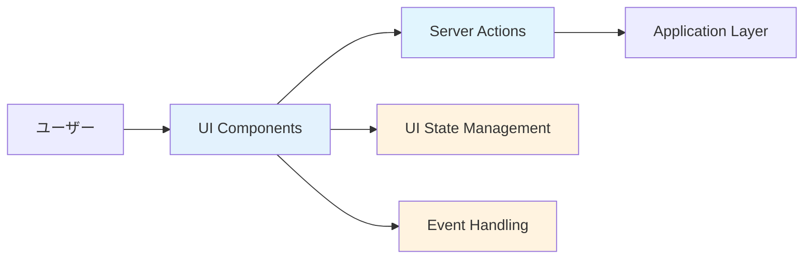
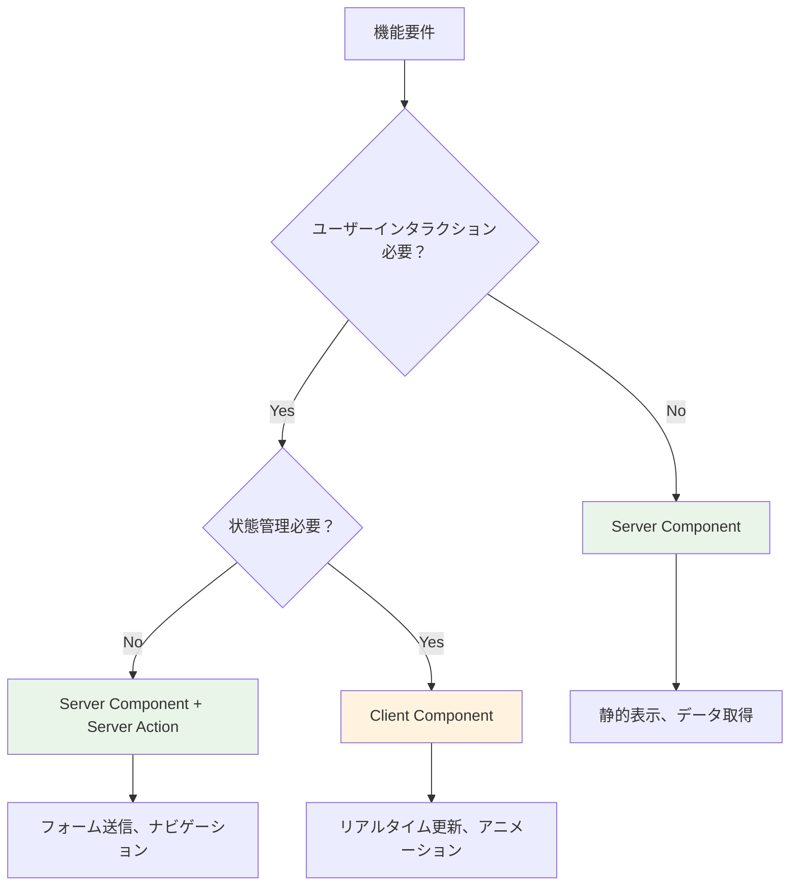
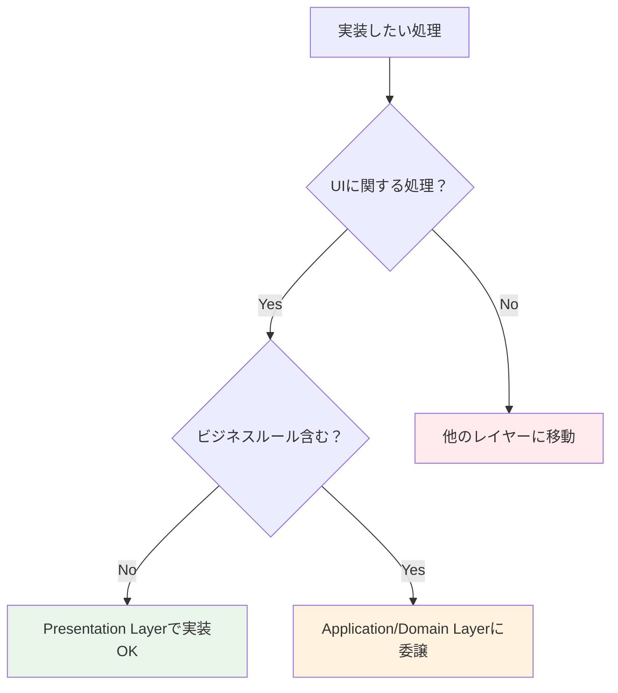

# Presentation Layer 実装ガイド 🎨

このドキュメントでは、Presentation Layer（プレゼンテーション層）での実装ルール、許可される処理、禁止される処理について詳しく解説します。

---

## Presentation Layer の責務 📋

### 基本的な役割



**Presentation Layerの責務：**

1. **ユーザーインターフェースの表示** - データの視覚的表現
2. **ユーザー入力の受付** - フォーム、ボタンクリック等
3. **UI状態の管理** - ローカルなUI状態（開閉状態、選択状態等）
4. **Application Layerへの橋渡し** - Server Actions経由でのUseCase呼び出し

---

## ✅ 書いて良いもの（許可される処理）

### 1. UI状態管理 🎛️

**ローカルなUI状態の管理**

```typescript
// ✅ 許可：UI固有の状態管理
'use client';
export function UserProfileClient() {
  const [isEditing, setIsEditing] = useState(false);
  const [showModal, setShowModal] = useState(false);
  const [selectedTab, setSelectedTab] = useState('profile');
  
  return (
    <div>
      {isEditing ? (
        <EditForm onCancel={() => setIsEditing(false)} />
      ) : (
        <ProfileView onEdit={() => setIsEditing(true)} />
      )}
      
      {showModal && (
        <Modal onClose={() => setShowModal(false)}>
          <ConfirmDialog />
        </Modal>
      )}
    </div>
  );
}
```

**なぜ許可されるのか：**

- UI状態はプレゼンテーション層の責務
- ビジネスロジックに影響しない
- 他のレイヤーに依存しない

### 2. フォームバリデーション（UI用） 📝

**ユーザビリティ向上のためのクライアントサイドバリデーション**

```typescript
// ✅ 許可：UI用のバリデーション
'use client';
export function CreateUserFormClient() {
  const [errors, setErrors] = useState<Record<string, string>>({});
  
  const validateForm = (data: FormData) => {
    const newErrors: Record<string, string> = {};
    
    // UI用の即座フィードバック（ユーザビリティ向上）
    const email = data.get('email') as string;
    if (!email.includes('@')) {
      newErrors.email = 'メールアドレスの形式が正しくありません';
    }
    
    const password = data.get('password') as string;
    if (password.length < 8) {
      newErrors.password = 'パスワードは8文字以上で入力してください';
    }
    
    const name = data.get('name') as string;
    if (name.trim().length < 2) {
      newErrors.name = '名前は2文字以上で入力してください';
    }
    
    setErrors(newErrors);
    return Object.keys(newErrors).length === 0;
  };
  
  const handleSubmit = (formData: FormData) => {
    if (validateForm(formData)) {
      // バリデーション成功時のみServer Actionを実行
      createUserAction(formData);
    }
  };
  
  return (
    <form action={handleSubmit}>
      <input 
        name="email" 
        type="email"
        placeholder="メールアドレス"
      />
      {errors.email && <span className="text-red-500">{errors.email}</span>}
      
      <input 
        name="password" 
        type="password"
        placeholder="パスワード"
      />
      {errors.password && <span className="text-red-500">{errors.password}</span>}
      
      <input 
        name="name" 
        placeholder="名前"
      />
      {errors.name && <span className="text-red-500">{errors.name}</span>}
      
      <button type="submit">登録</button>
    </form>
  );
}
```

**UI用バリデーションの特徴：**

- **即座のフィードバック** - ユーザーが入力中にリアルタイムでエラー表示
- **基本的なフォーマットチェック** - メール形式、文字数制限等
- **ユーザビリティ重視** - UXを向上させるための補助的な役割
- **サーバーサイドバリデーションとの組み合わせ** - 最終的なバリデーションはサーバーサイドで実行

**重要な注意点：**

> **UI用バリデーションは補助的なもの**  
> 最終的なデータ検証は必ずサーバーサイド（Domain Layer）で実行される必要があります。
> クライアントサイドバリデーションはあくまでユーザビリティ向上のためのものです。

### 3. データ表示・フォーマット 📊

**表示用のデータ変換・フォーマット**

```typescript
// ✅ 許可：表示用フォーマット
export function UserListPage({ users }: { users: User[] }) {
  const formatDate = (date: Date) => {
    return new Intl.DateTimeFormat('ja-JP', {
      year: 'numeric',
      month: 'long',
      day: 'numeric'
    }).format(date);
  };
  
  const formatUserLevel = (level: number) => {
    if (level >= 10) return '🏆 マスター';
    if (level >= 5) return '⭐ エキスパート';
    return '🌱 ビギナー';
  };
  
  return (
    <div>
      {users.map(user => (
        <div key={user.id} className="p-4 border rounded">
          <h3>{user.name}</h3>
          <p>レベル: {formatUserLevel(user.level)}</p>
          <p>登録日: {formatDate(user.createdAt)}</p>
        </div>
      ))}
    </div>
  );
}
```

### 4. Server Actions（Application Layer への橋渡し） 🌉

**UseCase呼び出しのためのServer Actions**

```typescript
// ✅ 許可：Server Actions（Application Layerへの橋渡し）
'use server';
export async function createUserAction(formData: FormData) {
  try {
    // フォームデータの抽出（プレゼンテーション層の責務）
    const userData = {
      name: formData.get('name') as string,
      email: formData.get('email') as string,
      password: formData.get('password') as string,
    };
    
    // Application Layerへの委譲
    const createUserUseCase = resolve('CreateUserUseCase');
    const user = await createUserUseCase.execute(userData);
    
    // 成功時のリダイレクト（プレゼンテーション層の責務）
    redirect(`/users/${user.id}`);
    
  } catch (error) {
    // エラーハンドリング（プレゼンテーション層の責務）
    if (error instanceof DomainError) {
      return { error: error.message };
    }
    
    return { error: '予期しないエラーが発生しました' };
  }
}
```

### 5. ルーティング・ナビゲーション 🧭

**ページ遷移・URL管理**

```typescript
// ✅ 許可：ルーティング・ナビゲーション
'use client';
export function NavigationClient() {
  const router = useRouter();
  const pathname = usePathname();
  
  const handleNavigation = (path: string) => {
    router.push(path);
  };
  
  return (
    <nav>
      <button 
        className={`cursor-pointer ${pathname === '/users' ? 'bg-blue-500' : 'bg-gray-200'}`}
        onClick={() => handleNavigation('/users')}
      >
        ユーザー一覧
      </button>
    </nav>
  );
}
```

---

## ❌ 書いてはダメなもの（禁止される処理）

### 1. ビジネスロジック 🚫

**ビジネスルールの実装は禁止**

```typescript
// ❌ 禁止：ビジネスロジックの実装
'use client';
export function UserPromotionClient({ user }: { user: User }) {
  const handlePromote = () => {
    // ❌ ビジネスルールをPresentation Layerに書いてはダメ
    if (user.experiencePoints >= 1000 && user.level < 10) {
      // ❌ 昇格条件の判定はDomain Layerの責務
      promoteUser(user.id);
    }
  };
  
  return <button onClick={handlePromote}>昇格</button>;
}

// ✅ 正しい実装：ビジネスロジックはServer Actionで委譲
'use server';
export async function promoteUserAction(userId: string) {
  const promoteUserUseCase = resolve('PromoteUserUseCase');
  // ビジネスロジックはApplication/Domain Layerに委譲
  await promoteUserUseCase.execute(userId);
}
```

**なぜ禁止なのか：**

- ビジネスルールの変更時に複数箇所の修正が必要になる
- テストが困難になる
- ドメインエキスパートが理解できない場所にビジネスロジックが散在

### 2. データベース直接アクセス 🗄️

**データベースへの直接アクセスは禁止**

```typescript
// ❌ 禁止：データベース直接アクセス
'use server';
export async function getUsersAction() {
  // ❌ Presentation LayerでPrismaを直接使用してはダメ
  const users = await prisma.user.findMany({
    where: { status: 'active' }
  });
  
  return users;
}

// ✅ 正しい実装：Repository経由でアクセス
'use server';
export async function getUsersAction() {
  const getUsersUseCase = resolve('GetUsersUseCase');
  // Infrastructure Layerに委譲
  const users = await getUsersUseCase.execute();
  return users;
}
```

**なぜ禁止なのか：**

- データベース変更の影響がPresentation Layerまで波及
- テスト時にデータベースのモックが必要
- レイヤー間の依存関係が逆転

### 3. 外部API直接呼び出し 🌐

**外部サービスへの直接アクセスは禁止**

```typescript
// ❌ 禁止：外部API直接呼び出し
'use server';
export async function sendEmailAction(email: string, message: string) {
  // ❌ 外部APIを直接呼び出してはダメ
  const response = await fetch('https://api.sendgrid.com/v3/mail/send', {
    method: 'POST',
    headers: {
      'Authorization': `Bearer ${process.env.SENDGRID_API_KEY}`,
      'Content-Type': 'application/json'
    },
    body: JSON.stringify({
      personalizations: [{ to: [{ email }] }],
      from: { email: 'noreply@example.com' },
      subject: 'お知らせ',
      content: [{ type: 'text/plain', value: message }]
    })
  });
  
  return response.json();
}

// ✅ 正しい実装：Infrastructure Layer経由
'use server';
export async function sendEmailAction(email: string, message: string) {
  const sendEmailUseCase = resolve('SendEmailUseCase');
  // Infrastructure Layerに委譲
  await sendEmailUseCase.execute({ email, message });
}
```

### 4. 複雑な計算・アルゴリズム 🧮

**ビジネス計算は禁止**

```typescript
// ❌ 禁止：複雑な計算をPresentation Layerで実装
'use client';
export function PriceCalculatorClient({ items }: { items: Item[] }) {
  const calculateTotal = () => {
    // ❌ 価格計算ロジックはDomain Layerの責務
    let total = 0;
    
    items.forEach(item => {
      let price = item.basePrice;
      
      // ❌ 割引ルールなどのビジネスロジック
      if (item.category === 'premium') {
        price *= 0.9; // 10%割引
      }
      
      if (items.length >= 5) {
        price *= 0.95; // まとめ買い割引
      }
      
      total += price * item.quantity;
    });
    
    return total;
  };
  
  return <div>合計: ¥{calculateTotal()}</div>;
}

// ✅ 正しい実装：計算はDomain Serviceで実装
export function PriceDisplayPage({ items }: { items: Item[] }) {
  // サーバーサイドで計算済みの値を受け取る
  const totalPrice = calculateTotalPrice(items); // Domain Serviceで計算
  
  return <div>合計: ¥{totalPrice}</div>;
}
```

---

## 🎯 実装パターン・ベストプラクティス

### Server Component vs Client Component の使い分け



### 推奨実装パターン

**1. データ取得 + 表示パターン**

```typescript
// ✅ Server Component：データ取得と表示
export default async function UsersPage() {
  // サーバーサイドでデータ取得
  const getUsersUseCase = resolve('GetUsersUseCase');
  const users = await getUsersUseCase.execute();
  
  return (
    <div>
      <h1>ユーザー一覧</h1>
      <UserList users={users} />
      <CreateUserFormClient /> {/* インタラクティブ部分のみClient */}
    </div>
  );
}

// ✅ Server Component：表示専用
function UserList({ users }: { users: User[] }) {
  return (
    <div className="space-y-4">
      {users.map(user => (
        <UserCard key={user.id} user={user} />
      ))}
    </div>
  );
}
```

**2. フォーム処理パターン**

```typescript
// ✅ Server Action：フォーム処理
'use server';
export async function createUserAction(formData: FormData) {
  const userData = {
    name: formData.get('name') as string,
    email: formData.get('email') as string,
  };
  
  const createUserUseCase = resolve('CreateUserUseCase');
  const user = await createUserUseCase.execute(userData);
  
  revalidatePath('/users');
  redirect(`/users/${user.id}`);
}

// ✅ Server Component：フォーム表示
export function CreateUserForm() {
  return (
    <form action={createUserAction} className="space-y-4">
      <input 
        name="name" 
        placeholder="名前" 
        required 
        className="border rounded px-3 py-2"
      />
      <input 
        name="email" 
        type="email" 
        placeholder="メールアドレス" 
        required 
        className="border rounded px-3 py-2"
      />
      <button 
        type="submit" 
        className="bg-blue-500 text-white px-4 py-2 rounded cursor-pointer hover:bg-blue-600"
      >
        作成
      </button>
    </form>
  );
}
```

**3. インタラクティブUIパターン**

```typescript
// ✅ Client Component：状態管理が必要な場合のみ
'use client';
export function UserProfileClient({ initialUser }: { initialUser: User }) {
  const [isEditing, setIsEditing] = useState(false);
  const [user, setUser] = useState(initialUser);
  
  return (
    <div>
      {isEditing ? (
        <EditUserFormClient 
          user={user}
          onSave={(updatedUser) => {
            setUser(updatedUser);
            setIsEditing(false);
          }}
          onCancel={() => setIsEditing(false)}
        />
      ) : (
        <UserProfileView 
          user={user}
          onEdit={() => setIsEditing(true)}
        />
      )}
    </div>
  );
}
```

---

## 🔍 エラーハンドリング

### Server Actions でのエラーハンドリング

```typescript
// ✅ 適切なエラーハンドリング
'use server';
export async function createUserAction(formData: FormData) {
  try {
    const userData = {
      name: formData.get('name') as string,
      email: formData.get('email') as string,
    };
    
    const createUserUseCase = resolve('CreateUserUseCase');
    const user = await createUserUseCase.execute(userData);
    
    revalidatePath('/users');
    redirect(`/users/${user.id}`);
    
  } catch (error) {
    // ドメインエラーの適切な処理
    if (error instanceof DomainError) {
      return {
        error: error.message,
        code: error.code
      };
    }
    
    // 予期しないエラーの処理
    console.error('Unexpected error in createUserAction:', error);
    return {
      error: '予期しないエラーが発生しました。しばらく時間をおいて再度お試しください。'
    };
  }
}
```

### Client Component でのエラー表示

```typescript
// ✅ エラー状態の表示
'use client';
export function CreateUserFormClient() {
  const [error, setError] = useState<string | null>(null);
  const [isSubmitting, setIsSubmitting] = useState(false);
  
  const handleSubmit = async (formData: FormData) => {
    setIsSubmitting(true);
    setError(null);
    
    const result = await createUserAction(formData);
    
    if (result?.error) {
      setError(result.error);
    }
    
    setIsSubmitting(false);
  };
  
  return (
    <form action={handleSubmit}>
      {error && (
        <div className="bg-red-100 border border-red-400 text-red-700 px-4 py-3 rounded mb-4">
          {error}
        </div>
      )}
      
      {/* フォーム要素 */}
      
      <button 
        type="submit" 
        disabled={isSubmitting}
        className="bg-blue-500 text-white px-4 py-2 rounded cursor-pointer hover:bg-blue-600 disabled:opacity-50"
      >
        {isSubmitting ? '作成中...' : '作成'}
      </button>
    </form>
  );
}
```

---

## 📊 パフォーマンス最適化

### 画像最適化

```typescript
// ✅ Next.js Image コンポーネントの使用
import Image from 'next/image';

export function UserAvatar({ user }: { user: User }) {
  return (
    <Image
      src={user.avatarUrl || '/default-avatar.png'}
      alt={`${user.name}のアバター`}
      width={64}
      height={64}
      className="rounded-full cursor-pointer"
      priority={false} // 重要でない画像はfalse
    />
  );
}
```

### 動的インポート

```typescript
// ✅ 重いコンポーネントの遅延読み込み
import dynamic from 'next/dynamic';

const HeavyChartClient = dynamic(
  () => import('./HeavyChartClient'),
  { 
    loading: () => <div className="animate-pulse bg-gray-200 h-64 rounded" />,
    ssr: false 
  }
);

export function DashboardPage() {
  return (
    <div>
      <h1>ダッシュボード</h1>
      <HeavyChartClient />
    </div>
  );
}
```

---

## 🎯 まとめ

### Presentation Layer の原則

1. **UI責務に集中** - 表示、入力受付、UI状態管理のみ
2. **ビジネスロジック禁止** - Application/Domain Layerに委譲
3. **直接アクセス禁止** - DB、外部APIへの直接アクセス禁止
4. **Server Component優先** - 必要最小限のClient Component
5. **適切なエラーハンドリング** - ユーザーフレンドリーなエラー表示

### 判断基準



---

## 関連ドキュメント 📚

### レイヤー間連携

- [Application Layer ガイド](./application-layer.md) - UseCase実装の詳細

### 詳細実装ガイド

- [Server Actions](./components/server-actions.md) - Server Actionsの詳細実装パターン

### 一般的なガイド

- [フロントエンド ベストプラクティス](../../frontend-best-practices.md) - UI実装のベストプラクティス
- [コーディング基準・規約](../../coding-standards.md) - TypeScript・命名規約
