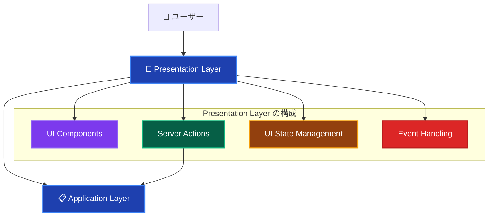
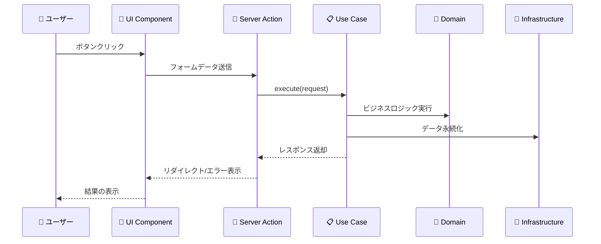
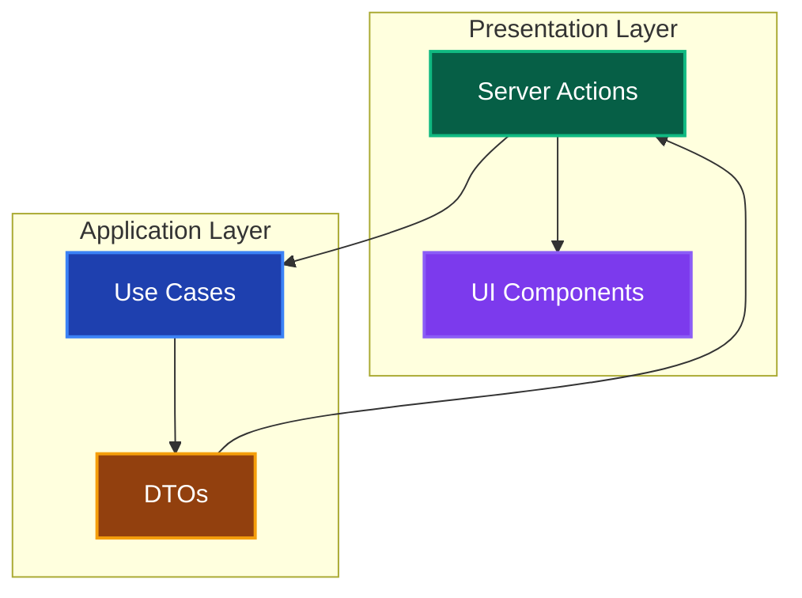

# Presentation Layer（プレゼンテーション層）概要 🎨

このドキュメントでは、Presentation Layer の全体像と他レイヤーとの連携について解説し、各コンポーネントへの案内を提供します。

---

## Presentation Layer の役割 🎭

Presentation Layer は、ユーザーと直接やり取りを行う最上位の層です。ユーザーインターフェースの表示と、ユーザーからの入力を受け取ってApplication Layerへ橋渡しする責務を持ちます。

### 基本的な位置づけ 🗺️


```mermaid
graph TD
    USER[👤 ユーザー] --> PRES[🎨 Presentation Layer]
    PRES --> APP[📋 Application Layer]

    subgraph "Presentation Layer の構成"
        UI[UI Components]
        SA[Server Actions]
        STATE[UI State Management]
        EVENT[Event Handling]
    end

    PRES --> UI
    PRES --> SA
    PRES --> STATE
    PRES --> EVENT

    SA --> APP

    style PRES fill:#1e40af,stroke:#3b82f6,stroke-width:2px,color:#ffffff
    style APP fill:#1e40af,stroke:#3b82f6,stroke-width:2px,color:#ffffff
    style UI fill:#7c3aed,stroke:#8b5cf6,stroke-width:2px,color:#ffffff
    style SA fill:#065f46,stroke:#10b981,stroke-width:2px,color:#ffffff
    style STATE fill:#92400e,stroke:#f59e0b,stroke-width:2px,color:#ffffff
    style EVENT fill:#dc2626,stroke:#b91c1c,stroke-width:2px,color:#ffffff
```

### 他レイヤーとの連携 🤝


```mermaid
sequenceDiagram
    participant User as 👤 ユーザー
    participant UI as 🎨 UI Component
    participant SA as 🌉 Server Action
    participant UC as 📋 Use Case
    participant Domain as 👑 Domain
    participant Infra as 🔧 Infrastructure

    User->>UI: ボタンクリック
    UI->>SA: フォームデータ送信
    SA->>UC: execute(request)
    UC->>Domain: ビジネスロジック実行
    UC->>Infra: データ永続化
    UC-->>SA: レスポンス返却
    SA-->>UI: リダイレクト/エラー表示
    UI-->>User: 結果の表示
```

---

## 🎯 何をするレイヤーか

### 責務 📋

1. **ユーザーインターフェースの提供**

   - 画面の描画とレイアウト
   - ユーザーが操作できる要素の提供
   - レスポンシブデザインの実現

2. **ユーザー操作の受付**

   - フォーム入力の処理
   - ボタンクリックの受付
   - ファイルアップロードの処理

3. **UI状態の管理**

   - モーダルの開閉状態
   - タブの選択状態
   - ローディング状態の表示

4. **データの表示フォーマット**
   - 日付の表示形式変換
   - 数値の表示フォーマット
   - 多言語対応

### 技術的特徴 ⚙️

- **Next.js App Router** を使用
- **Server Components** を基本とし、必要時のみ **Client Components** を使用
- **Server Actions** でApplication Layerと連携
- **TailwindCSS + shadcn/ui** でスタイリング

---

## 🚫 何をしないレイヤーか

### 禁止事項 ❌

1. **ビジネスロジックの実装**

   ```typescript
   // ❌ 禁止：ビジネスルールをPresentation Layerで実装
   const calculateDiscount = (price: number, userLevel: number) => {
    if (userLevel >= 10) return price * 0.2;
    if (userLevel >= 5) return price * 0.1;
    return 0;
   };
   ```

2. **データベース直接アクセス**

   ```typescript
   // ❌ 禁止：Presentation LayerからDB直接アクセス
   import { PrismaClient } from '@prisma/client';

   const prisma = new PrismaClient();
   ```

3. **Domain Layerへの直接依存**

   ```typescript
   // ❌ 禁止：Presentation LayerからDomain Layer直接呼び出し
   import { User } from '@/layers/domain/entities/User';
   const user = User.create(...);
   ```

4. **複雑なバリデーション**

   ```typescript
   // ❌ 禁止：複雑なビジネスルールバリデーション
   const validateBusinessRule = (userData) => {
    // 複雑なビジネスルール... → Domain Layerの責務
   };
   ```

---

## 🔗 他レイヤーとの連携関係

### Application Layer との連携 📋


```mermaid
graph TD
    subgraph "Presentation Layer"
        SA[Server Actions]
        UI[UI Components]
    end

    subgraph "Application Layer"
        UC[Use Cases]
        DTO[DTOs]
    end

    SA --> UC
    UC --> DTO
    DTO --> SA
    SA --> UI

    style SA fill:#065f46,stroke:#10b981,stroke-width:2px,color:#ffffff
    style UI fill:#7c3aed,stroke:#8b5cf6,stroke-width:2px,color:#ffffff
    style UC fill:#1e40af,stroke:#3b82f6,stroke-width:2px,color:#ffffff
    style DTO fill:#92400e,stroke:#f59e0b,stroke-width:2px,color:#ffffff
```

**連携方法：**

- Server Actions から Use Cases を呼び出し
- DTOs を使用してデータを変換
- エラーハンドリングとユーザーへの通知

### Domain Layer との関係 👑

```mermaid
graph TD
    PRES[Presentation Layer] -.-> DOMAIN[Domain Layer]
    PRES --> APP[Application Layer]
    APP --> DOMAIN

    style PRES fill:#1e40af,stroke:#3b82f6,stroke-width:2px,color:#ffffff
    style APP fill:#1e40af,stroke:#3b82f6,stroke-width:2px,color:#ffffff
    style DOMAIN fill:#065f46,stroke:#10b981,stroke-width:2px,color:#ffffff

    classDef forbidden stroke-dasharray: 5 5,stroke:#f44336
    class PRES-->DOMAIN forbidden
```

**重要：** Presentation Layer は Domain Layer に **直接依存してはいけません**。必ずApplication Layer を経由します。

### Infrastructure Layer との関係 🔧

```mermaid
graph TD
    PRES[Presentation Layer] -.-> INFRA[Infrastructure Layer]
    PRES --> APP[Application Layer]
    APP --> INFRA

    style PRES fill:#1e40af,stroke:#3b82f6,stroke-width:2px,color:#ffffff
    style APP fill:#1e40af,stroke:#3b82f6,stroke-width:2px,color:#ffffff
    style INFRA fill:#92400e,stroke:#f59e0b,stroke-width:2px,color:#ffffff

    classDef forbidden stroke-dasharray: 5 5,stroke:#f44336
    class PRES-->INFRA forbidden
```

**重要：** Presentation Layer は Infrastructure Layer にも **直接依存してはいけません**。

---

## 📁 Presentation Layer のコンポーネント

Presentation Layer は以下のコンポーネントで構成されています。
詳細な実装パターンは [Presentation Layer 実装ガイド](../presentation-layer.md) を参照してください。

### 🎨 UI Components（UIコンポーネント）

- **責務**: ユーザーインターフェースの描画と基本的な操作
- **含まれるもの**: React コンポーネント、レイアウト、スタイリング
- **技術**: Next.js App Router、React、TailwindCSS、shadcn/ui
- **詳細**: [フロントエンド ベストプラクティス](../../../frontend-best-practices.md) を参照

### 🌉 [Server Actions（サーバーアクション）](../components/server-actions.md)

- **責務**: フォーム送信やユーザー操作をApplication Layerに橋渡し
- **含まれるもの**: `'use server'` 関数、フォームハンドリング、エラー処理
- **技術**: Next.js Server Actions、TypeScript

### 🎛️ UI State Management（UI状態管理）

- **責務**: ローカルなUI状態の管理（モーダル、タブ、ローディング等）
- **含まれるもの**: `useState`、`useReducer`、UI固有のロジック
- **技術**: React Hooks、TypeScript
- **詳細**: [Presentation Layer 実装ガイド](../presentation-layer.md#ドーナツ構造の採用) を参照

### 🎨 Display Formatters（表示フォーマッター）

- **責務**: データの表示用変換（日付、数値、文字列等）
- **含まれるもの**: フォーマット関数、表示用ヘルパー
- **技術**: TypeScript、Intl API
- **詳細**: [Presentation Layer 実装ガイド](../presentation-layer.md#適切な責務分離) を参照

### 📱 Navigation & Routing（ナビゲーション・ルーティング）

- **責務**: ページ遷移とURL管理
- **含まれるもの**: ルーター操作、リンク生成、パラメータ処理
- **技術**: Next.js App Router
- **詳細**: Next.js公式ドキュメント参照

---

## 🏗️ 実装時の設計指針

### 1. **ドーナツ構造の採用** 🍩

```typescript
// ✅ 推薦：Server Component + Client Component分離
// page.tsx (Server Component)
export default function UserPage() {
  return (
    <div className="container mx-auto p-4">
      <h1>ユーザー管理</h1>
      <UserListClient /> {/* 状態管理が必要な部分のみClient */}
    </div>
  );
}

// UserListClient.tsx (Client Component)
'use client';
export function UserListClient() {
  const [selectedTab, setSelectedTab] = useState('active');
  // ...UI状態管理のロジック
}
```

### 2. **適切な責務分離** ⚖️

```typescript
// ✅ 良い例：表示用フォーマットのみ
export function formatUserCreatedAt(createdAt: Date): string {
 return createdAt.toLocaleDateString('ja-JP', { year: 'numeric', month: 'long', day: 'numeric' });
}

// ❌ 悪い例：ビジネスロジックが混入
export function calculateAndFormatEmailDomain(email: string): string {
 const domain = email.split('@')[1]; // ビジネスロジック（Email Value Objectの責務）
 return `ドメイン: ${domain}`;
}
```

### 3. **適切なエラーハンドリング** 🚨

```typescript
// ✅ 推薦：ユーザーフレンドリーなエラー表示
'use server';
export async function createUserAction(formData: FormData) {
 try {
  const createUserUseCase = resolve('CreateUserUseCase');
  await createUserUseCase.execute(extractUserData(formData));
  redirect('/users');
 } catch (error) {
  if (error instanceof DomainError) {
   return { error: error.message }; // ユーザー向けメッセージ
  }
  return { error: '予期しないエラーが発生しました' };
 }
}
```

---

## 🧪 テスト戦略

### コンポーネントテスト

- **React Testing Library** を使用
- UI の振る舞いに焦点を当てたテスト
- Server Actions のモック化

### E2Eテスト

- **Playwright** を使用
- ユーザーの実際の操作フローを検証
- 複数のレイヤーを通した統合テスト

---

**各コンポーネントの詳細な実装ルールについては、上記のリンク先ドキュメントを参照してください！** 📖
