# 開発フロー 🔄

効率的で品質の高い機能開発のための実践的ワークフロー

---

## 📖 このドキュメントについて

### 🎯 対象読者と利用タイミング

- **新規開発者** - 開発手順の習得時
- **既存メンバー** - 新機能開発の標準手順確認時
- **チームリード** - 品質基準とプロセス確認時

### 📚 前提知識

- **必須**: [アーキテクチャ概要](../../architecture/overview.md) 読了
- **推奨**: [環境セットアップ](../setup.md) 完了
- **参考**: [設計原則](../../architecture/principles.md) | [テスト戦略](../../testing/strategy.md)

### 📍 このドキュメントの使い方

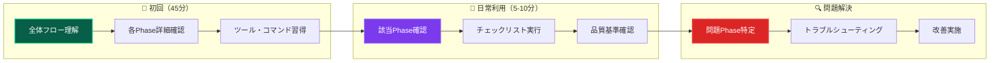

### 🔗 関連ドキュメントとの関係

- **前提**: [最初の機能実装](first-feature.md) - 基本的な実装体験
- **詳細**: [UseCase実装](usecase.md) | [Domain実装](domain.md) | [Repository実装](repository.md)
- **品質**: [テスト戦略](../../testing/strategy.md) | [コーディング規約](../standards/coding.md)
- **問題解決**: [よくある問題](../../troubleshooting/common-issues.md)

---

## 🚀 開発フロー概要

### 標準開発サイクル

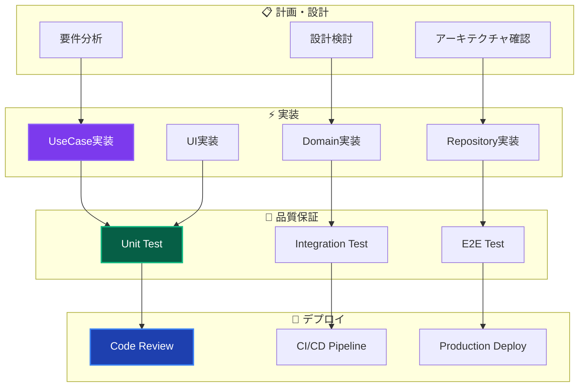

### 開発原則

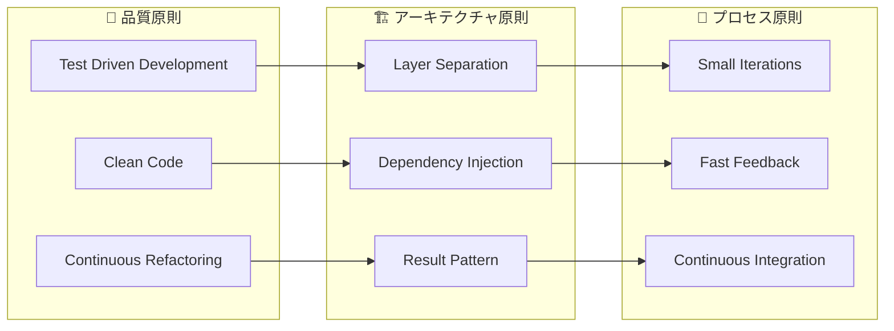

---

## 📋 新機能開発プロセス

### Phase 1: 計画・設計

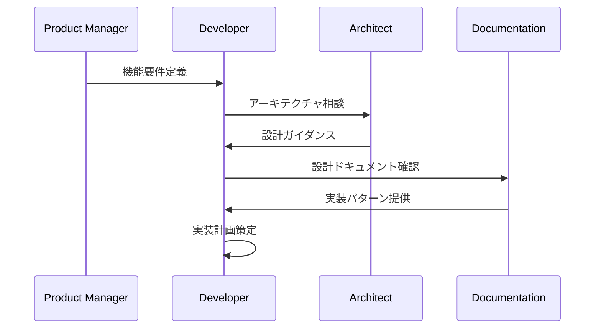

**実施内容：**

- 要件分析とビジネス価値の確認
- 既存アーキテクチャへの適合性検討
- レイヤー責務の明確化
- 必要なインターフェース設計

### Phase 2: ドメイン設計

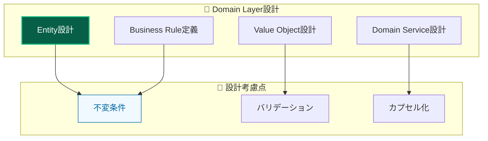

### Phase 3: アプリケーション層実装

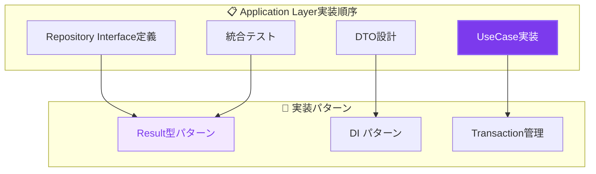

---

## 🛠️ 実装手順詳細

### 1. UseCase First開発

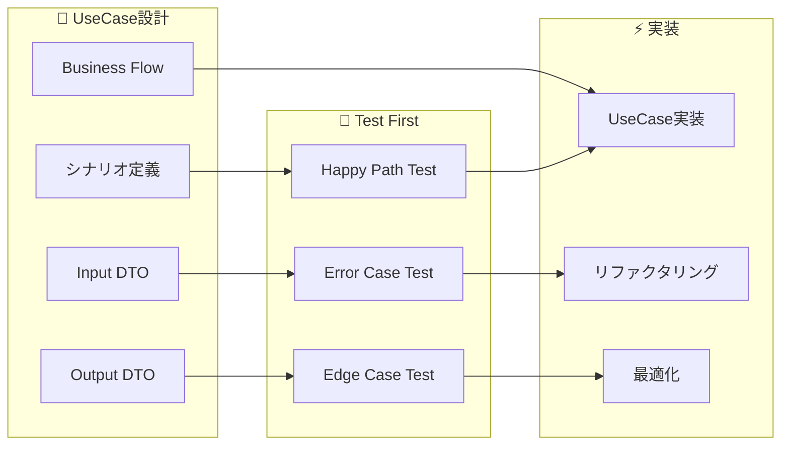

**実装ステップ：**

1. **シナリオ定義**

   - ユーザーストーリーからUseCaseを抽出
   - 成功パスと失敗パスの明確化

2. **テスト作成**

   - Result型パターンでのテスト実装
   - 包括的エラーケースの網羅

3. **UseCase実装**
   - Result型戻り値での統一
   - 適切な依存性注入

### 2. Domain Object実装

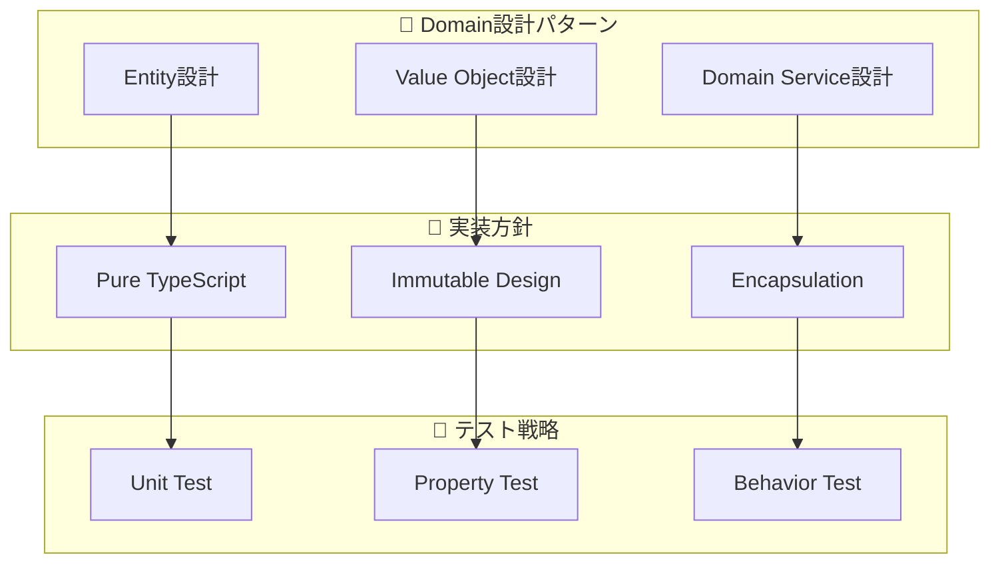

### 3. Infrastructure実装

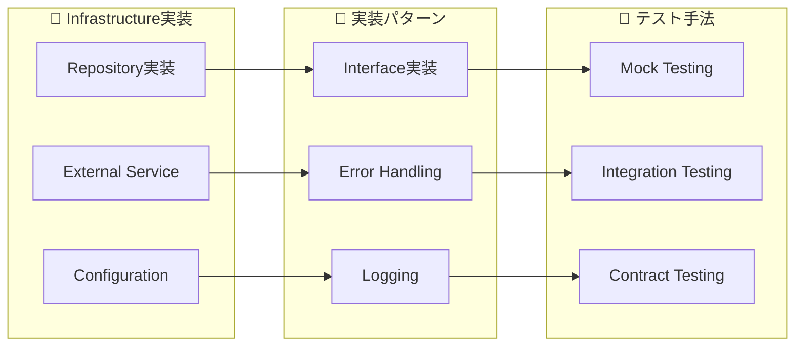

---

## 🧪 品質保証プロセス

### テスト駆動開発 (TDD)

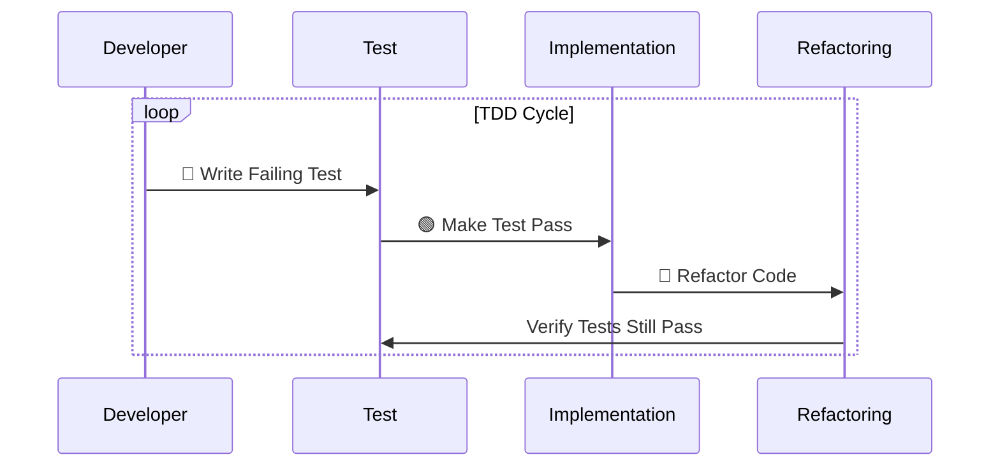

### 品質チェックポイント

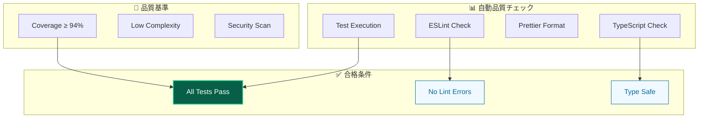

---

## 🔧 DI設定プロセス

### 新しいサービス追加フロー

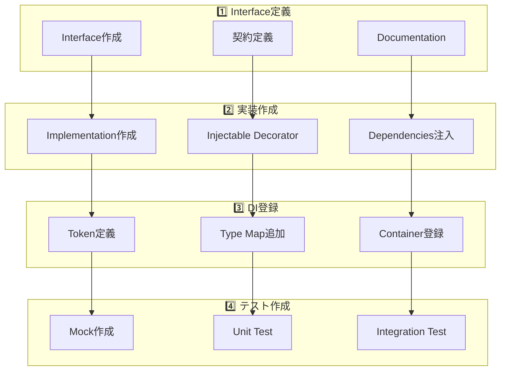

### DI設定チェックリスト

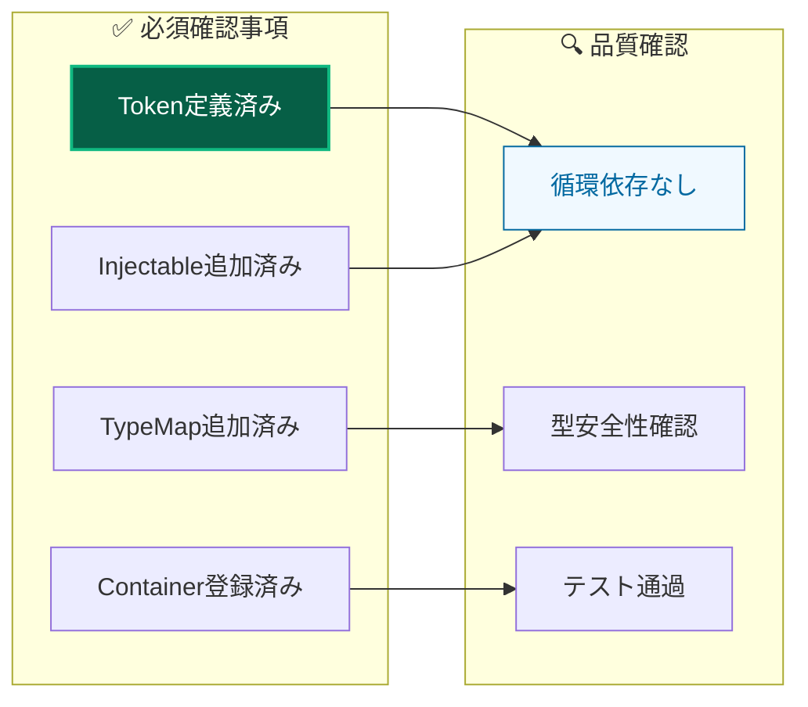

---

## 🎨 UI実装プロセス

### Server-First開発

```mermaid
graph TB
    subgraph "🎨 UI実装優先順位"
        RSC[React Server Components]
        SA[Server Actions]
        CLIENT[Client Components (最小限)]
    end

    subgraph "🔄 実装パターン"
        FORM[Form Handling]
        STATE[State Management]
        ERROR[Error Display]
    end

    subgraph "🧪 テスト戦略"
        COMPONENT[Component Test]
        E2E[E2E Test]
        ACCESSIBILITY[Accessibility Test]
    end

    RSC --> FORM
    SA --> STATE
    CLIENT --> ERROR

    FORM --> COMPONENT
    STATE --> E2E
    ERROR --> ACCESSIBILITY

    style RSC fill:#1e40af,stroke:#3b82f6,stroke-width:2px,color:#ffffff
    style COMPONENT fill:#f0f9ff,stroke:#0369a1,stroke-width:1px,color:#0369a1
```

### Enhanced Components活用

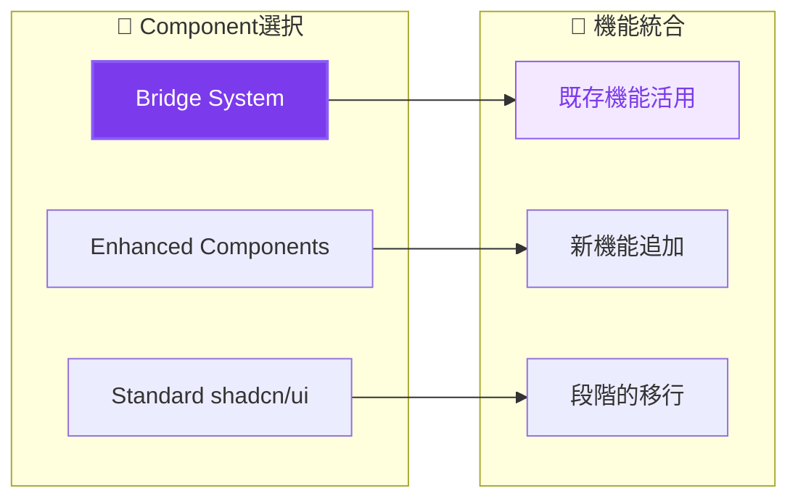

---

## 📊 コード品質管理

### 継続的品質改善

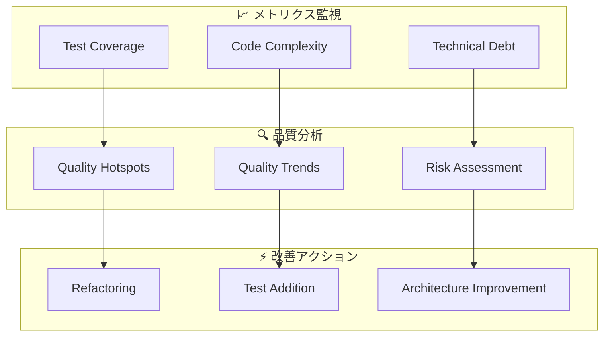

### コードレビュープロセス

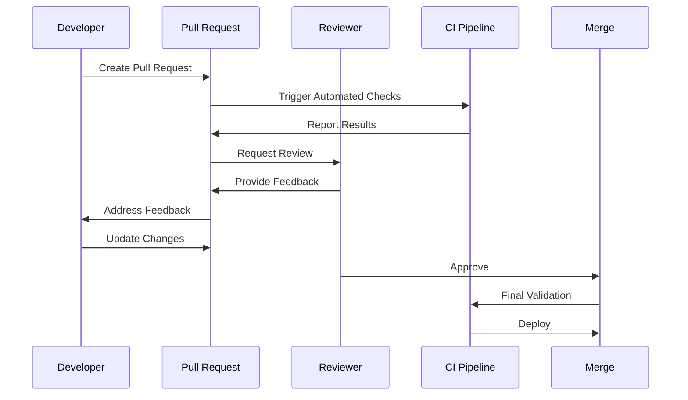

---

## 🚀 デプロイメントフロー

### CI/CD パイプライン

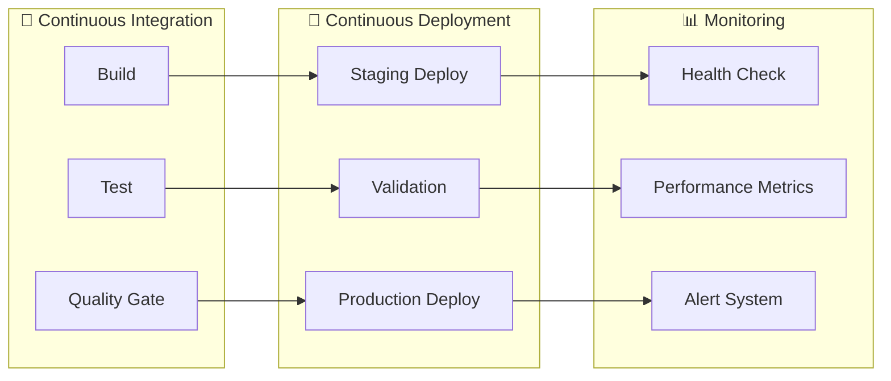

### デプロイメント品質基準

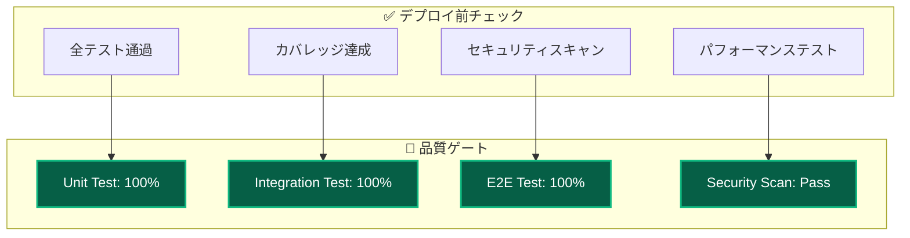

---

## 🔧 開発ツール活用

### 必須開発コマンド

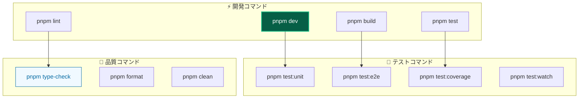

### 開発環境最適化

| ツール        | 目的               | 設定                     | 効果               |
| ------------- | ------------------ | ------------------------ | ------------------ |
| **Turbopack** | 高速ビルド         | Next.js 15統合           | 開発速度向上       |
| **Vitest**    | 高速テスト         | 並列実行、ウォッチモード | 即座フィードバック |
| **ESLint**    | コード品質         | 厳格ルール、自動修正     | 一貫性確保         |
| **Prettier**  | コードフォーマット | 自動整形                 | 可読性向上         |

---

## 📚 学習・成長プロセス

### 段階的スキル習得

```mermaid
graph TB
    subgraph "🌱 初級 (1-2週間)"
        BASIC[基本概念理解]
        SIMPLE[簡単な機能実装]
        TEST_BASIC[基本テスト作成]
    end

    subgraph "🚀 中級 (3-4週間)"
        PATTERN[パターン活用]
        COMPLEX[複雑機能実装]
        QUALITY[品質意識向上]
    end

    subgraph "⭐ 上級 (2-3ヶ月)"
        ARCHITECTURE[アーキテクチャ設計]
        OPTIMIZATION[最適化実装]
        LEADERSHIP[チーム貢献]
    end

    BASIC --> PATTERN
    SIMPLE --> COMPLEX
    TEST_BASIC --> QUALITY

    PATTERN --> ARCHITECTURE
    COMPLEX --> OPTIMIZATION
    QUALITY --> LEADERSHIP
```

### 継続的学習

```mermaid
graph LR
    subgraph "📖 学習リソース"
        DOC[Documentation]
        CODE_REVIEW[Code Review]
        PAIRING[Pair Programming]
    end

    subgraph "🎯 実践練習"
        KATA[Code Kata]
        REFACTOR[Refactoring Exercise]
        DESIGN[Design Exercise]
    end

    subgraph "🤝 知識共有"
        SHARE[Knowledge Sharing]
        MENTOR[Mentoring]
        COMMUNITY[Community Contribution]
    end

    DOC --> KATA
    CODE_REVIEW --> REFACTOR
    PAIRING --> DESIGN

    KATA --> SHARE
    REFACTOR --> MENTOR
    DESIGN --> COMMUNITY
```

---

## 🎯 Phase別次のステップ

### 🚀 **新機能開発を始める方**

```mermaid
graph TB
    subgraph "準備Phase"
        A1[要件確認<br/>business requirements] --> A2[アーキテクチャ適合性<br/>../../architecture/overview.md]
        A2 --> A3[技術選択確認<br/>../../reference/technologies.md]
    end

    subgraph "実装Phase"
        A3 --> B1[UseCase実装<br/>usecase.md]
        B1 --> B2[Domain実装<br/>domain.md]
        B2 --> B3[Repository実装<br/>repository.md]
        B3 --> B4[UI実装<br/>../frontend/components.md]
    end

    style A1 fill:#1e40af,stroke:#3b82f6,stroke-width:2px,color:#ffffff
    style B1 fill:#7c3aed,stroke:#8b5cf6,stroke-width:2px,color:#ffffff
```

### 🧪 **品質向上を目指す方**

```mermaid
graph LR
    subgraph "テスト充実"
        C1[ユニットテスト<br/>../../testing/unit/overview.md] --> C2[自動モック<br/>../../testing/unit/mocking.md]
        C2 --> C3[E2Eテスト<br/>../../testing/e2e/overview.md]
    end

    subgraph "継続改善"
        C3 --> D1[コード品質<br/>../standards/coding.md]
        D1 --> D2[パフォーマンス<br/>../advanced/performance.md]
    end

    style C1 fill:#065f46,stroke:#10b981,stroke-width:2px,color:#ffffff
    style D1 fill:#f59e0b,stroke:#fbbf24,stroke-width:2px,color:#ffffff
```

### 🔧 **問題解決が必要な方**

```mermaid
graph LR
    subgraph "問題特定"
        E1[症状確認<br/>../../troubleshooting/common-issues.md] --> E2[分野別調査<br/>../../troubleshooting/]
    end

    subgraph "解決実施"
        E2 --> F1[修正実装<br/>このワークフロー]
        F1 --> F2[再発防止<br/>../../testing/strategy.md]
    end

    style E1 fill:#dc2626,stroke:#ef4444,stroke-width:2px,color:#ffffff
    style F1 fill:#065f46,stroke:#10b981,stroke-width:2px,color:#ffffff
```

---

## 🔗 詳細クロスリファレンス

### 📋 **開発Phase別必読ドキュメント**

| Phase              | 主要ドキュメント                                     | 関連実装                                                  | 品質確認                                                      | トラブル対応                                                        |
| ------------------ | ---------------------------------------------------- | --------------------------------------------------------- | ------------------------------------------------------------- | ------------------------------------------------------------------- |
| **計画・設計**     | [アーキテクチャ概要](../../architecture/overview.md) | [設計原則](../../architecture/principles.md)              | [設計判断記録](../../architecture/decisions/)                 | [設計相談](../../troubleshooting/development/)                      |
| **Domain実装**     | [Domain実装](domain.md)                              | [エンティティ](../../architecture/layers/domain.md)       | [Value Object](../../architecture/patterns/value-objects.md)  | [Domain問題](../../troubleshooting/development/domain.md)           |
| **UseCase実装**    | [UseCase実装](usecase.md)                            | [Result型](../../architecture/patterns/result-pattern.md) | [DI設定](../../architecture/patterns/dependency-injection.md) | [DI問題](../../troubleshooting/development/dependency-injection.md) |
| **Repository実装** | [Repository実装](repository.md)                      | [インフラ層](../../architecture/layers/infrastructure.md) | [統合テスト](../../testing/integration/)                      | [DB問題](../../troubleshooting/development/database.md)             |
| **UI実装**         | [コンポーネント開発](../frontend/components.md)      | [Server Actions](../frontend/server-actions.md)           | [E2Eテスト](../../testing/e2e/overview.md)                    | [UI問題](../../troubleshooting/frontend/)                           |
| **テスト実装**     | [テスト戦略](../../testing/strategy.md)              | [自動モック](../../testing/unit/mocking.md)               | [カバレッジ確認](../../testing/unit/coverage.md)              | [テスト問題](../../troubleshooting/testing/)                        |

### 🛠️ **実装詳細ガイド**

#### **UseCase開発**

```
前提: [アーキテクチャ理解](../../architecture/overview.md) → [DI理解](../../architecture/patterns/dependency-injection.md)
実装: [UseCase詳細](usecase.md) → [Result型活用](../../architecture/patterns/result-pattern.md)
テスト: [ユニットテスト](../../testing/unit/overview.md) → [モック活用](../../testing/unit/mocking.md)
問題解決: [DI問題](../../troubleshooting/development/dependency-injection.md)
```

#### **Repository開発**

```
前提: [インフラ層理解](../../architecture/layers/infrastructure.md) → [Repository概念](../../architecture/patterns/repository-pattern.md)
実装: [Repository詳細](repository.md) → [Prisma統合](../../reference/configuration/database.md)
テスト: [統合テスト](../../testing/integration/) → [DB テスト](../../testing/integration/database.md)
問題解決: [DB関連問題](../../troubleshooting/development/database.md)
```

#### **UI開発**

```
前提: [プレゼンテーション層](../../architecture/layers/presentation.md) → [UI システム](../frontend/ui-system.md)
実装: [コンポーネント開発](../frontend/components.md) → [Server Actions](../frontend/server-actions.md)
テスト: [E2Eテスト](../../testing/e2e/overview.md) → [UI テスト](../../testing/e2e/ui-testing.md)
問題解決: [フロントエンド問題](../../troubleshooting/frontend/)
```

### 🔧 **ツール・コマンド活用**

| 開発段階       | 主要コマンド         | 詳細ガイド                                           | 最適化                                             |
| -------------- | -------------------- | ---------------------------------------------------- | -------------------------------------------------- |
| **開発開始**   | `pnpm dev`           | [環境セットアップ](../setup.md)                      | [開発効率化](../advanced/productivity.md)          |
| **実装中**     | `pnpm test:watch`    | [テスト実行](../../testing/unit/overview.md)         | [ウォッチモード](../../testing/unit/watch-mode.md) |
| **品質確認**   | `pnpm test:coverage` | [カバレッジ分析](../../testing/unit/coverage.md)     | [品質指標](../standards/quality.md)                |
| **統合確認**   | `pnpm test:e2e:ui`   | [E2E テスト](../../testing/e2e/overview.md)          | [UI Mode活用](../../testing/e2e/ui-mode.md)        |
| **デプロイ前** | `pnpm build`         | [ビルド設定](../../reference/configuration/build.md) | [最適化設定](../advanced/build-optimization.md)    |

### 📚 **学習リソース**

#### **レベル別推奨学習パス**

- **初心者**: [最初の機能実装](first-feature.md) → [基本パターン習得](../../architecture/patterns/basic/)
- **中級者**: このドキュメント → [高度な実装](../advanced/) → [最適化手法](../advanced/optimization/)
- **上級者**: [アーキテクチャ拡張](../../architecture/advanced/) → [チーム開発](../team/)

#### **継続的スキル向上**

- **日次**: [コーディング規約](../standards/coding.md) 確認
- **週次**: [テスト品質](../../testing/strategy.md) 見直し
- **月次**: [アーキテクチャ原則](../../architecture/principles.md) 振り返り

---

## 💡 効率化のコツ

### 🚀 **開発速度向上**

1. **テンプレート活用** - [コードテンプレート](../templates/) で定型作業削減
2. **自動化推進** - [開発ツール](../../reference/tools.md) でルーチン作業自動化
3. **品質向上** - [Lint・フォーマット](../standards/formatting.md) で修正時間削減

### 🎯 **品質安定化**

1. **TDD実践** - [テスト駆動開発](../../testing/tdd.md) で設計品質向上
2. **継続リファクタリング** - [リファクタリング手法](../advanced/refactoring.md) で保守性向上
3. **定期レビュー** - [コードレビュー](../team/code-review.md) で知識共有

### 🔄 **継続改善**

1. **振り返り実施** - 開発プロセスの定期見直し
2. **メトリクス活用** - [品質指標](../standards/quality.md) による客観的評価
3. **チーム学習** - [知識共有](../team/knowledge-sharing.md) で全体底上げ

---

**🔄 このワークフローにより、効率的で高品質な機能開発を実現しましょう！**
