# 開発フロー 🔄

効率的で品質の高い機能開発のための実践的ワークフロー

---

## 📖 このドキュメントについて

### 🎯 対象読者と利用タイミング

- **新規開発者** - 開発手順の習得時
- **既存メンバー** - 新機能開発の標準手順確認時
- **チームリード** - 品質基準とプロセス確認時

### 📚 前提知識

- **必須**: [アーキテクチャ概要](../../architecture/overview.md) 読了
- **推奨**: CLAUDE.md のQuick Startセクション参照
- **参考**: [設計原則](../../architecture/principles.md) | [テスト戦略](../../testing/strategy.md)

### 📍 このドキュメントの使い方

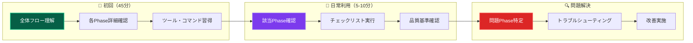
```mermaid
graph LR
    subgraph "🚀 初回（45分）"
        A1[全体フロー理解] --> A2[各Phase詳細確認] --> A3[ツール・コマンド習得]
    end

    subgraph "🔄 日常利用（5-10分）"
        B1[該当Phase確認] --> B2[チェックリスト実行] --> B3[品質基準確認]
    end

    subgraph "🔍 問題解決"
        C1[問題Phase特定] --> C2[トラブルシューティング] --> C3[改善実施]
    end

    A3 --> B1
    B3 --> C1

    style A1 fill:#065f46,stroke:#10b981,stroke-width:2px,color:#ffffff
    style B1 fill:#7c3aed,stroke:#8b5cf6,stroke-width:2px,color:#ffffff
    style C1 fill:#dc2626,stroke:#ef4444,stroke-width:2px,color:#ffffff
```

### 🔗 関連ドキュメントとの関係

- **詳細**: [UseCase実装](../ddd/layers/components/use-cases.md) | [Domain実装](../ddd/layers/domain-layer.md) | [Repository実装](../ddd/layers/components/repository-implementations.md)
- **品質**: [テスト戦略](../../testing/strategy.md) | [コーディング規約](../standards/coding.md)
- **問題解決**: [よくある問題](../../troubleshooting/common-issues.md)

---

## 🚀 開発フロー概要

### 標準開発サイクル

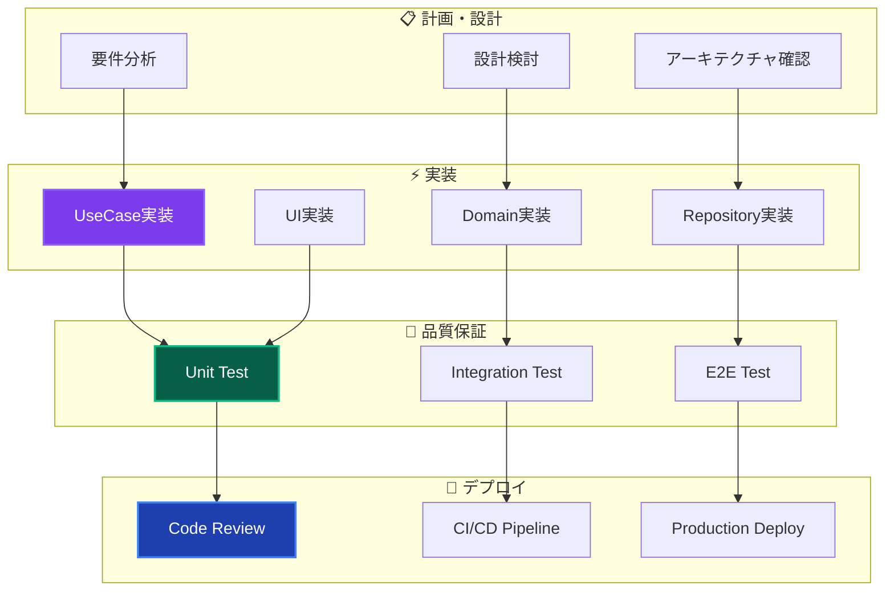
```mermaid
graph TB
    subgraph "📋 計画・設計"
        PLAN[要件分析]
        DESIGN[設計検討]
        ARCH[アーキテクチャ確認]
    end

    subgraph "⚡ 実装"
        UC[UseCase実装]
        DOMAIN[Domain実装]
        REPO[Repository実装]
        UI[UI実装]
    end

    subgraph "🧪 品質保証"
        UNIT[Unit Test]
        INTEGRATION[Integration Test]
        E2E[E2E Test]
    end

    subgraph "🚢 デプロイ"
        REVIEW[Code Review]
        CI[CI/CD Pipeline]
        DEPLOY[Production Deploy]
    end

    PLAN --> UC
    DESIGN --> DOMAIN
    ARCH --> REPO

    UC --> UNIT
    DOMAIN --> INTEGRATION
    REPO --> E2E
    UI --> UNIT

    UNIT --> REVIEW
    INTEGRATION --> CI
    E2E --> DEPLOY

    style UC fill:#7c3aed,stroke:#8b5cf6,stroke-width:2px,color:#ffffff
    style UNIT fill:#065f46,stroke:#10b981,stroke-width:2px,color:#ffffff
    style REVIEW fill:#1e40af,stroke:#3b82f6,stroke-width:2px,color:#ffffff
```

### 開発原則

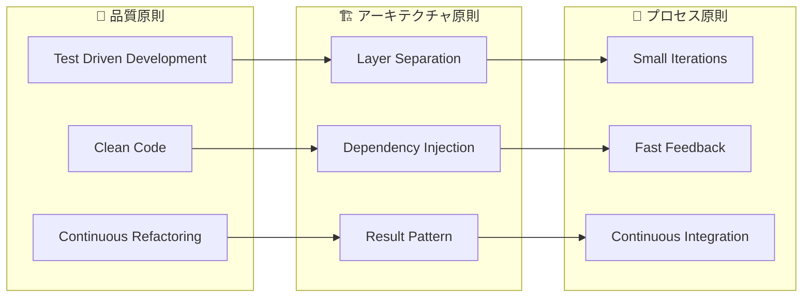
```mermaid
graph LR
    subgraph "🎯 品質原則"
        TDD[Test Driven Development]
        CLEAN[Clean Code]
        REFACTOR[Continuous Refactoring]
    end

    subgraph "🏗️ アーキテクチャ原則"
        LAYER[Layer Separation]
        DI[Dependency Injection]
        RESULT[Result Pattern]
    end

    subgraph "🔄 プロセス原則"
        SMALL[Small Iterations]
        FEEDBACK[Fast Feedback]
        CONTINUOUS[Continuous Integration]
    end

    TDD --> LAYER
    CLEAN --> DI
    REFACTOR --> RESULT

    LAYER --> SMALL
    DI --> FEEDBACK
    RESULT --> CONTINUOUS
```

---

## 🚀 新機能実装：完全フロー

### 📋 Phase 1: 要件分析・設計 (30-60分)

#### Step 1-1: 要件理解と分析

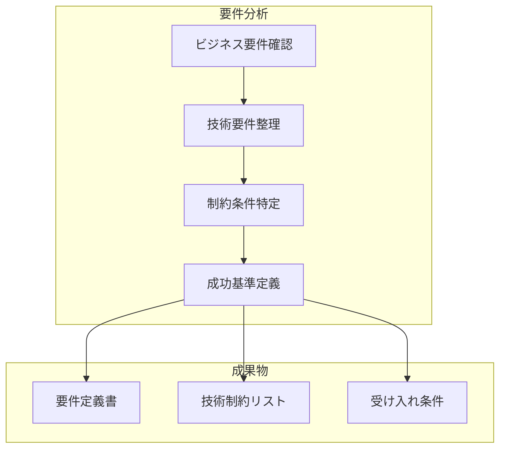
```mermaid
graph TB
    subgraph "要件分析"
        A[ビジネス要件確認] --> B[技術要件整理]
        B --> C[制約条件特定]
        C --> D[成功基準定義]
    end

    subgraph "成果物"
        E[要件定義書]
        F[技術制約リスト]
        G[受け入れ条件]
    end

    D --> E
    D --> F
    D --> G
```

**作業内容:**

1. **ビジネス要件のヒアリング・整理**

   - [ ] 機能の目的・価値の確認
   - [ ] ユーザーストーリーの明確化
   - [ ] 業務フロー・制約条件の把握

2. **技術要件の抽出**
   - [ ] 性能要件（レスポンス時間・スループット）
   - [ ] セキュリティ要件（認証・認可・データ保護）
   - [ ] 可用性要件（稼働率・障害復旧）

**成果確認:**

- [ ] 要件が明確に文書化されている
- [ ] 曖昧な部分がない（必要に応じて再確認）
- [ ] 実装可能性が技術的に確認されている

#### Step 1-2: アーキテクチャ適合性確認

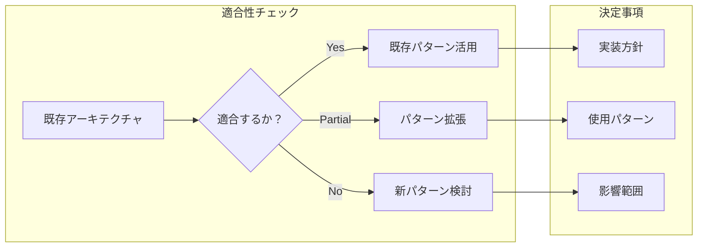
```mermaid
graph LR
    subgraph "適合性チェック"
        A[既存アーキテクチャ] --> B{適合するか？}
        B -->|Yes| C[既存パターン活用]
        B -->|Partial| D[パターン拡張]
        B -->|No| E[新パターン検討]
    end

    subgraph "決定事項"
        F[実装方針]
        G[使用パターン]
        H[影響範囲]
    end

    C --> F
    D --> G
    E --> H
```

**作業内容:**

1. **[アーキテクチャ概要](../../architecture/overview.md) との照合**

   - [ ] 既存レイヤー構成での実現可能性確認
   - [ ] Clean Architecture原則との整合性確認
   - [ ] 依存関係方向の妥当性確認

2. **既存実装との関係分析**
   - [ ] 類似機能の実装パターン調査
   - [ ] 再利用可能なコンポーネント特定
   - [ ] 既存機能への影響範囲評価

**成果確認:**

- [ ] 実装レイヤーと責務が明確化されている
- [ ] 既存システムとの整合性が確認されている
- [ ] 影響範囲と変更ポイントが特定されている

#### Step 1-3: 実装計画策定

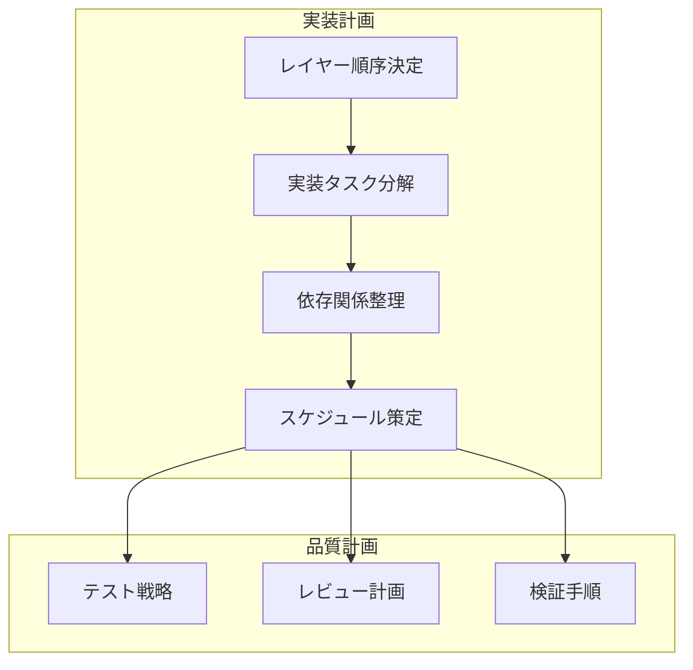
```mermaid
graph TB
    subgraph "実装計画"
        A[レイヤー順序決定] --> B[実装タスク分解]
        B --> C[依存関係整理]
        C --> D[スケジュール策定]
    end

    subgraph "品質計画"
        E[テスト戦略]
        F[レビュー計画]
        G[検証手順]
    end

    D --> E
    D --> F
    D --> G
```

**作業内容:**

1. **実装順序の決定**

   - [ ] [実装判断ガイド](../implementation/decision-guide.md) に基づく順序決定
   - [ ] 新規ドメイン vs 既存拡張の判断
   - [ ] レイヤー間の実装依存関係整理

2. **タスク分解・見積もり**
   - [ ] 各レイヤーの実装タスク詳細化
   - [ ] テスト実装タスクの計画
   - [ ] レビュー・検証ポイントの設定

**成果確認:**

- [ ] 実装順序と各タスクが明確化されている
- [ ] 実装工数の見積もりが適切である
- [ ] テスト・品質保証計画が策定されている

---

### 👑 Phase 2: Domain Layer実装 (60-120分)

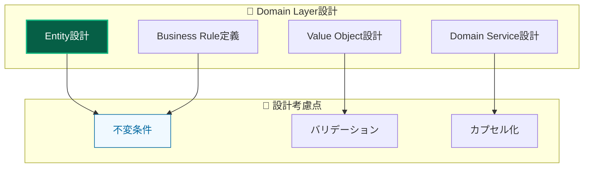
```mermaid
graph TB
    subgraph "👑 Domain Layer設計"
        ENTITY[Entity設計]
        VO[Value Object設計]
        DS[Domain Service設計]
        RULE[Business Rule定義]
    end

    subgraph "🎯 設計考慮点"
        INVARIANT[不変条件]
        VALIDATION[バリデーション]
        ENCAPSULATION[カプセル化]
    end

    ENTITY --> INVARIANT
    VO --> VALIDATION
    DS --> ENCAPSULATION
    RULE --> INVARIANT

    style ENTITY fill:#065f46,stroke:#10b981,stroke-width:2px,color:#ffffff
    style INVARIANT fill:#f0f9ff,stroke:#0369a1,stroke-width:1px,color:#0369a1
```

#### Step 2-1: Value Object設計・実装

**作業内容:**

1. **概念分析・モデリング**

   - [ ] 業務概念の Value Object 抽出
   - [ ] [パターンガイド](../implementation/patterns-guide.md) のValue Objectテンプレート参照
   - [ ] 属性・制約条件・ビジネスルールの整理

2. **実装作業**

   ```typescript
   // 実装例：UserId Value Object
   export class UserId {
    private constructor(private readonly value: string) {}

    static create(value: string): Result<UserId, AppError> {
     // バリデーション実装
    }

    static generate(): UserId {
     // 新ID生成実装
    }

    toString(): string {
     return this.value;
    }
    equals(other: UserId): boolean {
     return this.value === other.value;
    }
   }
   ```

3. **テスト実装**
   - [ ] 正常系テスト（有効な値での作成）
   - [ ] 異常系テスト（バリデーションエラー）
   - [ ] 境界値テスト（最小・最大値）
   - [ ] 等価性テスト（equals メソッド）

**成果確認:**

- [ ] Value Object が [パターンガイド](../implementation/patterns-guide.md) に準拠している
- [ ] 全テストが成功している（カバレッジ90%以上）
- [ ] ビジネスルールが適切に実装されている

#### Step 2-2: Entity設計・実装

**作業内容:**

1. **Entity設計**

   - [ ] 一意識別子（ID）の設計
   - [ ] ライフサイクル管理の設計
   - [ ] 状態変更ルールの定義

2. **実装作業**

   ```typescript
   // 実装例：User Entity
   export class User {
    private constructor(
     private readonly id: UserId,
     private name: UserName,
     private email: Email,
     // ...
    ) {}

    static create(name: UserName, email: Email): Result<User, AppError> {
     // 新規作成ファクトリ
    }

    static reconstruct(/* parameters */): User {
     // 復元ファクトリ（Repository用）
    }

    changeName(newName: UserName): Result<void, AppError> {
     // ビジネスルール付き状態変更
    }
   }
   ```

3. **包括的テスト実装**
   - [ ] 作成ファクトリテスト
   - [ ] 状態変更メソッドテスト
   - [ ] ビジネスルール検証テスト
   - [ ] 不変条件テスト

**成果確認:**

- [ ] Entity が [パターンガイド](../implementation/patterns-guide.md) に準拠している
- [ ] ビジネスルールが適切に実装・テストされている
- [ ] 不変条件が保証されている

#### Step 2-3: Domain Service実装（必要に応じて）

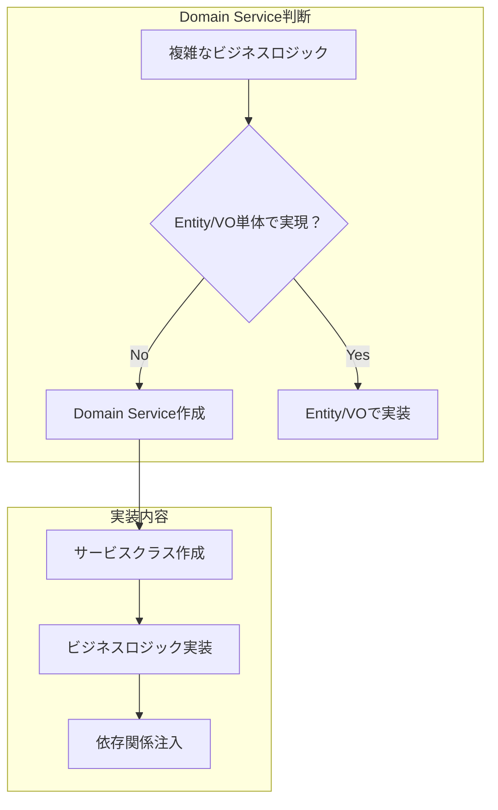
```mermaid
graph TB
    subgraph "Domain Service判断"
        A[複雑なビジネスロジック] --> B{Entity/VO単体で実現？}
        B -->|No| C[Domain Service作成]
        B -->|Yes| D[Entity/VOで実装]
    end

    subgraph "実装内容"
        C --> E[サービスクラス作成]
        E --> F[ビジネスロジック実装]
        F --> G[依存関係注入]
    end
```

**作業内容:**

1. **Domain Service必要性判断**

   - [ ] 複数Entity間のビジネスロジック存在確認
   - [ ] 外部システム連携の必要性確認
   - [ ] ドメイン知識の集約必要性確認

2. **実装作業（必要な場合）**

   ```typescript
   @injectable()
   export class UserDomainService {
    constructor(
     @inject(INJECTION_TOKENS.UserRepository)
     private readonly userRepository: IUserRepository,
    ) {}

    async isDuplicateEmail(email: Email): Promise<boolean> {
     // 複雑なビジネスロジック実装
    }
   }
   ```

**成果確認:**

- [ ] Domain Service の必要性が適切に判断されている
- [ ] 実装した場合、責務が明確で単一責任を守っている

---

### 📋 Phase 3: Application Layer実装 (90-150分)

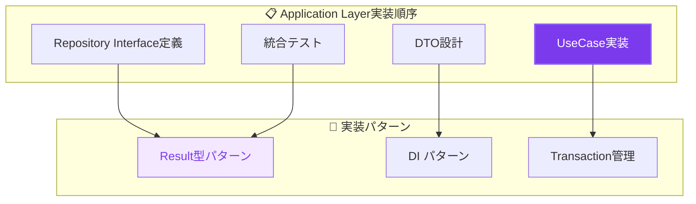
```mermaid
graph TB
    subgraph "📋 Application Layer実装順序"
        INTERFACE[Repository Interface定義]
        DTO[DTO設計]
        USECASE[UseCase実装]
        INTEGRATION[統合テスト]
    end

    subgraph "🎯 実装パターン"
        RESULT_TYPE[Result型パターン]
        DI_PATTERN[DI パターン]
        TRANSACTION[Transaction管理]
    end

    INTERFACE --> RESULT_TYPE
    DTO --> DI_PATTERN
    USECASE --> TRANSACTION
    INTEGRATION --> RESULT_TYPE

    style USECASE fill:#7c3aed,stroke:#8b5cf6,stroke-width:2px,color:#ffffff
    style RESULT_TYPE fill:#f3e8ff,stroke:#8b5cf6,stroke-width:1px,color:#7c3aed
```

#### Step 3-1: DTO設計・実装

**作業内容:**

1. **DTO設計**

   - [ ] UseCase入力・出力の型定義
   - [ ] プリミティブ型による外部境界の設計
   - [ ] レイヤー間データ転送の設計

2. **実装作業**

   ```typescript
   // Request DTO
   export interface CreateUserRequest {
    name: string;
    email: string;
    password: string;
   }

   // Response DTO
   export interface CreateUserResponse {
    userId: string;
    name: string;
    email: string;
    createdAt: string;
   }
   ```

**成果確認:**

- [ ] 必要なDTOが定義されている
- [ ] 型安全性が確保されている
- [ ] レイヤー境界が明確になっている

#### Step 3-2: UseCase実装

**実装ステップ：**

1. **シナリオ定義**

   - ユーザーストーリーからUseCaseを抽出
   - 成功パスと失敗パスの明確化

2. **テスト作成**

   - Result型パターンでのテスト実装
   - 包括的エラーケースの網羅

3. **UseCase クラス実装**

   - [ ] [パターンガイド](../implementation/patterns-guide.md) のUseCaseテンプレート適用
   - [ ] 依存性注入の設定（`@injectable`, `@inject`）
   - [ ] Result型による統一エラーハンドリング

4. **詳細実装**

   ```typescript
   @injectable()
   export class CreateUserUseCase {
    constructor(
     @inject(INJECTION_TOKENS.UserRepository)
     private readonly userRepository: IUserRepository,
     // 他の依存関係...
    ) {}

    async execute(
     request: CreateUserRequest,
    ): Promise<Result<CreateUserResponse, AppError>> {
     // 1. バリデーション
     // 2. ビジネスロジック実行
     // 3. 永続化
     // 4. 結果返却
    }
   }
   ```

5. **包括的テスト実装**
   - [ ] [パターンガイド](../implementation/patterns-guide.md) のテストテンプレート適用
   - [ ] 自動モック（vitest-mock-extended）活用
   - [ ] 成功・失敗・エラーケース網羅

**成果確認:**

- [ ] UseCase が [パターンガイド](../implementation/patterns-guide.md) に準拠している
- [ ] Result型による統一エラーハンドリングが実装されている
- [ ] テストカバレッジが94%以上達成されている

#### Step 3-3: DI設定・統合確認

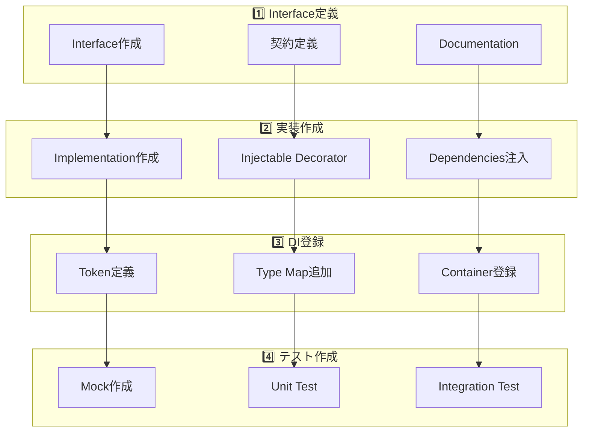
```mermaid
graph TB
    subgraph "1️⃣ Interface定義"
        INTERFACE[Interface作成]
        CONTRACT[契約定義]
        DOC[Documentation]
    end

    subgraph "2️⃣ 実装作成"
        IMPLEMENT[Implementation作成]
        INJECTABLE[Injectable Decorator]
        DEPENDENCIES[Dependencies注入]
    end

    subgraph "3️⃣ DI登録"
        TOKEN[Token定義]
        TYPE_MAP[Type Map追加]
        CONTAINER[Container登録]
    end

    subgraph "4️⃣ テスト作成"
        MOCK[Mock作成]
        UNIT_TEST[Unit Test]
        INTEGRATION_TEST[Integration Test]
    end

    INTERFACE --> IMPLEMENT
    CONTRACT --> INJECTABLE
    DOC --> DEPENDENCIES

    IMPLEMENT --> TOKEN
    INJECTABLE --> TYPE_MAP
    DEPENDENCIES --> CONTAINER

    TOKEN --> MOCK
    TYPE_MAP --> UNIT_TEST
    CONTAINER --> INTEGRATION_TEST
```

**作業内容:**

1. **DI設定実装**

   - [ ] `tokens.ts` にトークンと型定義追加
   - [ ] `applicationContainer.ts` にサービス登録
   - [ ] 循環依存がないことを確認

2. **統合確認**
   - [ ] DIコンテナからのサービス解決テスト
   - [ ] 実際のUseCase実行確認
   - [ ] エラーハンドリング動作確認

**成果確認:**

- [ ] DIコンテナでサービスが正常に解決される
- [ ] 循環依存エラーが発生しない
- [ ] 統合テストが成功している

---

### 🔧 Phase 4: Infrastructure Layer実装 (90-120分)

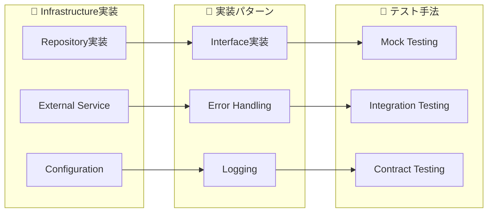
```mermaid
graph LR
    subgraph "🔧 Infrastructure実装"
        REPO_IMPL[Repository実装]
        EXT_SERVICE[External Service]
        CONFIG[Configuration]
    end

    subgraph "🎯 実装パターン"
        INTERFACE_IMPL[Interface実装]
        ERROR_HANDLE[Error Handling]
        LOGGING[Logging]
    end

    subgraph "🧪 テスト手法"
        MOCK[Mock Testing]
        INTEGRATION[Integration Testing]
        CONTRACT[Contract Testing]
    end

    REPO_IMPL --> INTERFACE_IMPL
    EXT_SERVICE --> ERROR_HANDLE
    CONFIG --> LOGGING

    INTERFACE_IMPL --> MOCK
    ERROR_HANDLE --> INTEGRATION
    LOGGING --> CONTRACT
```

#### Step 4-1: Repository Interface定義

**作業内容:**

1. **Interface設計**

   - [ ] ドメイン要件からCRUD操作抽出
   - [ ] 戻り値・引数の型設計
   - [ ] 例外ケースの整理

2. **実装作業**

   ```typescript
   export interface IUserRepository {
    findById(id: UserId): Promise<User | null>;
    findByEmail(email: Email): Promise<User | null>;
    save(user: User): Promise<void>;
    delete(id: UserId): Promise<void>;
   }
   ```

**成果確認:**

- [ ] ドメイン要件を満たすInterface定義
- [ ] Domain層での型安全性確保
- [ ] 実装詳細の適切な隠蔽

#### Step 4-2: Repository実装

**作業内容:**

1. **Repository実装**

   - [ ] [パターンガイド](../implementation/patterns-guide.md) のRepositoryテンプレート適用
   - [ ] ドメインオブジェクト ↔ Prismaデータ変換実装
   - [ ] エラーハンドリング・ログ出力実装

2. **詳細実装**

   ```typescript
   @injectable()
   export class PrismaUserRepository implements IUserRepository {
    constructor(
     @inject(INJECTION_TOKENS.PrismaClient)
     private readonly prisma: PrismaClient,
     @inject(INJECTION_TOKENS.Logger)
     private readonly logger: ILogger,
    ) {}

    async findById(id: UserId): Promise<User | null> {
     // パターンガイドテンプレートに従った実装
    }

    private toDomain(userData: any): User {
     /* 変換ロジック */
    }
    private toPersistence(user: User): any {
     /* 変換ロジック */
    }
   }
   ```

**成果確認:**

- [ ] Repository が [パターンガイド](../implementation/patterns-guide.md) に準拠している
- [ ] データ変換ロジックが正常に動作している
- [ ] エラーハンドリングが適切に実装されている

#### Step 4-3: 統合テスト実装

**作業内容:**

1. **統合テスト実装**
   - [ ] Repository の実際のDB操作テスト
   - [ ] ドメインオブジェクト復元テスト
   - [ ] エラーケース（DB接続失敗等）テスト

**成果確認:**

- [ ] 統合テストがすべて成功している
- [ ] Repository実装の信頼性が確認されている

---

### 🎨 Phase 5: Presentation Layer実装 (60-90分)

```mermaid
graph TB
    subgraph "🎨 UI実装優先順位"
        RSC[React Server Components]
        SA[Server Actions]
        CLIENT[Client Components (最小限)]
    end

    subgraph "🔄 実装パターン"
        FORM[Form Handling]
        STATE[State Management]
        ERROR[Error Display]
    end

    subgraph "🧪 テスト戦略"
        COMPONENT[Component Test]
        E2E[E2E Test]
        ACCESSIBILITY[Accessibility Test]
    end

    RSC --> FORM
    SA --> STATE
    CLIENT --> ERROR

    FORM --> COMPONENT
    STATE --> E2E
    ERROR --> ACCESSIBILITY

    style RSC fill:#1e40af,stroke:#3b82f6,stroke-width:2px,color:#ffffff
    style COMPONENT fill:#f0f9ff,stroke:#0369a1,stroke-width:1px,color:#0369a1
```

#### Step 5-1: Server Actions実装

**作業内容:**

1. **Server Actions実装**

   - [ ] [パターンガイド](../implementation/patterns-guide.md) のServer Actionsテンプレート適用
   - [ ] zodによるフォームバリデーション実装
   - [ ] Result型による結果処理実装

2. **詳細実装**

   ```typescript
   'use server';

   export async function createUserAction(
    prevState: any,
    formData: FormData,
   ): Promise<ActionResult> {
    // パターンガイドに従った実装
   }
   ```

**成果確認:**

- [ ] Server Actions が [パターンガイド](../implementation/patterns-guide.md) に準拠している
- [ ] フォームバリデーションが適切に動作している
- [ ] エラーメッセージが適切に表示されている

#### Step 5-2: UI Component実装・統合

**作業内容:**

1. **UIコンポーネント実装**
   - [ ] React Server Components優先での実装
   - [ ] Server Actions統合
   - [ ] エラー状態・ローディング状態の実装

**成果確認:**

- [ ] UIコンポーネントが正常に動作している
- [ ] Server Actionsとの統合が適切である
- [ ] エラーハンドリングが適切に実装されている

---

### 🧪 Phase 6: テスト・品質保証 (60-90分)

#### Step 6-1: テスト駆動開発 (TDD)

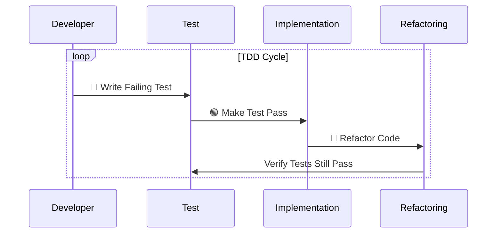
```mermaid
sequenceDiagram
    participant DEV as Developer
    participant TEST as Test
    participant CODE as Implementation
    participant REFACTOR as Refactoring

    loop TDD Cycle
        DEV->>TEST: 🔴 Write Failing Test
        TEST->>CODE: 🟢 Make Test Pass
        CODE->>REFACTOR: 🔵 Refactor Code
        REFACTOR->>TEST: Verify Tests Still Pass
    end
```

#### Step 6-2: E2Eテスト実装

**作業内容:**

1. **E2Eテストシナリオ作成**
   - [ ] ユーザージャーニー全体のテスト設計
   - [ ] [E2Eテストガイド](../e2e-testing-guide.md) 参照
   - [ ] セキュリティ監視テスト（エラー監視等）実装

**成果確認:**

- [ ] E2Eテストが成功している
- [ ] ユーザーシナリオが網羅されている
- [ ] セキュリティ監視が適切に動作している

#### Step 6-3: 品質総合確認

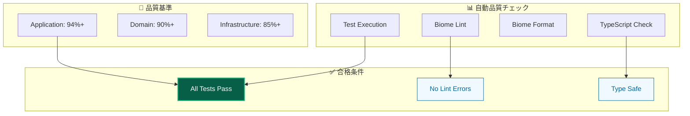
```mermaid
graph TB
    subgraph "📊 自動品質チェック"
        LINT[Biome Lint]
        TYPE[TypeScript Check]
        FORMAT[Biome Format]
        TEST[Test Execution]
    end

    subgraph "🎯 品質基準"
        COVERAGE[Application: 94%+]
        DOMAIN_COV[Domain: 90%+]
        INFRA_COV[Infrastructure: 85%+]
    end

    subgraph "✅ 合格条件"
        ALL_PASS[All Tests Pass]
        NO_LINT[No Lint Errors]
        TYPE_SAFE[Type Safe]
    end

    LINT --> NO_LINT
    TYPE --> TYPE_SAFE
    TEST --> ALL_PASS
    COVERAGE --> ALL_PASS

    style ALL_PASS fill:#065f46,stroke:#10b981,stroke-width:2px,color:#ffffff
    style NO_LINT fill:#f0f9ff,stroke:#0369a1,stroke-width:1px,color:#0369a1
    style TYPE_SAFE fill:#f0f9ff,stroke:#0369a1,stroke-width:1px,color:#0369a1
```

**作業内容:**

1. **包括的品質確認**
   - [ ] `pnpm test:coverage` 実行・カバレッジ確認
   - [ ] `pnpm lint` / `pnpm type-check` 実行
   - [ ] `pnpm test:e2e` 実行・全E2Eテスト成功
   - [ ] パフォーマンス要件確認

**成果確認:**

- [ ] すべてのテストが成功している
- [ ] カバレッジ目標を達成している（Application 94%+, Domain 90%+, Infrastructure 85%+）
- [ ] Lint・型チェックエラーがない

---

## 🔄 継続的改善フロー

### 📊 実装完了後の振り返り

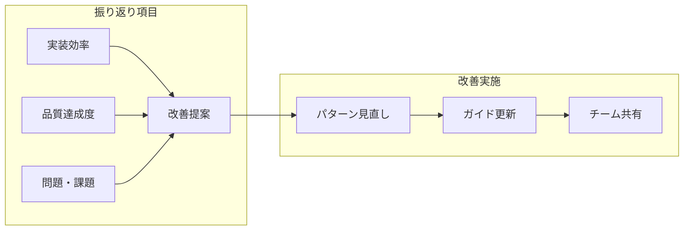
```mermaid
graph LR
    subgraph "振り返り項目"
        A[実装効率] --> D[改善提案]
        B[品質達成度] --> D
        C[問題・課題] --> D
    end

    subgraph "改善実施"
        D --> E[パターン見直し]
        E --> F[ガイド更新]
        F --> G[チーム共有]
    end
```

#### 振り返りチェックリスト

- [ ] **実装効率**: 見積もりと実績の差異分析
- [ ] **品質達成度**: カバレッジ・バグ率の評価
- [ ] **問題・課題**: 実装中に遭遇した困難の整理
- [ ] **パターン改善**: より効率的な実装方法の検討

### 🚀 チーム知識共有

#### 共有項目

1. **効果的パターン**: 実装で効果があったパターン
2. **避けるべき方法**: 問題を引き起こした実装方法
3. **ツール・手法**: 開発効率を上げたツール・手法
4. **品質向上**: 品質向上に寄与した手法

---

## 🚢 デプロイメントフロー

### CI/CD パイプライン

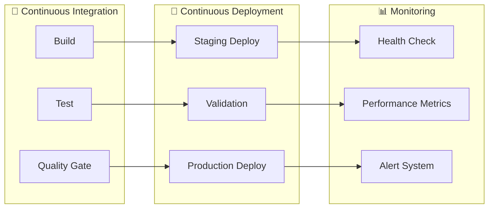
```mermaid
graph LR
    subgraph "🔄 Continuous Integration"
        BUILD[Build]
        TEST[Test]
        QUALITY[Quality Gate]
    end

    subgraph "🚢 Continuous Deployment"
        STAGING[Staging Deploy]
        VALIDATION[Validation]
        PRODUCTION[Production Deploy]
    end

    subgraph "📊 Monitoring"
        HEALTH[Health Check]
        METRICS[Performance Metrics]
        ALERTS[Alert System]
    end

    BUILD --> STAGING
    TEST --> VALIDATION
    QUALITY --> PRODUCTION

    STAGING --> HEALTH
    VALIDATION --> METRICS
    PRODUCTION --> ALERTS
```

### コードレビュープロセス

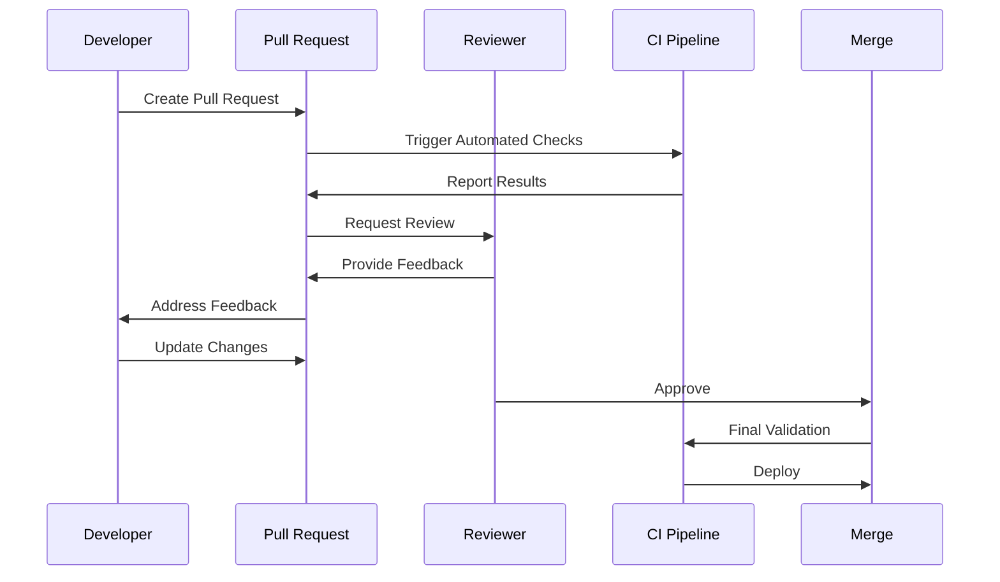
```mermaid
sequenceDiagram
    participant DEV as Developer
    participant PR as Pull Request
    participant REVIEWER as Reviewer
    participant CI as CI Pipeline
    participant MERGE as Merge

    DEV->>PR: Create Pull Request
    PR->>CI: Trigger Automated Checks
    CI->>PR: Report Results
    PR->>REVIEWER: Request Review
    REVIEWER->>PR: Provide Feedback
    PR->>DEV: Address Feedback
    DEV->>PR: Update Changes
    REVIEWER->>MERGE: Approve
    MERGE->>CI: Final Validation
    CI->>MERGE: Deploy
```

### デプロイメント品質基準

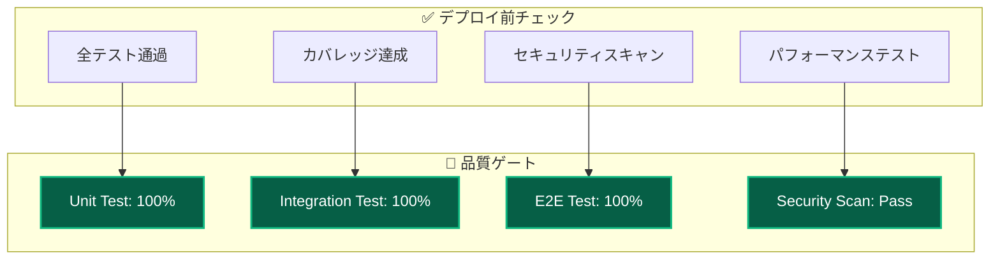
```mermaid
graph TB
    subgraph "✅ デプロイ前チェック"
        ALL_TEST[全テスト通過]
        COVERAGE[カバレッジ達成]
        SECURITY[セキュリティスキャン]
        PERFORMANCE[パフォーマンステスト]
    end

    subgraph "🎯 品質ゲート"
        GATE1[Unit Test: 100%]
        GATE2[Integration Test: 100%]
        GATE3[E2E Test: 100%]
        GATE4[Security Scan: Pass]
    end

    ALL_TEST --> GATE1
    COVERAGE --> GATE2
    SECURITY --> GATE3
    PERFORMANCE --> GATE4

    style GATE1 fill:#065f46,stroke:#10b981,stroke-width:2px,color:#ffffff
    style GATE2 fill:#065f46,stroke:#10b981,stroke-width:2px,color:#ffffff
    style GATE3 fill:#065f46,stroke:#10b981,stroke-width:2px,color:#ffffff
    style GATE4 fill:#065f46,stroke:#10b981,stroke-width:2px,color:#ffffff
```

---

## 🔧 開発ツール活用

### 必須開発コマンド

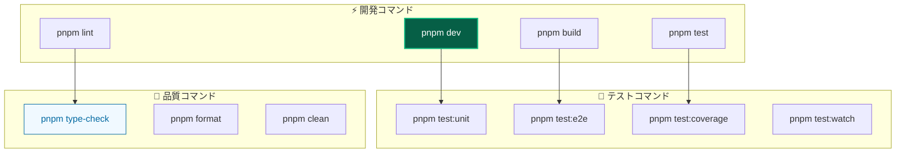
```mermaid
graph TB
    subgraph "⚡ 開発コマンド"
        DEV[pnpm dev]
        BUILD[pnpm build]
        TEST[pnpm test]
        LINT[pnpm lint]
    end

    subgraph "🧪 テストコマンド"
        UNIT[pnpm test:unit]
        E2E[pnpm test:e2e]
        COVERAGE[pnpm test:coverage]
        WATCH[pnpm test:watch]
    end

    subgraph "🔧 品質コマンド"
        TYPE_CHECK[pnpm type-check]
        FORMAT[pnpm format]
        CLEAN[pnpm clean]
    end

    DEV --> UNIT
    BUILD --> E2E
    TEST --> COVERAGE
    LINT --> TYPE_CHECK

    style DEV fill:#065f46,stroke:#10b981,stroke-width:2px,color:#ffffff
    style TYPE_CHECK fill:#f0f9ff,stroke:#0369a1,stroke-width:1px,color:#0369a1
```

### 開発環境最適化

| ツール        | 目的               | 設定                     | 効果               |
| ------------- | ------------------ | ------------------------ | ------------------ |
| **Turbopack** | 高速ビルド         | Next.js 16統合           | 開発速度向上       |
| **Vitest**    | 高速テスト         | 並列実行、ウォッチモード | 即座フィードバック |
| **Biome**     | Lint + Format      | 厳格ルール、自動修正     | 一貫性・可読性向上 |

---

## 📚 学習・成長プロセス

### 段階的スキル習得

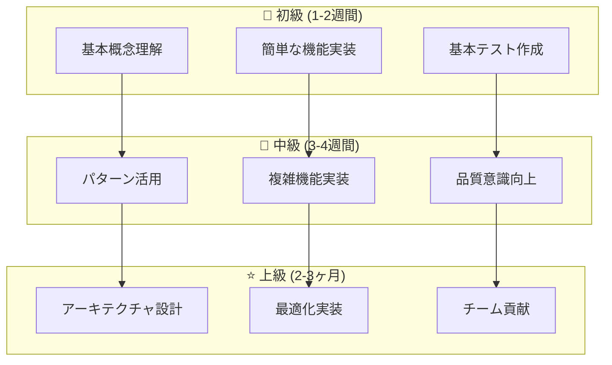
```mermaid
graph TB
    subgraph "🌱 初級 (1-2週間)"
        BASIC[基本概念理解]
        SIMPLE[簡単な機能実装]
        TEST_BASIC[基本テスト作成]
    end

    subgraph "🚀 中級 (3-4週間)"
        PATTERN[パターン活用]
        COMPLEX[複雑機能実装]
        QUALITY[品質意識向上]
    end

    subgraph "⭐ 上級 (2-3ヶ月)"
        ARCHITECTURE[アーキテクチャ設計]
        OPTIMIZATION[最適化実装]
        LEADERSHIP[チーム貢献]
    end

    BASIC --> PATTERN
    SIMPLE --> COMPLEX
    TEST_BASIC --> QUALITY

    PATTERN --> ARCHITECTURE
    COMPLEX --> OPTIMIZATION
    QUALITY --> LEADERSHIP
```

### 継続的学習

```mermaid
graph LR
    subgraph "📖 学習リソース"
        DOC[Documentation]
        CODE_REVIEW[Code Review]
        PAIRING[Pair Programming]
    end

    subgraph "🎯 実践練習"
        KATA[Code Kata]
        REFACTOR[Refactoring Exercise]
        DESIGN[Design Exercise]
    end

    subgraph "🤝 知識共有"
        SHARE[Knowledge Sharing]
        MENTOR[Mentoring]
        COMMUNITY[Community Contribution]
    end

    DOC --> KATA
    CODE_REVIEW --> REFACTOR
    PAIRING --> DESIGN

    KATA --> SHARE
    REFACTOR --> MENTOR
    DESIGN --> COMMUNITY
```

---

## 🎯 Phase別次のステップ

### 🚀 **新機能開発を始める方**

```mermaid
graph TB
    subgraph "準備Phase"
        A1[要件確認<br/>business requirements] --> A2[アーキテクチャ適合性<br/>../../architecture/overview.md]
        A2 --> A3[技術選択確認<br/>../../reference/technologies.md]
    end

    subgraph "実装Phase"
        A3 --> B1[UseCase実装<br/>../ddd/layers/components/use-cases.md]
        B1 --> B2[Domain実装<br/>../ddd/layers/domain-layer.md]
        B2 --> B3[Repository実装<br/>../ddd/layers/components/repository-implementations.md]
        B3 --> B4[UI実装<br/>../ddd/layers/presentation-layer.md]
    end

    style A1 fill:#1e40af,stroke:#3b82f6,stroke-width:2px,color:#ffffff
    style B1 fill:#7c3aed,stroke:#8b5cf6,stroke-width:2px,color:#ffffff
```

### 🧪 **品質向上を目指す方**

```mermaid
graph LR
    subgraph "テスト充実"
        C1[テスト戦略<br/>../../testing/strategy.md] --> C2[自動モック<br/>../../testing/unit/mocking.md]
        C2 --> C3[E2Eテスト<br/>../e2e-testing-guide.md]
    end

    subgraph "継続改善"
        C3 --> D1[コード品質<br/>../standards/coding.md]
        D1 --> D2[コーディング規約<br/>../standards/coding.md]
    end

    style C1 fill:#065f46,stroke:#10b981,stroke-width:2px,color:#ffffff
    style D1 fill:#f59e0b,stroke:#fbbf24,stroke-width:2px,color:#ffffff
```

### 🔧 **問題解決が必要な方**

```mermaid
graph LR
    subgraph "問題特定"
        E1[症状確認<br/>../../troubleshooting/common-issues.md] --> E2[分野別調査<br/>../../troubleshooting/]
    end

    subgraph "解決実施"
        E2 --> F1[修正実装<br/>このワークフロー]
        F1 --> F2[再発防止<br/>../../testing/strategy.md]
    end

    style E1 fill:#dc2626,stroke:#ef4444,stroke-width:2px,color:#ffffff
    style F1 fill:#065f46,stroke:#10b981,stroke-width:2px,color:#ffffff
```

---

## 🔗 詳細クロスリファレンス

### 📋 **開発Phase別必読ドキュメント**

| Phase | 主要ドキュメント | 関連実装 | 品質確認 | トラブル対応 |
| --- | --- | --- | --- | --- |
| **計画・設計** | [アーキテクチャ概要](../../architecture/overview.md) | [設計原則](../../architecture/principles.md) | - | [よくある問題](../../troubleshooting/common-issues.md) |
| **Domain実装** | [Domain層](../ddd/layers/domain-layer.md) | [Entity](../ddd/layers/components/entities.md) | [Value Object](../ddd/layers/components/value-objects.md) | [よくある問題](../../troubleshooting/common-issues.md) |
| **UseCase実装** | [UseCase](../ddd/layers/components/use-cases.md) | [Application層](../ddd/layers/application-layer.md) | [DI設定](../../architecture/patterns/dependency-injection.md) | [よくある問題](../../troubleshooting/common-issues.md) |
| **Repository実装** | [Repository実装](../ddd/layers/components/repository-implementations.md) | [Infrastructure層](../ddd/layers/infrastructure-layer.md) | - | [Prisma問題](../../troubleshooting/development/prisma-mock-setup.md) |
| **UI実装** | [Presentation層](../ddd/layers/presentation-layer.md) | [Server Actions](../ddd/layers/components/server-actions.md) | [E2Eテスト](../e2e-testing-guide.md) | - |
| **テスト実装** | [テスト戦略](../../testing/strategy.md) | [自動モック](../../testing/unit/mocking.md) | - | [vitest-mock設定](../../troubleshooting/development/vitest-mock-extended-setup.md) |

### 🛠️ **実装詳細ガイド**

#### **UseCase開発**

```
前提: [アーキテクチャ理解](../../architecture/overview.md) → [DI理解](../../architecture/patterns/dependency-injection.md)
実装: [UseCase詳細](../ddd/layers/components/use-cases.md) → [エラーハンドリング](../ddd/cross-cutting/error-handling.md)
テスト: [テスト戦略](../../testing/strategy.md) → [モック活用](../../testing/unit/mocking.md)
問題解決: [DI問題](../../troubleshooting/development/dependency-injection.md)
```

#### **Repository開発**

```
前提: [インフラ層理解](../ddd/layers/infrastructure-layer.md) → [Repository Interface](../ddd/layers/components/repository-interfaces.md)
実装: [Repository詳細](../ddd/layers/components/repository-implementations.md)
テスト: [テスト戦略](../../testing/strategy.md)
問題解決: [Prisma問題](../../troubleshooting/development/prisma-mock-setup.md)
```

#### **UI開発**

```
前提: [プレゼンテーション層](../ddd/layers/presentation-layer.md)
実装: [Server Actions](../ddd/layers/components/server-actions.md)
テスト: [E2Eテスト](../e2e-testing-guide.md)
問題解決: [よくある問題](../../troubleshooting/common-issues.md)
```

### 🔧 **ツール・コマンド活用**

| 開発段階       | 主要コマンド         | 詳細ガイド                                           | 関連ドキュメント                                   |
| -------------- | -------------------- | ---------------------------------------------------- | -------------------------------------------------- |
| **開発開始**   | `pnpm dev`           | CLAUDE.md Quick Start参照                            | [コマンドリファレンス](../../reference/commands.md)  |
| **実装中**     | `pnpm test:watch`    | [テスト戦略](../../testing/strategy.md)              | [自動モック](../../testing/unit/mocking.md)         |
| **品質確認**   | `pnpm test:coverage` | [テスト戦略](../../testing/strategy.md)              | [コーディング規約](../standards/coding.md)          |
| **統合確認**   | `pnpm test:e2e:ui`   | [E2E テスト](../e2e-testing-guide.md)                | [テスト戦略](../../testing/strategy.md)             |
| **デプロイ前** | `pnpm build`         | [コマンドリファレンス](../../reference/commands.md)  | [トラブルシューティング](../../troubleshooting/common-issues.md) |

### 📚 **学習リソース**

#### **レベル別推奨学習パス**

- **初心者**: [アーキテクチャ概要](../../architecture/overview.md) → [DDD概念](../ddd/concepts/domain-driven-design.md)
- **中級者**: このドキュメント → [UseCase実装](../ddd/layers/components/use-cases.md) → [テスト戦略](../../testing/strategy.md)
- **上級者**: [設計原則](../../architecture/principles.md) → [DI設定](../../architecture/patterns/dependency-injection.md)

#### **継続的スキル向上**

- **日次**: [コーディング規約](../standards/coding.md) 確認
- **週次**: [テスト品質](../../testing/strategy.md) 見直し
- **月次**: [アーキテクチャ原則](../../architecture/principles.md) 振り返り

---

## 💡 効率化のコツ

### 🚀 **開発速度向上**

1. **テンプレート活用** - 実装パターンの再利用で定型作業削減
2. **自動化推進** - [コマンドリファレンス](../../reference/commands.md) でルーチン作業自動化
3. **品質向上** - [コーディング規約](../standards/coding.md) で修正時間削減

### 🎯 **品質安定化**

1. **TDD実践** - [テスト戦略](../../testing/strategy.md) で設計品質向上
2. **継続リファクタリング** - クリーンコード原則で保守性向上
3. **定期レビュー** - コードレビューで知識共有

### 🔄 **継続改善**

1. **振り返り実施** - 開発プロセスの定期見直し
2. **メトリクス活用** - カバレッジ確認による客観的評価
3. **チーム学習** - プロジェクト固有ドキュメント（`_DOCS/` の外）の更新で知識共有

---

**🔄 このワークフローにより、効率的で高品質な機能開発を実現しましょう！**
